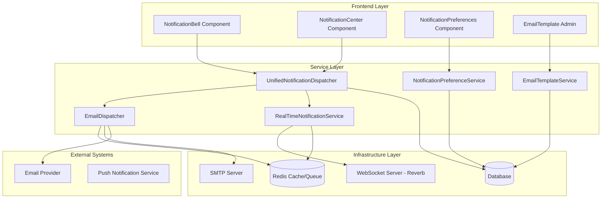
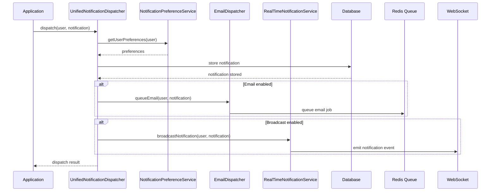

# Design Document

## Overview

The Email and Notification System Enhancement for ICTServe v3.6.1 builds upon the existing notification infrastructure to provide a comprehensive, tested, and user-friendly communication system. The design focuses on improving reliability, user experience, accessibility, and maintainability while leveraging the current Laravel-based architecture.

The system implements a multi-channel notification approach with database storage, email delivery, and real-time broadcasting through WebSockets. It includes sophisticated email templating, user preference management, comprehensive logging, and robust error handling mechanisms.

## Architecture

### High-Level Architecture



### Component Interaction Flow



## Components and Interfaces

### Core Services

#### UnifiedNotificationDispatcher

The central orchestrator for all notification operations, enhanced with additional capabilities:

```php
interface UnifiedNotificationDispatcherInterface
{
    public function dispatch(
        User $user,
        Notification $notification,
        ?Mailable $mailable = null,
        array $meta = [],
        ?string $notificationType = null,
        ?string $priority = null
    ): array;
    
    public function dispatchToMany(
        iterable $users,
        Notification $notification,
        ?Mailable $mailable = null,
        array $meta = [],
        ?string $notificationType = null,
        ?string $priority = null
    ): array;
    
    public function scheduleNotification(
        User $user,
        Notification $notification,
        Carbon $scheduledAt,
        array $meta = []
    ): string;
    
    public function cancelScheduledNotification(string $scheduleId): bool;
    
    public function getDispatchStatistics(): array;
}
```

#### Enhanced EmailDispatcher

Extended email service with advanced features:

```php
interface EmailDispatcherInterface
{
    public function queue(
        Mailable $mailable,
        string $to,
        string $name,
        array $meta = [],
        string $type = 'general',
        array $channels = ['email'],
        ?string $priority = null,
        bool $bypassPreferences = false
    ): EmailLog;
    
    public function queueBulk(
        Mailable $mailable,
        array $recipients,
        array $meta = [],
        string $type = 'bulk',
        ?string $priority = null
    ): array;
    
    public function preview(
        Mailable $mailable,
        array $data = []
    ): string;
    
    public function validateEmail(string $email): bool;
    
    public function getDeliveryMetrics(
        ?Carbon $from = null,
        ?Carbon $to = null
    ): array;
}
```

#### EmailTemplateService

Comprehensive template management:

```php
interface EmailTemplateServiceInterface
{
    public function getTemplate(
        string $category,
        string $locale = 'ms'
    ): ?EmailTemplate;
    
    public function renderTemplate(
        EmailTemplate $template,
        array $variables = [],
        string $locale = 'ms'
    ): string;
    
    public function validateTemplate(
        string $content,
        array $requiredVariables = []
    ): array;
    
    public function previewTemplate(
        EmailTemplate $template,
        array $sampleData = [],
        string $locale = 'ms'
    ): string;
    
    public function createVersion(
        EmailTemplate $template,
        string $content,
        string $locale
    ): EmailTemplateVersion;
}
```

#### NotificationPreferenceService

Enhanced preference management:

```php
interface NotificationPreferenceServiceInterface
{
    public function getUserPreferences(User $user): NotificationPreferences;
    
    public function updatePreferences(
        User $user,
        array $preferences
    ): NotificationPreferences;
    
    public function shouldSendNotification(
        User $user,
        string $type,
        string $channel,
        ?string $priority = null
    ): bool;
    
    public function setQuietHours(
        User $user,
        string $start,
        string $end,
        array $timezone = null
    ): void;
    
    public function bulkUpdatePreferences(
        array $userIds,
        array $preferences
    ): array;
}
```

### Frontend Components

#### Enhanced NotificationBell

Real-time notification bell with improved UX:

```php
class NotificationBell extends Component
{
    public int $unreadCount = 0;
    public array $recentNotifications = [];
    public bool $showDropdown = false;
    public string $activeCategory = 'all';
    public array $categories = [];
    
    // Real-time methods
    public function refreshNotifications(): void;
    public function loadNotifications(): void;
    public function markAsRead(string $notificationId): void;
    public function markAllAsRead(): void;
    public function setCategory(string $category): void;
    
    // WebSocket listeners
    #[On('echo-private:user.{userId},notification.created')]
    public function handleNewNotification($event): void;
    
    #[On('echo-private:user.{userId},notification.read')]
    public function handleNotificationRead($event): void;
}
```

#### Enhanced NotificationCenter

Full-featured notification management interface:

```php
class NotificationCenter extends Component
{
    public Collection $notifications;
    public array $selectedNotifications = [];
    public string $searchQuery = '';
    public array $filters = [];
    public string $sortBy = 'created_at';
    public string $sortDirection = 'desc';
    
    // Management methods
    public function search(): void;
    public function applyFilters(): void;
    public function bulkMarkAsRead(): void;
    public function bulkDelete(): void;
    public function exportNotifications(): void;
    
    // Pagination
    public function loadMore(): void;
    public function gotoPage(int $page): void;
}
```

## Data Models

### Enhanced EmailLog Model

```php
class EmailLog extends Model
{
    protected $fillable = [
        'to_email',
        'to_name',
        'subject',
        'mailable_class',
        'status',
        'priority',
        'channels',
        'metadata',
        'queued_at',
        'sent_at',
        'delivered_at',
        'opened_at',
        'clicked_at',
        'bounced_at',
        'failed_at',
        'retry_count',
        'error_message',
        'tracking_id',
        'campaign_id'
    ];
    
    protected $casts = [
        'channels' => 'array',
        'metadata' => 'encrypted:array',
        'queued_at' => 'datetime',
        'sent_at' => 'datetime',
        'delivered_at' => 'datetime',
        'opened_at' => 'datetime',
        'clicked_at' => 'datetime',
        'bounced_at' => 'datetime',
        'failed_at' => 'datetime'
    ];
}
```

### EmailTemplate Model

```php
class EmailTemplate extends Model implements Auditable
{
    protected $fillable = [
        'name',
        'category',
        'subject_ms',
        'subject_en',
        'content_ms',
        'content_en',
        'variables',
        'is_active',
        'version',
        'created_by',
        'updated_by'
    ];
    
    protected $casts = [
        'variables' => 'array',
        'is_active' => 'boolean'
    ];
    
    public function versions(): HasMany;
    public function creator(): BelongsTo;
    public function updater(): BelongsTo;
}
```

### NotificationPreferences Model

```php
class NotificationPreferences extends Model
{
    protected $fillable = [
        'user_id',
        'email_enabled',
        'database_enabled',
        'broadcast_enabled',
        'preferences',
        'quiet_hours_start',
        'quiet_hours_end',
        'timezone',
        'frequency_settings'
    ];
    
    protected $casts = [
        'email_enabled' => 'boolean',
        'database_enabled' => 'boolean',
        'broadcast_enabled' => 'boolean',
        'preferences' => 'encrypted:array',
        'frequency_settings' => 'array'
    ];
    
    public function user(): BelongsTo;
}
```

## Correctness Properties

*A property is a characteristic or behavior that should hold true across all valid executions of a system-essentially, a formal statement about what the system should do. Properties serve as the bridge between human-readable specifications and machine-verifiable correctness guarantees.*

### Email System Properties

**Property 1: Email logging completeness**
*For any* email dispatch attempt, a corresponding EmailLog entry should be created with complete metadata including status, timestamp, and delivery information
**Validates: Requirements 1.1**

**Property 2: Email retry exponential backoff**
*For any* failed email delivery, retry attempts should follow exponential backoff timing with delays increasing by a factor of 2 for each subsequent retry
**Validates: Requirements 1.2**

**Property 3: Email template localization**
*For any* email template and supported locale (ms, en), the template should render correctly with appropriate language-specific content and formatting
**Validates: Requirements 1.3**

**Property 4: Administrator notification on max retries**
*For any* email that fails after reaching maximum retry attempts, an administrator notification should be automatically generated and dispatched
**Validates: Requirements 1.4**

**Property 5: Email validation before delivery**
*For any* email address provided to the system, only addresses that pass RFC 5322 validation should proceed to the delivery queue
**Validates: Requirements 1.6**

**Property 6: Email queue priority ordering**
*For any* set of queued emails with different priority levels, emails should be processed in order: critical, high, normal, low
**Validates: Requirements 1.7**

### Notification Dispatcher Properties

**Property 7: Multi-channel notification dispatch**
*For any* notification dispatch request, the notification should appear in all enabled channels (database, email, broadcast) according to user preferences
**Validates: Requirements 2.1**

**Property 8: User preference respect**
*For any* notification dispatch to a user with specific channel preferences, notifications should only be sent through channels that are enabled in the user's preferences
**Validates: Requirements 2.2**

**Property 9: Critical notification override**
*For any* notification marked as critical priority, it should be delivered through all channels regardless of user preference settings
**Validates: Requirements 2.3**

**Property 10: Notification dispatch error logging**
*For any* notification dispatch that fails, detailed error information including timestamp, user ID, notification type, and failure reason should be logged
**Validates: Requirements 2.4**

**Property 11: Bulk notification delivery**
*For any* bulk notification dispatch to multiple users, each user should receive the notification according to their individual preferences
**Validates: Requirements 2.5**

### Frontend Component Properties

**Property 12: Notification bell count accuracy**
*For any* user with unread notifications, the notification bell should display the exact count of unread notifications
**Validates: Requirements 3.1**

**Property 13: Real-time notification updates**
*For any* new notification sent to a user, the notification bell should update its count and content within 5 seconds without requiring page refresh
**Validates: Requirements 3.2**

**Property 14: Notification categorization**
*For any* notification, it should be correctly categorized as tickets, loans, system, or approvals based on its type and content
**Validates: Requirements 3.3**

**Property 15: Notification center pagination**
*For any* user with more than 20 notifications, the notification center should implement pagination with consistent page sizes
**Validates: Requirements 3.6**

**Property 16: Bulk notification actions**
*For any* bulk action (mark all read, delete selected) performed in the notification center, the action should be applied to all selected notifications atomically
**Validates: Requirements 3.7**

### Email Template Properties

**Property 17: Template variable substitution**
*For any* email template with variables and corresponding data, all variables should be correctly substituted with their actual values in the rendered output
**Validates: Requirements 4.2**

**Property 18: Template version history**
*For any* modification to an email template, a new version should be created while preserving all previous versions with their timestamps and authors
**Validates: Requirements 4.4**

**Property 19: Template syntax validation**
*For any* email template content, only templates with valid syntax and properly defined variables should be accepted for saving
**Validates: Requirements 4.6**

### Notification Preference Properties

**Property 20: Preference persistence**
*For any* notification preference change made by a user, the change should be immediately saved and applied to subsequent notifications
**Validates: Requirements 5.1, 5.4**

**Property 21: Channel-specific preferences**
*For any* user with different preferences for email, database, and broadcast channels, notifications should respect the individual channel settings
**Validates: Requirements 5.2**

**Property 22: Quiet hours enforcement**
*For any* notification sent during a user's configured quiet hours, non-critical notifications should be suppressed or delayed until after quiet hours
**Validates: Requirements 5.3**

**Property 23: Critical notification override in preferences**
*For any* critical notification sent to a user with disabled notification preferences, the notification should still be delivered through all channels
**Validates: Requirements 5.6**

### Accessibility Properties

**Property 24: Screen reader announcements**
*For any* new notification received, appropriate ARIA live region announcements should be made for screen reader users
**Validates: Requirements 7.1**

**Property 25: Keyboard navigation completeness**
*For any* interactive element in notification components, it should be reachable and operable using only keyboard navigation
**Validates: Requirements 7.2**

**Property 26: Email accessibility structure**
*For any* generated email, the HTML should include proper semantic structure with headings, alt text for images, and sufficient color contrast
**Validates: Requirements 7.5**

### Performance Properties

**Property 27: Asynchronous notification processing**
*For any* notification dispatch request, the operation should complete immediately by queuing the work rather than processing synchronously
**Validates: Requirements 8.1**

**Property 28: Notification bell polling efficiency**
*For any* notification bell polling request, subsequent requests should use exponential backoff when no new notifications are available
**Validates: Requirements 8.3**

**Property 29: Email batch processing**
*For any* bulk email operation with more than 10 recipients, emails should be processed in batches rather than individually
**Validates: Requirements 8.2**

### Security Properties

**Property 30: Email log data encryption**
*For any* sensitive data stored in email logs, the data should be encrypted at rest using AES-256 encryption
**Validates: Requirements 9.1**

**Property 31: Notification content sanitization**
*For any* notification content that includes user-provided data, the content should be sanitized to prevent XSS attacks
**Validates: Requirements 9.3**

**Property 32: Notification access authorization**
*For any* attempt to access notifications, the user should only be able to view notifications that belong to them or that they are authorized to see
**Validates: Requirements 9.4**

### Monitoring Properties

**Property 33: Email delivery metrics tracking**
*For any* email sent through the system, delivery metrics including success rate, bounce rate, and delivery time should be tracked and available for reporting
**Validates: Requirements 10.1**

**Property 34: Notification dispatch success tracking**
*For any* notification dispatch operation, success and failure rates should be tracked and made available through monitoring interfaces
**Validates: Requirements 10.2**

## Error Handling

### Email System Error Handling

The email system implements comprehensive error handling with multiple fallback mechanisms:

1. **SMTP Connection Failures**: Automatic retry with exponential backoff, connection pooling, and fallback to alternative SMTP servers
2. **Template Rendering Errors**: Graceful degradation to plain text templates with error logging
3. **Queue Processing Failures**: Dead letter queue for failed jobs with manual retry capabilities
4. **Bounce Handling**: Automatic processing of bounce notifications with user notification suppression

### Notification System Error Handling

1. **WebSocket Connection Failures**: Automatic reconnection with exponential backoff and fallback to polling
2. **Database Failures**: Graceful degradation with in-memory caching and delayed persistence
3. **Preference Loading Failures**: Default to safe preferences (all channels enabled) with error logging
4. **Bulk Operation Failures**: Partial success handling with detailed error reporting

### Frontend Error Handling

1. **Network Failures**: Retry mechanisms with user feedback and offline mode support
2. **Real-time Connection Loss**: Automatic reconnection with visual indicators
3. **Component Load Failures**: Graceful degradation with error boundaries
4. **User Input Validation**: Client-side validation with server-side verification

## Testing Strategy

### Dual Testing Approach

The system employs both unit testing and property-based testing for comprehensive coverage:

- **Unit tests**: Verify specific examples, edge cases, and error conditions
- **Property tests**: Verify universal properties across all inputs using QuickCheck-style testing
- Both approaches are complementary and necessary for comprehensive coverage

### Property-Based Testing Configuration

- **Testing Library**: Laravel's built-in testing framework with custom property test helpers
- **Minimum Iterations**: 100 iterations per property test
- **Test Tagging**: Each property test references its design document property
- **Tag Format**: `Feature: email-notification-system-enhancement, Property {number}: {property_text}`

### Unit Testing Focus Areas

Unit tests focus on:

- Specific examples that demonstrate correct behavior
- Integration points between services
- Edge cases and error conditions
- Email template rendering with sample data
- Notification preference edge cases
- WebSocket connection handling

### Property Testing Focus Areas

Property tests focus on:

- Universal properties that hold for all inputs
- Email validation across all possible input formats
- Notification routing across all user preference combinations
- Template rendering with randomly generated data
- Bulk operations with varying data sizes
- Security properties with malicious input generation

### Testing Infrastructure

- **Email Testing**: Mail trap service for email delivery testing
- **WebSocket Testing**: Mock WebSocket server for real-time testing
- **Database Testing**: In-memory SQLite for fast test execution
- **Queue Testing**: Synchronous queue driver for immediate job execution
- **Browser Testing**: Laravel Dusk for frontend component testing

The testing strategy ensures that all critical paths are covered while maintaining fast test execution and reliable results across different environments.
