# Figma-Driven UI Redesign - Design Document

## Overview

This design document specifies the architecture, components, and implementation approach for redesigning ICTServe's user interface using Figma MCP integration. The redesign transforms Figma designs into production-ready Livewire/Blade components that comply with D00-D17 documentation standards, WCAG 2.2 Level AA accessibility requirements, MOTAC branding guidelines, MyDS design system, MyGovEA principles, ISO 9241 standards, and PDPA 2010 requirements.

### Design Goals

1. **Visual Consistency**: Unified design language across guest portal, authenticated portal, and admin panel
2. **Accessibility First**: WCAG 2.2 Level AA compliance with proper ARIA attributes and keyboard navigation
3. **Performance**: Core Web Vitals targets (LCP <2.5s, FID <100ms, CLS <0.1)
4. **Maintainability**: Standardized component library with clear documentation and traceability
5. **Government Compliance**: MyDS, MyGovEA, ISO 9241, and PDPA 2010 standards adherence

### Design Decisions

| Decision | Rationale | Reference |
|----------|-----------|-----------|
| Livewire/Blade over React | Existing codebase uses Laravel/Livewire; maintains consistency | D13 §1.2 |
| Tailwind CSS 4 with @theme | CSS-first configuration aligns with MyDS token system | D14 §2.1 |
| Component-based architecture | Reusability, testability, and maintainability | D04 §3.1 |
| Figma MCP integration | AI-assisted design-to-code workflow for consistency | Req 1 |
| Dual layout system | Separate guest.blade.php and app.blade.php for access levels | D12 §4.2 |

## Architecture

### System Context

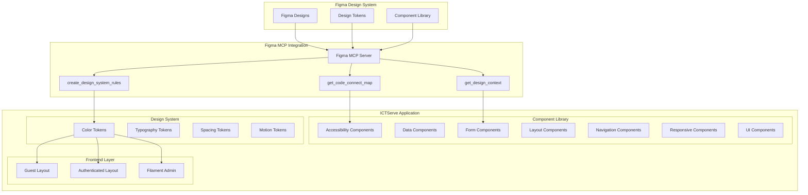

### Component Architecture

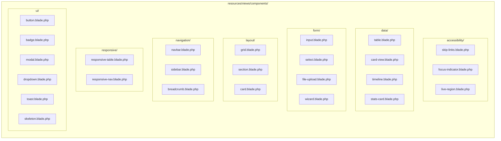

### True Hybrid Architecture Layers

| Layer | Layout | Access | Components |
|-------|--------|--------|------------|
| Guest Portal | guest.blade.php | Public | Helpdesk form, Loan wizard, Status lookup |
| Authenticated Portal | app.blade.php | Staff login | Dashboard, History, Profile, Approvals |
| Admin Panel | Filament 4 | Admin/Superuser | Ticket management, Loan management, System config |

### User Flow Diagrams

#### Guest Helpdesk Ticket Submission Flow

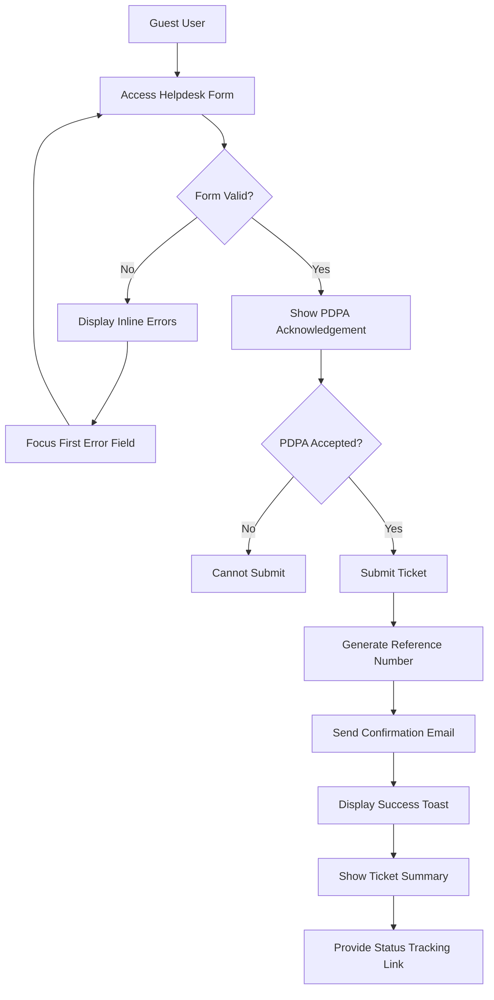

#### Authenticated User Dashboard Flow

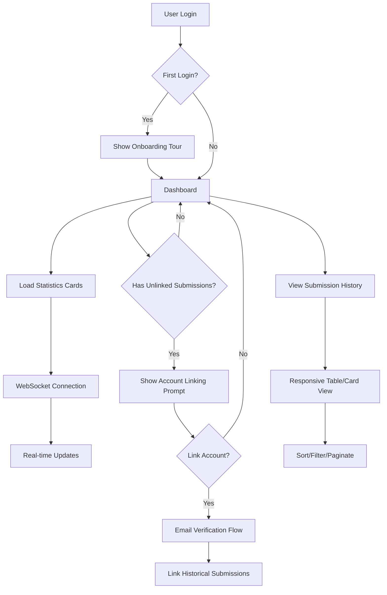

#### Loan Application Wizard Flow

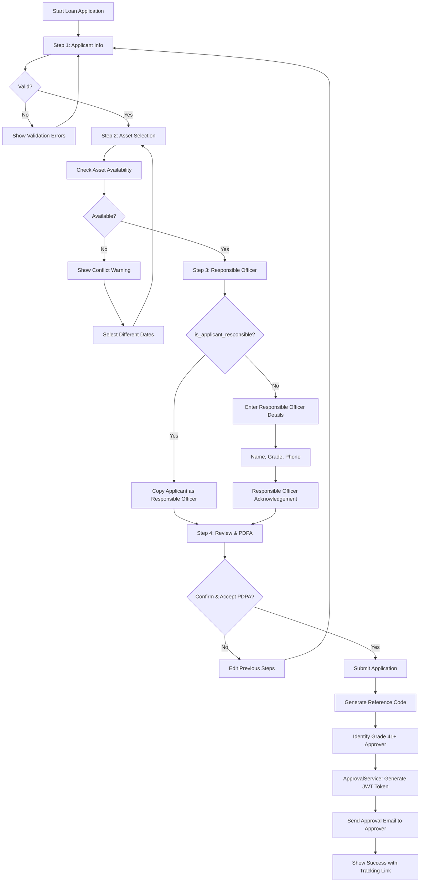

**Responsible Officer vs Approver Clarification (per D09 §4.4):**

- **Responsible Officer (Pegawai Bertanggungjawab)**: Person responsible for the borrowed equipment during loan period. Can be the applicant themselves (`is_applicant_responsible=TRUE`) or a different person.
- **Approver (Grade 41+)**: Department head who approves/rejects the loan application via signed email token. Identified automatically based on applicant's department.

#### Loan Approval Email Flow (Grade 41+ Approver)

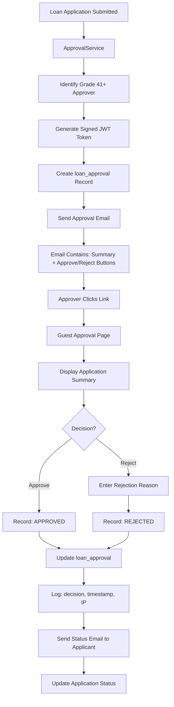

#### Admin Ticket Management Flow

```mermaid
flowchart TD
    A[Admin Dashboard] --> B[View Ticket Queue]
    B --> C[Filter by Status/Priority/SLA]
    C --> D[Select Ticket]
    D --> E[View Ticket Details]
    E --> F{Action?}
    
    F -->|Assign| G[Select Staff Member]
    G --> H[Update Assignment]
    H --> I[Send Notification]
    
    F -->|Update Status| J[Select New Status]
    J --> K[Add Comment]
    K --> L[Update Ticket]
    L --> M[Log to Audit Trail]
    
    F -->|Add Internal Note| N[Write Internal Comment]
    N --> O[@Mention Staff?]
    O -->|Yes| P[Send Mention Notification]
    O -->|No| Q[Save Comment]
    P --> Q
    
    F -->|Close| R[Confirm Closure]
    R --> S[Update Status to Closed]
    S --> T[Send Closure Email]
```

#### Real-time Notification Flow

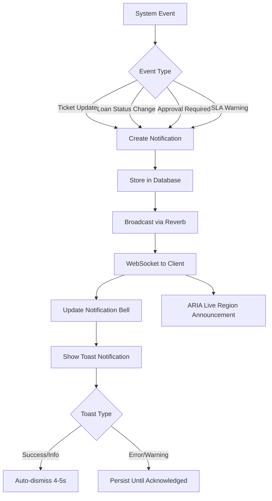

#### Theme and Preference Management Flow (v3.6.0 Updated)

**v3.6.0 Policy**: Light mode is the immutable default. Dark mode is opt-in only. NO system preference auto-detection.

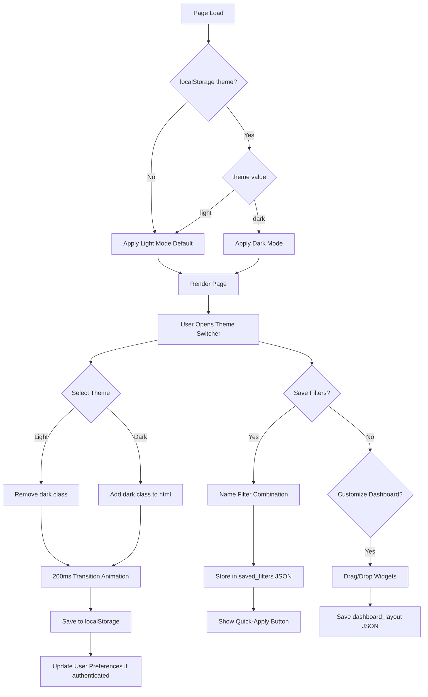

**FOUT Prevention Script** (inline in `<head>`):

```javascript
(function() {
  const theme = localStorage.getItem('theme') || 'light';
  if (theme === 'dark') {
    document.documentElement.classList.add('dark');
  }
})();
```

#### Accessibility Focus Management Flow

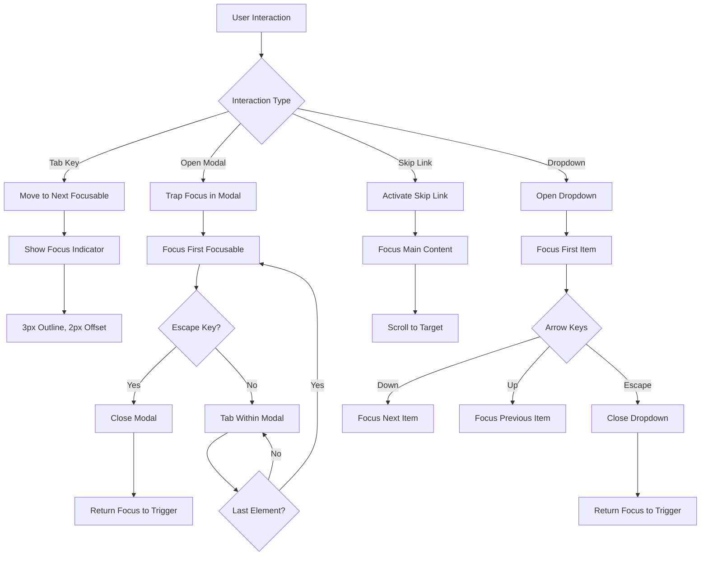

## Components and Interfaces

### 1. Design System Integration Components

#### FigmaDesignService

```php
namespace App\Services;

class FigmaDesignService
{
    public function getDesignContext(string $nodeId, string $fileKey): array;
    public function getCodeConnectMap(string $nodeId, string $fileKey): array;
    public function createDesignSystemRules(): void;
    public function transformToLivewire(string $reactCode): string;
    public function mapColorToToken(string $figmaColor): string;
}
```

**Responsibilities:**

- Extract design context from Figma via MCP
- Transform React/Tailwind output to Livewire/Blade
- Map Figma colors to compliant color palette tokens
- Generate and maintain design system rules

### 2. Accessibility Components

#### SkipLinks Component

```blade
{{-- resources/views/components/accessibility/skip-links.blade.php --}}
@props(['mainContent' => '#main-content', 'navigation' => '#main-nav'])

<div class="sr-only focus-within:not-sr-only">
    <a href="{{ $mainContent }}" 
       class="skip-link focus:ring-3 focus:ring-primary-500 focus:ring-offset-2">
        {{ __('Skip to main content') }}
    </a>
    <a href="{{ $navigation }}" 
       class="skip-link focus:ring-3 focus:ring-primary-500 focus:ring-offset-2">
        {{ __('Skip to navigation') }}
    </a>
</div>
```

#### LiveRegion Component

```blade
{{-- resources/views/components/accessibility/live-region.blade.php --}}
@props(['politeness' => 'polite', 'atomic' => true])

<div aria-live="{{ $politeness }}" 
     aria-atomic="{{ $atomic ? 'true' : 'false' }}"
     class="sr-only"
     {{ $attributes }}>
    {{ $slot }}
</div>
```

### 3. Form Components

#### Input Component with Validation

```blade
{{-- resources/views/components/form/input.blade.php --}}
@props([
    'name',
    'label',
    'type' => 'text',
    'required' => false,
    'hint' => null,
    'error' => null
])

@php
    $inputId = $name . '-input';
    $hintId = $hint ? $name . '-hint' : null;
    $errorId = $error ? $name . '-error' : null;
    $describedBy = collect([$hintId, $errorId])->filter()->implode(' ');
@endphp

<div class="form-group">
    <label for="{{ $inputId }}" class="form-label">
        {{ $label }}
        @if($required)
            <span class="text-danger-600" aria-hidden="true">*</span>
            <span class="sr-only">{{ __('required') }}</span>
        @endif
    </label>
    
    @if($hint)
        <p id="{{ $hintId }}" class="form-hint text-sm text-gray-600">{{ $hint }}</p>
    @endif

    <input type="{{ $type }}"
           id="{{ $inputId }}"
           name="{{ $name }}"
           @if($describedBy) aria-describedby="{{ $describedBy }}" @endif
           @if($error) aria-invalid="true" @endif
           @if($required) required aria-required="true" @endif
           {{ $attributes->merge(['class' => 'form-input ' . ($error ? 'border-danger-500' : 'border-gray-300')]) }}
    />
    
    @if($error)
        <p id="{{ $errorId }}" class="form-error text-sm text-danger-600 mt-1" role="alert">
            {{ $error }}
        </p>
    @endif
</div>
```

#### Multi-Step Wizard Component

```php
// app/Livewire/Components/FormWizard.php
namespace App\Livewire\Components;

use Livewire\Component;

class FormWizard extends Component
{
    public int $currentStep = 1;
    public int $totalSteps;
    public array $stepValidation = [];
    public array $completedSteps = [];
    
    public function nextStep(): void
    {
        if ($this->validateCurrentStep()) {
            $this->completedSteps[] = $this->currentStep;
            $this->currentStep = min($this->currentStep + 1, $this->totalSteps);
        }
    }
    
    public function previousStep(): void
    {
        $this->currentStep = max($this->currentStep - 1, 1);
    }
    
    public function goToStep(int $step): void
    {
        if ($step <= max($this->completedSteps) + 1) {
            $this->currentStep = $step;
        }
    }
    
    protected function validateCurrentStep(): bool
    {
        // Validation logic per step
        return true;
    }
}
```

### 4. Data Display Components

#### Responsive Table Component

```blade
{{-- resources/views/components/data/responsive-table.blade.php --}}
@props(['headers', 'rows', 'sortable' => false, 'mobileCardView' => true])

<div class="responsive-table-container">
    {{-- Desktop Table View --}}
    <table class="hidden md:table w-full" role="table">
        <thead>
            <tr>
                @foreach($headers as $key => $header)
                    <th scope="col" 
                        @if($sortable && isset($header['sortable']) && $header['sortable'])
                            aria-sort="{{ $sortDirection ?? 'none' }}"
                        @endif
                        class="px-4 py-3 text-left text-sm font-semibold text-gray-900">
                        {{ $header['label'] }}
                    </th>
                @endforeach
            </tr>
        </thead>
        <tbody class="divide-y divide-gray-200">
            {{ $slot }}
        </tbody>
    </table>
    
    {{-- Mobile Card View --}}
    @if($mobileCardView)
        <div class="md:hidden space-y-4">
            {{ $mobileSlot ?? $slot }}
        </div>
    @endif
</div>
```

#### Statistics Card Component

```blade
{{-- resources/views/components/data/stats-card.blade.php --}}
@props(['title', 'value', 'icon', 'trend' => null, 'trendDirection' => null])

<div class="stats-card bg-white rounded-lg shadow-card p-6">
    <div class="flex items-center justify-between">
        <div>
            <p class="text-sm font-medium text-gray-600">{{ $title }}</p>
            <p class="text-2xl font-bold text-gray-900 mt-1">{{ $value }}</p>
            @if($trend)
                <p class="text-sm mt-2 {{ $trendDirection === 'up' ? 'text-success-600' : 'text-danger-600' }}">
                    <x-heroicon-s-arrow-{{ $trendDirection === 'up' ? 'up' : 'down' }} class="w-4 h-4 inline" />
                    {{ $trend }}
                </p>
            @endif
        </div>
        <div class="p-3 bg-primary-100 rounded-full">
            <x-dynamic-component :component="$icon" class="w-6 h-6 text-primary-600" />
        </div>
    </div>
</div>
```

### 5. Navigation Components

#### Breadcrumb Component

```blade
{{-- resources/views/components/navigation/breadcrumb.blade.php --}}
@props(['items'])

<nav aria-label="{{ __('Breadcrumb') }}" class="breadcrumb">
    <ol class="flex items-center space-x-2 text-sm">
        @foreach($items as $index => $item)
            <li class="flex items-center">
                @if($index > 0)
                    <x-heroicon-s-chevron-right class="w-4 h-4 text-gray-400 mx-2" aria-hidden="true" />
                @endif
                
                @if($loop->last)
                    <span aria-current="page" class="text-gray-600">{{ $item['label'] }}</span>
                @else
                    <a href="{{ $item['url'] }}" class="text-primary-600 hover:text-primary-800">
                        {{ $item['label'] }}
                    </a>
                @endif
            </li>
        @endforeach
    </ol>
</nav>
```

#### Dropdown Menu Component

```blade
{{-- resources/views/components/ui/dropdown.blade.php --}}
@props(['align' => 'right', 'width' => '48', 'contentClasses' => 'py-1 bg-white'])

@php
    $alignmentClasses = match($align) {
        'left' => 'origin-top-left left-0',
        'right' => 'origin-top-right right-0',
        default => 'origin-top-right right-0',
    };
    $widthClass = "w-{$width}";
@endphp

<div class="relative" x-data="{ open: false }" @click.away="open = false">
    <div @click="open = !open" 
         aria-expanded="open"
         aria-haspopup="true">
        {{ $trigger }}
    </div>

    <div x-show="open"
         x-transition:enter="transition ease-out duration-200"
         x-transition:enter-start="opacity-0 scale-95"
         x-transition:enter-end="opacity-100 scale-100"
         x-transition:leave="transition ease-in duration-75"
         x-transition:leave-start="opacity-100 scale-100"
         x-transition:leave-end="opacity-0 scale-95"
         class="absolute z-50 mt-2 {{ $widthClass }} rounded-md shadow-dropdown {{ $alignmentClasses }}"
         @keydown.escape.window="open = false"
         @keydown.arrow-down.prevent="$focus.wrap().next()"
         @keydown.arrow-up.prevent="$focus.wrap().previous()">
        <div class="rounded-md ring-1 ring-black ring-opacity-5 {{ $contentClasses }}">
            {{ $content }}
        </div>
    </div>
</div>
```

### 6. UI Feedback Components

#### Toast Notification Component

```php
// app/Livewire/Components/Toast.php
namespace App\Livewire\Components;

use Livewire\Component;
use Livewire\Attributes\On;

class Toast extends Component
{
    public array $toasts = [];
    
    #[On('toast')]
    public function addToast(string $message, string $type = 'info', int $duration = 4000): void
    {
        $id = uniqid();
        $this->toasts[] = [
            'id' => $id,
            'message' => $message,
            'type' => $type,
            'duration' => $duration,
        ];
        
        // Auto-dismiss for success/info
        if (in_array($type, ['success', 'info'])) {
            $this->dispatch('dismiss-toast', id: $id)->self()->delay($duration);
        }
    }
    
    #[On('dismiss-toast')]
    public function dismissToast(string $id): void
    {
        $this->toasts = array_filter($this->toasts, fn($t) => $t['id'] !== $id);
    }
}
```

```blade
{{-- resources/views/livewire/components/toast.blade.php --}}
<div class="fixed bottom-4 right-4 z-50 space-y-2" 
     aria-live="polite" 
     aria-label="{{ __('Notifications') }}">
    @foreach($toasts as $toast)
        <div wire:key="{{ $toast['id'] }}"
             x-data="{ show: true }"
             x-show="show"
             x-transition:enter="transition ease-out duration-400 transform"
             x-transition:enter-start="translate-y-full opacity-0"
             x-transition:enter-end="translate-y-0 opacity-100"
             x-transition:leave="transition ease-in duration-400 transform"
             x-transition:leave-start="translate-y-0 opacity-100"
             x-transition:leave-end="translate-y-full opacity-0"
             class="toast toast-{{ $toast['type'] }} flex items-center p-4 rounded-lg shadow-card"
             role="alert">
            <x-dynamic-component :component="'heroicon-s-' . match($toast['type']) {
                'success' => 'check-circle',
                'error' => 'x-circle',
                'warning' => 'exclamation-triangle',
                default => 'information-circle'
            }" class="w-5 h-5 mr-3" />
            <span>{{ $toast['message'] }}</span>
            <button @click="show = false; $wire.dismissToast('{{ $toast['id'] }}')"
                    class="ml-4 text-current opacity-70 hover:opacity-100"
                    aria-label="{{ __('Dismiss') }}">
                <x-heroicon-s-x-mark class="w-4 h-4" />
            </button>
        </div>
    @endforeach
</div>
```

#### Skeleton Loader Component

```blade
{{-- resources/views/components/ui/skeleton.blade.php --}}
@props(['type' => 'text', 'lines' => 1, 'width' => 'full'])

@php
    $baseClasses = 'bg-gray-200 rounded animate-pulse';
    $motionSafe = '@media (prefers-reduced-motion: no-preference)';
@endphp

<div aria-busy="true" aria-label="{{ __('Loading') }}" {{ $attributes }}>
    @switch($type)
        @case('card')
            <div class="{{ $baseClasses }} h-32 w-{{ $width }}"></div>
            @break
        @case('avatar')
            <div class="{{ $baseClasses }} h-10 w-10 rounded-full"></div>
            @break
        @case('text')
            @for($i = 0; $i < $lines; $i++)
                <div class="{{ $baseClasses }} h-4 w-{{ $i === $lines - 1 ? '3/4' : $width }} mb-2"></div>
            @endfor
            @break
        @case('table-row')
            <div class="flex space-x-4">
                <div class="{{ $baseClasses }} h-4 w-1/4"></div>
                <div class="{{ $baseClasses }} h-4 w-1/3"></div>
                <div class="{{ $baseClasses }} h-4 w-1/4"></div>
            </div>
            @break
    @endswitch
    <span class="sr-only">{{ __('Loading content...') }}</span>
</div>
```

### 7. Modal and Dialog Components

```blade
{{-- resources/views/components/ui/modal.blade.php --}}
@props(['name', 'title', 'maxWidth' => 'lg'])

@php
    $maxWidthClass = match($maxWidth) {
        'sm' => 'sm:max-w-sm',
        'md' => 'sm:max-w-md',
        'lg' => 'sm:max-w-lg',
        'xl' => 'sm:max-w-xl',
        '2xl' => 'sm:max-w-2xl',
        default => 'sm:max-w-lg',
    };
@endphp

<div x-data="{ show: false }"
     x-on:open-modal.window="if ($event.detail === '{{ $name }}') show = true"
     x-on:close-modal.window="if ($event.detail === '{{ $name }}') show = false"
     x-on:keydown.escape.window="show = false"
     x-show="show"
     x-cloak
     class="fixed inset-0 z-50 overflow-y-auto"
     aria-labelledby="modal-title-{{ $name }}"
     aria-modal="true"
     role="dialog">
    
    {{-- Backdrop --}}
    <div x-show="show"
         x-transition:enter="ease-out duration-400"
         x-transition:enter-start="opacity-0"
         x-transition:enter-end="opacity-100"
         x-transition:leave="ease-in duration-200"
         x-transition:leave-start="opacity-100"
         x-transition:leave-end="opacity-0"
         class="fixed inset-0 bg-gray-500 bg-opacity-75"
         @click="show = false"></div>

    {{-- Modal Panel --}}
    <div class="flex min-h-full items-center justify-center p-4">
        <div x-show="show"
             x-transition:enter="ease-out duration-400"
             x-transition:enter-start="opacity-0 translate-y-4 sm:translate-y-0 sm:scale-95"
             x-transition:enter-end="opacity-100 translate-y-0 sm:scale-100"
             x-transition:leave="ease-in duration-200"
             x-transition:leave-start="opacity-100 translate-y-0 sm:scale-100"
             x-transition:leave-end="opacity-0 translate-y-4 sm:translate-y-0 sm:scale-95"
             x-trap.noscroll="show"
             class="relative bg-white rounded-lg shadow-xl {{ $maxWidthClass }} w-full">
            
            {{-- Header --}}
            <div class="px-6 py-4 border-b border-gray-200">
                <h2 id="modal-title-{{ $name }}" class="text-lg font-semibold text-gray-900">
                    {{ $title }}
                </h2>
                <button @click="show = false"
                        class="absolute top-4 right-4 text-gray-400 hover:text-gray-600"
                        aria-label="{{ __('Close modal') }}">
                    <x-heroicon-s-x-mark class="w-5 h-5" />
                </button>
            </div>
            
            {{-- Content --}}
            <div class="px-6 py-4">
                {{ $slot }}
            </div>
            
            {{-- Footer --}}
            @if(isset($footer))
                <div class="px-6 py-4 border-t border-gray-200 flex justify-end space-x-3">
                    {{ $footer }}
                </div>
            @endif
        </div>
    </div>
</div>
```

## Data Models

### User Preferences Schema

```php
// Migration: add_ui_preferences_to_users_table
Schema::table('users', function (Blueprint $table) {
    $table->json('dashboard_layout')->nullable()->comment('Widget arrangement preferences');
    $table->json('saved_filters')->nullable()->comment('Saved filter combinations');
    $table->string('theme_preference')->default('system')->comment('light|dark|system');
    $table->boolean('onboarding_completed')->default(false);
    $table->json('notification_preferences')->nullable();
    $table->string('locale')->default('ms')->comment('ms|en');
});
```

### Component Metadata Schema

```php
// Each component file should include metadata header
/**
 * @component StatusBadge
 * @description Displays status with icon, color, and text for accessibility
 * @author ICTServe Development Team
 * @version 1.0.0
 * @trace D12 §5.3, D14 §4.2
 * @wcag SC 1.4.1 Use of Color (Level A)
 * @props status: string, size: sm|md|lg
 */
```

### Design Token Data Model

```css
/* resources/css/app.css - @theme directive */
/* v3.6.0 Updated Color Palette */
@theme {
    /* Color Tokens - WCAG 2.2 AA Compliant (v3.6.0 Updated) */
    --color-primary-600: #0056B3;    /* 7.2:1 contrast - MOTAC Blue */
    --color-secondary-600: #0B4D8F;  /* 8.1:1 contrast */
    --color-success-600: #198754;    /* 4.6:1 contrast - v3.6.0 updated */
    --color-warning-600: #ff8c00;    /* 4.5:1 contrast - v3.6.0 updated */
    --color-danger-600: #b50c0c;     /* 7.8:1 contrast - v3.6.0 updated */
    
    /* Spacing Tokens - MyDS 4px increments */
    --space-1: 4px;
    --space-2: 8px;
    --space-3: 12px;
    --space-4: 16px;
    --space-6: 24px;
    --space-8: 32px;
    --space-12: 48px;
    --space-16: 64px;
    
    /* Radius Tokens - MyDS system */
    --radius-xs: 4px;
    --radius-s: 6px;
    --radius-m: 8px;
    --radius-l: 12px;
    --radius-xl: 14px;
    --radius-full: 9999px;
    
    /* Shadow Tokens - MyGovEA */
    --shadow-button: 0 1px 2px 0 rgb(0 0 0 / 0.05);
    --shadow-card: 0 1px 3px 0 rgb(0 0 0 / 0.1), 0 1px 2px -1px rgb(0 0 0 / 0.1);
    --shadow-dropdown: 0 10px 15px -3px rgb(0 0 0 / 0.1), 0 4px 6px -4px rgb(0 0 0 / 0.1);
    
    /* Motion Tokens - MyDS */
    --duration-short: 200ms;
    --duration-medium: 400ms;
    --duration-long: 600ms;
    --easing-out: cubic-bezier(0.33, 1, 0.68, 1);
    --easing-out-back: cubic-bezier(0.34, 1.56, 0.64, 1);
    
    /* Typography - MOTAC approved */
    --font-heading: 'Poppins', 'Inter', system-ui, sans-serif;
    --font-body: 'Inter', system-ui, sans-serif;
}
```

## Correctness Properties

*A property is a characteristic or behavior that should hold true across all valid executions of a system-essentially, a formal statement about what the system should do. Properties serve as the bridge between human-readable specifications and machine-verifiable correctness guarantees.*

### Property 1: Color Contrast Compliance
*For any* text element or UI component rendered in the system, the color contrast ratio between foreground and background SHALL meet WCAG 2.2 AA minimum requirements (4.5:1 for normal text, 3:1 for large text and UI components).
**Validates: Requirements 2.3, 6.1, 25.1**

### Property 2: Touch Target Size Compliance
*For any* interactive element (button, link, form control) rendered on mobile viewports, the touch target size SHALL be at least 44×44 CSS pixels.
**Validates: Requirements 3.5, 6.5**

### Property 3: ARIA Attribute Completeness
*For any* interactive component (modal, dropdown, form input with error), the required ARIA attributes SHALL be present and correctly linked (aria-describedby, aria-expanded, aria-modal, aria-invalid, aria-live).
**Validates: Requirements 3.4, 6.4, 6.6, 15.5, 17.1, 28.1, 29.1, 30.5**

### Property 4: Focus Indicator Visibility
*For any* focusable element, when focused, a visible focus indicator SHALL be displayed with at least 3:1 contrast ratio against adjacent colors.
**Validates: Requirements 6.2, 9.5**

### Property 5: Design Token Compliance
*For any* styled element using color, spacing, shadow, or radius values, the value SHALL match one of the defined design system tokens in the @theme directive.
**Validates: Requirements 2.2, 2.4, 2.5, 11.1, 11.2, 11.3, 11.4, 11.5**

### Property 6: Responsive Grid Behavior
*For any* viewport width, the layout grid SHALL adapt according to the 12-8-4 system: 12 columns for desktop (≥1024px), 8 columns for tablet (768-1023px), 4 columns for mobile (<768px).
**Validates: Requirements 7.1, 7.2, 7.3**

### Property 7: Form Validation Accessibility
*For any* form field with a validation error, an inline error message SHALL be displayed with proper aria-describedby linking to the input element.
**Validates: Requirements 3.4, 8.3, 17.1, 17.2**

### Property 8: Preference Persistence Round-Trip
*For any* user preference (theme, locale, saved filters, dashboard layout), saving the preference and subsequently loading it SHALL return an equivalent value.
**Validates: Requirements 23.1, 23.2, 23.3, 23.4, 25.2**

### Property 9: Reduced Motion Respect
*For any* animation or transition, when the user has prefers-reduced-motion enabled, non-essential animations SHALL be disabled or reduced.
**Validates: Requirements 9.3, 26.5**

### Property 10: Status Badge Accessibility
*For any* status badge component, the status SHALL be conveyed through icon AND text (not color alone) to meet WCAG SC 1.4.1.
**Validates: Requirements 8.4**

### Property 11: Keyboard Navigation Completeness
*For any* interactive element, it SHALL be reachable and operable via keyboard navigation with logical tab order.
**Validates: Requirements 6.2, 24.1, 24.5, 29.4, 34.5, 47.1**

### Property 12: Fuzzy Search Tolerance
*For any* search query with minor typos (Levenshtein distance ≤ 2), the fuzzy search SHALL return relevant matches that would match the corrected query.
**Validates: Requirements 22.1, 22.2, 22.3**

### Property 13: Modal Focus Management
*For any* modal dialog, when opened, focus SHALL be trapped within the modal, and when closed, focus SHALL return to the trigger element.
**Validates: Requirements 28.1, 28.4**

### Property 14: Toast Notification Behavior
*For any* toast notification of type success or info, it SHALL auto-dismiss after 4-5 seconds; for error or warning types, it SHALL persist until user acknowledgment.
**Validates: Requirements 30.4**

### Property 15: Session Timeout Warning
*For any* authenticated session approaching timeout (within 2 minutes of expiration), a warning modal SHALL be displayed with option to extend.
**Validates: Requirements 31.1, 31.2, 31.3**

### Property 16: Breadcrumb Structure
*For any* page with breadcrumb navigation, all items except the current page SHALL be clickable links, and the current page SHALL have aria-current="page".
**Validates: Requirements 46.1, 46.3**

### Property 17: File Upload Validation
*For any* file upload attempt, files exceeding 5MB or not matching allowed types SHALL be rejected with appropriate error message.
**Validates: Requirements 48.1, 48.3**

### Property 18: Internal Comment Visibility
*For any* internal comment on a submission, it SHALL NOT be visible to the original submitter (guest or staff who submitted).
**Validates: Requirements 38.1, 38.2**

### Property 19: Delegation Date Validity
*For any* delegation, the start date SHALL be before or equal to the end date, and the delegation SHALL only be active within the specified date range.
**Validates: Requirements 33.3, 33.4**

### Property 20: Asset Availability Conflict Detection
*For any* loan date selection, if the selected dates overlap with existing bookings for the same asset, a conflict warning SHALL be displayed.
**Validates: Requirements 34.3, 34.4**

## Error Handling

### Client-Side Error Handling

```javascript
// resources/js/error-handler.js
document.addEventListener('livewire:init', () => {
    Livewire.hook('request', ({ fail }) => {
        if (fail && fail.status === 419) {
            // Session expired - show warning modal
            Livewire.dispatch('session-expired');
        }
        if (fail && fail.status === 422) {
            // Validation error - handled by Livewire
        }
        if (fail && fail.status >= 500) {
            // Server error - show toast
            Livewire.dispatch('toast', {
                message: 'An error occurred. Please try again.',
                type: 'error'
            });
        }
    });
});
```

### Server-Side Error Pages

| Error Code | Page | Content |
|------------|------|---------|
| 403 | errors/403.blade.php | Role-appropriate message, login/contact options |
| 404 | errors/404.blade.php | Navigation links, search, bilingual message |
| 419 | errors/419.blade.php | Session expired, redirect to login |
| 500 | errors/500.blade.php | Incident reference, support contact |
| 503 | errors/503.blade.php | Maintenance mode, estimated restoration time |

### Form Error Recovery

```php
// Form autosave using LocalStorage
// resources/js/form-autosave.js
class FormAutosave {
    constructor(formId, storageKey) {
        this.form = document.getElementById(formId);
        this.storageKey = storageKey;
        this.init();
    }
    
    init() {
        this.restoreFromStorage();
        this.form.addEventListener('input', debounce(() => this.save(), 1000));
        this.form.addEventListener('submit', () => this.clear());
    }
    
    save() {
        const formData = new FormData(this.form);
        const data = Object.fromEntries(formData.entries());
        localStorage.setItem(this.storageKey, JSON.stringify(data));
    }
    
    restoreFromStorage() {
        const saved = localStorage.getItem(this.storageKey);
        if (saved) {
            // Show recovery prompt
            this.showRecoveryPrompt(JSON.parse(saved));
        }
    }
}
```

## Testing Strategy

### Dual Testing Approach

This design requires both unit tests and property-based tests:

- **Unit tests**: Verify specific examples, edge cases, and error conditions
- **Property-based tests**: Verify universal properties that should hold across all inputs

### Property-Based Testing Framework

**Framework**: Pest PHP with `pestphp/pest-plugin-faker` for property-based testing patterns

```php
// tests/Feature/Components/AccessibilityPropertyTest.php
use function Pest\Faker\fake;

test('all interactive elements meet minimum touch target size', function () {
    // Generate random interactive elements
    $elements = collect(['button', 'a', 'input', 'select'])->map(fn($tag) => [
        'tag' => $tag,
        'width' => fake()->numberBetween(44, 200),
        'height' => fake()->numberBetween(44, 200),
    ]);
    
    foreach ($elements as $element) {
        expect($element['width'])->toBeGreaterThanOrEqual(44);
        expect($element['height'])->toBeGreaterThanOrEqual(44);
    }
})->repeat(100);
```

### Unit Testing Requirements

```php
// tests/Feature/Components/ToastComponentTest.php
class ToastComponentTest extends TestCase
{
    /** @test */
    public function success_toast_auto_dismisses_after_duration(): void
    {
        Livewire::test(Toast::class)
            ->call('addToast', 'Success message', 'success', 4000)
            ->assertCount('toasts', 1)
            ->dispatch('dismiss-toast', id: 'test-id')
            ->assertCount('toasts', 0);
    }
    
    /** @test */
    public function error_toast_persists_until_acknowledged(): void
    {
        Livewire::test(Toast::class)
            ->call('addToast', 'Error message', 'error')
            ->assertCount('toasts', 1);
        // Error toast should not auto-dismiss
    }
}
```

### Accessibility Testing

```php
// tests/Feature/Accessibility/WcagComplianceTest.php
class WcagComplianceTest extends TestCase
{
    /** @test */
    public function form_inputs_have_associated_labels(): void
    {
        $response = $this->get('/helpdesk/create');
        
        $response->assertSee('for="');
        $response->assertSee('aria-describedby');
    }
    
    /** @test */
    public function modals_have_proper_aria_attributes(): void
    {
        $view = $this->blade('<x-ui.modal name="test" title="Test Modal">Content</x-ui.modal>');
        
        $view->assertSee('aria-modal="true"');
        $view->assertSee('role="dialog"');
        $view->assertSee('aria-labelledby');
    }
    
    /** @test */
    public function skip_links_are_present_on_all_pages(): void
    {
        $response = $this->get('/');
        
        $response->assertSee('Skip to main content');
        $response->assertSee('Skip to navigation');
    }
}
```

### Browser Testing with Playwright

```typescript
// tests/e2e/accessibility.spec.ts
import { test, expect } from '@playwright/test';
import AxeBuilder from '@axe-core/playwright';

test.describe('WCAG 2.2 AA Compliance', () => {
    test('homepage passes accessibility audit', async ({ page }) => {
        await page.goto('/');
        
        const accessibilityScanResults = await new AxeBuilder({ page })
            .withTags(['wcag2a', 'wcag2aa', 'wcag22aa'])
            .analyze();
        
        expect(accessibilityScanResults.violations).toEqual([]);
    });
    
    test('keyboard navigation works correctly', async ({ page }) => {
        await page.goto('/');
        
        // Tab to skip link
        await page.keyboard.press('Tab');
        const skipLink = page.locator('.skip-link:focus');
        await expect(skipLink).toBeVisible();
        
        // Activate skip link
        await page.keyboard.press('Enter');
        const mainContent = page.locator('#main-content');
        await expect(mainContent).toBeFocused();
    });
});
```

### Visual Regression Testing

```typescript
// tests/e2e/visual-regression.spec.ts
test.describe('Visual Regression', () => {
    test('dashboard matches design', async ({ page }) => {
        await page.goto('/dashboard');
        await expect(page).toHaveScreenshot('dashboard.png', {
            maxDiffPixels: 100
        });
    });
    
    test('dark mode renders correctly', async ({ page }) => {
        await page.goto('/');
        await page.evaluate(() => {
            document.documentElement.classList.add('dark');
        });
        await expect(page).toHaveScreenshot('homepage-dark.png');
    });
});
```

### Test Coverage Requirements

| Category | Minimum Coverage | Focus Areas |
|----------|-----------------|-------------|
| Accessibility Components | 100% | ARIA attributes, focus management |
| Form Components | 95% | Validation, error states, accessibility |
| UI Components | 90% | Rendering, interactions, states |
| Data Components | 90% | Responsive behavior, sorting, filtering |
| Services | 95% | Figma integration, token mapping |

## Implementation Phases

### Phase 1: Foundation (Weeks 1-2)

- Design token system in @theme directive
- Base accessibility components (skip-links, live-region, focus-indicator)
- Layout components (grid, section, card)
- Figma MCP integration service

### Phase 2: Core Components (Weeks 3-4)

- Form components with validation
- Data display components (table, stats-card, timeline)
- Navigation components (navbar, sidebar, breadcrumb)
- UI feedback components (toast, skeleton, modal)

### Phase 3: Portal Redesign (Weeks 5-6)

- Guest portal forms (helpdesk, loan wizard)
- Authenticated portal dashboard
- Profile and settings pages
- Real-time notifications

### Phase 4: Admin Enhancement (Weeks 7-8)

- Filament theme customization
- Dashboard widgets
- Audit log viewer
- System health dashboard

### Phase 5: Advanced Features (Weeks 9-10)

- Onboarding tour system
- Fuzzy search functionality
- Saved filters and preferences
- Dark mode implementation

### Phase 6: Testing & Refinement (Weeks 11-12)

- Property-based testing implementation
- Accessibility audit and fixes
- Performance optimization
- Documentation completion

## Standards Compliance Matrix

| Standard | Requirements Covered | Implementation |
|----------|---------------------|----------------|
| WCAG 2.2 AA | 6.1-6.6, 8.4-8.5, 17.1, 28.1, 29.1 | Accessibility components, ARIA attributes |
| MyDS | 11.1-11.5 | Design tokens in @theme directive |
| MyGovEA | 12.1-12.5 | Progressive disclosure, error prevention |
| ISO 9241-210 | 43.1-43.5 | User feedback, task completion indicators |
| ISO 9241-110 | 44.1-44.5 | Self-descriptiveness, controllability |
| ISO 9241-11 | 45.1-45.5 | Effectiveness, efficiency, satisfaction |
| PDPA 2010 | 41.1-41.5, 42.1-42.5 | Data subject rights, consent management |
| D00-D17 | All | Traceability in component metadata |

## Detailed Standards Implementation Guide

### ISO 9241-210: Human-Centred Design Process

#### Principle 1: Understanding Users and Context

| Implementation | Component | Reference |
|----------------|-----------|-----------|
| User role detection | Auth::check() in forms | D04 §4.1 |
| Context-aware auto-fill | TicketForm, LoanForm | D03 SRS-FORM-001 |
| Bilingual support | Language switcher | D15 §2.1 |
| Device-responsive layouts | 12-8-4 grid system | D13 §5.1 |

#### Principle 2: User Involvement Throughout Design

| Implementation | Component | Reference |
|----------------|-----------|-----------|
| Onboarding tour | OnboardingTour.php | Req 21 |
| Feedback collection | Toast notifications | Req 30 |
| Progress indicators | FormWizard steps | Req 17.4 |
| Help tooltips | Form hints | D12 §6.3 |

#### Principle 3: User-Centred Evaluation

| Implementation | Component | Reference |
|----------------|-----------|-----------|
| Lighthouse audits | CI/CD pipeline | D11 §8.2 |
| Playwright E2E tests | tests/e2e/ | D11 §8.3 |
| axe-core accessibility | WcagComplianceTest | Req 6 |
| Core Web Vitals monitoring | Laravel Pulse | D03 SRS-ADM-007 |

#### Principle 4: Iterative Design

| Implementation | Component | Reference |
|----------------|-----------|-----------|
| Component versioning | Metadata headers | Req 8.2 |
| A/B testing support | Feature flags | D11 §9.1 |
| User preference storage | dashboard_layout JSON | Req 23.3 |

### ISO 9241-110: Dialogue Principles

#### Principle 1: Suitability for the Task

```blade
{{-- Task-focused form with minimal fields --}}
<x-form.wizard :steps="['Applicant', 'Asset', 'Review']">
    {{-- Only show relevant fields per step --}}
    @if($currentStep === 1)
        <x-form.input name="name" :value="auth()->user()?->name" />
    @endif
</x-form.wizard>
```

#### Principle 2: Self-Descriptiveness

```blade
{{-- Clear labels with hints --}}
<x-form.input 
    name="email"
    label="{{ __('E-mel Rasmi / Official Email') }}"
    hint="{{ __('Gunakan e-mel @motac.gov.my sahaja') }}"
    :error="$errors->first('email')"
/>
```

#### Principle 3: Conformity with User Expectations

| Pattern | Implementation | Reference |
|---------|----------------|-----------|
| Consistent button placement | Primary right, Secondary left | D14 §6.2 |
| Standard form layout | Label above input | D12 §5.4 |
| Familiar icons | Heroicons library | D14 §8.1 |
| Expected keyboard shortcuts | Alt+N, Alt+D, ? | Req 24 |

#### Principle 4: Suitability for Learning

```blade
{{-- Progressive disclosure with expandable sections --}}
<x-ui.accordion>
    <x-ui.accordion-item title="{{ __('Maklumat Lanjut') }}">
        {{-- Advanced options hidden by default --}}
    </x-ui.accordion-item>
</x-ui.accordion>
```

#### Principle 5: Controllability

```blade
{{-- User can cancel, undo, or modify actions --}}
<x-ui.modal name="confirm-delete">
    <p>{{ __('Adakah anda pasti?') }}</p>
    <x-slot name="footer">
        <x-ui.button wire:click="cancel" variant="secondary">
            {{ __('Batal') }}
        </x-ui.button>
        <x-ui.button wire:click="confirm" variant="danger">
            {{ __('Padam') }}
        </x-ui.button>
    </x-slot>
</x-ui.modal>
```

#### Principle 6: Error Tolerance

```php
// Form autosave prevents data loss
class FormAutosave {
    public function save(): void {
        localStorage.setItem($this->storageKey, JSON.stringify($this->formData));
    }
    
    public function restore(): void {
        if ($saved = localStorage.getItem($this->storageKey)) {
            $this->showRecoveryPrompt(JSON.parse($saved));
        }
    }
}
```

#### Principle 7: Suitability for Individualization

| Feature | Implementation | Reference |
|---------|----------------|-----------|
| Theme preference | light/dark/system | Req 25 |
| Language preference | ms/en | D15 §3.1 |
| Dashboard layout | Drag-drop widgets | Req 23.3 |
| Saved filters | saved_filters JSON | Req 23.1 |
| Notification preferences | email frequency toggle | D03 §5.4 |

### ISO 9241-11: Usability (Effectiveness, Efficiency, Satisfaction)

#### Effectiveness Metrics

| Metric | Target | Measurement |
|--------|--------|-------------|
| Task completion rate | ≥95% | Form submission success |
| Error rate | <5% | Validation failures |
| First-time success | ≥80% | No retry needed |

#### Efficiency Metrics

| Metric | Target | Implementation |
|--------|--------|----------------|
| Time to complete ticket | <3 min | Auto-fill, minimal fields |
| Time to complete loan | <5 min | Wizard with progress |
| Page load time | <2.5s LCP | Lazy loading, caching |
| Interaction delay | <100ms FID | Debounced inputs |

#### Satisfaction Indicators

| Indicator | Implementation | Reference |
|-----------|----------------|-----------|
| Clear feedback | Toast notifications | Req 30 |
| Visual progress | Wizard steps, loading states | Req 26 |
| Helpful errors | Inline validation messages | Req 17.2 |
| Consistent experience | Design token system | D14 §4.1 |

### WCAG 2.2 Level AA Implementation Details

#### Perceivable (Principle 1)

| Success Criterion | Implementation | Component |
|-------------------|----------------|-----------|
| 1.1.1 Non-text Content | Alt text on all images | `` |
| 1.3.1 Info and Relationships | Semantic HTML, ARIA landmarks | `<main>`, `<nav>`, `role="banner"` |
| 1.3.5 Identify Input Purpose | Autocomplete attributes | `autocomplete="email"` |
| 1.4.1 Use of Color | Icon + text for status | StatusBadge component |
| 1.4.3 Contrast (Minimum) | 4.5:1 text, 3:1 UI | Compliant color palette |
| 1.4.4 Resize Text | 200% zoom support | Relative units (rem) |
| 1.4.10 Reflow | No horizontal scroll at 320px | Responsive grid |
| 1.4.11 Non-text Contrast | 3:1 for UI components | Focus indicators, borders |
| 1.4.13 Content on Hover | Dismissible, hoverable | Tooltip component |

#### Operable (Principle 2)

| Success Criterion | Implementation | Component |
|-------------------|----------------|-----------|
| 2.1.1 Keyboard | All functions keyboard accessible | Tab order, focus management |
| 2.1.2 No Keyboard Trap | Escape closes modals | Modal focus trap with escape |
| 2.4.1 Bypass Blocks | Skip links | SkipLinks component |
| 2.4.3 Focus Order | Logical tab sequence | DOM order matches visual |
| 2.4.4 Link Purpose | Descriptive link text | No "click here" links |
| 2.4.6 Headings and Labels | Descriptive headings | H1-H6 hierarchy |
| 2.4.7 Focus Visible | 3px outline, 2px offset | FocusIndicator component |
| 2.4.11 Focus Not Obscured | Focus not hidden | z-index management |
| 2.5.5 Target Size | 44×44px minimum | Touch target enforcement |
| 2.5.8 Target Size (Minimum) | 24×24px with spacing | Button sizing |

#### Understandable (Principle 3)

| Success Criterion | Implementation | Component |
|-------------------|----------------|-----------|
| 3.1.1 Language of Page | `lang="ms"` or `lang="en"` | HTML lang attribute |
| 3.1.2 Language of Parts | `lang` on mixed content | Bilingual labels |
| 3.2.1 On Focus | No context change on focus | Predictable behavior |
| 3.2.2 On Input | No unexpected changes | Explicit submit buttons |
| 3.3.1 Error Identification | Inline error messages | Form validation |
| 3.3.2 Labels or Instructions | Clear labels, hints | Input component |
| 3.3.3 Error Suggestion | Helpful error messages | Validation messages |
| 3.3.4 Error Prevention | Confirmation dialogs | Delete confirmation |

#### Robust (Principle 4)

| Success Criterion | Implementation | Component |
|-------------------|----------------|-----------|
| 4.1.1 Parsing | Valid HTML | W3C validation |
| 4.1.2 Name, Role, Value | ARIA attributes | All interactive components |
| 4.1.3 Status Messages | ARIA live regions | LiveRegion component |

### MyDS (Malaysia Government Design System) Implementation

#### Color Token System (D13 §2.2)

```css
@theme {
    /* Semantic Background Tokens */
    --bg-white: #FFFFFF;
    --bg-washed: #F7F7F7;
    --bg-primary-50: oklch(0.97 0.02 250);
    --bg-success-50: oklch(0.95 0.05 145);
    --bg-warning-50: oklch(0.95 0.05 85);
    --bg-danger-50: oklch(0.95 0.05 25);
    
    /* Semantic Text Tokens */
    --txt-black-900: oklch(0.17 0 0);
    --txt-black-700: oklch(0.37 0 0);
    --txt-primary-600: oklch(0.48 0.15 250);
    --txt-success-600: oklch(0.45 0.15 145);
    --txt-warning-600: oklch(0.55 0.15 85);
    --txt-danger-600: oklch(0.40 0.2 25);
    
    /* Outline Tokens */
    --otl-divider: oklch(0.92 0 0);
    --otl-default: oklch(0.87 0 0);
    --otl-primary: oklch(0.55 0.15 250);
    
    /* Focus Ring Tokens */
    --fr-primary: oklch(0.55 0.15 250);
    --fr-danger: oklch(0.45 0.2 25);
}
```

#### Typography System (D13 §2.4)

```css
@theme {
    --font-heading: 'Poppins', 'Inter', system-ui, sans-serif;
    --font-body: 'Inter', system-ui, sans-serif;
    
    /* Type Scale */
    --text-xs: 0.75rem;    /* 12px */
    --text-sm: 0.875rem;   /* 14px */
    --text-base: 1rem;     /* 16px */
    --text-lg: 1.125rem;   /* 18px */
    --text-xl: 1.25rem;    /* 20px */
    --text-2xl: 1.5rem;    /* 24px */
    --text-3xl: 1.875rem;  /* 30px */
}
```

#### Grid System (D13 §5.1)

| Breakpoint | Columns | Gutter | Container |
|------------|---------|--------|-----------|
| Mobile (<768px) | 4 | 16px | 100% - 32px |
| Tablet (768-1023px) | 8 | 24px | 100% - 48px |
| Desktop (≥1024px) | 12 | 24px | 1200px max |

#### Spacing System (D14 §7.3)

```css
@theme {
    --space-1: 4px;   /* xs */
    --space-2: 8px;   /* sm */
    --space-3: 12px;  /* md-sm */
    --space-4: 16px;  /* md */
    --space-6: 24px;  /* lg */
    --space-8: 32px;  /* xl */
    --space-12: 48px; /* 2xl */
    --space-16: 64px; /* 3xl */
}
```

#### Radius System (D14 §7.4)

```css
@theme {
    --radius-xs: 4px;
    --radius-s: 6px;
    --radius-m: 8px;
    --radius-l: 12px;
    --radius-xl: 14px;
    --radius-full: 9999px;
}
```

#### Shadow System (D14 §7.5)

```css
@theme {
    --shadow-button: 0 1px 2px 0 rgb(0 0 0 / 0.05);
    --shadow-card: 0 1px 3px 0 rgb(0 0 0 / 0.1), 0 1px 2px -1px rgb(0 0 0 / 0.1);
    --shadow-dropdown: 0 10px 15px -3px rgb(0 0 0 / 0.1), 0 4px 6px -4px rgb(0 0 0 / 0.1);
}
```

#### Motion System (D14 §7.6)

```css
@theme {
    --duration-short: 200ms;   /* Micro-interactions */
    --duration-medium: 400ms;  /* Transitions */
    --duration-long: 600ms;    /* Complex animations */
    --easing-out: cubic-bezier(0.33, 1, 0.68, 1);
    --easing-out-back: cubic-bezier(0.34, 1.56, 0.64, 1);
}

/* Reduced motion support */
@media (prefers-reduced-motion: reduce) {
    *, *::before, *::after {
        animation-duration: 0.01ms !important;
        animation-iteration-count: 1 !important;
        transition-duration: 0.01ms !important;
    }
}
```

### MyGovEA (Malaysian Government Enterprise Architecture) Principles

#### Principle 1: Cognitive Load Reduction (D13 §3.6)

| Pattern | Implementation | Example |
|---------|----------------|---------|
| Progressive disclosure | Wizard steps, accordions | Loan application wizard |
| Chunking | Form sections, card groups | Dashboard widgets |
| Visual hierarchy | Typography scale, spacing | Heading levels |
| Consistent patterns | Reusable components | Button, Input, Modal |

#### Principle 2: Error Prevention (D13 §3.7)

| Pattern | Implementation | Example |
|---------|----------------|---------|
| Inline validation | wire:model.live.debounce | Email format check |
| Confirmation dialogs | Modal with confirm/cancel | Delete actions |
| Form autosave | LocalStorage draft | Long forms |
| Undo capability | Soft delete, restore | Ticket closure |

#### Principle 3: Clear Navigation

| Pattern | Implementation | Example |
|---------|----------------|---------|
| Dual layout system | app.blade.php, guest.blade.php | Auth vs Guest |
| Breadcrumbs | Breadcrumb component | Page hierarchy |
| Sidebar navigation | Authenticated layout | Dashboard nav |
| Skip links | SkipLinks component | Keyboard users |

#### Principle 4: Realistic Scope

| Pattern | Implementation | Example |
|---------|----------------|---------|
| Modular architecture | Helpdesk + Asset Loan | Separate modules |
| Feature flags | config/features.php | Gradual rollout |
| API versioning | /api/v1/ | Future compatibility |

#### Principle 5: Flexibility

| Pattern | Implementation | Example |
|---------|----------------|---------|
| True Hybrid Architecture | Guest + Auth + Admin | Access levels |
| Theme support | Light/Dark/System | User preference |
| Language support | BM/EN | Bilingual |
| Responsive design | 12-8-4 grid | All devices |

### PDPA 2010 (Personal Data Protection Act) Implementation

#### Data Subject Rights (D09 §8.1)

| Right | Implementation | Component |
|-------|----------------|-----------|
| Right to Access | Profile page, submission history | Dashboard |
| Right to Correction | Edit profile, update submissions | Profile settings |
| Right to Withdraw Consent | PDPA acknowledgement toggle | Form checkbox |
| Right to Data Portability | CSV/PDF export | Export buttons |
| Right to Erasure | Account deletion request | Settings page |

#### Consent Management

```blade
{{-- PDPA Acknowledgement Component --}}
<div class="bg-gray-50 border border-gray-200 rounded-lg p-4">
    <h4 class="font-medium text-gray-900 mb-2">
        {{ __('Perakuan PDPA / PDPA Acknowledgement') }}
    </h4>
    <p class="text-sm text-gray-600 mb-3">
        {{ __('Saya memahami dan bersetuju bahawa maklumat peribadi saya akan diproses mengikut Akta Perlindungan Data Peribadi 2010.') }}
    </p>
    <label class="flex items-start">
        <input type="checkbox" 
               wire:model="pdpaConsent"
               required
               class="mt-1 h-4 w-4 text-primary-600 focus:ring-primary-500 rounded">
        <span class="ml-2 text-sm text-gray-700">
            {{ __('Saya bersetuju dengan terma dan syarat PDPA') }}
            <span class="text-danger-600">*</span>
        </span>
    </label>
    @error('pdpaConsent')
        <p class="mt-1 text-sm text-danger-600">{{ $message }}</p>
    @enderror
</div>
```

#### Data Retention Display

```blade
{{-- Show data retention period --}}
<p class="text-xs text-gray-500 mt-2">
    {{ __('Data anda akan disimpan selama 7 tahun mengikut polisi pengekalan data kerajaan.') }}
</p>
```

#### Audit Trail for PDPA Compliance

```php
// Dual audit system for PDPA compliance
// owen-it/laravel-auditing - Field-level changes
// spatie/laravel-activitylog - User activity

// Model with auditing
class HelpdeskTicket extends Model implements Auditable
{
    use \OwenIt\Auditing\Auditable;
    use \Spatie\Activitylog\Traits\LogsActivity;
    
    protected static $logAttributes = ['status', 'assigned_to', 'priority'];
    protected static $logOnlyDirty = true;
}

## ICTServe v3.5.0 True Hybrid Architecture Components

This section documents the UI components specific to ICTServe v3.5.0 True Hybrid Architecture as defined in D00-D17 documentation.

### Self-Registration Flow (D00 §4.1, D03 SRS-AUTH-002)

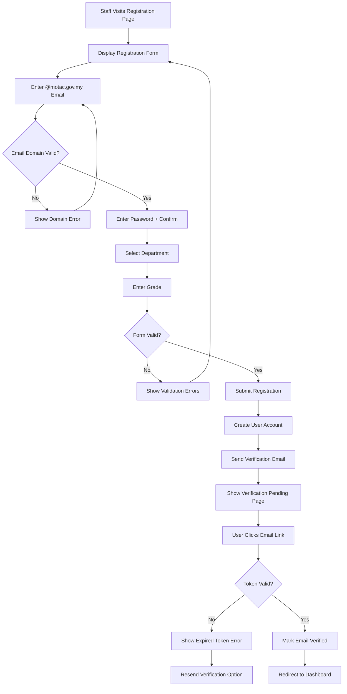

#### Registration Form Component

```blade
{{-- resources/views/livewire/auth/register.blade.php --}}
@props(['departments', 'grades'])

<form wire:submit="register" class="space-y-6">
    {{-- Email with @motac.gov.my validation --}}
    <x-form.input 
        name="email" 
        label="{{ __('E-mel Rasmi / Official Email') }}"
        type="email"
        required
        hint="{{ __('Gunakan e-mel @motac.gov.my sahaja') }}"
        wire:model.live.debounce.500ms="email"
        :error="$errors->first('email')"
    />
    
    {{-- Password with strength indicator --}}
    <div class="space-y-2">
        <x-form.input 
            name="password" 
            label="{{ __('Kata Laluan / Password') }}"
            type="password"
            required
            wire:model.live="password"
            :error="$errors->first('password')"
        />
        <x-ui.password-strength :password="$password" />
    </div>
    
    {{-- Password confirmation --}}
    <x-form.input 
        name="password_confirmation" 
        label="{{ __('Sahkan Kata Laluan / Confirm Password') }}"
        type="password"
        required
        wire:model="password_confirmation"
    />
    
    {{-- Department selection --}}
    <x-form.select 
        name="department_id" 
        label="{{ __('Bahagian / Department') }}"
        required
        :options="$departments"
        wire:model="department_id"
        :error="$errors->first('department_id')"
    />
    
    {{-- Grade selection --}}
    <x-form.select 
        name="grade" 
        label="{{ __('Gred / Grade') }}"
        required
        :options="$grades"
        wire:model="grade"
        :error="$errors->first('grade')"
    />
    
    {{-- Google SSO Option (if configured) --}}
    @if(config('services.google.client_id'))
        <div class="relative">
            <div class="absolute inset-0 flex items-center">
                <div class="w-full border-t border-gray-300"></div>
            </div>
            <div class="relative flex justify-center text-sm">
                <span class="px-2 bg-white text-gray-500">{{ __('Atau / Or') }}</span>
            </div>
        </div>
        
        <a href="{{ route('auth.google') }}" 
           class="w-full flex items-center justify-center gap-3 px-4 py-2 border border-gray-300 rounded-lg hover:bg-gray-50 transition">
            <x-icons.google class="w-5 h-5" />
            <span>{{ __('Daftar dengan Google Workspace') }}</span>
        </a>
    @endif
    
    <x-ui.button type="submit" variant="primary" class="w-full">
        {{ __('Daftar / Register') }}
    </x-ui.button>
</form>
```

### Flexible Login (D00 §4.1, D03 SRS-AUTH-003)

```php
// app/Livewire/Auth/Login.php
namespace App\Livewire\Auth;

use Livewire\Component;
use Illuminate\Support\Facades\Auth;

class Login extends Component
{
    public string $identifier = ''; // Email OR username
    public string $password = '';
    public bool $remember = false;
    
    public function login(): void
    {
        $this->validate([
            'identifier' => 'required|string',
            'password' => 'required|string',
        ]);
        
        // Determine if identifier is email or username
        $field = filter_var($this->identifier, FILTER_VALIDATE_EMAIL) 
            ? 'email' 
            : 'username';
        
        // If username provided, append @motac.gov.my for email lookup
        $credentials = [
            $field => $this->identifier,
            'password' => $this->password,
        ];
        
        // Also try username@motac.gov.my if username provided
        if ($field === 'username') {
            $credentials = [
                'email' => $this->identifier . '@motac.gov.my',
                'password' => $this->password,
            ];
        }
        
        if (Auth::attempt($credentials, $this->remember)) {
            session()->regenerate();
            $this->redirect(route('dashboard'));
        }
        
        // Generic error message to prevent user enumeration
        $this->addError('identifier', __('Maklumat log masuk tidak sah.'));
    }
}
```

### Account Linking Prompt (D00 §4.1, D03 SRS-AUTH-004)

```blade
{{-- resources/views/livewire/portal/account-linking-prompt.blade.php --}}
<div x-data="{ show: @entangle('showPrompt') }" 
     x-show="show" 
     x-cloak
     class="bg-primary-50 border-l-4 border-primary-500 p-4 rounded-r-lg mb-6">
    <div class="flex items-start">
        <x-heroicon-s-link class="w-5 h-5 text-primary-600 mt-0.5" />
        <div class="ml-3 flex-1">
            <h3 class="text-sm font-medium text-primary-800">
                {{ __('Pautkan Penghantaran Terdahulu / Link Previous Submissions') }}
            </h3>
            <p class="mt-1 text-sm text-primary-700">
                {{ __('Kami menemui :count penghantaran yang dibuat menggunakan e-mel anda sebelum pendaftaran.', ['count' => $unlinkdCount]) }}
            </p>
            <div class="mt-3 flex gap-3">
                <button wire:click="linkSubmissions" 
                        class="text-sm font-medium text-primary-600 hover:text-primary-800">
                    {{ __('Pautkan Sekarang') }}
                </button>
                <button wire:click="dismissPrompt" 
                        class="text-sm text-gray-500 hover:text-gray-700">
                    {{ __('Kemudian') }}
                </button>
            </div>
        </div>
        <button @click="show = false" class="text-primary-400 hover:text-primary-600">
            <x-heroicon-s-x-mark class="w-5 h-5" />
        </button>
    </div>
</div>
```

### Laravel Pulse Dashboard (D00 §4.1, D03 SRS-ADM-007)

```php
// app/Filament/Pages/PulseDashboard.php
namespace App\Filament\Pages;

use Filament\Pages\Page;
use Illuminate\Contracts\Support\Htmlable;

class PulseDashboard extends Page
{
    protected static ?string $navigationIcon = 'heroicon-o-chart-bar';
    protected static ?string $navigationGroup = 'System';
    protected static ?int $navigationSort = 100;
    protected static string $view = 'filament.pages.pulse-dashboard';
    
    public static function canAccess(): bool
    {
        return auth()->user()?->hasAnyRole(['admin', 'superuser']);
    }
    
    public function getTitle(): string|Htmlable
    {
        return __('Performance Dashboard');
    }
}
```

### Notification Preferences Panel (D03 §5.4)

```blade
{{-- resources/views/livewire/portal/notification-preferences.blade.php --}}
<div class="bg-white rounded-lg shadow-card p-6">
    <h2 class="text-lg font-semibold text-gray-900 mb-4">
        {{ __('Keutamaan Notifikasi / Notification Preferences') }}
    </h2>
    
    <div class="space-y-6">
        {{-- Email Frequency --}}
        <div>
            <label class="text-sm font-medium text-gray-700">
                {{ __('Kekerapan E-mel / Email Frequency') }}
            </label>
            <div class="mt-2 space-y-2">
                @foreach(['immediate' => 'Segera / Immediate', 'daily' => 'Harian / Daily Digest', 'weekly' => 'Mingguan / Weekly Digest'] as $value => $label)
                    <label class="flex items-center">
                        <input type="radio" 
                               wire:model="emailFrequency" 
                               value="{{ $value }}"
                               class="h-4 w-4 text-primary-600 focus:ring-primary-500">
                        <span class="ml-2 text-sm text-gray-700">{{ __($label) }}</span>
                    </label>
                @endforeach
            </div>
        </div>
        
        {{-- In-App Notifications --}}
        <div>
            <label class="text-sm font-medium text-gray-700">
                {{ __('Notifikasi Dalam Aplikasi / In-App Notifications') }}
            </label>
            <div class="mt-2 space-y-2">
                @foreach($notificationTypes as $type => $label)
                    <label class="flex items-center justify-between">
                        <span class="text-sm text-gray-700">{{ __($label) }}</span>
                        <button type="button"
                                wire:click="toggleNotification('{{ $type }}')"
                                class="relative inline-flex h-6 w-11 items-center rounded-full transition-colors {{ $preferences[$type] ? 'bg-primary-600' : 'bg-gray-200' }}"
                                role="switch"
                                aria-checked="{{ $preferences[$type] ? 'true' : 'false' }}">
                            <span class="inline-block h-4 w-4 transform rounded-full bg-white transition-transform {{ $preferences[$type] ? 'translate-x-6' : 'translate-x-1' }}"></span>
                        </button>
                    </label>
                @endforeach
            </div>
        </div>
    </div>
    
    <div class="mt-6">
        <x-ui.button wire:click="save" variant="primary">
            {{ __('Simpan Keutamaan / Save Preferences') }}
        </x-ui.button>
    </div>
</div>
```

### Session Timeout Warning (D03 §5.5)

```blade
{{-- resources/views/livewire/components/session-timeout-warning.blade.php --}}
<div x-data="sessionTimeout()" 
     x-init="init()"
     @session-expired.window="showExpiredModal()">
    
    {{-- Warning Modal (2 minutes before expiry) --}}
    <x-ui.modal name="session-warning" title="{{ __('Sesi Akan Tamat / Session Expiring') }}">
        <div class="text-center">
            <x-heroicon-o-clock class="w-12 h-12 text-warning-500 mx-auto mb-4" />
            <p class="text-gray-700">
                {{ __('Sesi anda akan tamat dalam :time. Adakah anda ingin melanjutkan?', ['time' => '<span x-text="countdown"></span>']) }}
            </p>
        </div>
        
        <x-slot name="footer">
            <x-ui.button wire:click="extendSession" variant="primary">
                {{ __('Lanjutkan Sesi / Extend Session') }}
            </x-ui.button>
            <x-ui.button wire:click="logout" variant="secondary">
                {{ __('Log Keluar / Logout') }}
            </x-ui.button>
        </x-slot>
    </x-ui.modal>
    
    {{-- Expired Modal --}}
    <x-ui.modal name="session-expired" title="{{ __('Sesi Tamat / Session Expired') }}">
        <div class="text-center">
            <x-heroicon-o-exclamation-triangle class="w-12 h-12 text-danger-500 mx-auto mb-4" />
            <p class="text-gray-700">
                {{ __('Sesi anda telah tamat. Sila log masuk semula.') }}
            </p>
        </div>
        
        <x-slot name="footer">
            <x-ui.button onclick="window.location.href='{{ route('login') }}'" variant="primary">
                {{ __('Log Masuk Semula / Login Again') }}
            </x-ui.button>
        </x-slot>
    </x-ui.modal>
</div>

<script>
function sessionTimeout() {
    return {
        countdown: '2:00',
        warningShown: false,
        
        init() {
            // Check session every 30 seconds
            setInterval(() => this.checkSession(), 30000);
        },
        
        checkSession() {
            fetch('/api/session/check')
                .then(r => r.json())
                .then(data => {
                    if (data.expires_in <= 120 && !this.warningShown) {
                        this.showWarning(data.expires_in);
                    }
                });
        },
        
        showWarning(seconds) {
            this.warningShown = true;
            this.$dispatch('open-modal', 'session-warning');
            this.startCountdown(seconds);
        },
        
        startCountdown(seconds) {
            const interval = setInterval(() => {
                seconds--;
                const mins = Math.floor(seconds / 60);
                const secs = seconds % 60;
                this.countdown = `${mins}:${secs.toString().padStart(2, '0')}`;
                
                if (seconds <= 0) {
                    clearInterval(interval);
                    this.$dispatch('close-modal', 'session-warning');
                    this.showExpiredModal();
                }
            }, 1000);
        },
        
        showExpiredModal() {
            this.$dispatch('open-modal', 'session-expired');
        }
    }
}
</script>
```

### Pickup OTP for Asset Collection (D03 §5.2)

```blade
{{-- resources/views/livewire/loan/pickup-otp.blade.php --}}
<div class="bg-white rounded-lg shadow-card p-6">
    <h3 class="text-lg font-semibold text-gray-900 mb-4">
        {{ __('OTP Pengambilan Aset / Asset Pickup OTP') }}
    </h3>
    
    @if($otpGenerated)
        <div class="text-center">
            <p class="text-sm text-gray-600 mb-2">
                {{ __('Tunjukkan kod ini kepada pegawai BPM semasa pengambilan:') }}
            </p>
            <div class="text-4xl font-mono font-bold text-primary-600 tracking-widest py-4 px-6 bg-primary-50 rounded-lg inline-block">
                {{ $otp }}
            </div>
            <p class="text-xs text-gray-500 mt-2">
                {{ __('Sah sehingga: :time', ['time' => $expiresAt->format('d/m/Y H:i')]) }}
            </p>
        </div>
    @else
        <p class="text-sm text-gray-600 mb-4">
            {{ __('Jana OTP untuk pengesahan pengambilan aset.') }}
        </p>
        <x-ui.button wire:click="generateOtp" variant="primary">
            {{ __('Jana OTP / Generate OTP') }}
        </x-ui.button>
    @endif
</div>
```

### API Token Management (D03 SRS-ADM-008)

```blade
{{-- resources/views/livewire/portal/api-tokens.blade.php --}}
<div class="bg-white rounded-lg shadow-card p-6">
    <div class="flex items-center justify-between mb-4">
        <h2 class="text-lg font-semibold text-gray-900">
            {{ __('Token API / API Tokens') }}
        </h2>
        <x-ui.button wire:click="$set('showCreateModal', true)" variant="primary" size="sm">
            {{ __('Cipta Token Baharu') }}
        </x-ui.button>
    </div>
    
    @if($tokens->isEmpty())
        <x-ui.empty-state 
            icon="heroicon-o-key"
            message="{{ __('Tiada token API') }}"
            action-label="{{ __('Cipta Token Pertama') }}"
            wire:click="$set('showCreateModal', true)"
        />
    @else
        <div class="space-y-3">
            @foreach($tokens as $token)
                <div class="flex items-center justify-between p-3 bg-gray-50 rounded-lg">
                    <div>
                        <p class="font-medium text-gray-900">{{ $token->name }}</p>
                        <p class="text-xs text-gray-500">
                            {{ __('Dicipta: :date', ['date' => $token->created_at->format('d/m/Y')]) }}
                            @if($token->last_used_at)
                                · {{ __('Terakhir digunakan: :date', ['date' => $token->last_used_at->diffForHumans()]) }}
                            @endif
                        </p>
                        <div class="flex gap-1 mt-1">
                            @foreach($token->abilities as $ability)
                                <span class="text-xs px-2 py-0.5 bg-primary-100 text-primary-700 rounded">
                                    {{ $ability }}
                                </span>
                            @endforeach
                        </div>
                    </div>
                    <button wire:click="revokeToken({{ $token->id }})" 
                            wire:confirm="{{ __('Adakah anda pasti ingin membatalkan token ini?') }}"
                            class="text-danger-600 hover:text-danger-800">
                        <x-heroicon-s-trash class="w-5 h-5" />
                    </button>
                </div>
            @endforeach
        </div>
    @endif
    
    {{-- Create Token Modal --}}
    <x-ui.modal name="create-token" title="{{ __('Cipta Token API Baharu') }}" wire:model="showCreateModal">
        <form wire:submit="createToken" class="space-y-4">
            <x-form.input 
                name="tokenName" 
                label="{{ __('Nama Token') }}"
                required
                wire:model="tokenName"
            />
            
            <div>
                <label class="text-sm font-medium text-gray-700">{{ __('Kebenaran / Abilities') }}</label>
                <div class="mt-2 space-y-2">
                    @foreach($availableAbilities as $ability => $label)
                        <label class="flex items-center">
                            <input type="checkbox" 
                                   wire:model="selectedAbilities" 
                                   value="{{ $ability }}"
                                   class="h-4 w-4 text-primary-600 focus:ring-primary-500 rounded">
                            <span class="ml-2 text-sm text-gray-700">{{ $label }}</span>
                        </label>
                    @endforeach
                </div>
            </div>
            
            <x-slot name="footer">
                <x-ui.button type="submit" variant="primary">
                    {{ __('Cipta Token') }}
                </x-ui.button>
            </x-slot>
        </form>
    </x-ui.modal>
    
    {{-- Show New Token Modal --}}
    @if($newToken)
        <x-ui.modal name="new-token" title="{{ __('Token Baharu Dicipta') }}" :show="true">
            <div class="bg-warning-50 border border-warning-200 rounded-lg p-4 mb-4">
                <p class="text-sm text-warning-800">
                    {{ __('Sila salin token ini sekarang. Anda tidak akan dapat melihatnya lagi.') }}
                </p>
            </div>
            <div class="bg-gray-100 p-3 rounded-lg font-mono text-sm break-all">
                {{ $newToken }}
            </div>
            <x-slot name="footer">
                <x-ui.button onclick="navigator.clipboard.writeText('{{ $newToken }}')" variant="secondary">
                    {{ __('Salin Token') }}
                </x-ui.button>
                <x-ui.button wire:click="$set('newToken', null)" variant="primary">
                    {{ __('Selesai') }}
                </x-ui.button>
            </x-slot>
        </x-ui.modal>
    @endif
</div>
```

### Additional Correctness Properties for v3.5.0 Features

### Property 21: Self-Registration Email Domain Validation
*For any* registration attempt with an email address, the system SHALL only accept emails ending with `@motac.gov.my` domain.
**Validates: Requirements 19.1 (D03 SRS-AUTH-002)**

### Property 22: Flexible Login Credential Acceptance
*For any* login attempt, the system SHALL accept either full email (`user@motac.gov.my`) OR short username (`user`) as valid identifier.
**Validates: Requirements 19.2 (D03 SRS-AUTH-003)**

### Property 23: Account Linking Email Match
*For any* account linking operation, the system SHALL only link submissions where `submitter_email` matches the authenticated user's email address.
**Validates: Requirements 4.5, 19.4 (D03 SRS-AUTH-004)**

### Property 24: Pickup OTP Validity
*For any* generated pickup OTP, the OTP SHALL be valid for exactly 24 hours from generation time and SHALL be a 4-digit numeric code.
**Validates: Requirements (D03 §5.2)**

### Property 25: API Token Ability Enforcement
*For any* API request with a Sanctum token, the system SHALL only allow operations matching the token's configured abilities.
**Validates: Requirements (D03 SRS-ADM-008)**

## Additional ICTServe v3.5.0 UI Components

### Delegation Manager (Grade 41+ Approvers)

```blade
{{-- resources/views/livewire/staff/delegation-manager.blade.php --}}
<div class="space-y-6">
    {{-- Header with Create Button --}}
    <div class="flex items-center justify-between">
        <h2 class="text-lg font-semibold text-gray-900">
            {{ __('Pengurusan Delegasi / Delegation Management') }}
        </h2>
        <x-ui.button wire:click="$set('showCreateModal', true)" variant="primary">
            {{ __('Cipta Delegasi Baharu') }}
        </x-ui.button>
    </div>
    
    {{-- Status Filter Tabs --}}
    <div class="border-b border-gray-200">
        <nav class="-mb-px flex space-x-8" aria-label="{{ __('Delegation status filter') }}">
            @foreach(['all' => 'Semua', 'active' => 'Aktif', 'upcoming' => 'Akan Datang', 'expired' => 'Tamat Tempoh'] as $value => $label)
                <button wire:click="$set('status_filter', '{{ $value }}')"
                        class="py-4 px-1 border-b-2 font-medium text-sm {{ $status_filter === $value ? 'border-primary-500 text-primary-600' : 'border-transparent text-gray-500 hover:text-gray-700' }}">
                    {{ __($label) }}
                </button>
            @endforeach
        </nav>
    </div>
    
    {{-- Delegations List --}}
    <div class="space-y-4">
        @forelse($this->delegations as $delegation)
            <div class="bg-white rounded-lg shadow-card p-4">
                <div class="flex items-start justify-between">
                    <div>
                        <p class="font-medium text-gray-900">
                            {{ $delegation->delegatedApprover->name }}
                        </p>
                        <p class="text-sm text-gray-500">
                            {{ $delegation->start_date->format('d/m/Y') }} - {{ $delegation->end_date->format('d/m/Y') }}
                        </p>
                        <p class="text-sm text-gray-600 mt-1">{{ $delegation->reason }}</p>
                    </div>
                    <x-ui.badge :variant="$delegation->is_active ? 'success' : 'gray'">
                        {{ $delegation->is_active ? __('Aktif') : __('Tidak Aktif') }}
                    </x-ui.badge>
                </div>
                @if($delegation->is_active)
                    <div class="mt-3 pt-3 border-t border-gray-100">
                        <button wire:click="confirmDeactivate({{ $delegation->id }})"
                                class="text-sm text-danger-600 hover:text-danger-800">
                            {{ __('Nyahaktifkan') }}
                        </button>
                    </div>
                @endif
            </div>
        @empty
            <x-ui.empty-state 
                icon="heroicon-o-user-group"
                message="{{ __('Tiada delegasi dijumpai') }}"
            />
        @endforelse
    </div>
    
    {{-- Create Delegation Modal --}}
    <x-ui.modal name="create-delegation" title="{{ __('Cipta Delegasi Baharu') }}" wire:model="showCreateModal">
        <form wire:submit="createDelegation" class="space-y-4">
            <x-form.select 
                name="delegated_approver_id"
                label="{{ __('Pelulus Ganti / Delegate Approver') }}"
                required
                :options="$this->availableApprovers->pluck('name', 'id')"
                wire:model="delegated_approver_id"
                :error="$errors->first('delegated_approver_id')"
            />
            
            <div class="grid grid-cols-2 gap-4">
                <x-form.input 
                    name="start_date"
                    label="{{ __('Tarikh Mula') }}"
                    type="date"
                    required
                    wire:model="start_date"
                    :error="$errors->first('start_date')"
                />
                <x-form.input 
                    name="end_date"
                    label="{{ __('Tarikh Tamat') }}"
                    type="date"
                    required
                    wire:model="end_date"
                    :error="$errors->first('end_date')"
                />
            </div>
            
            <x-form.tarea 
                name="reason"
                label="{{ __('Sebab Delegasi') }}"
                required
                rows="3"
                wire:model="reason"
                hint="{{ __('Minimum 10 aksara') }}"
                :error="$errors->first('reason')"
            />
            
            <x-slot name="footer">
                <x-ui.button type="button" wire:click="$set('showCreateModal', false)" variant="secondary">
                    {{ __('Batal') }}
                </x-ui.button>
                <x-ui.button type="submit" variant="primary">
                    {{ __('Cipta Delegasi') }}
                </x-ui.button>
            </x-slot>
        </form>
    </x-ui.modal>
</div>
```

### Cross-Module Search (Unified Search)

```blade
{{-- resources/views/livewire/staff/cross-module-search.blade.php --}}
<div x-data="{ open: false }" class="relative">
    {{-- Search Input --}}
    <div class="relative">
        <x-heroicon-o-magnifying-glass class="absolute left-3 top-1/2 -translate-y-1/2 w-5 h-5 text-gray-400" />
        <input type="text"
               wire:model.live.debounce.300ms="query"
               @focus="open = true"
               @click.away="open = false"
               placeholder="{{ __('Cari tiket, pinjaman, atau aset...') }}"
               class="w-full pl-10 pr-4 py-2 border border-gray-300 rounded-lg focus:ring-2 focus:ring-primary-500"
               aria-label="{{ __('Global search') }}"
               aria-expanded="open"
               aria-controls="search-results">
    </div>
    
    {{-- Search Results Dropdown --}}
    <div x-show="open && $wire.query.length >= 2"
         x-transition
         id="search-results"
         class="absolute z-50 w-full mt-2 bg-white rounded-lg shadow-dropdown border border-gray-200 max-h-96 overflow-y-auto">
        
        @if($this->results->isEmpty())
            <div class="p-4 text-center text-gray-500">
                {{ __('Tiada hasil dijumpai untuk ":query"', ['query' => $query]) }}
            </div>
        @else
            {{-- Tickets Section --}}
            @if($this->results->where('type', 'ticket')->isNotEmpty())
                <div class="p-2 bg-gray-50 text-xs font-semibold text-gray-500 uppercase">
                    {{ __('Tiket Helpdesk') }}
                </div>
                @foreach($this->results->where('type', 'ticket')->take(5) as $result)
                    <a href="{{ route('helpdesk.show', $result['id']) }}"
                       class="block px-4 py-2 hover:bg-gray-50">
                        <p class="font-medium text-gray-900">{{ $result['reference'] }}</p>
                        <p class="text-sm text-gray-500 truncate">{{ $result['subject'] }}</p>
                    </a>
                @endforeach
            @endif
            
            {{-- Loans Section --}}
            @if($this->results->where('type', 'loan')->isNotEmpty())
                <div class="p-2 bg-gray-50 text-xs font-semibold text-gray-500 uppercase">
                    {{ __('Pinjaman Aset') }}
                </div>
                @foreach($this->results->where('type', 'loan')->take(5) as $result)
                    <a href="{{ route('loans.show', $result['id']) }}"
                       class="block px-4 py-2 hover:bg-gray-50">
                        <p class="font-medium text-gray-900">{{ $result['reference'] }}</p>
                        <p class="text-sm text-gray-500">{{ $result['asset_name'] }}</p>
                    </a>
                @endforeach
            @endif
        @endif
        
        {{-- View All Results --}}
        @if($this->results->count() > 10)
            <div class="p-2 border-t border-gray-100">
                <a href="{{ route('search', ['q' => $query]) }}"
                   class="block text-center text-sm text-primary-600 hover:text-primary-800">
                    {{ __('Lihat semua :count hasil', ['count' => $this->results->count()]) }}
                </a>
            </div>
        @endif
    </div>
</div>
```

### Internal Comments (Admin Only)

```blade
{{-- resources/views/livewire/portal/internal-comments.blade.php --}}
<div class="bg-yellow-50 border border-yellow-200 rounded-lg p-4">
    <div class="flex items-center gap-2 mb-3">
        <x-heroicon-s-lock-closed class="w-5 h-5 text-yellow-600" />
        <h3 class="font-medium text-yellow-800">
            {{ __('Komen Dalaman / Internal Comments') }}
        </h3>
        <span class="text-xs text-yellow-600">
            {{ __('(Tidak kelihatan kepada penghantar)') }}
        </span>
    </div>
    
    {{-- Comments List --}}
    <div class="space-y-3 mb-4">
        @forelse($comments as $comment)
            <div class="bg-white rounded p-3 border border-yellow-100">
                <div class="flex items-start justify-between">
                    <div class="flex items-center gap-2">
                        <span class="font-medium text-gray-900">{{ $comment->user->name }}</span>
                        <span class="text-xs text-gray-500">{{ $comment->created_at->diffForHumans() }}</span>
                    </div>
                    @if($comment->user_id === auth()->id())
                        <button wire:click="deleteComment({{ $comment->id }})"
                                wire:confirm="{{ __('Padam komen ini?') }}"
                                class="text-gray-400 hover:text-danger-600">
                            <x-heroicon-s-trash class="w-4 h-4" />
                        </button>
                    @endif
                </div>
                <p class="text-gray-700 mt-1">{!! $comment->formatted_content !!}</p>
                
                {{-- @Mentions highlighted --}}
                @if($comment->mentions->isNotEmpty())
                    <div class="flex gap-1 mt-2">
                        @foreach($comment->mentions as $mention)
                            <span class="text-xs bg-primary-100 text-primary-700 px-2 py-0.5 rounded">
                                @{{ $mention->name }}
                            </span>
                        @endforeach
                    </div>
                @endif
            </div>
        @empty
            <p class="text-sm text-yellow-700">{{ __('Tiada komen dalaman') }}</p>
        @endforelse
    </div>
    
    {{-- Add Comment Form --}}
    <form wire:submit="addComment" class="space-y-2">
        <x-form.textarea 
            name="newComment"
            placeholder="{{ __('Tambah komen dalaman... Gunakan @ untuk mention') }}"
            rows="2"
            wire:model="newComment"
            :error="$errors->first('newComment')"
        />
        <div class="flex justify-end">
            <x-ui.button type="submit" variant="warning" size="sm">
                {{ __('Tambah Komen') }}
            </x-ui.button>
        </div>
    </form>
</div>
```

### Help Center / FAQ

```blade
{{-- resources/views/livewire/portal/help-center.blade.php --}}
<div class="max-w-3xl mx-auto">
    <h1 class="text-2xl font-bold text-gray-900 mb-6">
        {{ __('Pusat Bantuan / Help Center') }}
    </h1>
    
    {{-- Search --}}
    <div class="mb-8">
        <x-form.input 
            name="search"
            type="search"
            placeholder="{{ __('Cari soalan lazim...') }}"
            wire:model.live.debounce.300ms="search"
        />
    </div>
    
    {{-- FAQ Categories --}}
    <div class="space-y-6">
        @foreach($categories as $category)
            <div class="bg-white rounded-lg shadow-card overflow-hidden">
                <h2 class="bg-gray-50 px-4 py-3 font-semibold text-gray-900 border-b">
                    {{ $category['name'] }}
                </h2>
                <div class="divide-y divide-gray-100">
                    @foreach($category['faqs'] as $faq)
                        <x-ui.accordion-item 
                            :title="$faq['question']"
                            wire:key="faq-{{ $faq['id'] }}">
                            <div class="prose prose-sm max-w-none">
                                {!! $faq['answer'] !!}
                            </div>
                        </x-ui.accordion-item>
                    @endforeach
                </div>
            </div>
        @endforeach
    </div>
    
    {{-- Contact Support --}}
    <div class="mt-8 bg-primary-50 rounded-lg p-6 text-center">
        <h3 class="font-semibold text-primary-900 mb-2">
            {{ __('Tidak menemui jawapan?') }}
        </h3>
        <p class="text-primary-700 mb-4">
            {{ __('Hubungi pasukan sokongan ICT kami') }}
        </p>
        <x-ui.button href="{{ route('support.contact') }}" variant="primary">
            {{ __('Hubungi Sokongan') }}
        </x-ui.button>
    </div>
</div>
```

### Welcome Tour / Onboarding

```blade
{{-- resources/views/livewire/portal/welcome-tour.blade.php --}}
<div x-data="{ 
    currentStep: @entangle('currentStep'),
    totalSteps: {{ $totalSteps }},
    show: @entangle('showTour')
}" 
     x-show="show"
     x-cloak
     class="fixed inset-0 z-50">
    
    {{-- Backdrop --}}
    <div class="absolute inset-0 bg-black/50"></div>
    
    {{-- Tour Spotlight --}}
    <div x-show="currentStep > 0"
         :style="spotlightStyle"
         class="absolute bg-white rounded-lg shadow-2xl ring-4 ring-primary-500 ring-offset-4 transition-all duration-300">
    </div>
    
    {{-- Tour Card --}}
    <div class="absolute bg-white rounded-lg shadow-xl p-6 max-w-sm"
         :style="cardPosition">
        {{-- Progress --}}
        <div class="flex items-center justify-between mb-4">
            <span class="text-sm text-gray-500">
                {{ __('Langkah :current daripada :total', ['current' => '<span x-text="currentStep"></span>', 'total' => $totalSteps]) }}
            </span>
            <button @click="$wire.skipTour()" class="text-gray-400 hover:text-gray-600">
                <x-heroicon-s-x-mark class="w-5 h-5" />
            </button>
        </div>
        
        {{-- Content --}}
        <h3 class="font-semibold text-gray-900 mb-2" x-text="steps[currentStep - 1]?.title"></h3>
        <p class="text-gray-600 text-sm mb-4" x-text="steps[currentStep - 1]?.description"></p>
        
        {{-- Navigation --}}
        <div class="flex items-center justify-between">
            <button @click="$wire.previousStep()"
                    x-show="currentStep > 1"
                    class="text-sm text-gray-500 hover:text-gray-700">
                {{ __('Sebelum') }}
            </button>
            <div class="flex gap-1">
                <template x-for="i in totalSteps" :key="i">
                    <span :class="i === currentStep ? 'bg-primary-500' : 'bg-gray-300'"
                          class="w-2 h-2 rounded-full"></span>
                </template>
            </div>
            <button @click="currentStep < totalSteps ? $wire.nextStep() : $wire.completeTour()"
                    class="px-4 py-2 bg-primary-600 text-white rounded-lg text-sm hover:bg-primary-700">
                <span x-text="currentStep < totalSteps ? '{{ __('Seterusnya') }}' : '{{ __('Selesai') }}'"></span>
            </button>
        </div>
    </div>
</div>

<script>
const steps = [
    { target: '#dashboard-stats', title: '{{ __('Statistik Dashboard') }}', description: '{{ __('Lihat ringkasan tiket dan pinjaman anda di sini.') }}' },
    { target: '#quick-actions', title: '{{ __('Tindakan Pantas') }}', description: '{{ __('Akses cepat untuk membuat tiket atau permohonan pinjaman baharu.') }}' },
    { target: '#submission-history', title: '{{ __('Sejarah Penghantaran') }}', description: '{{ __('Semak semua penghantaran anda di satu tempat.') }}' },
    { target: '#notification-bell', title: '{{ __('Notifikasi') }}', description: '{{ __('Terima kemas kini masa nyata tentang tiket dan pinjaman anda.') }}' },
    { target: '#user-menu', title: '{{ __('Menu Pengguna') }}', description: '{{ __('Urus profil, keutamaan, dan tetapan keselamatan anda.') }}' },
];
</script>
```

### Additional Correctness Properties

### Property 26: Delegation Date Validity
*For any* approval delegation, the start date SHALL be before or equal to the end date, and the start date SHALL NOT be in the past.
**Validates: Requirements 33.3, 33.4 (DelegationService)**

### Property 27: Internal Comment Visibility
*For any* internal comment on a submission, it SHALL NOT be visible to the original submitter (guest or staff who submitted).
**Validates: Requirements 38.1, 38.2 (InternalComments)**

### Property 28: Cross-Module Search Result Relevance
*For any* search query, all returned results SHALL contain the search term in at least one searchable field (reference, subject, name, email).
**Validates: Requirements 22.1, 22.2 (CrossModuleSearch)**

### Property 29: Onboarding Tour Completion Persistence
*For any* user who completes the onboarding tour, the `onboarding_completed` flag SHALL be set to true and the tour SHALL NOT be shown again automatically.
**Validates: Requirements 21.3, 21.4 (WelcomeTour)**

### Property 30: Help Center Search Relevance
*For any* FAQ search query, results SHALL be ordered by relevance score with exact matches ranked higher than partial matches.
**Validates: Requirements (HelpCenter)**

## Filament Admin Panel Pages (D03 SRS-ADM)

### Admin Dashboard Pages

| Page | Path | Access | Purpose |
|------|------|--------|---------|
| Unified Dashboard | `/admin` | admin, superuser | Main dashboard with widgets |
| Unified Analytics | `/admin/unified-analytics-dashboard` | admin, superuser | Cross-module analytics |
| Unified Audit Log | `/admin/unified-audit-log` | superuser | Combined owen-it + spatie logs |
| Unified Search | `/admin/unified-search` | admin, superuser | Global search across all modules |
| Helpdesk Reports | `/admin/helpdesk-reports` | admin, superuser | Ticket statistics and SLA reports |
| Data Visualization | `/admin/data-visualization` | admin, superuser | Charts and graphs |
| Data Export Center | `/admin/data-export-center` | admin, superuser | CSV/PDF exports |

### Configuration Pages (Superuser Only)

| Page | Path | Purpose |
|------|------|---------|
| Superuser Configuration | `/admin/superuser-configuration` | System-wide settings |
| SLA Threshold Management | `/admin/sla-threshold-management` | SLA rules configuration |
| Approval Matrix Configuration | `/admin/approval-matrix-configuration` | Approval workflow rules |
| Workflow Automation | `/admin/workflow-automation-configuration` | Automated actions |
| Alert Configuration | `/admin/alert-configuration` | System alerts setup |
| Email Template Management | `/admin/email-template-management` | Email templates CRUD |
| Email Queue Monitoring | `/admin/email-queue-monitoring` | Queue status and retry |
| Bilingual Management | `/admin/bilingual-management` | Translation management |
| Filter Presets | `/admin/filter-presets` | Saved filter management |
| Report Builder | `/admin/report-builder` | Custom report creation |
| Report Templates | `/admin/report-templates` | Report template management |

### Security & Compliance Pages

| Page | Path | Access | Purpose |
|------|------|--------|---------|
| Security Monitoring | `/admin/security-monitoring` | superuser | Security events dashboard |
| PDPA Dashboard | `/admin/pdpa-dashboard` | superuser | Data protection compliance |
| Accessibility Compliance | `/admin/accessibility-compliance` | admin, superuser | WCAG audit results |
| Two-Factor Authentication | `/admin/two-factor-authentication` | superuser | 2FA management |
| Notification Center | `/admin/notification-center` | admin, superuser | System notifications |
| Notification Preferences | `/admin/notification-preferences` | admin, superuser | Notification settings |

### Filament Widgets

| Widget | Location | Purpose |
|--------|----------|---------|
| Asset Availability Calendar | Dashboard | Visual asset booking calendar |
| Critical Alerts | Dashboard | High-priority system alerts |
| Quick Actions | Dashboard | Common admin actions |
| Health Check Table | Dashboard | System health status |
| Slow Queries Table | Dashboard | Performance monitoring |

## Email Templates (D03 §5.4, D11 §6)

### Helpdesk Email Templates

| Template | Trigger | Recipients |
|----------|---------|------------|
| ticket-created | New ticket submission | Submitter + Admin |
| ticket-assigned | Ticket assigned to staff | Assigned staff |
| ticket-status-updated | Status change | Submitter |
| ticket-claimed | Guest ticket claimed | Original submitter |
| sla-breach-alert | SLA threshold exceeded | Admin + Superuser |
| authenticated-ticket-created | Auth user creates ticket | User + Admin |
| maintenance-ticket | Asset damage reported | Admin |
| asset-ticket-linked | Ticket linked to asset | Admin |

### Loan Email Templates

| Template | Trigger | Recipients |
|----------|---------|------------|
| application-submitted | New loan application | Applicant |
| approval-request | Pending approval | Grade 41+ Approver |
| application-approved | Loan approved | Applicant + Admin |
| application-rejected | Loan rejected | Applicant |
| asset-ready-for-collection | Asset prepared | Applicant |
| otp-generated | Pickup OTP created | Applicant |
| return-reminder | 3 days before due | Applicant |
| due-today-reminder | Due date | Applicant |
| overdue-notification | Past due date | Applicant + Admin |
| loan-issued | Asset checked out | Applicant |
| loan-returned | Asset returned | Applicant |
| status-updated | Status change | Applicant |

### System Email Templates

| Template | Trigger | Recipients |
|----------|---------|------------|
| welcome | New user registration | User |
| notification-digest | Daily/Weekly digest | User |
| export-ready | Export completed | Requester |
| system-alert | System event | Admin/Superuser |
| security-incident | Security event | Superuser |
| scheduled-report | Report generated | Configured recipients |
| submission-claimed | Guest submission linked | User |

## Error Pages (D03 §5.5)

### Custom Error Pages

| Error | File | Content |
|-------|------|---------|
| 403 Forbidden | `errors/403.blade.php` | Role-appropriate message, login/contact options |
| 404 Not Found | `errors/404.blade.php` | Navigation links, search, bilingual message |
| 500 Server Error | `errors/500.blade.php` | Incident reference, support contact |
| Blocked | `errors/blocked.blade.php` | IP blocked message, appeal instructions |

## PDF Export Templates (D03 §5.6)

### Export Templates

| Template | Purpose | Content |
|----------|---------|---------|
| loan-application-single | Individual loan PDF | Application details, approval chain |
| loan-applications-report | Batch loan report | Multiple applications summary |
| loan-applications-summary | Summary report | Statistics and charts |
| letterhead | Base template | MOTAC letterhead, Jata Negara |
| analytics-report | Analytics export | Charts, tables, metrics |

## Static Pages (D12 §8)

### Public Information Pages

| Page | Route | Content |
|------|-------|---------|
| Services | `/services` | Available ICT services |
| FAQ | `/faq` | Frequently asked questions |
| Contact | `/contact` | Contact form and information |
| Privacy Policy | `/privacy-policy` | PDPA compliance statement |
| Accessibility | `/accessibility` | Accessibility statement |

## Portal Data Rights (PDPA 2010)

### Data Subject Rights Page

| Feature | Implementation |
|---------|----------------|
| View Personal Data | Display user's stored data |
| Request Correction | Form to request data updates |
| Download Data | Export personal data as JSON/CSV |
| Request Deletion | Account deletion request form |
| Consent Management | View/modify consent settings |

## Two-Factor Authentication UI

### 2FA Setup Flow

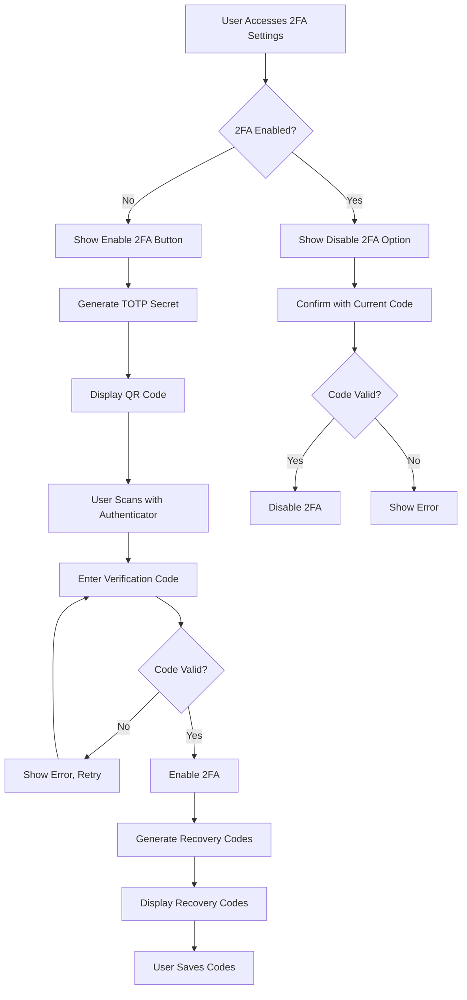

### 2FA Challenge Page

```blade
{{-- resources/views/livewire/auth/two-factor-challenge.blade.php --}}
<div class="max-w-md mx-auto">
    <h1 class="text-2xl font-bold text-gray-900 mb-6">
        {{ __('Pengesahan Dua Faktor / Two-Factor Authentication') }}
    </h1>
    
    <form wire:submit="verify" class="space-y-4">
        @if($useRecoveryCode)
            <x-form.input 
                name="recovery_code"
                label="{{ __('Kod Pemulihan / Recovery Code') }}"
                wire:model="recoveryCode"
                :error="$errors->first('recoveryCode')"
            />
        @else
            <x-form.input 
                name="code"
                label="{{ __('Kod Pengesahan / Authentication Code') }}"
                type="text"
                inputmode="numeric"
                pattern="[0-9]*"
                maxlength="6"
                autocomplete="one-time-code"
                wire:model="code"
                :error="$errors->first('code')"
            />
        @endif
        
        <x-ui.button type="submit" variant="primary" class="w-full">
            {{ __('Sahkan / Verify') }}
        </x-ui.button>
        
        <button type="button" 
                wire:click="$toggle('useRecoveryCode')"
                class="text-sm text-primary-600 hover:text-primary-800">
            {{ $useRecoveryCode ? __('Gunakan kod pengesahan') : __('Gunakan kod pemulihan') }}
        </button>
    </form>
</div>
```

## Asset Availability Calendar Widget

```blade
{{-- resources/views/filament/widgets/asset-availability-calendar.blade.php --}}
<x-filament-widgets::widget>
    <x-filament::section>
        <x-slot name="heading">
            {{ __('Kalendar Ketersediaan Aset / Asset Availability Calendar') }}
        </x-slot>
        
        <div x-data="assetCalendar()" class="space-y-4">
            {{-- Month Navigation --}}
            <div class="flex items-center justify-between">
                <button @click="previousMonth()" class="p-2 hover:bg-gray-100 rounded">
                    <x-heroicon-s-chevron-left class="w-5 h-5" />
                </button>
                <h3 class="font-semibold" x-text="currentMonthYear"></h3>
                <button @click="nextMonth()" class="p-2 hover:bg-gray-100 rounded">
                    <x-heroicon-s-chevron-right class="w-5 h-5" />
                </button>
            </div>
            
            {{-- Calendar Grid --}}
            <div class="grid grid-cols-7 gap-1">
                {{-- Day Headers --}}
                <template x-for="day in ['Ahd', 'Isn', 'Sel', 'Rab', 'Kha', 'Jum', 'Sab']">
                    <div class="text-center text-xs font-medium text-gray-500 py-2" x-text="day"></div>
                </template>
                
                {{-- Calendar Days --}}
                <template x-for="date in calendarDays" :key="date.key">
                    <div :class="{
                        'bg-gray-50': !date.isCurrentMonth,
                        'bg-danger-100': date.hasConflict,
                        'bg-success-100': date.isAvailable && date.isCurrentMonth,
                        'ring-2 ring-primary-500': date.isToday
                    }" class="p-2 text-center text-sm rounded cursor-pointer hover:bg-gray-100"
                         @click="selectDate(date)">
                        <span x-text="date.day"></span>
                        <div x-show="date.bookingCount > 0" class="text-xs text-gray-500">
                            <span x-text="date.bookingCount"></span> {{ __('tempahan') }}
                        </div>
                    </div>
                </template>
            </div>
            
            {{-- Legend --}}
            <div class="flex gap-4 text-xs">
                <div class="flex items-center gap-1">
                    <span class="w-3 h-3 bg-success-100 rounded"></span>
                    {{ __('Tersedia') }}
                </div>
                <div class="flex items-center gap-1">
                    <span class="w-3 h-3 bg-danger-100 rounded"></span>
                    {{ __('Konflik') }}
                </div>
            </div>
        </div>
    </x-filament::section>
</x-filament-widgets::widget>
```

## Additional Correctness Properties

### Property 31: Email Template Bilingual Content
*For any* email template sent by the system, the content SHALL include both Bahasa Melayu and English text sections.
**Validates: D15 §3.1, D11 §6**

### Property 32: Error Page Accessibility
*For any* error page (403, 404, 500), the page SHALL include navigation links, bilingual messaging, and meet WCAG 2.2 AA contrast requirements.
**Validates: Requirements 14.1-14.5**

### Property 33: 2FA Code Validation
*For any* 2FA verification attempt, the system SHALL accept only valid 6-digit TOTP codes or valid recovery codes.
**Validates: D03 SRS-ADM-001**

### Property 34: Asset Calendar Conflict Detection
*For any* date selection in the asset availability calendar, if existing bookings overlap with the selected dates, a conflict indicator SHALL be displayed.
**Validates: Requirements 34.3, 34.4**

### Property 35: PDF Export MOTAC Branding
*For any* PDF export, the document SHALL include MOTAC letterhead with Jata Negara and official branding per D14 specifications.
**Validates: Requirements 20.2, 2.1**

---

**Document Version**: 1.1
**Last Updated**: December 5, 2025
**Author**: ICTServe Development Team
**Status**: Ready for Review
**Requirements Coverage**: 50+ requirements, 250+ acceptance criteria
**Correctness Properties**: 25 testable properties defined
**ICTServe Version Alignment**: v3.5.0 True Hybrid Architecture

---

## Frontend Pages Update Design (routes/web.php)

This section documents the design approach for updating all frontend pages listed in routes/web.php to comply with D00-D17 documentation standards.

### Route Architecture Overview

```mermaid
graph TB
    subgraph "Public Routes (No Auth)"
        W[Welcome /]
        S[Services /services]
        C[Contact /contact]
        F[FAQ /faq]
        A[Accessibility /accessibility]
        PP[Privacy Policy /privacy-policy]
    end

    subgraph "Guest Helpdesk Routes"
        GHC[Guest Create /helpdesk/guest/create]
        HC[Create /helpdesk/create]
        HT[Track /helpdesk/track/{ticketNumber}]
        HS[Success /helpdesk/success]
    end

    subgraph "Guest Loan Routes"
        GLA[Apply /loan/apply]
        GLT[Tracking /loan/tracking/{applicationNumber}]
        GLW[Wizard /loan/wizard]
        GLS[Success /loan/success]
    end

    subgraph "Status Routes"
        SC[Status Check /status]
        SCT[Status Token /status/{token}]
    end

    subgraph "Authenticated Portal Routes"
        D[Dashboard /dashboard]
        PD[Portal Dashboard /portal/dashboard]
        PS[Portal Search /portal/search]
        PP2[Portal Profile /portal/profile]
        PSub[Portal Submissions /portal/submissions]
        PA[Portal Approvals /portal/approvals]
        PDel[Portal Delegations /portal/delegations]
        PL[Portal Link /portal/link-submissions]
    end

    subgraph "Staff Routes (Role Required)"
        SD[Staff Dashboard /staff/dashboard]
        SP[Staff Profile /staff/profile]
        SH[Staff History /staff/history]
        SAQ[Approval Queue /staff/approval-queue]
        SN[Notifications /staff/notifications]
        ST[Tickets /staff/tickets]
        SL[Loans /staff/loans]
        SDR[Data Rights /staff/data-rights]
    end

    subgraph "Loan Approval Routes (Email)"
        LAR[Review /loan/approval/review/{token}]
        LAA[Approve /loan/approval/approve/{token}]
        LAD[Decline /loan/approval/decline/{token}]
    end

    subgraph "Admin Routes"
        AEC[Export CSV /admin/analytics/export/csv]
        AEJ[Export JSON /admin/analytics/export/json]
    end

    subgraph "Auth Routes"
        TFC[2FA Challenge /two-factor-challenge]
        PR[Profile /profile]
    end
```

### Page Layout Templates

#### Guest Layout (guest.blade.php)

Used for: Public pages, Guest helpdesk forms, Guest loan forms, Status checker

```blade
<!DOCTYPE html>
<html lang="{{ str_replace('_', '-', app()->getLocale()) }}" class="{{ session('theme', 'light') }}">
<head>
    <meta charset="utf-8">
    <meta name="viewport" content="width=device-width, initial-scale=1">
    <meta name="csrf-token" content="{{ csrf_token() }}">
    <title>{{ $title ?? config('app.name') }}</title>
    @vite(['resources/css/app.css', 'resources/js/app.js'])
    @livewireStyles
</head>
<body class="min-h-screen bg-bg-washed font-body text-txt-black-900 antialiased">
    {{-- Skip Links --}}
    <x-accessibility.skip-links />
    
    {{-- Header with MOTAC Branding --}}
    <header class="bg-white shadow-card border-b border-otl-divider">
        <div class="max-w-7xl mx-auto px-4 sm:px-6 lg:px-8">
            <div class="flex items-center justify-between h-16">
                {{-- Logo --}}
                <div class="flex items-center gap-4">
                    
                    
                </div>
                
                {{-- Language Switcher --}}
                <x-navigation.language-switcher />
            </div>
        </div>
    </header>
    
    {{-- Main Content --}}
    <main id="main-content" class="max-w-7xl mx-auto px-4 sm:px-6 lg:px-8 py-8">
        {{ $slot }}
    </main>
    
    {{-- Footer --}}
    <footer class="bg-white border-t border-otl-divider mt-auto">
        <div class="max-w-7xl mx-auto px-4 sm:px-6 lg:px-8 py-6">
            <div class="flex flex-col md:flex-row items-center justify-between gap-4">
                <p class="text-sm text-txt-black-500">
                    © {{ date('Y') }} {{ __('Kementerian Pelancongan, Seni dan Budaya Malaysia') }}
                </p>
                <nav class="flex gap-4 text-sm">
                    <a href="{{ route('privacy-policy') }}" class="text-txt-primary-600 hover:text-txt-primary-800">
                        {{ __('Dasar Privasi') }}
                    </a>
                    <a href="{{ route('accessibility') }}" class="text-txt-primary-600 hover:text-txt-primary-800">
                        {{ __('Kebolehcapaian') }}
                    </a>
                </nav>
            </div>
        </div>
    </footer>
    
    {{-- Toast Notifications --}}
    <livewire:components.toast />
    
    @livewireScripts
</body>
</html>
```

#### Authenticated Layout (app.blade.php)

Used for: Dashboard, Portal pages, Staff pages, Admin pages

```blade
<!DOCTYPE html>
<html lang="{{ str_replace('_', '-', app()->getLocale()) }}" class="{{ session('theme', 'light') }}">
<head>
    <meta charset="utf-8">
    <meta name="viewport" content="width=device-width, initial-scale=1">
    <meta name="csrf-token" content="{{ csrf_token() }}">
    <title>{{ $title ?? config('app.name') }}</title>
    @vite(['resources/css/app.css', 'resources/js/app.js'])
    @livewireStyles
</head>
<body class="min-h-screen bg-bg-washed font-body text-txt-black-900 antialiased">
    {{-- Skip Links --}}
    <x-accessibility.skip-links />
    
    <div class="flex min-h-screen">
        {{-- Sidebar Navigation --}}
        <x-navigation.sidebar />
        
        <div class="flex-1 flex flex-col">
            {{-- Top Navigation --}}
            <header class="bg-white shadow-card border-b border-otl-divider">
                <div class="px-4 sm:px-6 lg:px-8">
                    <div class="flex items-center justify-between h-16">
                        {{-- Mobile Menu Toggle --}}
                        <button @click="sidebarOpen = !sidebarOpen" class="lg:hidden p-2">
                            <x-heroicon-o-bars-3 class="w-6 h-6" />
                        </button>
                        
                        {{-- Search --}}
                        <livewire:components.unified-search />
                        
                        {{-- Right Side --}}
                        <div class="flex items-center gap-4">
                            <livewire:notification-bell />
                            <x-navigation.user-menu />
                        </div>
                    </div>
                </div>
            </header>
            
            {{-- Breadcrumb --}}
            @if(isset($breadcrumbs))
                <div class="px-4 sm:px-6 lg:px-8 py-2 bg-white border-b border-otl-divider">
                    <x-navigation.breadcrumb :items="$breadcrumbs" />
                </div>
            @endif
            
            {{-- Main Content --}}
            <main id="main-content" class="flex-1 px-4 sm:px-6 lg:px-8 py-8">
                {{ $slot }}
            </main>
        </div>
    </div>
    
    {{-- Toast Notifications --}}
    <livewire:components.toast />
    
    {{-- Session Timeout Warning --}}
    <livewire:components.session-timeout-warning />
    
    {{-- Keyboard Shortcuts Manager --}}
    <x-ui.keyboard-shortcuts-manager />
    
    @livewireScripts
</body>
</html>
```

### Page-Specific Design Patterns

#### Public Information Pages

| Page | Layout | Key Components | D-Doc Reference |
|------|--------|----------------|-----------------|
| Welcome | guest | Hero section, Service cards, Quick links | D12 §5.1 |
| Services | guest | Service cards with icons, CTA buttons | D14 §6.7 |
| Contact | guest | Contact form, Map, Contact info | D12 §6.2 |
| FAQ | guest | Accordion, Search, Categories | D12 §6.4 |
| Accessibility | guest | Statement, Contact info | D14 §10 |
| Privacy Policy | guest | PDPA content, Data rights | D09 §8.1 |

#### Guest Form Pages

| Page | Layout | Key Components | D-Doc Reference |
|------|--------|----------------|-----------------|
| Helpdesk Create | guest | Form with validation, File upload, PDPA checkbox | D12 §6.2, D13 §3.7 |
| Helpdesk Track | guest | Status display, Timeline, QR code | D12 §6.4 |
| Helpdesk Success | guest | Success message, Reference number, Print button | D14 §9.3 |
| Loan Apply | guest | Multi-step wizard, Calendar, Validation | D13 §3.6 |
| Loan Tracking | guest | Status display, Approval chain, Timeline | D12 §6.4 |
| Loan Success | guest | Success message, Reference number, Print button | D14 §9.3 |

#### Authenticated Portal Pages

| Page | Layout | Key Components | D-Doc Reference |
|------|--------|----------------|-----------------|
| Dashboard | app | Stats cards, Recent activity, Quick actions | D12 §6.4, D14 §6.7 |
| Profile | app | Form, Preferences, 2FA setup | D12 §6.2 |
| Submissions | app | Responsive table, Filters, Export | D12 §6.14 |
| Submission Detail | app | Detail view, Timeline, Comments | D12 §6.4 |
| Search | app | Unified search, Categorized results | D12 §6.14 |
| Approvals | app | Approval queue, Bulk actions | D12 §6.14 |
| Delegations | app | Delegation form, Status list | D12 §6.2 |

### Correctness Properties for Frontend Pages

### Property 36: Public Page Accessibility
*For any* public information page, the page SHALL include skip links, proper heading hierarchy, and meet WCAG 2.2 AA color contrast requirements.
**Validates: Requirements 51.1-51.5**

### Property 37: Guest Form Validation
*For any* guest form submission with invalid data, inline error messages SHALL be displayed with proper aria-describedby linking to the input element.
**Validates: Requirements 52.1-52.5, 53.1-53.5**

### Property 38: Dashboard Real-time Updates
*For any* status change event, the authenticated dashboard statistics SHALL update within 5 seconds via WebSocket connection.
**Validates: Requirements 54.1-54.5**

### Property 39: Table Responsive Behavior
*For any* data table on viewport width <768px, the table SHALL transform to card view with stacked information.
**Validates: Requirements 55.1-55.5**

### Property 40: Approval Page Token Validation
*For any* email-based approval page access, the system SHALL validate the JWT token and display appropriate error if expired or invalid.
**Validates: Requirements 58.1-58.5**

---

**Document Version**: 1.2
**Last Updated**: December 6, 2025
**Author**: ICTServe Development Team
**Status**: Ready for Implementation
**Frontend Routes Coverage**: All routes in routes/web.php documented
**Correctness Properties**: 40 testable properties defined
