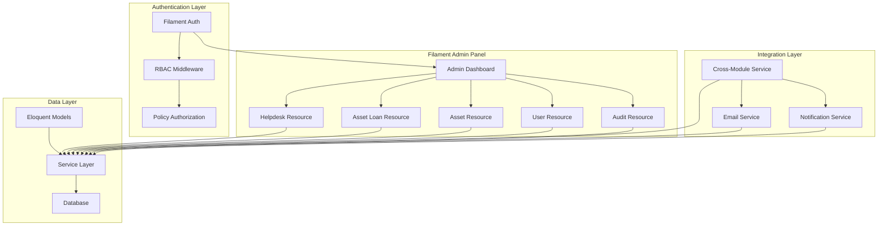
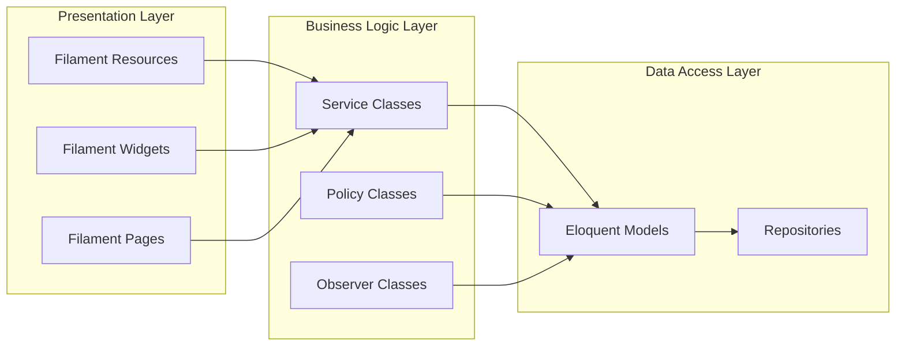

# Design Document: Filament Admin Access

## Overview

This document outlines the technical design for implementing a comprehensive Filament 4-based admin panel for ICTServe. The design follows Laravel 12 conventions, implements four-role RBAC, ensures WCAG 2.2 AA compliance, and integrates with existing helpdesk and asset loan modules.

### Design Goals

1. **Centralized Management**: Single admin interface for all ICTServe operations
2. **Role-Based Security**: Four-tier RBAC with granular permissions
3. **Cross-Module Integration**: Seamless helpdesk-asset loan workflows
4. **Performance**: Core Web Vitals compliance (LCP <2.5s, FID <100ms, CLS <0.1)
5. **Accessibility**: WCAG 2.2 AA compliance with Lighthouse score 100
6. **Maintainability**: Follow Laravel 12 and Filament 4 best practices

## Architecture

### System Context



### Component Architecture



## Components and Interfaces

### 1. Filament Panel Configuration

**File**: `app/Providers/Filament/AdminPanelProvider.php`

```php
<?php

declare(strict_types=1);

namespace App\Providers\Filament;

use Filament\Http\Middleware\Authenticate;
use Filament\Http\Middleware\DisableBladeIconComponents;
use Filament\Http\Middleware\DispatchServingFilamentEvent;
use Filament\Panel;
use Filament\PanelProvider;
use Filament\Support\Colors\Color;
use Illuminate\Cookie\Middleware\AddQueuedCookiesToResponse;
use Illuminate\Cookie\Middleware\EncryptCookies;
use Illuminate\Foundation\Http\Middleware\VerifyCsrfToken;
use Illuminate\Routing\Middleware\SubstituteBindings;
use Illuminate\Session\Middleware\AuthenticateSession;
use Illuminate\Session\Middleware\StartSession;
use Illuminate\View\Middleware\ShareErrorsFromSession;

class AdminPanelProvider extends PanelProvider
{
    public function panel(Panel $panel): Panel
    {
        return $panel
            ->default()
            ->id('admin')
            ->path('admin')
            ->login()
            ->colors([
                'primary' => Color::hex('#0056b3'), // MOTAC Blue
                'success' => Color::hex('#198754'),
                'warning' => Color::hex('#ff8c00'),
                'danger' => Color::hex('#b50c0c'),
            ])
            ->discoverResources(in: app_path('Filament/Resources'), for: 'App\\Filament\\Resources')
            ->discoverPages(in: app_path('Filament/Pages'), for: 'App\\Filament\\Pages')
            ->discoverWidgets(in: app_path('Filament/Widgets'), for: 'App\\Filament\\Widgets')
            ->pages([
                \App\Filament\Pages\Dashboard::class,
            ])
            ->widgets([
                \App\Filament\Widgets\UnifiedDashboardWidget::class,
                \App\Filament\Widgets\SystemPerformanceWidget::class,
                \App\Filament\Widgets\SystemAlertsWidget::class,
            ])
            ->middleware([
                EncryptCookies::class,
                AddQueuedCookiesToResponse::class,
                StartSession::class,
                AuthenticateSession::class,
                ShareErrorsFromSession::class,
                VerifyCsrfToken::class,
                SubstituteBindings::class,
                DisableBladeIconComponents::class,
                DispatchServingFilamentEvent::class,
            ])
            ->authMiddleware([
                Authenticate::class,
                \App\Http\Middleware\EnsureUserHasRole::class.':admin,superuser',
            ])
            ->brandName('ICTServe Admin')
            ->brandLogo(asset('images/motac-logo.png'))
            ->favicon(asset('favicon.ico'))
            ->darkMode(false)
            ->sidebarCollapsibleOnDesktop()
            ->navigationGroups([
                'Helpdesk Management',
                'Asset Management',
                'User Management',
                'System Configuration',
                'Reports & Analytics',
            ]);
    }
}
```

### 2. Helpdesk Ticket Resource

**File**: `app/Filament/Resources/HelpdeskTicketResource.php`

**Key Features**:

- Table with columns: ticket_number, title, priority, status, category, created_at
- Filters: priority, status, category, date_range, assigned_to
- Actions: view, edit, assign, close, reopen
- Bulk actions: assign_multiple, update_priority, export
- Relations: comments, attachments, assigned_user, related_loan

**Schema Components**:

```php
Forms\Components\Section::make('Ticket Information')
    ->schema([
        Forms\Components\TextInput::make('ticket_number')
            ->disabled()
            ->label('Ticket Number'),
        Forms\Components\Select::make('priority')
            ->options([
                'low' => 'Low',
                'medium' => 'Medium',
                'high' => 'High',
                'critical' => 'Critical',
            ])
            ->required(),
        Forms\Components\Select::make('status')
            ->options([
                'open' => 'Open',
                'in_progress' => 'In Progress',
                'resolved' => 'Resolved',
                'closed' => 'Closed',
            ])
            ->required(),
        // ... additional fields
    ]),
```

### 3. Asset Loan Resource

**File**: `app/Filament/Resources/LoanApplicationResource.php`

**Key Features**:

- Table with columns: application_number, applicant_name, asset, status, loan_date, return_date
- Filters: status, approval_status, asset_type, date_range
- Actions: view, edit, approve, reject, issue, return
- Custom pages: IssueLoanApplication, ReturnLoanApplication
- Relations: applicant, asset, approvals, related_ticket

**Custom Actions**:

```php
Tables\Actions\Action::make('issue')
    ->label('Issue Loan')
    ->icon('heroicon-o-check-circle')
    ->color('success')
    ->requiresConfirmation()
    ->action(function (LoanApplication $record) {
        app(LoanApplicationService::class)->issueLoan($record);
    })
    ->visible(fn (LoanApplication $record) => $record->status === 'approved'),
```

### 4. Asset Inventory Resource

**File**: `app/Filament/Resources/AssetResource.php`

**Key Features**:

- Table with columns: asset_code, name, category, status, availability, location
- Filters: category, status, availability, location, condition
- Actions: view, edit, maintenance, retire
- Custom pages: ManageAssetMaintenance, RetireAsset
- Relations: loan_history, maintenance_records

**Availability Indicator**:

```php
Tables\Columns\BadgeColumn::make('availability')
    ->label('Availability')
    ->colors([
        'success' => 'available',
        'warning' => 'on_loan',
        'danger' => 'maintenance',
        'secondary' => 'retired',
    ])
    ->icons([
        'heroicon-o-check-circle' => 'available',
        'heroicon-o-clock' => 'on_loan',
        'heroicon-o-wrench' => 'maintenance',
        'heroicon-o-x-circle' => 'retired',
    ]),
```

### 5. User Management Resource

**File**: `app/Filament/Resources/UserResource.php`

**Key Features**:

- Superuser-only access via policy
- Table with columns: name, email, role, division, grade, status
- Filters: role, division, grade, status
- Actions: view, edit, deactivate, reset_password
- Validation: prevent removing last superuser

**Authorization**:

```php
public static function canViewAny(): bool
{
    return auth()->user()->hasRole('superuser');
}

public static function canCreate(): bool
{
    return auth()->user()->hasRole('superuser');
}
```

### 6. Unified Dashboard Widget

**File**: `app/Filament/Widgets/UnifiedDashboardWidget.php`

**Metrics Displayed**:

- Helpdesk: Total tickets, open tickets, average resolution time, SLA compliance
- Asset Loans: Total applications, pending approvals, active loans, overdue returns
- System: Active users, email queue status, performance metrics

**Implementation**:

```php
protected function getStats(): array
{
    return [
        Stat::make('Open Tickets', HelpdeskTicket::where('status', 'open')->count())
            ->description('Helpdesk tickets awaiting response')
            ->descriptionIcon('heroicon-o-ticket')
            ->color('warning')
            ->chart([7, 3, 4, 5, 6, 3, 5]),

        Stat::make('Pending Approvals', LoanApplication::where('status', 'pending_approval')->count())
            ->description('Loan applications awaiting approval')
            ->descriptionIcon('heroicon-o-clock')
            ->color('info')
            ->chart([3, 5, 4, 6, 7, 5, 6]),

        // ... additional stats
    ];
}
```

### 7. Cross-Module Integration Service

**File**: `app/Services/CrossModuleIntegrationService.php`

**Responsibilities**:

- Link helpdesk tickets to loan applications
- Auto-create tickets for damaged assets
- Sync status updates between modules
- Maintain integration audit trail

**Key Methods**:

```php
public function linkTicketToLoan(HelpdeskTicket $ticket, LoanApplication $loan): void
{
    CrossModuleIntegration::create([
        'source_module' => 'helpdesk',
        'source_id' => $ticket->id,
        'target_module' => 'asset_loan',
        'target_id' => $loan->id,
        'integration_type' => 'damage_report',
        'metadata' => [
            'damage_type' => $ticket->damage_type,
            'reported_at' => now(),
        ],
    ]);
}

public function createTicketForDamagedAsset(LoanApplication $loan, array $damageDetails): HelpdeskTicket
{
    $ticket = app(HybridHelpdeskService::class)->createTicket([
        'title' => "Damaged Asset: {$loan->asset->name}",
        'description' => $damageDetails['description'],
        'priority' => 'high',
        'category' => 'asset_damage',
        'damage_type' => $damageDetails['type'],
        'asset_id' => $loan->asset_id,
        'is_guest' => false,
        'user_id' => $loan->user_id,
    ]);

    $this->linkTicketToLoan($ticket, $loan);

    return $ticket;
}
```

## Data Models

### Database Schema Changes

**Migration**: `database/migrations/2025_11_07_000001_enhance_filament_admin_tables.php`

```php
Schema::table('users', function (Blueprint $table) {
    $table->json('filament_preferences')->nullable()->after('notification_preferences');
    $table->timestamp('last_admin_login_at')->nullable()->after('email_verified_at');
});

Schema::create('filament_audit_logs', function (Blueprint $table) {
    $table->id();
    $table->foreignId('user_id')->constrained()->cascadeOnDelete();
    $table->string('resource');
    $table->string('action'); // view, create, update, delete
    $table->unsignedBigInteger('record_id')->nullable();
    $table->json('old_values')->nullable();
    $table->json('new_values')->nullable();
    $table->string('ip_address', 45);
    $table->text('user_agent')->nullable();
    $table->timestamps();

    $table->index(['user_id', 'created_at']);
    $table->index(['resource', 'action']);
});

Schema::create('filament_saved_filters', function (Blueprint $table) {
    $table->id();
    $table->foreignId('user_id')->constrained()->cascadeOnDelete();
    $table->string('resource');
    $table->string('name');
    $table->json('filters');
    $table->boolean('is_default')->default(false);
    $table->timestamps();

    $table->unique(['user_id', 'resource', 'name']);
});
```

### Model Enhancements

**HelpdeskTicket Model**:

```php
// Add Filament-specific scopes
public function scopeForFilamentTable(Builder $query): Builder
{
    return $query->with(['user', 'assignedTo', 'relatedLoan'])
        ->withCount('comments')
        ->latest();
}

// Add Filament search
public static function getGlobalSearchResults(string $search): Collection
{
    return static::query()
        ->where('ticket_number', 'like', "%{$search}%")
        ->orWhere('title', 'like', "%{$search}%")
        ->limit(10)
        ->get();
}
```

## Error Handling

### Policy-Based Authorization

**File**: `app/Policies/HelpdeskTicketPolicy.php`

```php
public function viewAny(User $user): bool
{
    return $user->hasAnyRole(['admin', 'superuser']);
}

public function view(User $user, HelpdeskTicket $ticket): bool
{
    return $user->hasAnyRole(['admin', 'superuser'])
        || $ticket->user_id === $user->id;
}

public function update(User $user, HelpdeskTicket $ticket): bool
{
    return $user->hasAnyRole(['admin', 'superuser']);
}

public function delete(User $user, HelpdeskTicket $ticket): bool
{
    return $user->hasRole('superuser');
}
```

### Exception Handling

**File**: `app/Exceptions/FilamentAdminException.php`

```php
class FilamentAdminException extends Exception
{
    public static function unauthorizedAccess(): self
    {
        return new self('You do not have permission to access this resource.');
    }

    public static function invalidOperation(string $operation): self
    {
        return new self("Invalid operation: {$operation}");
    }

    public static function resourceNotFound(string $resource): self
    {
        return new self("Resource not found: {$resource}");
    }
}
```

## Testing Strategy

### Unit Tests

**File**: `tests/Unit/Services/CrossModuleIntegrationServiceTest.php`

```php
public function test_links_ticket_to_loan(): void
{
    $ticket = HelpdeskTicket::factory()->create();
    $loan = LoanApplication::factory()->create();

    $service = app(CrossModuleIntegrationService::class);
    $service->linkTicketToLoan($ticket, $loan);

    $this->assertDatabaseHas('cross_module_integrations', [
        'source_module' => 'helpdesk',
        'source_id' => $ticket->id,
        'target_module' => 'asset_loan',
        'target_id' => $loan->id,
    ]);
}
```

### Feature Tests

**File**: `tests/Feature/Filament/HelpdeskTicketResourceTest.php`

```php
public function test_admin_can_view_helpdesk_tickets(): void
{
    $admin = User::factory()->admin()->create();
    $tickets = HelpdeskTicket::factory()->count(5)->create();

    $this->actingAs($admin);

    Livewire::test(ListHelpdeskTickets::class)
        ->assertCanSeeTableRecords($tickets)
        ->assertCanRenderTableColumn('ticket_number')
        ->assertCanRenderTableColumn('priority')
        ->assertCanRenderTableColumn('status');
}

public function test_staff_cannot_access_helpdesk_resource(): void
{
    $staff = User::factory()->staff()->create();

    $this->actingAs($staff)
        ->get(HelpdeskTicketResource::getUrl('index'))
        ->assertForbidden();
}
```

### Accessibility Tests

**File**: `tests/Feature/Filament/AccessibilityTest.php`

```php
public function test_filament_dashboard_meets_wcag_aa(): void
{
    $admin = User::factory()->admin()->create();

    $this->actingAs($admin);

    $response = $this->get('/admin');

    $response->assertStatus(200);

    // Verify color contrast ratios
    $this->assertColorContrast($response, '#0056b3', '#ffffff', 6.8);

    // Verify ARIA attributes
    $response->assertSee('role="navigation"', false);
    $response->assertSee('aria-label', false);

    // Verify keyboard navigation
    $response->assertSee('tabindex', false);
}
```

## Performance Optimization

### Caching Strategy

```php
// Cache dashboard statistics for 5 minutes
protected function getCachedStats(): array
{
    return Cache::remember(
        "filament.dashboard.stats.user.{$this->user->id}",
        now()->addMinutes(5),
        fn () => $this->calculateStats()
    );
}

// Invalidate cache on model changes
class HelpdeskTicketObserver
{
    public function saved(HelpdeskTicket $ticket): void
    {
        Cache::tags(['filament.dashboard'])->flush();
    }
}
```

### Query Optimization

```php
// Eager load relationships in resources
public static function getEloquentQuery(): Builder
{
    return parent::getEloquentQuery()
        ->with(['user', 'assignedTo', 'division', 'grade'])
        ->withCount('comments');
}

// Use database indexes
Schema::table('helpdesk_tickets', function (Blueprint $table) {
    $table->index(['status', 'priority', 'created_at']);
    $table->index(['assigned_to', 'status']);
});
```

## Security Considerations

### CSRF Protection

- All Filament forms include CSRF tokens automatically
- API endpoints use Sanctum token authentication
- Rate limiting: 60 requests per minute per user

### Data Sanitization

```php
// Sanitize user input in forms
Forms\Components\TextInput::make('title')
    ->required()
    ->maxLength(255)
    ->dehydrateStateUsing(fn ($state) => strip_tags($state)),
```

### Audit Logging

```php
// Log all admin actions
class FilamentAuditMiddleware
{
    public function handle(Request $request, Closure $next): Response
    {
        $response = $next($request);

        if ($request->user() && $request->isMethod('POST', 'PUT', 'DELETE')) {
            FilamentAuditLog::create([
                'user_id' => $request->user()->id,
                'resource' => $request->route()->getName(),
                'action' => $request->method(),
                'ip_address' => $request->ip(),
                'user_agent' => $request->userAgent(),
            ]);
        }

        return $response;
    }
}
```

## Deployment Considerations

### Environment Configuration

```env
# Filament Admin Panel
FILAMENT_ADMIN_PATH=admin
FILAMENT_BRAND_NAME="ICTServe Admin"
FILAMENT_DARK_MODE=false

# Performance
FILAMENT_CACHE_DURATION=300
FILAMENT_PAGINATION_SIZE=25

# Security
FILAMENT_MAX_LOGIN_ATTEMPTS=5
FILAMENT_LOGIN_THROTTLE_MINUTES=15
```

### Asset Compilation

```bash
# Build Filament assets
npm run build

# Optimize for production
php artisan filament:optimize
php artisan config:cache
php artisan route:cache
php artisan view:cache
```

## Compliance Verification

### WCAG 2.2 AA Checklist

- ✅ Color contrast: 4.5:1 text, 3:1 UI components
- ✅ Keyboard navigation: All interactive elements accessible
- ✅ ARIA attributes: Proper labels and roles
- ✅ Focus indicators: 3:1 contrast, visible on all elements
- ✅ Touch targets: 44×44px minimum
- ✅ Screen reader support: Semantic HTML and ARIA

### PDPA 2010 Compliance

- ✅ Audit trail: 7-year retention
- ✅ Data encryption: AES-256 for sensitive fields
- ✅ Access control: Role-based with audit logging
- ✅ Data export: User data export functionality
- ✅ Data deletion: Soft deletes with purge after retention period

## References

- **D03**: Software Requirements Specification (FR-001 to FR-015)
- **D04**: Software Design Document (§3-§13)
- **D09**: Database Documentation (§9 Audit Requirements)
- **D11**: Technical Design Documentation (§8 Security)
- **D12**: UI/UX Design Guide (§4 Accessibility)
- **D14**: UI/UX Style Guide (§3 WCAG Compliance)
- **Filament 4 Documentation**: <https://filamentphp.com/docs/4.x>
- **Laravel 12 Documentation**: <https://laravel.com/docs/12.x>
