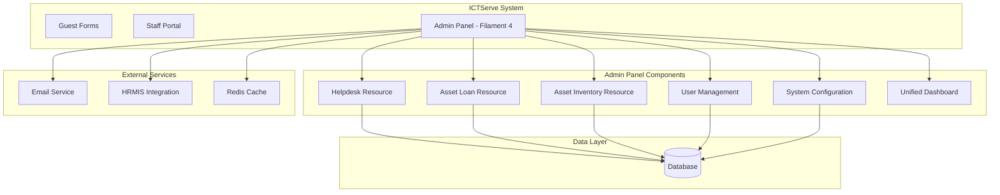
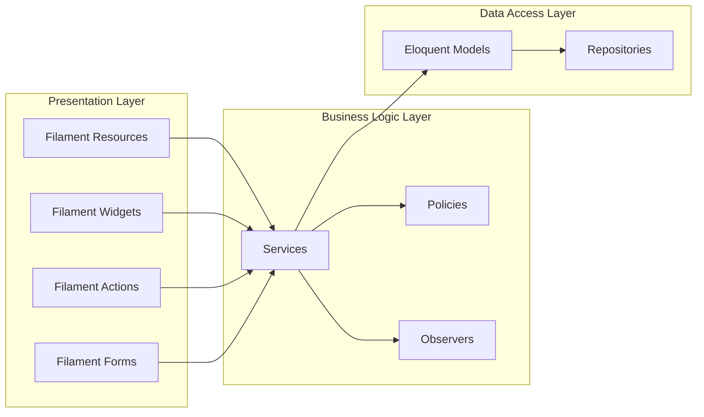

# Filament Admin and Superuser Access - Design Document

## Overview

### Purpose

This design document specifies the architecture, components, and implementation approach for the Filament Admin and Superuser Access system within ICTServe. The admin panel provides a comprehensive backend interface for managing helpdesk tickets, asset loans, inventory, users, and system configuration through Filament 4.

### Scope

The design covers:

- **Admin Role**: Operational management of tickets, loans, and inventory
- **Superuser Role**: System governance including user management and configuration
- **Unified Dashboard**: Combined analytics from helpdesk and asset loan modules
- **Cross-Module Integration**: Seamless asset-ticket linking and maintenance workflows
- **Security & Compliance**: RBAC, audit trails, WCAG 2.2 AA accessibility

### Design Principles

1. **Separation of Concerns**: Admin panel operates independently from guest forms and staff portal
2. **Role-Based Access**: Strict RBAC with Admin and Superuser roles
3. **Audit-First**: Comprehensive logging of all administrative actions
4. **Performance**: Optimized queries, caching, and real-time updates
5. **Accessibility**: WCAG 2.2 AA compliance throughout
6. **Bilingual Support**: Bahasa Melayu (primary) and English (secondary)

## Architecture

### System Context



### Technology Stack

**Core Framework**:

- **Filament 4**: Admin panel framework with SDUI approach
- **Laravel 12**: Backend framework with PHP 8.2+
- **Livewire 3**: Server-driven UI for real-time interactions
- **Alpine.js 3**: Client-side interactivity (bundled with Livewire)
- **Tailwind CSS 3**: Utility-first styling

**Supporting Technologies**:

- **Spatie Laravel Permission 6**: Role-based access control
- **Laravel Auditing 14**: Comprehensive audit trails
- **Laravel Breeze 2**: Authentication scaffolding
- **Redis**: Caching and queue backend
- **MySQL 8**: Primary database

### Architectural Layers



### Design Decisions

**Decision 1: Filament 4 as Admin Framework**

- **Rationale**: Provides SDUI approach, reducing frontend complexity
- **Benefits**: Rapid development, built-in CRUD, excellent Laravel integration
- **Trade-offs**: Less flexibility than custom admin panel, learning curve for team

**Decision 2: Separate Admin Panel from Staff Portal**

- **Rationale**: Different access patterns, security requirements, and user roles
- **Benefits**: Clear separation of concerns, independent scaling, better security
- **Trade-offs**: Some code duplication, separate authentication context

**Decision 3: Unified Dashboard for Both Modules**

- **Rationale**: Admins need holistic view of system operations
- **Benefits**: Single source of truth, cross-module insights, efficient monitoring
- **Trade-offs**: Complex data aggregation, potential performance impact

**Decision 4: Real-time Updates with Livewire Polling**

- **Rationale**: Admin users need current information without manual refresh
- **Benefits**: Better UX, timely alerts, reduced manual intervention
- **Trade-offs**: Increased server load, network traffic

## Components and Interfaces

### Filament Resources

#### 1. Helpdesk Ticket Resource

**Location**: `app/Filament/Resources/HelpdeskTicketResource.php`

**Purpose**: Manage helpdesk tickets with CRUD operations, assignment, and status tracking

**Key Features**:

- List view with sorting, filtering, and search
- Detail view with complete ticket information
- Assignment interface with division selection
- Status transition validation
- Bulk operations (assignment, status updates, export)
- Related asset information display

**Table Columns**:

```php
Tables\Columns\TextColumn::make('ticket_number')
    ->searchable()
    ->sortable(),
Tables\Columns\TextColumn::make('requester.name')
    ->searchable()
    ->sortable(),
Tables\Columns\BadgeColumn::make('priority')
    ->colors([
        'danger' => 'critical',
        'warning' => 'high',
        'primary' => 'medium',
        'secondary' => 'low',
    ]),
Tables\Columns\BadgeColumn::make('status')
    ->colors([
        'secondary' => 'submitted',
        'primary' => 'assigned',
        'warning' => 'in_progress',
        'success' => 'resolved',
        'gray' => 'closed',
    ]),
Tables\Columns\TextColumn::make('assigned_division.name'),
Tables\Columns\TextColumn::make('created_at')
    ->dateTime()
    ->sortable(),
```

**Form Schema**:

```php
Forms\Components\Section::make('Ticket Information')
    ->schema([
        Forms\Components\TextInput::make('ticket_number')
            ->disabled(),
        Forms\Components\Select::make('priority')
            ->options([
                'low' => 'Low',
                'medium' => 'Medium',
                'high' => 'High',
                'critical' => 'Critical',
            ])
            ->required(),
        Forms\Components\Select::make('status')
            ->options([
                'submitted' => 'Submitted',
                'assigned' => 'Assigned',
                'in_progress' => 'In Progress',
                'resolved' => 'Resolved',
                'closed' => 'Closed',
            ])
            ->required(),
        Forms\Components\Select::make('assigned_division_id')
            ->relationship('assignedDivision', 'name')
            ->searchable()
            ->preload(),
    ]),
```

**Filters**:

- Priority filter (low, medium, high, critical)
- Status filter (submitted, assigned, in_progress, resolved, closed)
- Date range filter (created_at)
- Division filter (assigned_division_id)
- Category filter (category_id)

**Actions**:

- Assign ticket (modal with division selection, SLA calculation)
- Update status (with validation and notifications)
- View history (status timeline, assignment history)
- Export ticket (PDF format with attachments)

#### 2. Asset Loan Resource

**Location**: `app/Filament/Resources/LoanApplicationResource.php`

**Purpose**: Manage asset loan applications with approval processing and transaction tracking

**Key Features**:

- List view with advanced filtering
- Asset assignment interface with availability checking
- Return processing with condition assessment
- Automatic maintenance ticket creation for damaged assets
- Asset availability calendar widget

**Table Columns**:

```php
Tables\Columns\TextColumn::make('applicant.name')
    ->searchable()
    ->sortable(),
Tables\Columns\TextColumn::make('asset.name')
    ->searchable(),
Tables\Columns\TextColumn::make('loan_start_date')
    ->date()
    ->sortable(),
Tables\Columns\TextColumn::make('loan_end_date')
    ->date()
    ->sortable(),
Tables\Columns\BadgeColumn::make('status')
    ->colors([
        'secondary' => 'pending',
        'warning' => 'approved',
        'success' => 'issued',
        'primary' => 'returned',
        'danger' => 'overdue',
    ]),
Tables\Columns\BadgeColumn::make('approval_status')
    ->colors([
        'secondary' => 'pending',
        'success' => 'approved',
        'danger' => 'rejected',
    ]),
```

**Form Schema**:

```php
Forms\Components\Section::make('Loan Details')
    ->schema([
        Forms\Components\Select::make('asset_id')
            ->relationship('asset', 'name')
            ->searchable()
            ->preload()
            ->reactive()
            ->afterStateUpdated(fn ($state, callable $set) => 
                $set('availability_status', Asset::find($state)?->availability_status)
            ),
        Forms\Components\Placeholder::make('availability_status')
            ->content(fn ($get) => $get('availability_status')),
        Forms\Components\DatePicker::make('loan_start_date')
            ->required(),
        Forms\Components\DatePicker::make('loan_end_date')
            ->required()
            ->after('loan_start_date'),
        Forms\Components\Select::make('condition_on_issue')
            ->options([
                'excellent' => 'Excellent',
                'good' => 'Good',
                'fair' => 'Fair',
            ])
            ->required(),
    ]),
```

**Actions**:

- Process issuance (condition assessment, accessory checklist)
- Process return (condition verification, damage reporting)
- View loan history
- Export loan records

#### 3. Asset Inventory Resource

**Location**: `app/Filament/Resources/AssetResource.php`

**Purpose**: Manage ICT asset inventory with specifications, condition tracking, and lifecycle management

**Key Features**:

- CRUD operations for assets
- Specification management (brand, model, serial number)
- Condition tracking with history
- Loan history display
- Related helpdesk tickets tab
- Asset utilization analytics

**Table Columns**:

```php
Tables\Columns\TextColumn::make('asset_code')
    ->searchable()
    ->sortable(),
Tables\Columns\TextColumn::make('name')
    ->searchable()
    ->sortable(),
Tables\Columns\TextColumn::make('category.name'),
Tables\Columns\TextColumn::make('brand'),
Tables\Columns\TextColumn::make('model'),
Tables\Columns\BadgeColumn::make('condition')
    ->colors([
        'success' => 'excellent',
        'primary' => 'good',
        'warning' => 'fair',
        'danger' => ['poor', 'damaged'],
    ]),
Tables\Columns\BadgeColumn::make('availability_status')
    ->colors([
        'success' => 'available',
        'warning' => 'loaned',
        'danger' => 'maintenance',
        'gray' => 'retired',
    ]),
```

**Form Schema**:

```php
Forms\Components\Section::make('Asset Information')
    ->schema([
        Forms\Components\TextInput::make('asset_code')
            ->required()
            ->unique(ignoreRecord: true),
        Forms\Components\TextInput::make('name')
            ->required(),
        Forms\Components\Select::make('category_id')
            ->relationship('category', 'name')
            ->required(),
        Forms\Components\TextInput::make('brand'),
        Forms\Components\TextInput::make('model'),
        Forms\Components\TextInput::make('serial_number')
            ->unique(ignoreRecord: true),
        Forms\Components\Textarea::make('specifications')
            ->rows(3),
        Forms\Components\Select::make('condition')
            ->options([
                'excellent' => 'Excellent',
                'good' => 'Good',
                'fair' => 'Fair',
                'poor' => 'Poor',
                'damaged' => 'Damaged',
            ])
            ->required(),
        Forms\Components\Select::make('availability_status')
            ->options([
                'available' => 'Available',
                'loaned' => 'Loaned',
                'maintenance' => 'Maintenance',
                'retired' => 'Retired',
            ])
            ->required(),
    ]),
```

**Relations**:

- Loan history (hasMany relationship)
- Related tickets (hasMany through asset_id)
- Maintenance records (filtered tickets)

#### 4. User Management Resource (Superuser Only)

**Location**: `app/Filament/Resources/UserResource.php`

**Purpose**: Manage user accounts with role assignment and activity monitoring

**Key Features**:

- CRUD operations for users
- Role assignment with validation
- Bulk operations (role assignment, activation/deactivation)
- User activity dashboard
- Password reset functionality

**Table Columns**:

```php
Tables\Columns\TextColumn::make('name')
    ->searchable()
    ->sortable(),
Tables\Columns\TextColumn::make('email')
    ->searchable(),
Tables\Columns\TextColumn::make('staff_id')
    ->searchable(),
Tables\Columns\TextColumn::make('grade')
    ->sortable(),
Tables\Columns\TextColumn::make('division.name'),
Tables\Columns\BadgeColumn::make('roles.name')
    ->colors([
        'danger' => 'superuser',
        'warning' => 'admin',
        'primary' => 'approver',
        'secondary' => 'staff',
    ]),
Tables\Columns\IconColumn::make('is_active')
    ->boolean(),
```

**Form Schema**:

```php
Forms\Components\Section::make('User Information')
    ->schema([
        Forms\Components\TextInput::make('name')
            ->required(),
        Forms\Components\TextInput::make('email')
            ->email()
            ->required()
            ->unique(ignoreRecord: true),
        Forms\Components\TextInput::make('staff_id')
            ->required()
            ->unique(ignoreRecord: true),
        Forms\Components\TextInput::make('grade')
            ->numeric()
            ->required(),
        Forms\Components\Select::make('division_id')
            ->relationship('division', 'name')
            ->required(),
        Forms\Components\Select::make('roles')
            ->relationship('roles', 'name')
            ->multiple()
            ->preload()
            ->required(),
        Forms\Components\Toggle::make('is_active')
            ->default(true),
    ]),
```

**Authorization**:

- Only superusers can access this resource
- Role assignment validation (Grade 41+ for Approver)
- Audit logging for all user management actions

### Filament Widgets

#### 1. Unified Statistics Widget

**Location**: `app/Filament/Widgets/UnifiedStatsWidget.php`

**Purpose**: Display combined metrics from helpdesk and asset loan modules

**Metrics**:

- Total tickets (all time)
- Open tickets (current)
- SLA compliance percentage (last 30 days)
- Total loans (all time)
- Active loans (current)
- Overdue items (current)
- Asset utilization rate (last 30 days)

**Implementation**:

```php
protected function getStats(): array
{
    return [
        Stat::make('Total Tickets', HelpdeskTicket::count())
            ->description('All time')
            ->icon('heroicon-o-ticket'),
        Stat::make('Open Tickets', HelpdeskTicket::whereIn('status', ['submitted', 'assigned', 'in_progress'])->count())
            ->description('Current')
            ->icon('heroicon-o-inbox')
            ->color('warning'),
        Stat::make('SLA Compliance', $this->calculateSLACompliance() . '%')
            ->description('Last 30 days')
            ->icon('heroicon-o-clock')
            ->color($this->calculateSLACompliance() >= 90 ? 'success' : 'danger'),
        Stat::make('Active Loans', LoanApplication::where('status', 'issued')->count())
            ->description('Current')
            ->icon('heroicon-o-cube')
            ->color('primary'),
        Stat::make('Overdue Items', LoanApplication::where('status', 'overdue')->count())
            ->description('Requires attention')
            ->icon('heroicon-o-exclamation-triangle')
            ->color('danger'),
        Stat::make('Asset Utilization', $this->calculateAssetUtilization() . '%')
            ->description('Last 30 days')
            ->icon('heroicon-o-chart-bar')
            ->color('success'),
    ];
}
```

**Refresh Interval**: 300 seconds (5 minutes)

#### 2. Ticket Trends Chart Widget

**Location**: `app/Filament/Widgets/TicketTrendsChartWidget.php`

**Purpose**: Visualize ticket volume and resolution trends over time

**Chart Type**: Line chart with multiple datasets

**Data**:

- Tickets created (by day/week/month)
- Tickets resolved (by day/week/month)
- Average resolution time (by day/week/month)

**Filters**:

- Date range (today, week, month, year, custom)
- Priority filter
- Category filter

#### 3. Asset Utilization Chart Widget

**Location**: `app/Filament/Widgets/AssetUtilizationChartWidget.php`

**Purpose**: Display asset loan patterns and utilization rates

**Chart Type**: Bar chart with stacked data

**Data**:

- Assets loaned (by category)
- Average loan duration (by category)
- Most requested assets (top 10)

#### 4. Recent Activity Feed Widget

**Location**: `app/Filament/Widgets/RecentActivityWidget.php`

**Purpose**: Show latest system events and actions

**Activities**:

- Latest tickets created
- Latest loan applications
- Recent approvals/rejections
- Status changes
- User actions

**Refresh**: Real-time using Livewire polling (every 60 seconds)

#### 5. Asset Availability Calendar Widget

**Location**: `app/Filament/Widgets/AssetAvailabilityCalendarWidget.php`

**Purpose**: Visual calendar showing asset bookings and availability

**Features**:

- Monthly/weekly view
- Color-coded events (available, loaned, maintenance)
- Click to view details
- Filter by asset category

### Filament Actions

#### 1. Assign Ticket Action

**Purpose**: Assign helpdesk ticket to division with SLA calculation

**Implementation**:

```php
Tables\Actions\Action::make('assign')
    ->icon('heroicon-o-user-plus')
    ->form([
        Forms\Components\Select::make('assigned_division_id')
            ->label('Assign to Division')
            ->relationship('divisions', 'name')
            ->required(),
        Forms\Components\Select::make('priority')
            ->options([
                'low' => 'Low',
                'medium' => 'Medium',
                'high' => 'High',
                'critical' => 'Critical',
            ])
            ->required(),
        Forms\Components\Placeholder::make('sla_deadline')
            ->content(fn ($get) => $this->calculateSLADeadline($get('priority'))),
    ])
    ->action(function (HelpdeskTicket $record, array $data): void {
        $record->update([
            'assigned_division_id' => $data['assigned_division_id'],
            'priority' => $data['priority'],
            'status' => 'assigned',
            'sla_deadline' => $this->calculateSLADeadline($data['priority']),
        ]);
        
        // Send email notification
        Mail::to($record->assignedDivision->email)
            ->queue(new TicketAssignedMail($record));
        
        // Log audit trail
        activity()
            ->performedOn($record)
            ->log('Ticket assigned to ' . $record->assignedDivision->name);
        
        Notification::make()
            ->success()
            ->title('Ticket assigned successfully')
            ->send();
    })
    ->requiresConfirmation();
```

#### 2. Process Asset Return Action

**Purpose**: Process asset return with condition assessment and automatic maintenance ticket creation

**Implementation**:

```php
Tables\Actions\Action::make('process_return')
    ->icon('heroicon-o-arrow-left')
    ->form([
        Forms\Components\Select::make('condition_on_return')
            ->options([
                'excellent' => 'Excellent',
                'good' => 'Good',
                'fair' => 'Fair',
                'poor' => 'Poor',
                'damaged' => 'Damaged',
            ])
            ->required()
            ->reactive(),
        Forms\Components\Textarea::make('damage_description')
            ->visible(fn ($get) => in_array($get('condition_on_return'), ['poor', 'damaged']))
            ->required(fn ($get) => in_array($get('condition_on_return'), ['poor', 'damaged'])),
        Forms\Components\CheckboxList::make('accessories_returned')
            ->options(fn ($record) => $record->accessories_issued ?? [])
            ->required(),
    ])
    ->action(function (LoanApplication $record, array $data): void {
        $record->update([
            'status' => 'returned',
            'condition_on_return' => $data['condition_on_return'],
            'damage_description' => $data['damage_description'] ?? null,
            'returned_at' => now(),
        ]);
        
        // Update asset availability
        $asset = $record->asset;
        $asset->update([
            'condition' => $data['condition_on_return'],
            'availability_status' => in_array($data['condition_on_return'], ['poor', 'damaged']) 
                ? 'maintenance' 
                : 'available',
        ]);
        
        // Create maintenance ticket if damaged
        if (in_array($data['condition_on_return'], ['poor', 'damaged'])) {
            $ticket = HelpdeskTicket::create([
                'ticket_number' => $this->generateTicketNumber(),
                'category_id' => Category::where('name', 'Maintenance')->first()->id,
                'priority' => 'high',
                'status' => 'submitted',
                'description' => 'Asset returned with damage: ' . $data['damage_description'],
                'asset_id' => $asset->id,
                'requester_id' => auth()->id(),
            ]);
            
            Notification::make()
                ->warning()
                ->title('Maintenance ticket created')
                ->body('Ticket #' . $ticket->ticket_number . ' created for damaged asset')
                ->send();
        }
        
        Notification::make()
            ->success()
            ->title('Asset return processed')
            ->send();
    })
    ->requiresConfirmation();
```

#### 3. Bulk Assignment Action

**Purpose**: Assign multiple tickets to a division simultaneously

**Implementation**:

```php
Tables\BulkActions\BulkAction::make('bulk_assign')
    ->icon('heroicon-o-user-group')
    ->form([
        Forms\Components\Select::make('assigned_division_id')
            ->label('Assign to Division')
            ->relationship('divisions', 'name')
            ->required(),
    ])
    ->action(function (Collection $records, array $data): void {
        $records->each(function ($record) use ($data) {
            $record->update([
                'assigned_division_id' => $data['assigned_division_id'],
                'status' => 'assigned',
            ]);
            
            // Send email notification
            Mail::to($record->assignedDivision->email)
                ->queue(new TicketAssignedMail($record));
        });
        
        Notification::make()
            ->success()
            ->title($records->count() . ' tickets assigned successfully')
            ->send();
    })
    ->deselectRecordsAfterCompletion()
    ->requiresConfirmation();
```

## Data Models

### Core Models

#### HelpdeskTicket Model

**Location**: `app/Models/HelpdeskTicket.php`

**Attributes**:

```php
protected $fillable = [
    'ticket_number',
    'requester_id',
    'category_id',
    'priority',
    'status',
    'subject',
    'description',
    'assigned_division_id',
    'assigned_user_id',
    'asset_id',
    'sla_deadline',
    'resolved_at',
    'closed_at',
];

protected $casts = [
    'sla_deadline' => 'datetime',
    'resolved_at' => 'datetime',
    'closed_at' => 'datetime',
];
```

**Relationships**:

```php
public function requester():longsTo
{
    return $this->belongsTo(User::class, 'requester_id');
}

public function category(): BelongsTo
{
    return $this->belongsTo(Category::class);
}

public function assignedDivision(): BelongsTo
{
    return $this->belongsTo(Division::class, 'assigned_division_id');
}

public function assignedUser(): BelongsTo
{
    return $this->belongsTo(User::class, 'assigned_user_id');
}

public function asset(): BelongsTo
{
    return $this->belongsTo(Asset::class);
}

public function comments(): HasMany
{
    return $this->hasMany(HelpdeskComment::class);
}

public function attachments(): HasMany
{
    return $this->hasMany(HelpdeskAttachment::class);
}
```

**Scopes**:

```php
public function scopeOpen($query)
{
    return $query->whereIn('status', ['submitted', 'assigned', 'in_progress']);
}

public function scopeOverdue($query)
{
    return $query->where('sla_deadline', '<', now())
        ->whereNotIn('status', ['resolved', 'closed']);
}

public function scopeBreachingSLA($query)
{
    return $query->where('sla_deadline', '<', now()->addHours(6))
        ->whereNotIn('status', ['resolved', 'closed']);
}
```

#### LoanApplication Model

**Location**: `app/Models/LoanApplication.php`

**Attributes**:

```php
protected $fillable = [
    'application_number',
    'applicant_id',
    'asset_id',
    'loan_start_date',
    'loan_end_date',
    'purpose',
    'status',
    'approval_status',
    'approver_id',
    'approved_at',
    'condition_on_issue',
    'condition_on_return',
    'damage_description',
    'issued_at',
    'returned_at',
];

protected $casts = [
    'loan_start_date' => 'date',
    'loan_end_date' => 'date',
    'approved_at' => 'datetime',
    'issued_at' => 'datetime',
    'returned_at' => 'datetime',
];
```

**Relationships**:

```php
public function applicant(): BelongsTo
{
    return $this->belongsTo(User::class, 'applicant_id');
}

public function asset(): BelongsTo
{
    return $this->belongsTo(Asset::class);
}

public function approver(): BelongsTo
{
    return $this->belongsTo(User::class, 'approver_id');
}
```

**Scopes**:

```php
public function scopeActive($query)
{
    return $query->where('status', 'issued');
}

public function scopeOverdue($query)
{
    return $query->where('status', 'issued')
        ->where('loan_end_date', '<', now());
}

public function scopePendingReturn($query)
{
    return $query->where('status', 'issued')
        ->where('loan_end_date', '<=', now()->addDays(2));
}
```

#### Asset Model

**Location**: `app/Models/Asset.php`

**Attributes**:

```php
protected $fillable = [
    'asset_code',
    'name',
    'category_id',
    'brand',
    'model',
    'serial_number',
    'specifications',
    'condition',
    'availability_status',
    'purchase_date',
    'purchase_cost',
    'warranty_expiry',
];

protected $casts = [
    'purchase_date' => 'date',
    'warranty_expiry' => 'date',
    'purchase_cost' => 'decimal:2',
];
```

**Relationships**:

```php
public function category(): BelongsTo
{
    return $this->belongsTo(AssetCategory::class, 'category_id');
}

public function loanApplications(): HasMany
{
    return $this->hasMany(LoanApplication::class);
}

public function tickets(): HasMany
{
    return $this->hasMany(HelpdeskTicket::class);
}

public function maintenanceTickets(): HasMany
{
    return $this->hasMany(HelpdeskTicket::class)
        ->whereHas('category', fn($q) => $q->where('name', 'Maintenance'));
}
```

**Scopes**:

```php
public function scopeAvailable($query)
{
    return $query->where('availability_status', 'available');
}

public function scopeInMaintenance($query)
{
    return $query->where('availability_status', 'maintenance');
}
```

### Database Schema

#### helpdesk_tickets Table

```sql
CREATE TABLE helpdesk_tickets (
    id BIGINT UNSIGNED AUTO_INCREMENT PRIMARY KEY,
    ticket_number VARCHAR(20) UNIQUE NOT NULL,
    requester_id BIGINT UNSIGNED NOT NULL,
    category_id BIGINT UNSIGNED NOT NULL,
    priority ENUM('low', 'medium', 'high', 'critical') NOT NULL,
    status ENUM('submitted', 'assigned', 'in_progress', 'resolved', 'closed') NOT NULL,
    subject VARCHAR(255) NOT NULL,
    description TEXT NOT NULL,
    assigned_division_id BIGINT UNSIGNED NULL,
    assigned_user_id BIGINT UNSIGNED NULL,
    asset_id BIGINT UNSIGNED NULL,
    sla_deadline TIMESTAMP NULL,
    resolved_at TIMESTAMP NULL,
    closed_at TIMESTAMP NULL,
    created_at TIMESTAMP NULL,
    updated_at TIMESTAMP NULL,
    
    INDEX idx_ticket_number (ticket_number),
    INDEX idx_requester (requester_id),
    INDEX idx_status (status),
    INDEX idx_priority (priority),
    INDEX idx_assigned_division (assigned_division_id),
    INDEX idx_asset (asset_id),
    INDEX idx_sla_deadline (sla_deadline),
    
    FOREIGN KEY (requester_id) REFERENCES users(id) ON DELETE RESTRICT,
    FOREIGN KEY (category_id) REFERENCES categories(id) ON DELETE RESTRICT,
    FOREIGN KEY (assigned_division_id) REFERENCES divisions(id) ON DELETE SET NULL,
    FOREIGN KEY (assigned_user_id) REFERENCES users(id) ON DELETE SET NULL,
    FOREIGN KEY (asset_id) REFERENCES assets(id) ON DELETE SET NULL
);
```

#### loan_applications Table

```sql
CREATE TABLE loan_applications (
    id BIGINT UNSIGNED AUTO_INCREMENT PRIMARY KEY,
    application_number VARCHAR(20) UNIQUE NOT NULL,
    applicant_id BIGINT UNSIGNED NOT NULL,
    asset_id BIGINT UNSIGNED NOT NULL,
    loan_start_date DATE NOT NULL,
    loan_end_date DATE NOT NULL,
    purpose TEXT NOT NULL,
    status ENUM('pending', 'approved', 'issued', 'returned', 'overdue', 'cancelled') NOT NULL,
    approval_status ENUM('pending', 'approved', 'rejected') NOT NULL,
    approver_id BIGINT UNSIGNED NULL,
    approved_at TIMESTAMP NULL,
    condition_on_issue ENUM('excellent', 'good', 'fair') NULL,
    condition_on_return ENUM('excellent', 'good', 'fair', 'poor', 'damaged') NULL,
    damage_description TEXT NULL,
    issued_at TIMESTAMP NULL,
    returned_at TIMESTAMP NULL,
    created_at TIMESTAMP NULL,
    updated_at TIMESTAMP NULL,
    
    INDEX idx_application_number (application_number),
    INDEX idx_applicant (applicant_id),
    INDEX idx_asset (asset_id),
    INDEX idx_status (status),
    INDEX idx_loan_dates (loan_start_date, loan_end_date),
    
    FOREIGN KEY (applicant_id) REFERENCES users(id) ON DELETE RESTRICT,
    FOREIGN KEY (asset_id) REFERENCES assets(id) ON DELETE RESTRICT,
    FOREIGN KEY (approver_id) REFERENCES users(id) ON DELETE SET NULL
);
```

#### assets Table

```sql
CREATE TABLE assets (
    id BIGINT UNSIGNED AUTO_INCREMENT PRIMARY KEY,
    asset_code VARCHAR(50) UNIQUE NOT NULL,
    name VARCHAR(255) NOT NULL,
    category_id BIGINT UNSIGNED NOT NULL,
    brand VARCHAR(100) NULL,
    model VARCHAR(100) NULL,
    serial_number VARCHAR(100) UNIQUE NULL,
    specifications TEXT NULL,
    condition ENUM('excellent', 'good', 'fair', 'poor', 'damaged') NOT NULL,
    availability_status ENUM('available', 'loaned', 'maintenance', 'retired') NOT NULL,
    purchase_date DATE NULL,
    purchase_cost DECIMAL(10, 2) NULL,
    warranty_expiry DATE NULL,
    created_at TIMESTAMP NULL,
    updated_at TIMESTAMP NULL,
    
    INDEX idx_asset_code (asset_code),
    INDEX idx_category (category_id),
    INDEX idx_availability (availability_status),
    INDEX idx_condition (condition),
    
    FOREIGN KEY (category_id) REFERENCES asset_categories(id) ON DELETE RESTRICT
);
```

## Error Handling

### Validation Errors

**Strategy**: Use Filament's built-in validation with custom error messages

**Implementation**:

```php
Forms\Components\TextInput::make('email')
    ->email()
    ->required()
    ->unique(ignoreRecord: true)
    ->validationMessages([
        'required' => 'Email address is required',
        'email' => 'Please enter a valid email address',
        'unique' => 'This email address is already registered',
    ]);
```

### Business Logic Errors

**Strategy**: Throw custom exceptions with user-friendly messages

**Example**:

```php
// In service class
if ($asset->availability_status !== 'available') {
    throw new AssetNotAvailableException(
        'Asset ' . $asset->asset_code . ' is currently ' . $asset->availability_status
    );
}

// In Filament action
try {
    $this->assetService->issueAsset($loan, $asset);
} catch (AssetNotAvailableException $e) {
    Notification::make()
        ->danger()
        ->title('Asset not available')
        ->body($e->getMessage())
        ->send();
    return;
}
```

### System Errors

**Strategy**: Log errors and display generic message to users

**Implementation**:

```php
try {
    // Critical operation
    DB::transaction(function () use ($data) {
        // ... operations
    });
} catch (\Exception $e) {
    Log::error('Failed to process loan application', [
        'error' => $e->getMessage(),
        'trace' => $e->getTraceAsString(),
        'user' => auth()->id(),
    ]);
    
    Notification::make()
        ->danger()
        ->title('System error')
        ->body('An error occurred while processing your request. Please try again or contact support.')
        ->send();
}
```

### SLA Breach Handling

**Strategy**: Automated monitoring with escalation notifications

**Implementation**:

```php
// In scheduled command
$breachingTickets = HelpdeskTicket::breachingSLA()->get();

foreach ($breachingTickets as $ticket) {
    // Send escalation notification
    Mail::to($ticket->assignedDivision->supervisor_email)
        ->queue(new SLABreachWarningMail($ticket));
    
    // Create notification in admin panel
    Notification::make()
        ->danger()
        ->title('SLA Breach Warning')
        ->body('Ticket #' . $ticket->ticket_number . ' is approaching SLA deadline')
        ->sendToDatabase(User::role('admin')->get());
}
```

## Testing Strategy

### Unit Tests

**Coverage**:

- Model relationships and scopes
- Service class business logic
- Helper functions and utilities
- Policy authorization rules

**Example**:

```php
// tests/Unit/Models/HelpdeskTicketTest.php
public function test_ticket_is_overdue_when_past_sla_deadline(): void
{
    $ticket = HelpdeskTicket::factory()->create([
        'sla_deadline' => now()->subHours(1),
        'status' => 'assigned',
    ]);
    
    $this->assertTrue($ticket->isOverdue());
}

public function test_ticket_calculates_sla_deadline_correctly(): void
{
    $ticket = HelpdeskTicket::factory()->create([
        'priority' => 'critical',
        'created_at' => now(),
    ]);
    
    $expectedDeadline = now()->addHours(4);
    $this->assertEquals($expectedDeadline->format('Y-m-d H:i'), $ticket->sla_deadline->format('Y-m-d H:i'));
}
```

### Feature Tests

**Coverage**:

- Filament resource CRUD operations
- Action execution and validation
- Bulk operations
- Authorization checks

**Example**:

```php
// tests/Feature/Filament/HelpdeskTicketResourceTest.php
public function test_admin_can_assign_ticket_to_division(): void
{
    $admin = User::factory()->create();
    $admin->assignRole('admin');
    
    $ticket = HelpdeskTicket::factory()->create(['status' => 'submitted']);
    $division = Division::factory()->create();
    
    Livewire::actingAs($admin)
        ->test(HelpdeskTicketResource\Pages\EditHelpdeskTicket::class, ['record' => $ticket->id])
        ->callAction('assign', [
            'assigned_division_id' => $division->id,
            'priority' => 'high',
        ])
        ->assertNotified();
    
    $this->assertEquals('assigned', $ticket->fresh()->status);
    $this->assertEquals($division->id, $ticket->fresh()->assigned_division_id);
}
```

### Integration Tests

**Coverage**:

- Cross-module workflows (asset return → maintenance ticket)
- Email notification delivery
- Audit trail logging
- External service integration (HRMIS)

**Example**:

```php
// tests/Feature/Integration/AssetMaintenanceWorkflowTest.php
public function test_damaged_asset_return_creates_maintenance_ticket(): void
{
    $admin = User::factory()->create();
    $admin->assignRole('admin');
    
    $loan = LoanApplication::factory()->create(['status' => 'issued']);
    
    Livewire::actingAs($admin)
        ->test(LoanApplicationResource\Pages\EditLoanApplication::class, ['record' => $loan->id])
        ->callAction('process_return', [
            'condition_on_return' => 'damaged',
            'damage_description' => 'Screen cracked',
        ])
        ->assertNotified();
    
    // Assert maintenance ticket created
    $this->assertDatabaseHas('helpdesk_tickets', [
        'asset_id' => $loan->asset_id,
        'category_id' => Category::where('name', 'Maintenance')->first()->id,
        'priority' => 'high',
    ]);
    
    // Assert asset status updated
    $this->assertEquals('maintenance', $loan->asset->fresh()->availability_status);
}
```

### Browser Tests (Playwright)

**Coverage**:

- End-to-end admin workflows
- WCAG 2.2 AA compliance
- Keyboard navigation
- Screen reader compatibility

**Example**:

```typescript
// tests/e2e/admin/ticket-assignment.spec.ts
test('admin can assign ticket with keyboard navigation', async ({ page }) => {
  await page.goto('/admin/helpdesk-tickets');
  
  // Navigate to first ticket using keyboard
  await page.keyboard.press('Tab');
  await page.keyboard.press('Enter');
  
  // Open assign action
  await page.keyboard.press('Tab');
  await page.keyboard.press('Enter');
  
  // Fill form using keyboard
  await page.keyboard.press('Tab');
  await page.keyboard.type('ICT Division');
  await page.keyboard.press('Enter');
  
  // Submit
  await page.keyboard.press('Tab');
  await page.keyboard.press('Enter');
  
  // Verify success notification
  await expect(page.locator('[role="alert"]')).toContainText('Ticket assigned successfully');
});
```

## Security Considerations

### Authentication

**Implementation**: Laravel Breeze with Filament integration

**Configuration**:

```php
// config/filament.php
'auth' => [
    'guard' => 'web',
    'pages' => [
        'login' => \Filament\Pages\Auth\Login::class,
    ],
],
```

**Password Requirements**:

- Minimum 8 characters
- At least one uppercase letter
- At least one lowercase letter
- At least one number
- At least one special character

### Authorization

**Implementation**: Spatie Laravel Permission with Filament policies

**Roles**:

- **Admin**: Access to helpdesk, asset loan, and inventory resources
- **Superuser**: Full access including user management and system configuration

**Policy Example**:

```php
// app/Policies/HelpdeskTicketPolicy.php
public function viewAny(User $user): bool
{
    return $user->hasAnyRole(['admin', 'superuser']);
}

public function update(User $user, HelpdeskTicket $ticket): bool
{
    return $user->hasAnyRole(['admin', 'superuser']);
}

public function delete(User $user, HelpdeskTicket $ticket): bool
{
    return $user->hasRole('superuser');
}
```

**Resource Authorization**:

```php
// app/Filament/Resources/UserResource.php
public static function canViewAny(): bool
{
    return auth()->user()->hasRole('superuser');
}
```

### Data Protection

**Encryption**:

- Sensitive data encrypted at rest using AES-256
- TLS 1.3 for data in transit
- Encrypted database backups

**Implementation**:

```php
// In model
protected $casts = [
    'approval_token' => 'encrypted',
    'personal_notes' => 'encrypted',
];
```

**PDPA Compliance**:

- Personal data minimization
- Data retention policies (7 years for audit logs)
- Right to access and deletion
- Consent management

### Audit Trail

**Implementation**: Laravel Auditing package

**Configuration**:

```php
// config/audit.php
'enabled' => true,
'user' => [
    'morph_prefix' => 'user',
    'guards' => ['web'],
],
'resolvers' => [
    'ip_address' => Resolvers\IpAddressResolver::class,
    'user_agent' => Resolvers\UserAgentResolver::class,
],
```

**Auditable Models**:

```php
use OwenIt\Auditing\Contracts\Auditable;

class HelpdeskTicket extends Model implements Auditable
{
    use \OwenIt\Auditing\Auditable;
    
    protected $auditInclude = [
        'status',
        'priority',
        'assigned_division_id',
    ];
}
```

### Rate Limiting

**Implementation**: Laravel rate limiting middleware

**Configuration**:

```php
// bootstrap/app.php
->withMiddleware(function (Middleware $middleware) {
    $middleware->throttleApi();
    $middleware->throttleWithRedis();
})
```

**Custom Rate Limits**:

```php
RateLimiter::for('admin-actions', function (Request $request) {
    return Limit::perMinute(60)->by($request->user()?->id);
});
```

## Performance Optimization

### Database Optimization

**Indexing Strategy**:

- Primary keys on all tables
- Foreign key indexes
- Composite indexes for common queries
- Full-text indexes for search fields

**Query Optimization**:

```php
// Eager loading to prevent N+1 queries
HelpdeskTicket::with(['requester', 'category', 'assignedDivision', 'asset'])
    ->paginate(25);

// Select specific columns
HelpdeskTicket::select(['id', 'ticket_number', 'status', 'priority'])
    ->get();

// Use database-level aggregations
DB::table('helpdesk_tickets')
    ->where('status', 'resolved')
    ->whereBetween('created_at', [now()->subDays(30), now()])
    ->count();
```

### Caching Strategy

**Implementation**: Redis for caching and session storage

**Cache Layers**:

1. **Query Results**: Cache frequently accessed data
2. **Dashboard Statistics**: Cache for 5 minutes
3. **User Permissions**: Cachr session duration
4. **Configuration**: Cache indefinitely until changed

**Example**:

```php
// Cache dashboard statistics
$stats = Cache::remember('admin.dashboard.stats', 300, function () {
    return [
        'total_tickets' => HelpdeskTicket::count(),
        'open_tickets' => HelpdeskTicket::open()->count(),
        'active_loans' => LoanApplication::active()->count(),
        'overdue_items' => LoanApplication::overdue()->count(),
    ];
});

// Cache user permissions
$permissions = Cache::remember('user.' . $user->id . '.permissions', 3600, function () use ($user) {
    return $user->getAllPermissions()->pluck('name');
});
```

**Cache Invalidation**:

```php
// In model observer
public function updated(HelpdeskTicket $ticket): void
{
    Cache::forget('admin.dashboard.stats');
    Cache::forget('admin.tickets.list');
}
```

### Asset Optimization

**Frontend Assets**:

- Vite for bundling and minification
- CSS purging with Tailwind
- Image optimization
- Lazy loading for images and charts

**Configuration**:

```javascript
// vite.config.js
export default defineConfig({
    plugins: [
        laravel({
            input: ['resources/css/app.css', 'resources/js/app.js'],
            refresh: true,
        }),
    ],
    build: {
        rollupOptions: {
            output: {
                manualChunks: {
                    'filament': ['@filament/filament'],
                    'charts': ['chart.js'],
                },
            },
        },
    },
});
```

### Real-time Updates

**Implementation**: Livewire polling with optimized intervals

**Strategy**:

- Critical data: 60-second polling (notifications, alerts)
- Dashboard statistics: 300-second polling
- Activity feed: 120-second polling
- Non-critical data: Manual refresh only

**Example**:

```php
// In Livewire component
protected $pollInterval = 60; // seconds

public function render()
{
    return view('livewire.notification-center', [
        'notifications' => $this->getNotifications(),
    ])->poll($this->pollInterval . 's');
}
```

## Accessibility Implementation

### WCAG 2.2 AA Compliance

**Color Contrast**:

- Text: Minimum 4.5:1 contrast ratio
- UI Components: Minimum 3:1 contrast ratio
- Compliant color palette:
  - Primary: #0056b3 (6.8:1)
  - Success: #198754 (4.9:1)
  - Warning: #ff8c00 (4.5:1)
  - Danger: #b50c0c (8.2:1)

**Keyboard Navigation**:

```php
// Focus indicators in Tailwind config
module.exports = {
    theme: {
        extend: {
            ringWidth: {
                'focus': '3px',
            },
            ringOffsetWidth: {
                'focus': '2px',
            },
        },
    },
};
```

**ARIA Attributes**:

```blade
{{-- Filament table with ARIA --}}
<table role="table" aria-label="Helpdesk Tickets">
    <thead role="rowgroup">
        <tr role="row">
            <th role="columnheader" aria-sort="ascending">Ticket Number</th>
            <th role="columnheader">Status</th>
        </tr>
    </thead>
    <tbody role="rowgroup">
        @foreach($tickets as $ticket)
            <tr role="row">
                <td role="cell">{{ $ticket->ticket_number }}</td>
                <td role="cell">
                    <span role="status" aria-label="Status: {{ $ticket->status }}">
                        {{ $ticket->status }}
                    </span>
                </td>
            </tr>
        @endforeach
    </tbody>
</table>
```

**Screen Reader Support**:

```blade
{{-- Live region for notifications --}}
<div role="alert" aria-live="polite" aria-atomic="true">
    @if(session('success'))
        <span class="sr-only">Success:</span>
        {{ session('success') }}
    @endif
</div>

{{-- Skip navigation link --}}
<a href="#main-content" class="sr-only focus:not-sr-only">
    Skip to main content
</a>
```

### Bilingual Support

**Implementation**: Laravel localization with Filament integration

**Language Files**:

```php
// lang/ms/admin.php
return [
    'dashboard' => 'Papan Pemuka',
    'helpdesk' => 'Meja Bantuan',
    'asset_loans' => 'Pinjaman Aset',
    'users' => 'Pengguna',
    'settings' => 'Tetapan',
];

// lang/en/admin.php
return [
    'dashboard' => 'Dashboard',
    'helpdesk' => 'Helpdesk',
    'asset_loans' => 'Asset Loans',
    'users' => 'Users',
    'settings' => 'Settings',
];
```

**Language Switcher**:

```php
// app/Filament/Pages/Dashboard.php
protected function getHeaderActions(): array
{
    return [
        Action::make('switch_language')
            ->label(fn () => app()->getLocale() === 'ms' ? 'English' : 'Bahasa Melayu')
            ->icon('heroicon-o-language')
            ->action(function () {
                $newLocale = app()->getLocale() === 'ms' ? 'en' : 'ms';
                session(['locale' => $newLocale]);
                app()->setLocale($newLocale);
                $this->redirect(request()->url());
            }),
    ];
}
```

**Locale Detection**:

```php
// app/Http/Middleware/SetLocale.php
public function handle(Request $request, Closure $next)
{
    $locale = session('locale') 
        ?? $request->cookie('locale')
        ?? $request->header('Accept-Language')
        ?? config('app.locale');
    
    if (in_array($locale, ['en', 'ms'])) {
        app()->setLocale($locale);
    }
    
    return $next($request);
}
```

## Deployment Considerations

### Environment Configuration

**Production Settings**:

```env
APP_ENV=production
APP_DEBUG=false
APP_URL=https://ictserve.motac.gov.my

FILAMENT_ADMIN_PATH=/admin
FILAMENT_ADMIN_MIDDLEWARE=web,auth,role:admin|superuser

DB_CONNECTION=mysql
DB_HOST=127.0.0.1
DB_PORT=3306
DB_DATABASE=ictserve_prod
DB_USERNAME=ictserve_user
DB_PASSWORD=***

CACHE_DRIVER=redis
SESSION_DRIVER=redis
QUEUE_CONNECTION=redis

REDIS_HOST=127.0.0.1
REDIS_PASSWORD=***
REDIS_PORT=6379
```

### Database Migrations

**Migration Strategy**:

1. Backup production database
2. Run migrations in transaction
3. Verify data integrity
4. Rollback plan ready

**Example Migration**:

```php
// database/migrations/2025_11_06_create_helpdesk_tickets_table.php
public function up(): void
{
    Schema::create('helpdesk_tickets', function (Blueprint $table) {
        $table->id();
        $table->string('ticket_number', 20)->unique();
        $table->foreignId('requester_id')->constrained('users')->restrictOnDelete();
        $table->foreignId('category_id')->constrained()->restrictOnDelete();
        $table->enum('priority', ['low', 'medium', 'high', 'critical']);
        $table->enum('status', ['submitted', 'assigned', 'in_progress', 'resolved', 'closed']);
        $table->string('subject');
        $table->text('description');
        $table->foreignId('assigned_division_id')->nullable()->constrained('divisions')->nullOnDelete();
        $table->foreignId('assigned_user_id')->nullable()->constrained('users')->nullOnDelete();
        $table->foreignId('asset_id')->nullable()->constrained()->nullOnDelete();
        $table->timestamp('sla_deadline')->nullable();
        $table->timestamp('resolved_at')->nullable();
        $table->timestamp('closed_at')->nullable();
        $table->timestamps();
        
        $table->index(['ticket_number', 'status', 'priority']);
    });
}

public function down(): void
{
    Schema::dropIfExists('helpdesk_tickets');
}
```

### Monitoring and Logging

**Application Monitoring**:

- Laravel Telescope for development
- Custom performance monitoring for production
- Error tracking with Sentry or similar

**Logging Configuration**:

```php
// config/logging.php
'channels' => [
    'admin' => [
        'driver' => 'daily',
        'path' => storage_path('logs/admin.log'),
        'level' => 'info',
        'days' => 90,
    ],
    'audit' => [
        'driver' => 'daily',
        'path' => storage_path('logs/audit.log'),
        'level' => 'info',
        'days' => 2555, // 7 years
    ],
],
```

## Maintenance and Support

### Backup Strategy

**Database Backups**:

- Daily automated backups
- 30-day retention for daily backups
- Monthly backups retained for 7 years
- Encrypted backup storage

**File Backups**:

- Daily backup of uploaded files
- 90-day retention
- Offsite backup storage

### Update Procedures

**Package Updates**:

1. Review changelog and breaking changes
2. Update in development environment
3. Run test suite
4. Deploy to staging
5. User acceptance testing
6. Deploy to production

**Security Updates**:

- Critical security patches applied within 24 hours
- Regular security audits quarterly
- Dependency vulnerability scanning

## Appendices

### Glossary

See requirements document for complete glossary of terms.

### References

- **D03**: Software Requirements Specification
- **D04**: Software Design Document
- **D09**: Database Documentation
- **D11**: Technical Design Documentation
- **Filament 4 Documentation**: <https://filamentphp.com/docs>
- **Laravel 12 Documentation**: <https://laravel.com/docs/12.x>
- **WCAG 2.2 Guidelines**: <https://www.w3.org/WAI/WCAG22/quickref/>

### Change Log

| Version | Date | Author | Changes |
|---------|------|--------|---------|
| 1.0.0 | 2025-11-06 | System Architect | Initial design document |
