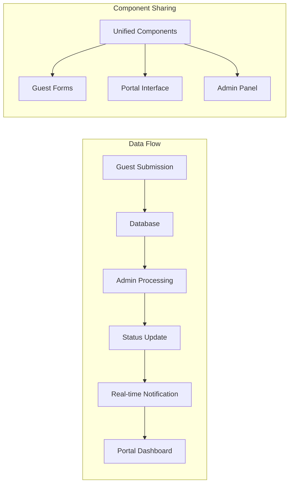
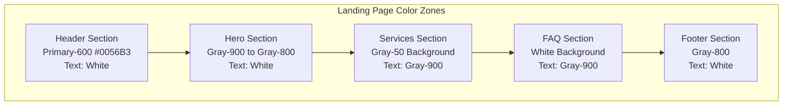
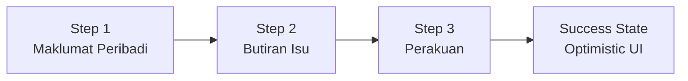

# ICTServe Frontend Comprehensive v3.6.1 - Design Document

**Sistem ICTServe**  
**Versi:** 3.6.1 (SemVer)  
**Tarikh Kemaskini:** 17 Disember 2025  
**Status:** Aktif - Updated with D18 Cloud Hybrid AI Architecture  
**Klasifikasi:** Terhad - Dalaman BPM MOTAC  

---

## Document Information

| Attribute | Value |
|-----------|-------|
| **Version** | 3.6.1-r1 |
| **Last Updated** | 17 December 2025 |
| **Status** | Active - Updated with D18 Cloud Hybrid AI Architecture and technology stack v3.6.1 |
| **Classification** | Restricted - Internal BPM MOTAC |
| **Dependencies** | requirements.md v3.6.1-r1 |
| **ISO Document Reference** | PK.(S).MOTAC.07.(L1) - ICTServe Portal |
| **Source Documents** | D00-D18 v3.6.1, FRONTEND-DEVELOPMENT-v3-6-0.md, FRONTPAGE_DESIGN_ANALYSIS_v3.6.0.md |

---

## Overview

This design document outlines the comprehensive frontend architecture for ICTServe v3.6.1, consolidating all user interface components across the True Hybrid Architecture. The design encompasses guest forms, authenticated staff portal, Filament admin panel, and **Cloud Hybrid AI interfaces** with unified component library, accessibility compliance, performance optimization, and cross-module integration.

**Consolidated Design Scope:**

- **Guest Forms**: Public-facing helpdesk and asset loan submission interfaces
- **Authenticated Portal**: Staff dashboard, submission management, profile, and approval workflows
- **Filament Admin Panel**: Administrative interface with RBAC, reporting, and system management
- **Cloud Hybrid AI Interface**: AI chat with model routing (Ollama + AWS Bedrock) per D18 v1.0.1
- **FAQ Bot Widget**: Floating AI assistant accessible on all pages
- **Unified Component Library**: Standardized components across all four layers
- **Real-Time Features**: WebSocket integration for live updates, notifications, and AI streaming
- **Cross-Module Integration**: Deep integration between helpdesk, asset loan, and AI modules

The design integrates Figma MCP workflows, MyDS Design System compliance, Bahasa Melayu exclusive interface, theme switching capabilities, four-role RBAC, Cloud Hybrid AI Architecture (D18), and comprehensive accessibility standards while maintaining optimal performance.

## Architecture

### System Architecture Overview


### True Hybrid Architecture Layers

The frontend implements three distinct but unified access patterns with role-based progressive enhancement:

#### 1. Guest Forms Layer

- **Purpose**: Public-facing forms without authentication
- **Features**: Helpdesk ticket submission, asset loan requests, status tracking
- **Technology**: Livewire components with Volt for interactivity
- **Access**: Open to all MOTAC staff without login requirement

#### 2. Authenticated Portal Layer

- **Purpose**: Staff dashboard with personalized features
- **Features**: Dashboard, submission history, profile management, approvals (Grade 41+)
- **Technology**: Full Livewire 3.7 with real-time updates via Laravel Reverb
- **Access**: Four-role RBAC (Staff, Approver, Admin, Superuser)

#### 3. Filament Admin Layer

- **Purpose**: Administrative interface for system management
- **Features**: CRUD operations, reporting, user management, system configuration
- **Technology**: Filament 4.1.10 with custom resources and widgets
- **Access**: Admin and Superuser roles only

### Cross-Layer Integration



## Components and Interfaces

### Component Library Structure

```text
resources/views/components/
├── accessibility/
│   ├── skip-links.blade.php
│   ├── aria-live-region.blade.php
│   ├── focus-trap.blade.php
│   └── screen-reader-text.blade.php
├── data/
│   ├── stats-card.blade.php
│   ├── data-table.blade.php
│   ├── chart.blade.php
│   └── timeline.blade.php
├── form/
│   ├── input.blade.php
│   ├── select.blade.php
│   ├── textarea.blade.php
│   ├── checkbox.blade.php
│   ├── file-upload.blade.php
│   └── wizard.blade.php
├── layout/
│   ├── header.blade.php
│   ├── navbar.blade.php
│   ├── sidebar.blade.php
│   ├── footer.blade.php
│   └── container.blade.php
├── navigation/
│   ├── breadcrumb.blade.php
│   ├── pagination.blade.php
│   ├── tabs.blade.php
│   └── menu.blade.php
├── responsive/
│   ├── grid.blade.php
│   ├── breakpoint-indicator.blade.php
│   └── mobile-menu.blade.php
└── ui/
    ├── button.blade.php
    ├── card.blade.php
    ├── modal.blade.php
    ├── dropdown.blade.php
    ├── alert.blade.php
    ├── badge.blade.php
    ├── toast.blade.php
    ├── loading.blade.php
    ├── theme-toggle.blade.php
    └── user-info-card.blade.php
```

### Portal Layout Architecture

The portal layout implements a comprehensive authenticated user interface with role-based navigation and accessibility compliance:

#### Portal Layout Structure

```text
resources/views/portal/
├── layouts/
│   └── app.blade.php              # Main portal layout with header, navbar, sidebar, footer
├── components/
│   ├── header.blade.php           # MOTAC branding with user info and theme toggle
│   ├── navbar.blade.php           # Primary navigation with role-based menu items
│   ├── sidebar.blade.php          # Secondary navigation with quick actions
│   ├── footer.blade.php           # Government compliance footer with links
│   ├── breadcrumb.blade.php       # Navigation context with ARIA landmarks
│   └── accessibility-menu.blade.php # WCAG 2.2 AA accessibility features
├── partials/
│   └── flash-messages.blade.php   # User feedback with ARIA live regions
└── data-rights/
    ├── index.blade.php            # PDPA 2010 data rights management
    └── consent-history.blade.php  # User consent tracking interface
```

#### Portal Layout Features

**Responsive Design**:

- Mobile-first approach with collapsible sidebar
- Hamburger menu for mobile navigation
- Touch-friendly 44×44px minimum touch targets
- Responsive grid system with MyDS breakpoints

**Accessibility Compliance**:

- WCAG 2.2 AA compliant navigation structure
- Skip links for keyboard navigation
- ARIA landmarks and live regions
- Focus management and keyboard navigation
- Screen reader optimized content structure

**Theme Integration**:

- Light/dark mode toggle in header
- Theme persistence via localStorage
- FOUT prevention with inline theme script
- Smooth transitions with prefers-reduced-motion support

**Role-Based Navigation**:

- Staff: Basic portal access with submission management
- Approver (Grade 41+): Additional approval interface
- Admin: System management features
- Superuser: Full administrative access

#### Portal Component Specifications

| Component | Purpose | WCAG Features | MyDS Compliance |
|-----------|---------|---------------|-----------------|
| **Header** | Branding, user info, theme toggle | Focus indicators, ARIA labels | MOTAC colors, typography |
| **Navbar** | Primary navigation | Keyboard navigation, skip links | MyDS spacing, shadows |
| **Sidebar** | Secondary navigation, quick actions | Collapsible, focus management | Responsive breakpoints |
| **Footer** | Government compliance, links | Semantic structure | MyDS grid system |
| **Breadcrumb** | Navigation context | ARIA landmarks | Consistent styling |
| **Flash Messages** | User feedback | ARIA live regions | Alert color tokens |

### Livewire Component Architecture

```php
// Base OptimizedLivewireComponent Trait
trait OptimizedLivewireComponent
{
    use WithCaching, WithLazyLoading, WithQueryOptimization;
    
    protected $cacheTime = 300; // 5 minutes default
    
    #[Computed]
    public function cachedData()
    {
        return Cache::remember(
            $this->getCacheKey(),
            $this->cacheTime,
            fn() => $this->loadData()
        );
    }
}

// Example Volt Component
<?php
use function Livewire\Volt\{state, computed, on};

state(['search' => '', 'filters' => []]);

$tickets = computed(function () {
    return HelpdeskTicket::query()
        ->when($this->search, fn($q) => $q->search($this->search))
        ->when($this->filters, fn($q) => $q->filter($this->filters))
        ->with(['user', 'category'])
        ->paginate(10);
});

$updateSearch = function () {
    $this->resetPage();
};
?>

<div>
    <x-form.input 
        wire:model.live.debounce.300ms="search"
        placeholder="Cari tiket..."
        aria-label="Cari tiket helpdesk"
    />
    
    <div class="grid gap-4 mt-4">
        @foreach($this->tickets as $ticket)
            <x-ui.card wire:key="ticket-{{ $ticket->id }}">
                <!-- Ticket content -->
            </x-ui.card>
        @endforeach
    </div>
</div>
```

## Data Models

### Theme Management

```php
// Theme Configuration
class ThemeConfig
{
    public const DEFAULT_THEME = 'light';
    public const AVAILABLE_THEMES = ['light', 'dark'];
    public const STORAGE_KEY = 'theme';
    
    public static function getTheme(): string
    {
        return session('theme', self::DEFAULT_THEME);
    }
    
    public static function setTheme(string $theme): void
    {
        if (in_array($theme, self::AVAILABLE_THEMES)) {
            session(['theme' => $theme]);
        }
    }
}
```

### Component Metadata Model

```php
// Component metadata structure
class ComponentMetadata
{
    public string $name;
    public string $description;
    public string $author;
    public array $traceReferences; // D00-D17 references
    public string $version;
    public string $wcagCompliance; // AA, AAA
    public array $dependencies;
    public ?string $figmaNodeId;
    
    public function toArray(): array
    {
        return [
            'name' => $this->name,
            'description' => $this->description,
            'author' => $this->author,
            'trace_references' => $this->traceReferences,
            'version' => $this->version,
            'wcag_compliance' => $this->wcagCompliance,
            'dependencies' => $this->dependencies,
            'figma_node_id' => $this->figmaNodeId,
        ];
    }
}
```

### Figma Integration Model

```php
// Figma design context model
class FigmaDesignContext
{
    public string $nodeId;
    public string $fileKey;
    public array $styles;
    public array $tokens;
    public string $generatedCode;
    public array $assets;
    
    public function transformToLivewire(): string
    {
        // Transform React/Tailwind to Livewire/Blade
        return $this->codeTransformer->transform($this->generatedCode);
    }
    
    public function mapColors(): array
    {
        // Map Figma colors to Compliant_Color_Palette
        return $this->colorMapper->mapToCompliantPalette($this->styles);
    }
}
```

## Correctness Properties

*A property is a characteristic or behavior that should hold true across all valid executions of a system—essentially, a formal statement about what the system should do. Properties serve as the bridge between human-readable specifications and machine-verifiable correctness guarantees.*

### Property 1: Bahasa Melayu Exclusive Interface

*For any* user interface element, all text content should be displayed exclusively in Bahasa Melayu without any language switching options
**Validates: Requirements 1.1, 1.2, 1.3, 1.4, 1.5**

### Property 2: Theme Persistence

*For any* theme selection, the chosen theme should persist across browser sessions using localStorage and maintain light mode as the immutable default
**Validates: Requirements 2.1, 2.2, 2.3**

### Property 3: WCAG 2.2 AA Compliance

*For any* UI component, color contrast ratios should meet or exceed 4.5:1 for text and 3:1 for UI elements, and all interactive elements should have minimum 44×44px touch targets
**Validates: Requirements 7.1, 7.2, 7.4, 7.5, 7.6**

### Property 4: Component Reusability

*For any* component in the unified library, it should be reusable across guest forms, authenticated portal, and admin interfaces with consistent styling and behavior
**Validates: Requirements 5.1, 5.3, 5.4, 5.5**

### Property 5: Figma Design Consistency

*For any* Figma design converted to code, the resulting component should maintain visual parity with the original design while using compliant color palette tokens
**Validates: Requirements 3.1, 3.2, 3.3**

### Property 6: Performance Optimization

*For any* page load, Core Web Vitals metrics should meet the specified targets (LCP <2.5s, FID <100ms, CLS <0.1, TTFB <600ms)
**Validates: Requirements 8.1, 8.2, 8.4, 8.5**

### Property 7: Cross-Module Integration

*For any* data operation involving both helpdesk and asset loan modules, the integration should maintain data consistency and provide unified search results
**Validates: Requirements 10.1, 10.2, 10.3, 10.4**

### Property 8: Real-time Notification Delivery

*For any* status change event, notifications should be delivered within 60 seconds via appropriate channels (email, WebSocket, in-app) based on user preferences
**Validates: Requirements 13.2, 15.1, 15.2**

### Property 9: Responsive Design Adaptation

*For any* viewport size, the interface should adapt appropriately using MyDS grid system (12-8-4 columns) and maintain usability across all device types
**Validates: Requirements 14.1, 14.2, 14.3**

### Property 10: Form Validation Consistency

*For any* form input, validation should provide real-time feedback in Bahasa Melayu with proper ARIA attributes and error state management
**Validates: Requirements 19.1, 19.2, 19.3**

### Property 11: Landing Page Hybrid Color Scheme (FRONTPAGE_DESIGN_ANALYSIS)

*For any* landing page section, the color scheme should maintain WCAG 2.2 AA contrast ratios with dark hero section (text white on gray-900) and light services section (text gray-900 on white)
**Validates: Requirements 16.2, 16.3, 7.1**

### Property 12: FAQ Bot Accessibility

*For any* FAQ Bot interaction, the chatbox should implement proper ARIA dialog pattern with focus trap, keyboard navigation (ESC to close, Tab navigation), and minimum 44×44px touch targets for all interactive elements
**Validates: Requirements 17.3, 17.4, 17.5, 7.5**

### Property 13: Service Modal True Hybrid Architecture

*For any* service selection modal, the dialog should clearly present guest vs authenticated options with proper focus management, ARIA attributes, and dismissal mechanisms (ESC, close button, backdrop click)
**Validates: Requirements 18.1, 18.2, 18.3, 18.4, 18.5**

### Property 14: Translation Key Completeness

*For any* user-facing text element, the translation key should exist in the language file and return properly translated Bahasa Melayu text without displaying raw translation keys
**Validates: Requirements 21.1, 21.2, 21.3, 21.4, 21.5**

### Property 15: Multi-Step Wizard Progress

*For any* multi-step form wizard, the progress indicator should accurately reflect current step, completed steps should show checkmark icons, and navigation between steps should maintain form state
**Validates: Requirements 20.1, 20.5**

### Property 16: ISO Document Reference Display

*For any* government form page (helpdesk, loan application), the ISO document reference PK.(S).MOTAC.07.(L1) or appropriate variant should be displayed per government compliance requirements
**Validates: Requirements 16.5, 20.6**

### Property 17: Guest Helpdesk Form Multi-Step Wizard (FRONTPAGE_DESIGN_ANALYSIS)

*For any* guest helpdesk form submission, the multi-step wizard should maintain form state across steps, display accurate progress indicators with checkmarks for completed steps, and implement Optimistic UI pattern for immediate feedback
**Validates: Requirements 20.1, 20.2, 20.3, 20.4, 20.5**

### Property 18: Status Check Page Translation Completeness (FRONTPAGE_DESIGN_ANALYSIS)

*For any* status check page element, all translation keys should resolve to proper Bahasa Melayu text without displaying raw keys like `status.quick_help_title` or `STATUS.PAGE_TAGLINE`
**Validates: Requirements 21.1, 21.2, 21.3, 21.4, 21.5**

### Property 19: Searchable Division Select Accessibility

*For any* searchable select component (division/unit selection), the component should support keyboard navigation, provide ARIA-compliant dropdown behavior, and maintain proper focus management
**Validates: Requirements 7.3, 7.4, 20.3**

### Property 20: Malaysian Government Grade System Completeness

*For any* grade selection dropdown, the component should include all government grades (1-56), JUSA grades (A, B, C), and Turus grades (I, II, III) organized by optgroup for easy navigation
**Validates: Requirements 20.3**

### Property 21: Cloud Hybrid AI Query Routing (D18 v1.0.1)

*For any* AI chat query, the system should correctly classify the query type (FAQ, Complex, Hybrid) and route to the appropriate AI backend (Ollama for FAQ, Bedrock for Complex, Both for Hybrid) with response time <5 seconds for FAQ queries
**Validates: Requirements 16.1, 16.2, 16.3**

### Property 22: FAQ Bot Widget Accessibility (D18 v1.0.1)

*For any* FAQ Bot widget interaction, the floating button should meet 44×44px minimum touch target, the chat panel should implement ARIA dialog pattern with focus trap, and all responses should be announced via ARIA live regions
**Validates: Requirements 17.1, 17.2, 17.5, 17.7**

### Property 23: AI Response Source Attribution (D18 v1.0.1)

*For any* AI-generated response, the system should display clear source attribution (Ollama, Bedrock, or Hybrid) with confidence scoring, and all response content should be in Bahasa Melayu exclusively
**Validates: Requirements 16.5, 16.8, 17.8**

### Property 24: AI Conversation Persistence (D18 v1.0.1)

*For any* authenticated user AI conversation, the system should persist conversation history with save/load/delete functionality, and conversation state should be maintained across browser sessions
**Validates: Requirements 16.4, 17.6**

### Property 25: AI Admin Dashboard Metrics (D18 v1.0.1)

*For any* AI admin dashboard view, the system should display real-time metrics (model usage, response times, cost estimates) with multi-system health status (Ollama, Bedrock, DuckDuckGo) and restrict access to admin/superuser roles
**Validates: Requirements 18.1, 18.6, 18.8**

### Property 26: Portal Layout System Compliance

*For any* portal layout component, the system should implement proper WCAG 2.2 AA landmark structure with role-based navigation, responsive design, and government compliance features including MOTAC branding and PDPA data rights management
**Validates: Requirements 19.1, 19.2, 19.3, 19.4, 19.5, 19.6, 19.7, 19.8**

*For any* grade selection dropdown, the component should include all government grades (1-56), JUSA grades (A, B, C), and Turus grades (I, II, III) organized by optgroup for easy navigation
**Validates: Requirements 20.3**

## Page-Level Design Specifications (FRONTPAGE_DESIGN_ANALYSIS)

### Landing Page (Welcome Page) Design

Based on FRONTPAGE_DESIGN_ANALYSIS_v3.6.0.md analysis:

#### Hybrid Color Scheme Architecture



#### Component Specifications

| Component | Background | Text Color | Contrast Ratio | Status |
|-----------|------------|------------|----------------|--------|
| Header | Primary-600 (#0056B3) | White (#FFFFFF) | 7.2:1 | ✅ WCAG AA |
| Hero Title | Gray-900 | White (#FFFFFF) | 15:1 | ✅ Excellent |
| Hero Subtitle | Gray-900 | White/90% | 12:1 | ✅ Excellent |
| CTA Buttons | White bg / Primary-600 text | 7.2:1 | ✅ WCAG AA |
| Service Cards | White (#FFFFFF) | Gray-900 | 15.4:1 | ✅ Excellent |
| Card Shadows | shadow-card | - | - | ✅ MyDS |

### FAQ Bot Widget Design

Based on FRONTPAGE_DESIGN_ANALYSIS_v3.6.0.md Section 9:

```blade
{{-- FAQ Bot Widget Structure --}}
<div class="fixed bottom-4 right-4 z-50">
    {{-- Toggle Button: 44×44px minimum touch target --}}
    <button class="min-h-11 min-w-11 rounded-full bg-primary-600 text-white shadow-lg"
            aria-label="Buka FAQ Bot ICTServe"
            aria-expanded="false">
        <x-heroicon-o-chat-bubble-left-right class="w-6 h-6" />
    </button>
    
    {{-- Chat Panel with ARIA dialog pattern --}}
    <div role="dialog" 
         aria-modal="true" 
         aria-labelledby="faq-bot-title"
         class="bg-white rounded-lg shadow-dropdown">
        {{-- Header with 44×44px action buttons --}}
        <header class="bg-primary-600 text-white p-4">
            <h2 id="faq-bot-title">FAQ Bot ICTServe</h2>
            <button class="min-h-11 min-w-11" aria-label="Tutup">×</button>
        </header>
        
        {{-- Messages with aria-live for announcements --}}
        <div role="log" aria-live="polite" aria-atomic="false">
            <!-- Chat messages -->
        </div>
    </div>
</div>
```

### Service Selection Modal Design

Based on FRONTPAGE_DESIGN_ANALYSIS_v3.6.0.md Section 10:

```blade
{{-- True Hybrid Architecture Modal --}}
<div x-data="{ showModal: false }"
     @keydown.escape.window="showModal = false">
    
    <div x-show="showModal"
         role="dialog"
         aria-modal="true"
         aria-labelledby="modal-title"
         class="fixed inset-0 z-50 flex items-center justify-center">
        
        {{-- Backdrop with click-to-dismiss --}}
        <div @click="showModal = false" 
             class="absolute inset-0 bg-gray-900/50"></div>
        
        {{-- Modal Content --}}
        <div class="relative bg-white rounded-l shadow-dropdown max-w-md w-full mx-4">
            {{-- Header --}}
            <header class="bg-primary-600 text-white p-4 rounded-t-l">
                <h2 id="modal-title" class="text-lg font-semibold">
                    Buat Aduan ICT
                </h2>
                <button @click="showModal = false"
                        class="min-h-11 min-w-11"
                        aria-label="Tutup modal">×</button>
            </header>
            
            {{-- Content: True Hybrid Options --}}
            <div class="p-6">
                <h3 class="text-gray-900 font-medium">
                    Adakah anda sudah log masuk?
                </h3>
                
                {{-- Info Box --}}
                <div class="mt-4 p-4 bg-primary-50 border border-primary-200 rounded-m">
                    <h4 class="font-semibold text-primary-800">Maklumat Penting</h4>
                    <ul class="mt-2 text-sm text-primary-700 space-y-1">
                        <li>• Pengguna tetamu boleh membuat permohonan tanpa log masuk</li>
                        <li>• Pengguna berdaftar mendapat akses kepada dashboard</li>
                        <li>• Nombor rujukan dihantar melalui emel</li>
                    </ul>
                </div>
                
                {{-- Action Buttons --}}
                <div class="mt-6 flex gap-3">
                    <a href="/helpdesk/create" 
                       class="flex-1 btn-secondary min-h-11">
                        Tidak (Tetamu)
                    </a>
                    <a href="/login?redirect=/helpdesk/create" 
                       class="flex-1 btn-primary min-h-11">
                        Ya (Log Masuk)
                    </a>
                </div>
            </div>
        </div>
    </div>
</div>
```

### Status Check Page Design

Based on FRONTPAGE_DESIGN_ANALYSIS_v3.6.0.md Section 13:

#### Translation Keys Required

```php
// lang/ms/status.php - Missing keys identified
return [
    'page_tagline' => 'Status Semasa',
    'form_helper' => 'Masukkan token untuk menyemak status permohonan anda.',
    'quick_help_title' => 'Bantuan Pantas',
    'quick_help_email' => 'Emel sokongan BPM',
    'quick_help_phone' => 'Talian bantuan helpdesk',
    'quick_help_ticket' => 'Hantar tiket baharu',
    'quick_help_ticket_cta' => 'Pergi ke borang helpdesk',
];
```

#### Dark Mode Support

| Element | Light Mode | Dark Mode | Contrast |
|---------|------------|-----------|----------|
| Hero Background | Primary-600 | Primary-700 | - |
| Page Background | Slate-50 | Gray-900 | - |
| Form Card | White | Gray-800 | - |
| Input Background | White | Gray-700 | - |
| Label Text | Gray-800 | Gray-100 | 12.6:1 / 15.4:1 |
| Helper Text | Gray-600 | Gray-300 | 7.5:1 / 10.3:1 |

### Guest Helpdesk Form Design

Based on FRONTPAGE_DESIGN_ANALYSIS_v3.6.0.md Section 14:

#### Multi-Step Wizard Structure



#### Progress Indicator Design

```blade
{{-- Step indicator with WCAG compliance --}}
<div class="flex items-center justify-center w-10 h-10 rounded-full border 
            transition-colors duration-200 min-h-11 min-w-11 text-sm font-semibold shadow-button
            {{ $step < $currentStep ? 'bg-success-600 border-success-400/70 text-white' : '' }}
            {{ $step === $currentStep ? 'bg-primary-600 border-primary-400/70 text-white ring-2 ring-primary-400/40' : '' }}
            {{ $step > $currentStep ? 'bg-gray-100 dark:bg-gray-700 border-gray-300 dark:border-gray-600 text-gray-400' : '' }}">
    @if($step < $currentStep)
        <x-heroicon-s-check class="w-5 h-5" />
    @else
        {{ $step }}
    @endif
</div>
```

#### Optimistic UI Pattern

```php
// Optimistic submission flow
public function submit(): void
{
    // Step 1: Generate optimistic ticket number immediately
    $this->optimisticTicketNumber = $this->generateOptimisticTicketNumber();
    
    // Step 2: Enter optimistic state - show success immediately
    $this->isOptimisticState = true;
    $this->submitted = true;
    $this->ticketNumber = $this->optimisticTicketNumber;
    
    // Step 3: Dispatch optimistic success event for Alpine.js
    $this->dispatch('optimistic-submission-started', [
        'ticketNumber' => $this->optimisticTicketNumber,
        'email' => $this->guest_email,
    ]);
    
    // Step 4: Process server-side operations asynchronously
    // ... create ticket, send email ...
    
    // Step 5: Update with actual ticket number or rollback on error
    $this->ticketNumber = $ticket->ticket_number;
    $this->isOptimisticState = false;
}
```

#### Malaysian Government Grade System

```blade
<x-form.select wire:model.live="job_grade" label="{{ __('helpdesk.grade') }}" required>
    <option value="">{{ __('helpdesk.select_grade') }}</option>
    <optgroup label="Kumpulan Sokongan (Gred 1-40)">
        @foreach (range(1, 40) as $grade)
            <option value="{{ $grade }}">Gred {{ $grade }}</option>
        @endforeach
    </optgroup>
    <optgroup label="Kumpulan Pengurusan & Profesional (Gred 41-56)">
        @foreach (range(41, 56) as $grade)
            <option value="{{ $grade }}">Gred {{ $grade }}</option>
        @endforeach
    </optgroup>
    <optgroup label="Jawatan Utama Sektor Awam (JUSA)">
        <option value="JUSA_C">JUSA C</option>
        <option value="JUSA_B">JUSA B</option>
        <option value="JUSA_A">JUSA A</option>
    </optgroup>
    <optgroup label="Turus (Premier Grade)">
        <option value="TURUS_III">Turus III</option>
        <option value="TURUS_II">Turus II</option>
        <option value="TURUS_I">Turus I</option>
    </optgroup>
</x-form.select>
```

#### Mandatory Declaration Gate

```blade
<div class="rounded-lg border-2 border-warning-300 bg-warning-50 dark:bg-warning-900/20 p-4"
     role="region" aria-labelledby="perakuan-heading">
    <h3 id="perakuan-heading" class="text-base font-semibold text-gray-900 dark:text-white mb-3">
        {{ __('Perakuan / Declaration') }}
    </h3>
    
    {{-- Exact Legacy Legal Text (Bahasa Melayu) --}}
    <p class="text-sm text-gray-700 dark:text-gray-300">
        Saya memperakui dan mengesahkan bahawa semua maklumat yang diberikan di dalam
        eBorang Laporan Kerosakan ini adalah benar dan tepat...
    </p>
    
    {{-- Mandatory Checkboxes --}}
    <x-form.checkbox wire:model.live="declaration_accepted"
        label="{{ __('Saya telah membaca dan bersetuju dengan perakuan di atas') }}"
        required />
    
    <x-form.checkbox wire:model.live="terms_accepted"
        label="{{ __('Saya bersetuju dengan terma dan syarat perkhidmatan') }}"
        required />
</div>
```

## Error Handling

### Frontend Error Management

```php
// Global error handler for Livewire components
class LivewireErrorHandler
{
    public function handle(\Throwable $exception, Component $component): void
    {
        Log::error('Livewire component error', [
            'component' => get_class($component),
            'exception' => $exception->getMessage(),
            'trace' => $exception->getTraceAsString(),
        ]);
        
        $component->dispatch('show-error', [
            'message' => 'Ralat sistem berlaku. Sila cuba lagi.',
            'type' => 'error'
        ]);
    }
}

// Theme switcher error handling
class ThemeSwitcherErrorHandler
{
    public function handleLocalStorageError(): void
    {
        // Fallback to light theme if localStorage unavailable
        $this->setTheme('light');
        $this->logWarning('localStorage unavailable, using light theme');
    }
    
    public function handleInitializationError(): void
    {
        // Prevent duplicate initialization
        if (!window.themeToggleInitialized) {
            $this->initializeThemeToggle();
            window.themeToggleInitialized = true;
        }
    }
}
```

### Accessibility Error Prevention

```php
// WCAG compliance checker
class WCAGComplianceChecker
{
    public function checkColorContrast(string $foreground, string $background): bool
    {
        $ratio = $this->calculateContrastRatio($foreground, $background);
        return $ratio >= 4.5; // WCAG AA standard
    }
    
    public function checkTouchTargetSize(array $element): bool
    {
        return $element['width'] >= 44 && $element['height'] >= 44;
    }
    
    public function validateAriaAttributes(array $element): array
    {
        $errors = [];
        
        if ($element['interactive'] && !isset($element['aria-label'])) {
            $errors[] = 'Interactive element missing aria-label';
        }
        
        return $errors;
    }
}
```

## Testing Strategy

### Dual Testing Approach

The testing strategy combines unit testing and property-based testing to ensure comprehensive coverage:

**Unit Testing Requirements:**

- Component rendering tests for all UI components
- Integration tests for cross-module functionality
- Accessibility tests using axe-core
- Visual regression tests for theme switching
- Performance tests for Core Web Vitals

**Property-Based Testing Requirements:**

- Use Laravel's built-in testing framework with PHPUnit 11.5.44
- Configure property-based tests to run minimum 100 iterations
- Tag each property-based test with explicit reference to design document property
- Use format: `**Feature: frontend-comprehensive-v3.6, Property {number}: {property_text}**`

### Testing Implementation

```php
// Property-based test example
class FrontendPropertiesTest extends TestCase
{
    /**
     * **Feature: frontend-comprehensive-v3.6, Property 1: Bahasa Melayu Exclusive Interface**
     */
    public function test_all_ui_elements_display_bahasa_melayu_only()
    {
        // Generate random UI components
        $components = $this->generateRandomComponents(100);
        
        foreach ($components as $component) {
            $rendered = $this->renderComponent($component);
            $this->assertBahasaMelayuOnly($rendered);
            $this->assertNoLanguageSwitcher($rendered);
        }
    }
    
    /**
     * **Feature: frontend-comprehensive-v3.6, Property 3: WCAG 2.2 AA Compliance**
     */
    public function test_all_components_meet_wcag_contrast_requirements()
    {
        $components = $this->getAllComponents();
        
        foreach ($components as $component) {
            $colors = $this->extractColors($component);
            foreach ($colors as $foreground => $background) {
                $ratio = $this->calculateContrastRatio($foreground, $background);
                $this->assertGreaterThanOrEqual(4.5, $ratio);
            }
        }
    }
    
    /**
     * **Feature: frontend-comprehensive-v3.6, Property 17: Guest Helpdesk Form Multi-Step Wizard**
     */
    public function test_multi_step_wizard_maintains_state_across_steps()
    {
        Livewire::test(GuestTicketForm::class)
            ->set('guest_name', 'Test User')
            ->set('guest_email', 'test@motac.gov.my')
            ->call('nextStep')
            ->assertSet('currentStep', 2)
            ->assertSet('guest_name', 'Test User')
            ->assertSet('guest_email', 'test@motac.gov.my');
    }
    
    /**
     * **Feature: frontend-comprehensive-v3.6, Property 18: Status Check Page Translation Completeness**
     */
    public function test_status_page_has_no_raw_translation_keys()
    {
        $response = $this->get('/status/check');
        
        $response->assertDontSee('status.quick_help_title');
        $response->assertDontSee('STATUS.PAGE_TAGLINE');
        $response->assertDontSee('status.form_helper');
        $response->assertSee('Bantuan Pantas');
        $response->assertSee('Status Semasa');
    }
}

// Unit test example
class ThemeSwitcherTest extends TestCase
{
    public function test_theme_toggle_switches_between_light_and_dark()
    {
        $component = Livewire::test(ThemeToggle::class);
        
        $component->call('toggleTheme')
            ->assertSet('theme', 'dark')
            ->assertDispatched('theme-changed', ['theme' => 'dark']);
            
        $component->call('toggleTheme')
            ->assertSet('theme', 'light')
            ->assertDispatched('theme-changed', ['theme' => 'light']);
    }
    
    public function test_theme_persists_across_sessions()
    {
        session(['theme' => 'dark']);
        
        $component = Livewire::test(ThemeToggle::class);
        $component->assertSet('theme', 'dark');
    }
}
```

### Accessibility Testing

```php
// Automated accessibility testing
class AccessibilityTest extends TestCase
{
    public function test_all_pages_pass_axe_accessibility_audit()
    {
        $pages = [
            '/helpdesk/create',
            '/loans/create',
            '/dashboard',
            '/admin'
        ];
        
        foreach ($pages as $page) {
            $this->get($page)
                ->assertSuccessful()
                ->assertAxeCompliant();
        }
    }
    
    public function test_keyboard_navigation_works_on_all_interactive_elements()
    {
        $this->browse(function (Browser $browser) {
            $browser->visit('/helpdesk/create')
                ->keys('body', ['{tab}']) // Tab through elements
                ->assertFocused('input[name="title"]')
                ->keys('input[name="title"]', ['{tab}'])
                ->assertFocused('textarea[name="description"]');
        });
    }
}
```

### Performance Testing

```php
// Core Web Vitals testing
class PerformanceTest extends TestCase
{
    public function test_pages_meet_core_web_vitals_targets()
    {
        $pages = ['/dashboard', '/helpdesk/create', '/loans/create'];
        
        foreach ($pages as $page) {
            $metrics = $this->measureCoreWebVitals($page);
            
            $this->assertLessThan(2500, $metrics['lcp']); // LCP < 2.5s
            $this->assertLessThan(100, $metrics['fid']);  // FID < 100ms
            $this->assertLessThan(0.1, $metrics['cls']);  // CLS < 0.1
            $this->assertLessThan(600, $metrics['ttfb']); // TTFB < 600ms
        }
    }
}
```

---

**Document Version**: 3.6.0-r3  
**Last Updated**: 2025-12-14  
**Author**: Frontend Engineering Team  
**Status**: Ready for Implementation Phase  
**Dependencies**: requirements.md v3.6.0-r6  
**Source Documents**: FRONTEND-DEVELOPMENT-v3-6-0.md, FRONTPAGE_DESIGN_ANALYSIS_v3.6.0.md  
**Compliance**: D00-D17 v3.6.0, MyDS Design System v2025.2, WCAG 2.2 AA
