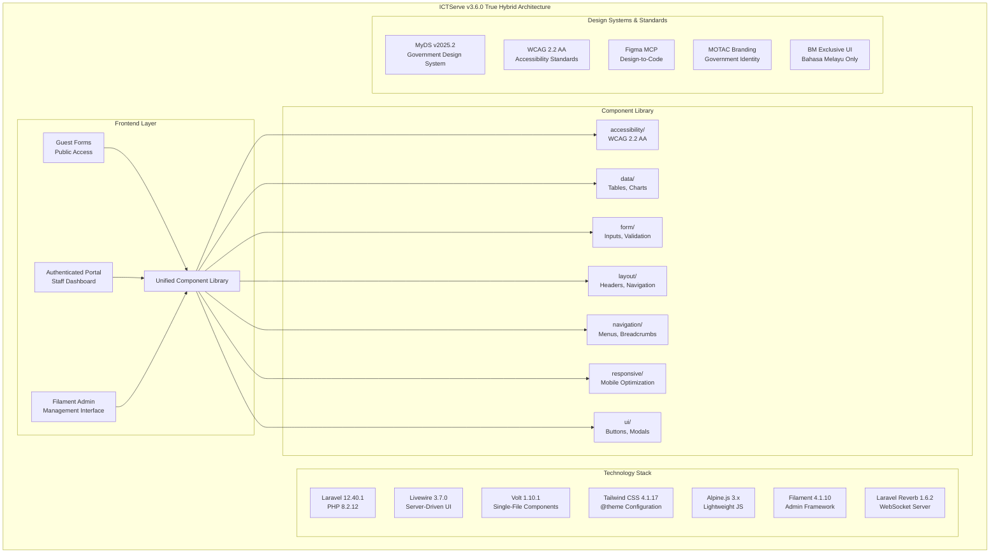
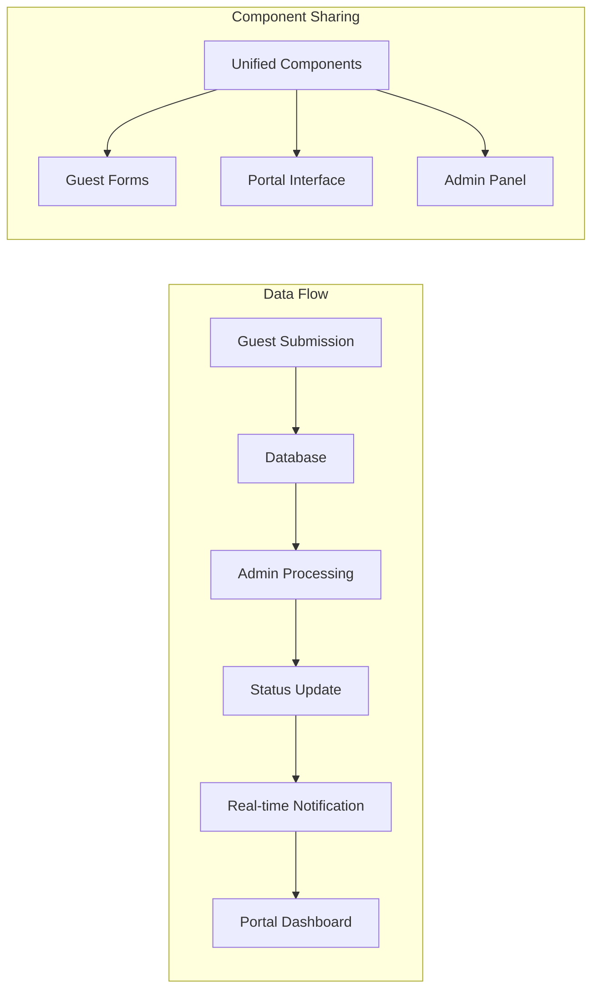

# ICTServe Frontend Comprehensive v3.6.0 - Design Document

**Sistem ICTServe**  
**Versi:** 3.6.0 (SemVer)  
**Tarikh Kemaskini:** 11 Disember 2025  
**Status:** Aktif - Consolidated from filament-admin-access and staff-dashboard-profile specs  
**Klasifikasi:** Terhad - Dalaman BPM MOTAC  

---

## Document Information

| Attribute | Value |
|-----------|-------|
| **Version** | 3.6.0 |
| **Last Updated** | 11 December 2025 |
| **Status** | Active - Consolidated Design |
| **Classification** | Restricted - Internal BPM MOTAC |
| **Dependencies** | requirements.md v3.6.0 |

---

## Overview

This design document outlines the comprehensive frontend architecture for ICTServe v3.6.0, consolidating all user interface components across the True Hybrid Architecture. The design encompasses guest forms, authenticated staff portal, and Filament admin panel with unified component library, accessibility compliance, performance optimization, and cross-module integration.

**Consolidated Design Scope:**

- **Guest Forms**: Public-facing helpdesk and asset loan submission interfaces
- **Authenticated Portal**: Staff dashboard, submission management, profile, and approval workflows
- **Filament Admin Panel**: Administrative interface with RBAC, reporting, and system management
- **Unified Component Library**: Standardized components across all three layers
- **Real-Time Features**: WebSocket integration for live updates and notifications
- **Cross-Module Integration**: Deep integration between helpdesk and asset loan modules

The design integrates Figma MCP workflows, MyDS Design System compliance, Bahasa Melayu exclusive interface, theme switching capabilities, four-role RBAC, and comprehensive accessibility standards while maintaining optimal performance.

## Architecture

### System Architecture Overview



### True Hybrid Architecture Layers

The frontend implements three distinct but unified access patterns with role-based progressive enhancement:

#### 1. Guest Forms Layer

- **Purpose**: Public-facing forms without authentication
- **Features**: Helpdesk ticket submission, asset loan requests, status tracking
- **Technology**: Livewire components with Volt for interactivity
- **Access**: Open to all MOTAC staff without login requirement

#### 2. Authenticated Portal Layer

- **Purpose**: Staff dashboard with personalized features
- **Features**: Dashboard, submission history, profile management, approvals (Grade 41+)
- **Technology**: Full Livewire 3.7 with real-time updates via Laravel Reverb
- **Access**: Four-role RBAC (Staff, Approver, Admin, Superuser)

#### 3. Filament Admin Layer

- **Purpose**: Administrative interface for system management
- **Features**: CRUD operations, reporting, user management, system configuration
- **Technology**: Filament 4.1.10 with custom resources and widgets
- **Access**: Admin and Superuser roles only

### Cross-Layer Integration



## Components and Interfaces

### Component Library Structure

```text
resources/views/components/
├── accessibility/
│   ├── skip-links.blade.php
│   ├── aria-live-region.blade.php
│   ├── focus-trap.blade.php
│   └── screen-reader-text.blade.php
├── data/
│   ├── stats-card.blade.php
│   ├── data-table.blade.php
│   ├── chart.blade.php
│   └── timeline.blade.php
├── form/
│   ├── input.blade.php
│   ├── select.blade.php
│   ├── textarea.blade.php
│   ├── checkbox.blade.php
│   ├── file-upload.blade.php
│   └── wizard.blade.php
├── layout/
│   ├── header.blade.php
│   ├── navbar.blade.php
│   ├── sidebar.blade.php
│   ├── footer.blade.php
│   └── container.blade.php
├── navigation/
│   ├── breadcrumb.blade.php
│   ├── pagination.blade.php
│   ├── tabs.blade.php
│   └── menu.blade.php
├── responsive/
│   ├── grid.blade.php
│   ├── breakpoint-indicator.blade.php
│   └── mobile-menu.blade.php
└── ui/
    ├── button.blade.php
    ├── card.blade.php
    ├── modal.blade.php
    ├── dropdown.blade.php
    ├── alert.blade.php
    ├── badge.blade.php
    ├── toast.blade.php
    ├── loading.blade.php
    ├── theme-toggle.blade.php
    └── user-info-card.blade.php
```

### Livewire Component Architecture

```php
// Base OptimizedLivewireComponent Trait
trait OptimizedLivewireComponent
{
    use WithCaching, WithLazyLoading, WithQueryOptimization;
    
    protected $cacheTime = 300; // 5 minutes default
    
    #[Computed]
    public function cachedData()
    {
        return Cache::remember(
            $this->getCacheKey(),
            $this->cacheTime,
            fn() => $this->loadData()
        );
    }
}

// Example Volt Component
<?php
use function Livewire\Volt\{state, computed, on};

state(['search' => '', 'filters' => []]);

$tickets = computed(function () {
    return HelpdeskTicket::query()
        ->when($this->search, fn($q) => $q->search($this->search))
        ->when($this->filters, fn($q) => $q->filter($this->filters))
        ->with(['user', 'category'])
        ->paginate(10);
});

$updateSearch = function () {
    $this->resetPage();
};
?>

<div>
    <x-form.input 
        wire:model.live.debounce.300ms="search"
        placeholder="Cari tiket..."
        aria-label="Cari tiket helpdesk"
    />
    
    <div class="grid gap-4 mt-4">
        @foreach($this->tickets as $ticket)
            <x-ui.card wire:key="ticket-{{ $ticket->id }}">
                <!-- Ticket content -->
            </x-ui.card>
        @endforeach
    </div>
</div>
```

## Data Models

### Theme Management

```php
// Theme Configuration
class ThemeConfig
{
    public const DEFAULT_THEME = 'light';
    public const AVAILABLE_THEMES = ['light', 'dark'];
    public const STORAGE_KEY = 'theme';
    
    public static function getTheme(): string
    {
        return session('theme', self::DEFAULT_THEME);
    }
    
    public static function setTheme(string $theme): void
    {
        if (in_array($theme, self::AVAILABLE_THEMES)) {
            session(['theme' => $theme]);
        }
    }
}
```

### Component Metadata Model

```php
// Component metadata structure
class ComponentMetadata
{
    public string $name;
    public string $description;
    public string $author;
    public array $traceReferences; // D00-D17 references
    public string $version;
    public string $wcagCompliance; // AA, AAA
    public array $dependencies;
    public ?string $figmaNodeId;
    
    public function toArray(): array
    {
        return [
            'name' => $this->name,
            'description' => $this->description,
            'author' => $this->author,
            'trace_references' => $this->traceReferences,
            'version' => $this->version,
            'wcag_compliance' => $this->wcagCompliance,
            'dependencies' => $this->dependencies,
            'figma_node_id' => $this->figmaNodeId,
        ];
    }
}
```

### Figma Integration Model

```php
// Figma design context model
class FigmaDesignContext
{
    public string $nodeId;
    public string $fileKey;
    public array $styles;
    public array $tokens;
    public string $generatedCode;
    public array $assets;
    
    public function transformToLivewire(): string
    {
        // Transform React/Tailwind to Livewire/Blade
        return $this->codeTransformer->transform($this->generatedCode);
    }
    
    public function mapColors(): array
    {
        // Map Figma colors to Compliant_Color_Palette
        return $this->colorMapper->mapToCompliantPalette($this->styles);
    }
}
```

## Correctness Properties

*A property is a characteristic or behavior that should hold true across all valid executions of a system—essentially, a formal statement about what the system should do. Properties serve as the bridge between human-readable specifications and machine-verifiable correctness guarantees.*

### Property 1: Bahasa Melayu Exclusive Interface

*For any* user interface element, all text content should be displayed exclusively in Bahasa Melayu without any language switching options
**Validates: Requirements 1.1, 1.2, 1.3, 1.4, 1.5**

### Property 2: Theme Persistence

*For any* theme selection, the chosen theme should persist across browser sessions using localStorage and maintain light mode as the immutable default
**Validates: Requirements 2.1, 2.2, 2.3**

### Property 3: WCAG 2.2 AA Compliance

*For any* UI component, color contrast ratios should meet or exceed 4.5:1 for text and 3:1 for UI elements, and all interactive elements should have minimum 44×44px touch targets
**Validates: Requirements 7.1, 7.2, 7.4, 7.5, 7.6**

### Property 4: Component Reusability

*For any* component in the unified library, it should be reusable across guest forms, authenticated portal, and admin interfaces with consistent styling and behavior
**Validates: Requirements 5.1, 5.3, 5.4, 5.5**

### Property 5: Figma Design Consistency

*For any* Figma design converted to code, the resulting component should maintain visual parity with the original design while using compliant color palette tokens
**Validates: Requirements 3.1, 3.2, 3.3**

### Property 6: Performance Optimization

*For any* page load, Core Web Vitals metrics should meet the specified targets (LCP <2.5s, FID <100ms, CLS <0.1, TTFB <600ms)
**Validates: Requirements 8.1, 8.2, 8.4, 8.5**

### Property 7: Cross-Module Integration

*For any* data operation involving both helpdesk and asset loan modules, the integration should maintain data consistency and provide unified search results
**Validates: Requirements 10.1, 10.2, 10.3, 10.4**

### Property 8: Real-time Notification Delivery

*For any* status change event, notifications should be delivered within 60 seconds via appropriate channels (email, WebSocket, in-app) based on user preferences
**Validates: Requirements 13.2, 15.1, 15.2**

### Property 9: Responsive Design Adaptation

*For any* viewport size, the interface should adapt appropriately using MyDS grid system (12-8-4 columns) and maintain usability across all device types
**Validates: Requirements 14.1, 14.2, 14.3**

### Property 10: Form Validation Consistency

*For any* form input, validation should provide real-time feedback in Bahasa Melayu with proper ARIA attributes and error state management
**Validates: Requirements 19.1, 19.2, 19.3**

## Error Handling

### Frontend Error Management

```php
// Global error handler for Livewire components
class LivewireErrorHandler
{
    public function handle(\Throwable $exception, Component $component): void
    {
        Log::error('Livewire component error', [
            'component' => get_class($component),
            'exception' => $exception->getMessage(),
            'trace' => $exception->getTraceAsString(),
        ]);
        
        $component->dispatch('show-error', [
            'message' => 'Ralat sistem berlaku. Sila cuba lagi.',
            'type' => 'error'
        ]);
    }
}

// Theme switcher error handling
class ThemeSwitcherErrorHandler
{
    public function handleLocalStorageError(): void
    {
        // Fallback to light theme if localStorage unavailable
        $this->setTheme('light');
        $this->logWarning('localStorage unavailable, using light theme');
    }
    
    public function handleInitializationError(): void
    {
        // Prevent duplicate initialization
        if (!window.themeToggleInitialized) {
            $this->initializeThemeToggle();
            window.themeToggleInitialized = true;
        }
    }
}
```

### Accessibility Error Prevention

```php
// WCAG compliance checker
class WCAGComplianceChecker
{
    public function checkColorContrast(string $foreground, string $background): bool
    {
        $ratio = $this->calculateContrastRatio($foreground, $background);
        return $ratio >= 4.5; // WCAG AA standard
    }
    
    public function checkTouchTargetSize(array $element): bool
    {
        return $element['width'] >= 44 && $element['height'] >= 44;
    }
    
    public function validateAriaAttributes(array $element): array
    {
        $errors = [];
        
        if ($element['interactive'] && !isset($element['aria-label'])) {
            $errors[] = 'Interactive element missing aria-label';
        }
        
        return $errors;
    }
}
```

## Testing Strategy

### Dual Testing Approach

The testing strategy combines unit testing and property-based testing to ensure comprehensive coverage:

**Unit Testing Requirements:**

- Component rendering tests for all UI components
- Integration tests for cross-module functionality
- Accessibility tests using axe-core
- Visual regression tests for theme switching
- Performance tests for Core Web Vitals

**Property-Based Testing Requirements:**

- Use Laravel's built-in testing framework with PHPUnit 11.5.44
- Configure property-based tests to run minimum 100 iterations
- Tag each property-based test with explicit reference to design document property
- Use format: `**Feature: frontend-comprehensive-v3.6, Property {number}: {property_text}**`

### Testing Implementation

```php
// Property-based test example
class FrontendPropertiesTest extends TestCase
{
    /**
     * **Feature: frontend-comprehensive-v3.6, Property 1: Bahasa Melayu Exclusive Interface**
     */
    public function test_all_ui_elements_display_bahasa_melayu_only()
    {
        // Generate random UI components
        $components = $this->generateRandomComponents(100);
        
        foreach ($components as $component) {
            $rendered = $this->renderComponent($component);
            $this->assertBahasaMelayuOnly($rendered);
            $this->assertNoLanguageSwitcher($rendered);
        }
    }
    
    /**
     * **Feature: frontend-comprehensive-v3.6, Property 3: WCAG 2.2 AA Compliance**
     */
    public function test_all_components_meet_wcag_contrast_requirements()
    {
        $components = $this->getAllComponents();
        
        foreach ($components as $component) {
            $colors = $this->extractColors($component);
            foreach ($colors as $foreground => $background) {
                $ratio = $this->calculateContrastRatio($foreground, $background);
                $this->assertGreaterThanOrEqual(4.5, $ratio);
            }
        }
    }
}

// Unit test example
class ThemeSwitcherTest extends TestCase
{
    public function test_theme_toggle_switches_between_light_and_dark()
    {
        $component = Livewire::test(ThemeToggle::class);
        
        $component->call('toggleTheme')
            ->assertSet('theme', 'dark')
            ->assertDispatched('theme-changed', ['theme' => 'dark']);
            
        $component->call('toggleTheme')
            ->assertSet('theme', 'light')
            ->assertDispatched('theme-changed', ['theme' => 'light']);
    }
    
    public function test_theme_persists_across_sessions()
    {
        session(['theme' => 'dark']);
        
        $component = Livewire::test(ThemeToggle::class);
        $component->assertSet('theme', 'dark');
    }
}
```

### Accessibility Testing

```php
// Automated accessibility testing
class AccessibilityTest extends TestCase
{
    public function test_all_pages_pass_axe_accessibility_audit()
    {
        $pages = [
            '/helpdesk/create',
            '/loans/create',
            '/dashboard',
            '/admin'
        ];
        
        foreach ($pages as $page) {
            $this->get($page)
                ->assertSuccessful()
                ->assertAxeCompliant();
        }
    }
    
    public function test_keyboard_navigation_works_on_all_interactive_elements()
    {
        $this->browse(function (Browser $browser) {
            $browser->visit('/helpdesk/create')
                ->keys('body', ['{tab}']) // Tab through elements
                ->assertFocused('input[name="title"]')
                ->keys('input[name="title"]', ['{tab}'])
                ->assertFocused('textarea[name="description"]');
        });
    }
}
```

### Performance Testing

```php
// Core Web Vitals testing
class PerformanceTest extends TestCase
{
    public function test_pages_meet_core_web_vitals_targets()
    {
        $pages = ['/dashboard', '/helpdesk/create', '/loans/create'];
        
        foreach ($pages as $page) {
            $metrics = $this->measureCoreWebVitals($page);
            
            $this->assertLessThan(2500, $metrics['lcp']); // LCP < 2.5s
            $this->assertLessThan(100, $metrics['fid']);  // FID < 100ms
            $this->assertLessThan(0.1, $metrics['cls']);  // CLS < 0.1
            $this->assertLessThan(600, $metrics['ttfb']); // TTFB < 600ms
        }
    }
}
```

---

**Document Version**: 1.0  
**Last Updated**: 2025-12-11  
**Author**: Frontend Engineering Team  
**Status**: Ready for Implementation Phase  
**Dependencies**: requirements.md v1.0
