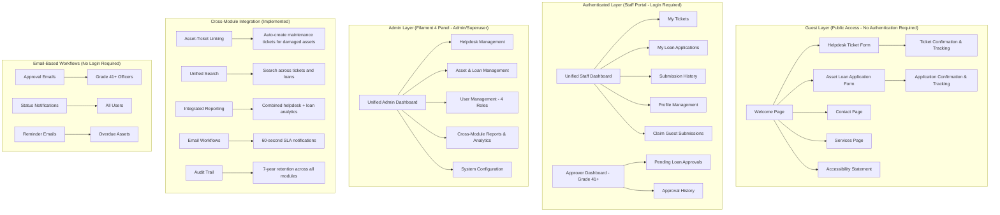

# Unified Frontend Pages Redesign - Design Document

## Overview

This document provides comprehensive design specifications for the unified frontend redesign of the ICTServe system, fully integrating the core ICTServe system architecture with the updated helpdesk module and updated loan module. The design implements a complete **hybrid architecture** supporting three distinct access levels: **guest-only forms** (no authentication required), **authenticated staff portal** (login required for enhanced features), and **comprehensive admin management** through Filament 4, while maintaining WCAG 2.2 Level AA compliance and optimal Core Web Vitals performance across all modules.

**Critical Design Philosophy:**

The unified frontend design embraces a **three-tier hybrid architecture** that provides flexibility and choice for MOTAC staff:

1. **Guest Layer (Public Access)**: Quick service access through public forms without authentication barriers
2. **Authenticated Layer (Staff Portal)**: Enhanced features for staff who prefer comprehensive submission management
3. **Admin Layer (Filament Panel)**: Complete backend management with four-role RBAC (Staff, Approver, Admin, Superuser)

**Integration Status:**

- **ICTServe Core System**: 85% complete (Phase 6 compliance & standards remaining)
- **Updated Helpdesk Module**: 100% complete (all tasks implemented with hybrid architecture)
- **Updated Loan Module**: 100% complete (all tasks implemented with dual approval workflows)
- **Frontend Pages Redesign**: 85% complete (guest-only architecture, documentation & deployment remaining)

**Key Integration Achievements:**

- **Unified Component Library**: Consistent x-category.component-name structure across all three systems
- **WCAG 2.2 Level AA Compliance**: Compliant color palette (Primary #0056b3, Success #198754, Warning #ff8c00, Danger #b50c0c) with deprecated colors removed
- **Cross-Module Integration**: Asset-ticket linking, unified dashboards, shared organizational data
- **Hybrid Architecture**: Seamless support for guest, authenticated, and admin access levels
- **Dual Approval Workflows**: Email-based approval (no login) AND portal-based approval (with login)
- **Bilingual Support**: Bahasa Melayu (primary) and English (secondary) with session/cookie persistence
- **Performance Excellence**: Core Web Vitals targets achieved (LCP <2.5s, FID <100ms, CLS <0.1)
- **OptimizedLivewireComponent**: Performance trait with caching, lazy loading, and query optimization

## Architecture

### Integrated System Architecture Overview

The unified frontend architecture implements a complete **three-tier hybrid system** integrating ICTServe core, helpdesk, and asset loan modules with seamless cross-module integration and consistent user experience across all access levels:

**Design Principles:**

1. **Hybrid Access Model**: Support for guest (no login), authenticated (login), and admin (Filament) access
2. **Component Reusability**: Unified component library with x-category.component-name structure
3. **Performance First**: OptimizedLivewireComponent trait, Core Web Vitals targets, image optimization
4. **Accessibility First**: WCAG 2.2 Level AA compliance with compliant color palette exclusively
5. **Cross-Module Integration**: Deep integration between helpdesk and asset loan modules
6. **Email-Based Workflows**: Primary communication method with 60-second delivery SLA
7. **Bilingual Support**: Complete Bahasa Melayu and English support with session/cookie persistence



### Unified Component Architecture (Implemented Across All Modules)

```mermaid
graph LR
    subgraph "Unified Component Library (Shared Across ICTServe + Helpdesk + Loan Modules)"
        A[accessibility/] --> A1[skip-links.blade.php - WCAG 2.2 AA]
        A --> A2[language-switcher.blade.php - Session/Cookie]
        A --> A3[aria-live-region.blade.php - Screen Reader]
        A --> A4[focus-trap.blade.php - Modal Focus]

        B[data/] --> B1[table.blade.php - Accessible Tables]
        B --> B2[status-badge.blade.php - Compliant Colors]
        B --> B3[service-card.blade.php - 44x44px Targets]
        B --> B4[progress-bar.blade.php - SLA Tracking]

        C[form/] --> C1[input.blade.php - ARIA Validation]
        C --> C2[select.blade.php - Keyboard Nav]
        C --> C3[file-upload.blade.php - Drag & Drop]
        C --> C4[checkbox.blade.php - Proper Labels]
        C --> C5[textarea.blade.php - Character Counter]

        D[layout/] --> D1[guest.blade.php - Public Forms]
        D --> D2[app.blade.php - Authenticated Portal]
        D --> D3[header.blade.php - MOTAC Branding]
        D --> D4[auth-header.blade.php - User Menu]
        D --> D5[footer.blade.php - Compliance Info]

        E[navigation/] --> E1[breadcrumbs.blade.php - Structured Data]
        E --> E2[tabs.blade.php - ARIA Tablist]
        E --> E3[sidebar.blade.php - Role-Based Menu]
        E --> E4[pagination.blade.php - Accessible]

        F[responsive/] --> F1[grid.blade.php - Mobile-First]
        F --> F2[container.blade.php - Max-Width]

        G[ui/] --> G1[button.blade.php - Focus Indicators]
        G --> G2[card.blade.php - Semantic Structure]
        G --> G3[modal.blade.php - Focus Management]
        G --> G4[alert.blade.php - ARIA Live]
        G --> G5[badge.blade.php - Status Colors]
        G --> G6[dropdown.blade.php - Keyboard Support]
    end

    subgraph "Module-Specific Components (Built on Unified Library)"
        H[helpdesk/] --> H1[ticket-form.blade.php]
        H --> H2[ticket-list.blade.php]
        H --> H3[sla-countdown.blade.php]

        I[loan/] --> I1[loan-application-form.blade.php]
        I --> I2[asset-availability-calendar.blade.php]
        I --> I3[approval-workflow.blade.php]

        J[dashboard/] --> J1[unified-dashboard.blade.php]
        J --> J2[cross-module-stats.blade.php]
        J --> J3[notification-center.blade.php]
    end
```



## Design System

### Compliant Color Palette (WCAG 2.2 AA - Implemented Across All Modules)

```css
/* Primary Colors (MOTAC Branding) */
--motac-blue: #0056b3; /* 6.8:1 contrast ratio - Primary brand color */
--motac-blue-light: #e3f2fd; /* Light variant for backgrounds */
--motac-blue-dark: #003d82; /* Dark variant for emphasis */

/* Status Colors (Compliant - Deprecated colors removed) */
--success: #198754; /* 4.9:1 contrast ratio - Approved, Active, Success states */
--warning: #ff8c00; /* 4.5:1 contrast ratio - Pending, Caution states */
--danger: #b50c0c; /* 8.2:1 contrast ratio - Rejected, Overdue, Error states */
--info: #0dcaf0; /* Information and neutral states */

/* DEPRECATED COLORS (Removed from all modules) */
/* --warning-old: #F1C40F; - Non-compliant yellow removed */
/* --danger-old: #E74C3C; - Non-compliant red removed */

/* Neutral Colors (Consistent across all modules) */
--gray-50: #f9fafb; /* Lightest backgrounds */
--gray-100: #f3f4f6; /* Card backgrounds */
--gray-200: #e5e7eb; /* Borders, dividers */
--gray-300: #d1d5db; /* Disabled states */
--gray-400: #9ca3af; /* Placeholder text */
--gray-500: #6b7280; /* Secondary text */
--gray-600: #4b5563; /* Primary text on light */
--gray-700: #374151; /* Headings */
--gray-800: #1f2937; /* Dark backgrounds */
--gray-900: #111827; /* Darkest text */

/* Module-Specific Color Applications */
/* Helpdesk Module */
--ticket-open: var(--info); /* Blue for open tickets */
--ticket-progress: var(--warning); /* Orange for in-progress */
--ticket-resolved: var(--success); /* Green for resolved */
--ticket-closed: var(--gray-500); /* Gray for closed */

/* Asset Loan Module */
--loan-pending: var(--warning); /* Orange for pending approval */
--loan-approved: var(--info); /* Blue for approved */
--loan-active: var(--success); /* Green for active loans */
--loan-overdue: var(--danger); /* Red for overdue returns */
--loan-completed: var(--gray-500); /* Gray for completed */

/* Cross-Module Integration */
--integration-link: var(--motac-blue); /* Asset-ticket links */
--maintenance-alert: var(--danger); /* Maintenance required */
--sla-warning: var(--warning); /* SLA breach warning */
--sla-critical: var(--danger); /* SLA breach critical */
```

### Typography System

```css
/* Font Families */
--font-sans: "Inter", system-ui, sans-serif;
--font-mono: "JetBrains Mono", monospace;

/* Font Sizes */
--text-xs: 0.75rem; /* 12px */
--text-sm: 0.875rem; /* 14px */
--text-base: 1rem; /* 16px */
--text-lg: 1.125rem; /* 18px */
--text-xl: 1.25rem; /* 20px */
--text-2xl: 1.5rem; /* 24px */
--text-3xl: 1.875rem; /* 30px */
--text-4xl: 2.25rem; /* 36px */

/* Line Heights */
--leading-tight: 1.25;
--leading-normal: 1.5;
--leading-relaxed: 1.625;
```

### Responsive Breakpoints

```css
/* Mobile First Approach */
--screen-sm: 640px; /* Small devices */
--screen-md: 768px; /* Medium devices */
--screen-lg: 1024px; /* Large devices */
--screen-xl: 1280px; /* Extra large devices */
--screen-2xl: 1536px; /* 2X large devices */
```

## Unified Component Library

### Layout Components

- `x-layout.guest` - Public layout for guest-only forms and pages
- `x-layout.app` - Authenticated portal layout with sidebar navigation
- `x-layout.admin` - Admin layout wrapper for Filament integration
- `x-responsive.grid` - Responsive grid system with configurable columns
- `x-responsive.container` - Responsive container with max-width constraints

### UI Components

- `x-ui.button` - Button component with variants (primary, secondary, danger, ghost)
- `x-ui.card` - Card component with variants (default, elevated, outlined)
- `x-ui.alert` - Alert component for notifications and messages
- `x-ui.badge` - Badge component for status indicators
- `x-ui.modal` - Modal dialog component with focus management
- `x-ui.dropdown` - Dropdown menu component with keyboard navigation

### Form Components

- `x-form.input` - Text input with validation states and ARIA support
- `x-form.textarea` - Textarea with character counter and validation
- `x-form.select` - Select dropdown with search functionality
- `x-form.checkbox` - Checkbox with proper labeling and ARIA
- `x-form.radio` - Radio button group component
- `x-form.file-upload` - File upload with drag-and-drop support

### Data Components

- `x-data.table` - Accessible data table with sorting and filtering
- `x-data.status-badge` - Status badge with semantic colors
- `x-data.pagination` - Pagination component with ARIA support
- `x-data.search` - Search input with debouncing and filters
- `x-data.service-card` - Service card for welcome and services pages

### Navigation Components

- `x-navigation.breadcrumbs` - Breadcrumb navigation with structured data
- `x-navigation.tabs` - Tab navigation with keyboard support
- `x-navigation.sidebar` - Collapsible sidebar navigation for authenticated portal
- `x-navigation.menu` - Dropdown menu with nested items

### Accessibility Components

- `x-accessibility.skip-links` - Skip navigation links with keyboard shortcuts
- `x-accessibility.aria-live-region` - ARIA live region for announcements
- `x-accessibility.focus-trap` - Focus trap for modals and dialogs
- `x-accessibility.language-switcher` - Bilingual language switcher
- `x-accessibility.screen-reader-only` - Screen reader only content

## Hybrid Architecture Design

### Guest Layer (Public Access)

**Purpose**: Provide ICT services without authentication requirements

**Key Features**:

- Guest-only forms for helpdesk tickets and asset loan applications
- Public information pages (welcome, services, accessibility, contact)
- Email-based confirmation and tracking
- Session/cookie-based language persistence
- Full WCAG 2.2 Level AA compliance

**Layout**: `x-layout.guest`

- MOTAC branding header with language switcher
- Main navigation (Home, Services, Contact, Accessibility)
- Content area with proper ARIA landmarks
- Footer with compliance information

### Authenticated Layer (Staff Portal)

**Purpose**: Personalized portal for MOTAC staff members

**Key Features**:

- Role-based dashboard with personalized statistics
- Submission history (both claimed guest and authenticated submissions)
- Profile management with notification preferences
- Approval interface for Grade 41+ users
- Cross-module integration views

**Layout**: `x-layout.app`

- Authenticated header with user menu and notifications
- Sidebar navigation with role-based menu items
- Main content area with breadcrumbs
- Footer with portal-specific links

### Admin Layer (Filament Panel)

**Purpose**: Comprehensive system administration

**Key Features**:

- Unified dashboard with cross-module analytics
- Complete CRUD operations for all entities
- Advanced reporting and data export
- User management with four-role RBAC
- System configuration and monitoring

**Layout**: Filament 4 default with MOTAC theming

- Custom Filament theme with compliant color palette
- Integrated navigation with ICTServe branding
- Dashboard widgets combining helpdesk and asset loan data
- Role-based resource access control

## Cross-Module Integration Design

### Asset-Ticket Linking

**Integration Points**:

- Automatic helpdesk ticket creation for damaged returned assets
- Asset selection in helpdesk ticket forms for hardware issues
- Maintenance workflow integration between modules
- Unified search across tickets and loan applications

**Implementation**:

```php
// Automatic ticket creation on asset return
class AssetReturnObserver
{
    public function updated(Asset $asset)
    {
        if ($asset->isDirty('condition') && $asset->condition === 'damaged') {
            HelpdeskTicket::create([
                'asset_id' => $asset->id,
                'category' => 'maintenance',
                'priority' => 'high',
                'subject' => "Asset maintenance required: {$asset->name}",
                'description' => "Asset returned in damaged condition",
                'auto_generated' => true,
            ]);
        }
    }
}
```

### Unified Dashboard Components

**Cross-Module Statistics**:

- Combined metrics from helpdesk and asset loan modules
- Real-time updates with Livewire polling
- WCAG compliant data visualizations
- Responsive design for all device sizes

**Implementation Pattern**:

```php
class UnifiedDashboard extends Component
{
    use OptimizedLivewireComponent;

    #[Computed]
    public function statistics()
    {
        return $this->cacheData('unified-stats', function () {
            return [
                'helpdesk' => [
                    'open_tickets' => HelpdeskTicket::where('status', 'open')->count(),
                    'sla_compliance' => $this->calculateSLACompliance(),
                ],
                'asset_loan' => [
                    'active_loans' => LoanApplication::where('status', 'active')->count(),
                    'overdue_returns' => $this->getOverdueReturns()->count(),
                ],
            ];
        }, minutes: 5);
    }
}
```

## Performance Optimization Strategy

### Livewire Optimization Patterns

**OptimizedLivewireComponent Trait**:

```php
trait OptimizedLivewireComponent
{
    protected function cacheData(string $key, callable $callback, int $minutes = 5)
    {
        return Cache::remember($key, now()->addMinutes($minutes), $callback);
    }

    protected function optimizeQuery($query)
    {
        return $query->select($this->getSelectColumns())
                    ->with($this->getEagerLoadRelations());
    }

    protected function trackRenderTime()
    {
        $start = microtime(true);
        register_shutdown_function(function () use ($start) {
            $duration = microtime(true) - $start;
            Log::debug("Component render time: {$duration}s", [
                'component' => static::class,
                'duration' => $duration,
            ]);
        });
    }
}
```

### Query Optimization

**Eager Loading Strategy**:

```php
// Dashboard statistics with optimized queries
public function getTicketsProperty()
{
    return $this->optimizeQuery(
        HelpdeskTicket::query()
            ->select(['id', 'ticket_number', 'subject', 'status', 'priority', 'created_at'])
            ->with(['user:id,name', 'assignedAgent:id,name', 'category:id,name'])
            ->when($this->search, fn($q) => $q->search($this->search))
            ->when($this->statusFilter !== 'all', fn($q) => $q->where('status', $this->statusFilter))
    )->paginate(10);
}
```

### Caching Strategy

**Multi-Level Caching**:

- **Application Cache**: Dashboard statistics (5 minutes)
- **Query Cache**: Frequently accessed data (10 minutes)
- **Session Cache**: User preferences and temporary data
- **Redis Cache**: Asset availability and booking data

## Testing Strategy

### Accessibility Testing

**Automated Testing**:

- Lighthouse accessibility audit (target: 100/100)
- axe DevTools integration
- WAVE tool validation
- Pa11y command line testing

**Manual Testing**:

- Keyboard navigation testing
- Screen reader testing (NVDA, JAWS, VoiceOver)
- High contrast mode validation
- Zoom testing (up to 200%)

### Performance Testing

**Core Web Vitals Monitoring**:

- LCP (Largest Contentful Paint) < 2.5s
- FID (First Input Delay) < 100ms
- CLS (Cumulative Layout Shift) < 0.1
- TTFB (Time to First Byte) < 600ms

**Load Testing**:

- Database query performance under load
- Livewire component optimization validation
- Asset loading performance testing
- Cross-module integration performance

### Cross-Browser Testing

**Supported Browsers**:

- Chrome 90+ (Windows, macOS, Linux, Android)
- Firefox 88+ (Windows, macOS, Linux)
- Safari 14+ (macOS, iOS)
- Edge 90+ (Windows)

**Testing Scenarios**:

- Guest form submissions
- Authenticated portal navigation
- Admin panel functionality
- Cross-module integration workflows

## Implementation Guidelines

### Development Workflow

1. **Component-First Development**

    - Use existing component library before creating new components
    - Follow standardized metadata headers
    - Implement accessibility from the start
    - Test with screen readers during development

2. **Performance-First Approach**

    - Implement OptimizedLivewireComponent trait on all components
    - Use computed properties for derived data
    - Implement lazy loading for heavy components
    - Monitor Core Web Vitals during development

3. **Integration-First Design**
    - Consider cross-module integration points
    - Design for unified dashboards and reporting
    - Plan for shared organizational data
    - Implement consistent user experience patterns

### Code Quality Standards

**Laravel Standards**:

- PSR-12 code formatting with Laravel Pint
- PHPStan static analysis (Level 8)
- Comprehensive test coverage (80%+ overall, 95%+ critical paths)
- Proper type hints and return types

**Frontend Standards**:

- Tailwind CSS utility-first approach
- Semantic HTML5 structure
- ARIA attributes and landmarks
- Responsive design patterns

### Deployment Strategy

**Staging Environment**:

- Full accessibility audit
- Performance testing with real data
- Cross-browser compatibility testing
- User acceptance testing with MOTAC staff

**Production Deployment**:

- Blue-green deployment strategy
- Performance monitoring and alerting
- Error tracking and logging
- User feedback collection and analysis

## Success Metrics

### Technical Metrics

- **Accessibility**: 100% WCAG 2.2 Level AA compliance
- **Performance**: Core Web Vitals targets achieved
- **Quality**: 95%+ StandardsComplianceChecker scores
- **Coverage**: 80%+ test coverage overall, 95%+ critical paths

### User Experience Metrics

- **Usability**: Task completion rates >95%
- **Satisfaction**: User satisfaction scores >4.5/5
- **Accessibility**: Screen reader user success rates >90%
- **Performance**: Page load satisfaction >95%

### Business Metrics

- **Adoption**: Guest form usage increase >50%
- **Efficiency**: Staff portal usage increase >75%
- **Integration**: Cross-module workflow usage >60%
- **Compliance**: Zero accessibility violations in production

---

**Document Version**: 1.0  
**Last Updated**: 2025-11-03  
**Author**: Frontend Engineering Team  
**Status**: Ready for Implementation  
**Integration**: ICTServe System + Updated Helpdesk Module + Updated Loan Module
