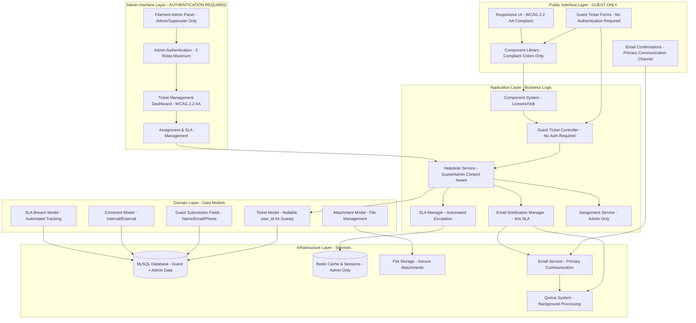

# Design Document

## Overview

The Helpdesk Module design follows Laravel 12 best practices with Livewire 3 for dynamic UI components, Volt for single-file components, and Filament 4 for administrative interfaces. The system implements a **guest-only public architecture** with clear separation between public guest forms and admin-only backend management.

**Critical Design Principle**: The system operates on a **guest-only** model where all MOTAC staff access helpdesk services through public forms without any login or authentication requirements. Only admin and superuser roles have login access to the Filament admin panel for backend ticket management.

## Key Design Decisions

### 1. Guest-Only Public Architecture

**Decision**: All public helpdesk functionality is accessible without authentication or user accounts.
**Rationale**: Eliminates barriers for MOTAC staff, reduces support overhead, simplifies user experience, and ensures immediate access to helpdesk services.
**Impact**: Email becomes the primary communication channel, guest submission fields are required, and ticket tracking is email-based.

### 2. Email-First Communication Strategy

**Decision**: Primary interaction through automated email workflows with 60-second delivery target.
**Rationale**: Provides reliable communication without requiring login, maintains comprehensive audit trail, supports offline workflows, and integrates with existing MOTAC email infrastructure.
**Impact**: Queue-based email processing, comprehensive email templates, automated status notifications, and email response handling.

### 3. Simplified Two-Role RBAC

**Decision**: Only admin and superuser roles exist for backend management.
**Rationale**: Reduces system complexity, easier permission management, clear separation between public (no roles) and admin functions.
**Impact**: Filament admin panel with role-based permissions, no public authentication, simplified security model.

### 4. WCAG 2.2 Level AA Compliance

**Decision**: Strict accessibility compliance with compliant color palette and comprehensive accessibility features.
**Rationale**: Legal requirement for government services, ensures accessibility for all users, meets Malaysian government digital service standards.
**Impact**: Specific contrast ratios (4.5:1 text, 3:1 UI), keyboard navigation, screen reader support, focus indicators.

### 5. Performance-First Design

**Decision**: Core Web Vitals targets with comprehensive performance optimization.
**Rationale**: Government service quality standards, optimal user experience, efficient resource utilization.
**Impact**: LCP <2.5s, FID <100ms, CLS <0.1, TTFB <600ms targets with caching strategies and query optimization.

The design emphasizes:
- **Guest-Only Architecture**: All public helpdesk functionality accessible without authentication
- **WCAG 2.2 Level AA Compliance**: Strict accessibility standards with compliant color palette and contrast ratios
- **Core Web Vitals Performance**: LCP <2.5s, FID <100ms, CLS <0.1, TTFB <600ms targets
- **Email-First Communication**: Primary interaction through automated email workflows
- **Unified Component Library**: Consistent UI components across all helpdesk interfaces
- **Security**: Simplified role-based access control with comprehensive audit trails
- **Scalability**: Modular design supporting future enhancements
- **Compliance**: Full PDPA compliance and ISO standard adherence

## Architecture

### System Architecture



### Technology Stack

| Component | Technology | Version | Purpose |
|-----------|------------|---------|---------|
| Backend Framework | Laravel | 12.x | Core application framework |
| Frontend Components | Livewire | 3.x | Dynamic UI components |
| Single-File Components | Volt | 1.x | Simplified component development |
| Admin Interface | Filament | 4.x | Administrative panels |
| Database | MySQL | 8.0+ | Primary data storage |
| Cache | Redis | 7.0+ | Session and application cache |
| Styling | Tailwind CSS | 3.x | Utility-first CSS framework |
| Build Tool | Vite | 4.x | Asset compilation |

## Components and Interfaces

### Core Models

#### HelpdeskTicket Model

```php
class HelpdeskTicket extends Model

    protected $fillable = [
        'ticket_number', 'user_id', 'assigned_to', 'title', 'description',
        'category', 'priority', 'status', 'damage_type', 'asset_id',
        'guest_name', 'guest_email', 'guest_phone', 'guest_staff_id',
        'resolved_at', 'closed_at'
  ;

    protected $casts = [
        'resolved_at' => 'datetime',
        'closed_at' => 'datetime',
        'priority' => TicketPriority::class,
        'status' => TicketStatus::class,
  ;

    // Relationships - user_id is nullable for guest submissions
    public function user(): BelongsTo
    
        return $this->belongsTo(User::class)->nullable();

    
    public function assignedAgent(): BelongsTo
    
        return $this->belongsTo(User::class, 'assigned_to');

    
    public function comments(): HasMany
    
        return $this->hasMany(HelpdeskComment::class, 'ticket_id');

    
    public function attachments(): HasMany
    
        return $this->hasMany(HelpdeskAttachment::class, 'ticket_id');

    
    public function slaBreaches(): HasMany
    
        return $this->hasMany(HelpdeskSLABreach::class, 'ticket_id');

    
    // Helper methods for guest vs authenticated submissions
    public function isGuestSubmission(): bool
    
        return is_null($this->user_id);

    
    public function getSubmitterName(): string
    
        return $this->isGuestSubmission() ? $this->guest_name : $this->user->name;

    
    public function getSubmitterEmail(): string
    
        return $this->isGuestSubmission() ? $this->guest_email : $this->user->email;


```

#### HelpdeskComment Model

```php
class HelpdeskComment extends Model

    protected $fillable = [
        'ticket_id', 'user_id', 'comment', 'is_internal', 'is_system_generated'
  ;

    public function ticket(): BelongsTo;
    public function user(): BelongsTo;

```

### Livewire Components

#### GuestTicketForm Component (Volt)

```php
<?php
use Livewire\Volt\Component;
use Livewire\WithFileUploads;

new class extends Component 
    use WithFileUploads;
    
    // Guest submission fields - required for all submissions
    public string $guest_name = '';
    public string $guest_email = '';
    public string $guest_phone = '';
    public string $guest_staff_id = '';
    
    // Ticket details
    public string $title = '';
    public string $description = '';
    public string $category = '';
    public string $damage_type = '';
    public ?string $asset_id = null;
    public array $attachments = [];
    
    public function rules(): array
    
        return [
            // Guest information - always required
            'guest_name' => 'required|string|max:255',
            'guest_email' => 'required|email|max:255',
            'guest_phone' => 'required|string|max:20',
            'guest_staff_id' => 'required|string|max:50',
            
            // Ticket details
            'title' => 'required|string|max:255',
            'description' => 'required|string|min:10|max:5000',
            'category' => 'required|in:hardware,software,network,other',
            'damage_type' => 'required|string',
            'asset_id' => 'nullable|exists:assets,id',
            'attachments.*' => 'file|max:5120|mimes:jpg,png,pdf,doc,docx'
      ;

    
    public function submit()
    
        $this->validate();
        
        $ticket = app(HelpdeskService::class)->createGuestTicket([
            // Guest information
            'guest_name' => $this->guest_name,
            'guest_email' => $this->guest_email,
            'guest_phone' => $this->guest_phone,
            'guest_staff_id' => $this->guest_staff_id,
            
            // Ticket details
            'title' => $this->title,
            'description' => $this->description,
            'category' => $this->category,
            'damage_type' => $this->damage_type,
            'asset_id' => $this->asset_id,
            'attachments' => $this->attachments,
      );
        
        session()->flash('success', 'Tiket berjaya dihantar! Nombor tiket: ' . $ticket->ticket_number);
        session()->flash('ticket_number', $ticket->ticket_number);
        
        return redirect()->route('helpdesk.guest.success');

 ?>

<div class="max-w-4xl mx-auto p-6">
    <form wire:submit="submit" class="space-y-6">
        <!-- Guest information section -->
        <div class="bg-blue-50 p-4 rounded-lg">
            <h3 class="text-lg font-semibold mb-4">Maklumat Pemohon</h3>
            <!-- Guest form fields with WCAG 2.2 AA compliance -->
        </div>
        
        <!-- Ticket details section -->
        <div class="space-y-4">
            <h3 class="text-lg font-semibold">Butiran Aduan</h3>
            <!-- Ticket form fields -->
        </div>
    </form>
</div>
```

### Services Layer

#### HelpdeskService

```php
class HelpdeskService

    public function createGuestTicket(array $data): HelpdeskTicket
    
        DB::beginTransaction();
        
        try 
            $ticket = HelpdeskTicket::create([
                'ticket_number' => $this->generateTicketNumber(),
                'user_id' => null, // Always null for guest submissions
                
                // Guest information
                'guest_name' => $data['guest_name'],
                'guest_email' => $data['guest_email'],
                'guest_phone' => $data['guest_phone'],
                'guest_staff_id' => $data['guest_staff_id'],
                
                // Ticket details
                'title' => $data['title'],
                'description' => $data['description'],
                'category' => $data['category'],
                'damage_type' => $data['damage_type'],
                'asset_id' => $data['asset_id'] ?? null,
                'priority' => $this->determinePriority($data),
                'status' => TicketStatus::NEW,
          );
            
            $this->handleAttachments($ticket, $data['attachments'] ?? []);
            $this->notifyAdminsOfNewTicket($ticket);
            $this->sendGuestConfirmationEmail($ticket);
            
            DB::commit();
            return $ticket;
            
     catch (Exception $e) 
            DB::rollBack();
            throw $e;
    

    
    public function createAuthenticatedTicket(array $data): HelpdeskTicket
    
        // For admin-created tickets or future authenticated portal
        DB::beginTransaction();
        
        try 
            $ticket = HelpdeskTicket::create([
                'ticket_number' => $this->generateTicketNumber(),
                'user_id' => auth()->id(),
                'title' => $data['title'],
                'description' => $data['description'],
                'category' => $data['category'],
                'damage_type' => $data['damage_type'],
                'asset_id' => $data['asset_id'] ?? null,
                'priority' => $this->determinePriority($data),
                'status' => TicketStatus::NEW,
          );
            
            $this->handleAttachments($ticket, $data['attachments'] ?? []);
            $this->autoAssignTicket($ticket);
            $this->sendNotifications($ticket);
            
            DB::commit();
            return $ticket;
            
     catch (Exception $e) 
            DB::rollBack();
            throw $e;
    

    
    private function notifyAdminsOfNewTicket(HelpdeskTicket $ticket): void
    
        // Send email notifications to admin users within 60 seconds
        $admins = User::whereIn('role', ['admin', 'superuser'])->get();
        
        foreach ($admins as $admin) 
            Mail::to($admin->email)
                ->queue(new NewTicketNotification($ticket));
    

    
    private function sendGuestConfirmationEmail(HelpdeskTicket $ticket): void
    
        // Send confirmation email to guest submitter within 60 seconds
        Mail::to($ticket->guest_email)
            ->queue(new GuestTicketConfirmation($ticket));

    
    private function autoAssignTicket(HelpdeskTicket $ticket): void
    
        // Only auto-assign for admin-created tickets
        // Guest tickets require manual assignment by admin
        if (!$ticket->isGuestSubmission()) 
            $agent = app(AssignmentService::class)->findBestAgent($ticket);
            
            if ($agent) 
                $ticket->update([
                    'assigned_to' => $agent->id,
                    'status' => TicketStatus::ASSIGNED
              );
        
    


```

### Filament Resources

#### HelpdeskTicketResource

```php
class HelpdeskTicketResource extends Resource

    protected static ?string $model = HelpdeskTicket::class;
    protected static ?string $navigationIcon = 'heroicon-o-ticket';
    protected static ?string $navigationLabel = 'Tiket Helpdesk';
    
    public static function form(Form $form): Form
    
        return $form->schema([
            TextInput::make('ticket_number')->disabled(),
            Select::make('assigned_to')
                ->relationship('assignedAgent', 'name')
                ->searchable(),
            Select::make('status')
                ->options(TicketStatus::class),
            Select::make('priority')
                ->options(TicketPriority::class),
            Textarea::make('description')->rows(4),
      );

    
    public static function table(Table $table): Table
    
        return $table
            ->columns([
                TextColumn::make('ticket_number')->searchable(),
                TextColumn::make('user.name')->label('Pemohon'),
                TextColumn::make('title')->limit(50),
                BadgeColumn::make('status'),
                BadgeColumn::make('priority'),
                TextColumn::make('created_at')->dateTime(),
          )
            ->filters([
                SelectFilter::make('status')->options(TicketStatus::class),
                SelectFilter::make('priority')->options(TicketPriority::class),
          );


```

## Data Models

### Database Schema

#### helpdesk_tickets table

```sql
CREATE TABLE helpdesk_tickets (
    id BIGINT UNSIGNED PRIMARY KEY AUTO_INCREMENT,
    ticket_number VARCHAR(20) UNIQUE NOT NULL,
    
    -- User ID is nullable for guest submissions
    user_id BIGINT UNSIGNED NULL,
    assigned_to BIGINT UNSIGNED NULL,
    
    -- Guest submission fields (required when user_id is null)
    guest_name VARCHAR(255) NULL,
    guest_email VARCHAR(255) NULL,
    guest_phone VARCHAR(20) NULL,
    guest_staff_id VARCHAR(50) NULL,
    
    -- Ticket details
    title VARCHAR(255) NOT NULL,
    description TEXT NOT NULL,
    category ENUM('hardware', 'software', 'network', 'other') NOT NULL,
    damage_type VARCHAR(100) NOT NULL,
    priority ENUM('low', 'medium', 'high', 'critical') DEFAULT 'medium',
    status ENUM('new', 'assigned', 'in_progress', 'awaiting_user', 'resolved', 'closed', 'reopened') DEFAULT 'new',
    asset_id BIGINT UNSIGNED NULL,
    
    -- Timestamps
    resolved_at TIMESTAMP NULL,
    closed_at TIMESTAMP NULL,
    created_at TIMESTAMP DEFAULT CURRENT_TIMESTAMP,
    updated_at TIMESTAMP DEFAULT CURRENT_TIMESTAMP ON UPDATE CURRENT_TIMESTAMP,
    
    -- Foreign key constraints
    FOREIGN KEY (user_id) REFERENCES users(id) ON DELETE SET NULL,
    FOREIGN KEY (assigned_to) REFERENCES users(id) ON DELETE SET NULL,
    FOREIGN KEY (asset_id) REFERENCES assets(id) ON DELETE SET NULL,
    
    -- Indexes for performance
    INDEX idx_ticket_number (ticket_number),
    INDEX idx_user_id (user_id),
    INDEX idx_guest_email (guest_email),
    INDEX idx_assigned_to (assigned_to),
    INDEX idx_status (status),
    INDEX idx_category (category),
    INDEX idx_priority (priority),
    INDEX idx_created_at (created_at),
    
    -- Constraint to ensure either user_id or guest fields are provided
    CONSTRAINT chk_submitter CHECK (
        (user_id IS NOT NULL) OR 
        (guest_name IS NOT NULL AND guest_email IS NOT NULL AND guest_phone IS NOT NULL AND guest_staff_id IS NOT NULL)
    )
);
```

#### helpdesk_comments table

```sql
CREATE TABLE helpdesk_comments (
    id BIGINT UNSIGNED PRIMARY KEY AUTO_INCREMENT,
    ticket_id BIGINT UNSIGNED NOT NULL,
    user_id BIGINT UNSIGNED NOT NULL,
    comment TEXT NOT NULL,
    is_internal BOOLEAN DEFAULT FALSE,
    is_system_generated BOOLEAN DEFAULT FALSE,
    created_at TIMESTAMP DEFAULT CURRENT_TIMESTAMP,
    updated_at TIMESTAMP DEFAULT CURRENT_TIMESTAMP ON UPDATE CURRENT_TIMESTAMP,
    
    FOREIGN KEY (ticket_id) REFERENCES helpdesk_tickets(id) ON DELETE CASCADE,
    FOREIGN KEY (user_id) REFERENCES users(id),
    
    INDEX idx_ticket_id (ticket_id),
    INDEX idx_created_at (created_at)
);
```

### Enums

#### TicketStatus Enum

```php
enum TicketStatus: string

    case NEW = 'new';
    case ASSIGNED = 'assigned';
    case IN_PROGRESS = 'in_progress';
    case AWAITING_USER = 'awaiting_user';
    case RESOLVED = 'resolved';
    case CLOSED = 'closed';
    case REOPENED = 'reopened';
    
    public function label(): string
    
        return match($this) 
            self::NEW => 'Baru',
            self::ASSIGNED => 'Ditugaskan',
            self::IN_PROGRESS => 'Dalam Proses',
            self::AWAITING_USER => 'Menunggu Pengguna',
            self::RESOLVED => 'Selesai',
            self::CLOSED => 'Ditutup',
            self::REOPENED => 'Dibuka Semula',
    ;


```

## Error Handling

### Validation Strategy

- Client-side validation using Livewire real-time validation
- Server-side validation using Laravel Form Requests
- Custom validation rules for business logic
- User-friendly error messages in Bahasa Melayu

### Exception Handling

```php
class HelpdeskExceptionHandler

    public function handle(Exception $exception, HelpdeskTicket $ticket = null): void
    
        Log::error('Helpdesk Error', [
            'exception' => $exception->getMessage(),
            'ticket_id' => $ticket?->id,
            'user_id' => auth()->id() ?? null, // Handle guest submissions
            'guest_email' => $ticket?->guest_email ?? null,
            'is_guest_submission' => $ticket?->isGuestSubmission() ?? false,
            'trace' => $exception->getTraceAsString()
      );
        
        if ($ticket) 
            $this->createSystemComment($ticket, 'Ralat sistem berlaku: ' . $exception->getMessage());
            
            // Send email notification for guest submissions
            if ($ticket->isGuestSubmission()) 
                $this->notifyGuestOfError($ticket, $exception);
        
    
        
        throw new HelpdeskException('Ralat sistem. Sila hubungi pentadbir.', 500, $exception);

    
    private function notifyGuestOfError(HelpdeskTicket $ticket, Exception $exception): void
    
        // Send email notification to guest about system error
        Mail::to($ticket->guest_email)
            ->queue(new SystemErrorNotification($ticket, $exception->getMessage()));

    
    private function createSystemComment(HelpdeskTicket $ticket, string $message): void
    
        HelpdeskComment::create([
            'ticket_id' => $ticket->id,
            'user_id' => null, // System-generated comment
            'comment' => $message,
            'is_internal' => true,
            'is_system_generated' => true,
      );


```

## Testing Strategy

### Unit Tests

- Model relationships and business logic
- Service layer methods
- Validation rules and constraints
- Enum functionality

### Feature Tests

- **Guest ticket creation workflow** - Test complete guest submission process
- **Admin ticket management** - Test admin assignment and status updates
- **Email notification delivery** - Test 60-second email SLA compliance
- **Status transitions** - Test all valid status changes and restrictions
- **SLA tracking and escalation** - Test automated escalation triggers
- **Guest vs authenticated context** - Test dual submission pathways

### Integration Tests

- **Database transactions** - Test rollback scenarios for failed submissions
- **File upload handling** - Test attachment processing for guest submissions
- **Email notifications** - Test queue-based email processing and delivery
- **Queue job processing** - Test background job execution and retry logic
- **Guest submission validation** - Test constraint enforcement and data integrity

### Browser Tests (Dusk)

- **Complete guest workflows** - End-to-end guest ticket submission
- **Admin panel workflows** - Complete admin ticket management process
- **Form submissions** - Test guest form validation and submission
- **Email-based tracking** - Test email confirmation and status updates
- **Responsive design** - Test WCAG 2.2 AA compliance across devices
- **Accessibility compliance** - Test keyboard navigation and screen reader support

### Test Coverage Targets

- Unit Tests: >90% coverage
- Feature Tests: All critical paths
- Browser Tests: Key user journeys
- Performance Tests: Load testing for 500+ concurrent users
- Accessibility Tests: WCAG 2.2 Level AA compliance validation

## WCAG 2.2 Level AA Compliance Design

### Compliant Color Palette

The helpdesk system uses a strictly compliant color palette that meets WCAG 2.2 Level AA contrast requirements:

```css
/* Primary Colors - WCAG 2.2 AA Compliant */
--motac-blue: #0056b3;        /* 6.8:1 contrast ratio */
--motac-blue-light: #3d8bfd;  /* Hover states */
--motac-blue-dark: #004085;   /* Active states */

/* Semantic Colors - WCAG 2.2 AA Compliant */
--success: #198754;           /* 4.9:1 contrast ratio */
--warning: #ff8c00;           /* 4.5:1 contrast ratio with black text */
--danger: #b50c0c;            /* 8.2:1 contrast ratio */
--info: #0dcaf0;              /* Sufficient contrast */

/* DEPRECATED - TO BE REMOVED */
/* --warning-old: #F1C40F;   /* Non-compliant - REMOVE */
/* --danger-old: #E74C3C;    /* Non-compliant - REMOVE */
```

### Accessibility Features

1. **Focus Indicators**: 3-4px outline with 2px offset, minimum 3:1 contrast ratio
2. **Touch Targets**: Minimum 44×44px for all interactive elements
3. **Typography**: Line-height 1.5, maximum 80ch width for readability
4. **Color Independence**: No information conveyed by color alone (icons + text + color)
5. **ARIA Landmarks**: Proper semantic structure with role attributes
6. **Screen Reader Support**: ARIA live regions for dynamic content updates
7. **Keyboard Navigation**: Full keyboard accessibility with skip links and shortcuts

### Component Library Integration

The helpdesk system uses a unified component library structure:

```
resources/views/components/
├── accessibility/      # Skip links, ARIA live regions, focus management
├── data/              # Status badges, ticket cards, metrics displays
├── form/              # Input fields, validation, error handling
├── layout/            # Page layouts (public, admin)
├── navigation/        # Header, footer, breadcrumbs, menus
├── responsive/        # Grid system, responsive utilities
└── ui/                # Buttons, cards, alerts, modals, pagination
```

### Performance Optimization

#### Core Web Vitals Targets

- **Largest Contentful Paint (LCP)**: <2.5 seconds
- **First Input Delay (FID)**: <100 milliseconds
- **Cumulative Layout Shift (CLS)**: <0.1
- **Time to First Byte (TTFB)**: <600 milliseconds

#### Optimization Strategies

1. **Asset Optimization**: Vite configuration with Gzip/Brotli compression, code splitting, minification
2. **Image Optimization**: WebP format with fallbacks, explicit dimensions, lazy loading, fetchpriority attributes
3. **Component Caching**: Livewire component caching with automatic invalidation
4. **Database Optimization**: Query optimization with eager loading and column selection
5. **Performance Monitoring**: Real-time Core Web Vitals tracking and alerting
