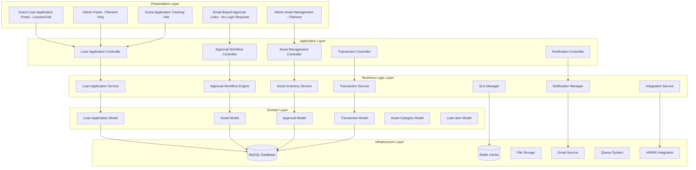
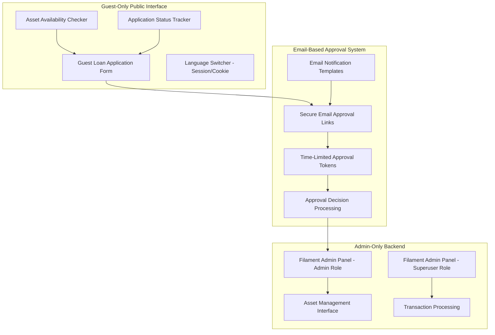

# Design Document

## Overview

The ICT Asset Loan Module design follows Laravel 12 best practices with **guest-only public architecture**, Livewire 3 for dynamic UI components, Volt for single-file components, and Filament 4 for administrative interfaces. The system implements a sophisticated **email-based approval workflow** with real-time asset tracking, automated notifications, and comprehensive audit trails.

The design emphasizes:
- **Guest-Only Architecture**: All public-facing functionality requires no authentication - MOTAC staff access via guest forms only
- **Email-Based Workflows**: Primary interaction method using automated email notifications and secure approval links
- **Simplified RBAC**: Only admin and superuser roles with Filament admin panel access (no other user roles)
- **Business Process Automation**: Multi-level approval workflows via email-based approvals based on MOTAC organizational hierarchy
- **Real-time Asset Management**: Live inventory tracking with booking calendar integration
- **WCAG 2.2 Level AA Compliance**: Full accessibility compliance with 4.5:1 text contrast, 3:1 UI contrast, focus indicators, and semantic HTML
- **Core Web Vitals Performance**: LCP <2.5s, FID <100ms, CLS <0.1, TTFB <600ms targets with optimized asset delivery
- **Compliance & Audit**: Full PDPA compliance with comprehensive audit trails
- **Integration**: Seamless integration with helpdesk module and external systems (HRMIS)
- **Bilingual Support**: Complete Bahasa Melayu and English support with session/cookie-based language persistence
- **Unified Component Library**: Consistent frontend components following design system standards with compliant color palette

## Architecture

### System Architecture



### Technology Stack

| Component | Technology | Version | Purpose |
|-----------|------------|---------|---------|
| Backend Framework | Laravel | 12.x | Core application framework |
| Frontend Components | Livewire | 3.x | Dynamic UI components |
| Single-File Components | Volt | 1.x | Simplified component development |
| Admin Interface | Filament | 4.x | Administrative panels (admin/superuser only) |
| Database | MySQL | 8.0+ | Primary data storage |
| Cache | Redis | 7.0+ | Session and application cache |
| Styling | Tailwind CSS | 3.x | Utility-first CSS framework with WCAG 2.2 AA compliant colors |
| Build Tool | Vite | 4.x | Asset compilation with performance optimization |
| Queue System | Redis | 7.0+ | Background job processing |
| File Storage | Laravel Storage | - | Asset documentation and images |
| Email Service | Laravel Mail | - | Email-based workflows and notifications |
| Accessibility | WCAG 2.2 AA | - | Web accessibility compliance |
| Performance | Core Web Vitals | - | LCP <2.5s, FID <100ms, CLS <0.1, TTFB <600ms |

## Guest-Only Architecture Design

### Public Interface Architecture



### WCAG 2.2 Level AA Compliance Design

#### Compliant Color Palette

| Color | Hex Code | Contrast Ratio | Usage |
|-------|----------|----------------|-------|
| Primary | #0056b3 | 6.8:1 | Primary buttons, links, headers |
| Success | #198754 | 4.9:1 | Success messages, approved status |
| Warning | #ff8c00 | 4.5:1 | Warning messages, pending status |
| Danger | #b50c0c | 8.2:1 | Error messages, rejected status |
| Text | #212529 | 16.6:1 | Body text, labels |
| Background | #ffffff | - | Page backgrounds |

#### Accessibility Features

- **Focus Indicators**: 3-4px outline with 2px offset, minimum 3:1 contrast ratio
- **Touch Targets**: Minimum 44×44px for all interactive elements
- **Semantic HTML**: Proper use of header, nav, main, footer, section, article elements
- **ARIA Landmarks**: banner, navigation, main, complementary, contentinfo roles
- **Screen Reader Support**: ARIA live regions, descriptive labels, proper heading hierarchy
- **Keyboard Navigation**: Full keyboard accessibility with logical tab order

## Components and Interfaces

### Core Models

#### LoanApplication Model

```php
class LoanApplication extends Model

    use HasFactory, SoftDeletes, Auditable;

    protected $fillable = [
        'application_number', 'user_id', 'purpose', 'location', 'return_location',
        'loan_start_date', 'loan_end_date', 'status', 'priority', 'total_value',
        'approved_by', 'approved_at', 'rejected_reason', 'special_instructions',
        'responsible_officer_id'
  ;

    protected $casts = [
        'loan_start_date' => 'date',
        'loan_end_date' => 'date',
        'approved_at' => 'datetime',
        'status' => LoanStatus::class,
        'priority' => LoanPriority::class,
        'total_value' => 'decimal:2',
  ;

    // Relationships
    public function user(): BelongsTo;
    public function approver(): BelongsTo;
    public function responsibleOfficer(): BelongsTo;
    public function loanItems(): HasMany;
    public function approvals(): HasMany;
    public function transactions(): HasMany;
    public function comments(): HasMany;

```

#### Asset Model

```php
class Asset extends Model

    use HasFactory, SoftDeletes, Auditable;

    protected $fillable = [
        'asset_tag', 'name', 'brand', 'model', 'serial_number', 'category_id',
        'specifications', 'purchase_date', 'purchase_value', 'current_value',
        'status', 'location', 'condition', 'accessories', 'warranty_expiry',
        'last_maintenance_date', 'next_maintenance_date'
  ;

    protected $casts = [
        'purchase_date' => 'date',
        'warranty_expiry' => 'date',
        'last_maintenance_date' => 'date',
        'next_maintenance_date' => 'date',
        'purchase_value' => 'decimal:2',
        'current_value' => 'decimal:2',
        'status' => AssetStatus::class,
        'condition' => AssetCondition::class,
        'accessories' => 'array',
        'specifications' => 'array',
  ;

    // Relationships
    public function category(): BelongsTo;
    public function loanItems(): HasMany;
    public function transactions(): HasMany;
    public function maintenanceRecords(): HasMany;
    
    // Scopes
    public function scopeAvailable($query);
    public function scopeByCategory($query, $categoryId);
    public function scopeInLocation($query, $location);

```

#### LoanItem Model

```php
class LoanItem extends Model

    use HasFactory, Auditable;

    protected $fillable = [
        'loan_application_id', 'asset_id', 'quantity_requested', 'quantity_approved',
        'specifications_required', 'alternative_accepted', 'notes'
  ;

    protected $casts = [
        'specifications_required' => 'array',
        'alternative_accepted' => 'boolean',
  ;

    // Relationships
    public function loanApplication(): BelongsTo;
    public function asset(): BelongsTo;

```

#### LoanTransaction Model

```php
class LoanTransaction extends Model

    use HasFactory, Auditable;

    protected $fillable = [
        'loan_application_id', 'asset_id', 'transaction_type', 'processed_by',
        'processed_at', 'condition_before', 'condition_after', 'accessories_issued',
        'accessories_returned', 'damage_report', 'notes', 'location'
  ;

    protected $casts = [
        'processed_at' => 'datetime',
        'transaction_type' => TransactionType::class,
        'condition_before' => AssetCondition::class,
        'condition_after' => AssetCondition::class,
        'accessories_issued' => 'array',
        'accessories_returned' => 'array',
  ;

    // Relationships
    public function loanApplication(): BelongsTo;
    public function asset(): BelongsTo;
    public function processor(): BelongsTo;

```

### Enums

#### LoanStatus Enum

```php
enum LoanStatus: string

    case DRAFT = 'draft';
    case SUBMITTED = 'submitted';
    case UNDER_REVIEW = 'under_review';
    case PENDING_INFO = 'pending_info';
    case APPROVED = 'approved';
    case REJECTED = 'rejected';
    case READY_ISSUANCE = 'ready_issuance';
    case ISSUED = 'issued';
    case IN_USE = 'in_use';
    case RETURN_DUE = 'return_due';
    case RETURNING = 'returning';
    case RETURNED = 'returned';
    case COMPLETED = 'completed';
    case OVERDUE = 'overdue';

    public function label(): string
    
        return match($this) 
            self::DRAFT => 'Draf',
            self::SUBMITTED => 'Dihantar',
            self::UNDER_REVIEW => 'Dalam Semakan',
            self::PENDING_INFO => 'Menunggu Maklumat',
            self::APPROVED => 'Diluluskan',
            self::REJECTED => 'Ditolak',
            self::READY_ISSUANCE => 'Sedia Dikeluarkan',
            self::ISSUED => 'Dikeluarkan',
            self::IN_USE => 'Dalam Penggunaan',
            self::RETURN_DUE => 'Tarikh Pulang Hampir',
            self::RETURNING => 'Dalam Proses Pulang',
            self::RETURNED => 'Dipulangkan',
            self::COMPLETED => 'Selesai',
            self::OVERDUE => 'Lewat Tempoh',
    ;


    public function color(): string
    
        return match($this) 
            self::DRAFT => 'gray',
            self::SUBMITTED => 'blue',
            self::UNDER_REVIEW => 'yellow',
            self::PENDING_INFO => 'orange',
            self::APPROVED => 'green',
            self::REJECTED => 'red',
            self::READY_ISSUANCE => 'purple',
            self::ISSUED => 'indigo',
            self::IN_USE => 'teal',
            self::RETURN_DUE => 'amber',
            self::RETURNING => 'lime',
            self::RETURNED => 'emerald',
            self::COMPLETED => 'green',
            self::OVERDUE => 'red',
    ;


```

#### AssetStatus Enum

```php
enum AssetStatus: string

    case AVAILABLE = 'available';
    case RESERVED = 'reserved';
    case LOANED = 'loaned';
    case MAINTENANCE = 'maintenance';
    case DAMAGED = 'damaged';
    case LOST = 'lost';
    case RETIRED = 'retired';

    public function label(): string
    
        return match($this) 
            self::AVAILABLE => 'Tersedia',
            self::RESERVED => 'Ditempah',
            self::LOANED => 'Dipinjam',
            self::MAINTENANCE => 'Dalam Penyelenggaraan',
            self::DAMAGED => 'Rosak',
            self::LOST => 'Hilang',
            self::RETIRED => 'Bersara',
    ;


```

### Business Logic Services

#### LoanApplicationService

```php
class LoanApplicationService

    public function createGuestApplication(array $data): LoanApplication
    
        DB::beginTransaction();
        
        try 
            $application = LoanApplication::create([
                'application_number' => $this->generateApplicationNumber(),
                'applicant_name' => $data['applicant_name'],
                'applicant_email' => $data['applicant_email'],
                'applicant_phone' => $data['applicant_phone'],
                'staff_id' => $data['staff_id'],
                'grade' => $data['grade'],
                'department' => $data['department'],
                'purpose' => $data['purpose'],
                'location' => $data['location'],
                'return_location' => $data['return_location'] ?? $data['location'],
                'loan_start_date' => $data['loan_start_date'],
                'loan_end_date' => $data['loan_end_date'],
                'status' => LoanStatus::SUBMITTED, // Guest applications go directly to submitted
          );

            $this->createLoanItems($application, $data['items']);
            $this->calculateTotalValue($application);
            
            // Send email confirmation to applicant
            $this->sendApplicationConfirmation($application);
            
            // Route to appropriate approver via email
            $this->routeForEmailApproval($application);
            
            DB::commit();
            return $application;
            
     catch (Exception $e) 
            DB::rollBack();
            throw new LoanApplicationException('Failed to create loan application: ' . $e->getMessage());
    


    public function submitApplication(LoanApplication $application): void
    
        $this->validateApplicationForSubmission($application);
        
        $application->update(['status' => LoanStatus::SUBMITTED]);
        
        $approver = app(ApprovalWorkflowEngine::class)->determineApprover($application);
        
        if ($approver) 
            app(ApprovalWorkflowEngine::class)->routeForApproval($application, $approver);
    
        
        app(NotificationManager::class)->sendApplicationSubmittedNotification($application);


    private function generateApplicationNumber(): string
    
        $year = now()->year;
        $month = now()->format('m');
        $sequence = LoanApplication::whereYear('created_at', $year)
            ->whereMonth('created_at', $month)
            ->count() + 1;
            
        return sprintf('LA%s%s%04d', $year, $month, $sequence);


```

#### ApprovalWorkflowEngine

```php
class ApprovalWorkflowEngine

    public function determineApprover(LoanApplication $application): ?User
    
        $applicant = $application->user;
        $totalValue = $application->total_value;
        $applicantGrade = $applicant->grade->level ?? 0;

        return match(true) 
            $applicantGrade <= 54 && $totalValue < 5000 =>
                $this->findApproverByMinGrade(41, $applicant->department),
            $applicantGrade <= 54 && $totalValue >= 5000 =>
                $this->findApproverByMinGrade(44, $applicant->department),
            $applicantGrade >= 52 && $applicantGrade <= 48 =>
                $this->findApproverByMinGrade(44, $applicant->department),
            $applicantGrade >= 44 && $applicantGrade <= 41 =>
                $this->findApproverByMinGrade(48, $applicant->department),
            $applicantGrade >= 40 =>
                $this->findJusaApprover($applicant->department),
            default => throw new ApprovalException('No suitable approver found')
    ;


    public function approveApplication(LoanApplication $application, User $approver, string $comments = null): void
    
        DB::beginTransaction();
        
        try 
            $application->update([
                'status' => LoanStatus::APPROVED,
                'approved_by' => $approver->id,
                'approved_at' => now(),
          );

            LoanApproval::create([
                'loan_application_id' => $application->id,
                'approver_id' => $approver->id,
                'decision' => ApprovalDecision::APPROVED,
                'comments' => $comments,
                'approved_at' => now(),
          );

            app(AssetInventoryService::class)->reserveAssets($application);
            app(NotificationManager::class)->sendApprovalNotification($application);
            
            DB::commit();
            
     catch (Exception $e) 
            DB::rollBack();
            throw new ApprovalException('Failed to approve application: ' . $e->getMessage());
    


```

#### AssetInventoryService

```php
class AssetInventoryService

    public function checkAvailability(array $requirements, Carbon $startDate, Carbon $endDate): array
    
        $availability = [];
        
        foreach ($requirements as $requirement) 
            $categoryId = $requirement['category_id'];
            $quantity = $requirement['quantity'];
            $specifications = $requirement['specifications'] ?? [];
            
            $availableAssets = Asset::where('category_id', $categoryId)
                ->where('status', AssetStatus::AVAILABLE)
                ->whereDoesntHave('loanItems.loanApplication', function ($query) use ($startDate, $endDate) 
                    $query->where('status', '!=', LoanStatus::COMPLETED)
                        ->where('status', '!=', LoanStatus::REJECTED)
                        ->where(function ($q) use ($startDate, $endDate) 
                            $q->whereBetween('loan_start_date', [$startDate, $endDate])
                              ->orWhereBetween('loan_end_date', [$startDate, $endDate])
                              ->orWhere(function ($q2) use ($startDate, $endDate) 
                                  $q2->where('loan_start_date', '<=', $startDate)
                                     ->where('loan_end_date', '>=', $endDate);
                          );
                    );
            )
                ->get();
                
            $availability[$categoryId] = [
                'requested' => $quantity,
                'available' => $availableAssets->count(),
                'assets' => $availableAssets,
                'can_fulfill' => $availableAssets->count() >= $quantity,
          ;
    
        
        return $availability;


    public function reserveAssets(LoanApplication $application): void
    
        foreach ($application->loanItems as $loanItem) 
            if ($loanItem->asset) 
                $loanItem->asset->update(['status' => AssetStatus::RESERVED]);
        
    


    public function issueAssets(LoanApplication $application, User $processor): array
    
        $transactions = [];
        
        foreach ($application->loanItems as $loanItem) 
            if ($loanItem->asset && $loanItem->asset->status === AssetStatus::RESERVED) 
                $transaction = LoanTransaction::create([
                    'loan_application_id' => $application->id,
                    'asset_id' => $loanItem->asset->id,
                    'transaction_type' => TransactionType::ISSUE,
                    'processed_by' => $processor->id,
                    'processed_at' => now(),
                    'condition_before' => $loanItem->asset->condition,
                    'accessories_issued' => $loanItem->asset->accessories,
                    'location' => $application->location,
              );
                
                $loanItem->asset->update(['status' => AssetStatus::LOANED]);
                $transactions[] = $transaction;
        
    
        
        $application->update(['status' => LoanStatus::ISSUED]);
        
        return $transactions;


```

### Livewire Components

#### LoanApplicationForm (Volt Component)

```php
<?php
use Livewire\Volt\Component;
use Livewire\WithFileUploads;

new class extends Component 
    use WithFileUploads;
    
    // Guest applicant information (no authentication required)
    public string $applicant_name = '';
    public string $applicant_email = '';
    public string $applicant_phone = '';
    public string $staff_id = '';
    public string $grade = '';
    public string $department = '';
    
    // Application details
    public string $purpose = '';
    public string $location = '';
    public string $return_location = '';
    public string $loan_start_date = '';
    public string $loan_end_date = '';
    public array $items = [];
    public array $attachments = [];
    
    public function mount()
    
        $this->loan_start_date = now()->addDay()->format('Y-m-d');
        $this->loan_end_date = now()->addDays(7)->format('Y-m-d');
        $this->addItem();

    
    public function rules(): array
    
        return [
            // Guest applicant validation (no authentication required)
            'applicant_name' => 'required|string|max:255',
            'applicant_email' => 'required|email|max:255',
            'applicant_phone' => 'required|string|max:20',
            'staff_id' => 'required|string|max:20',
            'grade' => 'required|string|max:10',
            'department' => 'required|string|max:255',
            
            // Application details validation
            'purpose' => 'required|string|min:50|max:1000',
            'location' => 'required|string|max:255',
            'return_location' => 'required|string|max:255',
            'loan_start_date' => 'required|date|after:today',
            'loan_end_date' => 'required|date|after:loan_start_date|before_or_equal:loan_start_date,+30 days',
            'items' => 'required|array|min:1|max:5',
            'items.*.category_id' => 'required|exists:asset_categories,id',
            'items.*.quantity' => 'required|integer|min:1|max:10',
            'items.*.specifications' => 'nullable|string|max:500',
            'attachments.*' => 'file|max:5120|mimes:jpg,png,pdf,doc,docx'
      ;

    
    public function addItem()
    
        $this->items[] = [
            'category_id' => '',
            'quantity' => 1,
            'specifications' => '',
      ;

    
    public function removeItem($index)
    
        unset($this->items[$index]);
        $this->items = array_values($this->items);

    
    public function checkAvailability()
    
        $this->validate([
            'loan_start_date' => 'required|date',
            'loan_end_date' => 'required|date|after:loan_start_date',
            'items' => 'required|array|min:1',
      );
        
        $availability = app(AssetInventoryService::class)->checkAvailability(
            $this->items,
            Carbon::parse($this->loan_start_date),
            Carbon::parse($this->loan_end_date)
        );
        
        $this->dispatch('availability-checked', $availability);

    
    public function saveDraft()
    
        $this->validate();
        
        $application = app(LoanApplicationService::class)->createApplication([
            'purpose' => $this->purpose,
            'location' => $this->location,
            'return_location' => $this->return_location,
            'loan_start_date' => $this->loan_start_date,
            'loan_end_date' => $this->loan_end_date,
            'responsible_officer_id' => $this->responsible_officer_id,
            'items' => $this->items,
            'attachments' => $this->attachments,
      );
        
        session()->flash('success', 'Permohonan berjaya disimpan sebagai draf.');
        return redirect()->route('loans.show', $application);

    
    public function submit()
    
        $this->validate();
        
        $application = app(LoanApplicationService::class)->createApplication([
            'purpose' => $this->purpose,
            'location' => $this->location,
            'return_location' => $this->return_location,
            'loan_start_date' => $this->loan_start_date,
            'loan_end_date' => $this->loan_end_date,
            'responsible_officer_id' => $this->responsible_officer_id,
            'items' => $this->items,
            'attachments' => $this->attachments,
      );
        
        app(LoanApplicationService::class)->submitApplication($application);
        
        session()->flash('success', 'Permohonan berjaya dihantar untuk kelulusan.');
        return redirect()->route('loans.show', $application);

 ?>

<div class="max-w-4xl mx-auto p-6">
    <div class="bg-white shadow-lg rounded-lg p-8">
        <h2 class="text-2xl font-bold text-gray-900 mb-6">Permohonan Pinjaman Aset ICT</h2>
        
        <form wire:submit="submit" class="space-y-6">
            <!-- Application Details Section -->
            <div class="grid grid-cols-1 md:grid-cols-2 gap-6">
                <div>
                    <label for="purpose" class="block text-sm font-medium text-gray-700 mb-2">
                        Tujuan Pinjaman <span class="text-red-500">*</span>
                    </label>
                    <textarea 
                        wire:model="purpose" 
                        id="purpose"
                        rows="4" 
                        class="w-full border-gray-300 rounded-md shadow-sm focus:border-blue-500 focus:ring-blue-500"
                        placeholder="Nyatakan tujuan penggunaan aset ICT (minimum 50 aksara)"
                    ></textarea>
                    @error('purpose') <p class="mt-1 text-sm text-red-600"> $message </p> @enderror
                </div>
                
                <div class="space-y-4">
                    <div>
                        <label for="location" class="block text-sm font-medium text-gray-700 mb-2">
                            Lokasi Penggunaan <span class="text-red-500">*</span>
                        </label>
                        <input 
                            wire:model="location" 
                            type="text" 
                            id="location"
                            class="w-full border-gray-300 rounded-md shadow-sm focus:border-blue-500 focus:ring-blue-500"
                            placeholder="Contoh: Pejabat Pengarah, Aras 5"
                        >
                        @error('location') <p class="mt-1 text-sm text-red-600"> $message </p> @enderror
                    </div>
                    
                    <div>
                        <label for="return_location" class="block text-sm font-medium text-gray-700 mb-2">
                            Lokasi Pemulangan <span class="text-red-500">*</span>
                        </label>
                        <input 
                            wire:model="return_location" 
                            type="text" 
                            id="return_location"
                            class="w-full border-gray-300 rounded-md shadow-sm focus:border-blue-500 focus:ring-blue-500"
                            placeholder="Lokasi untuk memulangkan aset"
                        >
                        @error('return_location') <p class="mt-1 text-sm text-red-600"> $message </p> @enderror
                    </div>
                </div>
            </div>
            
            <!-- Date Selection -->
            <div class="grid grid-cols-1 md:grid-cols-2 gap-6">
                <div>
                    <label for="loan_start_date" class="block text-sm font-medium text-gray-700 mb-2">
                        Tarikh Mula Pinjaman <span class="text-red-500">*</span>
                    </label>
                    <input 
                        wire:model="loan_start_date" 
                        type="date" 
                        id="loan_start_date"
                        min=" now()->addDay()->format('Y-m-d') "
                        class="w-full border-gray-300 rounded-md shadow-sm focus:border-blue-500 focus:ring-blue-500"
                    >
                    @error('loan_start_date') <p class="mt-1 text-sm text-red-600"> $message </p> @enderror
                </div>
                
                <div>
                    <label for="loan_end_date" class="block text-sm font-medium text-gray-700 mb-2">
                        Tarikh Tamat Pinjaman <span class="text-red-500">*</span>
                    </label>
                    <input 
                        wire:model="loan_end_date" 
                        type="date" 
                        id="loan_end_date"
                        class="w-full border-gray-300 rounded-md shadow-sm focus:border-blue-500 focus:ring-blue-500"
                    >
                    @error('loan_end_date') <p class="mt-1 text-sm text-red-600"> $message </p> @enderror
                </div>
            </div>
            
            <!-- Equipment Items Section -->
            <div>
                <div class="flex justify-between items-center mb-4">
                    <h3 class="text-lg font-medium text-gray-900">Peralatan Diperlukan</h3>
                    <button 
                        type="button" 
                        wire:click="addItem"
                        class="bg-blue-600 text-white px-4 py-2 rounded-md hover:bg-blue-700 focus:outline-none focus:ring-2 focus:ring-blue-500"
                    >
                        Tambah Item
                    </button>
                </div>
                
                @foreach($items as $index => $item)
                <div class="border border-gray-200 rounded-lg p-4 mb-4">
                    <div class="flex justify-between items-start mb-4">
                        <h4 class="font-medium text-gray-900">Item  $index + 1 </h4>
                        @if(count($items) > 1)
                        <button 
                            type="button" 
                            wire:click="removeItem( $index )"
                            class="text-red-600 hover:text-red-800"
                        >
                            Buang
                        </button>
                        @endif
                    </div>
                    
                    <div class="grid grid-cols-1 md:grid-cols-3 gap-4">
                        <div>
                            <label class="block text-sm font-medium text-gray-700 mb-2">
                                Kategori Aset <span class="text-red-500">*</span>
                            </label>
                            <select 
                                wire:model="items. $index .category_id"
                                class="w-full border-gray-300 rounded-md shadow-sm focus:border-blue-500 focus:ring-blue-500"
                            >
                                <option value="">Pilih Kategori</option>
                                <option value="1">Laptop</option>
                                <option value="2">Projektor</option>
                                <option value="3">Tablet</option>
                                <option value="4">Kamera</option>
                                <option value="5">Lain-lain</option>
                            </select>
                            @error("items.$index.category_id") <p class="mt-1 text-sm text-red-600"> $message </p> @enderror
                        </div>
                        
                        <div>
                            <label class="block text-sm font-medium text-gray-700 mb-2">
                                Kuantiti <span class="text-red-500">*</span>
                            </label>
                            <input 
                                wire:model="items. $index .quantity"
                                type="number" 
                                min="1" 
                                max="10"
                                class="w-full border-gray-300 rounded-md shadow-sm focus:border-blue-500 focus:ring-blue-500"
                            >
                            @error("items.$index.quantity") <p class="mt-1 text-sm text-red-600"> $message </p> @enderror
                        </div>
                        
                        <div>
                            <label class="block text-sm font-medium text-gray-700 mb-2">
                                Spesifikasi Khusus
                            </label>
                            <input 
                                wire:model="items. $index .specifications"
                                type="text" 
                                class="w-full border-gray-300 rounded-md shadow-sm focus:border-blue-500 focus:ring-blue-500"
                                placeholder="Contoh: Windows 11, 16GB RAM"
                            >
                            @error("items.$index.specifications") <p class="mt-1 text-sm text-red-600"> $message </p> @enderror
                        </div>
                    </div>
                </div>
                @endforeach
            </div>
            
            <!-- Action Buttons -->
            <div class="flex justify-between pt-6">
                <button 
                    type="button" 
                    wire:click="checkAvailability"
                    class="bg-gray-600 text-white px-6 py-2 rounded-md hover:bg-gray-700 focus:outline-none focus:ring-2 focus:ring-gray-500"
                >
                    Semak Ketersediaan
                </button>
                
                <div class="space-x-4">
                    <button 
                        type="button" 
                        wire:click="saveDraft"
                        class="bg-yellow-600 text-white px-6 py-2 rounded-md hover:bg-yellow-700 focus:outline-none focus:ring-2 focus:ring-yellow-500"
                    >
                        Simpan Draf
                    </button>
                    
                    <button 
                        type="submit"
                        class="bg-green-600 text-white px-6 py-2 rounded-md hover:bg-green-700 focus:outline-none focus:ring-2 focus:ring-green-500"
                    >
                        Hantar Permohonan
                    </button>
                </div>
            </div>
        </form>
    </div>
</div>
```

### Filament Resources

#### LoanApplicationResource

```php
class LoanApplicationResource extends Resource

    protected static ?string $model = LoanApplication::class;
    protected static ?string $navigationIcon = 'heroicon-o-document-text';
    protected static ?string $navigationLabel = 'Permohonan Pinjaman';
    protected static ?string $navigationGroup = 'Pengurusan Aset';
    
    public static function form(Form $form): Form
    
        return $form->schema([
            Section::make('Maklumat Permohonan')
                ->schema([
                    TextInput::make('application_number')
                        ->label('No. Permohonan')
                        ->disabled(),
                    Select::make('user_id')
                        ->label('Pemohon')
                        ->relationship('user', 'name')
                        ->searchable()
                        ->disabled(),
                    Textarea::make('purpose')
                        ->label('Tujuan')
                        ->rows(3)
                        ->disabled(),
                    Grid::make(2)
                        ->schema([
                            TextInput::make('location')
                                ->label('Lokasi Penggunaan')
                                ->disabled(),
                            TextInput::make('return_location')
                                ->label('Lokasi Pemulangan')
                                ->disabled(),
                      ),
                    Grid::make(2)
                        ->schema([
                            DatePicker::make('loan_start_date')
                                ->label('Tarikh Mula')
                                ->disabled(),
                            DatePicker::make('loan_end_date')
                                ->label('Tarikh Tamat')
                                ->disabled(),
                      ),
              ),
                
            Section::make('Status & Kelulusan')
                ->schema([
                    Select::make('status')
                        ->label('Status')
                        ->options(LoanStatus::class)
                        ->required(),
                    Select::make('approved_by')
                        ->label('Diluluskan Oleh')
                        ->relationship('approver', 'name')
                        ->searchable(),
                    DateTimePicker::make('approved_at')
                        ->label('Tarikh Kelulusan'),
                    Textarea::make('rejected_reason')
                        ->label('Sebab Penolakan')
                        ->rows(2)
                        ->visible(fn (Get $get) => $get('status') === LoanStatus::REJECTED->value),
              ),
      );

    
    public static function table(Table $table): Table
    
        return $table
            ->columns([
                TextColumn::make('application_number')
                    ->label('No. Permohonan')
                    ->searchable()
                    ->sortable(),
                TextColumn::make('user.name')
                    ->label('Pemohon')
                    ->searchable()
                    ->sortable(),
                TextColumn::make('purpose')
                    ->label('Tujuan')
                    ->limit(50)
                    ->tooltip(function (TextColumn $column): ?string 
                        $state = $column->getState();
                        return strlen($state) > 50 ? $state : null;
                ),
                BadgeColumn::make('status')
                    ->label('Status')
                    ->colors([
                        'gray' => LoanStatus::DRAFT,
                        'blue' => LoanStatus::SUBMITTED,
                        'yellow' => LoanStatus::UNDER_REVIEW,
                        'green' => LoanStatus::APPROVED,
                        'red' => LoanStatus::REJECTED,
                  ),
                TextColumn::make('loan_start_date')
                    ->label('Tarikh Mula')
                    ->date()
                    ->sortable(),
                TextColumn::make('loan_end_date')
                    ->label('Tarikh Tamat')
                    ->date()
                    ->sortable(),
                TextColumn::make('created_at')
                    ->label('Tarikh Mohon')
                    ->dateTime()
                    ->sortable(),
          )
            ->filters([
                SelectFilter::make('status')
                    ->label('Status')
                    ->options(LoanStatus::class),
                Filter::make('date_range')
                    ->form([
                        DatePicker::make('from')
                            ->label('Dari Tarikh'),
                        DatePicker::make('until')
                            ->label('Hingga Tarikh'),
                  )
                    ->query(function (Builder $query, array $data): Builder 
                        return $query
                            ->when(
                                $data['from'],
                                fn (Builder $query, $date): Builder => $query->whereDate('created_at', '>=', $date),
                            )
                            ->when(
                                $data['until'],
                                fn (Builder $query, $date): Builder => $query->whereDate('created_at', '<=', $date),
                            );
                ),
          )
            ->actions([
                Tables\Actions\ViewAction::make(),
                Tables\Actions\EditAction::make(),
                Action::make('approve')
                    ->label('Luluskan')
                    ->icon('heroicon-o-check-circle')
                    ->color('success')
                    ->visible(fn (LoanApplication $record) => $record->status === LoanStatus::UNDER_REVIEW)
                    ->form([
                        Textarea::make('comments')
                            ->label('Komen Kelulusan')
                            ->rows(3),
                  )
                    ->action(function (LoanApplication $record, array $data) 
                        app(ApprovalWorkflowEngine::class)->approveApplication(
                            $record, 
                            auth()->user(), 
                            $data['comments'] ?? null
                        );
                ),
                Action::make('reject')
                    ->label('Tolak')
                    ->icon('heroicon-o-x-circle')
                    ->color('danger')
                    ->visible(fn (LoanApplication $record) => $record->status === LoanStatus::UNDER_REVIEW)
                    ->form([
                        Textarea::make('reason')
                            ->label('Sebab Penolakan')
                            ->required()
                            ->rows(3),
                  )
                    ->action(function (LoanApplication $record, array $data) 
                        app(ApprovalWorkflowEngine::class)->rejectApplication(
                            $record, 
                            auth()->user(), 
                            $data['reason']
                        );
                ),
          );


```

## Data Models

### Database Schema Design

#### loan_applications table

```sql
CREATE TABLE loan_applications (
    id BIGINT UNSIGNED PRIMARY KEY AUTO_INCREMENT,
    application_number VARCHAR(20) UNIQUE NOT NULL,
    
    -- Guest applicant information (no user_id foreign key - guest only)
    applicant_name VARCHAR(255) NOT NULL,
    applicant_email VARCHAR(255) NOT NULL,
    applicant_phone VARCHAR(20) NOT NULL,
    staff_id VARCHAR(20) NOT NULL,
    grade VARCHAR(10) NOT NULL,
    department VARCHAR(255) NOT NULL,
    
    -- Application details
    purpose TEXT NOT NULL,
    location VARCHAR(255) NOT NULL,
    return_location VARCHAR(255) NOT NULL,
    loan_start_date DATE NOT NULL,
    loan_end_date DATE NOT NULL,
    status ENUM('submitted', 'under_review', 'pending_info', 'approved', 'rejected', 'ready_issuance', 'issued', 'in_use', 'return_due', 'returning', 'returned', 'completed', 'overdue') DEFAULT 'submitted',
    priority ENUM('low', 'medium', 'high', 'critical') DEFAULT 'medium',
    total_value DECIMAL(10,2) DEFAULT 0.00,
    
    -- Email-based approval tracking
    approver_email VARCHAR(255) NULL,
    approved_by_name VARCHAR(255) NULL,
    approved_at TIMESTAMP NULL,
    approval_token VARCHAR(255) NULL,
    approval_token_expires_at TIMESTAMP NULL,
    rejected_reason TEXT NULL,
    special_instructions TEXT NULL,
    
    created_at TIMESTAMP DEFAULT CURRENT_TIMESTAMP,
    updated_at TIMESTAMP DEFAULT CURRENT_TIMESTAMP ON UPDATE CURRENT_TIMESTAMP,
    deleted_at TIMESTAMP NULL,
    
    INDEX idx_application_number (application_number),
    INDEX idx_applicant_email (applicant_email),
    INDEX idx_staff_id (staff_id),
    INDEX idx_status (status),
    INDEX idx_loan_dates (loan_start_date, loan_end_date),
    INDEX idx_approval_token (approval_token),
    INDEX idx_created_at (created_at)
);
```

#### assets table

```sql
CREATE TABLE assets (
    id BIGINT UNSIGNED PRIMARY KEY AUTO_INCREMENT,
    asset_tag VARCHAR(50) UNIQUE NOT NULL,
    name VARCHAR(255) NOT NULL,
    brand VARCHAR(100) NULL,
    model VARCHAR(100) NULL,
    serial_number VARCHAR(100) NULL,
    category_id BIGINT UNSIGNED NOT NULL,
    specifications JSON NULL,
    purchase_date DATE NULL,
    purchase_value DECIMAL(10,2) NULL,
    current_value DECIMAL(10,2) NULL,
    status ENUM('available', 'reserved', 'loaned', 'maintenance', 'damaged', 'lost', 'retired') DEFAULT 'available',
    location VARCHAR(255) NULL,
    condition ENUM('excellent', 'good', 'fair', 'poor', 'damaged') DEFAULT 'good',
    accessories JSON NULL,
    warranty_expiry DATE NULL,
    last_maintenance_date DATE NULL,
    next_maintenance_date DATE NULL,
    created_at TIMESTAMP DEFAULT CURRENT_TIMESTAMP,
    updated_at TIMESTAMP DEFAULT CURRENT_TIMESTAMP ON UPDATE CURRENT_TIMESTAMP,
    deleted_at TIMESTAMP NULL,
    
    FOREIGN KEY (category_id) REFERENCES asset_categories(id),
    
    INDEX idx_asset_tag (asset_tag),
    INDEX idx_category_id (category_id),
    INDEX idx_status (status),
    INDEX idx_location (location),
    INDEX idx_condition (condition)
);
```

#### loan_items table

```sql
CREATE TABLE loan_items (
    id BIGINT UNSIGNED PRIMARY KEY AUTO_INCREMENT,
    loan_application_id BIGINT UNSIGNED NOT NULL,
    asset_id BIGINT UNSIGNED NULL,
    asset_category_id BIGINT UNSIGNED NOT NULL,
    quantity_requested INT NOT NULL DEFAULT 1,
    quantity_approved INT NULL,
    specifications_required JSON NULL,
    alternative_accepted BOOLEAN DEFAULT FALSE,
    notes TEXT NULL,
    created_at TIMESTAMP DEFAULT CURRENT_TIMESTAMP,
    updated_at TIMESTAMP DEFAULT CURRENT_TIMESTAMP ON UPDATE CURRENT_TIMESTAMP,
    
    FOREIGN KEY (loan_application_id) REFERENCES loan_applications(id) ON DELETE CASCADE,
    FOREIGN KEY (asset_id) REFERENCES assets(id),
    FOREIGN KEY (asset_category_id) REFERENCES asset_categories(id),
    
    INDEX idx_loan_application_id (loan_application_id),
    INDEX idx_asset_id (asset_id),
    INDEX idx_asset_category_id (asset_category_id)
);
```

#### loan_transactions table

```sql
CREATE TABLE loan_transactions (
    id BIGINT UNSIGNED PRIMARY KEY AUTO_INCREMENT,
    loan_application_id BIGINT UNSIGNED NOT NULL,
    asset_id BIGINT UNSIGNED NOT NULL,
    transaction_type ENUM('issue', 'return', 'extend', 'damage_report') NOT NULL,
    processed_by BIGINT UNSIGNED NOT NULL,
    processed_at TIMESTAMP NOT NULL,
    condition_before ENUM('excellent', 'good', 'fair', 'poor', 'damaged') NULL,
    condition_after ENUM('excellent', 'good', 'fair', 'poor', 'damaged') NULL,
    accessories_issued JSON NULL,
    accessories_returned JSON NULL,
    damage_report TEXT NULL,
    notes TEXT NULL,
    location VARCHAR(255) NULL,
    created_at TIMESTAMP DEFAULT CURRENT_TIMESTAMP,
    updated_at TIMESTAMP DEFAULT CURRENT_TIMESTAMP ON UPDATE CURRENT_TIMESTAMP,
    
    FOREIGN KEY (loan_application_id) REFERENCES loan_applications(id),
    FOREIGN KEY (asset_id) REFERENCES assets(id),
    FOREIGN KEY (processed_by) REFERENCES users(id),
    
    INDEX idx_loan_application_id (loan_application_id),
    INDEX idx_asset_id (asset_id),
    INDEX idx_transaction_type (transaction_type),
    INDEX idx_processed_at (processed_at)
);
```

## Error Handling

### Exception Hierarchy

```php
class LoanApplicationException extends Exception 
class ApprovalException extends Exception 
class AssetNotAvailableException extends Exception 
class InvalidLoanPeriodException extends Exception 
class AssetConditionException extends Exception 
```

### Validation Strategy

- Real-time validation using Livewire
- Server-side validation using Laravel Form Requests
- Business rule validation in service layer
- Database constraint validation
- User-friendly error messages in Bahasa Melayu

## Testing Strategy

### Unit Tests

- Model relationships and business logic
- Service layer methods and workflows
- Enum functionality and status transitions
- Approval matrix calculations
- Asset availability algorithms

### Feature Tests

- Complete loan application workflow
- Approval and rejection processes
- Asset issuance and return workflows
- Notification delivery
- Integration with helpdesk module

### Browser Tests (Dusk)

- End-to-end user workflows
- Form submissions and validations
- Real-time availability checking
- Responsive design testing
- Accessibility compliance (WCAG 2.2 Level AA)

### Performance Tests

- Load testing for 500+ concurrent users
- Database query optimization
- Cache performance validation
- File upload handling

### Test Coverage Targets

- Unit Tests: >90% coverage
- Feature Tests: All critical business paths
- Browser Tests: Key user journeys
- Integration Tests: External system connections
