# Design Document

## Overview

The ICTServe System v3.6.0 is designed as a comprehensive, integrated digital platform for managing ICT services within MOTAC BPM using a **True Hybrid Architecture** that combines guest-accessible public forms with an authenticated internal portal for MOTAC staff. The system provides flexibility by allowing quick guest submissions without login while also offering enhanced features through an authenticated portal for staff who prefer comprehensive submission management.

**Critical Design Principle v3.6.0**: The system operates on a **True Hybrid Architecture with Bahasa Melayu exclusive interface**:

1. **Guest Access (No Login)**: Public forms for quick helpdesk tickets and asset loan applications, accessible to all MOTAC staff without authentication
2. **Authenticated Portal (Login Required)**: Internal portal for staff to view submission history, manage profiles, add comments, track status, and access enhanced features
3. **Admin Access (Filament Panel)**: Backend management accessible to four roles: staff (own submissions), approver (Grade 41+ approval rights), admin (operational management), and superuser (full governance)

The design emphasizes **Bahasa Melayu exclusive UI** (language switcher disabled), dual-path workflows (guest + authenticated), email-based approvals for Grade 41+ officers, unified frontend components, seamless module integration, modern web technologies (Laravel 12, Livewire 3, Volt, Filament 4, Laravel Breeze), responsive UI/UX following **WCAG 2.2 Level AA standards**, **Core Web Vitals performance targets**, self-registration capability, dual audit system, and comprehensive monitoring with Laravel Pulse and Telescope.

## Architecture

### System Architecture Overview

```mermaid
graph TB
    subgraph "Public Interface Layer - GUEST ACCESS (Bahasa Melayu Sahaja)"
        PublicForms[Guest Public Forms - No Authentication Required]
        ResponsiveUI[Responsive Mobile/Desktop Interface - WCAG 2.2 AA]
        ComponentLibrary[Unified Component Library - Compliant Colors]
        EmailLinks[Email-Based Approval Links - No Login Required]
    end

    subgraph "Authenticated Interface Layer - STAFF PORTAL (Bahasa Melayu Sahaja)"
        StaffPortal[Authenticated Staff Portal - Laravel Breeze]
        SelfRegistration[Self-Registration @motac.gov.my]
        StaffAuth[Staff Authentication & Profile Management]
        StaffDashboard[Staff Dashboard - Submission History & Tracking]
        PortalApproval[Portal-Based Approval - Grade 41+ Officers]
        GoogleSSO[Optional Google Workspace SSO]
    end

    subgraph "Admin Interface Layer - FILAMENT PANEL (Bahasa Melayu Sahaja)"
        FilamentAdmin[Filament Admin Panel - 4 Roles: Staff/Approver/Admin/Superuser]
        AdminAuth[Role-Based Access Control - RBAC]
        AdminDashboard[Unified Admin Dashboard - WCAG 2.2 AA]
        LaravelPulse[Laravel Pulse - Performance Monitoring]
        LaravelTelescope[Laravel Telescope - System Debugging]
    end

    subgraph "Application Layer"
        Helpdesk[Enhanced Helpdesk Module - Guest + Authenticated + Admin]
        AssetLoan[Enhanced Asset Loan Module - Guest + Authenticated + Admin]
        Integration[Module Integration Layer]
        EmailWorkflow[Email-Based Workflow Engine - Primary Communication]
        ComponentSystem[Livewire/Volt Component System - Performance Optimized]
        RealtimeComm[Laravel Reverb + Echo - Real-time Communication]
    end

    subgraph "Business Logic Layer"
        HybridDataMgmt[True Hybrid Data Management - Guest + Authenticated Users]
        AssetMgmt[Enhanced Asset Management - Multi-Role Access]
        TicketMgmt[Enhanced Ticket Management - Multi-Role Access]
        DualApprovalFlow[Dual Approval Workflows - Email + Portal]
        ReportEngine[Enhanced Reporting Engine - Role-Based Access]
        DualAuditEngine[Dual Audit Engine - owen-it + spatie]
        APILayer[Laravel Sanctum - API Authentication]
    end

    subgraph "Data Layer"
        MySQL[(MySQL Database)]
        Redis[(Redis Cache & Sessions)]
        FileStorage[File Storage]
        AuditDB[(Dual Audit Database)]
    end

    subgraph "External Systems"
        EmailSMTP[Email Server - Primary Communication Channel]
        HRMIS[HRMIS Integration - Optional Staff Data Lookup]
        GoogleWorkspace[Google Workspace - Optional SSO]
    end

    PublicForms --> ComponentLibrary
    ResponsiveUI --> ComponentLibrary
    ComponentLibrary --> ComponentSystem
    EmailLinks --> DualApprovalFlow

    StaffPortal --> SelfRegistration
    SelfRegistration --> StaffAuth
    StaffAuth --> StaffDashboard
    StaffDashboard --> Integration
    PortalApproval --> DualApprovalFlow
    GoogleSSO --> StaffAuth

    FilamentAdmin --> AdminAuth
    AdminAuth --> AdminDashboard
    AdminDashboard --> Integration
    LaravelPulse --> AdminDashboard
    LaravelTelescope --> AdminDashboard

    PublicForms --> Helpdesk
    PublicForms --> AssetLoan
    StaffPortal --> Helpdesk
    StaffPortal --> AssetLoan
    ComponentSystem --> Helpdesk
    ComponentSystem --> AssetLoan
    RealtimeComm --> Helpdesk
    RealtimeComm --> AssetLoan

    Helpdesk --> HybridDataMgmt
    AssetLoan --> AssetMgmt
    Integration --> TicketMgmt
    Integration --> DualApprovalFlow
    EmailWorkflow --> DualApprovalFlow

    HybridDataMgmt --> MySQL
    AssetMgmt --> MySQL
    TicketMgmt --> MySQL
    DualApprovalFlow --> Redis
    ReportEngine --> MySQL
    DualAuditEngine --> AuditDB
    APILayer --> MySQL

    EmailWorkflow --> EmailSMTP
    HybridDataMgmt --> HRMIS
    DualApprovalFlow --> EmailSMTP
    GoogleSSO --> GoogleWorkspace
    RealtimeComm --> Redis
```



### Technology Stack v3.6.0

| Layer | Technology | Version | Purpose |
|-------|------------|---------|---------|
| **Backend Framework** | Laravel | 12.40.1 | Core application framework |
| **Language** | PHP | 8.2.12+ | Server-side programming |
| **Authentication** | Laravel Breeze | 2.3.8 | Staff portal authentication |
| **Frontend Framework** | Livewire | 3.7.0 | Dynamic UI components |
| **Single-File Components** | Volt | 1.10.1 | Simplified component development |
| **Admin Panel** | Filament | 4.1.10 | Administrative interface (4 roles) |
| **Templating** | Blade | - | Server-side templating |
| **CSS Framework** | Tailwind CSS | 4.1.17 | Utility-first styling with compliant colors |
| **Build Tool** | Vite | 7.0.7 | Asset compilation and optimization |
| **Database** | MySQL | 8.0+ | Primary data storage |
| **Cache/Sessions** | Redis | 7.0+ | Caching and session management |
| **Queue System** | Laravel Queue | - | Background job processing |
| **Performance Monitoring** | Laravel Pulse | 1.3.0 | Real-time performance metrics |
| **System Debugging** | Laravel Telescope | 5.x | System debugging (superuser only) |
| **API Authentication** | Laravel Sanctum | 4.0 | API token authentication |
| **SSO Integration** | Laravel Socialite | 5.x | Google Workspace SSO |
| **Real-time Communication** | Laravel Reverb | 1.6.2 | WebSocket server |
| **WebSocket Client** | Laravel Echo | 2.2.6 | Client-side WebSocket communication |
| **Compliance Audit** | owen-it/laravel-auditing | 14.x | Field-level audit tracking |
| **Operational Logging** | spatie/laravel-activitylog | 4.x | User activity logging |

### Design Patterns

- **True Hybrid Access Pattern**: Enhanced dual-path access supporting both guest (no login) and authenticated (login required) workflows with self-registration
- **Bahasa Melayu Exclusive UI**: Single language interface with disabled language switcher
- **Email-First Communication**: Primary interaction through automated email workflows for both guest and authenticated users
- **Dual Approval Pattern**: Support for both email-based approvals (no login) and portal-based approvals (authenticated)
- **Dual Audit Pattern**: Simultaneous compliance auditing and operational logging
- **MVC (Model-View-Controller)**: Laravel's core architectural pattern
- **Repository Pattern**: Data access abstraction for testability
- **Service Layer Pattern**: Business logic encapsulation
- **Observer Pattern**: Event-driven notifications and audit logging
- **Strategy Pattern**: Configurable approval workflows via email and portal
- **Factory Pattern**: Model factories for testing and seeding
- **Role-Based Access Control (RBAC)**: Four-tier role system (staff, approver, admin, superuser)

## Components and Interfaces

### Core Components v3.6.0

#### 1. Enhanced Authentication Component with Self-Registration

```php
// TRUE HYBRID ARCHITECTURE - Four-Role RBAC System with Self-Registration
// Roles: staff (portal access), approver (Grade 41+ approval), admin (operational), superuser (governance)

class User extends Authenticatable
{
    use Auditable, LogsActivity;

    protected $fillable = [
        'name', 'email', 'username', 'password', 'role', 'staff_id', 
        'grade_id', 'division_id', 'position_id', 'email_verified_at'
    ];

    // Four roles in the true hybrid system
    public function isStaff(): bool
    {
        return $this->role === 'staff';
    }

    public function isApprover(): bool
    {
        return $this->role === 'approver';
    }

    public function isAdmin(): bool
    {
        return $this->role === 'admin';
    }

    public function isSuperuser(): bool
    {
        return $this->role === 'superuser';
    }

    // Enhanced access control
    public function canApprove(): bool
    {
        return in_array($this->role, ['approver', 'admin', 'superuser']);
    }

    public function hasAdminAccess(): bool
    {
        return in_array($this->role, ['admin', 'superuser']);
    }

    public function canAccessTelescope(): bool
    {
        return $this->role === 'superuser';
    }

    public function canAccessPulse(): bool
    {
        return in_array($this->role, ['admin', 'superuser']);
    }

    // Self-registration validation
    public function isValidMotacEmail(): bool
    {
        return str_ends_with($this->email, '@motac.gov.my');
    }

    // Relationships for authenticated users
    public function division(): BelongsTo
    {
        return $this->belongsTo(Division::class);
    }

    public function grade(): BelongsTo
    {
        return $this->belongsTo(Grade::class);
    }

    public function position(): BelongsTo
    {
        return $this->belongsTo(Position::class);
    }

    public function helpdeskTickets(): HasMany
    {
        return $this->hasMany(HelpdeskTicket::class);
    }

    public function loanApplications(): HasMany
    {
        return $this->hasMany(LoanApplication::class);
    }

    // Guest submission linking
    public function linkGuestSubmissions(): int
    {
        $linkedTickets = HelpdeskTicket::where('guest_email', $this->email)
            ->whereNull('user_id')
            ->update(['user_id' => $this->id]);

        $linkedApplications = LoanApplication::where('applicant_email', $this->email)
            ->whereNull('user_id')
            ->update(['user_id' => $this->id]);

        return $linkedTickets + $linkedApplications;
    }
}
```

#### 2. Enhanced Helpdesk Module Component

```php
// Enhanced Helpdesk Ticket Model - Supports both guest and authenticated submissions with SLA tracking
class HelpdeskTicket extends Model
{
    use Auditable, LogsActivity;

    protected $fillable = [
        'ticket_number', 'user_id', 'guest_name', 'guest_email', 'guest_phone',
        'staff_id', 'division_id', 'category_id', 'priority', 'subject',
        'description', 'status', 'assigned_to_division', 'assigned_to_agency',
        'assigned_to_user', 'asset_id', 'admin_notes', 'sla_due_at', 
        'escalated_at', 'resolved_at', 'closed_at'
    ];

    protected $casts = [
        'created_at' => 'datetime',
        'sla_due_at' => 'datetime',
        'escalated_at' => 'datetime',
        'resolved_at' => 'datetime',
        'closed_at' => 'datetime',
        'assigned_at' => 'datetime',
    ];

    // Enhanced status constants
    const STATUS_OPEN = 'open';
    const STATUS_ASSIGNED = 'assigned';
    const STATUS_IN_PROGRESS = 'in_progress';
    const STATUS_PENDING_USER = 'pending_user';
    const STATUS_RESOLVED = 'resolved';
    const STATUS_CLOSED = 'closed';
    const STATUS_ESCALATED = 'escalated';

    // Priority constants
    const PRIORITY_LOW = 'low';
    const PRIORITY_MEDIUM = 'medium';
    const PRIORITY_HIGH = 'high';
    const PRIORITY_CRITICAL = 'critical';

    // HYBRID SUPPORT - Optional user relationship for authenticated submissions
    public function user(): BelongsTo
    {
        return $this->belongsTo(User::class);
    }

    public function division(): BelongsTo
    {
        return $this->belongsTo(Division::class);
    }

    public function category(): BelongsTo
    {
        return $this->belongsTo(TicketCategory::class);
    }

    public function asset(): BelongsTo
    {
        return $this->belongsTo(Asset::class);
    }

    public function assignedDivision(): BelongsTo
    {
        return $this->belongsTo(Division::class, 'assigned_to_division');
    }

    public function assignedUser(): BelongsTo
    {
        return $this->belongsTo(User::class, 'assigned_to_user');
    }

    public function comments(): HasMany
    {
        return $this->hasMany(HelpdeskComment::class);
    }

    public function attachments(): HasMany
    {
        return $this->hasMany(HelpdeskAttachment::class);
    }

    // Enhanced helper methods
    public function isGuestSubmission(): bool
    {
        return is_null($this->user_id);
    }

    public function getSubmitterNameAttribute(): string
    {
        return $this->user ? $this->user->name : $this->guest_name;
    }

    public function getSubmitterEmailAttribute(): string
    {
        return $this->user ? $this->user->email : $this->guest_email;
    }

    public function generateTicketNumber(): string
    {
        return 'HD' . date('Y') . str_pad($this->id, 6, '0', STR_PAD_LEFT);
    }

    // SLA management
    public function calculateSLADueDate(): Carbon
    {
        $hours = match($this->priority) {
            self::PRIORITY_CRITICAL => 4,
            self::PRIORITY_HIGH => 8,
            self::PRIORITY_MEDIUM => 24,
            self::PRIORITY_LOW => 72,
            default => 24
        };

        return $this->created_at->addHours($hours);
    }

    public function isSLABreached(): bool
    {
        return $this->sla_due_at && now()->isAfter($this->sla_due_at) && 
               !in_array($this->status, [self::STATUS_RESOLVED, self::STATUS_CLOSED]);
    }

    public function getSLAStatusAttribute(): string
    {
        if (in_array($this->status, [self::STATUS_RESOLVED, self::STATUS_CLOSED])) {
            return 'met';
        }

        if ($this->isSLABreached()) {
            return 'breached';
        }

        $timeRemaining = now()->diffInHours($this->sla_due_at, false);
        $totalTime = $this->created_at->diffInHours($this->sla_due_at);
        $percentageRemaining = ($timeRemaining / $totalTime) * 100;

        if ($percentageRemaining <= 25) {
            return 'warning';
        }

        return 'on_track';
    }
}
```

#### 3. Enhanced Asset Loan Module Component

```php
// Enhanced Loan Application Model - Supports both guest and authenticated submissions with dual approval paths
class LoanApplication extends Model
{
    use Auditable, LogsActivity;

    protected $fillable = [
        'application_number', 'user_id', 'applicant_name', 'applicant_email', 'applicant_phone',
        'staff_id', 'grade_id', 'division_id', 'position_id', 'asset_id', 'purpose',
        'start_date', 'end_date', 'status', 'approver_id', 'approver_name', 'approver_email',
        'approval_token', 'token_expires_at', 'approval_remarks', 'approval_method',
        'approved_at', 'rejected_at', 'extended_until', 'returned_at', 'return_condition'
    ];

    protected $casts = [
        'start_date' => 'date',
        'end_date' => 'date',
        'approved_at' => 'datetime',
        'rejected_at' => 'datetime',
        'token_expires_at' => 'datetime',
        'returned_at' => 'datetime',
    ];

    // Enhanced status constants
    const STATUS_PENDING_APPROVAL = 'pending_approval';
    const STATUS_APPROVED = 'approved';
    const STATUS_REJECTED = 'rejected';
    const STATUS_ACTIVE = 'active';
    const STATUS_OVERDUE = 'overdue';
    const STATUS_RETURNED = 'returned';
    const STATUS_EXTENDED = 'extended';

    // Approval method constants
    const APPROVAL_METHOD_EMAIL = 'email';
    const APPROVAL_METHOD_PORTAL = 'portal';

    // Return condition constants
    const CONDITION_GOOD = 'good';
    const CONDITION_FAIR = 'fair';
    const CONDITION_DAMAGED = 'damaged';
    const CONDITION_FAULTY = 'faulty';

    // HYBRID SUPPORT - Optional user relationships for authenticated submissions
    public function user(): BelongsTo
    {
        return $this->belongsTo(User::class);
    }

    public function approver(): BelongsTo
    {
        return $this->belongsTo(User::class, 'approver_id');
    }

    public function division(): BelongsTo
    {
        return $this->belongsTo(Division::class);
    }

    public function grade(): BelongsTo
    {
        return $this->belongsTo(Grade::class);
    }

    public function position(): BelongsTo
    {
        return $this->belongsTo(Position::class);
    }

    public function asset(): BelongsTo
    {
        return $this->belongsTo(Asset::class);
    }

    public function transaction(): HasOne
    {
        return $this->hasOne(AssetTransaction::class);
    }

    // Enhanced helper methods
    public function isGuestSubmission(): bool
    {
        return is_null($this->user_id);
    }

    public function getApplicantNameAttribute(): string
    {
        return $this->user ? $this->user->name : $this->attributes['applicant_name'];
    }

    public function getApplicantEmailAttribute(): string
    {
        return $this->user ? $this->user->email : $this->attributes['applicant_email'];
    }

    // Enhanced approval token management
    public function generateApprovalToken(): string
    {
        $this->approval_token = Str::random(64);
        $this->token_expires_at = now()->addDays(7);
        $this->save();

        return $this->approval_token;
    }

    public function isTokenValid(string $token): bool
    {
        return $this->approval_token === $token
            && $this->token_expires_at > now()
            && $this->status === self::STATUS_PENDING_APPROVAL;
    }

    public function generateApplicationNumber(): string
    {
        return 'AL' . date('Y') . str_pad($this->id, 6, '0', STR_PAD_LEFT);
    }

    // Enhanced status management
    public function isOverdue(): bool
    {
        return $this->status === self::STATUS_ACTIVE && 
               $this->end_date < now()->toDateString();
    }

    public function canBeExtended(): bool
    {
        return in_array($this->status, [self::STATUS_ACTIVE, self::STATUS_EXTENDED]) &&
               !$this->isOverdue();
    }

    public function requiresMaintenanceTicket(): bool
    {
        return $this->status === self::STATUS_RETURNED &&
               in_array($this->return_condition, [self::CONDITION_DAMAGED, self::CONDITION_FAULTY]);
    }
}
```

### Enhanced Frontend Component Architecture v3.6.0

#### 1. Bahasa Melayu Exclusive Component Library Structure

```text
resources/views/components/
├── layout/
│   ├── guest.blade.php        # Guest layout for public forms (Bahasa Melayu sahaja)
│   ├── app.blade.php          # Authenticated layout for staff portal (Bahasa Melayu sahaja)
│   ├── header.blade.php       # Site header with MOTAC branding
│   ├── auth-header.blade.php  # Authenticated header with user menu
│   └── footer.blade.php       # Site footer with accessibility links
├── form/
│   ├── input.blade.php        # WCAG compliant input with proper labels
│   ├── select.blade.php       # Accessible select with ARIA attributes
│   ├── textarea.blade.php     # Accessible textarea component
│   ├── checkbox.blade.php     # WCAG compliant checkbox
│   └── file-upload.blade.php  # Accessible file upload component
├── ui/
│   ├── button.blade.php       # 44×44px minimum touch targets
│   ├── card.blade.php         # Accessible card container
│   ├── alert.blade.php        # ARIA live region alerts
│   ├── badge.blade.php        # Accessible status badges
│   └── modal.blade.php        # Focus trap modal dialogs
├── navigation/
│   ├── breadcrumbs.blade.php  # Accessible breadcrumb navigation
│   ├── pagination.blade.php   # WCAG compliant pagination
│   └── skip-links.blade.php   # Skip navigation for keyboard users
├── data/
│   ├── table.blade.php        # Accessible data tables
│   ├── status-badge.blade.php # Color + icon + text status indicators
│   └── progress-bar.blade.php # Accessible progress indicators
├── accessibility/
│   ├── aria-live.blade.php    # Screen reader announcements
│   ├── focus-trap.blade.php   # Focus management
│   └── language-disabled.blade.php # Disabled language switcher (v3.6.0)
└── monitoring/
    ├── pulse-widget.blade.php # Laravel Pulse performance widgets
    └── telescope-link.blade.php # Laravel Telescope access (superuser only)
```

#### 2. Enhanced Guest Form Components (Bahasa Melayu Sahaja)

```blade
<!-- Enhanced Guest Helpdesk Ticket Form Component - WCAG 2.2 AA Compliant -->
<div class="max-w-4xl mx-auto p-6 bg-white rounded-lg shadow-lg">
    <x-navigation.skip-links />

    <header class="mb-8" role="banner">
        <h1 class="text-3xl font-bold text-gray-900 mb-2">
            Hantar Tiket Helpdesk
        </h1>
        <p class="text-gray-600">
            Laporkan isu teknikal atau minta sokongan ICT - Tiada log masuk diperlukan
        </p>
    </header>

    <main role="main">
        <form wire:submit.prevent="submitTicket" class="space-y-6" novalidate>
            <!-- Real-time validation with ARIA announcements -->
            <div wire:loading.class="opacity-50" wire:target="submitTicket">
                <div class="grid grid-cols-1 md:grid-cols-2 gap-6">
                    <x-form.input
                        name="name"
                        label="Nama Penuh"
                        wire:model.live.debounce.300ms="form.name"
                        required
                        aria-describedby="name-help"
                        autocomplete="name" />

                    <x-form.input
                        name="email"
                        type="email"
                        label="Alamat E-mel"
                        wire:model.live.debounce.300ms="form.email"
                        required
                        aria-describedby="email-help"
                        autocomplete="email" />
                </div>

                <x-form.select
                    name="category_id"
                    label="Kategori Isu"
                    wire:model.live="form.category_id"
                    :options="$categories"
                    required
                    aria-describedby="category-help" />

                <x-form.select
                    name="priority"
                    label="Keutamaan"
                    wire:model.live="form.priority"
                    :options="$priorities"
                    required
                    aria-describedby="priority-help" />

                <x-form.textarea
                    name="description"
                    label="Penerangan Masalah"
                    wire:model.live.debounce.500ms="form.description"
                    rows="5"
                    required
                    aria-describedby="description-help"
                    minlength="10"
                    maxlength="5000" />

                <x-form.file-upload
                    name="attachments"
                    label="Lampiran (Pilihan)"
                    wire:model="form.attachments"
                    multiple
                    accept="image/*,.pdf,.doc,.docx"
                    aria-describedby="attachments-help" />
            </div>

            <div class="flex justify-end space-x-4" role="group" aria-label="Tindakan borang">
                <x-ui.button
                    type="button"
                    variant="secondary"
                    wire:click="clearForm">
                    Kosongkan Borang
                </x-ui.button>

                <x-ui.button
                    type="submit"
                    variant="primary"
                    wire:loading.attr="disabled"
                    aria-describedby="submit-help">
                    <span wire:loading.remove>Hantar Tiket</span>
                    <span wire:loading aria-live="polite">Menghantar...</span>
                </x-ui.button>
            </div>
        </form>
    </main>

    <!-- Enhanced ARIA Live Region for Screen Reader Announcements -->
    <div aria-live="polite" aria-atomic="true" class="sr-only" id="form-announcements">
        <span wire:loading wire:target="submitTicket">Sedang menghantar tiket...</span>
        @if (session('success'))
            <span>{{ session('success') }}</span>
        @endif
    </div>

    <!-- Real-time validation feedback -->
    @if ($errors->any())
        <x-ui.alert type="error" class="mt-4">
            <h3>Sila betulkan ralat berikut:</h3>
            <ul class="list-disc list-inside mt-2">
                @foreach ($errors->all() as $error)
                    <li>{{ $error }}</li>
                @endforeach
            </ul>
        </x-ui.alert>
    @endif
</div>
```

### Enhanced Dual Approval Workflow v3.6.0

#### 1. Enhanced Dual Approval Service with Performance Monitoring

```php
class EnhancedDualApprovalService
{
    public function __construct(
        private PerformanceMonitoringService $monitor,
        private AuditService $audit
    ) {}

    public function sendApprovalRequest(LoanApplication $application): void
    {
        $this->monitor->startTimer('approval_request_processing');

        try {
            // Generate secure approval token for email-based approval
            $token = $application->generateApprovalToken();

            // Determine approver based on applicant grade and asset value
            $approver = ApprovalMatrix::getApproverByGrade($application->grade_id, $application->asset);

            // Try to find approver user account for portal-based approval
            $approverUser = User::where('email', $approver['email'])
                ->where('role', 'approver')
                ->first();

            // Update application with approver details
            $application->update([
                'approver_id' => $approverUser?->id,
                'approver_name' => $approver['name'],
                'approver_email' => $approver['email'],
            ]);

            // Send email with DUAL approval options:
            // 1. Email-based approval links (no login required)
            // 2. Portal-based approval link (login required)
            Mail::to($approver['email'])->send(new EnhancedLoanApprovalRequest($application, $token));

            // Real-time notification via Laravel Reverb
            if ($approverUser) {
                broadcast(new LoanApprovalRequested($application, $approverUser));
            }

            // Dual audit logging
            $this->audit->logApprovalRequest($application, $approver, [
                'approval_methods' => ['email', 'portal'],
                'token_expires_at' => $application->token_expires_at,
                'approver_found' => $approverUser !== null,
            ]);

        } finally {
            $this->monitor->endTimer('approval_request_processing');
        }
    }

    // Enhanced email-based approval (no login required)
    public function processEmailApproval(string $token, bool $approved, ?string $remarks = null): array
    {
        $this->monitor->startTimer('email_approval_processing');

        try {
            $application = LoanApplication::where('approval_token', $token)->firstOrFail();

            if (!$application->isTokenValid($token)) {
                return [
                    'success' => false,
                    'message' => 'Pautan kelulusan ini telah tamat tempoh atau tidak sah.',
                ];
            }

            $application->update([
                'status' => $approved ? LoanApplication::STATUS_APPROVED : LoanApplication::STATUS_REJECTED,
                'approved_at' => now(),
                'approval_remarks' => $remarks,
                'approval_token' => null, // Invalidate token
                'approval_method' => LoanApplication::APPROVAL_METHOD_EMAIL,
            ]);

            $this->sendApprovalNotifications($application, $approved);
            $this->audit->logApprovalDecision($application, $approved, 'email');

            // Real-time notification
            broadcast(new LoanApplicationDecisionMade($application));

            return [
                'success' => true,
                'message' => $approved
                    ? 'Permohonan diluluskan berjaya melalui e-mel.'
                    : 'Permohonan ditolak berjaya melalui e-mel.',
            ];

        } finally {
            $this->monitor->endTimer('email_approval_processing');
        }
    }

    // Enhanced portal-based approval (login required)
    public function processPortalApproval(LoanApplication $application, User $approver, bool $approved, ?string $remarks = null): array
    {
        $this->monitor->startTimer('portal_approval_processing');

        try {
            // Verify approver has permission
            if (!$approver->canApprove()) {
                return [
                    'success' => false,
                    'message' => 'Anda tidak mempunyai kebenaran untuk meluluskan permohonan.',
                ];
            }

            $application->update([
                'status' => $approved ? LoanApplication::STATUS_APPROVED : LoanApplication::STATUS_REJECTED,
                'approved_at' => now(),
                'approval_remarks' => $remarks,
                'approver_id' => $approver->id,
                'approval_token' => null, // Invalidate email token
                'approval_method' => LoanApplication::APPROVAL_METHOD_PORTAL,
            ]);

            $this->sendApprovalNotifications($application, $approved);
            $this->audit->logApprovalDecision($application, $approved, 'portal', $approver);

            // Real-time notification
            broadcast(new LoanApplicationDecisionMade($application));

            return [
                'success' => true,
                'message' => $approved
                    ? 'Permohonan diluluskan berjaya melalui portal.'
                    : 'Permohonan ditolak berjaya melalui portal.',
            ];

        } finally {
            $this->monitor->endTimer('portal_approval_processing');
        }
    }

    private function sendApprovalNotifications(LoanApplication $application, bool $approved): void
    {
        // Send confirmation to applicant (guest or authenticated)
        $applicantEmail = $application->user ? $application->user->email : $application->applicant_email;
        Mail::to($applicantEmail)->send(new EnhancedLoanApplicationDecision($application, $approved));

        // Send confirmation to approver
        Mail::to($application->approver_email)->send(new ApprovalConfirmation($application, $approved));

        // Real-time notification to authenticated applicant
        if ($application->user) {
            $application->user->notify(new LoanDecisionNotification($application, $approved));
        }
    }
}
```

## Correctness Properties

*A property is a characteristic or behavior that should hold true across all valid executions of a system—essentially, a formal statement about what the system should do. Properties serve as the bridge between human-readable specifications and machine-verifiable correctness guarantees.*

### Property 1: Hybrid Access Consistency
*For any* MOTAC staff member, accessing the system should provide consistent functionality whether using guest forms or authenticated portal, with authenticated access providing additional features without losing core functionality.
**Validates: Requirements 1.1, 1.3**

### Property 2: Bahasa Melayu Interface Exclusivity
*For any* user interface component, all text content should be exclusively in Bahasa Melayu with no language switching capability available to end users.
**Validates: Requirements 7.1, 7.2, 7.4**

### Property 3: Self-Registration Email Domain Validation
*For any* registration attempt, the system should only accept email addresses ending with @motac.gov.my and reject all other domains.
**Validates: Requirements 2.1, 2.2**

### Property 4: Dual Audit Trail Completeness
*For any* system action (guest submission, authenticated action, admin operation), both compliance audit (owen-it) and operational log (spatie) entries should be created simultaneously.
**Validates: Requirements 3.1, 3.2, 3.3**

### Property 5: Role-Based Access Control Enforcement
*For any* user with a specific role, access to system features should be strictly limited to those authorized for that role level (staff < approver < admin < superuser).
**Validates: Requirements 3.1, 4.3, 12.3**

### Property 6: Performance Monitoring Access Control
*For any* user attempting to access Laravel Pulse, access should only be granted to users with admin or superuser roles, while Laravel Telescope access should be restricted to superuser only.
**Validates: Requirements 4.1, 4.2**

### Property 7: Real-Time Notification Delivery
*For any* status change event, notifications should be delivered through all configured channels (email, database, WebSocket) within 60 seconds.
**Validates: Requirements 6.1, 6.4, 6.5**

### Property 8: Guest Submission Linking Accuracy
*For any* authenticated user, linking guest submissions should only connect submissions with matching email addresses and should not link submissions from different email addresses.
**Validates: Requirements 2.4, 1.3**

### Property 9: SLA Calculation Consistency
*For any* helpdesk ticket, SLA due date calculation should be consistent based on priority level and should trigger appropriate alerts at 25% remaining time.
**Validates: Requirements 8.3, 13.2**

### Property 10: Dual Approval Workflow Integrity
*For any* asset loan application, approval through either email-based or portal-based methods should result in identical status updates and notification delivery.
**Validates: Requirements 9.2, 1.6**

### Property 11: Asset-Ticket Integration Automation
*For any* asset returned with damaged or faulty condition, a maintenance ticket should be automatically created within 5 seconds with proper asset linkage.
**Validates: Requirements 9.4, 10.2**

### Property 12: WCAG 2.2 AA Compliance Verification
*For any* user interface component, color contrast ratios should meet or exceed 4.5:1 for text and 3.1 for UI components, with proper ARIA attributes and keyboard navigation support.
**Validates: Requirements 11.1, 11.2, 11.4**

### Property 13: API Authentication Token Validation
*For any* API request using Laravel Sanctum tokens, authentication should be properly validated and rate limiting should be enforced at 100 requests per minute.
**Validates: Requirements 5.1, 5.3, 12.4**

### Property 14: Core Web Vitals Performance Targets
*For any* page load, performance metrics should meet Core Web Vitals targets: LCP <2.5s, FID <100ms, CLS <0.1, TTFB <600ms.
**Validates: Requirements 11.1, 14.5**

### Property 15: Data Backup and Recovery Integrity
*For any* backup operation, data integrity should be maintained with RTO of 4 hours and RPO of 24 hours, with successful restoration verification.
**Validates: Requirements 15.3, 15.4**

## Error Handling

### Error Categories v3.6.0

1. **Authentication Errors**: Invalid credentials, expired sessions, unauthorized access attempts
2. **Validation Errors**: Form validation failures, data type mismatches, required field violations
3. **Authorization Errors**: Insufficient permissions, role-based access violations
4. **System Errors**: Database connection failures, external service timeouts, server errors
5. **Performance Errors**: Core Web Vitals threshold breaches, slow query detection
6. **Integration Errors**: API failures, WebSocket connection issues, email delivery failures

### Error Handling Strategy

- **Graceful Degradation**: System continues operating with reduced functionality when non-critical components fail
- **User-Friendly Messages**: All error messages displayed in Bahasa Melayu with clear guidance for resolution
- **Comprehensive Logging**: All errors logged through dual audit system with appropriate severity levels
- **Real-Time Monitoring**: Laravel Pulse integration for performance error detection and alerting
- **Automatic Recovery**: Retry mechanisms with exponential backoff for transient failures

## Testing Strategy

### Dual Testing Approach

The system employs both unit testing and property-based testing for comprehensive coverage:

**Unit Testing**:

- Specific examples and edge cases
- Integration points between components
- Error condition handling
- User interface interactions

**Property-Based Testing**:

- Universal properties across all inputs
- Correctness property validation
- System behavior verification
- Performance characteristic testing

**Property-Based Testing Framework**: PHPUnit with custom property testing extensions
**Minimum Iterations**: 100 iterations per property test
**Test Tagging**: Each property test tagged with format: **Feature: ictserve-comprehensive-v3.6, Property {number}: {property_text}**

### Testing Requirements

- **Coverage Target**: 90% code coverage minimum
- **Performance Testing**: Core Web Vitals validation on all pages
- **Accessibility Testing**: WCAG 2.2 AA compliance verification
- **Security Testing**: Authentication, authorization, and data protection validation
- **Integration Testing**: Cross-module functionality and external service integration
- **Load Testing**: System performance under expected user loads
