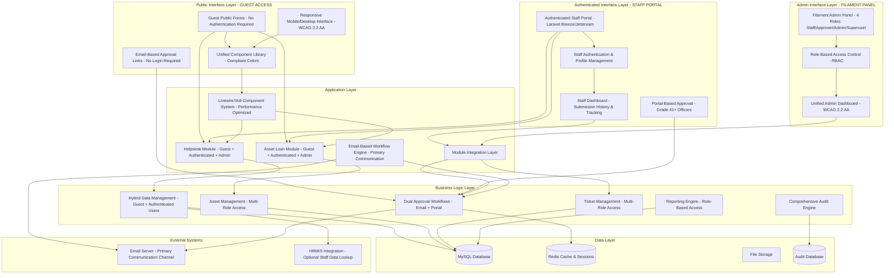

# Design Document

## Overview

The ICTServe System is designed as a comprehensive, integrated digital platform for managing ICT services within MOTAC BPM using a **hybrid architecture** that combines guest-accessible public forms with an authenticated internal portal for MOTAC staff. The system provides flexibility by allowing quick guest submissions without login while also offering enhanced features through an authenticated portal for staff who prefer comprehensive submission management.

**Critical Design Principle**: The system operates on a **hybrid dual-access model**:

1. **Guest Access (No Login)**: Public forms for quick helpdesk tickets and asset loan applications, accessible to all MOTAC staff without authentication
2. **Authenticated Portal (Login Required)**: Internal portal for staff to view submission history, manage profiles, add comments, track status, and access enhanced features
3. **Admin Access (Filament Panel)**: Backend management accessible to four roles: staff (own submissions), approver (Grade 41+ approval rights), admin (operational management), and superuser (full governance)

The design emphasizes dual-path workflows (guest + authenticated), email-based approvals for Grade 41+ officers, unified frontend components, seamless module integration, modern web technologies (Laravel 12, Livewire 3, Volt, Filament 4, Laravel Breeze/Jetstream), responsive UI/UX following **WCAG 2.2 Level AA standards**, **Core Web Vitals performance targets**, and comprehensive audit trails for compliance with government standards. Both guest and authenticated interactions are supported with email notifications as the primary communication channel.

## Architecture

### System Architecture Overview



### Technology Stack

| Layer | Technology | Version | Purpose |
|-------|------------|---------|---------|
| **Backend Framework** | Laravel | 12.x | Core application framework |
| **Language** | PHP | 8.2+ | Server-side programming |
| **Authentication** | Laravel Breeze/Jetstream | 2.x | Staff portal authentication |
| **Frontend Framework** | Livewire | 3.x | Dynamic UI components |
| **Single-File Components** | Volt | 1.x | Simplified component development |
| **Admin Panel** | Filament | 4.x | Administrative interface (4 roles: staff/approver/admin/superuser) |
| **Templating** | Blade | - | Server-side templating |
| **CSS Framework** | Tailwind CSS | 3.x | Utility-first styling with compliant colors |
| **Build Tool** | Vite | 4.x | Asset compilation and optimization |
| **Database** | MySQL | 8.0+ | Primary data storage |
| **Cache/Sessions** | Redis | 7.0+ | Caching and session management |
| **Queue System** | Laravel Queue | - | Background job processing |

### Design Patterns

- **Hybrid Access Pattern**: Dual-path access supporting both guest (no login) and authenticated (login required) workflows
- **Email-First Communication**: Primary interaction through automated email workflows for both guest and authenticated users
- **Dual Approval Pattern**: Support for both email-based approvals (no login) and portal-based approvals (authenticated)
- **MVC (Model-View-Controller)**: Laravel's core architectural pattern
- **Repository Pattern**: Data access abstraction for testability
- **Service Layer Pattern**: Business logic encapsulation
- **Observer Pattern**: Event-driven notifications and audit logging
- **Strategy Pattern**: Configurable approval workflows via email and portal
- **Factory Pattern**: Model factories for testing and seeding
- **Role-Based Access Control (RBAC)**: Four-tier role system (staff, approver, admin, superuser)

## WCAG 2.2 Level AA Compliance Design

### Compliant Color Palette

The system uses a strictly compliant color palette that meets WCAG 2.2 Level AA contrast requirements:

```css
/* Primary Colors - WCAG 2.2 AA Compliant */
--motac-blue: #0056b3;        /* 6.8:1 contrast ratio */
--motac-blue-light: #3d8bfd;  /* Hover states */
--motac-blue-dark: #004085;   /* Active states */

/* Semantic Colors - WCAG 2.2 AA Compliant */
--success: #198754;           /* 4.9:1 contrast ratio */
--warning: #ff8c00;           /* 4.5:1 contrast ratio with black text */
--danger: #b50c0c;            /* 8.2:1 contrast ratio */
--info: #0dcaf0;              /* Sufficient contrast */

/* DEPRECATED - TO BE REMOVED */
/* --warning-old: #F1C40F;   /* Non-compliant - REMOVE */
/* --danger-old: #E74C3C;    /* Non-compliant - REMOVE */
```

### Accessibility Features

1. **Focus Indicators**: 3-4px outline with 2px offset, minimum 3:1 contrast ratio
2. **Touch Targets**: Minimum 44×44px for all interactive elements
3. **Typography**: Line-height 1.5, maximum 80ch width for readability
4. **Color Independence**: No information conveyed by color alone
5. **ARIA Landmarks**: Proper semantic structure with role attributes
6. **Screen Reader Support**: ARIA live regions for dynamic content
7. **Keyboard Navigation**: Full keyboard accessibility with skip links

## Core Web Vitals Performance Design

### Performance Targets

- **LCP (Largest Contentful Paint)**: < 2.5 seconds
- **FID (First Input Delay)**: < 100 milliseconds
- **CLS (Cumulative Layout Shift)**: < 0.1
- **TTFB (Time to First Byte)**: < 600 milliseconds
- **Lighthouse Performance Score**: 90+
- **Lighthouse Accessibility Score**: 100

### Performance Optimization Strategies

1. **Image Optimization**: WebP format with JPEG fallbacks using picture elements, explicit width/height attributes to prevent CLS, critical images with fetchpriority="high", non-critical images with loading="lazy" and fetchpriority="low"
2. **Asset Optimization**: Vite build with Gzip/Brotli compression, code splitting with manual chunks for vendor/livewire, Terser minification with drop_console in production, correct TailwindCSS content paths for purging unused styles
3. **CSS Optimization**: Tailwind CSS purging with comprehensive content paths, critical CSS inlining, refactor all inline style attributes and style blocks into external CSS files
4. **JavaScript Optimization**: Code splitting with manual chunks, tree shaking, ES2020 target, remove console statements in production
5. **Caching Strategy**: Redis caching for sessions and application data, browser caching with proper headers, CDN integration for static assets
6. **Database Optimization**: Query optimization with eager loading using with(), proper indexing, N+1 query prevention with #[Computed] properties

## Components and Interfaces

### Core Components

#### 1. Hybrid Authentication Component

```php
// HYBRID ARCHITECTURE - Four-Role RBAC System
// Roles: staff (portal access), approver (Grade 41+ approval), admin (operational), superuser (governance)

class User extends Authenticatable

    use Auditable;

    protected $fillable = [
        'name', 'email', 'password', 'role', 'staff_id', 'grade_id', 'division_id'
  ;

    // Four roles in the hybrid system
    public function isStaff(): bool
    
        return $this->role === 'staff';


    public function isApprover(): bool
    
        return $this->role === 'approver';


    public function isAdmin(): bool
    
        return $this->role === 'admin';


    public function isSuperuser(): bool
    
        return $this->role === 'superuser';


    // Relationships for authenticated users
    public function division(): BelongsTo
    
        return $this->belongsTo(Division::class);


    public function grade(): BelongsTo
    
        return $this->belongsTo(Grade::class);


    public function helpdeskTickets(): HasMany
    
        return $this->hasMany(HelpdeskTicket::class);


    public function loanApplications(): HasMany
    
        return $this->hasMany(LoanApplication::class);


    // Check if user can approve based on grade
    public function canApprove(): bool
    
        return $this->isApprover() || $this->isAdmin() || $this->isSuperuser();


```

#### 2. Hybrid Helpdesk Module Component

```php
// Helpdesk Ticket Model - Supports both guest and authenticated submissions
class HelpdeskTicket extends Model

    use Auditable;

    protected $fillable = [
        'ticket_number', 'user_id', 'guest_name', 'guest_email', 'guest_phone',
        'staff_id', 'division_id', 'category_id', 'priority', 'subject',
        'description', 'status', 'assigned_to_division', 'assigned_to_agency',
        'asset_id', 'admin_notes'
  ;

    protected $casts = [
        'created_at' => 'datetime',
        'resolved_at' => 'datetime',
        'assigned_at' => 'datetime',
  ;

    // HYBRID SUPPORT - Optional user relationship for authenticated submissions
    public function user(): BelongsTo
    
        return $this->belongsTo(User::class);


    public function division(): BelongsTo
    
        return $this->belongsTo(Division::class);


    public function category(): BelongsTo
    
        return $this->belongsTo(TicketCategory::class);


    public function asset(): BelongsTo
    
        return $this->belongsTo(Asset::class);


    public function assignedDivision(): BelongsTo
    
        return $this->belongsTo(Division::class, 'assigned_to_division');


    public function comments(): HasMany
    
        return $this->hasMany(HelpdeskComment::class);


    public function attachments(): HasMany
    
        return $this->hasMany(HelpdeskAttachment::class);


    // Check if ticket is from guest or authenticated user
    public function isGuestSubmission(): bool
    
        return is_null($this->user_id);


    // Get submitter name (guest or authenticated)
    public function getSubmitterNameAttribute(): string
    
        return $this->user ? $this->user->name : $this->guest_name;


    // Get submitter email (guest or authenticated)
    public function getSubmitterEmailAttribute(): string
    
        return $this->user ? $this->user->email : $this->guest_email;


    public function generateTicketNumber(): string
    
        return 'HD' . date('Y') . str_pad($this->id, 6, '0', STR_PAD_LEFT);


```

#### 3. Hybrid Asset Loan Module Component

```php
// Loan Application Model - Supports both guest and authenticated submissions with dual approval paths
class LoanApplication extends Model

    use Auditable;

    protected $fillable = [
        'application_number', 'user_id', 'applicant_name', 'applicant_email', 'applicant_phone',
        'staff_id', 'grade_id', 'division_id', 'asset_id', 'purpose',
        'start_date', 'end_date', 'status', 'approver_id', 'approver_name', 'approver_email',
        'approval_token', 'token_expires_at', 'approval_remarks', 'approval_method'
  ;

    protected $casts = [
        'start_date' => 'date',
        'end_date' => 'date',
        'approved_at' => 'datetime',
        'rejected_at' => 'datetime',
        'token_expires_at' => 'datetime',
  ;

    // HYBRID SUPPORT - Optional user relationships for authenticated submissions
    public function user(): BelongsTo
    
        return $this->belongsTo(User::class);


    public function approver(): BelongsTo
    
        return $this->belongsTo(User::class, 'approver_id');


    public function division(): BelongsTo
    
        return $this->belongsTo(Division::class);


    public function grade(): BelongsTo
    
        return $this->belongsTo(Grade::class);


    public function asset(): BelongsTo
    
        return $this->belongsTo(Asset::class);


    public function transaction(): HasOne
    
        return $this->hasOne(AssetTransaction::class);


    // Check if application is from guest or authenticated user
    public function isGuestSubmission(): bool
    
        return is_null($this->user_id);


    // Get applicant name (guest or authenticated)
    public function getApplicantNameAttribute(): string
    
        return $this->user ? $this->user->name : $this->attributes['applicant_name'];


    // Get applicant email (guest or authenticated)
    public function getApplicantEmailAttribute(): string
    
        return $this->user ? $this->user->email : $this->attributes['applicant_email'];


    // Generate approval token for email-based approval
    public function generateApprovalToken(): string
    
        $this->approval_token = Str::random(64);
        $this->token_expires_at = now()->addDays(7);
        $this->save();

        return $this->approval_token;


    // Validate approval token
    public function isTokenValid(string $token): bool
    
        return $this->approval_token === $token
            && $this->token_expires_at > now()
            && $this->status === 'pending_approval';


    // Generate application number
    public function generateApplicationNumber(): string
    
        return 'AL' . date('Y') . str_pad($this->id, 6, '0', STR_PAD_LEFT);


```

### Frontend Component Architecture

#### 1. WCAG 2.2 AA Compliant Component Library Structure

```text
resources/views/components/
├── layout/
│   ├── guest.blade.php        # Guest layout for public forms (no authentication)
│   ├── app.blade.php          # Authenticated layout for staff portal (login required)
│   ├── header.blade.php       # Site header with MOTAC branding
│   ├── auth-header.blade.php  # Authenticated header with user menu
│   └── footer.blade.php       # Site footer with accessibility links
├── form/
│   ├── input.blade.php        # WCAG compliant input with proper labels
│   ├── select.blade.php       # Accessible select with ARIA attributes
│   ├── textarea.blade.php     # Accessible textarea component
│   ├── checkbox.blade.php     # WCAG compliant checkbox
│   └── file-upload.blade.php  # Accessible file upload component
├── ui/
│   ├── button.blade.php       # 44×44px minimum touch targets
│   ├── card.blade.php         # Accessible card container
│   ├── alert.blade.php        # ARIA live region alerts
│   ├── badge.blade.php        # Accessible status badges
│   └── modal.blade.php        # Focus trap modal dialogs
├── navigation/
│   ├── breadcrumbs.blade.php  # Accessible breadcrumb navigation
│   ├── pagination.blade.php   # WCAG compliant pagination
│   └── skip-links.blade.php   # Skip navigation for keyboard users
├── data/
│   ├── table.blade.php        # Accessible data tables
│   ├── status-badge.blade.php # Color + icon + text status indicators
│   └── progress-bar.blade.php # Accessible progress indicators
└── accessibility/
    ├── aria-live.blade.php    # Screen reader announcements
    ├── focus-trap.blade.php   # Focus management
    └── language-switcher.blade.php # Session/cookie-based language switching
```

#### 2. Guest-Only Public Form Components

```blade
<!-- Guest Helpdesk Ticket Form Component - WCAG 2.2 AA Compliant -->
<div class="max-w-4xl mx-auto p-6 bg-white rounded-lg shadow-lg">
    <x-navigation.skip-links />

    <header class="mb-8" role="banner">
        <h1 class="text-3xl font-bold text-gray-900 mb-2">
             __('Submit Helpdesk Ticket') 
        </h1>
        <p class="text-gray-600">
             __('Report technical issues or request ICT support - No login required') 
        </p>
    </header>

    <main role="main">
        <form wire:submit.prevent="submitTicket" class="space-y-6" novalidate>
            <div class="grid grid-cols-1 md:grid-cols-2 gap-6">
                <x-form.input
                    name="name"
                    label=" __('Full Name') "
                    wire:model.live="form.name"
                    required
                    aria-describedby="name-help"
                    autocomplete="name" />

                <x-form.input
                    name="email"
                    type="email"
                    label=" __('Email Address') "
                    wire:model.live="form.email"
                    required
                    aria-describedby="email-help"
                    autocomplete="email" />
            </div>

            <x-form.select
                name="category_id"
                label=" __('Issue Category') "
                wire:model.live="form.category_id"
                :options="$categories"
                required
                aria-describedby="category-help" />

            <x-form.textarea
                name="description"
                label=" __('Problem Description') "
                wire:model.live="form.description"
                rows="5"
                required
                aria-describedby="description-help"
                minlength="10"
                maxlength="5000" />

            <x-form.file-upload
                name="attachments"
                label=" __('Attachments (Optional)') "
                wire:model="form.attachments"
                multiple
                accept="image/*,.pdf,.doc,.docx"
                aria-describedby="attachments-help" />

            <div class="flex justify-end space-x-4" role="group" aria-label=" __('Form actions') ">
                <x-ui.button
                    type="button"
                    variant="secondary"
                    wire:click="clearForm">
                     __('Clear Form') 
                </x-ui.button>

                <x-ui.button
                    type="submit"
                    variant="primary"
                    wire:loading.attr="disabled"
                    aria-describedby="submit-help">
                    <span wire:loading.remove> __('Submit Ticket') </span>
                    <span wire:loading aria-live="polite"> __('Submitting...') </span>
                </x-ui.button>
            </div>
        </form>
    </main>

    <!-- ARIA Live Region for Screen Reader Announcements -->
    <div aria-live="polite" aria-atomic="true" class="sr-only" id="form-announcements"></div>
</div>
```

#### 3. Authenticated Staff Portal Components

```blade
<!-- Authenticated Staff Dashboard - WCAG 2.2 AA Compliant -->
<x-layout.app>
    <x-navigation.skip-links />

    <header class="mb-8" role="banner">
        <h1 class="text-3xl font-bold text-gray-900 mb-2">
             __('My Dashboard') 
        </h1>
        <p class="text-gray-600">
             __('View and manage your helpdesk tickets and asset loan applications') 
        </p>
    </header>

    <main role="main">
        <!-- Quick Stats -->
        <div class="grid grid-cols-1 md:grid-cols-4 gap-6 mb-8">
            <x-ui.card>
                <h3 class="text-lg font-semibold mb-2"> __('Open Tickets') </h3>
                <p class="text-3xl font-bold text-motac-blue"> $openTickets </p>
            </x-ui.card>

            <x-ui.card>
                <h3 class="text-lg font-semibold mb-2"> __('Active Loans') </h3>
                <p class="text-3xl font-bold text-motac-blue"> $activeLoans </p>
            </x-ui.card>

            <x-ui.card>
                <h3 class="text-lg font-semibold mb-2"> __('Pending Approvals') </h3>
                <p class="text-3xl font-bold text-warning"> $pendingApprovals </p>
            </x-ui.card>

            <x-ui.card>
                <h3 class="text-lg font-semibold mb-2"> __('Resolved This Month') </h3>
                <p class="text-3xl font-bold text-success"> $resolvedThisMonth </p>
            </x-ui.card>
        </div>

        <!-- Recent Submissions -->
        <div class="grid grid-cols-1 lg:grid-cols-2 gap-6">
            <!-- Helpdesk Tickets -->
            <x-ui.card>
                <h2 class="text-xl font-bold mb-4"> __('Recent Helpdesk Tickets') </h2>
                <x-data.table :items="$recentTickets" />
                <div class="mt-4">
                    <x-ui.button href=" route('staff.tickets.index') ">
                         __('View All Tickets') 
                    </x-ui.button>
                </div>
            </x-ui.card>

            <!-- Asset Loan Applications -->
            <x-ui.card>
                <h2 class="text-xl font-bold mb-4"> __('Recent Loan Applications') </h2>
                <x-data.table :items="$recentApplications" />
                <div class="mt-4">
                    <x-ui.button href=" route('staff.loans.index') ">
                         __('View All Applications') 
                    </x-ui.button>
                </div>
            </x-ui.card>
        </div>
    </main>
</x-layout.app>
```

```php
// Authenticated Staff Portal Controller
class StaffPortalController extends Controller

    public function __construct()
    
        $this->middleware('auth');


    public function dashboard()
    
        $user = auth()->user();

        return view('staff.dashboard', [
            'openTickets' => $user->helpdeskTickets()->where('status', 'open')->count(),
            'activeLoans' => $user->loanApplications()->where('status', 'approved')->count(),
            'pendingApprovals' => $user->canApprove()
                ? LoanApplication::where('status', 'pending_approval')->count()
                : 0,
            'resolvedThisMonth' => $user->helpdeskTickets()
                ->where('status', 'resolved')
                ->whereMonth('resolved_at', now()->month)
                ->count(),
            'recentTickets' => $user->helpdeskTickets()->latest()->take(5)->get(),
            'recentApplications' => $user->loanApplications()->latest()->take(5)->get(),
      );


    public function claimGuestSubmission(Request $request)
    
        $validated = $request->validate([
            'email' => 'required|email',
            'submission_type' => 'required|in:ticket,loan',
            'submission_id' => 'required|integer',
      );

        $user = auth()->user();

        // Verify email matches
        if ($user->email !== $validated['email']) 
            return back()->withErrors(['email' => 'Email does not match your account.']);
    

        // Claim the submission
        if ($validated['submission_type'] === 'ticket') 
            $ticket = HelpdeskTicket::findOrFail($validated['submission_id']);
            if ($ticket->guest_email === $user->email && is_null($ticket->user_id)) 
                $ticket->update(['user_id' => $user->id]);
                return redirect()->route('staff.tickets.show', $ticket)
                    ->with('success', 'Ticket claimed successfully.');
        
     else 
            $application = LoanApplication::findOrFail($validated['submission_id']);
            if ($application->applicant_email === $user->email && is_null($application->user_id)) 
                $application->update(['user_id' => $user->id]);
                return redirect()->route('staff.loans.show', $application)
                    ->with('success', 'Application claimed successfully.');
        
    

        return back()->withErrors(['submission' => 'Unable to claim submission.']);


```

### Dual Approval Workflow

#### 1. Hybrid Email and Portal Approval Service

```php
class DualApprovalService

    public function sendApprovalRequest(LoanApplication $application): void
    
        // Generate secure approval token for email-based approval
        $token = $application->generateApprovalToken();

        // Determine approver based on applicant grade and asset value
        $approver = ApprovalMatrix::getApproverByGrade($application->grade_id, $application->asset);

        // Try to find approver user account for portal-based approval
        $approverUser = User::where('email', $approver['email'])
            ->where('role', 'approver')
            ->first();

        // Update application with approver details
        $application->update([
            'approver_id' => $approverUser?->id,
            'approver_name' => $approver['name'],
            'approver_email' => $approver['email'],
      );

        // Send email with DUAL approval options:
        // 1. Email-based approval links (no login required)
        // 2. Portal-based approval link (login required)
        Mail::to($approver['email'])->send(new LoanApprovalRequest($application, $token));

        // Log the approval request
        AuditLog::create([
            'action' => 'approval_request_sent',
            'model_type' => LoanApplication::class,
            'model_id' => $application->id,
            'data' => [
                'approver_email' => $approver['email'],
                'approver_id' => $approverUser?->id,
                'approval_methods' => ['email', 'portal'],
          ,
      );


    // Email-based approval (no login required)
    public function processEmailApproval(string $token, bool $approved, ?string $remarks = null): array
    
        $application = LoanApplication::where('approval_token', $token)->firstOrFail();

        if (!$application->isTokenValid($token)) 
            return [
                'success' => false,
                'message' => 'This approval link has expired or is invalid.',
          ;
    

        $application->update([
            'status' => $approved ? 'approved' : 'rejected',
            'approved_at' => now(),
            'approval_remarks' => $remarks,
            'approval_token' => null, // Invalidate token
            'approval_method' => 'email',
      );

        $this->sendApprovalNotifications($application, $approved);
        $this->logApprovalDecision($application, $approved, 'email');

        return [
            'success' => true,
            'message' => $approved
                ? 'Application approved successfully via email.'
                : 'Application declined successfully via email.',
      ;


    // Portal-based approval (login required)
    public function processPortalApproval(LoanApplication $application, User $approver, bool $approved, ?string $remarks = null): array
    
        // Verify approver has permission
        if (!$approver->canApprove()) 
            return [
                'success' => false,
                'message' => 'You do not have permission to approve applications.',
          ;
    

        $application->update([
            'status' => $approved ? 'approved' : 'rejected',
            'approved_at' => now(),
            'approval_remarks' => $remarks,
            'approver_id' => $approver->id,
            'approval_token' => null, // Invalidate email token
            'approval_method' => 'portal',
      );

        $this->sendApprovalNotifications($application, $approved);
        $this->logApprovalDecision($application, $approved, 'portal', $approver);

        return [
            'success' => true,
            'message' => $approved
                ? 'Application approved successfully via portal.'
                : 'Application declined successfully via portal.',
      ;


    private function sendApprovalNotifications(LoanApplication $application, bool $approved): void
    
        // Send confirmation to applicant (guest or authenticated)
        $applicantEmail = $application->user ? $application->user->email : $application->applicant_email;
        Mail::to($applicantEmail)->send(new LoanApplicationDecision($application, $approved));

        // Send confirmation to approver
        Mail::to($application->approver_email)->send(new ApprovalConfirmation($application, $approved));


    private function logApprovalDecision(LoanApplication $application, bool $approved, string $method, ?User $approver = null): void
    
        AuditLog::create([
            'action' => $approved ? 'application_approved' : 'application_rejected',
            'model_type' => LoanApplication::class,
            'model_id' => $application->id,
            'user_id' => $approver?->id,
            'data' => [
                'remarks' => $application->approval_remarks,
                'approval_method' => $method,
                'approver_email' => $application->approver_email,
          ,
      );


```

#### 2. Hybrid Public Form Controller

```php
class HybridFormController extends Controller

    public function submitHelpdeskTicket(Request $request)
    
        $validated = $request->validate([
            'name' => 'required|string|max:255',
            'email' => 'required|email',
            'phone' => 'required|string',
            'staff_id' => 'nullable|string',
            'category_id' => 'required|exists:categories,id',
            'subject' => 'required|string|max:255',
            'description' => 'required|string|min:10|max:5000',
            'attachments.*' => 'nullable|file|max:10240',
      );

        // Create ticket - HYBRID: link to user if authenticated, otherwise guest
        $ticket = HelpdeskTicket::create([
            'ticket_number' => TicketNumberGenerator::generate(),
            'user_id' => auth()->id(), // NULL for guest, user ID for authenticated
            'guest_name' => $validated['name'],
            'guest_email' => $validated['email'],
            'guest_phone' => $validated['phone'],
            'staff_id' => $validated['staff_id'],
            'category_id' => $validated['category_id'],
            'subject' => $validated['subject'],
            'description' => $validated['description'],
            'status' => 'open',
            'priority' => 'medium',
      );

        // Handle attachments
        if ($request->hasFile('attachments')) 
            foreach ($request->file('attachments') as $file) 
                $ticket->attachments()->create([
                    'filename' => $file->getClientOriginalName(),
                    'path' => $file->store('helpdesk-attachments'),
                    'size' => $file->getSize(),
              );
        
    

        // Send confirmation email
        $email = auth()->check() ? auth()->user()->email : $ticket->guest_email;
        Mail::to($email)->send(new TicketCreatedConfirmation($ticket));

        // Notify admin users
        User::whereIn('role', ['admin', 'superuser'])->each(function ($admin) use ($ticket) 
            Mail::to($admin->email)->send(new NewTicketNotification($ticket));
    );

        return response()->json([
            'success' => true,
            'ticket_number' => $ticket->ticket_number,
            'message' => 'Your ticket has been submitted successfully. You will receive a confirmation email shortly.',
            'authenticated' => auth()->check(),
      );


    public function submitLoanApplication(Request $request)
    
        $validated = $request->validate([
            'name' => 'required|string|max:255',
            'email' => 'required|email',
            'phone' => 'required|string',
            'staff_id' => 'nullable|string',
            'grade_id' => 'required|exists:grades,id',
            'division_id' => 'required|exists:divisions,id',
            'asset_id' => 'required|exists:assets,id',
            'purpose' => 'required|string|min:10|max:1000',
            'start_date' => 'required|date|after:today',
            'end_date' => 'required|date|after:start_date',
      );

        // Create loan application - HYBRID: link to user if authenticated, otherwise guest
        $application = LoanApplication::create([
            'application_number' => ApplicationNumberGenerator::generate(),
            'user_id' => auth()->id(), // NULL for guest, user ID for authenticated
            'applicant_name' => $validated['name'],
            'applicant_email' => $validated['email'],
            'applicant_phone' => $validated['phone'],
            'staff_id' => $validated['staff_id'],
            'grade_id' => $validated['grade_id'],
            'division_id' => $validated['division_id'],
            'asset_id' => $validated['asset_id'],
            'purpose' => $validated['purpose'],
            'start_date' => $validated['start_date'],
            'end_date' => $validated['end_date'],
            'status' => 'pending_approval',
      );

        // Send approval request with DUAL approval options (email + portal)
        app(DualApprovalService::class)->sendApprovalRequest($application);

        // Send confirmation email
        $email = auth()->check() ? auth()->user()->email : $application->applicant_email;
        Mail::to($email)->send(new LoanApplicationSubmitted($application));

        return response()->json([
            'success' => true,
            'application_number' => $application->application_number,
            'message' => 'Your loan application has been submitted successfully. You will receive updates via email.',
            'authenticated' => auth()->check(),
      );


```

### Language Switcher - Hybrid Persistence

#### Hybrid Language Switcher Component

**Design Rationale**: Based on Requirement 20, the language switcher uses session/cookie persistence for guest users (no authentication required). However, for the hybrid architecture with authenticated portal (Requirements 1, 22), authenticated users benefit from profile-based persistence for a seamless experience across devices.

```php
// Language Switcher - HYBRID: Session/Cookie for guests, User Profile for authenticated
class LanguageSwitcherController extends Controller

    public function switch(Request $request)
    
        $locale = $request->input('locale');

        if (!in_array($locale, ['en', 'ms'])) 
            return back();
    

        // HYBRID PERSISTENCE:
        // 1. For authenticated users: store in user profile
        if (auth()->check()) 
            auth()->user()->update(['locale' => $locale]);
    

        // 2. For all users (guest + authenticated): store in session and cookie
        session(['locale' => $locale]);
        cookie()->queue('locale', $locale, 60 * 24 * 365); // 1 year

        // Set application locale
        app()->setLocale($locale);

        return back();


    public function current()
    
        // HYBRID Language resolution priority:
        // Authenticated: User Profile → Session → Cookie → Browser → Fallback
        // Guest: Session → Cookie → Browser → Fallback
        $locale = auth()->check()
            ? (auth()->user()->locale ?? session('locale'))
            : session('locale');

        $locale = $locale
            ?? request()->cookie('locale')
            ?? $this->getBrowserLocale()
            ?? config('app.locale');

        return response()->json([
            'locale' => $locale,
            'authenticated' => auth()->check(),
      );


    private function getBrowserLocale(): ?string
    
        $acceptLanguage = request()->header('Accept-Language');

        if (!$acceptLanguage) 
            return null;
    

        // Simple browser locale detection
        if (str_contains($acceptLanguage, 'ms')) 
            return 'ms';
    

        return 'en';


```

**Note**: While Requirement 20 specifies session/cookie only for the guest-only model, the hybrid architecture (Requirements 1, 22, 23) necessitates user profile persistence for authenticated users to provide a consistent experience across devices and sessions.

## Data Models

### Entity Relationship Diagram - Guest-Only Model

```mermaid
erDiagram
    USERS ||--o AUDIT_LOGS : performs
    USERS ||--o HELPDESK_TICKETS : submits
    USERS ||--o LOAN_APPLICATIONS : submits
    USERS ||--o LOAN_APPLICATIONS : approves
    USERS 
        id int PK
        name string
        email string
        password string
        role enum "staff,approver,admin,superuser"
        staff_id string
        grade_id int FK
        division_id int FK
        locale string "Language preference"


    HELPDESK_TICKETS o--|| USERS : submitted_by
    HELPDESK_TICKETS o--|| ASSETS : relates_to
    HELPDESK_TICKETS ||--o HELPDESK_COMMENTS : has
    HELPDESK_TICKETS o--|| CATEGORIES : belongs_to
    HELPDESK_TICKETS 
        id int PK
        ticket_number string
        user_id int FK "NULL for guest"
        guest_name string
        guest_email string
        guest_phone string
        staff_id string
        division_id int FK
        category_id int FK
        priority enum
        subject string
        description text
        status enum
        assigned_to_division int FK
        assigned_to_agency string
        asset_id int FK
        admin_notes text


    LOAN_APPLICATIONS o--|| USERS : submitted_by
    LOAN_APPLICATIONS o--|| USERS : approved_by
    LOAN_APPLICATIONS o--|| ASSETS : requests
    LOAN_APPLICATIONS ||--o| ASSET_TRANSACTIONS : generates
    LOAN_APPLICATIONS 
        id int PK
        application_number string
        user_id int FK "NULL for guest"
        applicant_name string
        applicant_email string
        applicant_phone string
        staff_id string
        grade_id int FK
        division_id int FK
        asset_id int FK
        purpose text
        start_date date
        end_date date
        status enum
        approver_id int FK "NULL for email approval"
        approver_name string
        approver_email string
        approval_token string
        token_expires_at datetime
        approval_remarks text
        approval_method enum "email,portal"


    ASSETS o--|| ASSET_CATEGORIES : belongs_to
    ASSETS ||--o ASSET_TRANSACTIONS : involved_in

    ASSET_TRANSACTIONS 
        id int PK
        loan_application_id int FK
        asset_id int FK
        issued_at datetime
        returned_at datetime
        condition_issued enum
        condition_returned enum
        notes text


    DIVISIONS ||--o USERS : has
    GRADES ||--o USERS : has

    AUDIT_LOGS o--|| USERS : performed_by
```

### Core Data Models - Hybrid Architecture

#### User and Authentication Management

- **users**: Four-role RBAC system (staff, approver, admin, superuser) with optional profile data (staff_id, grade_id, division_id, locale)
- **divisions**: Organizational divisions within MOTAC
- **grades**: Staff grade levels for approval matrix and role assignment

#### Asset Management

- **assets**: ICT equipment inventory
- **asset_categories**: Equipment categories (laptop, projector, etc.)
- **asset_transactions**: Issuance and return records
- **loan_applications**: Hybrid loan requests (guest or authenticated) with dual approval paths (email-based or portal-based) and optional user_id and approver_id foreign keys

#### Helpdesk Management

- **helpdesk_tickets**: Hybrid support tickets (guest or authenticated submissions) with optional user_id foreign key
- **helpdesk_comments**: Communication history (admin and authenticated users)
- **categories**: Ticket categories (hardware, software, network)
- **sla_policies**: Service level agreement definitions

#### System Management

- **audit_logs**: Comprehensive audit trail
- **notifications**: System notifications (admin only)
- **settings**: System configuration
- **reports**: Saved report configurations

## Comprehensive Refactoring Compliance Design

### Directive 1: Remove All General Authentication

- **NO BREEZE**: All Laravel Breeze references removed from requirements and design
- **NO SSO/LDAP**: All LDAP Integration and "SSO MOTAC" references removed
- **NO AUTH FEATURES**: Session Timeout and Password Reset for non-admin users removed
- **ADMIN ONLY**: Only admin and superuser roles have login access to Filament admin panel

### Directive 2: Simplify All User Roles

- **ROLES DELETED**: All roles removed except admin and superuser (no staff, it-support, approver, bpm-staff, helpdesk-admin, auditor)
- **GUEST ONLY**: All MOTAC staff access services as guests through public forms
- **EMAIL APPROVAL**: Grade 41+ officers approve via email links without system login

### Directive 3: Global Design & Accessibility (WCAG 2.2 AA)

- **COMPLIANT COLORS**: Primary #0056b3 (6.8:1), Success #198754 (4.9:1), Warning #ff8c00 (4.5:1), Danger #b50c0c (8.2:1)
- **DEPRECATED REMOVAL**: Warning Yellow #F1C40F and Danger Red #E74C3C completely removed
- **FOCUS INDICATORS**: 3-4px outline with 2px offset and 3:1 contrast ratio minimum
- **TOUCH TARGETS**: Minimum 44×44px for all interactive elements
- **SEMANTIC HTML**: Proper HTML5 structure with ARIA landmarks (header, nav, main, footer)

### Directive 4: Performance & Asset Optimization

- **CIGHTHOUSE SCORES**: Performance 90+, Accessibility 100, Best Practices 100, SEO 100
- **IMAGE OPTIMIZORE WEB VITALS**: LCP <2.5s, FID <100ms, CLS <0.1, TTFB <600ms tar **Database Errors**: Transaction rollback with error recovery and user-friendly messaging
ATION**: WebP with fallbacks, explicit dimensions, fetchpriority attributes
- **VITE OPTIMIZATION**: Gzip/Brotli compression, code splitting, Terser minification
- **INLINE STYLES**: All refactored to external CSS files imported via Vite

### Directive 5: Implement Hybrid Pages (Guest + Authenticated)

- **DUAL LAYOUTS**: Maintain guest.blade.php for public forms AND app.blade.php for authenticated portal
- **HYBRID FORMS**: Support both guest fields (manual entry) and authenticated fields (pre-filled from profile)
- **LIVEWIRE OPTIMIZATION**: wire:model.live.debounce.300ms, wire:model.lazy, #[Computed] properties, eager loading with with()

### Directive 6: Enhanced Language Switcher

- **USER PROFILE SUPPORT**: Add users.locale database column for authenticated users, maintain session/cookie for guests
- **HYBRID PERSISTENCE**: Session/Cookie for guests, User Profile for authenticated users
- **WCAG COMPLIANCE**: 44×44px touch targets and keyboard navigation for language switcher

### Directive 7: Implement Authenticated Portal Features

- **ADD PORTAL UI**: Implement Staff Dashboard, User Profile pages, authenticated navigation
- **DUAL WORKFLOWS**: Email-based approval (no login) AND portal-based approval (with login)
- **ENHANCED FEATURES**: Authenticated users get submission history, profile management, in-app notifications

### Directive 8: Final Integration & Compliance

- **BROWSER COMPATIBILITY**: Chrome 90+, Firefox 88+, Safari 14+, Edge 90+ support matrix
- **FILAMENT COMPLIANCE**: Admin interface meets WCAG 2.2 AA with MOTAC branding and bilingual support
- **DOCUMENTATION CONSISTENCY**: All specs updated to reflect hybrid architecture with four-role RBAC (staff, approver, admin, superuser)

## Authenticated Portal Design

### Portal Architecture

The authenticated staff portal provides enhanced features for MOTAC staff who prefer comprehensive submission management over quick guest forms. The portal is built using Laravel Breeze or Jetstream for authentication and follows the same WCAG 2.2 Level AA standards as the guest interface.

**Design Rationale**: Requirements 1, 11, 22, and 23 specify a hybrid architecture where staff can choose between:

1. **Quick Guest Access**: Submit forms without login for speed and convenience
2. **Authenticated Portal**: Login for submission history, profile management, and enhanced tracking

### Portal Features

#### 1. Authentication and Registration

- **Laravel Breeze/Jetstream**: Standard authentication flows (login, registration, password reset, email verification)
- **Role Assignment**: New users default to 'staff' role; admin/superuser can upgrade to 'approver', 'admin', or 'superuser'
- **Profile Management**: Staff can update contact information, division, grade, and language preference

#### 2. Staff Dashboard

- **Submission Overview**: Quick stats showing open tickets, active loans, pending approvals (for approvers), and resolved items
- **Recent Activity**: Latest helpdesk tickets and loan applications with status indicators
- **Quick Actions**: Links to submit new tickets/applications, view all submissions, and manage profile

#### 3. Submission Management

- **Helpdesk Tickets**: View all tickets (own submissions), add comments, upload attachments, track status
- **Loan Applications**: View all applications (own submissions), track approval status, view approver remarks
- **Guest Claim Feature**: Link guest submissions to authenticated account by verifying email ownership

#### 4. Approval Workflow (Grade 41+ Officers)

- **Dual Approval Options**: Approvers can use email links (no login) OR portal interface (with login)
- **Portal Approval Interface**: View application details, approve/decline with remarks, track approval history
- **Approval Dashboard**: List of pending applications requiring approval with filtering and search

#### 5. Profile and Preferences

- **Contact Information**: Update name, email, phone, staff ID
- **Organizational Data**: Update division and grade (with admin approval)
- **Language Preference**: Set preferred language (stored in user profile for cross-device consistency)
- **Notification Settings**: Configure email notification preferences

### Portal Routes and Controllers

```php
// routes/web.php - Authenticated Portal Routes
Route::middleware(['auth'])->prefix('staff')->name('staff.')->group(function () 
    // Dashboard
    Route::get('/dashboard', [StaffPortalController::class, 'dashboard'])->name('dashboard');

    // Profile Management
    Route::get('/profile', [StaffPortalController::class, 'profile'])->name('profile');
    Route::put('/profile', [StaffPortalController::class, 'updateProfile'])->name('profile.update');

    // Helpdesk Tickets
    Route::resource('tickets', StaffTicketController::class);
    Route::post('/tickets/ticket/comments', [StaffTicketController::class, 'addComment'])->name('tickets.comments.store');

    // Loan Applications
    Route::resource('loans', StaffLoanController::class);

    // Guest Submission Claiming
    Route::post('/claim-submission', [StaffPortalController::class, 'claimGuestSubmission'])->name('claim-submission');

    // Approval Workflow (approver, admin, superuser only)
    Route::middleware(['role:approver,admin,superuser'])->group(function () 
        Route::get('/approvals', [ApprovalController::class, 'index'])->name('approvals.index');
        Route::post('/approvals/application/approve', [ApprovalController::class, 'approve'])->name('approvals.approve');
        Route::post('/approvals/application/decline', [ApprovalController::class, 'decline'])->name('approvals.decline');
);
);
```

### Portal UI Components

```blade
<!-- Authenticated Portal Layout -->
<x-layout.app>
    <x-navigation.auth-header :user="auth()->user()" />

    <div class="flex">
        <!-- Sidebar Navigation -->
        <aside class="w-64 bg-white shadow-md" role="navigation" aria-label=" __('Main navigation') ">
            <nav class="p-4">
                <ul class="space-y-2">
                    <li><a href=" route('staff.dashboard') " class="nav-link"> __('Dashboard') </a></li>
                    <li><a href=" route('staff.tickets.index') " class="nav-link"> __('My Tickets') </a></li>
                    <li><a href=" route('staff.loans.index') " class="nav-link"> __('My Loans') </a></li>
                    @if(auth()->user()->canApprove())
                        <li><a href=" route('staff.approvals.index') " class="nav-link"> __('Approvals') </a></li>
                    @endif
                    <li><a href=" route('staff.profile') " class="nav-link"> __('Profile') </a></li>
                </ul>
            </nav>
        </aside>

        <!-- Main Content -->
        <main class="flex-1 p-8" role="main">
             $slot 
        </main>
    </div>
</x-layout.app>
```

### Security Considerations

1. **Role-Based Access Control**: Middleware enforces role-based permissions for all portal routes
2. **CSRF Protection**: All forms include CSRF tokens
3. **Session Management**: Secure session handling with Redis backend
4. **Password Security**: Bcrypt hashing with Laravel's default authentication
5. **Audit Logging**: All authenticated actions logged with user ID and timestamp

## Error Handling

### WCAG 2.2 AA Compliant Error Handling

1. **Validation Errors**: Real-time form validation with ARIA live regions and proper error associations
2. **Business Logic Errors**: Custom exceptions with user-friendly messages and proper ARIA attributes
3. **System Errors**: Accessible error pages with proper semantic structure and helpful guidance
4. **API Errors**: Standardized error responses with proper HTTP status codes and accessibility features
5. **Guest Form Errors**: Clear error messaging for guest submissions with email confirmation of issues

### Accessible Error Response Format

```php
class AccessibleErrorResponse

    public static function validation($errors): JsonResponse
    
        return response()->json([
            'success' => false,
            'message' => 'Please correct the errors below',
            'errors' => $errors,
            'error_code' => 'VALIDATION_ERROR',
            'aria_live' => 'assertive', // For screen readers
            'focus_target' => 'first-error' // For focus management
      , 422);


    public static function businessLogic($message, $code = 'BUSINESS_ERROR'): JsonResponse
    
        return response()->json([
            'success' => false,
            'message' => $message,
            'error_code' => $code,
            'aria_live' => 'polite',
            'severity' => 'error'
      , 400);


    public static function system($message = 'System error occurred'): JsonResponse
    
        Log::error('System error: ' . $message);

        return response()->json([
            'success' => false,
            'message' => 'A system error occurred. Please try again later or contact support.',
            'error_code' => 'SYSTEM_ERROR',
            'aria_live' => 'assertive',
            'contact_info' => [
                'email' => 'support@motac.gov.my',
                'phone' => '+603 8000 9999'
          
      , 500);


```

## Testing Strategy

### WCAG 2.2 Level AA Testing Requirements

1. **Automated Accessibility Testing**: Lighthouse, axe DevTools, WAVE
2. **Manual Accessibility Testing**: Screen readers (NVDA, JAWS, VoiceOver), keyboard navigation
3. **Performance Testing**: Core Web Vitals monitoring, Lighthouse performance audits
4. **Cross-Browser Testing**: Chrome 90+, Firefox 88+, Safari 14+, Edge 90+
5. **Responsive Testing**: Mobile (320px-414px), Tablet (768px-1024px), Desktop (1280px-1920px)

### Test Coverage Requirements

- **Minimum Coverage**: 80% for all business logic
- **Critical Paths**: 95% coverage for guest form submissions, email approval workflows
- **Accessibility Features**: 100% coverage for WCAG 2.2 compliance features
- **Performance**: Core Web Vitals monitoring on all public pages

### Testing Examples

```php
// Guest Form Submission Test
class GuestTicketSubmissionTest extends TestCase

    use RefreshDatabase;

    public function test_guest_can_submit_helpdesk_ticket()
    
        $category = Category::factory()->create();

        $response = $this->post('/tickets', [
            'name' => 'John Doe',
            'email' => 'john@motac.gov.my',
            'phone' => '+60123456789',
            'staff_id' => 'MOTAC001',
            'category_id' => $category->id,
            'subject' => 'Test Issue',
            'description' => 'Test description with minimum 10 characters',
            'priority' => 'medium'
      );

        $response->assertJson(['success' => true]);
        $this->assertDatabaseHas('helpdesk_tickets', [
            'guest_name' => 'John Doe',
            'guest_email' => 'john@motac.gov.my',
            'subject' => 'Test Issue'
      );

        // Verify no user relationship exists
        $ticket = HelpdeskTicket::where('guest_email', 'john@motac.gov.my')->first();
        $this->assertNull($ticket->user_id);


    public function test_accessibility_compliance()
    
        $response = $this->get('/');

        $response->assertStatus(200);

        // Test ARIA landmarks
        $response->assertSee('role="banner"', false);
        $response->assertSee('role="main"', false);
        $response->assertSee('role="contentinfo"', false);

        // Test skip links
        $response->assertSee('Skip to main content');

        // Test proper heading hierarchy
        $response->assertSee('<h1', false);


```

---

**Document Version**: 2.0
**Last Updated**: 2025-10-30
**Author**: System Architecture Team
**Status**: Updated for Hybrid Architecture with WCAG 2.2 AA Compliance
