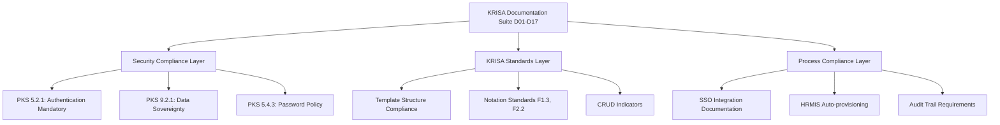
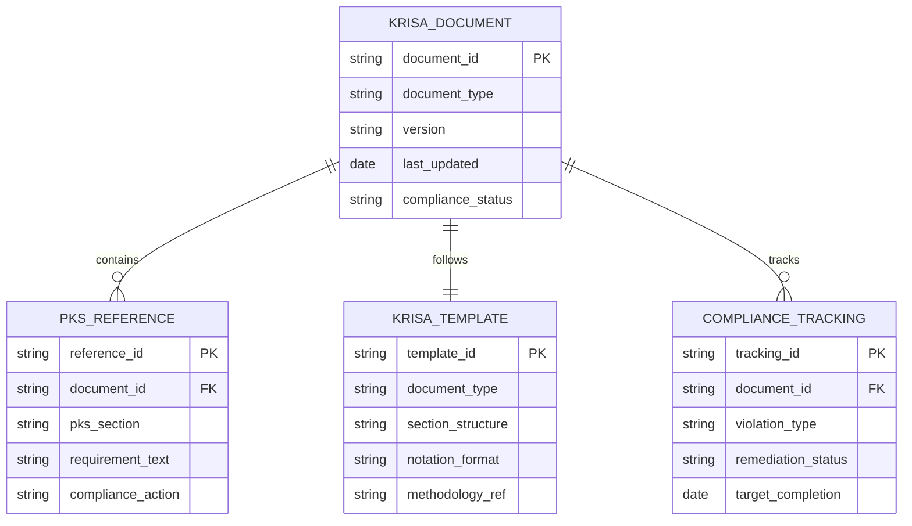
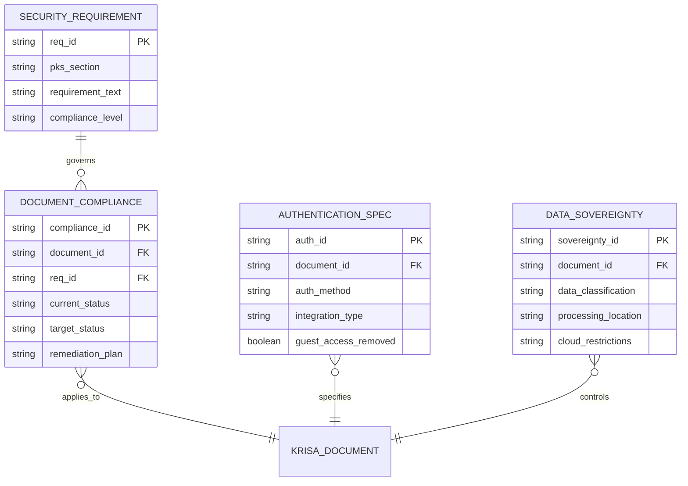

# Design Document

## Overview

This design document outlines the comprehensive approach to updating the entire KRISA ICTServe documentation suite (D01-D17) to achieve full compliance with MOTAC's Cyber Security Policy (PKS) and Strategic Digitalization Plan (PSPM). The design addresses critical security violations, KRISA formatting standards, and data sovereignty requirements across all documentation.

**Source Documents**: This design is based on the detailed requirements specified in `requirements.md` and derives compliance standards from the following authoritative sources:

- **Primary Policy Sources**:
  - `_reference/Polisi_PKS.md` - MOTAC Cyber Security Policy (PKS) containing sections 5.2.1, 9.2.1, 4.2, and 5.4.3
  - `_reference/Ringkasan_Eksekutif_PSPM.md` - MOTAC Strategic Digitalization Plan (PSPM) with MyGovCloud prioritization

- **KRISA Template Standards**:
  - `docs/KRISA/OFFICIAL-TEMPLATE-AND-SAMPLES/D01_TEMPLATE_PELAN_PEMBANGUNAN_SISTEM_PPS.md`
  - `docs/KRISA/OFFICIAL-TEMPLATE-AND-SAMPLES/D02_TEMPLATE_SPESIFIKASI_KEPERLUAN_BISNES_BRS.md`
  - `docs/KRISA/OFFICIAL-TEMPLATE-AND-SAMPLES/D03_TEMPLATE_SPESIFIKASI_KEPERLUAN_SISTEM_SRS.md`
  - `docs/KRISA/OFFICIAL-TEMPLATE-AND-SAMPLES/D04_TEMPLATE_SPESIFIKASI_REKABENTUK_SISTEM_SDS.md`
  - `docs/KRISA/OFFICIAL-TEMPLATE-AND-SAMPLES/D05_TEMPLATE_PELAN_MIGRASI_DATA.md`
  - `docs/KRISA/OFFICIAL-TEMPLATE-AND-SAMPLES/D06_TEMPLATE_SPESIFIKASI_MIGRASI_DATA.md`
  - `docs/KRISA/OFFICIAL-TEMPLATE-AND-SAMPLES/D07_TEMPLATE_PELAN_INTEGRASI_SISTEM.md`
  - `docs/KRISA/OFFICIAL-TEMPLATE-AND-SAMPLES/D08_TEMPLATE_SPESIFIKASI_INTEGRASI_DATA.md`
  - `docs/KRISA/OFFICIAL-TEMPLATE-AND-SAMPLES/D09_TEMPLATE_DOKUMENTASI_PANGKALAN_DATA.md`
  - `docs/KRISA/OFFICIAL-TEMPLATE-AND-SAMPLES/D10_TEMPLATE_DOKUMENTASI_KOD_SUMBER.md`
  - `docs/KRISA/OFFICIAL-TEMPLATE-AND-SAMPLES/D15_TEMPLATE_LAPORAN_MIGRASI_DATA.md`
  - `docs/KRISA/OFFICIAL-TEMPLATE-AND-SAMPLES/D17_TEMPLATE_MANUAL_PENGGUNA_SISTEM.md`

**Requirements Traceability**: All design decisions trace back to the 11 requirements and 55 acceptance criteria documented in `requirements.md`, which were derived from comprehensive compliance analysis against PKS and PSPM policies.

The solution transforms the current "True Hybrid" architecture with anonymous guest access into a fully authenticated, intranet-compliant system that maintains usability while ensuring complete traceability and accountability per PKS 5.2.1 requirements.

## Architecture

### Current State Analysis

The existing KRISA documentation suite contains multiple compliance violations as identified in `requirements.md`:

1. **PKS 5.2.1 Violation**: Anonymous "Guest" access documented across D02, D03, D04, and D17 violates accountability principles as defined in `_reference/Polisi_PKS.md`
2. **PKS 9.2.1 & 4.2 Risk**: AWS Bedrock cloud AI integration creates data sovereignty risks per PKS data transfer procedures
3. **KRISA Standard Gaps**: Missing standard notation tables, CRUD indicators, and methodology references as required by official KRISA templates in `docs/KRISA/OFFICIAL-TEMPLATE-AND-SAMPLES/`
4. **Template Non-compliance**: Documents don't follow official KRISA template structure defined in the template markdown files
5. **PSPM Non-alignment**: Documents don't reflect MyGovCloud prioritization as specified in `_reference/Ringkasan_Eksekutif_PSPM.md`

### Target Architecture

The compliance update implements a three-tier approach:

## Components and Interfaces

### Documentation Update Components

#### 1. Security Compliance Module

- **PKS Policy Integration**: Updates all documents to reference specific PKS sections (5.2.1, 9.2.1, 4.2, 5.4.3) as defined in `_reference/Polisi_PKS.md`
- **Authentication Redesign**: Replaces "Guest Mode" with "Walk-in/Kiosk Mode using SSO" per PKS 5.2.1 accountability requirements
- **Data Sovereignty Controls**: Implements local-first processing with cloud fallback per PSPM MyGovCloud prioritization from `_reference/Ringkasan_Eksekutif_PSPM.md`

#### 2. KRISA Standards Module

- **Template Compliance**: Ensures all documents follow official KRISA template structure from `docs/KRISA/OFFICIAL-TEMPLATE-AND-SAMPLES/` directory
- **Notation Standardization**: Implements proper KRISA notation (BF-ICT-XX-YY format) as specified in D02 and D03 templates
- **Methodology References**: Adds proper references to KRISA methodologies ([F1.3], [F2.2], [F2.1], [F2.3]) per template requirements

#### 3. Process Documentation Module

- **Workflow Updates**: Modifies all process flows to show mandatory SSO authentication
- **Integration Specifications**: Documents HRMIS/LDAP integration requirements
- **Audit Requirements**: Specifies dual audit system with 7-year retention

### Interface Specifications

#### Document Cross-References

- **D01 ↔ D02-D17**: Development plan references all subsequent documents
- **D02 ↔ D03**: BRS requirements traced to SRS specifications
- **D04 ↔ D09**: Design specifications linked to database documentation
- **D17 ↔ All**: User manuals reflect all system changes

#### Compliance Interfaces

- **PKS Policy Interface**: All documents reference PKS sections consistently per `_reference/Polisi_PKS.md` requirements
- **PSPM Strategy Interface**: Documents align with MyGovCloud prioritization from `_reference/Ringkasan_Eksekutif_PSPM.md`
- **KRISA Template Interface**: All documents follow identical structure and formatting per official templates in `docs/KRISA/OFFICIAL-TEMPLATE-AND-SAMPLES/`

## Data Models

### Document Structure Model

### Security Compliance Model

## Error Handling

### Compliance Validation Errors

1. **PKS Reference Errors**
   - Missing PKS section references
   - Incorrect policy citations
   - Outdated security requirements

2. **KRISA Template Errors**
   - Non-compliant section structure
   - Missing methodology references
   - Incorrect notation format

3. **Cross-Reference Errors**
   - Broken document links
   - Inconsistent version references
   - Missing traceability

### Remediation Strategies

- **Automated Validation**: Scripts to check PKS references and KRISA template compliance
- **Cross-Reference Verification**: Tools to validate document interconnections
- **Version Control**: Systematic approach to maintain document consistency

## Testing Strategy

### Dual Testing Approach

The testing strategy employs both unit testing and property-based testing to ensure comprehensive coverage:

**Unit Tests**: Focus on specific compliance requirements, template formatting, and cross-reference validation
**Property Tests**: Verify universal properties across all documents such as consistent PKS referencing and KRISA template adherence

### Unit Testing Focus Areas

1. **Template Compliance Testing**
   - Verify section structure matches KRISA templates
   - Validate required headers and metadata
   - Check methodology reference format

2. **Security Compliance Testing**
   - Confirm PKS section references are accurate
   - Validate authentication requirement documentation
   - Test data sovereignty specifications

3. **Cross-Reference Testing**
   - Verify document interconnections
   - Test version consistency
   - Validate traceability links

### Property-Based Testing Configuration

Using a property-based testing framework with minimum 100 iterations per property test. Each property test references its corresponding design document property and uses the tag format: **Feature: krisa-ppsm-pks-compliance-update, Property {number}: {property_text}**

## Correctness Properties

Based on analysis of the 11 requirements and their 55 acceptance criteria, the following correctness properties must hold across all KRISA documents (D01-D17):

### Property 1: Authentication Elimination Property
**Feature: krisa-ppsm-pks-compliance-update, Property 1: No document contains "Guest" access references**

For all documents D ∈ {D01, D02, D03, D04, D05, D06, D07, D08, D09, D10, D15, D17}:

- Document D SHALL NOT contain the terms "Guest Mode", "Guest Access", or "Anonymous User"
- Document D SHALL contain "Walk-in/Kiosk Mode using SSO authentication" where user access is described
- Document D SHALL specify mandatory LDAP/Active Directory integration for all user interactions

*Derived from Requirements 1, 4, 5, 8 acceptance criteria requiring elimination of anonymous access*

### Property 2: PKS Reference Completeness Property
**Feature: krisa-ppsm-pks-compliance-update, Property 2: All documents reference required PKS sections with specific citations**

For all documents D ∈ {D01, D02, D03, D04, D05, D06, D07, D08, D09, D10, D15, D17}:

- Document D SHALL reference PKS 5.2.1 when describing authentication requirements
- Document D SHALL reference PKS 9.2.1 and 4.2 when describing data transfer or cloud integration
- Document D SHALL reference PKS 5.4.3 when describing password policy requirements
- Document D SHALL include these references in section viii "Sumber Rujukan" with page numbers

*Derived from Requirements 1, 2, 4, 7, 10 acceptance criteria requiring specific PKS policy citations*

### Property 3: KRISA Template Structure Property
**Feature: krisa-ppsm-pks-compliance-update, Property 3: All documents follow official KRISA template structure exactly**

For all documents D ∈ {D01, D02, D03, D04, D05, D06, D07, D08, D09, D10, D15, D17}:

- Document D SHALL contain sections: i. Keterangan Dokumen, ii. Semakan dan Pengesahan, iii. Kawalan Dokumen, iv. Kandungan, v. Senarai Gambarajah, vi. Senarai Jadual, vii. Definisi dan Akronim, viii. Sumber Rujukan
- Document D SHALL include proper KRISA template headers with NAMA AGENSI (BPM), NAMA AGENSI INDUK (MOTAC), TARIKH DOKUMEN, and VERSI DOKUMEN fields
- Document D SHALL follow the exact formatting and numbering scheme from official KRISA templates

*Derived from Requirements 3, 11 acceptance criteria requiring strict template compliance*

### Property 4: Data Sovereignty Classification Property
**Feature: krisa-ppsm-pks-compliance-update, Property 4: All cloud AI usage includes proper data classification and local-first processing**

For all documents D ∈ {D02, D03, D04, D08, D18} that describe AI integration:

- Document D SHALL specify "Local Ollama processing prioritized for sensitive data per PSPM MyGovCloud preference"
- Document D SHALL document "Data Loss Prevention (DLP) filters to mask Official Secrets before cloud processing"
- Document D SHALL classify data as "Local: Sensitive, Cloud: Public only" with explicit routing rules
- Document D SHALL state "Only non-sensitive, public data can be sent to AWS Bedrock"

*Derived from Requirements 2, 6 acceptance criteria requiring data sovereignty compliance*

### Property 5: Cross-Document Version Consistency Property
**Feature: krisa-ppsm-pks-compliance-update, Property 5: All related documents have consistent version references and change tracking**

For all documents D ∈ {D01, D02, D03, D04, D05, D06, D07, D08, D09, D10, D15, D17}:

- Document D SHALL increment versions following KRISA guidelines (major changes: increment major version, minor changes: increment decimal)
- Document D SHALL include detailed change logs in section iii "Kawalan Dokumen" explaining PKS/PSPM compliance updates
- Document D SHALL maintain traceability to complete D01-D17 documentation series with consistent cross-references
- Document D SHALL require approval from CDO and BPM Director with compliance officer sign-off

*Derived from Requirements 10 acceptance criteria requiring proper version control and change tracking*

### Property 6: Methodology Reference Property
**Feature: krisa-ppsm-pks-compliance-update, Property 6: All documents include proper KRISA methodology references in correct format**

For documents requiring methodology references:

- D02 (BRS) SHALL reference "Pemodelan Fungsi Bisnes [F1.3]" for business function modeling
- D03 (SRS) SHALL reference "Pemodelan Fungsi Sistem [F2.2]", "Pemodelan Use Case [F2.1]", and "Pemodelan Keperluan Data [F2.3]"
- D02 and D03 SHALL use KRISA notation format "BF-ICT-XX-YY" for business functions
- D09 (Database) SHALL include CRUD indicators (C), (R), (U), (D) next to each data field
- All documents SHALL replace "Syarat Pasca" with "Aktiviti Sebelum" and "Aktiviti Selepas" table fields

*Derived from Requirements 3, 11 acceptance criteria requiring KRISA methodology compliance*

### Property 7: Audit Trail Specification Property
**Feature: krisa-ppsm-pks-compliance-update, Property 7: All documents specify complete audit requirements with 7-year retention**

For all documents D ∈ {D01, D02, D03, D04, D05, D06, D07, D08, D09, D10, D15, D17}:

- Document D SHALL specify "dual audit system with 7-year retention per PKS compliance standards"
- Document D SHALL link all system activities to authenticated staff ID for accountability
- Document D SHALL specify audit trail requirements that track all data sent to external cloud services
- Document D SHALL include explicit PDPA 2010 compliance measures and data classification procedures

*Derived from Requirements 1, 6, 7 acceptance criteria requiring comprehensive audit capabilities*

### Property 8: Intranet Deployment Declaration Property
**Feature: krisa-ppsm-pks-compliance-update, Property 8: All documents explicitly state intranet-only deployment with mandatory authentication**

For all documents D ∈ {D01, D02, D03, D04, D05, D06, D07, D08, D09, D10, D15, D17}:

- Document D SHALL explicitly state "Intranet-only deployment with mandatory authentication"
- Document D SHALL specify "Sistem ini akan dihoskan sepenuhnya di Pusat Data MOTAC (Intranet)"
- Document D SHALL document secure API gateway configuration that maintains intranet air-gap policies
- Document D SHALL reference PSPM prioritization of MyGovCloud over public cloud services

*Derived from Requirements 5, 6, 7 acceptance criteria requiring explicit intranet deployment documentation*

## References

### Primary Requirements Document

- `.kiro/specs/krisa-ppsm-pks-compliance-update/requirements.md` - Contains 11 detailed requirements with 55 acceptance criteria for KRISA documentation compliance

### Policy and Strategic Documents

- `_reference/Polisi_PKS.md` - MOTAC Cyber Security Policy (Polisi Keselamatan Siber)
  - Section 5.2.1: Accountability and Non-repudiation principles
  - Section 9.2.1: Data transfer procedures and confidentiality protection
  - Section 4.2: Data sovereignty and jurisdiction requirements
  - Section 5.4.3: Password policy requirements (8 chars, 90-day expiry, 3 attempts)

- `_reference/Ringkasan_Eksekutif_PSPM.md` - MOTAC Strategic Digitalization Plan (Pelan Strategik Pendigitalan MOTAC)
  - MyGovCloud prioritization over public cloud services
  - Strategic digitalization objectives and compliance requirements

### KRISA Official Templates and Standards

- `docs/KRISA/OFFICIAL-TEMPLATE-AND-SAMPLES/D01_TEMPLATE_PELAN_PEMBANGUNAN_SISTEM_PPS.md` - System Development Plan template
- `docs/KRISA/OFFICIAL-TEMPLATE-AND-SAMPLES/D02_TEMPLATE_SPESIFIKASI_KEPERLUAN_BISNES_BRS.md` - Business Requirements Specification template with "Pemodelan Fungsi Bisnes [F1.3]" methodology
- `docs/KRISA/OFFICIAL-TEMPLATE-AND-SAMPLES/D03_TEMPLATE_SPESIFIKASI_KEPERLUAN_SISTEM_SRS.md` - System Requirements Specification template with "Pemodelan Fungsi Sistem [F2.2]", "Pemodelan Use Case [F2.1]", and "Pemodelan Keperluan Data [F2.3]" methodologies
- `docs/KRISA/OFFICIAL-TEMPLATE-AND-SAMPLES/D04_TEMPLATE_SPESIFIKASI_REKABENTUK_SISTEM_SDS.md` - System Design Specification template
- `docs/KRISA/OFFICIAL-TEMPLATE-AND-SAMPLES/D05_TEMPLATE_PELAN_MIGRASI_DATA.md` - Data Migration Plan template
- `docs/KRISA/OFFICIAL-TEMPLATE-AND-SAMPLES/D06_TEMPLATE_SPESIFIKASI_MIGRASI_DATA.md` - Data Migration Specification template
- `docs/KRISA/OFFICIAL-TEMPLATE-AND-SAMPLES/D07_TEMPLATE_PELAN_INTEGRASI_SISTEM.md` - System Integration Plan template
- `docs/KRISA/OFFICIAL-TEMPLATE-AND-SAMPLES/D08_TEMPLATE_SPESIFIKASI_INTEGRASI_DATA.md` - Data Integration Specification template
- `docs/KRISA/OFFICIAL-TEMPLATE-AND-SAMPLES/D09_TEMPLATE_DOKUMENTASI_PANGKALAN_DATA.md` - Database Documentation template with CRUD indicators requirements
- `docs/KRISA/OFFICIAL-TEMPLATE-AND-SAMPLES/D10_TEMPLATE_DOKUMENTASI_KOD_SUMBER.md` - Source Code Documentation template
- `docs/KRISA/OFFICIAL-TEMPLATE-AND-SAMPLES/D15_TEMPLATE_LAPORAN_MIGRASI_DATA.md` - Data Migration Report template
- `docs/KRISA/OFFICIAL-TEMPLATE-AND-SAMPLES/D17_TEMPLATE_MANUAL_PENGGUNA_SISTEM.md` - User Manual template

### Target Documents for Compliance Update

- `docs/KRISA/D01_KRISA_ICTSERVE_PELAN_PEMBANGUNAN_SISTEM.md` - System Development Plan
- `docs/KRISA/D02_KRISA_ICTSERVE_SPESIFIKASI_KEPERLUAN_BISNES.md` - Business Requirements Specification
- `docs/KRISA/D03_KRISA_ICTSERVE_SPESIFIKASI_KEPERLUAN_SISTEM.md` - System Requirements Specification
- `docs/KRISA/D04_KRISA_ICTSERVE_SPESIFIKASI_REKABENTUK_SISTEM.md` - System Design Specification
- `docs/KRISA/D05_KRISA_ICTSERVE_PELAN_MIGRASI_DATA.md` - Data Migration Plan
- `docs/KRISA/D06_KRISA_ICTSERVE_SPESIFIKASI_MIGRASI_DATA.md` - Data Migration Specification
- `docs/KRISA/D07_KRISA_ICTSERVE_PELAN_INTEGRASI_SISTEM.md` - System Integration Plan
- `docs/KRISA/D08_KRISA_ICTSERVE_SPESIFIKASI_INTEGRASI_DATA.md` - Data Integration Specification
- `docs/KRISA/D09_KRISA_ICTSERVE_DOKUMENTASI_PANGKALAN_DATA.md` - Database Documentation
- `docs/KRISA/D10_KRISA_ICTSERVE_DOKUMENTASI_KOD_SUMBER.md` - Source Code Documentation
- `docs/KRISA/D15_KRISA_ICTSERVE_LAPORAN_MIGRASI_DATA.md` - Data Migration Report
- `docs/KRISA/D17_KRISA_ICTSERVE_MANUAL_PENGGUNA_SISTEM_ADMIN.md` - Admin User Manual
- `docs/KRISA/D17_KRISA_ICTSERVE_MANUAL_PENGGUNA_SISTEM.md` - User Manual
