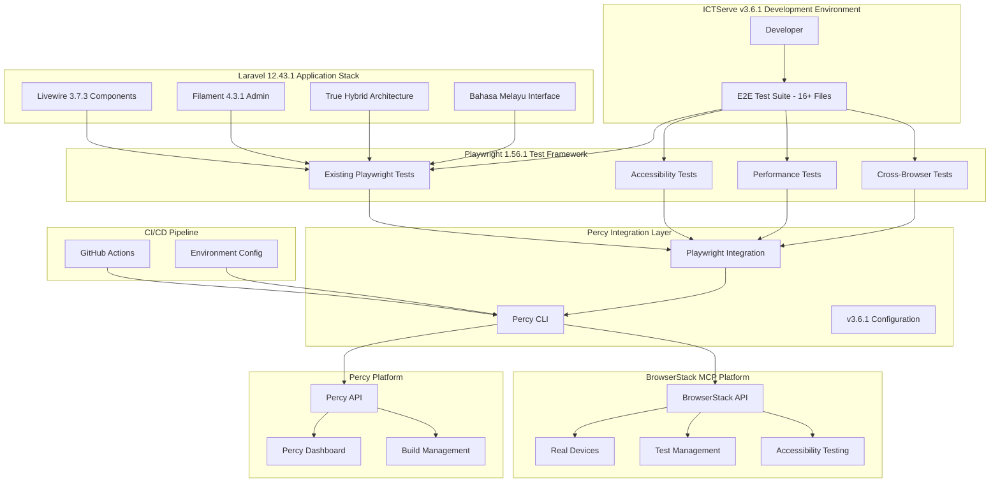

# Design Document: Percy Visual Testing Integration

## Overview

This design document outlines the integration of Percy visual testing platform with the ICTServe v3.6.1 Laravel application. The solution provides comprehensive visual regression testing capabilities for the existing Playwright 1.56.1 test framework, enabling automated detection of UI changes and visual regressions across different browsers and viewport sizes.

The integration leverages Percy's modern CLI-based architecture and supports both standalone Percy testing and Percy on Automate for enhanced cross-browser testing capabilities. The design aligns with ICTServe's True Hybrid Architecture, supporting both authenticated and guest user workflows, and integrates seamlessly with the existing comprehensive E2E test suite.

## Architecture

### High-Level Architecture



### Component Architecture

The Percy integration consists of several key components:

1. **Percy CLI**: Central orchestration tool that manages builds and snapshot uploads
2. **Playwright Integration**: `@percy/playwright` package for Playwright test integration
3. **Dusk Integration**: Custom Laravel package extending Dusk with Percy capabilities
4. **Configuration Management**: Environment-based configuration for different deployment contexts
5. **Build Management**: Automated build creation and finalization
6. **BrowserStack Integration**: Comprehensive cross-platform testing on real devices and browsers

## Components and Interfaces

### Percy CLI Component

**Purpose**: Central command-line interface for Percy operations
**Dependencies**: Node.js, npm, Percy API access

**Key Functions**:

- Build creation and management
- Snapshot upload and processing
- Configuration validation
- Environment detection

**Installation**:

```bash
npm install --save-dev @percy/cli
```

**Configuration**:

```javascript
// percy.config.js
module.exports = {
  version: 2,
  discovery: {
    allowedHostnames: ['localhost'],
    networkIdleTimeout: 100
  },
  snapshot: {
    widths: [375, 768, 1280, 1920],
    minHeight: 1024,
    percyCSS: `
      .dynamic-content { display: none !important; }
      .timestamp { visibility: hidden !important; }
    `
  }
};
```

### Playwright Integration Component

**Purpose**: Integrate Percy visual testing with existing Playwright 1.56.1 test suite
**Dependencies**: `@percy/playwright`, `@playwright/test`, existing E2E test infrastructure

**Key Functions**:

- Snapshot capture during existing Playwright tests
- Custom snapshot naming and configuration
- Integration with existing test workflows
- Support for ICTServe's True Hybrid Architecture testing

**Installation**:

```bash
npm install --save-dev @percy/playwright
```

**Interface**:

```typescript
import { percySnapshot } from '@percy/playwright';

// Basic snapshot for existing tests
await percySnapshot(page, 'Dashboard - Authenticated User');

// Advanced snapshot with v3.6.1 specific options
await percySnapshot(page, 'Helpdesk Form - Guest User', {
  widths: [375, 768, 1280, 1920],
  minHeight: 800,
  percyCSS: '.dynamic-timestamp { display: none; }',
  scope: '#main-content'
});

// Bahasa Melayu interface testing
await percySnapshot(page, 'Borang Helpdesk - Bahasa Melayu', {
  widths: [768, 1280],
  percyCSS: '.language-switcher { display: none; }'
});
```

### Existing Test Integration Component

**Purpose**: Integrate Percy visual testing with existing ICTServe v3.6.1 Playwright test suite
**Dependencies**: Existing Playwright tests, Percy CLI, `@percy/playwright`

**Key Functions**:

- Enhance existing responsive layout tests with visual validation
- Add visual snapshots to form testing workflows
- Replace basic screenshots with Percy visual comparisons
- Integrate visual testing with accessibility compliance verification
- Add cross-browser visual consistency testing
- Support True Hybrid Architecture testing (authenticated + guest workflows)
- Handle Bahasa Melayu interface visual validation

**Integration Strategy**:

```typescript
// Example: Enhanced dashboard test with Percy for v3.6.1
import { percySnapshot } from '@percy/playwright';
import { test, expect } from './fixtures/ictserve-fixtures';

test('01 - Mobile: Single column layout with Percy', async ({ authenticatedPage, staffDashboardPage }) => {
    await authenticatedPage.setViewportSize({ width: 375, height: 667 });
    await staffDashboardPage.goto();
    await staffDashboardPage.verifyDashboardLoaded();

    // Existing functionality validation
    const statsGrid = authenticatedPage.locator('[data-testid="dashboard-stats-grid"]');
    await expect.soft(statsGrid).toBeVisible();

    // Enhanced with Percy visual validation for v3.6.1
    await percySnapshot(authenticatedPage, 'Dashboard Mobile Layout - v3.6.1', {
        widths: [375],
        minHeight: 667,
        percyCSS: `
            .dynamic-timestamp { display: none !important; }
            .language-switcher { display: none !important; }
        `
    });
});

// Example: Hybrid Architecture testing
test('Guest vs Authenticated User Visual Comparison', async ({ page }) => {
    // Test guest workflow
    await page.goto('/helpdesk');
    await percySnapshot(page, 'Helpdesk Form - Guest User', {
        widths: [768, 1280],
        percyCSS: '.dynamic-content { display: none !important; }'
    });
    
    // Test authenticated workflow (if applicable)
    // Implementation would depend on authentication state
});
```

**Test Enhancement Patterns**:

- **Responsive Tests**: Add Percy snapshots at different viewport sizes
- **Form Tests**: Capture visual states before/after form interactions
- **Flow Tests**: Add visual checkpoints at key user journey steps
- **Accessibility Tests**: Combine axe-core with Percy visual compliance
- **Cross-browser Tests**: Add Percy visual consistency validation
- **Hybrid Architecture Tests**: Test both guest and authenticated user interfaces
- **Bahasa Melayu Tests**: Validate Bahasa Melayu interface consistency

**Existing Test Files to Enhance**:

- `dashboard.spec.ts`: Responsive layout testing with visual validation
- `helpdesk.spec.ts`: Form testing with visual state capture
- `loan-module.spec.ts`: Application flow testing with visual checkpoints
- `loan.spec.ts`: Loan processing workflow visual validation
- `guest-flow-screenshots.spec.ts`: Replace basic screenshots with Percy comparisons
- `accessibility.comprehensive.spec.ts`: Visual compliance verification
- `accessibility.interactions.spec.ts`: Interactive accessibility visual testing
- `guest-landing-accessibility.spec.ts`: Guest page visual compliance validation
- `cross-browser.spec.ts`: Visual consistency across browsers
- `staff-flow.spec.ts`: Complete user journey visual validation
- `branding-smoke.spec.ts`: Brand consistency visual validation
- `ollama-accessibility.spec.ts`: AI component visual accessibility testing
- `devtools.integration.spec.ts`: Development tools visual validation
- `filament.components.debug.spec.ts`: Admin component visual testing
- `helpdesk-performance.spec.ts`: Performance testing with visual validation
- `loan-module-performance.spec.ts`: Loan module performance visual testing

### Laravel Configuration Component

**Purpose**: Manage Percy configuration within Laravel 12.43.1 application structure
**Dependencies**: Environment variables, Laravel configuration system

**Environment Variables**:

```bash
# Required
PERCY_TOKEN=your_percy_token_here

# Optional - v3.6.1 specific
PERCY_BRANCH=main
PERCY_TARGET_BRANCH=main
PERCY_PARALLEL_NONCE=build_identifier
PERCY_PARALLEL_TOTAL=4
PERCY_PROJECT=ictserve-v3.6.1-visual-testing
```

**Laravel Configuration**:

```php
// config/percy.php - Laravel 12.43.1 compatible
return [
    'token' => env('PERCY_TOKEN'),
    'project' => env('PERCY_PROJECT', 'ictserve-v3.6.1-visual-testing'),
    'enabled' => env('PERCY_ENABLED', true),
    'widths' => [375, 768, 1024, 1280, 1920],
    'min_height' => 1024,
    'css' => [
        '.dynamic-timestamp { display: none !important; }',
        '.loading-spinner { visibility: hidden !important; }',
        '.language-switcher { display: none !important; }', // v3.6.0+ Bahasa Melayu only
    ],
    'hybrid_architecture' => [
        'guest_selectors' => ['.guest-form', '.guest-status'],
        'auth_selectors' => ['.dashboard', '.profile'],
        'admin_selectors' => ['.filament-admin', '.admin-panel'],
    ],
];
```

### Existing Test Integration Component

**Purpose**: Integrate Percy visual testing with existing ICTServe v3.6.1 Playwright test suite
**Dependencies**: Existing Playwright tests, Percy CLI, `@percy/playwright`

**Key Functions**:

- Enhance existing responsive layout tests with visual validation
- Add visual snapshots to form testing workflows
- Replace basic screenshots with Percy visual comparisons
- Integrate visual testing with accessibility compliance verification
- Add cross-browser visual consistency testing

**Integration Strategy**:

```typescript
// Example: Enhanced dashboard test with Percy
import { percySnapshot } from '@percy/playwright';
import { test, expect } from './fixtures/ictserve-fixtures';

test('01 - Mobile: Single column layout with Percy', async ({ authenticatedPage, staffDashboardPage }) => {
    await authenticatedPage.setViewportSize({ width: 375, height: 667 });
    await staffDashboardPage.goto();
    await staffDashboardPage.verifyDashboardLoaded();

    // Existing functionality validation
    const statsGrid = authenticatedPage.locator('[data-testid="dashboard-stats-grid"]');
    await expect.soft(statsGrid).toBeVisible();

    // Enhanced with Percy visual validation
    await percySnapshot(authenticatedPage, 'Dashboard Mobile Layout', {
        widths: [375],
        minHeight: 667,
        percyCSS: '.dynamic-timestamp { display: none !important; }'
    });
});
```

**Test Enhancement Patterns**:

- **Responsive Tests**: Add Percy snapshots at different viewport sizes
- **Form Tests**: Capture visual states before/after form interactions
- **Flow Tests**: Add visual checkpoints at key user journey steps
- **Accessibility Tests**: Combine axe-core with Percy visual compliance
- **Cross-browser Tests**: Add Percy visual consistency validation

**Existing Test Files to Enhance**:

- `dashboard.spec.ts`: Responsive layout testing with visual validation
- `helpdesk.spec.ts`: Form testing with visual state capture
- `loan-module.spec.ts`: Application flow testing with visual checkpoints
- `loan.spec.ts`: Loan processing workflow visual validation
- `guest-flow-screenshots.spec.ts`: Replace basic screenshots with Percy comparisons
- `accessibility.comprehensive.spec.ts`: Visual compliance verification
- `accessibility.interactions.spec.ts`: Interactive accessibility visual testing
- `guest-landing-accessibility.spec.ts`: Guest page visual compliance validation
- `cross-browser.spec.ts`: Visual consistency across browsers
- `staff-flow.spec.ts`: Complete user journey visual validation
- `branding-smoke.spec.ts`: Brand consistency visual validation
- `ollama-accessibility.spec.ts`: AI component visual accessibility testing
- `devtools.integration.spec.ts`: Development tools visual validation
- `filament.components.debug.spec.ts`: Admin component visual testing
- `helpdesk-performance.spec.ts`: Performance testing with visual validation
- `loan-module-performance.spec.ts`: Loan module performance visual testing

### BrowserStack Integration Component

**Purpose**: Integrate BrowserStack's comprehensive testing platform with Percy visual testing
**Dependencies**: BrowserStack MCP server, BrowserStack account, Percy CLI

**Key Functions**:

- Cross-browser and cross-device visual testing on real infrastructure
- Test case management and organization through BrowserStack Test Management
- Accessibility compliance scanning alongside Percy visual validation
- Live session debugging for visual issues
- Comprehensive failure analysis and reporting

**Installation**:

```bash
# BrowserStack MCP server is already configured in mcp.json
# Requires BrowserStack account and credentials
```

**Environment Variables**:

```bash
# Required for BrowserStack integration
BROWSERSTACK_USERNAME=your_browserstack_username
BROWSERSTACK_ACCESS_KEY=your_browserstack_access_key

# Optional BrowserStack configuration
BROWSERSTACK_PROJECT=ictserve-visual-testing
BROWSERSTACK_BUILD=percy-integration-build
```

**Integration Strategy**:

```typescript
// Example: Enhanced cross-browser visual testing with BrowserStack
import { percySnapshot } from '@percy/playwright';
import { test, expect } from './fixtures/ictserve-fixtures';

test('Cross-browser visual consistency with BrowserStack', async ({ page }) => {
    // Navigate to page
    await page.goto('/dashboard');
    
    // Capture Percy snapshot
    await percySnapshot(page, 'Dashboard Cross-Browser', {
        widths: [1280, 1920],
        minHeight: 800
    });
    
    // Use BrowserStack for additional cross-browser validation
    // This would be handled through BrowserStack MCP integration
    // allowing natural language commands like:
    // "Run this test on Chrome, Firefox, and Safari on different OS versions"
});
```

**BrowserStack MCP Tools Integration**:

- **Test Management**: Create and organize Percy visual test cases
- **Cross-Browser Testing**: Execute Percy tests across multiple browsers
- **Real Device Testing**: Run Percy visual tests on actual mobile devices
- **Accessibility Testing**: Combine WCAG scanning with Percy visual validation
- **Live Sessions**: Debug visual issues in real-time
- **Failure Analysis**: Comprehensive debugging for visual test failures

## Data Models

### Percy Build Model

```typescript
interface PercyBuild {
  id: string;
  number: number;
  state: 'pending' | 'processing' | 'finished' | 'failed';
  branch: string;
  commitSha: string;
  totalSnapshots: number;
  totalComparisons: number;
  createdAt: Date;
  finishedAt?: Date;
  webUrl: string;
  // v3.6.1 specific fields
  projectName: string;
  buildName: string;
  environment: 'development' | 'staging' | 'production';
  hybridArchitecture: {
    guestSnapshots: number;
    authenticatedSnapshots: number;
    adminSnapshots: number;
  };
}
```

### Snapshot Configuration Model

```typescript
interface SnapshotConfig {
  name: string;
  widths?: number[];
  minHeight?: number;
  percyCSS?: string;
  scope?: string;
  enableJavaScript?: boolean;
  ignoreRegions?: Array<{
    selector: string;
    type: 'ignore' | 'consider';
  }>;
  // v3.6.1 specific configuration
  hybridArchitecture?: {
    userType: 'guest' | 'authenticated' | 'admin';
    userRole?: 'staff' | 'admin' | 'superuser';
  };
  bahasaMelayuInterface?: {
    validateLanguage: boolean;
    excludeLanguageSwitcher: boolean;
  };
  wcagCompliance?: {
    level: 'AA' | 'AAA';
    validateContrast: boolean;
    validateFocusIndicators: boolean;
  };
}
```

### BrowserStack Integration Model

```typescript
interface BrowserStackConfig {
  username: string;
  accessKey: string;
  project: string;
  build: string;
  devices: Array<{
    platform: 'windows' | 'macos' | 'android' | 'ios';
    browser?: string;
    browserVersion?: string;
    deviceName?: string;
    osVersion: string;
  }>;
  testManagement: {
    projectId?: string;
    folderId?: string;
    enabled: boolean;
  };
  // v3.6.1 specific configuration
  accessibilityTesting: {
    enabled: boolean;
    wcagLevel: 'AA' | 'AAA';
    scanTypes: Array<'automated' | 'manual' | 'expert'>;
  };
  visualTesting: {
    percyIntegration: boolean;
    crossBrowserBaseline: boolean;
    deviceSpecificBaselines: boolean;
  };
}
```

### Test Execution Model

```typescript
interface TestExecution {
  percyBuildId: string;
  browserStackSessionId?: string;
  testCaseId?: string;
  device: {
    platform: string;
    browser: string;
    version: string;
  };
  snapshots: SnapshotConfig[];
  status: 'pending' | 'running' | 'completed' | 'failed';
  results: {
    percy: PercyBuild;
    browserStack?: {
      sessionUrl: string;
      logs: string[];
      screenshots: string[];
      accessibilityResults?: {
        wcagLevel: string;
        violations: number;
        passes: number;
        reportUrl: string;
      };
    };
  };
  // v3.6.1 specific execution data
  ictserveContext: {
    testSuite: 'e2e' | 'accessibility' | 'performance' | 'cross-browser';
    applicationVersion: string;
    technologyStack: {
      laravel: string;
      livewire: string;
      filament: string;
      playwright: string;
      tailwind: string;
    };
    hybridArchitectureTest: {
      guestWorkflow: boolean;
      authenticatedWorkflow: boolean;
      adminWorkflow: boolean;
    };
  };
}
```

### ICTServe v3.6.1 Integration Model

```typescript
interface ICTServeIntegration {
  applicationVersion: '3.6.1';
  technologyStack: {
    laravel: '12.43.1';
    livewire: '3.7.3';
    filament: '4.3.1';
    playwright: '1.56.1';
    tailwind: '4.1.18';
    phpunit: '11.5.46';
  };
  testSuiteIntegration: {
    existingTests: Array<{
      fileName: string;
      testType: 'responsive' | 'accessibility' | 'performance' | 'cross-browser' | 'flow';
      percyEnhanced: boolean;
      errorStatus: 'validated' | 'errors_found' | 'fixed' | 'pending';
    }>;
    totalTestFiles: number;
    percyIntegratedFiles: number;
  };
  hybridArchitecture: {
    guestUserSupport: boolean;
    authenticatedUserSupport: boolean;
    adminPanelSupport: boolean;
    nullableUserIdFK: boolean;
  };
  bahasaMelayuInterface: {
    exclusiveLanguage: boolean;
    languageSwitcherDisabled: boolean;
    interfaceVersion: '3.6.0+';
  };
  wcagCompliance: {
    level: 'AA';
    version: '2.2';
    validationRequired: boolean;
  };
}
```

## Correctness Properties

*A property is a characteristic or behavior that should hold true across all valid executions of a system-essentially, a formal statement about what the system should do. Properties serve as the bridge between human-readable specifications and machine-verifiable correctness guarantees.*

### Property Reflection

After analyzing all acceptance criteria from the updated v3.6.1 requirements, several properties can be consolidated to eliminate redundancy while maintaining comprehensive coverage:

- **Authentication properties** (1.2, 4.1, 8.3) can be combined into a comprehensive authentication validation property
- **Error handling properties** (1.4, 4.3, 8.4) can be consolidated into a unified error messaging property
- **Integration properties** (2.4, 3.4) can be combined since both frameworks require the same backward compatibility guarantees
- **Snapshot capture properties** (2.1, 3.1) can be unified as they test the same core functionality across frameworks
- **Disable/skip properties** (2.5, 3.5) can be consolidated as they test the same graceful degradation behavior
- **Build lifecycle properties** (6.1, 6.2, 6.5) can be combined into a comprehensive build management property

### Correctness Properties

Property 1: **Percy Authentication and Token Validation**
*For any* Percy token configuration, the Visual Testing System should correctly validate authentic tokens, reject invalid tokens, and provide clear error messages with resolution steps when authentication fails
**Validates: Requirements 1.2, 4.1, 8.3**

Property 2: **Configuration Validation and Error Reporting**
*For any* Percy configuration scenario (missing, invalid, or incomplete), the Visual Testing System should provide helpful error messages with specific guidance for resolving configuration issues
**Validates: Requirements 1.4, 4.3, 8.4**

Property 3: **Playwright Integration Compatibility**
*For any* existing Playwright 1.56.1 test in the ICTServe v3.6.1 test suite, integrating Percy visual testing should not break existing test functionality and should maintain backward compatibility
**Validates: Requirements 2.4**

Property 4: **Universal Snapshot Capture**
*For any* Playwright test with Percy enabled, the system should successfully capture visual snapshots during test execution
**Validates: Requirements 2.1**

Property 5: **Graceful Percy Degradation**
*For any* test execution with Percy disabled (via configuration or command-line options), tests should run normally without visual captures and without errors
**Validates: Requirements 2.5**

Property 6: **Snapshot Configuration Flexibility**
*For any* snapshot capture request, the system should support custom names, viewport widths, CSS injection, ignore regions, and both full-page and element-specific captures
**Validates: Requirements 2.2, 2.3, 5.1, 5.2, 5.3, 5.4**

Property 7: **Build Lifecycle Management**
*For any* Percy-enabled test run, the system should automatically create builds, upload all captured snapshots, and finalize builds with appropriate status reporting and review links
**Validates: Requirements 6.1, 6.2, 6.3, 6.5**

Property 8: **CI/CD Environment Support**
*For any* CI/CD execution environment, Percy integration should work correctly with appropriate tokens, provide clear exit codes, handle parallel execution, and report visual differences appropriately
**Validates: Requirements 7.1, 7.2, 7.3, 7.4, 7.5**

Property 9: **Service Failure Resilience**
*For any* Percy service failure or snapshot capture failure, the system should handle failures gracefully, continue test execution, provide detailed logging, and report failures appropriately
**Validates: Requirements 8.1, 8.2, 8.5**

Property 10: **Performance Optimization**
*For any* test execution with multiple snapshots, the system should capture snapshots efficiently, support asynchronous uploads, optimize network usage, and cache dependencies for improved performance
**Validates: Requirements 9.1, 9.2, 9.3, 9.5**

Property 11: **Environment-Specific Configuration**
*For any* deployment environment, the system should support environment-specific configuration files, allow disabling Percy for local development, and provide performance optimization options
**Validates: Requirements 4.2, 4.4, 4.5, 9.4**

Property 12: **Visual Comparison Accuracy**
*For any* Percy build, the system should support accurate base build selection and provide consistent snapshot timing to ensure reliable visual comparisons
**Validates: Requirements 5.5, 6.4**

Property 13: **ICTServe v3.6.1 Architecture Integration**
*For any* test execution within the ICTServe v3.6.1 system, Percy visual testing should correctly handle True Hybrid Architecture workflows (guest and authenticated users), Bahasa Melayu interface elements, and Laravel 12.43.1 + Livewire 3.7.3 + Filament 4.3.1 technology stack
**Validates: Requirements 3.1, 3.2, 3.3, 3.4, 3.5**

Property 14: **Existing Test Suite Integration**
*For any* existing Playwright test in the ICTServe v3.6.1 test suite (16+ test files), integrating Percy visual testing should enhance the test with visual validation while maintaining all existing functionality and assertions
**Validates: Requirements 10.1, 10.2, 10.3, 10.4, 10.5, 10.6, 10.7, 10.8, 10.9, 10.10, 10.11, 10.12, 10.13, 10.14, 10.15, 10.16, 10.17, 10.18**

Property 15: **Comprehensive Test Validation and Error Correction**
*For any* Playwright test file (existing or newly created), the system should systematically execute, validate, identify errors, apply fixes, and re-validate to ensure all tests are error-free and reliable before and after Percy integration
**Validates: Requirements 11.1, 11.2, 11.3, 11.4, 11.5, 11.6, 11.7, 11.8, 11.9, 11.10**

Property 16: **BrowserStack Cross-Platform Integration**
*For any* visual test execution, the system should support running Percy snapshots across multiple browsers, devices, and operating systems through BrowserStack's real device cloud while maintaining test management and reporting capabilities
**Validates: Requirements 12.1, 12.2, 12.3, 12.7, 12.9, 12.10**

Property 17: **Accessibility and Visual Compliance Integration**
*For any* accessibility testing requirement, the system should combine BrowserStack's WCAG 2.2 AA compliance scanning with Percy's visual validation to provide comprehensive accessibility and visual regression testing
**Validates: Requirements 12.4, 12.6**

Property 18: **Live Session Visual Debugging**
*For any* visual test failure or debugging requirement, the system should support BrowserStack Live sessions for real-time visual issue investigation and resolution alongside Percy visual comparisons
**Validates: Requirements 12.5, 12.6**

## Error Handling

### Error Categories

1. **Configuration Errors**
   - Missing or invalid Percy token
   - Malformed configuration files
   - Unsupported configuration options

2. **Network Errors**
   - Percy API unavailability
   - Snapshot upload failures
   - Timeout during build operations

3. **Integration Errors**
   - Test framework compatibility issues
   - Snapshot capture failures
   - Build creation failures

### Error Handling Strategy

```typescript
class PercyErrorHandler {
  handleConfigurationError(error: ConfigurationError): void {
    this.logger.error('Percy Configuration Error', {
      type: error.type,
      message: error.message,
      resolution: error.getResolutionSteps()
    });
    
    if (error.isCritical()) {
      throw new PercyCriticalError(error.message);
    }
  }
  
  handleNetworkError(error: NetworkError): void {
    this.logger.warn('Percy Network Error', {
      message: error.message,
      retryCount: error.retryCount,
      nextRetryIn: error.nextRetryDelay
    });
    
    if (error.shouldRetry()) {
      return this.retryOperation(error.operation);
    }
    
    this.gracefulDegradation();
  }
  
  private gracefulDegradation(): void {
    this.logger.info('Percy unavailable, continuing tests without visual captures');
    this.percyEnabled = false;
  }
}
```

### Error Recovery Mechanisms

1. **Automatic Retry**: Network operations with exponential backoff
2. **Graceful Degradation**: Continue tests when Percy is unavailable
3. **Configuration Validation**: Early validation with helpful error messages
4. **Fallback Modes**: Local-only mode when Percy services are down

## Testing Strategy

### Dual Testing Approach

The Percy visual testing integration will be validated through both unit tests and property-based tests:

**Unit Tests**: Focus on specific examples, edge cases, and error conditions

- Configuration parsing with various input formats
- Error message formatting and content validation
- Integration points between Playwright 1.56.1 and Percy
- Specific failure scenarios and recovery mechanisms
- ICTServe v3.6.1 specific scenarios (True Hybrid Architecture, Bahasa Melayu interface)

**Property-Based Tests**: Verify universal properties across all inputs

- Authentication validation across all possible token formats
- Configuration handling across all valid and invalid scenarios
- Snapshot capture behavior across different test contexts
- Performance characteristics across various load conditions
- Cross-browser visual consistency across BrowserStack devices

### Property-Based Testing Configuration

Each correctness property will be implemented as a property-based test using the appropriate testing framework:

- **Minimum 100 iterations** per property test to ensure comprehensive input coverage
- **Test tagging** format: `Feature: percy-visual-testing-integration, Property {number}: {property_text}`
- **Framework selection**: Jest with fast-check for JavaScript/TypeScript properties, PHPUnit with Eris for PHP properties

### Testing Framework Integration

**Playwright Property Tests**:

```typescript
import fc from 'fast-check';
import { test, expect } from '@playwright/test';

test('Feature: percy-visual-testing-integration, Property 4: Universal Snapshot Capture', async () => {
  await fc.assert(fc.asyncProperty(
    fc.record({
      url: fc.webUrl(),
      snapshotName: fc.string({ minLength: 1, maxLength: 100 }),
      options: fc.record({
        widths: fc.array(fc.integer({ min: 320, max: 1920 })),
        minHeight: fc.integer({ min: 400, max: 2000 }),
        // v3.6.1 specific options
        hybridArchitecture: fc.record({
          userType: fc.constantFrom('guest', 'authenticated', 'admin'),
          userRole: fc.option(fc.constantFrom('staff', 'admin', 'superuser'))
        }),
        bahasaMelayuInterface: fc.record({
          validateLanguage: fc.boolean(),
          excludeLanguageSwitcher: fc.boolean()
        })
      })
    }),
    async ({ url, snapshotName, options }) => {
      // Property test implementation for v3.6.1
      const result = await captureSnapshot(url, snapshotName, options);
      expect(result.success).toBe(true);
      expect(result.snapshotId).toBeDefined();
      
      // Validate v3.6.1 specific requirements
      if (options.bahasaMelayuInterface?.validateLanguage) {
        expect(result.languageValidation).toBe('ms');
      }
      if (options.hybridArchitecture?.userType) {
        expect(result.userContext).toBe(options.hybridArchitecture.userType);
      }
    }
  ), { numRuns: 100 });
});
```

**Laravel/PHP Property Tests**:

```php
use Tests\TestCase;
use Eris\Generator;

class PercyConfigurationPropertyTest extends TestCase
{
    /**
     * Feature: percy-visual-testing-integration, Property 2: Configuration Validation and Error Reporting
     */
    public function testConfigurationValidationProperty(): void
    {
        $this->forAll(
            Generator::associative([
                'token' => Generator::oneOf(
                    Generator::string(),
                    Generator::constant(null),
                    Generator::constant('')
                ),
                'project' => Generator::string(),
                'enabled' => Generator::bool(),
                // v3.6.1 specific configuration
                'ictserve_version' => Generator::constant('3.6.1'),
                'technology_stack' => Generator::associative([
                    'laravel' => Generator::constant('12.43.1'),
                    'livewire' => Generator::constant('3.7.3'),
                    'filament' => Generator::constant('4.3.1'),
                    'playwright' => Generator::constant('1.56.1')
                ]),
                'hybrid_architecture' => Generator::associative([
                    'guest_support' => Generator::bool(),
                    'authenticated_support' => Generator::bool(),
                    'admin_support' => Generator::bool()
                ])
            ])
        )->then(function ($config) {
            $validator = new PercyConfigurationValidator();
            $result = $validator->validate($config);
            
            if ($result->isValid()) {
                $this->assertNotEmpty($result->getValidatedConfig());
                // Validate v3.6.1 specific requirements
                $this->assertEquals('3.6.1', $result->getValidatedConfig()['ictserve_version']);
                $this->assertArrayHasKey('hybrid_architecture', $result->getValidatedConfig());
            } else {
                $this->assertNotEmpty($result->getErrorMessages());
                $this->assertTrue($result->hasResolutionSteps());
                // Ensure error messages are in Bahasa Melayu for v3.6.0+
                foreach ($result->getErrorMessages() as $message) {
                    $this->assertStringNotContainsString('English', $message);
                }
            }
        });
    }
}
```

### Integration Testing Strategy

1. **End-to-End Tests**: Full workflow testing from test execution to Percy dashboard with v3.6.1 stack
2. **Cross-Browser Testing**: Validate Percy integration across different browsers using BrowserStack
3. **Environment Testing**: Test across development, staging, and CI environments with Laravel 12.43.1
4. **Performance Testing**: Measure impact on test execution times with Playwright 1.56.1
5. **Failure Simulation**: Test error handling and recovery mechanisms
6. **Hybrid Architecture Testing**: Test both guest and authenticated user workflows
7. **Bahasa Melayu Interface Testing**: Validate visual consistency for Bahasa Melayu UI elements
8. **WCAG 2.2 AA Compliance Testing**: Combine accessibility validation with visual regression testing

### BrowserStack Integration Testing

**Cross-Platform Visual Testing**:

```typescript
import { percySnapshot } from '@percy/playwright';
import { test, expect } from '@playwright/test';

test('Cross-platform visual consistency', async ({ page }) => {
  // Navigate to dashboard
  await page.goto('/dashboard');
  
  // Capture Percy snapshot for baseline
  await percySnapshot(page, 'Dashboard Baseline', {
    widths: [375, 768, 1280, 1920],
    minHeight: 800
  });
  
  // Use BrowserStack MCP for cross-browser validation
  // Natural language command: "Run this Percy test on Chrome, Firefox, Safari across Windows, macOS, and mobile devices"
});
```

**Accessibility and Visual Compliance**:

```typescript
test('Accessibility compliance with visual validation', async ({ page }) => {
  await page.goto('/accessibility-test-page');
  
  // Capture Percy snapshot
  await percySnapshot(page, 'Accessibility Compliance Page', {
    widths: [1280],
    minHeight: 800,
    percyCSS: '.dynamic-content { display: none !important; }'
  });
  
  // BrowserStack accessibility scan would be triggered via MCP
  // Natural language: "Run accessibility scan on this page and compare with Percy baseline"
});
```

**Performance Visual Testing**:

```typescript
test('Performance visual validation', async ({ page }) => {
  // Performance testing with visual validation
  await page.goto('/performance-critical-page');
  
  // Capture initial state
  await percySnapshot(page, 'Performance Page Initial', {
    widths: [1280],
    minHeight: 800
  });
  
  // Simulate load and capture final state
  await page.waitForLoadState('networkidle');
  await percySnapshot(page, 'Performance Page Loaded', {
    widths: [1280],
    minHeight: 800
  });
  
  // BrowserStack performance testing integration
  // Natural language: "Run performance tests on multiple devices and capture visual states"
});
```

### Continuous Integration Testing

```yaml
# .github/workflows/percy-visual-tests.yml
name: Percy Visual Tests with BrowserStack
on: [push, pull_request]

jobs:
  visual-tests:
    runs-on: ubuntu-latest
    steps:
      - uses: actions/checkout@v3
      - name: Setup Node.js
        uses: actions/setup-node@v3
        with:
          node-version: '18'
      - name: Install dependencies
        run: |
          npm ci
          composer install --no-dev --optimize-autoloader
      - name: Run Playwright tests with Percy and BrowserStack
        env:
          PERCY_TOKEN: ${{ secrets.PERCY_TOKEN }}
          PERCY_BRANCH: ${{ github.head_ref }}
          BROWSERSTACK_USERNAME: ${{ secrets.BROWSERSTACK_USERNAME }}
          BROWSERSTACK_ACCESS_KEY: ${{ secrets.BROWSERSTACK_ACCESS_KEY }}
        run: |
          npx percy exec -- npm run test:e2e
          # BrowserStack cross-browser testing would be triggered via MCP integration
      - name: Run Dusk tests with Percy
        env:
          PERCY_TOKEN: ${{ secrets.PERCY_TOKEN }}
          BROWSERSTACK_USERNAME: ${{ secrets.BROWSERSTACK_USERNAME }}
          BROWSERSTACK_ACCESS_KEY: ${{ secrets.BROWSERSTACK_ACCESS_KEY }}
        run: php artisan dusk --without-percy=false
```

This comprehensive testing strategy ensures that the Percy visual testing integration is thoroughly validated across all supported scenarios and maintains high reliability in production environments, enhanced with BrowserStack's comprehensive cross-platform testing capabilities.
