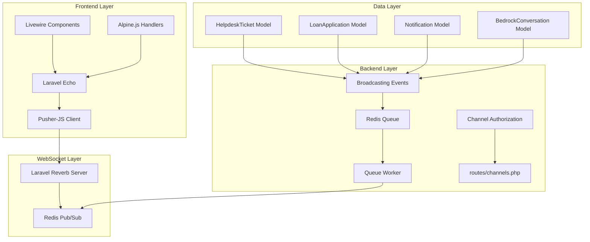
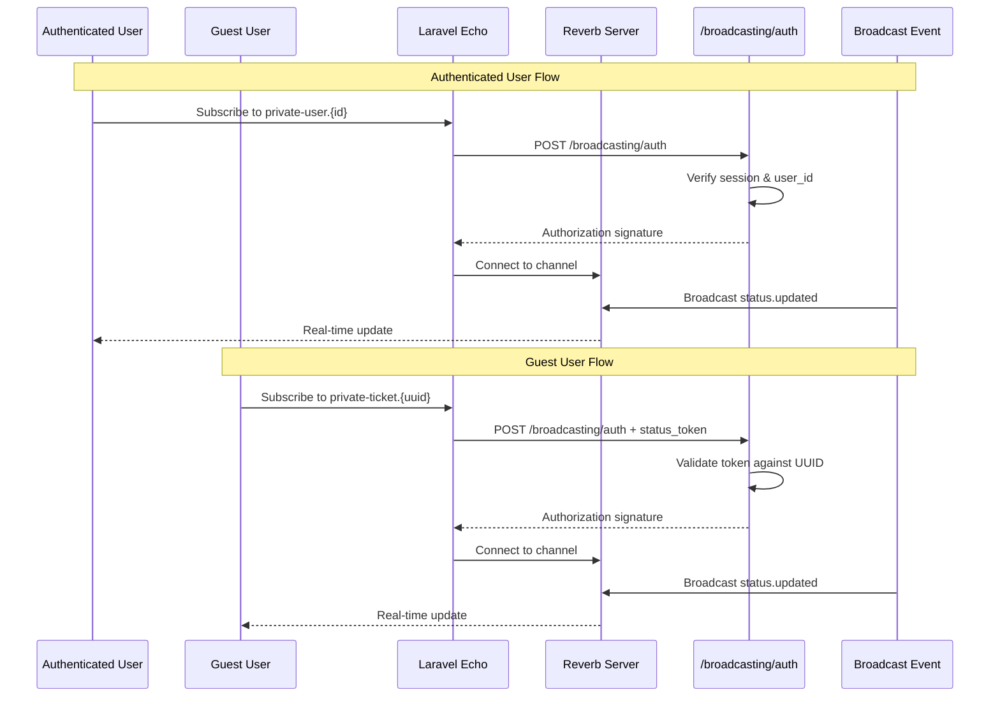

# Design Document: Real-time Notifications & Broadcasting

## Overview

This design document outlines the implementation of real-time notifications and broadcasting for ICTServe v3.6.0 using Laravel Reverb as the primary WebSocket server. The system enables instant delivery of status updates, notifications, and AI streaming responses to both authenticated users and guests through a dual-channel strategy.

The architecture follows the True Hybrid pattern established in D00, supporting:

- **Authenticated users**: Private channels via `private-user.{id}`
- **Guests**: UUID-based channels via `private-ticket.{uuid}` or `private-loan.{uuid}`
- **AI conversations**: Streaming channels via `private-conversation.{uuid}`

## Architecture

### High-Level Architecture



### Dual Channel Strategy



## Components and Interfaces

### 1. Broadcasting Events

| Event Class | Channel Pattern | Event Name | Payload |
|-------------|-----------------|------------|---------|
| `NotificationCreated` | `private-user.{id}` / `private-ticket.{uuid}` | `notification.created` | `{notification_id, type, message, created_at}` |
| `StatusUpdated` | `private-user.{id}` / `private-ticket.{uuid}` | `status.updated` | `{entity_type, entity_id, old_status, new_status, updated_at}` |
| `CommentPosted` | `private-user.{id}` / `private-submission.{type}.{id}` | `comment.posted` | `{comment_id, author, content, created_at}` |
| `AiStreamingStarted` | `private-user.{id}` / `private-conversation.{uuid}` | `ai.streaming.started` | `{conversation_id, model}` |
| `AiStreamingChunk` | `private-user.{id}` / `private-conversation.{uuid}` | `ai.streaming.chunk` | `{conversation_id, chunk, is_final}` |
| `AiStreamingCompleted` | `private-user.{id}` / `private-conversation.{uuid}` | `ai.streaming.completed` | `{conversation_id, total_tokens}` |
| `AiErrorOccurred` | `private-user.{id}` / `private-conversation.{uuid}` | `ai.error.occurred` | `{conversation_id, error, retry_available}` |

### 2. Channel Authorization

```php
// routes/channels.php

// Authenticated user channel
Broadcast::channel('user.{id}', function (User $user, int $id) {
    return $user->id === $id;
});

// Guest ticket channel (UUID-based with status token)
Broadcast::channel('ticket.{uuid}', function ($user, string $uuid) {
    if ($user) {
        // Authenticated user accessing their own ticket
        return HelpdeskTicket::where('uuid', $uuid)
            ->where('user_id', $user->id)
            ->exists();
    }
    
    // Guest with status token
    $token = request()->input('status_token');
    return HelpdeskTicket::where('uuid', $uuid)
        ->where('status_token', $token)
        ->exists();
});

// Guest loan channel
Broadcast::channel('loan.{uuid}', function ($user, string $uuid) {
    if ($user) {
        return LoanApplication::where('uuid', $uuid)
            ->where('user_id', $user->id)
            ->exists();
    }
    
    $token = request()->input('status_token');
    return LoanApplication::where('uuid', $uuid)
        ->where('status_token', $token)
        ->exists();
});

// AI conversation channel
Broadcast::channel('conversation.{uuid}', function ($user, string $uuid) {
    if ($user) {
        return BedrockConversation::where('uuid', $uuid)
            ->where('user_id', $user->id)
            ->exists();
    }
    
    $token = request()->input('status_token');
    return BedrockConversation::where('uuid', $uuid)
        ->where('session_token', $token)
        ->exists();
});
```

### 3. Event Base Class

```php
// app/Events/Concerns/BroadcastsToHybridChannels.php
trait BroadcastsToHybridChannels
{
    abstract protected function getAuthenticatedUserId(): ?int;
    abstract protected function getGuestChannelUuid(): ?string;
    abstract protected function getGuestChannelType(): string;

    public function broadcastOn(): array
    {
        $userId = $this->getAuthenticatedUserId();
        
        if ($userId) {
            return [new PrivateChannel('user.' . $userId)];
        }
        
        $uuid = $this->getGuestChannelUuid();
        $type = $this->getGuestChannelType();
        
        return [new PrivateChannel("{$type}.{$uuid}")];
    }
}
```

### 4. Frontend Echo Configuration

```javascript
// resources/js/echo.js
import Echo from 'laravel-echo';
import Pusher from 'pusher-js';

window.Pusher = Pusher;

export function initializeEcho() {
    const config = {
        broadcaster: 'reverb',
        key: import.meta.env.VITE_REVERB_APP_KEY,
        wsHost: import.meta.env.VITE_REVERB_HOST,
        wsPort: import.meta.env.VITE_REVERB_PORT ?? 80,
        wssPort: import.meta.env.VITE_REVERB_PORT ?? 443,
        forceTLS: (import.meta.env.VITE_REVERB_SCHEME ?? 'https') === 'https',
        enabledTransports: ['ws', 'wss'],
        disableStats: true,
    };

    window.Echo = new Echo(config);
    
    // Setup reconnection handling
    window.Echo.connector.pusher.connection.bind('disconnected', () => {
        console.warn('WebSocket disconnected, attempting reconnection...');
    });
    
    window.Echo.connector.pusher.connection.bind('connected', () => {
        console.log('WebSocket connected');
    });
    
    return window.Echo;
}
```

### 5. Livewire Integration Component

```php
// app/Livewire/Concerns/ListensForBroadcasts.php
trait ListensForBroadcasts
{
    public function getListeners(): array
    {
        $listeners = [];
        
        if (auth()->check()) {
            $userId = auth()->id();
            $listeners["echo-private:user.{$userId},.notification.created"] = 'handleNotification';
            $listeners["echo-private:user.{$userId},.status.updated"] = 'handleStatusUpdate';
        }
        
        return array_merge($listeners, $this->getAdditionalListeners());
    }
    
    protected function getAdditionalListeners(): array
    {
        return [];
    }
    
    public function handleNotification(array $event): void
    {
        $this->dispatch('notification-received', $event);
    }
    
    public function handleStatusUpdate(array $event): void
    {
        $this->dispatch('status-updated', $event);
    }
}
```

## Data Models

### Broadcasting Event Structure

```php
// Base event structure
interface BroadcastableEvent
{
    public function broadcastOn(): array;
    public function broadcastAs(): string;
    public function broadcastWith(): array;
}

// Event payload schemas
$notificationPayload = [
    'notification_id' => 'int',
    'type' => 'string',
    'message' => 'string',
    'data' => 'array',
    'created_at' => 'datetime',
];

$statusUpdatePayload = [
    'entity_type' => 'string', // 'ticket' | 'loan'
    'entity_id' => 'int',
    'entity_uuid' => 'string',
    'old_status' => 'string',
    'new_status' => 'string',
    'updated_by' => 'int|null',
    'updated_at' => 'datetime',
];

$aiStreamingPayload = [
    'conversation_id' => 'int',
    'conversation_uuid' => 'string',
    'chunk' => 'string',
    'model_used' => 'string',
    'is_final' => 'bool',
    'timestamp' => 'datetime',
];
```

### Channel Authorization Data

```php
// Authorization request structure
$authRequest = [
    'socket_id' => 'string',
    'channel_name' => 'string',
    'status_token' => 'string|null', // For guest channels
];

// Authorization response structure
$authResponse = [
    'auth' => 'string', // Signature
    'channel_data' => 'string|null', // For presence channels
];
```

## Correctness Properties

*A property is a characteristic or behavior that should hold true across all valid executions of a system-essentially, a formal statement about what the system should do. Properties serve as the bridge between human-readable specifications and machine-verifiable correctness guarantees.*

### Property 1: Authenticated User Broadcast Routing
*For any* status change or notification creation for an authenticated user, the system SHALL broadcast the event to exactly the `private-user.{userId}` channel where `userId` matches the entity's owner.
**Validates: Requirements 1.1, 1.2**

### Property 2: Guest Channel Authorization Validation
*For any* guest channel subscription request with a status token, authorization SHALL succeed if and only if the token matches the UUID's associated record in the database.
**Validates: Requirements 2.1, 2.4**

### Property 3: Guest Broadcast Routing
*For any* status change for a guest submission (no user_id), the system SHALL broadcast to the UUID-based channel (`private-ticket.{uuid}` or `private-loan.{uuid}`).
**Validates: Requirements 2.2**

### Property 4: Event Structure Compliance
*For any* broadcast event class, it SHALL implement `ShouldBroadcast`, define `broadcastOn()` returning valid channels, define `broadcastWith()` returning serializable data, and use dot-notation naming via `broadcastAs()`.
**Validates: Requirements 4.1, 4.2, 4.3, 4.4**

### Property 5: Queue Integration
*For any* dispatched broadcast event, the system SHALL create a queued job in Redis that, when processed, delivers the message to the WebSocket server.
**Validates: Requirements 3.4**

### Property 6: AI Streaming Lifecycle
*For any* AI response generation, the system SHALL broadcast exactly one `ai.streaming.started` event, zero or more `ai.streaming.chunk` events, and exactly one `ai.streaming.completed` or `ai.error.occurred` event.
**Validates: Requirements 6.1, 6.2, 6.3**

### Property 7: Payload Sanitization
*For any* broadcast event payload, the serialized data SHALL NOT contain PII fields (email, phone, IC number) or credentials (passwords, tokens, API keys).
**Validates: Requirements 7.2**

### Property 8: Audit Logging
*For any* broadcast event dispatched, the system SHALL create an audit log entry containing event type, channel name, and timestamp.
**Validates: Requirements 7.5**

## Error Handling

### WebSocket Connection Errors

| Error Type | Detection | Recovery Strategy |
|------------|-----------|-------------------|
| Connection Lost | `disconnected` event | Exponential backoff reconnection (1s, 2s, 4s, 8s, max 30s) |
| Authorization Failed | 403 response | Clear cached auth, re-authenticate, retry once |
| Server Unavailable | Connection timeout | Fallback to polling (30s interval) |
| Invalid Channel | 404 response | Log error, notify user, disable real-time for entity |

### Broadcast Event Errors

| Error Type | Detection | Recovery Strategy |
|------------|-----------|-------------------|
| Queue Failure | Job exception | Retry 3 times with 10s delay, then log and alert |
| Serialization Error | JSON encode failure | Log error, skip broadcast, continue processing |
| Channel Not Found | Reverb rejection | Log warning, event silently dropped |
| Rate Limited | 429 response | Queue with delay, respect rate limit headers |

### Error Event Structure

```php
// app/Events/BroadcastError.php
class BroadcastError implements ShouldBroadcast
{
    public function __construct(
        public string $errorType,
        public string $message,
        public ?string $entityType = null,
        public ?int $entityId = null,
        public bool $retryAvailable = false,
    ) {}
    
    public function broadcastWith(): array
    {
        return [
            'error_type' => $this->errorType,
            'message' => $this->message,
            'entity_type' => $this->entityType,
            'entity_id' => $this->entityId,
            'retry_available' => $this->retryAvailable,
            'timestamp' => now()->toISOString(),
        ];
    }
}
```

## Testing Strategy

### Dual Testing Approach

The testing strategy employs both unit tests and property-based tests:

- **Unit tests**: Verify specific examples, edge cases, and error conditions
- **Property-based tests**: Verify universal properties that should hold across all inputs

### Property-Based Testing Library

**Library**: `spatie/pest-plugin-test-time` + custom generators with PHPUnit 12

### Test Categories

#### 1. Event Dispatch Tests (Unit)

```php
#[Test]
public function it_dispatches_status_updated_event_when_ticket_status_changes(): void
{
    Event::fake([StatusUpdated::class]);
    
    $ticket = HelpdeskTicket::factory()->create(['status' => 'open']);
    $ticket->update(['status' => 'in_progress']);
    
    Event::assertDispatched(StatusUpdated::class, function ($event) use ($ticket) {
        return $event->entityId === $ticket->id
            && $event->oldStatus === 'open'
            && $event->newStatus === 'in_progress';
    });
}
```

#### 2. Channel Authorization Tests (Property-Based)

```php
/**
 * **Feature: realtime-notifications-broadcasting, Property 2: Guest Channel Authorization Validation**
 * **Validates: Requirements 2.1, 2.4**
 */
#[Test]
public function guest_channel_authorization_validates_token_uuid_match(): void
{
    // Generate random tickets with tokens
    $tickets = HelpdeskTicket::factory()->count(10)->guest()->create();
    
    foreach ($tickets as $ticket) {
        // Valid token should authorize
        $validResponse = $this->post('/broadcasting/auth', [
            'socket_id' => '123.456',
            'channel_name' => "private-ticket.{$ticket->uuid}",
            'status_token' => $ticket->status_token,
        ]);
        $validResponse->assertOk();
        
        // Invalid token should reject
        $invalidResponse = $this->post('/broadcasting/auth', [
            'socket_id' => '123.456',
            'channel_name' => "private-ticket.{$ticket->uuid}",
            'status_token' => 'invalid-token',
        ]);
        $invalidResponse->assertForbidden();
    }
}
```

#### 3. Broadcast Routing Tests (Property-Based)

```php
/**
 * **Feature: realtime-notifications-broadcasting, Property 1: Authenticated User Broadcast Routing**
 * **Validates: Requirements 1.1, 1.2**
 */
#[Test]
public function authenticated_user_events_broadcast_to_user_channel(): void
{
    $users = User::factory()->count(5)->create();
    
    foreach ($users as $user) {
        $ticket = HelpdeskTicket::factory()->for($user)->create();
        
        Event::fake([StatusUpdated::class]);
        $ticket->update(['status' => 'resolved']);
        
        Event::assertDispatched(StatusUpdated::class, function ($event) use ($user) {
            $channels = $event->broadcastOn();
            return count($channels) === 1
                && $channels[0]->name === "private-user.{$user->id}";
        });
    }
}
```

#### 4. Payload Sanitization Tests (Property-Based)

```php
/**
 * **Feature: realtime-notifications-broadcasting, Property 7: Payload Sanitization**
 * **Validates: Requirements 7.2**
 */
#[Test]
public function broadcast_payloads_exclude_pii(): void
{
    $piiFields = ['email', 'phone', 'ic_number', 'password', 'api_key', 'token'];
    
    $events = [
        new StatusUpdated($this->createTicketWithPii()),
        new NotificationCreated($this->createNotificationWithPii()),
    ];
    
    foreach ($events as $event) {
        $payload = json_encode($event->broadcastWith());
        
        foreach ($piiFields as $field) {
            $this->assertStringNotContainsString(
                $field,
                strtolower($payload),
                "Payload should not contain PII field: {$field}"
            );
        }
    }
}
```

#### 5. Frontend Integration Tests (Playwright)

```typescript
// tests/e2e/broadcasting.spec.ts
test('authenticated user receives real-time status updates', async ({ page }) => {
    await page.goto('/login');
    await page.fill('[name="email"]', 'staff@motac.gov.my');
    await page.fill('[name="password"]', 'password');
    await page.click('button[type="submit"]');
    
    await page.goto('/dashboard');
    
    // Wait for Echo connection
    await page.waitForFunction(() => window.Echo?.connector?.pusher?.connection?.state === 'connected');
    
    // Trigger status update via API
    const ticketId = await page.evaluate(() => window.testTicketId);
    await fetch(`/api/tickets/${ticketId}/status`, {
        method: 'PATCH',
        body: JSON.stringify({ status: 'resolved' }),
    });
    
    // Verify UI update
    await expect(page.locator('.status-badge')).toHaveText('Resolved', { timeout: 5000 });
});
```

### Test Coverage Requirements

| Component | Minimum Coverage | Test Type |
|-----------|------------------|-----------|
| Event Classes | 90% | Unit + Property |
| Channel Authorization | 95% | Property |
| Frontend Handlers | 80% | E2E (Playwright) |
| Queue Processing | 85% | Integration |
| Error Handling | 80% | Unit |
