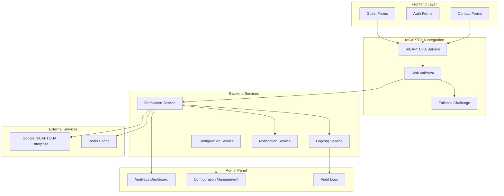

# reCAPTCHA Security Integration - Design Document

## Overview

The reCAPTCHA Security Integration enhances ICTServe's security posture by implementing Google reCAPTCHA Enterprise v3 across all public-facing forms and authentication endpoints. This design maintains ICTServe's **True Hybrid Architecture** while providing seamless bot protection that preserves the user experience for both guest and authenticated users.

The integration follows a layered security approach, implementing invisible reCAPTCHA v3 as the primary protection mechanism with visual challenge fallbacks when risk scores are insufficient. All implementations maintain WCAG 2.2 AA compliance and support the **Bahasa Melayu exclusive interface** (v3.6.0).

**Design Principles:**

- **Invisible First**: reCAPTCHA v3 provides seamless user experience
- **Graceful Degradation**: Visual challenges only when necessary
- **Performance Conscious**: Lazy loading and Core Web Vitals optimization
- **Accessibility Compliant**: WCAG 2.2 AA standards maintained
- **Audit Transparent**: Comprehensive logging for security analysis

## Architecture

### System Integration Points



### Integration Architecture

The reCAPTCHA integration follows ICTServe's established patterns:

1. **Frontend Integration**: JavaScript SDK loaded lazily on forms requiring protection
2. **Middleware Layer**: Laravel middleware for server-side verification
3. **Service Layer**: Dedicated reCAPTCHA service for verification logic
4. **Configuration Layer**: Filament admin panel for threshold management
5. **Audit Layer**: Integration with existing dual audit system (owen-it + spatie)

### Technology Stack Alignment

- **Laravel 12.40.1**: Middleware and service integration
- **Livewire 3.7.0**: Real-time form validation feedback
- **Filament 4.1.10**: Admin configuration interface
- **Tailwind 4.1.17**: Responsive widget styling
- **Redis 7.0**: Verification result caching and rate limiting

## Components and Interfaces

### Core Components

#### 1. reCAPTCHA Service (`App\Services\RecaptchaService`)

```php
<?php

declare(strict_types=1);

namespace App\Services;

use App\Contracts\RecaptchaServiceInterface;
use App\Exceptions\RecaptchaVerificationException;
use Illuminate\Http\Client\Response;
use Illuminate\Support\Facades\Http;
use Illuminate\Support\Facades\Log;
use Illuminate\Support\Facades\Cache;

class RecaptchaService implements RecaptchaServiceInterface
{
    public function __construct(
        private string $secretKey,
        private array $thresholds,
        private bool $enabled = true
    ) {}

    public function verify(string $token, string $action, string $remoteIp): RecaptchaResult
    public function getThreshold(string $action): float
    public function isEnabled(): bool
    public function getAnalytics(string $period = '24h'): array
}
```

#### 2. reCAPTCHA Middleware (`App\Http\Middleware\VerifyRecaptcha`)

```php
<?php

declare(strict_types=1);

namespace App\Http\Middleware;

use App\Services\RecaptchaService;
use Closure;
use Illuminate\Http\Request;

class VerifyRecaptcha
{
    public function __construct(private RecaptchaService $recaptcha) {}

    public function handle(Request $request, Closure $next, string $action): mixed
    {
        // Skip for admin/superuser roles
        if ($this->shouldSkipVerification($request)) {
            return $next($request);
        }

        // Verify reCAPTCHA token
        $result = $this->recaptcha->verify(
            $request->input('g-recaptcha-response'),
            $action,
            $request->ip()
        );

        if (!$result->isValid()) {
            return $this->handleFailure($request, $result);
        }

        return $next($request);
    }
}
```

#### 3. Configuration Service (`App\Services\RecaptchaConfigService`)

Manages dynamic configuration through Filament admin panel:

```php
<?php

declare(strict_types=1);

namespace App\Services;

use App\Models\RecaptchaConfig;
use Illuminate\Support\Facades\Cache;

class RecaptchaConfigService
{
    public function getThreshold(string $action): float
    public function setThreshold(string $action, float $threshold): void
    public function isEnabled(string $action): bool
    public function toggleAction(string $action, bool $enabled): void
    public function getAnalytics(): array
}
```

#### 4. Blade Component (`resources/views/components/recaptcha.blade.php`)

Reusable component for form integration:

```blade
@props([
    'action' => 'FORM_SUBMIT',
    'theme' => 'light',
    'size' => 'normal',
    'callback' => null
])

<div 
    class="g-recaptcha" 
    data-sitekey="{{ config('recaptcha.site_key') }}"
    data-action="{{ $action }}"
    data-theme="{{ $theme }}"
    data-size="{{ $size }}"
    @if($callback) data-callback="{{ $callback }}" @endif
    wire:ignore
>
</div>

@push('scripts')
<script>
    // Lazy load reCAPTCHA script
    if (!window.grecaptcha) {
        const script = document.createElement('script');
        script.src = 'https://www.google.com/recaptcha/enterprise.js?render={{ config("recaptcha.site_key") }}';
        script.async = true;
        script.defer = true;
        document.head.appendChild(script);
    }
</script>
@endpush
```

### Interface Definitions

#### RecaptchaServiceInterface

```php
<?php

namespace App\Contracts;

interface RecaptchaServiceInterface
{
    public function verify(string $token, string $action, string $remoteIp): RecaptchaResult;
    public function getThreshold(string $action): float;
    public function isEnabled(): bool;
    public function getAnalytics(string $period = '24h'): array;
}
```

#### RecaptchaResult

```php
<?php

namespace App\DataTransferObjects;

readonly class RecaptchaResult
{
    public function __construct(
        public bool $success,
        public float $score,
        public string $action,
        public array $errorCodes = [],
        public ?string $challengeTs = null,
        public ?string $hostname = null
    ) {}

    public function isValid(): bool
    public function meetsThreshold(float $threshold): bool
    public function requiresFallback(): bool
}
```

## Data Models

### Database Schema Changes

#### 1. reCAPTCHA Configuration Table

```sql
CREATE TABLE recaptcha_configs (
    id BIGINT UNSIGNED AUTO_INCREMENT PRIMARY KEY,
    action VARCHAR(50) NOT NULL UNIQUE,
    threshold DECIMAL(3,2) NOT NULL DEFAULT 0.50,
    enabled BOOLEAN NOT NULL DEFAULT TRUE,
    created_at TIMESTAMP NULL,
    updated_at TIMESTAMP NULL,
    
    INDEX idx_action (action),
    INDEX idx_enabled (enabled)
);
```

#### 2. reCAPTCHA Verification Logs

```sql
CREATE TABLE recaptcha_logs (
    id BIGINT UNSIGNED AUTO_INCREMENT PRIMARY KEY,
    user_id BIGINT UNSIGNED NULL,
    action VARCHAR(50) NOT NULL,
    token_hash VARCHAR(64) NOT NULL,
    score DECIMAL(3,2) NULL,
    success BOOLEAN NOT NULL,
    ip_address VARCHAR(45) NOT NULL,
    user_agent TEXT NULL,
    error_codes JSON NULL,
    challenge_ts TIMESTAMP NULL,
    hostname VARCHAR(255) NULL,
    created_at TIMESTAMP NULL,
    
    INDEX idx_action (action),
    INDEX idx_success (success),
    INDEX idx_user_id (user_id),
    INDEX idx_ip_address (ip_address),
    INDEX idx_created_at (created_at),
    
    FOREIGN KEY (user_id) REFERENCES users(id) ON DELETE SET NULL
);
```

### Eloquent Models

#### RecaptchaConfig Model

```php
<?php

declare(strict_types=1);

namespace App\Models;

use Illuminate\Database\Eloquent\Model;
use Spatie\Activitylog\Traits\LogsActivity;
use Spatie\Activitylog\LogOptions;

class RecaptchaConfig extends Model
{
    use LogsActivity;

    protected $fillable = [
        'action',
        'threshold',
        'enabled',
    ];

    protected function casts(): array
    {
        return [
            'threshold' => 'decimal:2',
            'enabled' => 'boolean',
        ];
    }

    public function getActivitylogOptions(): LogOptions
    {
        return LogOptions::defaults()
            ->logOnly(['action', 'threshold', 'enabled'])
            ->logOnlyDirty()
            ->dontSubmitEmptyLogs();
    }
}
```

#### RecaptchaLog Model

```php
<?php

declare(strict_types=1);

namespace App\Models;

use Illuminate\Database\Eloquent\Model;
use Illuminate\Database\Eloquent\Relations\BelongsTo;

class RecaptchaLog extends Model
{
    protected $fillable = [
        'user_id',
        'action',
        'token_hash',
        'score',
        'success',
        'ip_address',
        'user_agent',
        'error_codes',
        'challenge_ts',
        'hostname',
    ];

    protected function casts(): array
    {
        return [
            'score' => 'decimal:2',
            'success' => 'boolean',
            'error_codes' => 'array',
            'challenge_ts' => 'datetime',
        ];
    }

    public function user(): BelongsTo
    {
        return $this->belongsTo(User::class);
    }
}
```

## Correctness Properties

*A property is a characteristic or behavior that should hold true across all valid executions of a system-essentially, a formal statement about what the system should do. Properties serve as the bridge between human-readable specifications and machine-verifiable correctness guarantees.*

### Property Reflection

After analyzing all acceptance criteria, the following properties have been identified and consolidated to eliminate redundancy:

**Consolidated Properties:**

- Properties 1.2, 1.3, 2.1, 2.2, 2.3, 3.1, 3.2 can be combined into a comprehensive form protection property
- Properties 4.1, 4.3, 4.4, 4.5 can be combined into a comprehensive accessibility compliance property
- Properties 5.1, 5.2, 5.3 can be combined into a comprehensive performance and monitoring property

### Core Properties

**Property 1: Universal Form Protection**
*For any* public form (guest or authentication), reCAPTCHA verification should be required with the correct action name and appropriate risk score threshold
**Validates: Requirements 1.2, 1.3, 2.1, 2.2, 2.3, 3.1, 3.2**

**Property 2: Server-Side Verification Integrity**
*For any* reCAPTCHA-protected form submission, server-side token verification should occur with proper error handling and comprehensive logging
**Validates: Requirements 1.5, 5.3**

**Property 3: Role-Based Exemption**
*For any* admin or superuser accessing Filament admin panel, reCAPTCHA verification should be bypassed while regular users require verification
**Validates: Requirements 2.5**

**Property 4: Failure Handling Consistency**
*For any* failed reCAPTCHA verification, the system should log the attempt, increment rate limiting, and display localized error messages
**Validates: Requirements 2.4**

**Property 5: Fallback Challenge Activation**
*For any* reCAPTCHA verification with risk score below threshold, a visual challenge should be presented with Bahasa Melayu instructions
**Validates: Requirements 3.3**

**Property 6: Data Persistence During Verification**
*For any* form undergoing reCAPTCHA verification, user-entered data should be preserved throughout the verification process
**Validates: Requirements 3.4**

**Property 7: Performance Compliance**
*For any* page with reCAPTCHA integration, verification should complete within 2 seconds and maintain Core Web Vitals targets (LCP <2.5s, FID <100ms, CLS <0.1)
**Validates: Requirements 3.5, 5.1**

**Property 8: Accessibility Compliance**
*For any* reCAPTCHA implementation, WCAG 2.2 AA standards should be maintained including proper ARIA labels, keyboard navigation, 44×44px touch targets, and 4.5:1/3:1 contrast ratios
**Validates: Requirements 4.1, 4.3, 4.4, 4.5**

**Property 9: Service Unavailability Resilience**
*For any* reCAPTCHA service outage, the system should implement graceful degradation with appropriate fallback mechanisms and user notifications
**Validates: Requirements 5.5**

**Property 10: Configuration Threshold Management**
*For any* reCAPTCHA action, the risk score threshold should be configurable through the admin panel with proper validation (0.0-1.0 range)
**Validates: Requirements 1.4**

## Error Handling

### Error Classification

#### 1. Verification Errors

- **Invalid Token**: Malformed or expired reCAPTCHA token
- **Low Risk Score**: Score below configured threshold
- **Action Mismatch**: Token action doesn't match expected action
- **Rate Limit Exceeded**: Too many verification attempts

#### 2. Service Errors

- **API Unavailable**: Google reCAPTCHA service unreachable
- **Configuration Error**: Missing or invalid site/secret keys
- **Network Timeout**: Verification request timeout
- **Quota Exceeded**: reCAPTCHA API quota limits reached

#### 3. Integration Errors

- **Missing Token**: No reCAPTCHA token in request
- **JavaScript Disabled**: Client-side reCAPTCHA unavailable
- **CSRF Mismatch**: Security token validation failure
- **Session Expired**: User session invalid during verification

### Error Handling Strategies

#### Graceful Degradation

```php
public function handleVerificationFailure(RecaptchaResult $result, Request $request): Response
{
    // Log the failure for security analysis
    $this->logVerificationAttempt($result, $request);
    
    // Increment rate limiting counter
    $this->incrementRateLimit($request->ip());
    
    // Determine appropriate response based on error type
    return match($result->getErrorType()) {
        'low-score' => $this->presentVisualChallenge($request),
        'service-unavailable' => $this->enableFallbackMode($request),
        'rate-limited' => $this->showRateLimitError($request),
        default => $this->showGenericError($request)
    };
}
```

#### Fallback Mechanisms

1. **Visual Challenge**: Present traditional reCAPTCHA challenge for low scores
2. **Enhanced Rate Limiting**: Stricter limits when service unavailable
3. **Manual Review Queue**: Flag submissions for human review
4. **Temporary Bypass**: Allow submissions with enhanced logging

### Bahasa Melayu Error Messages

```php
// resources/lang/ms/recaptcha.php
return [
    'verification_failed' => 'Pengesahan keselamatan gagal. Sila cuba lagi.',
    'low_score' => 'Sila lengkapkan cabaran keselamatan untuk meneruskan.',
    'service_unavailable' => 'Perkhidmatan keselamatan tidak tersedia. Sila cuba lagi kemudian.',
    'rate_limited' => 'Terlalu banyak percubaan. Sila tunggu sebentar sebelum cuba lagi.',
    'invalid_token' => 'Token keselamatan tidak sah. Sila muat semula halaman.',
    'challenge_instructions' => 'Pilih semua gambar yang mengandungi {object}',
    'audio_instructions' => 'Dengar dan taip nombor yang anda dengar',
    'refresh_challenge' => 'Dapatkan cabaran baharu',
    'help_text' => 'Menghadapi masalah? Cuba gunakan cabaran audio atau hubungi sokongan.',
];
```

## Testing Strategy

### Dual Testing Approach

The reCAPTCHA integration requires both unit testing and property-based testing to ensure comprehensive coverage:

- **Unit tests** verify specific examples, edge cases, and error conditions
- **Property tests** verify universal properties that should hold across all inputs
- Together they provide comprehensive coverage: unit tests catch concrete bugs, property tests verify general correctness

### Unit Testing Requirements

Unit tests will cover:

- Specific configuration examples (site key loading, threshold settings)
- Integration points between components (middleware, service, Filament)
- Error handling scenarios (service unavailable, invalid tokens)
- Accessibility compliance verification (ARIA labels, contrast ratios)

### Property-Based Testing Requirements

**Testing Framework**: PHPUnit 12 with PHP 8 attributes and Faker for data generation
**Minimum Iterations**: 100 iterations per property test to ensure statistical confidence
**Tagging Format**: Each property-based test must include the comment: `**Feature: recaptcha-security-integration, Property {number}: {property_text}**`

#### Property Test Implementation Examples

```php
<?php

declare(strict_types=1);

use PHPUnit\Framework\Attributes\Test;
use Tests\TestCase;
use App\Services\RecaptchaService;

class RecaptchaPropertyTest extends TestCase
{
    #[Test]
    public function universal_form_protection_property(): void
    {
        /**
         * Feature: recaptcha-security-integration, Property 1: Universal Form Protection
         * For any public form (guest or authentication), reCAPTCHA verification should be required
         */
        
        $forms = ['helpdesk', 'asset-loan', 'contact', 'login', 'register'];
        
        foreach ($forms as $form) {
            $response = $this->post(route("{$form}.submit"), [
                'test_data' => fake()->sentence(),
                // Intentionally omit g-recaptcha-response
            ]);
            
            $this->assertRedirect();
            $this->assertSessionHasErrors('g-recaptcha-response');
        }
    }

    #[Test]
    public function role_based_exemption_property(): void
    {
        /**
         * Feature: recaptcha-security-integration, Property 3: Role-Based Exemption
         * For any admin or superuser accessing Filament admin panel, reCAPTCHA should be bypassed
         */
        
        $admin = User::factory()->create(['role' => 'admin']);
        $superuser = User::factory()->create(['role' => 'superuser']);
        $regular = User::factory()->create(['role' => 'staff']);
        
        // Admin and superuser should bypass reCAPTCHA
        $this->actingAs($admin)
             ->get('/admin')
             ->assertOk();
             
        $this->actingAs($superuser)
             ->get('/admin')
             ->assertOk();
             
        // Regular user should be redirected to login (which requires reCAPTCHA)
        $this->actingAs($regular)
             ->get('/admin')
             ->assertRedirect('/login');
    }
}
```

### Integration Testing

Integration tests will verify:

- End-to-end form submission workflows
- Filament admin panel configuration changes
- Real-time analytics dashboard updates
- Cross-browser compatibility (Chrome, Safari, Firefox)

### Accessibility Testing

Automated accessibility tests using:

- **axe-core** for WCAG 2.2 AA compliance verification
- **Lighthouse** for accessibility scoring
- **Screen reader simulation** for keyboard navigation testing

### Performance Testing

Performance tests will verify:

- Core Web Vitals impact measurement
- Lazy loading effectiveness
- API response time monitoring
- Cache performance optimization

## Implementation Notes

### Laravel 12 Integration Patterns

1. **Middleware Registration**: Register in `bootstrap/app.php`
2. **Service Provider**: Auto-discovery via `composer.json`
3. **Configuration**: Environment-based with caching support
4. **Validation**: Custom validation rules for reCAPTCHA tokens

### Filament 4 Admin Integration

1. **Resource Creation**: `RecaptchaConfigResource` for threshold management
2. **Dashboard Widgets**: Analytics and monitoring widgets
3. **Custom Pages**: Configuration and testing interfaces
4. **Role-Based Access**: Superuser-only configuration access

### WCAG 2.2 AA Compliance Implementation

1. **ARIA Labels**: Proper labeling for screen readers
2. **Keyboard Navigation**: Full keyboard accessibility
3. **Color Contrast**: 4.5:1 for text, 3:1 for UI elements
4. **Touch Targets**: Minimum 44×44px interactive areas
5. **Motion Preferences**: Respect `prefers-reduced-motion`

### Performance Optimization

1. **Lazy Loading**: Load reCAPTCHA script only when needed
2. **Caching**: Cache verification results and configuration
3. **CDN Integration**: Use Google's CDN for script delivery
4. **Resource Hints**: Preconnect to reCAPTCHA domains

### Security Considerations

1. **Token Validation**: Server-side verification mandatory
2. **Rate Limiting**: IP-based and user-based limits
3. **Audit Logging**: Comprehensive security event logging
4. **Secret Management**: Secure environment variable storage

This design document provides a comprehensive foundation for implementing reCAPTCHA security integration while maintaining ICTServe's architectural principles and compliance requirements.
