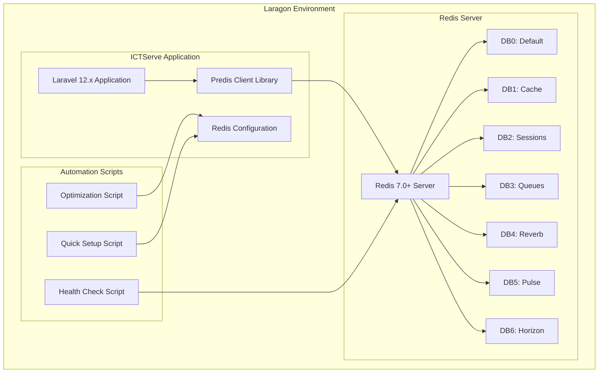

# Redis Laragon Optimization - Design Document

## Overview

This document outlines the technical design for optimizing Redis configuration for ICTServe v3.6.1 running on Laragon development environments. The design focuses on eliminating Redis connection errors through Predis client integration, database separation, and comprehensive automation scripts.

## Architecture Overview



## Component Design

### 1. Redis Client Configuration

#### 1.1 Predis Integration
**Purpose**: Use Predis pure PHP client for better Windows/Laragon compatibility

**Implementation**:
```php
// config/database.php - Redis configuration
'redis' => [
    'client' => env('REDIS_CLIENT', 'predis'),
    'options' => [
        'cluster' => env('REDIS_CLUSTER', 'redis'),
        'prefix' => env('REDIS_PREFIX', Str::slug(env('APP_NAME', 'laravel'), '_').'_database_'),
    ],
    'default' => [
        'url' => env('REDIS_URL'),
        'host' => env('REDIS_HOST', '127.0.0.1'),
        'username' => env('REDIS_USERNAME'),
        'password' => env('REDIS_PASSWORD'),
        'port' => env('REDIS_PORT', '6379'),
        'database' => env('REDIS_DB', '0'),
        'read_timeout' => 60,
        'context' => [],
    ],
    // Additional database configurations...
]
```

**Environment Configuration**:
```env
# Redis Client Configuration - CRITICAL for Laragon
REDIS_CLIENT=predis
REDIS_HOST=127.0.0.1
REDIS_PASSWORD=null
REDIS_PORT=6379

# Redis Connection Optimization
REDIS_MAX_RETRIES=3
REDIS_BACKOFF_ALGORITHM=decorrelated_jitter
REDIS_BACKOFF_BASE=100
REDIS_BACKOFF_CAP=1000
REDIS_PERSISTENT=false
REDIS_PREFIX=ictserve-database-
```

#### 1.2 Database Separation Strategy
**Purpose**: Isolate different services to prevent conflicts and improve organization

**Database Allocation**:
- **DB0**: Default Redis operations and general caching
- **DB1**: Laravel cache store (CACHE_STORE=redis)
- **DB2**: Session storage (SESSION_DRIVER=redis)
- **DB3**: Queue operations (QUEUE_CONNECTION=redis)
- **DB4**: Laravel Reverb WebSocket scaling
- **DB5**: Laravel Pulse monitoring data
- **DB6**: Laravel Horizon queue management

**Configuration Implementation**:
```env
# Redis Database Allocation for ICTServe v3.6.1
REDIS_DB=0
REDIS_CACHE_DB=1
REDIS_SESSION_DB=2
REDIS_QUEUE_DB=3
REDIS_REVERB_DB=4
REDIS_PULSE_DB=5
REDIS_HORIZON_DB=6
```

### 2. Performance Optimization

#### 2.1 Connection Optimization
**Purpose**: Minimize connection overhead and improve reliability

**Features**:
- Connection pooling through Predis
- Retry logic with exponential backoff
- Decorrelated jitter to prevent thundering herd
- Optimal timeout configurations

**Implementation**:
```php
// Connection retry configuration
'options' => [
    'parameters' => [
        'timeout' => 5.0,
        'read_write_timeout' => 60.0,
        'tcp_keepalive' => 1,
    ],
    'connections' => [
        'tcp' => [
            'persistent' => env('REDIS_PERSISTENT', false),
            'timeout' => 5.0,
            'read_write_timeout' => 60.0,
        ],
    ],
]
```

#### 2.2 Caching Strategy
**Purpose**: Optimize cache performance for ICTServe operations

**Cache Configuration**:
```php
// config/cache.php
'stores' => [
    'redis' => [
        'driver' => 'redis',
        'connection' => 'cache',
        'lock_connection' => 'default',
    ],
]
```

### 3. Automation Scripts

#### 3.1 Health Check Script
**File**: `scripts/laragon/redis-health-check.ps1`

**Purpose**: Comprehensive Redis health monitoring and diagnostics

**Features**:
- Redis service status validation
- Connection testing with timeout
- PHP Redis extension detection
- Laravel configuration validation
- Performance metrics collection
- Automatic issue detection
- Fix recommendations

**Key Functions**:
```powershell
function Test-RedisConnection {
    param([string]$Host, [int]$Port, [int]$TimeoutSeconds)
    # TCP connection test with timeout
}

function Get-RedisInfo {
    param([string]$Host, [int]$Port)
    # Redis server information retrieval
}

function Test-PHPRedisExtension {
    # PHP Redis extension availability check
}

function Test-PredisPackage {
    # Predis package installation verification
}
```

#### 3.2 Optimization Script
**File**: `scripts/laragon/optimize-redis-laragon.ps1`

**Purpose**: Complete Redis optimization for Laragon environment

**Features**:
- Automated Predis installation
- Environment configuration update
- Redis service management
- Configuration validation
- Performance tuning
- Backup and rollback capability

**Workflow**:
1. Backup existing configuration
2. Install/verify Predis package
3. Update .env configuration
4. Restart Redis service
5. Validate configuration
6. Run health checks
7. Generate optimization report

#### 3.3 Quick Setup Script
**File**: `scripts/setup-redis-laragon.ps1`

**Purpose**: Rapid Redis setup for new environments

**Features**:
- One-command setup
- Minimal user interaction
- Error handling and recovery
- Progress reporting
- Success validation

### 4. Configuration Management

#### 4.1 Environment Template
**File**: `.env.example`

**Purpose**: Provide optimal Redis configuration template

**Key Sections**:
```env
# Redis Cache Configuration - Optimized for Laragon
CACHE_STORE=redis
CACHE_PREFIX=ictserve_cache

# Redis Client Configuration - CRITICAL for Laragon
REDIS_CLIENT=predis
REDIS_HOST=127.0.0.1
REDIS_PASSWORD=null
REDIS_PORT=6379

# Redis Database Allocation for ICTServe v3.6.1
REDIS_DB=0
REDIS_CACHE_DB=1
REDIS_SESSION_DB=2
REDIS_QUEUE_DB=3
REDIS_REVERB_DB=4
REDIS_PULSE_DB=5
REDIS_HORIZON_DB=6

# Redis Connection Optimization
REDIS_MAX_RETRIES=3
REDIS_BACKOFF_ALGORITHM=decorrelated_jitter
REDIS_BACKOFF_BASE=100
REDIS_BACKOFF_CAP=1000
REDIS_PERSISTENT=false
REDIS_PREFIX=ictserve-database-
```

#### 4.2 Laravel Configuration
**File**: `config/database.php`

**Purpose**: Laravel Redis connection configuration

**Implementation**:
```php
'redis' => [
    'client' => env('REDIS_CLIENT', 'predis'),
    'options' => [
        'cluster' => env('REDIS_CLUSTER', 'redis'),
        'prefix' => env('REDIS_PREFIX', Str::slug(env('APP_NAME', 'laravel'), '_').'_database_'),
    ],
    'default' => [
        'url' => env('REDIS_URL'),
        'host' => env('REDIS_HOST', '127.0.0.1'),
        'username' => env('REDIS_USERNAME'),
        'password' => env('REDIS_PASSWORD'),
        'port' => env('REDIS_PORT', '6379'),
        'database' => env('REDIS_DB', '0'),
        'read_timeout' => 60,
        'context' => [],
    ],
    'cache' => [
        'url' => env('REDIS_URL'),
        'host' => env('REDIS_HOST', '127.0.0.1'),
        'username' => env('REDIS_USERNAME'),
        'password' => env('REDIS_PASSWORD'),
        'port' => env('REDIS_PORT', '6379'),
        'database' => env('REDIS_CACHE_DB', '1'),
        'read_timeout' => 60,
        'context' => [],
    ],
    'sessions' => [
        'url' => env('REDIS_URL'),
        'host' => env('REDIS_HOST', '127.0.0.1'),
        'username' => env('REDIS_USERNAME'),
        'password' => env('REDIS_PASSWORD'),
        'port' => env('REDIS_PORT', '6379'),
        'database' => env('REDIS_SESSION_DB', '2'),
        'read_timeout' => 60,
        'context' => [],
    ],
    'queues' => [
        'url' => env('REDIS_URL'),
        'host' => env('REDIS_HOST', '127.0.0.1'),
        'username' => env('REDIS_USERNAME'),
        'password' => env('REDIS_PASSWORD'),
        'port' => env('REDIS_PORT', '6379'),
        'database' => env('REDIS_QUEUE_DB', '3'),
        'read_timeout' => 60,
        'context' => [],
    ],
    'reverb' => [
        'url' => env('REDIS_URL'),
        'host' => env('REDIS_HOST', '127.0.0.1'),
        'username' => env('REDIS_USERNAME'),
        'password' => env('REDIS_PASSWORD'),
        'port' => env('REDIS_PORT', '6379'),
        'database' => env('REDIS_REVERB_DB', '4'),
        'read_timeout' => 60,
        'context' => [],
    ],
    'pulse' => [
        'url' => env('REDIS_URL'),
        'host' => env('REDIS_HOST', '127.0.0.1'),
        'username' => env('REDIS_USERNAME'),
        'password' => env('REDIS_PASSWORD'),
        'port' => env('REDIS_PORT', '6379'),
        'database' => env('REDIS_PULSE_DB', '5'),
        'read_timeout' => 60,
        'context' => [],
    ],
    'horizon' => [
        'url' => env('REDIS_URL'),
        'host' => env('REDIS_HOST', '127.0.0.1'),
        'username' => env('REDIS_USERNAME'),
        'password' => env('REDIS_PASSWORD'),
        'port' => env('REDIS_PORT', '6379'),
        'database' => env('REDIS_HORIZON_DB', '6'),
        'read_timeout' => 60,
        'context' => [],
    ],
],
```

### 5. Documentation System

#### 5.1 Setup Documentation
**File**: `docs/redis/LARAGON_REDIS_SETUP.md`

**Purpose**: Comprehensive Redis setup and troubleshooting guide

**Sections**:
- Prerequisites and requirements
- Step-by-step setup instructions
- Configuration explanations
- Troubleshooting common issues
- Performance optimization tips
- Maintenance procedures

#### 5.2 Script Documentation
**Purpose**: Document all automation scripts and their usage

**Coverage**:
- Script parameters and options
- Usage examples
- Error handling procedures
- Troubleshooting guides
- Best practices

### 6. Error Handling and Recovery

#### 6.1 Connection Error Handling
**Purpose**: Graceful handling of Redis connection failures

**Implementation**:
```php
// Custom Redis connection with retry logic
class OptimizedRedisConnector extends RedisConnector
{
    public function connect(array $config, array $options)
    {
        $maxRetries = $config['max_retries'] ?? 3;
        $backoffBase = $config['backoff_base'] ?? 100;
        $backoffCap = $config['backoff_cap'] ?? 1000;
        
        for ($attempt = 1; $attempt <= $maxRetries; $attempt++) {
            try {
                return parent::connect($config, $options);
            } catch (Exception $e) {
                if ($attempt === $maxRetries) {
                    throw $e;
                }
                
                $delay = min($backoffCap, $backoffBase * pow(2, $attempt - 1));
                usleep($delay * 1000);
            }
        }
    }
}
```

#### 6.2 Configuration Validation
**Purpose**: Validate Redis configuration before application startup

**Implementation**:
```php
// Configuration validation service
class RedisConfigurationValidator
{
    public function validate(): array
    {
        $issues = [];
        
        // Check Redis client setting
        if (config('database.redis.client') !== 'predis') {
            $issues[] = 'Redis client should be set to predis for Laragon compatibility';
        }
        
        // Check Redis host
        if (config('database.redis.default.host') !== '127.0.0.1') {
            $issues[] = 'Redis host should be 127.0.0.1 for Laragon';
        }
        
        // Check database separation
        $databases = ['default', 'cache', 'sessions', 'queues', 'reverb', 'pulse', 'horizon'];
        $usedDbs = [];
        
        foreach ($databases as $connection) {
            $db = config("database.redis.{$connection}.database");
            if (in_array($db, $usedDbs)) {
                $issues[] = "Database conflict: {$connection} uses database {$db} which is already in use";
            }
            $usedDbs[] = $db;
        }
        
        return $issues;
    }
}
```

### 7. Performance Monitoring

#### 7.1 Redis Performance Metrics
**Purpose**: Monitor Redis performance and identify bottlenecks

**Metrics**:
- Connection response time
- Memory usage
- Command throughput
- Error rates
- Database utilization

**Implementation**:
```powershell
function Get-RedisPerformanceMetrics {
    param([string]$Host, [int]$Port)
    
    $metrics = @{}
    
    # Test ping response time
    $startTime = Get-Date
    redis-cli -h $Host -p $Port ping | Out-Null
    $pingTime = (Get-Date) - $startTime
    $metrics.PingResponseTime = $pingTime.TotalMilliseconds
    
    # Get memory usage
    $memoryInfo = redis-cli -h $Host -p $Port info memory
    $usedMemory = ($memoryInfo -split "`n" | Where-Object { $_ -match '^used_memory_human:' }) -replace 'used_memory_human:', ''
    $metrics.MemoryUsage = $usedMemory
    
    # Get connection count
    $clientInfo = redis-cli -h $Host -p $Port info clients
    $connectedClients = ($clientInfo -split "`n" | Where-Object { $_ -match '^connected_clients:' }) -replace 'connected_clients:', ''
    $metrics.ConnectedClients = [int]$connectedClients
    
    return $metrics
}
```

#### 7.2 Health Check Integration
**Purpose**: Integrate performance monitoring with health checks

**Features**:
- Automated performance testing
- Threshold-based alerting
- Performance trend analysis
- Optimization recommendations

## Security Considerations

### 7.1 Redis Security
**Purpose**: Secure Redis configuration for development environment

**Measures**:
- No password required for local development
- Bind to localhost only (127.0.0.1)
- Disable dangerous commands in production
- Regular security updates

### 7.2 Configuration Security
**Purpose**: Protect Redis configuration from unauthorized access

**Measures**:
- Environment variable protection
- Configuration file permissions
- Secure backup procedures
- Access logging

## Testing Strategy

### 8.1 Unit Testing
**Purpose**: Test individual Redis operations and configurations

**Coverage**:
- Connection establishment
- Database operations
- Configuration validation
- Error handling

### 8.2 Integration Testing
**Purpose**: Test Redis integration with Laravel services

**Coverage**:
- Cache operations
- Session management
- Queue processing
- Real-time features

### 8.3 Performance Testing
**Purpose**: Validate Redis performance requirements

**Tests**:
- Connection response time
- Throughput testing
- Memory usage validation
- Concurrent connection handling

### 8.4 Script Testing
**Purpose**: Validate automation scripts

**Coverage**:
- Health check accuracy
- Optimization script reliability
- Error handling robustness
- Cross-environment compatibility

## Deployment Strategy

### 9.1 Development Environment
**Purpose**: Deploy Redis optimization to development environments

**Steps**:
1. Run health check to assess current state
2. Backup existing configuration
3. Execute optimization script
4. Validate configuration
5. Test application functionality
6. Document any issues or customizations

### 9.2 Script Distribution
**Purpose**: Distribute automation scripts to development team

**Methods**:
- Version control integration
- Documentation updates
- Training materials
- Support procedures

## Maintenance and Support

### 10.1 Regular Maintenance
**Purpose**: Maintain optimal Redis performance

**Tasks**:
- Regular health checks
- Performance monitoring
- Configuration updates
- Security patches

### 10.2 Troubleshooting Support
**Purpose**: Provide support for Redis issues

**Resources**:
- Comprehensive troubleshooting guide
- Common issue solutions
- Performance optimization tips
- Expert support contacts

## Future Enhancements

### 11.1 Advanced Monitoring
**Purpose**: Enhanced Redis monitoring capabilities

**Features**:
- Real-time performance dashboards
- Automated alerting
- Trend analysis
- Capacity planning

### 11.2 Configuration Management
**Purpose**: Advanced configuration management

**Features**:
- Configuration versioning
- Environment-specific configurations
- Automated configuration deployment
- Configuration drift detection

---

**Document Version**: 1.0  
**Created**: December 19, 2024  
**Author**: ICTServe Development Team  
**Status**: Draft  
**Next Review**: January 19, 2025