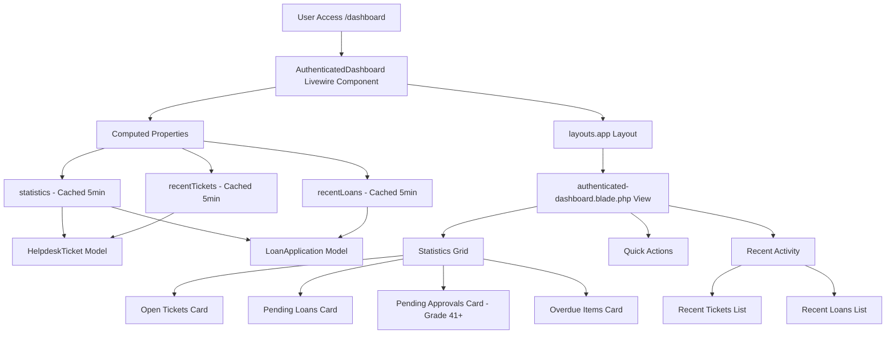
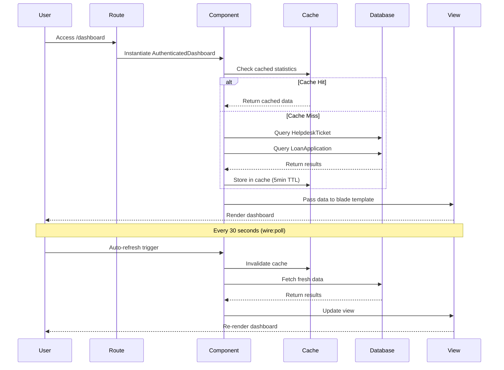

# Staff Dashboard Fix - Design Document

## Overview

This document provides the technical design for fixing the staff dashboard issue where the dashboard displays only "You're logged in!" instead of the comprehensive unified dashboard with statistics, recent activity, and quick actions.

**Root Cause Identified**: The `/dashboard` route was configured to use a simple Blade view (`resources/views/dashboard.blade.php`) instead of the `AuthenticatedDashboard` Livewire component.

**Solution**: Update the route configuration to use the Livewire component and ensure all dependencies are properly configured.

## Architecture

### Current Implementation (Broken)

```
User → /dashboard route → dashboard.blade.php view → "You're logged in!" message
```

### Fixed Implementation

```
User → /dashboard route → AuthenticatedDashboard Livewire component → Comprehensive dashboard with:
  - 4-column statistics grid
  - Recent activity (tickets + loans)
  - Quick action buttons
  - Role-based content
```

### Component Architecture



## Design Changes

### 1. Route Configuration Fix

**File**: `routes/web.php`

**Before**:

```php
Route::view('dashboard', 'dashboard')
    ->middleware(['auth', 'verified'])
    ->name('dashboard');
```

**After**:

```php
Route::get('dashboard', App\Livewire\Staff\AuthenticatedDashboard::class)
    ->middleware(['auth', 'verified'])
    ->name('dashboard');
```

**Rationale**: The route must use the Livewire component instead of a simple view to enable dynamic data loading, caching, and real-time updates.

### 2. Component Structure

**Component**: `App\Livewire\Staff\AuthenticatedDashboard`

**Key Features**:

- Uses `OptimizedLivewireComponent` trait for performance
- Implements computed properties with 5-minute caching
- Supports wire:poll.30s for real-time updates
- Role-based content rendering (Grade 41+ approvals)
- Eager loading to prevent N+1 queries

**Computed Properties**:

```php
#[Computed]
public function statistics(): array
{
    return $this->getCachedComponentData('statistics', function () {
        return [
            'open_tickets' => $this->getOpenTicketsCount($user),
            'pending_loans' => $this->getPendingLoansCount($user),
            'overdue_items' => $this->getOverdueItemsCount($user),
            'pending_approvals' => $this->getPendingApprovalsCount(), // Grade 41+ only
        ];
    }, 300); // 5-minute cache
}

#[Computed]
public function recentTickets()
{
    return $this->getCachedComponentData('recent_tickets', function () {
        return HelpdeskTicket::query()
            ->where(function ($query) use ($user) {
                $query->where('user_id', $user->id)
                    ->orWhere('assigned_to_user', $user->id);
            })
            ->with(['user:id,name', 'assignedUser:id,name', 'division:id,name_ms,name_en'])
            ->latest()
            ->limit(5)
            ->get();
    }, 300);
}

#[Computed]
public function recentLoans()
{
    return $this->getCachedComponentData('recent_loans', function () {
        return LoanApplication::query()
            ->where('user_id', $user->id)
            ->with(['loanItems.asset:id,name,model', 'division:id,name_ms,name_en'])
            ->latest()
            ->limit(5)
            ->get();
    }, 300);
}
```

### 3. View Structure

**View**: `resources/views/livewire/staff/authenticated-dashboard.blade.php`

**Layout**: Uses `layouts.app` with authenticated header, sidebar navigation, and footer

**Sections**:

1. **Page Header** (with refresh button)
   - Title: "Dashboard"
   - Welcome message with user name
   - Refresh button with wire:click="refreshData"

2. **Statistics Grid** (4 columns, responsive)
   - My Open Tickets (blue icon)
   - My Pending Loans (orange icon)
   - Pending Approvals (green icon, Grade 41+ only)
   - Overdue Items (red icon)

3. **Quick Actions** (3 buttons)
   - New Ticket → `/helpdesk/create`
   - Request Loan → `/loan/guest/apply`
   - View All Services → `/welcome`

4. **Recent Activity** (2 columns)
   - My Recent Tickets (5 most recent)
   - My Recent Loans (5 most recent)

5. **Loading State** (wire:loading overlay)

### 4. Data Flow



## WCAG 2.2 Level AA Compliance

### Color Contrast

**Compliant Color Palette**:

- Primary (MOTAC Blue): `#0056b3` (6.8:1 contrast ratio)
- Success (Green): `#198754` (4.9:1 contrast ratio)
- Warning (Orange): `#ff8c00` (4.5:1 contrast ratio)
- Danger (Red): `#b50c0c` (8.2:1 contrast ratio)

**Application**:

- Statistics card icons use compliant colors
- Status badges use compliant colors
- Text maintains 4.5:1 minimum contrast
- UI components maintain 3:1 minimum contrast

### Keyboard Navigation

**Focus Indicators**:

- 3-4px outline
- 2px offset
- 3:1 contrast minimum
- Applied to all interactive elements

**Tab Order**:

1. Skip links (Alt+M, Alt+S, Alt+U)
2. Refresh button
3. Statistics cards (with links)
4. Quick action buttons
5. Recent activity items

### Screen Reader Support

**ARIA Attributes**:

- `aria-label` on refresh button
- `aria-hidden="true"` on decorative icons
- `role="list"` on activity feeds
- `aria-live="polite"` for loading states

**Semantic HTML**:

- Proper heading hierarchy (h1, h2, h3)
- `<main>` for content area
- `<nav>` for navigation
- `<header>` for page header

### Touch Targets

**Minimum Size**: 44×44px for all interactive elements

- Refresh button: 44×44px
- Quick action buttons: 44×44px minimum
- Statistics card links: Full card clickable
- Activity item links: Full item clickable

## Performance Optimization

### Caching Strategy

**Component-Level Caching**:

- Statistics: 5-minute cache
- Recent tickets: 5-minute cache
- Recent loans: 5-minute cache
- Cache key: `user_{id}_dashboard_{property}`

**Cache Invalidation**:

- Manual refresh button
- Automatic refresh every 30 seconds (wire:poll)
- On data updates (ticket created, loan submitted)

### Query Optimization

**Eager Loading**:

```php
->with([
    'user:id,name',
    'assignedUser:id,name',
    'division:id,name_ms,name_en',
    'asset:id,name,model',
    'loanItems.asset:id,name,model'
])
```

**Select Optimization**:

- Only select required columns
- Limit results to 5 for recent activity
- Use indexed columns for WHERE clauses

### Livewire Optimization

**OptimizedLivewireComponent Trait**:

- `getCachedComponentData()` for caching
- `invalidateComponentCache()` for cache clearing
- Computed properties with `#[Computed]` attribute
- Lazy loading for heavy components

## Testing Strategy

### Unit Tests

**Test Cases**:

1. `test_statistics_returns_correct_counts()`
2. `test_recent_tickets_limited_to_five()`
3. `test_recent_loans_limited_to_five()`
4. `test_approvals_card_only_for_grade_41_plus()`
5. `test_cache_invalidation_on_refresh()`

### Feature Tests

**Test Cases**:

1. `test_dashboard_route_uses_livewire_component()`
2. `test_authenticated_user_can_access_dashboard()`
3. `test_guest_user_redirected_to_login()`
4. `test_dashboard_displays_statistics_grid()`
5. `test_dashboard_displays_recent_activity()`
6. `test_dashboard_displays_quick_actions()`

### Browser Tests

**Test Cases**:

1. Test responsive layout (mobile, tablet, desktop)
2. Test keyboard navigation
3. Test screen reader compatibility
4. Test color contrast
5. Test loading states

## Deployment Checklist

- [x] Update route configuration in `routes/web.php`
- [ ] Clear route cache: `php artisan route:clear`
- [ ] Clear view cache: `php artisan view:clear`
- [ ] Clear application cache: `php artisan cache:clear`
- [ ] Test dashboard access as regular staff user
- [ ] Test dashboard access as Grade 41+ approver
- [ ] Test responsive layout on mobile/tablet
- [ ] Test keyboard navigation
- [ ] Verify WCAG 2.2 Level AA compliance
- [ ] Monitor performance metrics (LCP, FID, CLS)

## Rollback Plan

If issues occur after deployment:

1. **Immediate Rollback**:

   ```php
   // Revert routes/web.php
   Route::view('dashboard', 'dashboard')
       ->middleware(['auth', 'verified'])
       ->name('dashboard');
   ```

2. **Clear Caches**:

   ```bash
   php artisan route:clear
   php artisan view:clear
   php artisan cache:clear
   ```

3. **Investigate Issues**:
   - Check Laravel logs: `storage/logs/laravel.log`
   - Check browser console for JavaScript errors
   - Verify database connectivity
   - Check Livewire component registration

## Success Metrics

**Technical Metrics**:

- Dashboard loads within 2 seconds
- Cache hit rate > 80%
- Zero JavaScript errors
- Zero accessibility violations

**User Experience Metrics**:

- Statistics display correctly
- Recent activity shows up to 5 items
- Quick actions are functional
- Responsive layout works on all devices

**Compliance Metrics**:

- WCAG 2.2 Level AA: 100% compliance
- Lighthouse Accessibility: 100/100
- Color contrast: All elements pass
- Keyboard navigation: All elements accessible

---

**Document Version**: 1.0  
**Last Updated**: 2025-11-05  
**Author**: System Maintenance Team  
**Status**: Implementation Ready  
**Related Files**:

- `routes/web.php`
- `app/Livewire/Staff/AuthenticatedDashboard.php`
- `resources/views/livewire/staff/authenticated-dashboard.blade.php`
- `resources/views/layouts/app.blade.php`
