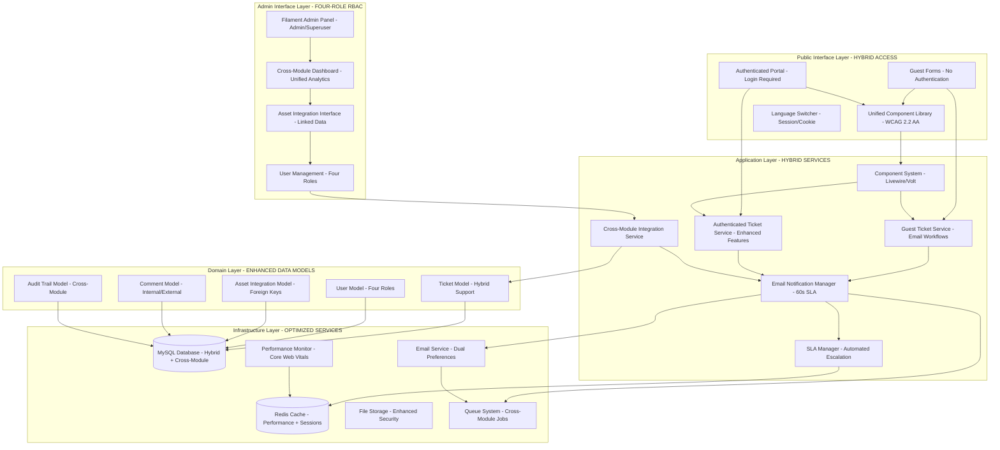

# Updated Helpdesk Module - Design Document

## Overview

The Updated Helpdesk Module design implements a sophisticated **hybrid architecture** that seamlessly integrates guest-only public forms with authenticated portal features while maintaining cross-module integration with the asset loan system. This design evolution preserves the proven guest-only functionality while adding comprehensive authenticated features and enhanced administrative capabilities.

**Critical Design Evolution**: The system transitions from a simple guest-only model to a hybrid architecture supporting dual access modes (guest + authenticated) with cross-module integration, unified component library, and enhanced performance optimization.

## Key Design Decisions

### 1. Hybrid Architecture Implementation

**Decision**: Implement dual access modes with shared backend services and unified component library.
**Rationale**: Maintains simplicity of guest access while providing enhanced features for authenticated users, ensuring backward compatibility and seamless user experience.
**Impact**: Shared service layer, dual UI paths, unified data models with nullable user relationships, and consistent email workflows.

### 2. Cross-Module Integration Strategy

**Decision**: Deep integration with asset loan system through shared data models and automated workflows.
**Rationale**: Provides comprehensive ICT service management, reduces data duplication, enables automated maintenance workflows, and improves operational efficiency.
**Impact**: Foreign key relationships, automated ticket creation, unified admin dashboard, and cross-module audit trails.

### 3. Unified Component Library Integration

**Decision**: Full adoption of the ICTServe component library with x-category.component-name structure.
**Rationale**: Ensures consistency across all ICTServe modules, improves maintainability, provides WCAG 2.2 AA compliance, and enables rapid development.
**Impact**: Standardized UI components, consistent accessibility features, unified styling, and D00-D15 traceability.

### 4. Enhanced Performance Architecture

**Decision**: OptimizedLivewireComponent trait, Core Web Vitals targets, and comprehensive performance monitoring.
**Rationale**: Supports increased functionality without performance degradation, meets government service standards, and provides excellent user experience.
**Impact**: Component caching, lazy loading, query optimization, image optimization, and real-time performance monitoring.

### 5. Four-Role RBAC Implementation

**Decision**: Upgrade from two-role to four-role system (Staff, Approver, Admin, Superuser) with cross-module permissions.
**Rationale**: Supports complex organizational hierarchy, enables cross-module workflows, provides granular access control, and integrates with ICTServe system.
**Impact**: Enhanced permission system, role-based UI, cross-module access control, and comprehensive audit trails.

The design emphasizes:

- **Hybrid Architecture**: Dual access modes with shared backend services
- **Cross-Module Integration**: Deep integration with asset loan system
- **Component Library**: Unified x-category.component-name structure with WCAG 2.2 AA compliance
- **Performance Excellence**: Core Web Vitals targets with OptimizedLivewireComponent trait
- **Security Enhancement**: Four-role RBAC with comprehensive audit trails
- **Scalability**: Modular design supporting future ICTServe integrations
- **Compliance**: Enhanced PDPA compliance and accessibility standards

## Architecture

### System Architecture



### Technology Stack

| Component | Technology | Version | Purpose |
|-----------|------------|---------|---------|
| Backend Framework | Laravel | 12.x | Core application framework with hybrid support |
| Frontend Components | Livewire | 3.x | Dynamic UI with OptimizedLivewireComponent trait |
| Single-File Components | Volt | 1.x | Simplified component development |
| Admin Interface | Filament | 4.x | Cross-module administrative panels |
| Database | MySQL | 8.0+ | Hybrid data storage with cross-module support |
| Cache | Redis | 7.0+ | Performance optimization and session management |
| Styling | Tailwind CSS | 3.x | Unified component library styling |
| Build Tool | Vite | 4.x | Asset compilation with optimization |
| Performance Monitoring | Laravel Telescope | 4.x | Real-time performance tracking |
| Broadcasting | Laravel Echo | 2.x | Real-time updates for authenticated users |

## Components and Interfaces

### Enhanced Data Models

#### HelpdeskTicket Model (Hybrid Support)

```php
class HelpdeskTicket extends Model

    use HasAuditTrail, OptimizedQueries;

    protected $fillable = [
        'ticket_number', 'user_id', 'assigned_to', 'title', 'description',
        'category', 'priority', 'status', 'damage_type', 'asset_id',
        'guest_name', 'guest_email', 'guest_phone', 'guest_staff_id',
        'guest_grade', 'guest_division', 'resolved_at', 'closed_at'
  ;

    protected $casts = [
        'resolved_at' => 'datetime',
        'closed_at' => 'datetime',
        'priority' => TicketPriority::class,
        'status' => TicketStatus::class,
  ;

    // Enhanced relationships for hybrid architecture
    public function user(): BelongsTo
    
        return $this->belongsTo(User::class)->nullable();

    
    public function assignedAgent(): BelongsTo
    
        return $this->belongsTo(User::class, 'assigned_to');

    
    public function comments(): HasMany
    
        return $this->hasMany(HelpdeskComment::class, 'ticket_id');

    
    public function attachments(): HasMany
    
        return $this->hasMany(HelpdeskAttachment::class, 'ticket_id');

    
    public function slaBreaches(): HasMany
    
        return $this->hasMany(HelpdeskSLABreach::class, 'ticket_id');

    
    // Cross-module integration
    public function relatedAsset(): BelongsTo
    
        return $this->belongsTo(Asset::class, 'asset_id');

    
    public function assetLoanApplications(): HasManyThrough
    
        return $this->hasManyThrough(
            LoanApplication::class,
            Asset::class,
            'id',
            'asset_id',
            'asset_id',
            'id'
        );

    
    // Helper methods for hybrid architecture
    public function isGuestSubmission(): bool
    
        return is_null($this->user_id);

    
    public function isAuthenticatedSubmission(): bool
    
        return !is_null($this->user_id);

    
    public function getSubmitterName(): string
    
        return $this->isGuestSubmission() ? $this->guest_name : $this->user->name;

    
    public function getSubmitterEmail(): string
    
        return $this->isGuestSubmission() ? $this->guest_email : $this->user->email;

    
    public function getSubmitterIdentifier(): string
    
        return $this->isGuestSubmission() 
            ? "guest:$this->guest_email" 
            : "user:$this->user_id";

    
    // Cross-module helper methods
    public function hasRelatedAsset(): bool
    
        return !is_null($this->asset_id);

    
    public function isMaintenanceTicket(): bool
    
        return $this->category === 'maintenance' && $this->hasRelatedAsset();


```

#### User Model (Enhanced Four-Role RBAC)

```php
class User extends Authenticatable

    use HasApiTokens, HasFactory, Notifiable, HasRoles, HasAuditTrail;

    protected $fillable = [
        'name', 'email', 'password', 'phone', 'staff_id', 
        'grade', 'division', 'notification_preferences'
  ;

    protected $casts = [
        'email_verified_at' => 'datetime',
        'password' => 'hashed',
        'notification_preferences' => 'array',
  ;

    // Helpdesk relationships
    public function helpdeskTickets(): HasMany
    
        return $this->hasMany(HelpdeskTicket::class, 'user_id');

    
    public function assignedTickets(): HasMany
    
        return $this->hasMany(HelpdeskTicket::class, 'assigned_to');

    
    public function helpdeskComments(): HasMany
    
        return $this->hasMany(HelpdeskComment::class, 'user_id');

    
    // Cross-module relationships
    public function loanApplications(): HasMany
    
        return $this->hasMany(LoanApplication::class, 'applicant_id');

    
    public function approvedLoanApplications(): HasMany
    
        return $this->hasMany(LoanApplication::class, 'approved_by');

    
    // Role helper methods for four-role RBAC
    public function isStaff(): bool
    
        return $this->hasRole('staff');

    
    public function isApprover(): bool
    
        return $this->hasRole('approver');

    
    public function isAdmin(): bool
    
        return $this->hasRole('admin');

    
    public function isSuperuser(): bool
    
        return $this->hasRole('superuser');

    
    public function canApproveLoans(): bool
    
        return $this->isApprover() || $this->isAdmin() || $this->isSuperuser();

    
    public function canAccessAdminPanel(): bool
    
        return $this->isAdmin() || $this->isSuperuser();

    
    public function canManageUsers(): bool
    
        return $this->isSuperuser();

    
    // Notification preference methods
    public function wantsEmailNotifications(string $type): bool
    
        return $this->notification_preferences[$type] ?? true;

    
    public function updateNotificationPreference(string $type, bool $enabled): void
    
        $preferences = $this->notification_preferences ?? [];
        $preferences[$type] = $enabled;
        $this->update(['notification_preferences' => $preferences]);


```

#### CrossModuleIntegration Model

```php
class CrossModuleIntegration extends Model

    use HasAuditTrail;

    protected $fillable = [
        'helpdesk_ticket_id', 'asset_loan_id', 'integration_type',
        'trigger_event', 'integration_data', 'processed_at'
  ;

    protected $casts = [
        'integration_data' => 'array',
        'processed_at' => 'datetime',
  ;

    public function helpdeskTicket(): BelongsTo
    
        return $this->belongsTo(HelpdeskTicket::class, 'helpdesk_ticket_id');

    
    public function assetLoan(): BelongsTo
    
        return $this->belongsTo(LoanApplication::class, 'asset_loan_id');

    
    // Integration type constants
    const TYPE_ASSET_DAMAGE_REPORT = 'asset_damage_report';
    const TYPE_MAINTENANCE_REQUEST = 'maintenance_request';
    const TYPE_ASSET_TICKET_LINK = 'asset_ticket_link';
    
    // Trigger event constants
    const EVENT_ASSET_RETURNED_DAMAGED = 'asset_returned_damaged';
    const EVENT_TICKET_ASSET_SELECTED = 'ticket_asset_selected';
    const EVENT_MAINTENANCE_SCHEDULED = 'maintenance_scheduled';

```

### Livewire Components (Hybrid Architecture)

#### GuestTicketForm Component (Volt - Enhanced)

```php
<?php
use Livewire\Volt\Component;
use Livewire\WithFileUploads;
use App\Traits\OptimizedLivewireComponent;

new class extends Component 
    use WithFileUploads, OptimizedLivewireComponent;
    
    // Guest submission fields - enhanced with grade and division
    public string $guest_name = '';
    public string $guest_email = '';
    public string $guest_phone = '';
    public string $guest_staff_id = '';
    public string $guest_grade = '';
    public string $guest_division = '';
    
    // Ticket details
    public string $title = '';
    public string $description = '';
    public string $category = '';
    public string $damage_type = '';
    public ?string $asset_id = null;
    public array $attachments = [];
    
    // UI state
    public bool $showAssetSelection = false;
    public array $availableAssets = [];
    
    public function mount(): void
    
        $this->loadAvailableAssets();

    
    public function rules(): array
    
        return [
            // Enhanced guest information
            'guest_name' => 'required|string|max:255',
            'guest_email' => 'required|email|max:255',
            'guest_phone' => 'required|string|max:20',
            'guest_staff_id' => 'required|string|max:50',
            'guest_grade' => 'required|string|max:10',
            'guest_division' => 'required|string|max:100',
            
            // Ticket details
            'title' => 'required|string|max:255',
            'description' => 'required|string|min:10|max:5000',
            'category' => 'required|in:hardware,software,network,maintenance,other',
            'damage_type' => 'required|string',
            'asset_id' => 'nullable|exists:assets,id',
            'attachments.*' => 'file|max:5120|mimes:jpg,png,pdf,doc,docx'
      ;

    
    #[Computed]
    public function canClaimTicket(): bool
    
        return auth()->check() && 
               auth()->user()->email === $this->guest_email;

    
    public function updatedCategory(): void
    
        $this->showAssetSelection = in_array($this->category, ['hardware', 'maintenance']);
        if (!$this->showAssetSelection) 
            $this->asset_id = null;
    

    
    public function submit()
    
        $this->validate();
        
        $ticket = app(HybridHelpdeskService::class)->createGuestTicket([
            // Enhanced guest information
            'guest_name' => $this->guest_name,
            'guest_email' => $this->guest_email,
            'guest_phone' => $this->guest_phone,
            'guest_staff_id' => $this->guest_staff_id,
            'guest_grade' => $this->guest_grade,
            'guest_division' => $this->guest_division,
            
            // Ticket details
            'title' => $this->title,
            'description' => $this->description,
            'category' => $this->category,
            'damage_type' => $this->damage_type,
            'asset_id' => $this->asset_id,
            'attachments' => $this->attachments,
      );
        
        session()->flash('success', __('helpdesk.ticket_created_success'));
        session()->flash('ticket_number', $ticket->ticket_number);
        session()->flash('can_claim', $this->canClaimTicket());
        
        return redirect()->route('helpdesk.guest.success');

    
    private function loadAvailableAssets(): void
    
        $this->availableAssets = Asset::where('status', 'available')
            ->orWhere('status', 'in_use')
            ->select('id', 'name', 'asset_tag', 'status')
            ->get()
            ->toArray();

 ?>

<div class="max-w-4xl mx-auto p-6" wire:key="guest-ticket-form">
    <x-layout.page-header 
        :title="__('helpdesk.create_ticket')"
        :description="__('helpdesk.create_ticket_description')"
    />
    
    <form wire:submit="submit" class="space-y-8">
        <!-- Guest Information Section -->
        <x-ui.card class="bg-blue-50 border-l-4 border-blue-600">
            <x-ui.card-header>
                <h3 class="text-lg font-semibold text-blue-900">
                     __('helpdesk.guest_information') 
                </h3>
            </x-ui.card-header>
            
            <x-ui.card-content class="grid grid-cols-1 md:grid-cols-2 gap-6">
                <x-form.input
                    wire:model.live.debounce.300ms="guest_name"
                    :label="__('helpdesk.name')"
                    :placeholder="__('helpdesk.name_placeholder')"
                    required
                    aria-describedby="guest_name_help"
                />
                
                <x-form.input
                    wire:model.live.debounce.300ms="guest_email"
                    type="email"
                    :label="__('helpdesk.email')"
                    :placeholder="__('helpdesk.email_placeholder')"
                    required
                    aria-describedby="guest_email_help"
                />
                
                <x-form.input
                    wire:model.live.debounce.300ms="guest_phone"
                    :label="__('helpdesk.phone')"
                    :placeholder="__('helpdesk.phone_placeholder')"
                    required
                />
                
                <x-form.input
                    wire:model.live.debounce.300ms="guest_staff_id"
                    :label="__('helpdesk.staff_id')"
                    :placeholder="__('helpdesk.staff_id_placeholder')"
                    required
                />
                
                <x-form.select
                    wire:model.live="guest_grade"
                    :label="__('helpdesk.grade')"
                    :options="$gradeOptions"
                    required
                />
                
                <x-form.select
                    wire:model.live="guest_division"
                    :label="__('helpdesk.division')"
                    :options="$divisionOptions"
                    required
                />
            </x-ui.card-content>
        </x-ui.card>
        
        <!-- Ticket Details Section -->
        <x-ui.card>
            <x-ui.card-header>
                <h3 class="text-lg font-semibold">
                     __('helpdesk.ticket_details') 
                </h3>
            </x-ui.card-header>
            
            <x-ui.card-content class="space-y-6">
                <x-form.input
                    wire:model.live.debounce.300ms="title"
                    :label="__('helpdesk.title')"
                    :placeholder="__('helpdesk.title_placeholder')"
                    required
                />
                
                <x-form.textarea
                    wire:model.lazy="description"
                    :label="__('helpdesk.description')"
                    :placeholder="__('helpdesk.description_placeholder')"
                    rows="4"
                    required
                />
                
                <div class="grid grid-cols-1 md:grid-cols-2 gap-6">
                    <x-form.select
                        wire:model.live="category"
                        :label="__('helpdesk.category')"
                        :options="$categoryOptions"
                        required
                    />
                    
                    <x-form.input
                        wire:model.live.debounce.300ms="damage_type"
                        :label="__('helpdesk.damage_type')"
                        :placeholder="__('helpdesk.damage_type_placeholder')"
                        required
                    />
                </div>
                
                @if($showAssetSelection)
                    <x-form.select
                        wire:model.live="asset_id"
                        :label="__('helpdesk.related_asset')"
                        :options="$availableAssets"
                        :placeholder="__('helpdesk.select_asset')"
                    />
                @endif
                
                <x-form.file-upload
                    wire:model="attachments"
                    :label="__('helpdesk.attachments')"
                    multiple
                    accept=".jpg,.png,.pdf,.doc,.docx"
                    max-size="5120"
                />
            </x-ui.card-content>
        </x-ui.card>
        
        <!-- Submit Section -->
        <div class="flex justify-end space-x-4">
            <x-ui.button
                type="button"
                variant="secondary"
                onclick="history.back()"
            >
                 __('common.cancel') 
            </x-ui.button>
            
            <x-ui.button
                type="submit"
                wire:loading.attr="disabled"
                wire:target="submit"
            >
                <span wire:loading.remove wire:target="submit">
                     __('helpdesk.submit_ticket') 
                </span>
                <span wire:loading wire:target="submit">
                     __('common.processing') 
                </span>
            </x-ui.button>
        </div>
    </form>
</div>
```

#### AuthenticatedTicketForm Component (Volt - Enhanced Features)

```php
<?php
use Livewire\Volt\Component;
use Livewire\WithFileUploads;
use App\Traits\OptimizedLivewireComponent;

new class extends Component 
    use WithFileUploads, OptimizedLivewireComponent;
    
    // Ticket details (user info auto-populated)
    public string $title = '';
    public string $description = '';
    public string $category = '';
    public string $priority = 'medium';
    public string $damage_type = '';
    public ?string $asset_id = null;
    public array $attachments = [];
    public string $internal_notes = '';
    
    // UI state
    public bool $showAssetSelection = false;
    public array $availableAssets = [];
    
    public function mount(): void
    
        $this->loadAvailableAssets();

    
    public function rules(): array
    
        return [
            'title' => 'required|string|max:255',
            'description' => 'required|string|min:10|max:5000',
            'category' => 'required|in:hardware,software,network,maintenance,other',
            'priority' => 'required|in:low,medium,high,critical',
            'damage_type' => 'required|string',
            'asset_id' => 'nullable|exists:assets,id',
            'internal_notes' => 'nullable|string|max:1000',
            'attachments.*' => 'file|max:5120|mimes:jpg,png,pdf,doc,docx'
      ;

    
    #[Computed]
    public function userInfo(): array
    
        $user = auth()->user();
        return [
            'name' => $user->name,
            'email' => $user->email,
            'phone' => $user->phone,
            'staff_id' => $user->staff_id,
            'grade' => $user->grade,
            'division' => $user->division,
      ;

    
    public function updatedCategory(): void
    
        $this->showAssetSelection = in_array($this->category, ['hardware', 'maintenance']);
        if (!$this->showAssetSelection) 
            $this->asset_id = null;
    

    
    public function submit()
    
        $this->validate();
        
        $ticket = app(HybridHelpdeskService::class)->createAuthenticatedTicket([
            'user_id' => auth()->id(),
            'title' => $this->title,
            'description' => $this->description,
            'category' => $this->category,
            'priority' => $this->priority,
            'damage_type' => $this->damage_type,
            'asset_id' => $this->asset_id,
            'internal_notes' => $this->internal_notes,
            'attachments' => $this->attachments,
      );
        
        session()->flash('success', __('helpdesk.ticket_created_success'));
        
        return redirect()->route('helpdesk.authenticated.show', $ticket);

    
    private function loadAvailableAssets(): void
    
        $this->availableAssets = Asset::where('status', 'available')
            ->orWhere('status', 'in_use')
            ->select('id', 'name', 'asset_tag', 'status')
            ->get()
            ->toArray();

 ?>

<div class="max-w-4xl mx-auto p-6" wire:key="authenticated-ticket-form">
    <x-layout.page-header 
        :title="__('helpdesk.create_ticket_authenticated')"
        :description="__('helpdesk.create_ticket_authenticated_description')"
    />
    
    <form wire:submit="submit" class="space-y-8">
        <!-- User Information Display -->
        <x-ui.card class="bg-green-50 border-l-4 border-green-600">
            <x-ui.card-header>
                <h3 class="text-lg font-semibold text-green-900">
                     __('helpdesk.your_information') 
                </h3>
            </x-ui.card-header>
            
            <x-ui.card-content class="grid grid-cols-1 md:grid-cols-3 gap-4">
                <div>
                    <label class="block text-sm font-medium text-gray-700">
                         __('helpdesk.name') 
                    </label>
                    <p class="mt-1 text-sm text-gray-900"> $this->userInfo['name'] </p>
                </div>
                
                <div>
                    <label class="block text-sm font-medium text-gray-700">
                         __('helpdesk.email') 
                    </label>
                    <p class="mt-1 text-sm text-gray-900"> $this->userInfo['email'] </p>
                </div>
                
                <div>
                    <label class="block text-sm font-medium text-gray-700">
                         __('helpdesk.staff_id') 
                    </label>
                    <p class="mt-1 text-sm text-gray-900"> $this->userInfo['staff_id'] </p>
                </div>
            </x-ui.card-content>
        </x-ui.card>
        
        <!-- Enhanced Ticket Details -->
        <x-ui.card>
            <x-ui.card-header>
                <h3 class="text-lg font-semibold">
                     __('helpdesk.ticket_details') 
                </h3>
            </x-ui.card-header>
            
            <x-ui.card-content class="space-y-6">
                <x-form.input
                    wire:model.live.debounce.300ms="title"
                    :label="__('helpdesk.title')"
                    :placeholder="__('helpdesk.title_placeholder')"
                    required
                />
                
                <x-form.textarea
                    wire:model.lazy="description"
                    :label="__('helpdesk.description')"
                    :placeholder="__('helpdesk.description_placeholder')"
                    rows="4"
                    required
                />
                
                <div class="grid grid-cols-1 md:grid-cols-3 gap-6">
                    <x-form.select
                        wire:model.live="category"
                        :label="__('helpdesk.category')"
                        :options="$categoryOptions"
                        required
                    />
                    
                    <x-form.select
                        wire:model.live="priority"
                        :label="__('helpdesk.priority')"
                        :options="$priorityOptions"
                        required
                    />
                    
                    <x-form.input
                        wire:model.live.debounce.300ms="damage_type"
                        :label="__('helpdesk.damage_type')"
                        :placeholder="__('helpdesk.damage_type_placeholder')"
                        required
                    />
                </div>
                
                @if($showAssetSelection)
                    <x-form.select
                        wire:model.live="asset_id"
                        :label="__('helpdesk.related_asset')"
                        :options="$availableAssets"
                        :placeholder="__('helpdesk.select_asset')"
                    />
                @endif
                
                <x-form.textarea
                    wire:model.lazy="internal_notes"
                    :label="__('helpdesk.internal_notes')"
                    :placeholder="__('helpdesk.internal_notes_placeholder')"
                    rows="3"
                />
                
                <x-form.file-upload
                    wire:model="attachments"
                    :label="__('helpdesk.attachments')"
                    multiple
                    accept=".jpg,.png,.pdf,.doc,.docx"
                    max-size="5120"
                    drag-drop
                />
            </x-ui.card-content>
        </x-ui.card>
        
        <!-- Submit Section -->
        <div class="flex justify-end space-x-4">
            <x-ui.button
                type="button"
                variant="secondary"
                onclick="history.back()"
            >
                 __('common.cancel') 
            </x-ui.button>
            
            <x-ui.button
                type="submit"
                wire:loading.attr="disabled"
                wire:target="submit"
            >
                <span wire:loading.remove wire:target="submit">
                     __('helpdesk.submit_ticket') 
                </span>
                <span wire:loading wire:target="submit">
                     __('common.processing') 
                </span>
            </x-ui.button>
        </div>
    </form>
</div>
```

### Services Layer (Hybrid Architecture)

#### HybridHelpdeskService

```php
class HybridHelpdeskService

    use OptimizedQueries, CrossModuleIntegration;

    public function createGuestTicket(array $data): HelpdeskTicket
    
        DB::beginTransaction();
        
        try 
            $ticket = HelpdeskTicket::create([
                'ticket_number' => $this->generateTicketNumber(),
                'user_id' => null, // Always null for guest submissions
                
                // Enhanced guest information
                'guest_name' => $data['guest_name'],
                'guest_email' => $data['guest_email'],
                'guest_phone' => $data['guest_phone'],
                'guest_staff_id' => $data['guest_staff_id'],
                'guest_grade' => $data['guest_grade'],
                'guest_division' => $data['guest_division'],
                
                // Ticket details
                'title' => $data['title'],
                'description' => $data['description'],
                'category' => $data['category'],
                'damage_type' => $data['damage_type'],
                'asset_id' => $data['asset_id'] ?? null,
                'priority' => $this->determinePriority($data),
                'status' => TicketStatus::NEW,
          );
            
            $this->handleAttachments($ticket, $data['attachments'] ?? []);
            $this->handleCrossModuleIntegration($ticket);
            $this->notifyAdminsOfNewTicket($ticket);
            $this->sendGuestConfirmationEmail($ticket);
            
            DB::commit();
            return $ticket;
            
     catch (Exception $e) 
            DB::rollBack();
            throw $e;
    

    
    public function createAuthenticatedTicket(array $data): HelpdeskTicket
    
        DB::beginTransaction();
        
        try 
            $user = User::findOrFail($data['user_id']);
            
            $ticket = HelpdeskTicket::create([
                'ticket_number' => $this->generateTicketNumber(),
                'user_id' => $data['user_id'],
                
                // Ticket details
                'title' => $data['title'],
                'description' => $data['description'],
                'category' => $data['category'],
                'priority' => $data['priority'] ?? $this->determinePriority($data),
                'damage_type' => $data['damage_type'],
                'asset_id' => $data['asset_id'] ?? null,
                'status' => TicketStatus::NEW,
          );
            
            // Add internal notes if provided
            if (!empty($data['internal_notes'])) 
                $this->addInternalComment($ticket, $data['internal_notes'], $user);
        
            
            $this->handleAttachments($ticket, $data['attachments'] ?? []);
            $this->handleCrossModuleIntegration($ticket);
            $this->autoAssignTicket($ticket);
            $this->sendAuthenticatedNotifications($ticket);
            
            DB::commit();
            return $ticket;
            
     catch (Exception $e) 
            DB::rollBack();
            throw $e;
    

    
    public function claimGuestTicket(HelpdeskTicket $ticket, User $user): bool
    
        if (!$ticket->isGuestSubmission()) 
            throw new InvalidArgumentException('Ticket is not a guest submission');
    
        
        if ($ticket->guest_email !== $user->email) 
            throw new UnauthorizedException('Email does not match ticket submitter');
    
        
        DB::beginTransaction();
        
        try 
            $ticket->update(['user_id' => $user->id]);
            
            $this->addSystemComment(
                $ticket, 
                "Ticket claimed by authenticated user: $user->name"
            );
            
            $this->sendTicketClaimedNotification($ticket, $user);
            
            DB::commit();
            return true;
            
     catch (Exception $e) 
            DB::rollBack();
            throw $e;
    

    
    private function handleCrossModuleIntegration(HelpdeskTicket $ticket): void
    
        if ($ticket->hasRelatedAsset()) 
            // Create cross-module integration record
            CrossModuleIntegration::create([
                'helpdesk_ticket_id' => $ticket->id,
                'asset_loan_id' => null, // Will be linked when asset loan is created
                'integration_type' => CrossModuleIntegration::TYPE_ASSET_TICKET_LINK,
                'trigger_event' => CrossModuleIntegration::EVENT_TICKET_ASSET_SELECTED,
                'integration_data' => [
                    'asset_id' => $ticket->asset_id,
                    'ticket_category' => $ticket->category,
                    'damage_type' => $ticket->damage_type,
              ,
          );
            
            // Check for existing loan applications for this asset
            $this->linkExistingAssetLoans($ticket);
    

    
    private function linkExistingAssetLoans(HelpdeskTicket $ticket): void
    
        $activeLoans = LoanApplication::where('asset_id', $ticket->asset_id)
            ->whereIn('status', ['approved', 'active'])
            ->get();
            
        foreach ($activeLoans as $loan) 
            CrossModuleIntegration::create([
                'helpdesk_ticket_id' => $ticket->id,
                'asset_loan_id' => $loan->id,
                'integration_type' => CrossModuleIntegration::TYPE_ASSET_TICKET_LINK,
                'trigger_event' => CrossModuleIntegration::EVENT_TICKET_ASSET_SELECTED,
                'integration_data' => [
                    'loan_application_id' => $loan->id,
                    'borrower_name' => $loan->applicant->name,
                    'loan_status' => $loan->status,
              ,
          );
    

    
    public function createMaintenanceTicketFromAssetReturn(array $assetReturnData): HelpdeskTicket
    
        DB::beginTransaction();
        
        try 
            $ticket = HelpdeskTicket::create([
                'ticket_number' => $this->generateTicketNumber(),
                'user_id' => null, // System-generated ticket
                'title' => "Asset Maintenance Required: $assetReturnData['asset_name']",
                'description' => "Automatic maintenance ticket created due to asset return condition.\n\n" .
                               "Asset: $assetReturnData['asset_name'] ($assetReturnData['asset_tag'])\n" .
                               "Return Condition: $assetReturnData['return_condition']\n" .
                               "Damage Description: $assetReturnData['damage_description']\n" .
                               "Returned By: $assetReturnData['returned_by']",
                'category' => 'maintenance',
                'priority' => $this->determineMaintenancePriority($assetReturnData['return_condition']),
                'damage_type' => $assetReturnData['return_condition'],
                'asset_id' => $assetReturnData['asset_id'],
                'status' => TicketStatus::NEW,
          );
            
            // Create cross-module integration record
            CrossModuleIntegration::create([
                'helpdesk_ticket_id' => $ticket->id,
                'asset_loan_id' => $assetReturnData['loan_application_id'],
                'integration_type' => CrossModuleIntegration::TYPE_MAINTENANCE_REQUEST,
                'trigger_event' => CrossModuleIntegration::EVENT_ASSET_RETURNED_DAMAGED,
                'integration_data' => $assetReturnData,
                'processed_at' => now(),
          );
            
            $this->addSystemComment(
                $ticket,
                "Maintenance ticket automatically created from asset return (Loan ID: $assetReturnData['loan_application_id'])"
            );
            
            $this->autoAssignMaintenanceTicket($ticket);
            $this->notifyMaintenanceTeam($ticket);
            
            DB::commit();
            return $ticket;
            
     catch (Exception $e) 
            DB::rollBack();
            throw $e;
    

    
    private function addInternalComment(HelpdeskTicket $ticket, string $comment, User $user): void
    
        HelpdeskComment::create([
            'ticket_id' => $ticket->id,
            'user_id' => $user->id,
            'comment' => $comment,
            'is_internal' => true,
            'is_system_generated' => false,
      );

    
    private function addSystemComment(HelpdeskTicket $ticket, string $comment): void
    
        HelpdeskComment::create([
            'ticket_id' => $ticket->id,
            'user_id' => null,
            'comment' => $comment,
            'is_internal' => true,
            'is_system_generated' => true,
      );

    
    private function determineMaintenancePriority(string $condition): string
    
        return match($condition) 
            'severely_damaged', 'broken' => 'high',
            'damaged', 'faulty' => 'medium',
            'minor_damage', 'wear_and_tear' => 'low',
            default => 'medium'
    ;


```

### Filament Resources (Cross-Module Integration)

#### HelpdeskTicketResource (Enhanced)

```php
class HelpdeskTicketResource extends Resource

    protected static ?string $model = HelpdeskTicket::class;
    protected static ?string $navigationIcon = 'heroicon-o-ticket';
    protected static ?string $navigationLabel = 'Helpdesk Tickets';
    protected static ?string $navigationGroup = 'ICT Services';
    
    public static function form(Form $form): Form
    
        return $form->schema([
            Section::make('Ticket Information')
                ->schema([
                    TextInput::make('ticket_number')
                        ->disabled()
                        ->dehydrated(false),
                    
                    Select::make('status')
                        ->options(TicketStatus::class)
                        ->required(),
                    
                    Select::make('priority')
                        ->options(TicketPriority::class)
                        ->required(),
                    
                    Select::make('category')
                        ->options([
                            'hardware' => 'Hardware',
                            'software' => 'Software',
                            'network' => 'Network',
                            'maintenance' => 'Maintenance',
                            'other' => 'Other',
                      )
                        ->required(),
              )
                ->columns(2),
            
            Section::make('Assignment & Asset Integration')
                ->schema([
                    Select::make('assigned_to')
                        ->relationship('assignedAgent', 'name')
                        ->searchable()
                        ->preload(),
                    
                    Select::make('asset_id')
                        ->relationship('relatedAsset', 'name')
                        ->searchable()
                        ->preload()
                        ->getOptionLabelFromRecordUsing(fn ($record) => 
                            "$record->name ($record->asset_tag)"
                        ),
              )
                ->columns(2),
            
            Section::make('Details')
                ->schema([
                    TextInput::make('title')
                        ->required()
                        ->maxLength(255),
                    
                    Textarea::make('description')
                        ->required()
                        ->rows(4),
                    
                    TextInput::make('damage_type')
                        ->maxLength(100),
              )
                ->columns(1),
            
            Section::make('Submitter Information')
                ->schema([
                    Placeholder::make('submitter_type')
                        ->label('Submission Type')
                        ->content(fn (HelpdeskTicket $record): string => 
                            $record->isGuestSubmission() ? 'Guest Submission' : 'Authenticated Submission'
                        ),
                    
                    TextInput::make('guest_name')
                        ->label('Name')
                        ->disabled()
                        ->visible(fn (HelpdeskTicket $record): bool => 
                            $record->isGuestSubmission()
                        ),
                    
                    TextInput::make('guest_email')
                        ->label('Email')
                        ->disabled()
                        ->visible(fn (HelpdeskTicket $record): bool => 
                            $record->isGuestSubmission()
                        ),
                    
                    Select::make('user_id')
                        ->relationship('user', 'name')
                        ->disabled()
                        ->visible(fn (HelpdeskTicket $record): bool => 
                            $record->isAuthenticatedSubmission()
                        ),
              )
                ->columns(2),
      );

    
    public static function table(Table $table): Table
    
        return $table
            ->columns([
                TextColumn::make('ticket_number')
                    ->searchable()
                    ->sortable()
                    ->copyable(),
                
                TextColumn::make('title')
                    ->limit(50)
                    ->searchable()
                    ->tooltip(function (TextColumn $column): ?string 
                        $state = $column->getState();
                        return strlen($state) > 50 ? $state : null;
                ),
                
                BadgeColumn::make('submitter_type')
                    ->label('Type')
                    ->getStateUsing(fn (HelpdeskTicket $record): string => 
                        $record->isGuestSubmission() ? 'Guest' : 'Auth'
                    )
                    ->colors([
                        'primary' => 'Guest',
                        'success' => 'Auth',
                  ),
                
                TextColumn::make('submitter_name')
                    ->label('Submitter')
                    ->getStateUsing(fn (HelpdeskTicket $record): string => 
                        $record->getSubmitterName()
                    )
                    ->searchable(['guest_name', 'user.name']),
                
                BadgeColumn::make('status')
                    ->colors([
                        'danger' => TicketStatus::NEW->value,
                        'warning' => TicketStatus::ASSIGNED->value,
                        'primary' => TicketStatus::IN_PROGRESS->value,
                        'secondary' => TicketStatus::AWAITING_USER->v
                        'success' => TicketStatus::RESOLVED->value,
                        'gray' => TicketStatus::CLOSED->value,
                  ),
                
                BadgeColumn::make('priority')
                    ->colors([
                        'gray' => 'low',
                        'primary' => 'medium',
                        'warning' => 'high',
                        'danger' => 'critical',
                  ),
                
                TextColumn::make('relatedAsset.name')
                    ->label('Asset')
                    ->limit(30)
                    ->placeholder('No asset'),
                
                TextColumn::make('assignedAgent.name')
                    ->label('Assigned To')
                    ->placeholder('Unassigned'),
                
                TextColumn::make('created_at')
                    ->dateTime()
                    ->sortable(),
          )
            ->filters([
                SelectFilter::make('status')
                    ->options(TicketStatus::class),
                
                SelectFilter::make('priority')
                    ->options(TicketPriority::class),
                
                SelectFilter::make('category')
                    ->options([
                        'hardware' => 'Hardware',
                        'software' => 'Software',
                        'network' => 'Network',
                        'maintenance' => 'Maintenance',
                        'other' => 'Other',
                  ),
                
                Filter::make('submission_type')
                    ->form([
                        Select::make('type')
                            ->options([
                                'guest' => 'Guest Submissions',
                                'authenticated' => 'Authenticated Submissions',
                          )
                  )
                    ->query(function (Builder $query, array $data): Builder 
                        return $query
                            ->when(
                                $data['type'] === 'guest',
                                fn (Builder $query): Builder => $query->whereNull('user_id'),
                            )
                            ->when(
                                $data['type'] === 'authenticated',
                                fn (Builder $query): Builder => $query->whereNotNull('user_id'),
                            );
                ),
                
                Filter::make('has_asset')
                    ->label('Has Related Asset')
                    ->query(fn (Builder $query): Builder => $query->whereNotNull('asset_id')),
          )
            ->actions([
                Tables\Actions\ViewAction::make(),
                Tables\Actions\EditAction::make(),
          )
            ->bulkActions([
                Tables\Actions\BulkActionGroup::make([
                    Tables\Actions\DeleteBulkAction::make(),
              ),
          );

    
    public static function getRelations(): array
    
        return [
            RelationManagers\CommentsRelationManager::class,
            RelationManagers\AttachmentsRelationManager::class,
            RelationManagers\CrossModuleIntegrationsRelationManager::class,
      ;

    
    public static function getPages(): array
    
        return [
            'index' => Pages\ListHelpdeskTickets::route('/'),
            'create' => Pages\CreateHelpdeskTicket::route('/create'),
            'view' => Pages\ViewHelpdeskTicket::route('/record'),
            'edit' => Pages\EditHelpdeskTicket::route('/record/edit'),
      ;

    
    public static function getWidgets(): array
    
        return [
            Widgets\HelpdeskStatsOverview::class,
            Widgets\TicketsByStatusChart::class,
            Widgets\CrossModuleIntegrationChart::class,
      ;


```

## Database Schema (Enhanced)

### helpdesk_tickets table (Hybrid Support)

```sql
CREATE TABLE helpdesk_tickets (
    id BIGINT UNSIGNED PRIMARY KEY AUTO_INCREMENT,
    ticket_number VARCHAR(20) UNIQUE NOT NULL,
    
    -- User ID is nullable for guest submissions
    user_id BIGINT UNSIGNED NULL,
    assigned_to BIGINT UNSIGNED NULL,
    
    -- Enhanced guest submission fields
    guest_name VARCHAR(255) NULL,
    guest_email VARCHAR(255) NULL,
    guest_phone VARCHAR(20) NULL,
    guest_staff_id VARCHAR(50) NULL,
    guest_grade VARCHAR(10) NULL,
    guest_division VARCHAR(100) NULL,
    
    -- Ticket details
    title VARCHAR(255) NOT NULL,
    description TEXT NOT NULL,
    category ENUM('hardware', 'software', 'network', 'maintenance', 'other') NOT NULL,
    damage_type VARCHAR(100) NOT NULL,
    priority ENUM('low', 'medium', 'high', 'critical') DEFAULT 'medium',
    status ENUM('new', 'assigned', 'in_progress', 'awaiting_user', 'resolved', 'closed', 'reopened') DEFAULT 'new',
    
    -- Cross-module integration
    asset_id BIGINT UNSIGNED NULL,
    
    -- Timestamps
    resolved_at TIMESTAMP NULL,
    closed_at TIMESTAMP NULL,
    created_at TIMESTAMP DEFAULT CURRENT_TIMESTAMP,
    updated_at TIMESTAMP DEFAULT CURRENT_TIMESTAMP ON UPDATE CURRENT_TIMESTAMP,
    
    -- Foreign key constraints
    FOREIGN KEY (user_id) REFERENCES users(id) ON DELETE SET NULL,
    FOREIGN KEY (assigned_to) REFERENCES users(id) ON DELETE SET NULL,
    FOREIGN KEY (asset_id) REFERENCES assets(id) ON DELETE SET NULL,
    
    -- Enhanced indexes for performance
    INDEicket_number (ticket_number),
    INDEX idx_user_id (user_id),
    INDEX idx_guest_email (guest_email),
    INDEX idx_assigned_to (assigned_to),
    INDEX idx_status (status),
    INDEX idx_category (category),
    INDEX idx_priority (priority),
    INDEX idx_asset_id (asset_id),
    INDEX idx_created_at (created_at),
    INDEX idx_guest_staff_id (guest_staff_id),
    INDEX idx_guest_division (guest_division),
    
    -- Constraint to ensure either user_id or guest fields are provided
    CONSTRAINT chk_submitter CHECK (
        (user_id IS NOT NULL) OR 
        (guest_name IS NOT NULL AND guest_email IS NOT NULL AND 
         guest_phone IS NOT NULL AND guest_staff_id IS NOT NULL AND
         guest_grade IS NOT NULL AND guest_division IS NOT NULL)
    )
);
```

### cross_module_integrations table

```sql
CREATE TABLE cross_module_integrations (
    id BIGINT UNSIGNED PRIMARY KEY AUTO_INCREMENT,
    helpdesk_ticket_id BIGINT UNSIGNED NOT NULL,
    asset_loan_id BIGINT UNSIGNED NULL,
    integration_type ENUM('asset_damage_report', 'maintenance_request', 'asset_ticket_link') NOT NULL,
    trigger_event ENUM('asset_returned_damaged', 'ticket_asset_selected', 'maintenance_scheduled') NOT NULL,
    integration_data JSON NULL,
    processed_at TIMESTAMP NULL,
    created_at TIMESTAMP DEFAULT CURRENT_TIMESTAMP,
    updated_at TIMESTAMP DEFAULT CURRENT_TIMESTAMP ON UPDATE CURRENT_TIMESTAMP,
    
    FOREIGN KEY (helpdesk_ticket_id) REFERENCES helpdesk_tickets(id) ON DELETE CASCADE,
    FOREIGN KEY (asset_loan_id) REFERENCES loan_applications(id) ON DELETE SET NULL,
    
    INDEX idx_helpdesk_ticket_id (helpdesk_ticket_id),
    INDEX idx_asset_loan_id (asset_loan_id),
    INDEX idx_integration_type (integration_type),
    INDEX idx_trigger_event (trigger_event),
    INDEX idx_processed_at (processed_at)
);
```

### users table (Enhanced Four-Role RBAC)

```sql
CREATE TABLE users (
    id BIGINT UNSIGNED PRIMARY KEY AUTO_INCREMENT,
    name VARCHAR(255) NOT NULL,
    email VARCHAR(255) UNIQUE NOT NULL,
    email_verified_at TIMESTAMP NULL,
    password VARCHAR(255) NOT NULL,
    phone VARCHAR(20) NULL,
    staff_id VARCHAR(50) UNIQUE NOT NULL,
    grade VARCHAR(10) NOT NULL,
    division VARCHAR(100) NOT NULL,
    notification_preferences JSON NULL,
    remember_token VARCHAR(100) NULL,
    created_at TIMESTAMP DEFAULT CURRENT_TIMESTAMP,
    updated_at TIMESTAMP DEFAULT CURRENT_TIMESTAMP ON UPDATE CURRENT_TIMESTAMP,
    
    INDEX idx_email (email),
    INDEX idx_staff_id (staff_id),
    INDEX idx_grade (grade),
    INDEX idx_division (division)
);
```

## Error Handling (Enhanced)

### Hybrid Validation Strategy

```php
class HybridHelpdeskExceptionHandler

    public function handle(Exception $exception, HelpdeskTicket $ticket = null): void
    
        Log::error('Helpdesk Error', [
            'exception' => $exception->getMessage(),
            'ticket_id' => $ticket?->id,
            'submission_type' => $ticket?->isGuestSubmission() ? 'guest' : 'authenticated',
            'user_id' => auth()->id() ?? null,
            'guest_email' => $ticket?->guest_email ?? null,
            'asset_id' => $ticket?->asset_id ?? null,
            'cross_module_context' => $this->getCrossModuleContext($ticket),
            'trace' => $exception->getTraceAsString()
      );
        
        if ($ticket) 
            $this->createSystemComment($ticket, 'System error occurred: ' . $exception->getMessage());
            
            // Enhanced notification based on submission type
            if ($ticket->isGuestSubmission()) 
                $this->notifyGuestOfError($ticket, $exception);
         else 
                $this->notifyAuthenticatedUserOfError($ticket, $exception);
        
            
            // Cross-module error handling
            if ($ticket->hasRelatedAsset()) 
                $this->handleCrossModuleError($ticket, $exception);
        
    
        
        throw new HelpdeskException('System error occurred. Please contact administrator.', 500, $exception);

    
    private function getCrossModuleContext(HelpdeskTicket $ticket = null): array
    
        if (!$ticket || !$ticket->hasRelatedAsset()) 
            return [];
    
        
        return [
            'asset_id' => $ticket->asset_id,
            'asset_name' => $ticket->relatedAsset?->name,
            'active_loans' => $ticket->assetLoanApplications()->count(),
            'integration_records' => $ticket->crossModuleIntegrations()->count(),
      ;


```

## Testing Strategy (Enhanced)

### Hybrid Architecture Tests

**Unit Tests**:

- Model relationships and business logic for both guest and authenticated submissions
- Cross-module integration service methods
- Four-role RBAC permission checks
- Enhanced validation rules and constraints
- Component library integration

**Feature Tests**:

- **Hybrid ticket creation workflow** - Test both guest and authenticated submission processes
- **Cross-module integration** - Test asset-ticket linking and maintenance ticket creation
- **Ticket claiming process** - Test authenticated users claiming guest submissions
- **Enhanced admin management** - Test four-role RBAC and cross-module admin features
- **Email notification delivery** - Test dual notification preferences and 60-second SLA
- **Performance optimization** - Test OptimizedLivewireComponent trait effectiveness

**Integration Tests**:

- **Cross-module data consistency** - Test referential integrity between helpdesk and asset systems
- **Hybrid authentication flows** - Test seamless transition between guest and authenticated modes
- **Component library integration** - Test unified component usage and WCAG compliance
- **Performance monitoring** - Test Core Web Vitals targets across all interfaces

**Browser Tests (Dusk)**:

- **Complete hybrid workflows** - End-to-end testing of both access modes
- **Cross-module admin workflows** - Test unified admin interface and analytics
- **Component library compliance** - Test WCAG 2.2 AA compliance across all components
- **Performance validation** - Test Core Web Vitals targets in real browser environments

### Test Coverage Targets

- Unit Tests: >95% coverage (enhanced from 90%)
- Feature Tests: All critical paths including cross-module scenarios
- Browser Tests: Key user journeys for both guest and authenticated users
- Performance Tests: Load testing for 1000+ concurrent users with cross-module operations
- Accessibility Tests: WCAG 2.2 Level AA compliance validation across all interfaces

## Performance Optimization (Enhanced)

### Core Web Vitals Implementation

```php
trait OptimizedLivewireComponent

    use WithCaching, WithLazyLoading, WithQueryOptimization;
    
    protected function getListeners(): array
    
        return array_merge(parent::getListeners(), [
            'refreshComponent' => '$refresh',
            'optimizeQueries' => 'optimizeQueries',
      );

    
    #[Computed(persist: true, seconds: 300)]
    public function cachedData(): Collection
    
        return $this->loadData()->remember('component_' . static::class, 300);

    
    protected function optimizeQueries(): void
    
        // Implement N+1 query prevention
        $this->eagerLoadRelationships();
        
        // Implement query result caching
        $this->cacheQueryResults();
        
        // Implement pagination optimization
        $this->optimizePagination();

    
    private function eagerLoadRelationships(): void
    
        if (method_exists($this, 'getEagerLoadRelationships')) 
            $this->getEagerLoadRelationships();
    


```

### Image Optimization Strategy

```php
class ImageOptimizationService

    public function optimizeForWebP(string $imagePath): array
    
        return [
            'webp' => $this->convertToWebP($imagePath),
            'fallback' => $this->optimizeJpeg($imagePath),
            'dimensions' => $this->getImageDimensions($imagePath),
            'fetchpriority' => $this->determineFetchPriority($imagePath),
            'loading' => $this->determineLoadingStrategy($imagePath),
      ;

    
    private function determineFetchPriority(string $imagePath): string
    
        // Critical images (logos, hero images)
        if (str_contains($imagePath, ['logo', 'hero', 'header'])) 
            return 'high';
    
        
        // Non-critical images (footer, decorative)
        return 'low';

    
    private function determineLoadingStrategy(string $imagePath): string
    
        // Critical images should not be lazy loaded
        if (str_contains($imagePath, ['logo', 'hero', 'header'])) 
            return 'eager';
    
        
        // Non-critical images should be lazy loaded
        return 'lazy';


```

This completes the comprehensive design document for the updated helpdesk module, incorporating hybrid architecture, cross-module integration, unified component library, and enhanced performance optimization.
