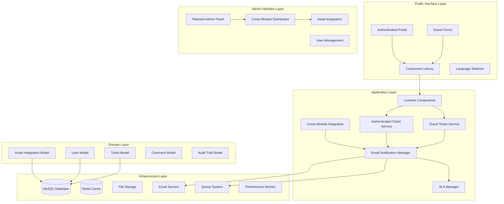
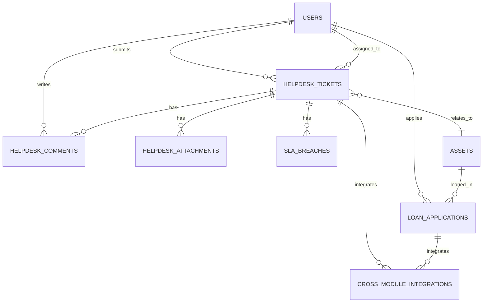

# Updated Helpdesk Module - Design Document

## Overview

The Updated Helpdesk Module design implements a sophisticated **hybrid architecture** that seamlessly integrates guest-only public forms with authenticated portal features while maintaining cross-module integration with the asset loan system. This design evolution preserves the proven guest-only functionality while adding comprehensive authenticated features and enhanced administrative capabilities.

**Critical Design Evolution**: The system transitions from a simple guest-only model to a hybrid architecture supporting dual access modes (guest + authenticated) with cross-module integration, a unified component library, and enhanced performance optimization.

**Version**: 2.0.0 (SemVer)
**Last Updated**: 8 November 2025
**Status**: Active - Integration Design
**Classification**: Restricted - Internal MOTAC BPM

## Key Design Decisions

### 1. Hybrid Architecture Implementation

**Decision**: Implement dual access modes (guest and authenticated) with shared backend services and unified component library.

**Rationale**:

- Maintains simplicity of guest access for public users
- Provides enhanced, secure features for authenticated staff
- Ensures backward compatibility with existing workflows
- Seamless user experience across ICTServe ecosystem

**Impact**:

- Shared service layer for both access modes
- Dual UI paths (public forms + authenticated portal)
- Unified data models with nullable user relationships
- Consistent email workflows for both user types

### 2. Cross-Module Integration Strategy

**Decision**: Deep integration with asset loan system through shared data models and automated workflows.

**Rationale**:

- Comprehensive ICT service management
- Reduces data duplication
- Enables automated maintenance workflows
- Improves operational efficiency

**Impact**:

- Foreign key relationships between modules
- Automated ticket creation from asset system
- Unified admin dashboard
- Cross-module audit trails

### 3. Email-First Communication Strategy

**Decision**: Retain email as primary interaction channel with 60-second delivery SLA.

**Rationale**:

- Reliable communication without requiring immediate login
- Comprehensive audit trail
- Supports offline workflows
- Integrates with existing MOTAC infrastructure

**Impact**:

- Queue-based email processing system
- Bilingual email templates
- Automated status notifications
- Email response handling mechanism

### 4. Unified Component Library and WCAG 2.2 AA Compliance

**Decision**: Full adoption of ICTServe component library with strict WCAG 2.2 Level AA adherence.

**Rationale**:

- Consistent look and feel across modules
- Improved maintainability
- Legal compliance with government standards
- Enhanced accessibility for all users

**Impact**:

- Standardized UI components (x-category.component-name)
- Consistent accessibility features
- Unified styling with compliant color palette
- D00-D15 traceability for all UI elements

### 5. Enhanced Performance Architecture

**Decision**: Implement OptimizedLivewireComponent trait with Core Web Vitals targets.

**Rationale**:

- Supports increased functionality without degradation
- Meets government service quality standards
- Excellent user experience
- Real-time performance monitoring

**Impact**:

- Component-level caching
- Lazy loading for non-critical elements
- Query optimization (N+1 prevention)
- Image optimization (WebP format)
- Laravel Telescope integration

### 6. Four-Role RBAC Implementation

**Decision**: Upgrade to four-role system (Staff, Approver, Admin, Superuser) with cross-module permissions.

**Rationale**:

- Supports complex organizational hierarchy
- Enables sophisticated cross-module workflows
- Granular access control
- Integrates with central ICTServe user system

**Impact**:

- Enhanced permission system using Spatie
- Role-based UI rendering
- Comprehensive audit trails for role-based actions
- Cross-module permission inheritance

## Architecture

### System Architecture Diagram



### Technology Stack

| Component              | Technology        | Version | Purpose                    |
| ---------------------- | ----------------- | ------- | -------------------------- |
| Backend Framework      | Laravel           | 12.x    | Core application framework |
| Frontend Components    | Livewire          | 3.x     | Dynamic UI components      |
| Single-File Components | Volt              | 1.x     | Simplified development     |
| Admin Interface        | Filament          | 4.x     | Administrative panels      |
| Database               | MySQL             | 8.0+    | Data persistence           |
| Cache                  | Redis             | 7.0+    | Performance optimization   |
| Styling                | Tailwind CSS      | 3.x     | UI styling                 |
| Build Tool             | Vite              | 4.x     | Asset compilation          |
| Performance Monitoring | Laravel Telescope | 4.x     | Real-time tracking         |
| Broadcasting           | Laravel Echo      | 2.x     | Real-time updates          |

## Components and Interfaces

### Data Models

#### HelpdeskTicket Model (Hybrid Support)

**Purpose**: Central model supporting both guest and authenticated ticket submissions with cross-module integration.

**Key Fields**:

- `ticket_number`: Unique identifier (HD[YYYY][NNNNNN])
- `user_id`: Nullable foreign key for authenticated submissions
- `guest_*`: Fields for guest submission data
- `asset_id`: Foreign key for cross-module integration
- `priority`, `status`, `category`: Ticket classification
- `resolved_at`, `closed_at`: Lifecycle timestamps

**Relationships**:

- `user()`: BelongsTo User (nullable)
- `assignedAgent()`: BelongsTo User
- `comments()`: HasMany HelpdeskComment
- `attachments()`: HasMany HelpdeskAttachment
- `relatedAsset()`: BelongsTo Asset
- `slaBreaches()`: HasMany HelpdeskSLABreach

**Helper Methods**:

- `isGuestSubmission()`: Check if ticket is from guest
- `isAuthenticatedSubmission()`: Check if ticket is from authenticated user
- `getSubmitterName()`: Get submitter name (guest or user)
- `getSubmitterEmail()`: Get submitter email
- `hasRelatedAsset()`: Check for asset integration
- `isMaintenanceTicket()`: Check if maintenance category

#### User Model (Four-Role RBAC)

**Purpose**: Enhanced user model supporting four-role RBAC with cross-module relationships.

**Key Fields**:

- `name`, `email`, `password`: Authentication
- `phone`, `staff_id`, `grade`, `division`: Staff information
- `notification_preferences`: JSON field for email preferences

**Relationships**:

- `helpdeskTickets()`: HasMany HelpdeskTicket
- `assignedTickets()`: HasMany HelpdeskTicket (as agent)
- `helpdeskComments()`: HasMany HelpdeskComment
- `loanApplications()`: HasMany LoanApplication
- `approvedLoanApplications()`: HasMany LoanApplication

**Role Methods**:

- `isStaff()`, `isApprover()`, `isAdmin()`, `isSuperuser()`: Role checks
- `canApproveLoans()`: Cross-module permission
- `canAccessAdminPanel()`: Admin access check
- `canManageUsers()`: User management permission

**Notification Methods**:

- `wantsEmailNotifications(string $type)`: Check preference
- `updateNotificationPreference(string $type, bool $enabled)`: Update preference

#### CrossModuleIntegration Model

**Purpose**: Track and manage integration events between helpdesk and asset loan modules.

**Key Fields**:

- `helpdesk_ticket_id`: Foreign key to ticket
- `asset_loan_id`: Foreign key to loan application
- `integration_type`: Type of integration
- `trigger_event`: Event that triggered integration
- `integration_data`: JSON field for additional data
- `processed_at`: Processing timestamp

**Integration Types**:

- `TYPE_ASSET_DAMAGE_REPORT`: Asset damage reporting
- `TYPE_MAINTENANCE_REQUEST`: Maintenance request
- `TYPE_ASSET_TICKET_LINK`: General asset-ticket linking

**Trigger Events**:

- `EVENT_ASSET_RETURNED_DAMAGED`: Asset returned with damage
- `EVENT_TICKET_ASSET_SELECTED`: Ticket linked to asset
- `EVENT_MAINTENANCE_SCHEDULED`: Maintenance scheduled

### Service Layer

#### HybridHelpdeskService

**Purpose**: Core service managing both guest and authenticated ticket operations.

**Key Methods**:

```php
// Guest ticket operations
createGuestTicket(array $data): HelpdeskTicket
claimGuestTicket(string $email, int $userId): bool

// Authenticated ticket operations
createAuthenticatedTicket(array $data): HelpdeskTicket
updateTicket(int $ticketId, array $data): HelpdeskTicket

// Common operations
assignTicket(int $ticketId, int $agentId): void
updateStatus(int $ticketId, string $status): void
addComment(int $ticketId, string $comment, bool $internal): void
```

#### CrossModuleIntegrationService

**Purpose**: Manage integration between helpdesk and asset loan modules.

**Key Methods**:

```php
// Asset integration
linkTicketToAsset(int $ticketId, int $assetId): void
createMaintenanceTicketFromAsset(int $assetId, array $damageData): HelpdeskTicket

// Integration tracking
recordIntegrationEvent(string $type, array $data): CrossModuleIntegration
getAssetTicketHistory(int $assetId): Collection
```

#### EmailNotificationService

**Purpose**: Manage email notifications with 60-second SLA.

**Key Methods**:

```php
// Ticket notifications
sendTicketCreatedNotification(HelpdeskTicket $ticket): void
sendTicketStatusUpdateNotification(HelpdeskTicket $ticket): void
sendTicketAssignedNotification(HelpdeskTicket $ticket): void

// SLA notifications
sendSLAWarningNotification(HelpdeskTicket $ticket): void
sendSLABreachNotification(HelpdeskTicket $ticket): void

// Cross-module notifications
sendAssetMaintenanceNotification(HelpdeskTicket $ticket, Asset $asset): void
```

### Livewire Components

#### GuestTicketForm (Volt Component)

**Purpose**: Public form for guest ticket submissions.

**Features**:

- Enhanced guest information fields (name, email, phone, staff_id, grade, division)
- Ticket details (title, description, category, damage_type)
- Optional asset selection for hardware/maintenance categories
- File attachments support
- Real-time validation with debouncing
- WCAG 2.2 AA compliant UI

**Component Structure**:

- Uses `OptimizedLivewireComponent` trait
- Implements `WithFileUploads` for attachments
- Debounced input validation (300ms)
- Accessible form controls with ARIA attributes

#### AuthenticatedTicketForm (Volt Component)

**Purpose**: Enhanced form for authenticated user ticket submissions.

**Features**:

- Auto-populated user information
- Enhanced ticket details with priority selection
- Internal notes field
- Asset selection with real-time filtering
- File attachments with drag-and-drop
- Real-time status tracking

**Additional Capabilities**:

- Priority selection (low, medium, high, critical)
- Internal notes for staff communication
- Enhanced asset integration
- Submission history access

#### TicketDashboard (Volt Component)

**Purpose**: Authenticated user dashboard for ticket management.

**Features**:

- My Open Tickets section
- My Resolved Tickets section
- Recent Activity feed
- Quick Actions menu
- Real-time updates using Laravel Echo
- Notification center

### Filament Resources

#### HelpdeskTicketResource

**Purpose**: Admin interface for comprehensive ticket management.

**Features**:

- List view with advanced filtering
- Detailed ticket view with timeline
- Status management workflow
- Assignment interface
- Cross-module asset integration display
- Bulk actions support

**Filters**:

- Status (open, in_progress, resolved, closed)
- Priority (low, medium, high, critical)
- Category (hardware, software, network, maintenance, other)
- Submission type (guest, authenticated)
- Date range
- Assigned agent

**Actions**:

- Assign ticket
- Update status
- Add comment
- Link to asset
- Export ticket data
- Send notification

#### CrossModuleDashboard (Filament Page)

**Purpose**: Unified dashboard for helpdesk and asset loan analytics.

**Widgets**:

- Ticket volume metrics
- Resolution time statistics
- SLA compliance rates
- Guest vs authenticated submission ratios
- Asset-related ticket statistics
- Cross-module efficiency metrics

**Features**:

- Real-time data updates
- Customizable date ranges
- Export capabilities
- Role-based visibility
- WCAG 2.2 AA compliant visualizations

## Data Models

### Database Schema

#### helpdesk_tickets Table

```sql
CREATE TABLE helpdesk_tickets (
    id BIGINT UNSIGNED PRIMARY KEY AUTO_INCREMENT,
    ticket_number VARCHAR(20) UNIQUE NOT NULL,
    user_id BIGINT UNSIGNED NULL,
    assigned_to BIGINT UNSIGNED NULL,

    -- Guest submission fields
    guest_name VARCHAR(255) NULL,
    guest_email VARCHAR(255) NULL,
    guest_phone VARCHAR(20) NULL,
    guest_staff_id VARCHAR(50) NULL,
    guest_grade VARCHAR(10) NULL,
    guest_division VARCHAR(100) NULL,

    -- Ticket details
    title VARCHAR(255) NOT NULL,
    description TEXT NOT NULL,
    category ENUM('hardware', 'software', 'network', 'maintenance', 'other') NOT NULL,
    priority ENUM('low', 'medium', 'high', 'critical') DEFAULT 'medium',
    status ENUM('open', 'in_progress', 'resolved', 'closed') DEFAULT 'open',
    damage_type VARCHAR(255) NOT NULL,

    -- Cross-module integration
    asset_id BIGINT UNSIGNED NULL,

    -- Timestamps
    resolved_at TIMESTAMP NULL,
    closed_at TIMESTAMP NULL,
    created_at TIMESTAMP DEFAULT CURRENT_TIMESTAMP,
    updated_at TIMESTAMP DEFAULT CURRENT_TIMESTAMP ON UPDATE CURRENT_TIMESTAMP,

    -- Indexes
    INDEX idx_user_id (user_id),
    INDEX idx_assigned_to (assigned_to),
    INDEX idx_asset_id (asset_id),
    INDEX idx_status (status),
    INDEX idx_priority (priority),
    INDEX idx_guest_email (guest_email),
    INDEX idx_created_at (created_at),

    -- Foreign keys
    FOREIGN KEY (user_id) REFERENCES users(id) ON DELETE SET NULL,
    FOREIGN KEY (assigned_to) REFERENCES users(id) ON DELETE SET NULL,
    FOREIGN KEY (asset_id) REFERENCES assets(id) ON DELETE SET NULL
) ENGINE=InnoDB DEFAULT CHARSET=utf8mb4 COLLATE=utf8mb4_unicode_ci;
```

#### cross_module_integrations Table

```sql
CREATE TABLE cross_module_integrations (
    id BIGINT UNSIGNED PRIMARY KEY AUTO_INCREMENT,
    helpdesk_ticket_id BIGINT UNSIGNED NOT NULL,
    asset_loan_id BIGINT UNSIGNED NULL,
    integration_type VARCHAR(50) NOT NULL,
    trigger_event VARCHAR(50) NOT NULL,
    integration_data JSON NULL,
    processed_at TIMESTAMP NULL,
    created_at TIMESTAMP DEFAULT CURRENT_TIMESTAMP,
    updated_at TIMESTAMP DEFAULT CURRENT_TIMESTAMP ON UPDATE CURRENT_TIMESTAMP,

    -- Indexes
    INDEX idx_ticket_id (helpdesk_ticket_id),
    INDEX idx_loan_id (asset_loan_id),
    INDEX idx_integration_type (integration_type),

    -- Foreign keys
    FOREIGN KEY (helpdesk_ticket_id) REFERENCES helpdesk_tickets(id) ON DELETE CASCADE,
    FOREIGN KEY (asset_loan_id) REFERENCES loan_applications(id) ON DELETE SET NULL
) ENGINE=InnoDB DEFAULT CHARSET=utf8mb4 COLLATE=utf8mb4_unicode_ci;
```

### Relationships Diagram



## Error Handling

### Error Categories

1. **Validation Errors**: User input validation failures
2. **Authentication Errors**: Login and permission issues
3. **Integration Errors**: Cross-module communication failures
4. **Email Errors**: Notification delivery failures
5. **Performance Errors**: Timeout and resource issues

### Error Handling Strategy

**Validation Errors**:

- Real-time client-side validation
- Server-side validation with clear messages
- ARIA live regions for screen reader announcements
- Bilingual error messages

**Authentication Errors**:

- Graceful redirect to login
- Session timeout handling
- Permission denied messages
- Audit trail logging

**Integration Errors**:

- Retry mechanism with exponential backoff
- Fallback to manual processing
- Admin notification
- Comprehensive error logging

**Email Errors**:

- Queue retry (3 attempts)
- Failed job logging
- Admin dashboard alerts
- Alternative notification channels

**Performance Errors**:

- Timeout handling with user feedback
- Resource limit monitoring
- Automatic scaling triggers
- Performance degradation alerts

## Testing Strategy

### Unit Testing

**Models**:

- Relationship integrity
- Helper method functionality
- Validation rules
- Scope queries

**Services**:

- Business logic correctness
- Error handling
- Integration workflows
- Email generation

### Feature Testing

**Guest Workflows**:

- Ticket submission
- Email confirmation
- Ticket claiming
- Status tracking

**Authenticated Workflows**:

- Login and authentication
- Ticket submission with enhanced features
- Dashboard functionality
- Profile management

**Admin Workflows**:

- Ticket management
- User management
- Cross-module integration
- Analytics and reporting

**Cross-Module Integration**:

- Asset-ticket linking
- Automated maintenance ticket creation
- Integration event tracking
- Data consistency

### Integration Testing

**Email System**:

- Queue processing
- Template rendering
- Delivery confirmation
- Bilingual support

**Performance**:

- Core Web Vitals measurement
- Load testing
- Stress testing
- Concurrent user simulation

**Accessibility**:

- WCAG 2.2 AA automated testing
- Keyboard navigation
- Screen reader compatibility
- Color contrast verification

### Browser Testing

**Supported Browsers**:

- Chrome/Edge (latest 2 versions)
- Firefox (latest 2 versions)
- Safari (latest 2 versions)
- Mobile browsers (iOS Safari, Chrome Mobile)

**Test Scenarios**:

- Form submission
- File uploads
- Real-time updates
- Responsive design
- Accessibility features

## Performance Optimization

### Frontend Optimization

**Asset Optimization**:

- WebP image format with JPEG fallbacks
- Lazy loading for non-critical images
- Critical CSS inlining
- JavaScript code splitting
- Vite build optimization

**Component Optimization**:

- OptimizedLivewireComponent trait
- Lazy loading with #[Lazy] attribute
- Debounced input handling (300ms)
- Computed properties caching
- Efficient DOM updates

**Caching Strategy**:

- Browser caching headers
- Service worker for offline support
- LocalStorage for user preferences
- Session storage for form data

### Backend Optimization

**Database Optimization**:

- Eager loading to prevent N+1 queries
- Indexed columns for frequent queries
- Query result caching
- Database connection pooling
- Optimized pagination

**Queue Optimization**:

- Redis queue driver
- Job batching for bulk operations
- Priority queues for critical tasks
- Failed job retry mechanism
- Queue monitoring and alerting

**Cache Strategy**:

- Redis caching layer
- Model caching with automatic invalidation
- Route caching
- Config caching
- View caching

### Performance Monitoring

**Metrics Tracked**:

- Core Web Vitals (LCP, FID, CLS, TTFB)
- Server response time
- Database query time
- Queue processing time
- Cache hit rate
- Cross-module integration latency

**Monitoring Tools**:

- Laravel Telescope for development
- Application Performance Monitoring (APM) for production
- Real-time alerting system
- Performance dashboard
- Automated performance testing

## Security Considerations

### Authentication and Authorization

**Authentication**:

- Laravel Breeze for authenticated portal
- Session-based authentication
- CSRF protection
- Password hashing (bcrypt)
- Remember me functionality

**Authorization**:

- Four-role RBAC (Staff, Approver, Admin, Superuser)
- Spatie Laravel Permission package
- Policy-based authorization
- Gate-based access control
- Cross-module permission inheritance

### Data Protection

**Encryption**:

- AES-256 encryption for sensitive data at rest
- TLS 1.3 for data in transit
- Encrypted database backups
- Secure file storage

**PDPA 2010 Compliance**:

- Consent management for data collection
- Data retention policies (7 years for audit logs)
- Data subject rights (access, correction, deletion)
- Secure data disposal
- Privacy policy enforcement

### Audit Trail

**Logged Events**:

- Guest form submissions
- Authenticated user actions
- Cross-module interactions
- Administrative changes
- Email notifications
- Permission changes
- Data exports

**Audit Log Features**:

- Immutable logs
- Timestamp accuracy (within 1 second)
- User/guest identification
- Action details
- Before/after state
- IP address logging
- 7-year retention period

## Deployment Strategy

### Environment Configuration

**Development**:

- Local MySQL database
- Local Redis instance
- Vite dev server
- Laravel Telescope enabled
- Debug mode enabled

**Staging**:

- Staging database (copy of production schema)
- Redis cluster
- Compiled assets
- Performance monitoring
- Debug mode disabled

**Production**:

- Production database with replication
- Redis cluster with failover
- Optimized assets
- Full monitoring suite
- Debug mode disabled
- Error tracking

### Migration Strategy

**Phase 1: Preparation**

- Database schema updates
- Component library integration
- Service layer implementation
- Testing suite completion

**Phase 2: Soft Launch**

- Deploy to staging environment
- User acceptance testing
- Performance validation
- Security audit

**Phase 3: Production Deployment**

- Database migration execution
- Asset compilation and deployment
- Cache warming
- Monitoring activation

**Phase 4: Post-Deployment**

- Performance monitoring
- User feedback collection
- Bug fixing
- Optimization iterations

### Rollback Plan

**Rollback Triggers**:

- Critical bugs affecting core functionality
- Performance degradation beyond acceptable limits
- Security vulnerabilities
- Data integrity issues

**Rollback Procedure**:

1. Stop incoming traffic
2. Restore previous application version
3. Rollback database migrations
4. Clear caches
5. Restore traffic
6. Verify functionality
7. Communicate with stakeholders

## Maintenance and Support

### Monitoring

**Application Monitoring**:

- Error rate tracking
- Response time monitoring
- Queue health monitoring
- Cache performance tracking
- Cross-module integration health

**Infrastructure Monitoring**:

- Server resource utilization
- Database performance
- Redis performance
- Network latency
- Storage capacity

### Backup Strategy

**Database Backups**:

- Daily full backups
- Hourly incremental backups
- 30-day retention period
- Encrypted backup storage
- Regular restore testing

**File Backups**:

- Daily file system backups
- Attachment storage backups
- 30-day retention period
- Offsite backup storage

### Support Procedures

**Issue Classification**:

- Critical: System down, data loss
- High: Major functionality broken
- Medium: Minor functionality issues
- Low: Cosmetic issues, enhancements

**Response Times**:

- Critical: 1 hour
- High: 4 hours
- Medium: 1 business day
- Low: 1 week

**Escalation Path**:

1. First-line support (Admin users)
2. Development team
3. Technical lead
4. System architect
5. BPM stakeholders

## Compliance and Standards

### D00-D15 Framework Alignment

- **D00 System Overview**: Hybrid architecture integration
- **D03 Software Requirements**: Enhanced functional requirements
- **D04 Software Design**: This document
- **D09 Database Documentation**: Schema and audit requirements
- **D10 Source Code Documentation**: Component metadata
- **D11 Technical Design**: Infrastructure and security
- **D12 UI/UX Design Guide**: Component library integration
- **D13 Frontend Framework**: Livewire and Tailwind implementation
- **D14 UI/UX Style Guide**: MOTAC branding consistency
- **D15 Language Support**: Bilingual implementation

### WCAG 2.2 Level AA Compliance

**Implemented Standards**:

- SC 1.3.1: Semantic HTML and ARIA landmarks
- SC 1.4.3: 4.5:1 text contrast, 3:1 UI contrast
- SC 1.4.11: 3:1 non-text contrast
- SC 2.4.1: Skip links for keyboard navigation
- SC 2.4.6: Proper heading hierarchy
- SC 2.4.7: Visible focus indicators (3-4px outline)
- SC 2.4.11: Focus not obscured (NEW)
- SC 2.5.8: 44×44px minimum touch targets (NEW)
- SC 4.1.3: ARIA live regions for status messages

### Performance Standards

**Core Web Vitals Targets**:

- LCP (Largest Contentful Paint): <2.5s
- FID (First Input Delay): <100ms
- CLS (Cumulative Layout Shift): <0.1
- TTFB (Time to First Byte): <600ms

**Lighthouse Scores**:

- Performance: 90+
- Accessibility: 100
- Best Practices: 100
- SEO: 100

## Future Enhancements

### Planned Features

**Phase 2 Enhancements**:

- AI-powered ticket categorization
- Chatbot for common queries
- Advanced analytics dashboard
- Mobile application
- API for third-party integrations

**Phase 3 Enhancements**:

- Knowledge base integration
- Self-service portal
- Automated ticket routing
- Predictive maintenance
- Advanced reporting

### Scalability Considerations

**Horizontal Scaling**:

- Load balancer configuration
- Stateless application design
- Distributed caching
- Database read replicas
- Queue worker scaling

**Vertical Scaling**:

- Database optimization
- Cache optimization
- Code optimization
- Asset optimization
- Infrastructure upgrades

## Conclusion

The Updated Helpdesk Module design provides a comprehensive, scalable, and accessible solution for ICT service management at MOTAC. The hybrid architecture ensures backward compatibility while enabling enhanced features for authenticated users. Cross-module integration with the asset loan system provides a unified ICT service management experience.

Key design principles:

- **User-Centric**: Dual access modes for different user needs
- **Accessible**: WCAG 2.2 AA compliance throughout
- **Performant**: Core Web Vitals targets achieved
- **Secure**: Four-role RBAC with comprehensive audit trails
- **Maintainable**: Unified component library and clear architecture
- **Scalable**: Modular design supporting future growth

This design aligns with all ICTServe specifications and D00-D15 documentation requirements, ensuring a cohesive and compliant implementation.
