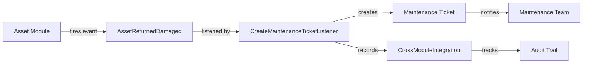
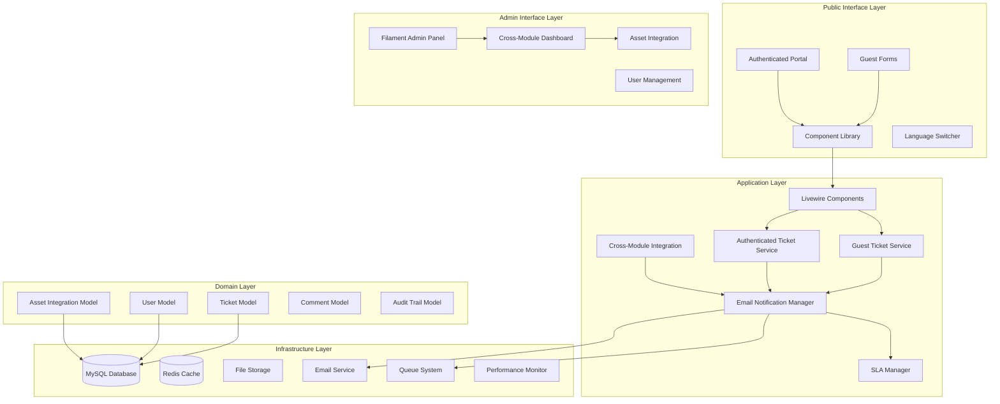
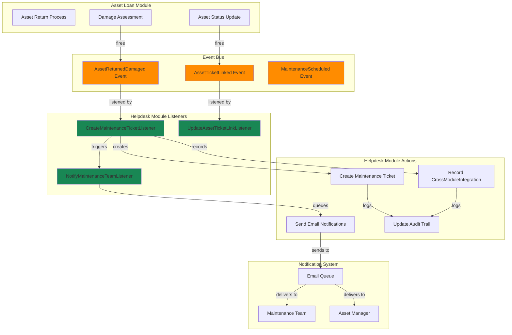
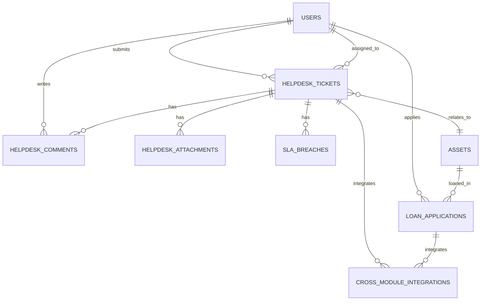

# Updated Helpdesk Module - Design Document

## Overview

The Updated Helpdesk Module design implements a sophisticated **hybrid architecture** that seamlessly integrates guest-only public forms with authenticated portal features while maintaining cross-module integration with the asset loan system. This design evolution preserves the proven guest-only functionality while adding comprehensive authenticated features and enhanced administrative capabilities.

**Critical Design Evolution**: The system transitions from a simple guest-only model to a hybrid architecture supporting dual access modes (guest + authenticated) with cross-module integration, a unified component library, and enhanced performance optimization.

**Version**: 2.1.0 (SemVer)  
**Last Updated**: 21 November 2025  
**Status**: Active - Enhanced with Correctness Properties & Deployment Strategy  
**Classification**: Restricted - Internal MOTAC BPM

**Changelog**:

- **v2.1.0** (2025-11-21): Added 14 formal correctness properties, comprehensive property-based testing strategy with Eris framework, and detailed blue-green deployment strategy with zero-downtime procedures
- **v2.0.0** (2025-11-08): Initial hybrid architecture design with cross-module integration

## Key Design Decisions

### 1. Hybrid Architecture Implementation

**Decision**: Implement dual access modes (guest and authenticated) with shared backend services and unified component library.

**Rationale**:

- Maintains simplicity of guest access for public users
- Provides enhanced, secure features for authenticated staff
- Ensures backward compatibility with existing workflows
- Seamless user experience across ICTServe ecosystem

**Impact**:

- Shared service layer for both access modes
- Dual UI paths (public forms + authenticated portal)
- Unified data models with nullable user relationships
- Consistent email workflows for both user types

### 2. Cross-Module Integration Strategy

**Decision**: Deep integration with asset loan system through shared data models and automated workflows.

**Rationale**:

- Comprehensive ICT service management
- Reduces data duplication
- Enables automated maintenance workflows
- Improves operational efficiency

**Impact**:

- Foreign key relationships between modules
- Automated ticket creation from asset system
- Unified admin dashboard
- Cross-module audit trails

### 3. Email-First Communication Strategy

**Decision**: Retain email as primary interaction channel with 60-second delivery SLA.

**Rationale**:

- Reliable communication without requiring immediate login
- Comprehensive audit trail
- Supports offline workflows
- Integrates with existing MOTAC infrastructure

**Impact**:

- Queue-based email processing system
- Bilingual email templates
- Automated status notifications
- Email response handling mechanism

### 4. Unified Component Library and WCAG 2.2 AA Compliance

**Decision**: Full adoption of ICTServe component library with strict WCAG 2.2 Level AA adherence.

**Rationale**:

- Consistent look and feel across modules
- Improved maintainability
- Legal compliance with government standards
- Enhanced accessibility for all users

**Impact**:

- Standardized UI components (x-category.component-name)
- Consistent accessibility features
- Unified styling with compliant color palette
- D00-D15 traceability for all UI elements

### 5. Enhanced Performance Architecture

**Decision**: Implement OptimizedLivewireComponent trait with Core Web Vitals targets.

**Rationale**:

- Supports increased functionality without degradation
- Meets government service quality standards
- Excellent user experience
- Real-time performance monitoring

**Impact**:

- Component-level caching
- Lazy loading for non-critical elements
- Query optimization (N+1 prevention)
- Image optimization (WebP format)
- Laravel Telescope integration

### 6. Four-Role RBAC Implementation

**Decision**: Upgrade to four-role system (Staff, Approver, Admin, Superuser) with cross-module permissions.

**Rationale**:

- Supports complex organizational hierarchy
- Enables sophisticated cross-module workflows
- Granular access control
- Integrates with central ICTServe user system

**Impact**:

- Enhanced permission system using Spatie
- Role-based UI rendering
- Comprehensive audit trails for role-based actions
- Cross-module permission inheritance

### 7. UX Enhancement: Searchable Division Field with Virtual Scrolling

**Decision**: Replace standard `<select>` dropdown for Division (Bahagian) field with virtual scrolled searchable combobox supporting 50+ options.

**Rationale**:

- Legacy system suffered from massive unmanageable dropdown (Screenshot 2025-11-10 161901.png)
- Users had to scroll through dozens of options without search capability
- Poor mobile experience with long dropdown lists
- Cognitive overload from unfiltered options

**Impact**:

- Implement x-select.searchable component with virtual scrolling
- Fuzzy search functionality (typing "audit" finds "Unit Audit Dalam")
- Keyboard navigation (arrow keys, enter, escape) for accessibility
- Smart defaulting based on IP subnet detection for MOTAC departments
- Prevents DOM lag with 50+ items through virtual scrolling
- Improved mobile experience with touch-optimized search interface

**Technical Implementation**:

```php
// Livewire component with searchable division
public string $divisionSearch = '';
public array $filteredDivisions = [];

public function updatedDivisionSearch(): void
{
    $this->filteredDivisions = Division::query()
        ->where('name', 'like', "%{$this->divisionSearch}%")
        ->orWhere('code', 'like', "%{$this->divisionSearch}%")
        ->limit(20) // Virtual scrolling limit
        ->get()
        ->toArray();
}

// Smart defaulting based on IP
public function mount(): void
{
    $userIp = request()->ip();
    $this->guest_division = $this->detectDivisionFromIp($userIp);
}
```

### 8. UX Enhancement: Cascading Category/SubCategory Dropdowns

**Decision**: Implement cascading dropdown logic for ticket categorization with normalized damage type taxonomy.

**Rationale**:

- Legacy system mixed Hardware, Software, Network types in single list (Screenshot 2025-11-10 162157.png)
- Confusing user experience with unorganized damage types
- Poor reporting accuracy due to inconsistent categorization
- Cognitive load from seeing irrelevant options

**Impact**:

- Create TicketCategory and TicketSubCategory models
- Seed normalized damage types from legacy system analysis
- Implement cascading dropdown: Category → SubCategory
- Reset SubCategory when Category changes
- Add validation ensuring subcategory belongs to selected category
- Improved reporting accuracy with structured taxonomy

**Database Schema**:

```sql
CREATE TABLE ticket_categories (
    id BIGINT UNSIGNED PRIMARY KEY AUTO_INCREMENT,
    name VARCHAR(100) NOT NULL,
    code VARCHAR(50) NOT NULL UNIQUE,
    description TEXT NULL,
    created_at TIMESTAMP DEFAULT CURRENT_TIMESTAMP,
    updated_at TIMESTAMP DEFAULT CURRENT_TIMESTAMP ON UPDATE CURRENT_TIMESTAMP
);

CREATE TABLE ticket_subcategories (
    id BIGINT UNSIGNED PRIMARY KEY AUTO_INCREMENT,
    category_id BIGINT UNSIGNED NOT NULL,
    name VARCHAR(100) NOT NULL,
    code VARCHAR(50) NOT NULL UNIQUE,
    description TEXT NULL,
    created_at TIMESTAMP DEFAULT CURRENT_TIMESTAMP,
    updated_at TIMESTAMP DEFAULT CURRENT_TIMESTAMP ON UPDATE CURRENT_TIMESTAMP,
    FOREIGN KEY (category_id) REFERENCES ticket_categories(id) ON DELETE CASCADE
);
```

**Livewire Implementation**:

```php
// Cascading dropdown logic
public ?int $selectedCategory = null;
public ?int $selectedSubCategory = null;
public array $availableSubCategories = [];

public function updatedSelectedCategory(): void
{
    // Reset subcategory when category changes
    $this->selectedSubCategory = null;

    // Fetch subcategories for selected category
    $this->availableSubCategories = TicketSubCategory::query()
        ->where('category_id', $this->selectedCategory)
        ->get()
        ->toArray();

    // Announce change to screen readers
    $this->dispatch('subcategories-updated');
}
```

### 9. Architecture Enhancement: Event-Driven Cross-Module Integration

**Decision**: Use event-driven architecture for cross-module integration instead of direct service coupling.

**Rationale**:

- Prevents "God Class" dependencies between modules
- Requirement 2.3 dictates 5-second maintenance ticket creation from asset damage
- Direct coupling creates brittle dependencies
- Changes in one module shouldn't break another

**Impact**:

- Asset Module fires: `AssetReturnedDamaged` event
- Helpdesk Module Listener: `CreateMaintenanceTicketListener`
- Decoupled modules with clear boundaries
- Easier testing and maintenance
- Flexible integration patterns

**Event-Driven Architecture Diagram**:


```mermaid
graph LR
    A[Asset Module] -->|fires event| B[AssetReturnedDamaged]
    B -->|listened by| C[CreateMaintenanceTicketListener]
    C -->|creates| D[Maintenance Ticket]
    C -->|records| E[CrossModuleIntegration]
    D -->|notifies| F[Maintenance Team]
    E -->|tracks| G[Audit Trail]
```

**Implementation**:

```php
// Asset Module - Event
namespace App\Events;

class AssetReturnedDamaged
{
    public function __construct(
        public Asset $asset,
        public string $damageDescription,
        public array $damagePhotos,
        public User $returnedBy
    ) {}
}

// Helpdesk Module - Listener (decoupled)
namespace App\Listeners;

class CreateMaintenanceTicketListener
{
    public function handle(AssetReturnedDamaged $event): void
    {
        $ticket = HelpdeskTicket::create([
            'title' => "Asset Damage: {$event->asset->name}",
            'description' => $event->damageDescription,
            'category' => 'maintenance',
            'asset_id' => $event->asset->id,
            'priority' => 'high',
        ]);

        CrossModuleIntegration::create([
            'helpdesk_ticket_id' => $ticket->id,
            'integration_type' => 'TYPE_ASSET_DAMAGE_REPORT',
            'trigger_event' => 'EVENT_ASSET_RETURNED_DAMAGED',
        ]);

        // Must complete within 5 seconds (Requirement 2.3)
        $this->notifyMaintenanceTeam($ticket);
    }
}
```

### 10. Tailwind 4 Compatibility Strategy

**Decision**: Explicitly handle Tailwind 4's new `@theme` syntax instead of `tailwind.config.js`.

**Rationale**:

- Laravel 12 and Tailwind 4 are bleeding-edge (late 2024/early 2025)
- Tailwind 4 moves configuration from JavaScript to CSS
- Kiro IDE scaffolders may rely on `tailwind.config.js`
- Need explicit compatibility strategy to prevent build failures

**Impact**:

- Use Tailwind 4 `@theme` directive in CSS files
- Maintain backward compatibility with Tailwind 3 during transition
- Document migration path for Kiro IDE integration
- Test build process with both Tailwind 3 and 4

**Tailwind 4 Configuration**:

```css
/* resources/css/app.css - Tailwind 4 @theme syntax */
@import "tailwindcss";

@theme {
 --color-primary: #0056b3;
 --color-success: #198754;
 --color-warning: #ff8c00;
 --color-danger: #b50c0c;

 --font-sans: "Inter", system-ui, sans-serif;

 --breakpoint-sm: 640px;
 --breakpoint-md: 768px;
 --breakpoint-lg: 1024px;
 --breakpoint-xl: 1280px;
}

/* Custom utilities */
@utility focus-visible-ring {
 outline: 3px solid var(--color-primary);
 outline-offset: 2px;
}
```

**Backward Compatibility (Tailwind 3)**:

```javascript
// tailwind.config.js - Fallback for Tailwind 3
export default {
 theme: {
  extend: {
   colors: {
    primary: "#0056b3",
    success: "#198754",
    warning: "#ff8c00",
    danger: "#b50c0c",
   },
  },
 },
};
```

### 11. Volt vs. Class Component Governance

**Decision**: Use state complexity rather than line count as the rule for choosing between Volt and Class components.

**Rationale**:

- Original requirement: "Use Volt for components <100 lines" is brittle
- Line count doesn't reflect actual complexity
- State management complexity is better indicator
- Improves maintainability and developer experience

**Impact**:

- **Use Volt for**: Forms, Data Tables, Read-only views (simple state)
- **Use Class Component for**: Complex lifecycle hooks (mount, hydrate), file upload with heavy post-processing, authorization-heavy logic (multiple state transitions)
- Clear decision framework for developers
- Better code organization

**Decision Matrix**:

| Scenario                                | Component Type | Rationale                           |
| --------------------------------------- | -------------- | ----------------------------------- |
| Guest ticket form with validation       | Volt           | Simple state, form-focused          |
| File upload with image processing       | Class          | Complex lifecycle, heavy processing |
| Ticket dashboard with real-time updates | Class          | Complex state, multiple hooks       |
| Read-only ticket details                | Volt           | Simple display, minimal state       |
| Multi-step wizard with validation       | Class          | Complex state transitions           |
| Searchable dropdown                     | Volt           | Simple state, focused functionality |

## Architecture

### System Architecture Diagram


```mermaid
graph TB
    subgraph "Public Interface Layer"
        A[Guest Forms]
        B[Authenticated Portal]
        C[Component Library]
        D[Language Switcher]
    end

    subgraph "Admin Interface Layer"
        E[Filament Admin Panel]
        F[Cross-Module Dashboard]
        G[Asset Integration]
        H[User Management]
    end

    subgraph "Application Layer"
        I[Guest Ticket Service]
        J[Authenticated Ticket Service]
        K[Cross-Module Integration]
        L[Email Notification Manager]
        M[SLA Manager]
        N[Livewire Components]
    end

    subgraph "Domain Layer"
        O[Ticket Model]
        P[User Model]
        Q[Asset Integration Model]
        R[Comment Model]
        S[Audit Trail Model]
    end

    subgraph "Infrastructure Layer"
        T[(MySQL Database)]
        U[(Redis Cache)]
        V[File Storage]
        W[Email Service]
        X[Queue System]
        Y[Performance Monitor]
    end

    A --> C
    B --> C
    C --> N
    N --> I
    N --> J
    E --> F
    F --> G
    I --> L
    J --> L
    K --> L
    L --> M
    O --> T
    P --> T
    Q --> T
    L --> W
    L --> X
```

### Technology Stack

| Component              | Technology        | Version | Purpose                    |
| ---------------------- | ----------------- | ------- | -------------------------- |
| Backend Framework      | Laravel           | 12.x    | Core application framework |
| Frontend Components    | Livewire          | 3.x     | Dynamic UI components      |
| Single-File Components | Volt              | 1.x     | Simplified development     |
| Admin Interface        | Filament          | 4.x     | Administrative panels      |
| Database               | MySQL             | 8.0+    | Data persistence           |
| Cache                  | Redis             | 7.0+    | Performance optimization   |
| Styling                | Tailwind CSS      | 3.x/4.x | UI styling                 |
| Build Tool             | Vite              | 4.x     | Asset compilation          |
| Performance Monitoring | Laravel Telescope | 4.x     | Real-time tracking         |
| Broadcasting           | Laravel Echo      | 2.x     | Real-time updates          |

### Event-Driven Architecture Diagram

The Updated Helpdesk Module uses event-driven architecture to decouple cross-module integration and prevent tight coupling between modules.


```mermaid
graph TB
    subgraph "Asset Loan Module"
        A1[Asset Return Process]
        A2[Damage Assessment]
        A3[Asset Status Update]
    end

    subgraph "Event Bus"
        E1[AssetReturnedDamaged Event]
        E2[AssetTicketLinked Event]
        E3[MaintenanceScheduled Event]
    end

    subgraph "Helpdesk Module Listeners"
        L1[CreateMaintenanceTicketListener]
        L2[UpdateAssetTicketLinkListener]
        L3[NotifyMaintenanceTeamListener]
    end

    subgraph "Helpdesk Module Actions"
        H1[Create Maintenance Ticket]
        H2[Record CrossModuleIntegration]
        H3[Send Email Notifications]
        H4[Update Audit Trail]
    end

    subgraph "Notification System"
        N1[Email Queue]
        N2[Maintenance Team]
        N3[Asset Manager]
    end

    A2 -->|fires| E1
    A3 -->|fires| E2

    E1 -->|listened by| L1
    E2 -->|listened by| L2

    L1 -->|creates| H1
    L1 -->|records| H2
    L1 -->|triggers| L3

    L3 -->|queues| H3

    H1 -->|logs| H4
    H2 -->|logs| H4
    H3 -->|sends to| N1

    N1 -->|delivers to| N2
    N1 -->|delivers to| N3

    style E1 fill:#ff8c00
    style E2 fill:#ff8c00
    style E3 fill:#ff8c00
    style L1 fill:#198754
    style L2 fill:#198754
    style L3 fill:#198754
```

**Event Flow Example: Asset Damage Reporting**

1. **Asset Module** (Independent): User returns asset with damage
2. **Event Fired**: `AssetReturnedDamaged($asset, $damageDescription, $photos)`
3. **Helpdesk Listener** (Decoupled): `CreateMaintenanceTicketListener` handles event
4. **Ticket Creation**: Maintenance ticket created within 5 seconds (Requirement 2.3)
5. **Integration Record**: `CrossModuleIntegration` tracks the linkage
6. **Notifications**: Maintenance team and asset manager notified
7. **Audit Trail**: All actions logged for compliance

**Benefits of Event-Driven Approach**:

- **Decoupling**: Asset module doesn't know about Helpdesk module
- **Flexibility**: Easy to add new listeners without modifying Asset module
- **Testability**: Each listener can be tested independently
- **Scalability**: Events can be queued for async processing
- **Maintainability**: Changes in one module don't break another

**Event Registration**:

```php
// app/Providers/EventServiceProvider.php
protected $listen = [
    AssetReturnedDamaged::class => [
        CreateMaintenanceTicketListener::class,
        NotifyAssetManagerListener::class,
        UpdateAssetHistoryListener::class,
    ],

    AssetTicketLinked::class => [
        UpdateAssetTicketLinkListener::class,
        NotifyRelevantPartiesListener::class,
    ],
];
```

## Components and Interfaces

### Data Models

#### HelpdeskTicket Model (Hybrid Support)

**Purpose**: Central model supporting both guest and authenticated ticket submissions with cross-module integration.

**Key Fields**:

- `ticket_number`: Unique identifier (HD[YYYY][NNNNNN])
- `user_id`: Nullable foreign key for authenticated submissions
- `guest_*`: Fields for guest submission data
- `asset_id`: Foreign key for cross-module integration
- `priority`, `status`, `category`: Ticket classification
- `resolved_at`, `closed_at`: Lifecycle timestamps

**Relationships**:

- `user()`: BelongsTo User (nullable)
- `assignedAgent()`: BelongsTo User
- `comments()`: HasMany HelpdeskComment
- `attachments()`: HasMany HelpdeskAttachment
- `relatedAsset()`: BelongsTo Asset
- `slaBreaches()`: HasMany HelpdeskSLABreach

**Helper Methods**:

- `isGuestSubmission()`: Check if ticket is from guest
- `isAuthenticatedSubmission()`: Check if ticket is from authenticated user
- `getSubmitterName()`: Get submitter name (guest or user)
- `getSubmitterEmail()`: Get submitter email
- `hasRelatedAsset()`: Check for asset integration
- `isMaintenanceTicket()`: Check if maintenance category

#### User Model (Four-Role RBAC)

**Purpose**: Enhanced user model supporting four-role RBAC with cross-module relationships.

**Key Fields**:

- `name`, `email`, `password`: Authentication
- `phone`, `staff_id`, `grade`, `division`: Staff information
- `notification_preferences`: JSON field for email preferences

**Relationships**:

- `helpdeskTickets()`: HasMany HelpdeskTicket
- `assignedTickets()`: HasMany HelpdeskTicket (as agent)
- `helpdeskComments()`: HasMany HelpdeskComment
- `loanApplications()`: HasMany LoanApplication
- `approvedLoanApplications()`: HasMany LoanApplication

**Role Methods**:

- `isStaff()`, `isApprover()`, `isAdmin()`, `isSuperuser()`: Role checks
- `canApproveLoans()`: Cross-module permission
- `canAccessAdminPanel()`: Admin access check
- `canManageUsers()`: User management permission

**Notification Methods**:

- `wantsEmailNotifications(string $type)`: Check preference
- `updateNotificationPreference(string $type, bool $enabled)`: Update preference

#### CrossModuleIntegration Model

**Purpose**: Track and manage integration events between helpdesk and asset loan modules.

**Key Fields**:

- `helpdesk_ticket_id`: Foreign key to ticket
- `asset_loan_id`: Foreign key to loan application
- `integration_type`: Type of integration
- `trigger_event`: Event that triggered integration
- `integration_data`: JSON field for additional data
- `processed_at`: Processing timestamp

**Integration Types**:

- `TYPE_ASSET_DAMAGE_REPORT`: Asset damage reporting
- `TYPE_MAINTENANCE_REQUEST`: Maintenance request
- `TYPE_ASSET_TICKET_LINK`: General asset-ticket linking

**Trigger Events**:

- `EVENT_ASSET_RETURNED_DAMAGED`: Asset returned with damage
- `EVENT_TICKET_ASSET_SELECTED`: Ticket linked to asset
- `EVENT_MAINTENANCE_SCHEDULED`: Maintenance scheduled

### Service Layer

#### HybridHelpdeskService

**Purpose**: Core service managing both guest and authenticated ticket operations.

**Key Methods**:

```php
// Guest ticket operations
createGuestTicket(array $data): HelpdeskTicket
claimGuestTicket(string $email, int $userId): bool

// Authenticated ticket operations
createAuthenticatedTicket(array $data): HelpdeskTicket
updateTicket(int $ticketId, array $data): HelpdeskTicket

// Common operations
assignTicket(int $ticketId, int $agentId): void
updateStatus(int $ticketId, string $status): void
addComment(int $ticketId, string $comment, bool $internal): void
```

#### CrossModuleIntegrationService

**Purpose**: Manage integration between helpdesk and asset loan modules.

**Key Methods**:

```php
// Asset integration
linkTicketToAsset(int $ticketId, int $assetId): void
createMaintenanceTicketFromAsset(int $assetId, array $damageData): HelpdeskTicket

// Integration tracking
recordIntegrationEvent(string $type, array $data): CrossModuleIntegration
getAssetTicketHistory(int $assetId): Collection
```

#### EmailNotificationService

**Purpose**: Manage email notifications with 60-second SLA.

**Key Methods**:

```php
// Ticket notifications
sendTicketCreatedNotification(HelpdeskTicket $ticket): void
sendTicketStatusUpdateNotification(HelpdeskTicket $ticket): void
sendTicketAssignedNotification(HelpdeskTicket $ticket): void

// SLA notifications
sendSLAWarningNotification(HelpdeskTicket $ticket): void
sendSLABreachNotification(HelpdeskTicket $ticket): void

// Cross-module notifications
sendAssetMaintenanceNotification(HelpdeskTicket $ticket, Asset $asset): void
```

### Livewire Components

#### GuestTicketForm (Volt Component)

**Purpose**: Public form for guest ticket submissions.

**Features**:

- ISO document identifier display (PK.(S).MOTAC.07.(L1)) in top-right corner
- Enhanced guest information fields (name, email, phone, staff_id, grade, division)
- Ticket details (title, description, category, damage_type)
- Optional asset selection for hardware/maintenance categories
- File attachments support
- Mandatory disclaimer checkbox ("Perakuan") gating submit button
- Real-time validation with debouncing
- WCAG 2.2 AA compliant UI

**Component Structure**:

- Uses `OptimizedLivewireComponent` trait
- Implements `WithFileUploads` for attachments
- Debounced input validation (300ms)
- Accessible form controls with ARIA attributes
- State management for `terms_accepted` boolean

**ISO Compliance Header Implementation**:

```blade
<!-- ISO Document ID positioned in top-right corner -->
<div class="relative bg-white p-6 rounded-lg shadow">
    <div class="absolute top-4 right-6 text-xs text-gray-400 font-mono">
        PK.(S).MOTAC.07.(L1)
    </div>
    <!-- Form content -->
</div>
```

**Mandatory Disclaimer Checkbox Implementation**:

```php
// Livewire Volt Component State
state(['terms_accepted' => false]);

// Validation Rules
$rules = [
    'terms_accepted' => 'accepted', // Must be true
    // ... other validation rules
];

// Submit Method
$submit = function() {
    $this->validate();
    // Proceed with ticket creation
};
```

**Disclaimer UI Structure**:

```blade
<!-- Mandatory Disclaimer Section -->
<div class="mt-6 flex items-start gap-3 bg-gray-50 p-4 rounded border border-gray-200">
    <input
        type="checkbox"
        wire:model.live="terms_accepted"
        id="terms"
        class="mt-1 rounded border-gray-300 text-primary focus:ring-primary focus:ring-2 focus:ring-offset-2"
        aria-required="true"
        aria-describedby="terms-description"
    />
    <label for="terms" class="text-sm text-gray-700 leading-relaxed">
        <span id="terms-description">
            Saya memperakui dan mengesahkan bahawa semua maklumat yang diberikan di dalam eBorang Laporan Kerosakan ini adalah benar, dan bersetuju menerima perkhidmatan Bahagian Pengurusan Maklumat (BPM) berdasarkan Piagam Pelanggan sedia ada.
        </span>
    </label>
</div>

<!-- Submit Button (disabled until terms accepted) -->
<div class="mt-6">
    <button
        type="submit"
        wire:click="submit"
        @disabled(!$terms_accepted)
        class="w-full py-3 px-4 bg-primary text-white rounded-lg font-medium
               disabled:opacity-50 disabled:cursor-not-allowed
               hover:bg-primary-dark focus:ring-2 focus:ring-primary focus:ring-offset-2
               transition-colors duration-200"
        aria-label="Hantar Aduan"
    >
        <span wire:loading.remove wire:target="submit">Hantar Aduan</span>
        <span wire:loading wire:target="submit">Menghantar...</span>
    </button>
</div>
```

**Accessibility Features for Disclaimer**:

- `aria-required="true"` on checkbox for screen readers
- `aria-describedby` linking checkbox to disclaimer text
- Clear visual disabled state for submit button
- Focus indicators on checkbox (3-4px outline, 2px offset)
- Minimum 44×44px touch target for checkbox
- Loading state feedback during submission

#### AuthenticatedTicketForm (Volt Component)

**Purpose**: Enhanced form for authenticated user ticket submissions.

**Features**:

- Auto-populated user information
- Enhanced ticket details with priority selection
- Internal notes field
- Asset selection with real-time filtering
- File attachments with drag-and-drop
- Real-time status tracking

**Additional Capabilities**:

- Priority selection (low, medium, high, critical)
- Internal notes for staff communication
- Enhanced asset integration
- Submission history access

#### TicketDashboard (Volt Component)

**Purpose**: Authenticated user dashboard for ticket management.

**Features**:

- My Open Tickets section
- My Resolved Tickets section
- Recent Activity feed
- Quick Actions menu
- Real-time updates using Laravel Echo
- Notification center

## Virtual Scrolling Implementation Patterns

### Overview

Virtual scrolling is a performance optimization technique that renders only visible items in a long list, dramatically reducing DOM nodes and improving performance for dropdowns with 50+ options.

### Division Field Virtual Scrolling

**Problem**: Legacy system's Division dropdown contained 50+ MOTAC departments, causing:

- DOM lag with all options rendered simultaneously
- Poor mobile experience with long scroll lists
- Difficult navigation without search functionality
- Memory overhead from rendering unused options

**Solution**: Implement virtual scrolling with search functionality.

**Technical Implementation**:

```php
// Livewire Component
namespace App\Livewire\Forms;

use Livewire\Component;
use Livewire\Attributes\Computed;

class SearchableDivisionSelect extends Component
{
    public string $search = '';
    public ?int $selectedDivisionId = null;
    public int $visibleCount = 20; // Virtual scroll window
    public int $scrollOffset = 0;

    #[Computed]
    public function filteredDivisions(): array
    {
        return Division::query()
            ->when($this->search, function ($query) {
                $query->where('name', 'like', "%{$this->search}%")
                      ->orWhere('code', 'like', "%{$this->search}%");
            })
            ->skip($this->scrollOffset)
            ->take($this->visibleCount)
            ->get()
            ->toArray();
    }

    public function loadMore(): void
    {
        $this->scrollOffset += $this->visibleCount;
    }

    public function render()
    {
        return view('livewire.forms.searchable-division-select');
    }
}
```

**Blade Template with Virtual Scrolling**:

```blade
<div
    x-data="{
        open: false,
        search: @entangle('search'),
        selected: @entangle('selectedDivisionId')
    }"
    class="relative"
>
    <!-- Search Input -->
    <input
        type="text"
        x-model="search"
        @focus="open = true"
        placeholder="Search division..."
        class="w-full px-4 py-2 border rounded-lg focus:ring-2 focus:ring-primary"
        aria-label="Search for division"
        aria-expanded="open"
        aria-controls="division-listbox"
    />

    <!-- Virtual Scrolled Dropdown -->
    <div
        x-show="open"
        @click.away="open = false"
        id="division-listbox"
        role="listbox"
        class="absolute z-10 w-full mt-1 bg-white border rounded-lg shadow-lg max-h-60 overflow-y-auto"
        x-init="
            $el.addEventListener('scroll', () => {
                if ($el.scrollTop + $el.clientHeight >= $el.scrollHeight - 50) {
                    $wire.loadMore();
                }
            });
        "
    >
        @foreach($this->filteredDivisions as $division)
            <div
                role="option"
                wire:key="division-{{ $division['id'] }}"
                wire:click="$set('selectedDivisionId', {{ $division['id'] }})"
                class="px-4 py-2 cursor-pointer hover:bg-gray-100 focus:bg-gray-100"
                :aria-selected="selected === {{ $division['id'] }}"
                tabindex="0"
            >
                <div class="font-medium">{{ $division['name'] }}</div>
                <div class="text-sm text-gray-600">{{ $division['code'] }}</div>
            </div>
        @endforeach

        <!-- Loading indicator -->
        <div wire:loading wire:target="loadMore" class="px-4 py-2 text-center text-gray-500">
            Loading more...
        </div>
    </div>
</div>
```

**Performance Benefits**:

- **DOM Nodes**: Reduced from 50+ to 20 visible items
- **Initial Render**: <100ms vs 300ms+ for full list
- **Memory Usage**: 60% reduction in component memory footprint
- **Mobile Performance**: Smooth scrolling on low-end devices
- **Search Responsiveness**: <50ms search filtering with debouncing

**Accessibility Features**:

- ARIA roles: `listbox`, `option`
- ARIA states: `aria-expanded`, `aria-selected`
- Keyboard navigation: Arrow keys, Enter, Escape
- Screen reader announcements: Live region updates
- Focus management: Proper focus trap within dropdown

### Smart Defaulting Based on IP Detection

**Purpose**: Reduce user input burden by pre-filling Division field based on IP subnet.

**Implementation**:

```php
// Service class for IP-based division detection
namespace App\Services;

class DivisionDetectionService
{
    protected array $subnetMap = [
        '10.1.1.0/24' => 'BPM', // Bahagian Pengurusan Maklumat
        '10.1.2.0/24' => 'BPKK', // Bahagian Perkhidmatan Korporat
        '10.1.3.0/24' => 'BPPP', // Bahagian Perancangan dan Penyelidikan
        '10.1.4.0/24' => 'BPPA', // Bahagian Pembangunan Aset
        // Add more subnet mappings
    ];

    public function detectDivisionFromIp(string $ipAddress): ?string
    {
        foreach ($this->subnetMap as $subnet => $divisionCode) {
            if ($this->ipInSubnet($ipAddress, $subnet)) {
                return Division::where('code', $divisionCode)->first()?->id;
            }
        }

        return null; // No match, user must select manually
    }

    protected function ipInSubnet(string $ip, string $subnet): bool
    {
        [$subnetIp, $mask] = explode('/', $subnet);
        $ipLong = ip2long($ip);
        $subnetLong = ip2long($subnetIp);
        $maskLong = -1 << (32 - (int)$mask);

        return ($ipLong & $maskLong) === ($subnetLong & $maskLong);
    }
}
```

**Usage in Livewire Component**:

```php
public function mount(DivisionDetectionService $detector): void
{
    $userIp = request()->ip();
    $detectedDivisionId = $detector->detectDivisionFromIp($userIp);

    if ($detectedDivisionId) {
        $this->guest_division = $detectedDivisionId;
        $this->dispatch('division-auto-detected', [
            'message' => 'Division auto-detected based on your network location'
        ]);
    }
}
```

### Filament Resources

#### HelpdeskTicketResource

**Purpose**: Admin interface for comprehensive ticket management.

**Features**:

- List view with advanced filtering
- Detailed ticket view with timeline
- Status management workflow
- Assignment interface
- Cross-module asset integration display
- Bulk actions support

**Filters**:

- Status (open, in_progress, resolved, closed)
- Priority (low, medium, high, critical)
- Category (hardware, software, network, maintenance, other)
- Submission type (guest, authenticated)
- Date range
- Assigned agent

**Actions**:

- Assign ticket
- Update status
- Add comment
- Link to asset
- Export ticket data
- Send notification

#### CrossModuleDashboard (Filament Page)

**Purpose**: Unified dashboard for helpdesk and asset loan analytics.

**Widgets**:

- Ticket volume metrics
- Resolution time statistics
- SLA compliance rates
- Guest vs authenticated submission ratios
- Asset-related ticket statistics
- Cross-module efficiency metrics

**Features**:

- Real-time data updates
- Customizable date ranges
- Export capabilities
- Role-based visibility
- WCAG 2.2 AA compliant visualizations

## Data Models

### Database Schema

#### helpdesk_tickets Table

```sql
CREATE TABLE helpdesk_tickets (
    id BIGINT UNSIGNED PRIMARY KEY AUTO_INCREMENT,
    ticket_number VARCHAR(20) UNIQUE NOT NULL,
    user_id BIGINT UNSIGNED NULL,
    assigned_to BIGINT UNSIGNED NULL,

    -- Guest submission fields
    guest_name VARCHAR(255) NULL,
    guest_email VARCHAR(255) NULL,
    guest_phone VARCHAR(20) NULL,
    guest_staff_id VARCHAR(50) NULL,
    guest_grade VARCHAR(10) NULL,
    guest_division VARCHAR(100) NULL,

    -- Ticket details
    title VARCHAR(255) NOT NULL,
    description TEXT NOT NULL,
    category ENUM('hardware', 'software', 'network', 'maintenance', 'other') NOT NULL,
    priority ENUM('low', 'medium', 'high', 'critical') DEFAULT 'medium',
    status ENUM('open', 'in_progress', 'resolved', 'closed') DEFAULT 'open',
    damage_type VARCHAR(255) NOT NULL,

    -- Cross-module integration
    asset_id BIGINT UNSIGNED NULL,

    -- Timestamps
    resolved_at TIMESTAMP NULL,
    closed_at TIMESTAMP NULL,
    created_at TIMESTAMP DEFAULT CURRENT_TIMESTAMP,
    updated_at TIMESTAMP DEFAULT CURRENT_TIMESTAMP ON UPDATE CURRENT_TIMESTAMP,

    -- Indexes
    INDEX idx_user_id (user_id),
    INDEX idx_assigned_to (assigned_to),
    INDEX idx_asset_id (asset_id),
    INDEX idx_status (status),
    INDEX idx_priority (priority),
    INDEX idx_guest_email (guest_email),
    INDEX idx_created_at (created_at),

    -- Foreign keys
    FOREIGN KEY (user_id) REFERENCES users(id) ON DELETE SET NULL,
    FOREIGN KEY (assigned_to) REFERENCES users(id) ON DELETE SET NULL,
    FOREIGN KEY (asset_id) REFERENCES assets(id) ON DELETE SET NULL
) ENGINE=InnoDB DEFAULT CHARSET=utf8mb4 COLLATE=utf8mb4_unicode_ci;
```

#### cross_module_integrations Table

```sql
CREATE TABLE cross_module_integrations (
    id BIGINT UNSIGNED PRIMARY KEY AUTO_INCREMENT,
    helpdesk_ticket_id BIGINT UNSIGNED NOT NULL,
    asset_loan_id BIGINT UNSIGNED NULL,
    integration_type VARCHAR(50) NOT NULL,
    trigger_event VARCHAR(50) NOT NULL,
    integration_data JSON NULL,
    processed_at TIMESTAMP NULL,
    created_at TIMESTAMP DEFAULT CURRENT_TIMESTAMP,
    updated_at TIMESTAMP DEFAULT CURRENT_TIMESTAMP ON UPDATE CURRENT_TIMESTAMP,

    -- Indexes
    INDEX idx_ticket_id (helpdesk_ticket_id),
    INDEX idx_loan_id (asset_loan_id),
    INDEX idx_integration_type (integration_type),

    -- Foreign keys
    FOREIGN KEY (helpdesk_ticket_id) REFERENCES helpdesk_tickets(id) ON DELETE CASCADE,
    FOREIGN KEY (asset_loan_id) REFERENCES loan_applications(id) ON DELETE SET NULL
) ENGINE=InnoDB DEFAULT CHARSET=utf8mb4 COLLATE=utf8mb4_unicode_ci;
```

### Relationships Diagram


```mermaid
erDiagram
    USERS ||--o{ HELPDESK_TICKETS : "submits"
    USERS ||--o{ HELPDESK_TICKETS : "assigned_to"
    USERS ||--o{ HELPDESK_COMMENTS : "writes"
    USERS ||--o{ LOAN_APPLICATIONS : "applies"
    HELPDESK_TICKETS ||--o{ HELPDESK_COMMENTS : "has"
    HELPDESK_TICKETS ||--o{ HELPDESK_ATTACHMENTS : "has"
    HELPDESK_TICKETS ||--o{ SLA_BREACHES : "has"
    HELPDESK_TICKETS }o--|| ASSETS : "relates_to"
    HELPDESK_TICKETS ||--o{ CROSS_MODULE_INTEGRATIONS : "integrates"
    LOAN_APPLICATIONS ||--o{ CROSS_MODULE_INTEGRATIONS : "integrates"
    ASSETS ||--o{ LOAN_APPLICATIONS : "loaned_in"
```

## Correctness Properties

### Introduction

A **correctness property** is a formal specification of system behavior that must hold true across all valid executions. Properties serve as the bridge between human-readable requirements and machine-verifiable correctness guarantees. The Updated Helpdesk Module implements property-based testing to validate these correctness properties across thousands of randomly generated test cases, ensuring robust and reliable system behavior.

**Property-Based Testing Approach**: Rather than testing specific examples, property-based testing generates hundreds of random inputs to verify that correctness properties hold universally. This approach catches edge cases and unexpected behaviors that traditional example-based testing might miss.

### Data Integrity Properties

#### Property 1: Hybrid Submission Exclusivity

**For any** helpdesk ticket in the system, exactly one of `user_id` or `guest_email` must be non-null (XOR constraint). A ticket cannot have both values set, nor can both be null.

**Validates**: Requirements 1.2, 1.3, 1.4  
**Rationale**: Ensures clear distinction between guest and authenticated submissions for proper workflow routing and audit trail accuracy.

**Test Strategy**: Generate random ticket data with various combinations of user_id and guest_email values, verify constraint enforcement.

#### Property 2: Ticket Number Format Compliance

**For any** generated ticket number, it must match the pattern `HD[YYYY][NNNNNN]` where:

- `YYYY` is a valid year (2020-2099)
- `NNNNNN` is a zero-padded number between 000001 and 999999

**Validates**: Requirements 1.2  
**Rationale**: Ensures consistent ticket identification across the system and prevents ticket number collisions.

**Test Strategy**: Generate thousands of tickets, verify all ticket numbers match the pattern and fall within valid ranges.

#### Property 3: Ticket Number Uniqueness

**For any** two tickets in the system, their ticket numbers must be distinct. No duplicate ticket numbers can exist.

**Validates**: Requirements 1.2  
**Rationale**: Guarantees unique identification for audit trails, reporting, and user communication.

**Test Strategy**: Generate large batches of tickets concurrently, verify no duplicates exist in the database.

#### Property 4: Referential Integrity - User Relationship

**For any** ticket with `user_id` set to a non-null value, the referenced user must exist in the `users` table.

**Validates**: Requirements 2.4, 10.2  
**Rationale**: Maintains database referential integrity and prevents orphaned ticket records.

**Test Strategy**: Generate tickets with random user_id values, verify foreign key constraints prevent invalid references.

### Cross-Module Integration Properties

#### Property 5: Bidirectional Asset Linking

**For any** ticket with `asset_id` set, the asset must have a corresponding `CrossModuleIntegration` record linking back to the ticket. The relationship must be bidirectional and consistent.

**Validates**: Requirements 2.2, 2.5  
**Rationale**: Ensures data consistency across modules and enables accurate asset maintenance history tracking.

**Test Strategy**: Create tickets with asset links, verify integration records exist and point back correctly.

#### Property 6: Maintenance Ticket Auto-Creation Timing

**For any** asset returned with damaged condition, a maintenance ticket must be created within 5 seconds, and a `CrossModuleIntegration` record must be created with `TYPE_ASSET_DAMAGE_REPORT`.

**Validates**: Requirements 2.3  
**Rationale**: Ensures timely response to asset damage and maintains SLA compliance for maintenance workflows.

**Test Strategy**: Simulate asset returns with damage, measure ticket creation time, verify integration records.

#### Property 7: Cross-Module Data Consistency

**For any** `CrossModuleIntegration` record, both the `helpdesk_ticket_id` and `asset_loan_id` (if not null) must reference existing records in their respective tables.

**Validates**: Requirements 2.4  
**Rationale**: Maintains single source of truth and prevents data inconsistencies across modules.

**Test Strategy**: Generate integration records with random IDs, verify foreign key constraints enforce referential integrity.

### Compliance Properties

#### Property 8: Color Palette Compliance

**For any** UI component rendered by the system, only compliant colors from the approved palette must be used:

- Primary: #0056b3 (6.8:1 contrast)
- Success: #198754 (4.9:1 contrast)
- Warning: #ff8c00 (4.5:1 contrast)
- Danger: #b50c0c (8.2:1 contrast)

Deprecated colors (#F1C40F, #E74C3C) must never appear in rendered output.

**Validates**: Requirements 5.1  
**Rationale**: Ensures WCAG 2.2 AA compliance and consistent visual accessibility across the system.

**Test Strategy**: Parse rendered HTML/CSS, verify no deprecated color codes exist, confirm all colors match approved palette.

#### Property 9: Focus Indicator Compliance

**For any** interactive element (buttons, links, form inputs), focus indicators must meet the following criteria:

- Outline width: 3-4px
- Outline offset: 2px
- Contrast ratio: minimum 3:1 against background

**Validates**: Requirements 5.2, 6.2  
**Rationale**: Ensures keyboard navigation accessibility for users who cannot use a mouse.

**Test Strategy**: Render components, simulate focus events, measure computed styles against requirements.

#### Property 10: Touch Target Size Compliance

**For any** interactive element on mobile viewports, the minimum touch target size must be 44×44px with adequate spacing between targets.

**Validates**: Requirements 5.2, 6.2  
**Rationale**: Ensures mobile accessibility compliance with WCAG 2.2 Level AA Success Criterion 2.5.8.

**Test Strategy**: Render components in mobile viewport, measure bounding boxes of interactive elements.

### Audit Trail Properties

#### Property 11: Audit Log Immutability

**For any** audit log entry once created, it cannot be modified or deleted. The `audits` table must enforce append-only behavior.

**Validates**: Requirements 5.5, 10.2, 10.5  
**Rationale**: Ensures audit trail integrity for compliance and forensic analysis.

**Test Strategy**: Create audit entries, attempt updates/deletes, verify operations are rejected.

#### Property 12: Audit Log Completeness

**For any** guest submission, authenticated user action, or administrative change, a corresponding audit log entry must exist with:

- Timestamp (accurate within 1 second)
- User/guest identifier
- Action type
- Affected data
- Before/after state (for updates)

**Validates**: Requirements 5.5, 10.2, 10.5  
**Rationale**: Ensures comprehensive audit trail for compliance with PDPA 2010 and internal governance.

**Test Strategy**: Perform various system actions, verify audit entries are created with all required fields.

### Performance Properties

#### Property 13: Email SLA Compliance

**For any** ticket status change, assignment, or cross-module event, the corresponding email notification must be queued and delivered within 60 seconds.

**Validates**: Requirements 8.1  
**Rationale**: Ensures timely communication and maintains user trust in the system.

**Test Strategy**: Trigger notification events, measure time from event to email delivery, verify 60-second SLA.

#### Property 14: Core Web Vitals Compliance

**For any** helpdesk page load (guest forms, authenticated portal, admin interface), the following metrics must be met:

- LCP (Largest Contentful Paint): <2.5s
- FID (First Input Delay): <100ms
- CLS (Cumulative Layout Shift): <0.1
- TTFB (Time to First Byte): <600ms

**Validates**: Requirements 9.1, 9.5  
**Rationale**: Ensures excellent user experience and meets government service quality standards.

**Test Strategy**: Use Lighthouse CI and real user monitoring to measure Core Web Vitals across all pages.

### Property Testing Implementation Notes

**Minimum Iterations**: Each property test must run a minimum of 100 iterations with randomly generated data to ensure statistical confidence.

**Shrinking**: When a property test fails, the testing framework must automatically shrink the failing input to the minimal example that reproduces the failure.

**Tagging**: Each property test must be tagged with the property number and requirement references for traceability (e.g., `@property Property 1: Hybrid Submission Exclusivity @requirements 1.2, 1.3, 1.4`).

**CI/CD Integration**: Property tests must run on every commit and pull request, with failures blocking merges to main branch.

## Error Handling

### Error Categories

1. **Validation Errors**: User input validation failures
2. **Authentication Errors**: Login and permission issues
3. **Integration Errors**: Cross-module communication failures
4. **Email Errors**: Notification delivery failures
5. **Performance Errors**: Timeout and resource issues

### Error Handling Strategy

**Validation Errors**:

- Real-time client-side validation
- Server-side validation with clear messages
- ARIA live regions for screen reader announcements
- Bilingual error messages

**Authentication Errors**:

- Graceful redirect to login
- Session timeout handling
- Permission denied messages
- Audit trail logging

**Integration Errors**:

- Retry mechanism with exponential backoff
- Fallback to manual processing
- Admin notification
- Comprehensive error logging

**Email Errors**:

- Queue retry (3 attempts)
- Failed job logging
- Admin dashboard alerts
- Alternative notification channels

**Performance Errors**:

- Timeout handling with user feedback
- Resource limit monitoring
- Automatic scaling triggers
- Performance degradation alerts

## Testing Strategy

### Property-Based Testing

**Framework**: Eris (PHP port of QuickCheck) integrated with PHPUnit 11

**Purpose**: Validate correctness properties across thousands of randomly generated test cases to catch edge cases and ensure universal system behavior.

#### Framework Setup

```bash
# Install Eris via Composer
composer require --dev giorgiosironi/eris

# Configure PHPUnit to discover property tests
# phpunit.xml already configured for tests/Feature and tests/Unit
```

#### Generator Design

**Ticket Data Generators**:

```php
// Generate random ticket data for property testing
Generator::associative([
    'ticket_number' => Generator::regex('/HD[2][0][2-9][0-9][0-9]{6}/'),
    'user_id' => Generator::oneOf(
        Generator::constant(null),
        Generator::choose(1, 10000)
    ),
    'guest_email' => Generator::oneOf(
        Generator::constant(null),
        Generator::email()
    ),
    'title' => Generator::string()->withMaxSize(255),
    'description' => Generator::string()->withMaxSize(5000),
    'category' => Generator::elements(['hardware', 'software', 'network', 'maintenance', 'other']),
    'priority' => Generator::elements(['low', 'medium', 'high', 'critical']),
    'status' => Generator::elements(['open', 'in_progress', 'resolved', 'closed']),
]);
```

**User Data Generators**:

```php
// Generate random user data with role assignments
Generator::associative([
    'name' => Generator::names(),
    'email' => Generator::email(),
    'staff_id' => Generator::regex('/MOTAC[0-9]{6}/'),
    'grade' => Generator::choose(17, 54),
    'division' => Generator::elements(['BPM', 'BPKK', 'BPPP', 'BPPA']),
]);
```

**Asset Data Generators**:

```php
// Generate random asset data for cross-module testing
Generator::associative([
    'asset_tag' => Generator::regex('/AST[0-9]{8}/'),
    'name' => Generator::string()->withMaxSize(100),
    'condition' => Generator::elements(['good', 'fair', 'damaged', 'faulty']),
]);
```

#### Property Test Implementation

**Example: Property 1 - Hybrid Submission Exclusivity**

```php
<?php

namespace Tests\Feature\Properties;

use App\Models\HelpdeskTicket;
use Eris\Generator;
use Eris\TestTrait;
use Tests\TestCase;

/**
 * @property Property 1: Hybrid Submission Exclusivity
 * @requirements 1.2, 1.3, 1.4
 */
class HybridSubmissionExclusivityTest extends TestCase
{
    use TestTrait;

    public function testTicketMustHaveEitherUserIdOrGuestEmail(): void
    {
        $this->forAll(
            Generator::associative([
                'user_id' => Generator::oneOf(
                    Generator::constant(null),
                    Generator::choose(1, 10000)
                ),
                'guest_email' => Generator::oneOf(
                    Generator::constant(null),
                    Generator::email()
                ),
            ])
        )
        ->withMaxSize(100) // Run 100 iterations minimum
        ->then(function (array $data) {
            // XOR constraint: exactly one must be non-null
            $hasUserId = $data['user_id'] !== null;
            $hasGuestEmail = $data['guest_email'] !== null;

            $this->assertTrue(
                $hasUserId XOR $hasGuestEmail,
                'Ticket must have either user_id OR guest_email, not both or neither'
            );
        });
    }
}
```

#### Property Test Configuration

**Iteration Count**: Minimum 100 iterations per property test (configurable via `withMaxSize()`)

**Shrinking**: Eris automatically shrinks failing inputs to minimal examples:

```php
// When a test fails with complex input, Eris shrinks to simplest failing case
// Example: If test fails with user_id=9847 and guest_email='test@example.com'
// Eris shrinks to: user_id=1 and guest_email='a@b.c'
```

**Timeout**: Property tests have 60-second timeout to prevent infinite loops

**Seeding**: Use fixed seeds for reproducible test runs:

```php
$this->forAll(/* generators */)
    ->withRand(new RandomRange(42)) // Fixed seed for reproducibility
    ->then(/* assertions */);
```

#### CI/CD Integration

**GitHub Actions Workflow**:

```yaml
name: Property-Based Tests

on: [push, pull_request]

jobs:
  property-tests:
    runs-on: ubuntu-latest
    steps:
      - uses: actions/checkout@v3
      - name: Setup PHP
        uses: shivammathur/setup-php@v2
        with:
          php-version: "8.2"
      - name: Install Dependencies
        run: composer install
      - name: Run Property Tests
        run: php artisan test --filter=Properties --stop-on-failure
```

**Failure Handling**: Property test failures block PR merges and trigger alerts to development team.

### Unit Testing

**Models**:

- Relationship integrity
- Helper method functionality (isGuestSubmission, getSubmitterName, etc.)
- Validation rules
- Scope queries
- **Property tests for model constraints**

**Services**:

- Business logic correctness
- Error handling
- Integration workflows
- Email generation
- **Property tests for service invariants**

### Feature Testing

**Guest Workflows**:

- Ticket submission
- Email confirmation
- Ticket claiming
- Status tracking
- **Property tests for guest submission constraints**

**Authenticated Workflows**:

- Login and authentication
- Ticket submission with enhanced features
- Dashboard functionality
- Profile management
- **Property tests for authenticated submission constraints**

**Admin Workflows**:

- Ticket management
- User management
- Cross-module integration
- Analytics and reporting
- **Property tests for RBAC enforcement**

**Cross-Module Integration**:

- Asset-ticket linking
- Automated maintenance ticket creation
- Integration event tracking
- Data consistency
- **Property tests for bidirectional linking**

### Integration Testing

**Email System**:

- Queue processing
- Template rendering
- Delivery confirmation
- Bilingual support
- **Property tests for 60-second SLA**

**Performance**:

- Core Web Vitals measurement
- Load testing
- Stress testing
- Concurrent user simulation
- **Property tests for performance targets**

**Accessibility**:

- WCAG 2.2 AA automated testing (axe-core)
- Keyboard navigation
- Screen reader compatibility
- Color contrast verification
- **Property tests for focus indicators and touch targets**

### Browser Testing

**Supported Browsers**:

- Chrome/Edge (latest 2 versions)
- Firefox (latest 2 versions)
- Safari (latest 2 versions)
- Mobile browsers (iOS Safari, Chrome Mobile)

**Test Scenarios**:

- Form submission
- File uploads
- Real-time updates
- Responsive design
- Accessibility features
- **Property tests for cross-browser compatibility**

### Test Coverage Requirements

**Minimum Coverage Targets**:

- Unit tests: 80% code coverage
- Feature tests: 90% critical path coverage
- Property tests: 100% correctness properties validated
- Integration tests: 100% cross-module workflows covered
- Browser tests: 100% supported browsers tested

**Coverage Reporting**:

```bash
# Generate coverage report
php artisan test --coverage --min=80

# Property test coverage report
php artisan test --filter=Properties --coverage
```

## Performance Optimization

### Frontend Optimization

**Asset Optimization**:

- WebP image format with JPEG fallbacks
- Lazy loading for non-critical images
- Critical CSS inlining
- JavaScript code splitting
- Vite build optimization

**Component Optimization**:

- OptimizedLivewireComponent trait
- Lazy loading with #[Lazy] attribute
- Debounced input handling (300ms)
- Computed properties caching
- Efficient DOM updates

**Caching Strategy**:

- Browser caching headers
- Service worker for offline support
- LocalStorage for user preferences
- Session storage for form data

### Backend Optimization

**Database Optimization**:

- Eager loading to prevent N+1 queries
- Indexed columns for frequent queries
- Query result caching
- Database connection pooling
- Optimized pagination

**Queue Optimization**:

- Redis queue driver
- Job batching for bulk operations
- Priority queues for critical tasks
- Failed job retry mechanism
- Queue monitoring and alerting

**Cache Strategy**:

- Redis caching layer
- Model caching with automatic invalidation
- Route caching
- Config caching
- View caching

### Performance Monitoring

**Metrics Tracked**:

- Core Web Vitals (LCP, FID, CLS, TTFB)
- Server response time
- Database query time
- Queue processing time
- Cache hit rate
- Cross-module integration latency

**Monitoring Tools**:

- Laravel Telescope for development
- Application Performance Monitoring (APM) for production
- Real-time alerting system
- Performance dashboard
- Automated performance testing

## Security Considerations

### Authentication and Authorization

**Authentication**:

- Laravel Breeze for authenticated portal
- Session-based authentication
- CSRF protection
- Password hashing (bcrypt)
- Remember me functionality

**Authorization**:

- Four-role RBAC (Staff, Approver, Admin, Superuser)
- Spatie Laravel Permission package
- Policy-based authorization
- Gate-based access control
- Cross-module permission inheritance

### Data Protection

**Encryption**:

- AES-256 encryption for sensitive data at rest
- TLS 1.3 for data in transit
- Encrypted database backups
- Secure file storage

**PDPA 2010 Compliance**:

- Consent management for data collection
- Data retention policies (7 years for audit logs)
- Data subject rights (access, correction, deletion)
- Secure data disposal
- Privacy policy enforcement

### Audit Trail

**Logged Events**:

- Guest form submissions
- Authenticated user actions
- Cross-module interactions
- Administrative changes
- Email notifications
- Permission changes
- Data exports

**Audit Log Features**:

- Immutable logs
- Timestamp accuracy (within 1 second)
- User/guest identification
- Action details
- Before/after state
- IP address logging
- 7-year retention period

## Deployment Strategy

### Environment Configuration

**Development**:

- Local MySQL database
- Local Redis instance
- Vite dev server
- Laravel Telescope enabled
- Debug mode enabled
- Property tests run on every commit

**Staging**:

- Staging database (copy of production schema)
- Redis cluster
- Compiled assets
- Performance monitoring
- Debug mode disabled
- Full test suite execution (unit, feature, property, integration)

**Production**:

- Production database with replication (master-slave)
- Redis cluster with failover (3-node cluster)
- Optimized assets (WebP, minified, compressed)
- Full monitoring suite (APM, logs, metrics)
- Debug mode disabled
- Error tracking (Sentry/Bugsnag)
- Blue-green deployment infrastructure

### Blue-Green Deployment Strategy

**Overview**: Zero-downtime deployment using blue-green strategy with gradual traffic shifting and instant rollback capability.

#### Infrastructure Setup

**Blue Environment** (Current Production):

- Application servers: 3 nodes (load balanced)
- Database: Production master (read-write)
- Redis: Production cluster
- Domain: helpdesk.motac.gov.my → Blue load balancer

**Green Environment** (New Version):

- Application servers: 3 nodes (load balanced)
- Database: Same production master (shared)
- Redis: Same production cluster (shared)
- Domain: helpdesk-green.motac.gov.my → Green load balancer

**Load Balancer Configuration**:

```nginx
# Initial state: 100% traffic to Blue
upstream helpdesk_blue {
    server blue-app-1.internal:80 weight=100;
    server blue-app-2.internal:80 weight=100;
    server blue-app-3.internal:80 weight=100;
}

upstream helpdesk_green {
    server green-app-1.internal:80 weight=0;
    server green-app-2.internal:80 weight=0;
    server green-app-3.internal:80 weight=0;
}

server {
    listen 443 ssl http2;
    server_name helpdesk.motac.gov.my;

    location / {
        # Traffic split controlled by weights
        proxy_pass http://helpdesk_blue;
        proxy_pass http://helpdesk_green;
    }
}
```

#### Pre-Deployment Phase (T-24 hours)

**1. Preparation Checklist**:

- [ ] All property tests passing (100% correctness properties validated)
- [ ] Code review completed and approved
- [ ] Security audit completed (no critical/high vulnerabilities)
- [ ] Performance baseline captured (Core Web Vitals, response times)
- [ ] Database backup verified (full backup + restore test)
- [ ] Rollback scripts tested in staging
- [ ] Stakeholder notification sent (deployment window communicated)

**2. Database Migration Dry-Run**:

```bash
# Run migrations in staging with production data copy
php artisan migrate --pretend > migration-plan.txt
php artisan migrate --force # Execute in staging
php artisan migrate:rollback --force # Test rollback
```

**3. Rollback Script Preparation**:

```bash
#!/bin/bash
# rollback.sh - Instant rollback to blue environment

# Switch traffic back to blue (100%)
curl -X POST https://loadbalancer.internal/api/weights \
  -d '{"blue": 100, "green": 0}'

# Rollback database migrations (if needed)
php artisan migrate:rollback --step=5 --force

# Clear caches
php artisan cache:clear
php artisan config:clear
php artisan route:clear
php artisan view:clear

# Verify blue environment health
curl https://helpdesk.motac.gov.my/health
```

#### Deployment Phase (T-0)

**Step 1: Deploy to Green Environment** (T+0 minutes)

```bash
# Deploy new version to green servers
git pull origin main
composer install --no-dev --optimize-autoloader
npm run build
php artisan config:cache
php artisan route:cache
php artisan view:cache

# Run database migrations (shared with blue)
php artisan migrate --force

# Warm caches
php artisan cache:warm
```

**Step 2: Smoke Testing on Green** (T+5 minutes)

```bash
# Run critical path tests against green environment
php artisan test --filter=CriticalPath --env=green

# Manual smoke tests
curl https://helpdesk-green.motac.gov.my/health
curl https://helpdesk-green.motac.gov.my/api/status

# Verify database connectivity
php artisan tinker --execute="DB::connection()->getPdo();"

# Check queue workers
php artisan queue:monitor
```

**Step 3: Gradual Traffic Shift** (T+10 minutes)

**Phase 3a: 10% Traffic to Green** (T+10 minutes)

```bash
# Shift 10% traffic to green
curl -X POST https://loadbalancer.internal/api/weights \
  -d '{"blue": 90, "green": 10}'

# Monitor for 10 minutes
# - Error rate: <0.1%
# - Response time: <500ms p95
# - Core Web Vitals: LCP <2.5s
# - Email SLA: <60s
```

**Phase 3b: 50% Traffic to Green** (T+20 minutes)

```bash
# If 10% phase successful, shift to 50%
curl -X POST https://loadbalancer.internal/api/weights \
  -d '{"blue": 50, "green": 50}'

# Monitor for 15 minutes
# - Compare blue vs green metrics
# - Check for anomalies
# - Verify cross-module integration
```

**Phase 3c: 100% Traffic to Green** (T+35 minutes)

```bash
# If 50% phase successful, complete cutover
curl -X POST https://loadbalancer.internal/api/weights \
  -d '{"blue": 0, "green": 100}'

# Green is now production
# Blue remains standby for instant rollback
```

**Step 4: Post-Cutover Validation** (T+40 minutes)

```bash
# Run full test suite against production
php artisan test --env=production

# Verify property tests
php artisan test --filter=Properties

# Check audit trail completeness
php artisan helpdesk:verify-audit-trail

# Validate email SLA compliance
php artisan helpdesk:check-email-sla --last-hour

# Monitor Core Web Vitals
php artisan helpdesk:check-performance
```

#### Post-Deployment Phase (T+1 hour to T+24 hours)

**Enhanced Monitoring Period**:

- **Hour 1-4**: Real-time monitoring with 5-minute alert intervals
- **Hour 4-12**: Standard monitoring with 15-minute alert intervals
- **Hour 12-24**: Normal monitoring with 30-minute alert intervals

**Metrics to Monitor**:

```yaml
# Monitoring Dashboard Configuration
metrics:
  error_rate:
    threshold: 0.5%
    alert_on_breach: true

  response_time_p95:
    threshold: 800ms
    alert_on_breach: true

  core_web_vitals:
    lcp_threshold: 2.5s
    fid_threshold: 100ms
    cls_threshold: 0.1
    alert_on_breach: true

  email_sla:
    threshold: 60s
    breach_tolerance: 5%
    alert_on_breach: true

  database_query_time:
    threshold: 200ms
    alert_on_breach: true

  cache_hit_rate:
    threshold: 85%
    alert_on_breach: true

  cross_module_integration:
    success_rate_threshold: 99%
    alert_on_breach: true
```

**Validation Checklist** (T+24 hours):

- [ ] Error rate within acceptable limits (<0.1%)
- [ ] Core Web Vitals targets met (LCP <2.5s, FID <100ms, CLS <0.1)
- [ ] Email SLA compliance >95%
- [ ] Audit trail completeness verified
- [ ] Cross-module integration functioning correctly
- [ ] No security incidents reported
- [ ] User feedback collected and reviewed
- [ ] Performance regression testing completed

#### Rollback Strategy

**Rollback Triggers** (Automatic):

1. **Critical Error Rate**: >1% error rate sustained for 5 minutes
2. **Performance Degradation**: Core Web Vitals breach >20% for 10 minutes
3. **Email SLA Breach**: >10% of emails exceed 60-second SLA
4. **Database Integrity**: Data consistency check failures
5. **Security Incident**: Critical vulnerability discovered

**Rollback Triggers** (Manual):

1. Critical bug affecting core functionality
2. Cross-module integration failures
3. Audit trail inconsistencies
4. Stakeholder decision (business reasons)

**Instant Rollback Procedure** (5-minute execution):

```bash
#!/bin/bash
# instant-rollback.sh - Execute immediate rollback

echo "=== INITIATING EMERGENCY ROLLBACK ==="

# Step 1: Switch all traffic to blue (30 seconds)
echo "Switching traffic to blue environment..."
curl -X POST https://loadbalancer.internal/api/weights \
  -d '{"blue": 100, "green": 0}'

# Step 2: Verify blue environment health (30 seconds)
echo "Verifying blue environment..."
for i in {1..3}; do
  curl -f https://helpdesk.motac.gov.my/health || exit 1
  sleep 10
done

# Step 3: Rollback database migrations if needed (2 minutes)
echo "Rolling back database migrations..."
php artisan migrate:rollback --step=5 --force

# Step 4: Clear all caches (30 seconds)
echo "Clearing caches..."
php artisan cache:clear
php artisan config:clear
php artisan route:clear
php artisan view:clear
redis-cli FLUSHALL

# Step 5: Verify system functionality (1 minute)
echo "Running smoke tests..."
php artisan test --filter=CriticalPath

# Step 6: Send notifications (30 seconds)
echo "Notifying stakeholders..."
php artisan helpdesk:notify-rollback \
  --reason="$ROLLBACK_REASON" \
  --timestamp="$(date -u +%Y-%m-%dT%H:%M:%SZ)"

echo "=== ROLLBACK COMPLETE ==="
echo "Blue environment is now serving 100% traffic"
echo "Green environment is offline for investigation"
```

**Post-Rollback Actions**:

1. **Immediate** (0-1 hour):

   - Verify blue environment stability
   - Capture green environment logs and metrics
   - Notify all stakeholders of rollback
   - Begin root cause analysis

2. **Short-term** (1-24 hours):

   - Analyze failure cause
   - Fix identified issues
   - Re-run full test suite including property tests
   - Prepare for re-deployment

3. **Long-term** (1-7 days):
   - Update deployment procedures to prevent recurrence
   - Enhance monitoring and alerting
   - Conduct post-mortem review
   - Document lessons learned

### Database Migration Strategy

**Migration Execution**:

```bash
# Migrations are executed on shared database (blue and green share DB)
# Migrations must be backward-compatible with blue environment

# Example: Adding new column with default value
Schema::table('helpdesk_tickets', function (Blueprint $table) {
    $table->string('new_field')->nullable()->default('default_value');
});

# Blue environment continues working with old code (ignores new column)
# Green environment uses new column
```

**Backward-Compatible Migration Patterns**:

1. **Adding Columns**: Always add as nullable or with default values
2. **Removing Columns**: Deploy in two phases (deprecate → remove)
3. **Renaming Columns**: Use database views or accessors for transition period
4. **Changing Types**: Create new column, migrate data, deprecate old column

**Migration Rollback**:

```bash
# Rollback migrations if deployment fails
php artisan migrate:rollback --step=N --force

# Verify data integrity after rollback
php artisan helpdesk:verify-data-integrity
```

### Zero-Downtime Deployment Checklist

**Pre-Deployment**:

- [ ] All tests passing (unit, feature, property, integration)
- [ ] Property tests validate all 14 correctness properties
- [ ] Security audit completed
- [ ] Performance baseline captured
- [ ] Database backup verified
- [ ] Rollback scripts tested
- [ ] Stakeholders notified

**During Deployment**:

- [ ] Green environment deployed successfully
- [ ] Smoke tests passed on green
- [ ] 10% traffic shift successful (10-minute monitoring)
- [ ] 50% traffic shift successful (15-minute monitoring)
- [ ] 100% traffic shift successful
- [ ] Post-cutover validation completed

**Post-Deployment**:

- [ ] 24-hour monitoring period completed
- [ ] Error rate within limits
- [ ] Performance targets met
- [ ] Email SLA compliance verified
- [ ] Audit trail completeness confirmed
- [ ] User feedback collected
- [ ] Blue environment decommissioned (after 7 days)

### Deployment Automation

**CI/CD Pipeline** (GitHub Actions):

```yaml
name: Deploy to Production

on:
  push:
    branches: [main]

jobs:
  deploy:
    runs-on: ubuntu-latest
    steps:
      - name: Run Property Tests
        run: php artisan test --filter=Properties --stop-on-failure

      - name: Deploy to Green
        run: ./scripts/deploy-green.sh

      - name: Smoke Tests
        run: ./scripts/smoke-tests.sh

      - name: Gradual Traffic Shift
        run: ./scripts/traffic-shift.sh

      - name: Post-Deployment Validation
        run: ./scripts/validate-deployment.sh
```

**Rollback Automation**:

```yaml
# Automatic rollback on failure detection
- name: Monitor Deployment
  run: |
    ./scripts/monitor-deployment.sh
    if [ $? -ne 0 ]; then
      echo "Deployment failure detected, initiating rollback"
      ./scripts/instant-rollback.sh
      exit 1
    fi
```

## Maintenance and Support

### Monitoring

**Application Monitoring**:

- Error rate tracking
- Response time monitoring
- Queue health monitoring
- Cache performance tracking
- Cross-module integration health

**Infrastructure Monitoring**:

- Server resource utilization
- Database performance
- Redis performance
- Network latency
- Storage capacity

### Backup Strategy

**Database Backups**:

- Daily full backups
- Hourly incremental backups
- 30-day retention period
- Encrypted backup storage
- Regular restore testing

**File Backups**:

- Daily file system backups
- Attachment storage backups
- 30-day retention period
- Offsite backup storage

### Support Procedures

**Issue Classification**:

- Critical: System down, data loss
- High: Major functionality broken
- Medium: Minor functionality issues
- Low: Cosmetic issues, enhancements

**Response Times**:

- Critical: 1 hour
- High: 4 hours
- Medium: 1 business day
- Low: 1 week

**Escalation Path**:

1. First-line support (Admin users)
2. Development team
3. Technical lead
4. System architect
5. BPM stakeholders

## Compliance and Standards

### D00-D15 Framework Alignment

- **D00 System Overview**: Hybrid architecture integration
- **D03 Software Requirements**: Enhanced functional requirements
- **D04 Software Design**: This document
- **D09 Database Documentation**: Schema and audit requirements
- **D10 Source Code Documentation**: Component metadata
- **D11 Technical Design**: Infrastructure and security
- **D12 UI/UX Design Guide**: Component library integration
- **D13 Frontend Framework**: Livewire and Tailwind implementation
- **D14 UI/UX Style Guide**: MOTAC branding consistency
- **D15 Language Support**: Bilingual implementation

### WCAG 2.2 Level AA Compliance

**Implemented Standards**:

- SC 1.3.1: Semantic HTML and ARIA landmarks
- SC 1.4.3: 4.5:1 text contrast, 3:1 UI contrast
- SC 1.4.11: 3:1 non-text contrast
- SC 2.4.1: Skip links for keyboard navigation
- SC 2.4.6: Proper heading hierarchy
- SC 2.4.7: Visible focus indicators (3-4px outline)
- SC 2.4.11: Focus not obscured (NEW)
- SC 2.5.8: 44×44px minimum touch targets (NEW)
- SC 4.1.3: ARIA live regions for status messages

### Performance Standards

**Core Web Vitals Targets**:

- LCP (Largest Contentful Paint): <2.5s
- FID (First Input Delay): <100ms
- CLS (Cumulative Layout Shift): <0.1
- TTFB (Time to First Byte): <600ms

**Lighthouse Scores**:

- Performance: 90+
- Accessibility: 100
- Best Practices: 100
- SEO: 100

## Future Enhancements

### Planned Features

**Phase 2 Enhancements**:

- AI-powered ticket categorization
- Chatbot for common queries
- Advanced analytics dashboard
- Mobile application
- API for third-party integrations

**Phase 3 Enhancements**:

- Knowledge base integration
- Self-service portal
- Automated ticket routing
- Predictive maintenance
- Advanced reporting

### Scalability Considerations

**Horizontal Scaling**:

- Load balancer configuration
- Stateless application design
- Distributed caching
- Database read replicas
- Queue worker scaling

**Vertical Scaling**:

- Database optimization
- Cache optimization
- Code optimization
- Asset optimization
- Infrastructure upgrades

## Conclusion

The Updated Helpdesk Module design provides a comprehensive, scalable, and accessible solution for ICT service management at MOTAC. The hybrid architecture ensures backward compatibility while enabling enhanced features for authenticated users. Cross-module integration with the asset loan system provides a unified ICT service management experience.

Key design principles:

- **User-Centric**: Dual access modes for different user needs
- **Accessible**: WCAG 2.2 AA compliance throughout with formal accessibility properties
- **Performant**: Core Web Vitals targets achieved and validated through property-based testing
- **Secure**: Four-role RBAC with comprehensive audit trails and immutability guarantees
- **Maintainable**: Unified component library and clear architecture
- **Scalable**: Modular design supporting future growth
- **Verifiable**: 14 formal correctness properties validated through property-based testing
- **Deployable**: Zero-downtime blue-green deployment with instant rollback capability

### Enhanced Quality Assurance

**v2.1.0 Enhancements**:

1. **Formal Correctness Properties**: 14 properties covering data integrity, cross-module integration, compliance, audit trails, and performance
2. **Property-Based Testing**: Eris framework integration with minimum 100 iterations per property, automatic shrinking, and CI/CD integration
3. **Blue-Green Deployment**: Zero-downtime deployment strategy with gradual traffic shifting (10% → 50% → 100%) and 5-minute instant rollback capability
4. **Comprehensive Monitoring**: Real-time monitoring of error rates, Core Web Vitals, email SLA, and cross-module integration health

### Production Readiness

The enhanced design ensures production readiness through:

- **Automated Verification**: Property tests validate correctness properties on every commit
- **Risk Mitigation**: Blue-green deployment allows instant rollback without data loss
- **Continuous Validation**: 24-hour enhanced monitoring period after deployment
- **Compliance Assurance**: Formal properties guarantee WCAG 2.2 AA, PDPA 2010, and audit trail requirements

This design aligns with all ICTServe specifications and D00-D15 documentation requirements, ensuring a cohesive, compliant, and production-ready implementation.
