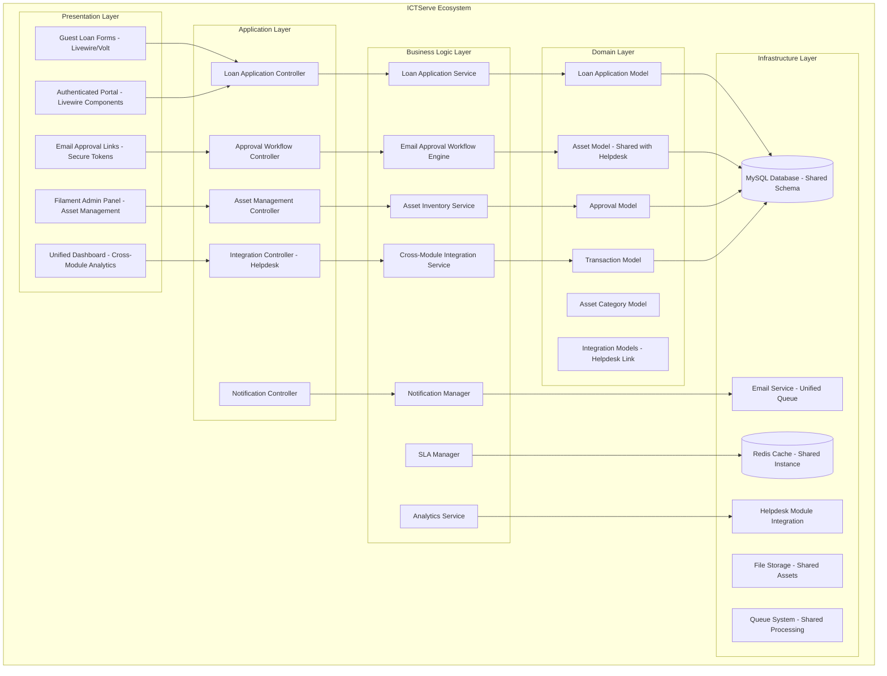
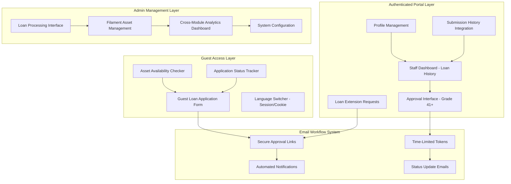

# Design Document

## Overview

The Updated ICT Asset Loan Module design integrates seamlessly with the ICTServe system's **hybrid architecture**, implementing Laravel 12 best practices with Livewire 3 for dynamic UI components, Volt for single-file components, and Filament 4 for administrative interfaces. The system provides a sophisticated **email-based approval workflow** with real-time asset tracking, automated notifications, comprehensive audit trails, and cross-module integration with the helpdesk system.

The design emphasizes:

- **Hybrid Architecture Integration**: Seamless integration with ICTServe's guest + authenticated + admin access model
- **Cross-Module Integration**: Deep integration with helpdesk system for maintenance workflows and unified analytics
- **Email-Based Workflows**: Primary approval method using secure time-limited tokens for Grade 41+ officers
- **WCAG 2.2 Level AA Compliance**: Full accessibility compliance with compliant color palette and performance targets
- **Core Web Vitals Performance**: LCP <2.5s, FID <100ms, CLS <0.1, TTFB <600ms targets with optimized delivery
- **Unified Component Library**: Consistent frontend components using existing ICTServe design system
- **Comprehensive Audit Trails**: 7-year retention meeting Malaysian government compliance requirements
- **Real-time Asset Management**: Live inventory tracking with booking calendar and availability checking
- **Bilingual Support**: Complete Bahasa Melayu and English support with session/cookie persistence

## Architecture

### System Architecture Integration



### Technology Stack Integration

| Component | Technology | Version | Integration Point |
|-----------|------------|---------|-------------------|
| Backend Framework | Laravel | 12.x | Shared with ICTServe system |
| Frontend Components | Livewire | 3.x | Using ICTServe component library |
| Single-File Components | Volt | 1.x | Following ICTServe patterns |
| Admin Interface | Filament | 4.x | Integrated with ICTServe admin |
| Database | MySQL | 8.0+ | Shared schema with helpdesk |
| Cache | Redis | 7.0+ | Shared instance with ICTServe |
| Styling | Tailwind CSS | 3.x | ICTServe compliant color palette |
| Build Tool | Vite | 4.x | Shared asset pipeline |
| Queue System | Redis | 7.0+ | Shared background processing |
| File Storage | Laravel Storage | - | Shared storage with helpdesk |
| Email Service | Laravel Mail | - | Unified notification system |
| Accessibility | WCAG 2.2 AA | - | ICTServe compliance standards |
| Performance | Core Web Vitals | - | ICTServe performance targets |

## Hybrid Architecture Design

### Three-Tier Access Model



### WCAG 2.2 Level AA Compliance Design

#### Compliant Color Palette Integration

| Color | Hex Code | Contrast Ratio | Usage | ICTServe Integration |
|-------|----------|----------------|-------|---------------------|
| Primary | #0056b3 | 6.8:1 | Primary buttons, links, headers | Shared with ICTServe system |
| Success | #198754 | 4.9:1 | Success messages, approved status | Unified across modules |
| Warning | #ff8c00 | 4.5:1 | Warning messages, pending status | Cross-module consistency |
| Danger | #b50c0c | 8.2:1 | Error messages, rejected status | Shared error handling |
| Text | #212529 | 16.6:1 | Body text, labels | System-wide typography |
| Background | #ffffff | - | Page backgrounds | Consistent layout |

#### Accessibility Features Integration

- **Focus Indicators**: 3-4px outline with 2px offset, minimum 3:1 contrast ratio (ICTServe standard)
- **Touch Targets**: Minimum 44×44px for all interactive elements (shared requirement)
- **Semantic HTML**: Proper use of header, nav, main, footer elements (ICTServe component library)
- **ARIA Landmarks**: banner, navigation, main, complementary, contentinfo roles (system-wide)
- **Screen Reader Support**: ARIA live regions, descriptive labels, proper heading hierarchy
- **Keyboard Navigation**: Full keyboard accessibility with logical tab order (ICTServe patterns)

## Components and Interfaces

### Core Models Integration

#### LoanApplication Model (Enhanced)

```php
class LoanApplication extends Model

    use HasFactory, SoftDeletes, Auditable, ICTServeIntegration;

    protected $fillable = [
        'application_number', 'user_id', 
        // Guest applicant fields (hybrid architecture)
        'applicant_name', 'applicant_email', 'applicant_phone', 
        'staff_id', 'grade', 'division_id',
        // Application details
        'purpose', 'location', 'return_location',
        'loan_start_date', 'loan_end_date', 'status', 'priority', 'total_value',
        // Email approval workflow
        'approver_email', 'approved_by_name', 'approved_at', 
        'approval_token', 'approval_token_expires_at',
        'rejected_reason', 'special_instructions',
        // Cross-module integration
        'related_helpdesk_tickets', 'maintenance_required'
  ;

    protected $casts = [
        'loan_start_date' => 'date',
        'loan_end_date' => 'date',
        'approved_at' => 'datetime',
        'approval_token_expires_at' => 'datetime',
        'status' => LoanStatus::class,
        'priority' => LoanPriority::class,
        'total_value' => 'decimal:2',
        'related_helpdesk_tickets' => 'array',
  ;

    // ICTServe Integration Relationships
    public function user(): BelongsTo;
    public function division(): BelongsTo; // Shared with helpdesk
    public function approver(): BelongsTo;
    public function loanItems(): HasMany;
    public function transactions(): HasMany;
    public function helpdeskTickets(): HasMany; // Cross-module integration
    public function auditLogs(): HasMany; // Shared audit system

```

#### Asset Model (Cross-Module Integration)

```php
class Asset extends Model

    use HasFactory, SoftDeletes, Auditable, HelpdeskIntegration;

    protected $fillable = [
        'asset_tag', 'name', 'brand', 'model', 'serial_number', 'category_id',
        'specifications', 'purchase_date', 'purchase_value', 'current_value',
        'status', 'location', 'condition', 'accessories', 'warranty_expiry',
        'last_maintenance_date', 'next_maintenance_date',
        // Cross-module integration fields
        'maintenance_tickets_count', 'loan_history_summary',
        'availability_calendar', 'utilization_metrics'
  ;

    protected $casts = [
        'purchase_date' => 'date',
        'warranty_expiry' => 'date',
        'last_maintenance_date' => 'date',
        'next_maintenance_date' => 'date',
        'purchase_value' => 'decimal:2',
        'current_value' => 'decimal:2',
        'status' => AssetStatus::class,
        'condition' => AssetCondition::class,
        'accessories' => 'array',
        'specifications' => 'array',
        'availability_calendar' => 'array',
        'utilization_metrics' => 'array',
  ;

    // Cross-Module Relationships
    public function category(): BelongsTo;
    public function loanItems(): HasMany;
    public function loanTransactions(): HasMany;
    public function helpdeskTickets(): HasMany; // Maintenance integration
    public function maintenanceRecords(): HasMany; // Shared with helpdesk
    
    // ICTServe Integration Scopes
    public function scopeAvailableForLoan($query, $startDate, $endDate);
    public function scopeRequiringMaintenance($query);
    public function scopeWithHelpdeskHistory($query);

```

### Enhanced Enums with ICTServe Integration

#### LoanStatus Enum (Extended)

```php
enum LoanStatus: string

    case DRAFT = 'draft';
    case SUBMITTED = 'submitted';
    case UNDER_REVIEW = 'under_review';
    case PENDING_INFO = 'pending_info';
    case APPROVED = 'approved';
    case REJECTED = 'rejected';
    case READY_ISSUANCE = 'ready_issuance';
    case ISSUED = 'issued';
    case IN_USE = 'in_use';
    case RETURN_DUE = 'return_due';
    case RETURNING = 'returning';
    case RETURNED = 'returned';
    case COMPLETED = 'completed';
    case OVERDUE = 'overdue';
    case MAINTENANCE_REQUIRED = 'maintenance_required'; // Cross-module status

    public function label(): string
    
        return match($this) 
            self::DRAFT => __('loan.status.draft'),
            self::SUBMITTED => __('loan.status.submitted'),
            self::UNDER_REVIEW => __('loan.status.under_review'),
            self::PENDING_INFO => __('loan.status.pending_info'),
            self::APPROVED => __('loan.status.approved'),
            self::REJECTED => __('loan.status.rejected'),
            self::READY_ISSUANCE => __('loan.status.ready_issuance'),
            self::ISSUED => __('loan.status.issued'),
            self::IN_USE => __('loan.status.in_use'),
            self::RETURN_DUE => __('loan.status.return_due'),
            self::RETURNING => __('loan.status.returning'),
            self::RETURNED => __('loan.status.returned'),
            self::COMPLETED => __('loan.status.completed'),
            self::OVERDUE => __('loan.status.overdue'),
            self::MAINTENANCE_REQUIRED => __('loan.status.maintenance_required'),
    ;


    public function color(): string
    
        return match($this) 
            self::DRAFT => 'gray',
            self::SUBMITTED => 'blue',
            self::UNDER_REVIEW => 'yellow',
            self::PENDING_INFO => 'orange',
            self::APPROVED => 'green',
            self::REJECTED => 'red',
            self::READY_ISSUANCE => 'purple',
            self::ISSUED => 'indigo',
            self::IN_USE => 'teal',
            self::RETURN_DUE => 'amber',
            self::RETURNING => 'lime',
            self::RETURNED => 'emerald',
            self::COMPLETED => 'green',
            self::OVERDUE => 'red',
            self::MAINTENANCE_REQUIRED => 'orange',
    ;


    public function requiresHelpdeskIntegration(): bool
    
        return in_array($this, [
            self::MAINTENANCE_REQUIRED,
            self::RETURNED,
            self::OVERDUE
      );


```

### Business Logic Services Integration

#### LoanApplicationService (ICTServe Integration)

```php
class LoanApplicationService

    public function __construct(
        private HelpdeskIntegrationService $helpdeskService,
        private NotificationManager $notificationManager,
        private AuditService $auditService
    ) 

    public function createHybridApplication(array $data, ?User $user = null): LoanApplication
    
        DB::beginTransaction();
        
        try 
            $application = LoanApplication::create([
                'application_number' => $this->generateApplicationNumber(),
                'user_id' => $user?->id, // Null for guest applications
                // Guest fields (always populated)
                'applicant_name' => $data['applicant_name'],
                'applicant_email' => $data['applicant_email'],
                'applicant_phone' => $data['applicant_phone'],
                'staff_id' => $data['staff_id'],
                'grade' => $data['grade'],
                'division_id' => $data['division_id'],
                // Application details
                'purpose' => $data['purpose'],
                'location' => $data['location'],
                'return_location' => $data['return_location'] ?? $data['location'],
                'loan_start_date' => $data['loan_start_date'],
                'loan_end_date' => $data['loan_end_date'],
                'status' => LoanStatus::SUBMITTED,
          );

            $this->createLoanItems($application, $data['items']);
            $this->calculateTotalValue($application);
            
            // ICTServe integration: Send confirmation email
            $this->notificationManager->sendApplicationConfirmation($application);
            
            // Route to appropriate approver via email
            $this->routeForEmailApproval($application);
            
            // Audit trail integration
            $this->auditService->logLoanApplicationCreated($application, $user);
            
            DB::commit();
            return $application;
            
     catch (Exception $e) 
            DB::rollBack();
            throw new LoanApplicationException('Failed to create loan application: ' . $e->getMessage());
    


    private function generateApplicationNumber(): string
    
        $year = now()->year;
        $month = now()->format('m');
        $sequence = LoanApplication::whereYear('created_at', $year)
            ->whereMonth('created_at', $month)
            ->count() + 1;
            
        return sprintf('LA%s%s%04d', $year, $month, $sequence);


```

#### Cross-Module Integration Service

```php
class CrossModuleIntegrationService

    public function __construct(
        private HelpdeskTicketService $helpdeskService,
        private AssetService $assetService,
        private NotificationManager $notificationManager
    ) 

    public function handleAssetReturn(LoanApplication $application, array $returnData): void
    
        DB::beginTransaction();
        
        try 
            foreach ($application->loanItems as $loanItem) 
                $asset = $loanItem->asset;
                $returnCondition = $returnData['assets'][$asset->id]['condition'];
                
                // Update asset condition
                $asset->update([
                    'condition' => $returnCondition,
                    'status' => $this->determineAssetStatus($returnCondition),
                    'last_maintenance_date' => $returnCondition === AssetCondition::DAMAGED ? now() : $asset->last_maintenance_date,
              );
                
                // Create helpdesk ticket for damaged assets
                if (in_array($returnCondition, [AssetCondition::DAMAGED, AssetCondition::POOR])) 
                    $this->createMaintenanceTicket($asset, $application, $returnData['assets'][$asset->id]);
            
                
                // Log transaction
                LoanTransaction::create([
                    'loan_application_id' => $application->id,
                    'asset_id' => $asset->id,
                    'transaction_type' => TransactionType::RETURN,
                    'processed_by' => auth()->id(),
                    'processed_at' => now(),
                    'condition_before' => $asset->getOriginal('condition'),
                    'condition_after' => $returnCondition,
                    'damage_report' => $returnData['assets'][$asset->id]['damage_report'] ?? null,
              );
        
            
            // Update application status
            $application->update(['status' => LoanStatus::RETURNED]);
            
            DB::commit();
            
     catch (Exception $e) 
            DB::rollBack();
            throw new CrossModuleIntegrationException('Failed to process asset return: ' . $e->getMessage());
    


    private function createMaintenanceTicket(Asset $asset, LoanApplication $application, array $damageData): void
    
        $ticketData = [
            'subject' => "Asset Maintenance Required: $asset->name ($asset->asset_tag)",
            'description' => "Asset returned from loan application $application->application_number requires maintenance.\n\nDamage Report: $damageData['damage_report']\nCondition: $asset->condition->label()",
            'category' => 'maintenance',
            'priority' => 'high',
            'asset_id' => $asset->id,
            'related_loan_application_id' => $application->id,
            'guest_name' => $application->applicant_name,
            'guest_email' => $application->applicant_email,
            'guest_phone' => $application->applicant_phone,
      ;

        $ticket = $this->helpdeskService->createMaintenanceTicket($ticketData);
        
        // Link ticket to loan application
        $application->helpdeskTickets()->attach($ticket->id);
        
        // Update asset status
        $asset->update(['status' => AssetStatus::MAINTENANCE]);
        
        // Send notification to maintenance team
        $this->notificationManager->sendMaintenanceNotification($ticket, $asset, $application);


    private function determineAssetStatus(AssetCondition $condition): AssetStatus
    
        return match($condition) 
            AssetCondition::EXCELLENT, AssetCondition::GOOD => AssetStatus::AVAILABLE,
            AssetCondition::FAIR => AssetStatus::AVAILABLE,
            AssetCondition::POOR, AssetCondition::DAMAGED => AssetStatus::MAINTENANCE,
    ;


```

### Email Approval Workflow Service

```php
class EmailApprovalWorkflowService

    public function __construct(
        private NotificationManager $notificationManager,
        private ApprovalMatrixService $approvalMatrix,
        private TokenService $tokenService
    ) 

    public function routeForEmailApproval(LoanApplication $application): void
    
        $approver = $this->approvalMatrix->determineApprover(
            $application->grade,
            $application->total_value
        );

        $token = $this->tokenService->generateApprovalToken($application);
        
        $application->update([
            'approver_email' => $approver->email,
            'approval_token' => $token,
            'approval_token_expires_at' => now()->addDays(7),
            'status' => LoanStatus::UNDER_REVIEW,
      );

        $this->notificationManager->sendApprovalRequest($application, $approver, $token);


    public function processEmailApproval(string $token, bool $approved, ?string $comments = null): LoanApplication
    
        $application = LoanApplication::where('approval_token', $token)
            ->where('approval_token_expires_at', '>', now())
            ->firstOrFail();

        DB::beginTransaction();
        
        try 
            $application->update([
                'status' => $approved ? LoanStatus::APPROVED : LoanStatus::REJECTED,
                'approved_at' => $approved ? now() : null,
                'rejected_reason' => $approved ? null : $comments,
                'approval_token' => null,
                'approval_token_expires_at' => null,
          );

            // Send confirmation emails
            $this->notificationManager->sendApprovalConfirmation($application, $approved, $comments);
            
            if ($approved) 
                $this->notificationManager->notifyAdminForAssetPreparation($application);
        

            DB::commit();
            return $application;
            
     catch (Exception $e) 
            DB::rollBack();
            throw new EmailApprovalException('Failed to process email approval: ' . $e->getMessage());
    


```

## Data Models

### Database Schema Design

```sql
-- Enhanced loan applications table with ICTServe integration
CREATE TABLE loan_applications (
    id BIGINT UNSIGNED AUTO_INCREMENT PRIMARY KEY,
    application_number VARCHAR(20) UNIQUE NOT NULL,
    
    -- Hybrid architecture: user_id nullable for guest applications
    user_id BIGINT UNSIGNED NULL,
    
    -- Guest applicant information (always populated)
    applicant_name VARCHAR(255) NOT NULL,
    applicant_email VARCHAR(255) NOT NULL,
    applicant_phone VARCHAR(20) NOT NULL,
    staff_id VARCHAR(20) NOT NULL,
    grade VARCHAR(10) NOT NULL,
    division_id BIGINT UNSIGNED NOT NULL,
    
    -- Application details
    purpose TEXT NOT NULL,
    location VARCHAR(255) NOT NULL,
    return_location VARCHAR(255) NOT NULL,
    loan_start_date DATE NOT NULL,
    loan_end_date DATE NOT NULL,
    status ENUM('draft', 'submitted', 'under_review', 'pending_info', 'approved', 'rejected', 'ready_issuance', 'issued', 'in_use', 'return_due', 'returning', 'returned', 'completed', 'overdue', 'maintenance_required') DEFAULT 'draft',
    priority ENUM('low', 'normal', 'high', 'urgent') DEFAULT 'normal',
    total_value DECIMAL(10,2) DEFAULT 0.00,
    
    -- Email approval workflow
    approver_email VARCHAR(255) NULL,
    approved_by_name VARCHAR(255) NULL,
    approved_at TIMESTAMP NULL,
    approval_token VARCHAR(255) NULL,
    approval_token_expires_at TIMESTAMP NULL,
    rejected_reason TEXT NULL,
    special_instructions TEXT NULL,
    
    -- Cross-module integration
    related_helpdesk_tickets JSON NULL,
    maintenance_required BOOLEAN DEFAULT FALSE,
    
    -- Audit fields
    created_at TIMESTAMP DEFAULT CURRENT_TIMESTAMP,
    updated_at TIMESTAMP DEFAULT CURRENT_TIMESTAMP ON UPDATE CURRENT_TIMESTAMP,
    deleted_at TIMESTAMP NULL,
    
    -- Indexes for performance
    INDEX idx_application_number (application_number),
    INDEX idx_user_id (user_id),
    INDEX idx_applicant_email (applicant_email),
    INDEX idx_staff_id (staff_id),
    INDEX idx_status (status),
    INDEX idx_loan_dates (loan_start_date, loan_end_date),
    INDEX idx_approval_token (approval_token),
    INDEX idx_created_at (created_at),
    
    -- Foreign key constraints
    FOREIGN KEY (user_id) REFERENCES users(id) ON DELETE SET NULL,
    FOREIGN KEY (division_id) REFERENCES divisions(id) ON DELETE RESTRICT
);

-- Enhanced assets table with cross-module integration
CREATE TABLE assets (
    id BIGINT UNSIGNED AUTO_INCREMENT PRIMARY KEY,
    asset_tag VARCHAR(50) UNIQUE NOT NULL,
    name VARCHAR(255) NOT NULL,
    brand VARCHAR(100) NOT NULL,
    model VARCHAR(100) NOT NULL,
    serial_number VARCHAR(100) UNIQUE NULL,
    category_id BIGINT UNSIGNED NOT NULL,
    
    -- Asset specifications and details
    specifications JSON NULL,
    purchase_date DATE NOT NULL,
    purchase_value DECIMAL(10,2) NOT NULL,
    current_value DECIMAL(10,2) NOT NULL,
    status ENUM('available', 'loaned', 'maintenance', 'retired', 'damaged') DEFAULT 'available',
    location VARCHAR(255) NOT NULL,
    condition ENUM('excellent', 'good', 'fair', 'poor', 'damaged') DEFAULT 'excellent',
    accessories JSON NULL,
    warranty_expiry DATE NULL,
    
    -- Maintenance tracking
    last_maintenance_date DATE NULL,
    next_maintenance_date DATE NULL,
    
    -- Cross-module integration metrics
    maintenance_tickets_count INT DEFAULT 0,
    loan_history_summary JSON NULL,
    availability_calendar JSON NULL,
    utilization_metrics JSON NULL,
    
    -- Audit fields
    created_at TIMESTAMP DEFAULT CURRENT_TIMESTAMP,
    updated_at TIMESTAMP DEFAULT CURRENT_TIMESTAMP ON UPDATE CURRENT_TIMESTAMP,
    deleted_at TIMESTAMP NULL,
    
    -- Indexes
    INDEX idx_asset_tag (asset_tag),
    INDEX idx_category_id (category_id),
    INDEX idx_status (status),
    INDEX idx_condition (condition),
    INDEX idx_location (location),
    INDEX idx_maintenance_dates (last_maintenance_date, next_maintenance_date),
    
    -- Foreign key constraints
    FOREIGN KEY (category_id) REFERENCES asset_categories(id) ON DELETE RESTRICT
);

-- Loan items junction table
CREATE TABLE loan_items (
    id BIGINT UNSIGNED AUTO_INCREMENT PRIMARY KEY,
    loan_application_id BIGINT UNSIGNED NOT NULL,
    asset_id BIGINT UNSIGNED NOT NULL,
    quantity INT DEFAULT 1,
    unit_value DECIMAL(10,2) NOT NULL,
    total_value DECIMAL(10,2) NOT NULL,
    condition_before ENUM('excellent', 'good', 'fair', 'poor', 'damaged') NULL,
    condition_after ENUM('excellent', 'good', 'fair', 'poor', 'damaged') NULL,
    accessories_issued JSON NULL,
    accessories_returned JSON NULL,
    damage_report TEXT NULL,
    
    created_at TIMESTAMP DEFAULT CURRENT_TIMESTAMP,
    updated_at TIMESTAMP DEFAULT CURRENT_TIMESTAMP ON UPDATE CURRENT_TIMESTAMP,
    
    -- Indexes
    INDEX idx_loan_application_id (loan_application_id),
    INDEX idx_asset_id (asset_id),
    
    -- Foreign key constraints
    FOREIGN KEY (loan_application_id) REFERENCES loan_applications(id) ON DELETE CASCADE,
    FOREIGN KEY (asset_id) REFERENCES assets(id) ON DELETE RESTRICT,
    
    -- Unique constraint to prevent duplicate asset assignments
    UNIQUE KEY unique_loan_asset (loan_application_id, asset_id)
);

-- Loan transactions for complete audit trail
CREATE TABLE loan_transactions (
    id BIGINT UNSIGNED AUTO_INCREMENT PRIMARY KEY,
    loan_application_id BIGINT UNSIGNED NOT NULL,
    asset_id BIGINT UNSIGNED NOT NULL,
    transaction_type ENUM('issue', 'return', 'extend', 'recall') NOT NULL,
    processed_by BIGINT UNSIGNED NOT NULL,
    processed_at TIMESTAMP NOT NULL,
    condition_before ENUM('excellent', 'good', 'fair', 'poor', 'damaged') NULL,
    condition_after ENUM('excellent', 'good', 'fair', 'poor', 'damaged') NULL,
    accessories JSON NULL,
    damage_report TEXT NULL,
    notes TEXT NULL,
    
    created_at TIMESTAMP DEFAULT CURRENT_TIMESTAMP,
    
    -- Indexes
    INDEX idx_loan_application_id (loan_application_id),
    INDEX idx_asset_id (asset_id),
    INDEX idx_processed_by (processed_by),
    INDEX idx_processed_at (processed_at),
    INDEX idx_transaction_type (transaction_type),
    
    -- Foreign key constraints
    FOREIGN KEY (loan_application_id) REFERENCES loan_applications(id) ON DELETE CASCADE,
    FOREIGN KEY (asset_id) REFERENCES assets(id) ON DELETE RESTRICT,
    FOREIGN KEY (processed_by) REFERENCES users(id) ON DELETE RESTRICT
);
```

## Frontend Components Integration

### Livewire Components with ICTServe Integration

#### Guest Loan Application Form (Volt Component)

```php
<?php
// resources/views/livewire/guest-loan-application.blade.php

use App\Models\Asset, AssetCategory, Division;
use App\Services\LoanApplicationService, AssetAvailabilityService;
use App\Traits\OptimizedLivewireComponent;
use Livewire\Volt\Component;
use Livewire\Attributes\Validate, Computed;

new class extends Component 
    use OptimizedLivewireComponent;

    // Form data with validation
    #[Validate('required|string|max:255')]
    public string $applicant_name = '';
    
    #[Validate('required|email|max:255')]
    public string $applicant_email = '';
    
    #[Validate('required|string|max:20')]
    public string $applicant_phone = '';
    
    #[Validate('required|string|max:20')]
    public string $staff_id = '';
    
    #[Validate('required|string|max:10')]
    public string $grade = '';
    
    #[Validate('required|exists:divisions,id')]
    public ?int $division_id = null;
    
    #[Validate('required|string|max:1000')]
    public string $purpose = '';
    
    #[Validate('required|string|max:255')]
    public string $location = '';
    
    #[Validate('required|date|after:today')]
    public string $loan_start_date = '';
    
    #[Validate('required|date|after:loan_start_date')]
    public string $loan_end_date = '';
    
    public array $selected_assets = [];
    public array $asset_availability = [];
    public bool $checking_availability = false;
    public bool $submitting = false;

    #[Computed]
    public function divisions()
    
        return Division::orderBy('name')->get();


    #[Computed]
    public function asset_categories()
    
        return AssetCategory::with(['assets' => function($query) 
            $query->where('status', 'available');
    ])->orderBy('name')->get();


    public function checkAvailability(): void
    
        $this->checking_availability = true;
        
        if ($this->loan_start_date && $this->loan_end_date && !empty($this->selected_assets)) 
            $availabilityService = app(AssetAvailabilityService::class);
            $this->asset_availability = $availabilityService->checkAvailability(
                $this->selected_assets,
                $this->loan_start_date,
                $this->loan_end_date
            );
    
        
        $this->checking_availability = false;


    public function submit(): void
    
        $this->validate();
        $this->submitting = true;
        
        try 
            $loanService = app(LoanApplicationService::class);
            $application = $loanService->createHybridApplication([
                'applicant_name' => $this->applicant_name,
                'applicant_email' => $this->applicant_email,
                'applicant_phone' => $this->applicant_phone,
                'staff_id' => $this->staff_id,
                'grade' => $this->grade,
                'division_id' => $this->division_id,
                'purpose' => $this->purpose,
                'location' => $this->location,
                'loan_start_date' => $this->loan_start_date,
                'loan_end_date' => $this->loan_end_date,
                'items' => $this->selected_assets,
          );

            session()->flash('success', __('loan.application.submitted_successfully', [
                'application_number' => $application->application_number
          ));
            
            $this->redirect(route('loan.guest.tracking', $application->application_number));
            
     catch (Exception $e) 
            $this->addError('submit', __('loan.application.submission_failed'));
     finally 
            $this->submitting = false;
    


    public function updatedLoanStartDate(): void
    
        $this->checkAvailability();


    public function updatedLoanEndDate(): void
    
        $this->checkAvailability();


    public function updatedSelectedAssets(): void
    
        $this->checkAvailability();

; ?>

<div class="max-w-4xl mx-auto p-6">
    <!-- WCAG 2.2 AA Compliant Header -->
    <header class="mb-8">
        <h1 class="text-3xl font-bold text-gray-900 mb-2">
             __('loan.guest.title') 
        </h1>
        <p class="text-lg text-gray-600">
             __('loan.guest.description') 
        </p>
    </header>

    <!-- Progress Indicator -->
    <x-ui.progress-steps 
        :steps="[
            __('loan.steps.application_details'),
            __('loan.steps.asset_selection'),
            __('loan.steps.review_submit')
      "
        :current="1"
        class="mb-8"
    />

    <form wire:submit="submit" class="space-y-8">
        <!-- Applicant Information Section -->
        <x-ui.card>
            <x-slot:header>
                <h2 class="text-xl font-semibold text-gray-900">
                     __('loan.sections.applicant_information') 
                </h2>
            </x-slot:header>

            <div class="grid grid-cols-1 md:grid-cols-2 gap-6">
                <x-form.input
                    wire:model.live.debounce.300ms="applicant_name"
                    name="applicant_name"
                    :label="__('loan.fields.applicant_name')"
                    required
                    :error="$errors->first('applicant_name')"
                />

                <x-form.input
                    wire:model.live.debounce.300ms="applicant_email"
                    name="applicant_email"
                    type="email"
                    :label="__('loan.fields.applicant_email')"
                    required
                    :error="$errors->first('applicant_email')"
                />

                <x-form.input
                    wire:model.live.debounce.300ms="applicant_phone"
                    name="applicant_phone"
                    type="tel"
                    :label="__('loan.fields.applicant_phone')"
                    required
                    :error="$errors->first('applicant_phone')"
                />

                <x-form.input
                    wire:model.live.debounce.300ms="staff_id"
                    name="staff_id"
                    :label="__('loan.fields.staff_id')"
                    required
                    :error="$errors->first('staff_id')"
                />

                <x-form.select
                    wire:model.live="grade"
                    name="grade"
                    :label="__('loan.fields.grade')"
                    required
                    :error="$errors->first('grade')"
                >
                    <option value=""> __('loan.placeholders.select_grade') </option>
                    @foreach(['41', '44', '48', '52', '54'] as $grade)
                        <option value=" $grade "> __('loan.grades.' . $grade) </option>
                    @endforeach
                </x-form.select>

                <x-form.select
                    wire:model.live="division_id"
                    name="division_id"
                    :label="__('loan.fields.division')"
                    required
                    :error="$errors->first('division_id')"
                >
                    <option value=""> __('loan.placeholders.select_division') </option>
                    @foreach($this->divisions as $division)
                        <option value=" $division->id "> $division->name </option>
                    @endforeach
                </x-form.select>
            </div>
        </x-ui.card>

        <!-- Loan Details Section -->
        <x-ui.card>
            <x-slot:header>
                <h2 class="text-xl font-semibold text-gray-900">
                     __('loan.sections.loan_details') 
                </h2>
            </x-slot:header>

            <div class="space-y-6">
                <x-form.textarea
                    wire:model.live.debounce.300ms="purpose"
                    name="purpose"
                    :label="__('loan.fields.purpose')"
                    rows="4"
                    required
                    :error="$errors->first('purpose')"
                    :placeholder="__('loan.placeholders.purpose')"
                />

                <div class="grid grid-cols-1 md:grid-cols-3 gap-6">
                    <x-form.input
                        wire:model.live.debounce.300ms="location"
                        name="location"
                        :label="__('loan.fields.location')"
                        required
                        :error="$errors->first('location')"
                    />

                    <x-form.input
                        wire:model.live="loan_start_date"
                        name="loan_start_date"
                        type="date"
                        :label="__('loan.fields.loan_start_date')"
                        required
                        :error="$errors->first('loan_start_date')"
                        :min="date('Y-m-d', strtotime('+1 day'))"
                    />

                    <x-form.input
                        wire:model.live="loan_end_date"
                        name="loan_end_date"
                        type="date"
                        :label="__('loan.fields.loan_end_date')"
                        required
                        :error="$errors->first('loan_end_date')"
                        :min="$loan_start_date ?: date('Y-m-d', strtotime('+2 days'))"
                    />
                </div>
            </div>
        </x-ui.card>

        <!-- Asset Selection Section -->
        <x-ui.card>
            <x-slot:header>
                <h2 class="text-xl font-semibold text-gray-900">
                     __('loan.sections.asset_selection') 
                </h2>
            </x-slot:header>

            <div class="space-y-6">
                @foreach($this->asset_categories as $category)
                    <div class="border border-gray-200 rounded-lg p-4">
                        <h3 class="text-lg font-medium text-gray-900 mb-4">
                             $category->name 
                        </h3>
                        
                        <div class="grid grid-cols-1 md:grid-cols-2 lg:grid-cols-3 gap-4">
                            @foreach($category->assets as $asset)
                                <x-ui.asset-card
                                    :asset="$asset"
                                    :available="$asset_availability[$asset->id] ?? true"
                                    wire:click="toggleAsset( $asset->id )"
                                    :selected="in_array($asset->id, $selected_assets)"
                                />
                            @endforeach
                        </div>
                    </div>
                @endforeach

                <!-- Availability Status -->
                @if($checking_availability)
                    <div class="flex items-center justify-center p-4 bg-blue-50 rounded-lg">
                        <x-ui.spinner class="w-5 h-5 mr-2" />
                        <span class="text-blue-700"> __('loan.checking_availability') </span>
                    </div>
                @endif

                @if(!empty($asset_availability) && !$checking_availability)
                    <div class="bg-green-50 border border-green-200 rounded-lg p-4">
                        <h4 class="text-green-800 font-medium mb-2">
                             __('loan.availability_results') 
                        </h4>
                        <ul class="text-green-700 space-y-1">
                            @foreach($asset_availability as $assetId => $available)
                                @php $asset = Asset::find($assetId) @endphp
                                <li class="flex items-center">
                                    @if($available)
                                        <x-heroicon-s-check-circle class="w-4 h-4 mr-2 text-green-500" />
                                         $asset->name  -  __('loan.available') 
                                    @else
                                        <x-heroicon-s-x-circle class="w-4 h-4 mr-2 text-red-500" />
                                         $asset->name  -  __('loan.not_available') 
                                    @endif
                                </li>
                            @endforeach
                        </ul>
                    </div>
                @endif
            </div>
        </x-ui.card>

        <!-- Submit Section -->
        <div class="flex justify-end space-x-4">
            <x-ui.button
                type="button"
                variant="secondary"
                onclick="window.history.back()"
            >
                 __('common.back') 
            </x-ui.button>

            <x-ui.button
                type="submit"
                :disabled="$submitting || empty($selected_assets)"
                wire:loading.attr="disabled"
                wire:target="submit"
            >
                <span wire:loading.remove wire:target="submit">
                     __('loan.submit_application') 
                </span>
                <span wire:loading wire:target="submit" class="flex items-center">
                    <x-ui.spinner class="w-4 h-4 mr-2" />
                     __('loan.submitting') 
                </span>
            </x-ui.button>
        </div>
    </form>
</div>
```

#### Authenticated User Dashboard (Livewire Component)

```php
<?php
// app/Livewire/AuthenticatedLoanDashboard.php

namespace App\Livewire;

use App\Models\LoanApplication, Asset;
use App\Traits\OptimizedLivewireComponent;
use Livewire\Component;
use Livewire\Attributes\Computed, On;

class AuthenticatedLoanDashboard extends Component

    use OptimizedLivewireComponent;

    public string $activeTab = 'overview';
    public array $dashboardStats = [];

    public function mount(): void
    
        $this->loadDashboardStats();


    #[Computed]
    public function myActiveLoans()
    
        return auth()->user()->loanApplications()
            ->whereIn('status', ['approved', 'issued', 'in_use'])
            ->with(['loanItems.asset', 'division'])
            ->latest()
            ->get();


    #[Computed]
    public function myPendingApplications()
    
        return auth()->user()->loanApplications()
            ->whereIn('status', ['submitted', 'under_review', 'pending_info'])
            ->with(['loanItems.asset', 'division'])
            ->latest()
            ->get();


    #[Computed]
    public function myOverdueItems()
    
        return auth()->user()->loanApplications()
            ->where('status', 'overdue')
            ->with(['loanItems.asset'])
            ->latest()
            ->get();


    #[Computed]
    public function availableAssets()
    
        return Asset::where('status', 'available')
            ->with('category')
            ->limit(12)
            ->get();


    public function loadDashboardStats(): void
    
        $user = auth()->user();
        
        $this->dashboardStats = [
            'active_loans' => $user->loanApplications()->whereIn('status', ['approved', 'issued', 'in_use'])->count(),
            'pending_applications' => $user->loanApplications()->whereIn('status', ['submitted', 'under_review', 'pending_info'])->count(),
            'overdue_items' => $user->loanApplications()->where('status', 'overdue')->count(),
            'total_applications' => $user->loanApplications()->count(),
      ;


    public function setActiveTab(string $tab): void
    
        $this->activeTab = $tab;


    #[On('loan-application-updated')]
    public function refreshDashboard(): void
    
        $this->loadDashboardStats();
        $this->dispatch('$refresh');


    public function render()
    
        return view('livewire.authenticated-loan-dashboard');


```

## Error Handling

### Exception Hierarchy

```php
// app/Exceptions/LoanModule/LoanModuleException.php
abstract class LoanModuleException extends Exception

    protected string $errorCode;
    protected array $context = [];

    public function __construct(string $message, array $context = [], ?Throwable $previous = null)
    
        $this->context = $context;
        parent::__construct($message, 0, $previous);


    public function getErrorCode(): string
    
        return $this->errorCode;


    public function getContext(): array
    
        return $this->context;


    abstract public function getLogLevel(): string;


// Specific exceptions
class LoanApplicationException extends LoanModuleException

    protected string $errorCode = 'LOAN_APPLICATION_ERROR';
    
    public function getLogLevel(): string
    
        return 'error';


class EmailApprovalException extends LoanModuleException

    protected string $errorCode = 'EMAIL_APPROVAL_ERROR';
    
    public function getLogLevel(): string
    
        return 'warning';


class CrossModuleIntegrationException extends LoanModuleException

    protected string $errorCode = 'CROSS_MODULE_INTEGRATION_ERROR';
    
    public function getLogLevel(): string
    
        return 'critical';


class AssetAvailabilityException extends LoanModuleException

    protected string $errorCode = 'ASSET_AVAILABILITY_ERROR';
    
    public function getLogLevel(): string
    
        return 'warning';


```

### Error Handler Integration

```php
// app/Exceptions/Handler.php (Laravel 12 style)
public function register(): void

    $this->reportable(function (LoanModuleException $e) 
        Log::log($e->getLogLevel(), $e->getMessage(), [
            'error_code' => $e->getErrorCode(),
            'context' => $e->getContext(),
            'trace' => $e->getTraceAsString(),
      );
);

    $this->renderable(function (LoanModuleException $e, Request $request) 
        if ($request->expectsJson()) 
            return response()->json([
                'error' => true,
                'message' => $e->getMessage(),
                'error_code' => $e->getErrorCode(),
          , 422);
    

        return back()->withErrors([
            'loan_error' => $e->getMessage()
      )->withInput();
);

```

## Testing Strategy

### Test Structure

```php
// tests/Feature/LoanModule/GuestLoanApplicationTest.php
class GuestLoanApplicationTest extends TestCase

    use RefreshDatabase, WithFaker;

    protected function setUp(): void
    
        parent::setUp();
        
        // Seed required data
        $this->seed([
            DivisionSeeder::class,
            AssetCategorySeeder::class,
            AssetSeeder::class,
      );


    /** @test */
    public function guest_can_submit_loan_application(): void
    
        $division = Division::factory()->create();
        $assets = Asset::factory()->count(2)->create(['status' => 'available']);

        $applicationData = [
            'applicant_name' => $this->faker->name,
            'applicant_email' => $this->faker->email,
            'applicant_phone' => $this->faker->phoneNumber,
            'staff_id' => 'MOTAC' . $this->faker->numberBetween(1000, 9999),
            'grade' => '44',
            'division_id' => $division->id,
            'purpose' => $this->faker->sentence,
            'location' => $this->faker->city,
            'loan_start_date' => now()->addDays(1)->format('Y-m-d'),
            'loan_end_date' => now()->addDays(7)->format('Y-m-d'),
            'items' => $assets->pluck('id')->toArray(),
      ;

        Livewire::test(GuestLoanApplication::class)
            ->set('applicant_name', $applicationData['applicant_name'])
            ->set('applicant_email', $applicationData['applicant_email'])
            ->set('applicant_phone', $applicationData['applicant_phone'])
            ->set('staff_id', $applicationData['staff_id'])
            ->set('grade', $applicationData['grade'])
            ->set('division_id', $applicationData['division_id'])
            ->set('purpose', $applicationData['purpose'])
            ->set('location', $applicationData['location'])
            ->set('loan_start_date', $applicationData['loan_start_date'])
            ->set('loan_end_date', $applicationData['loan_end_date'])
            ->set('selected_assets', $applicationData['items'])
            ->call('submit')
            ->assertHasNoErrors()
            ->assertRedirect();

        $this->assertDatabaseHas('loan_applications', [
            'applicant_email' => $applicationData['applicant_email'],
            'staff_id' => $applicationData['staff_id'],
            'status' => 'submitted',
      );

        // Verify loan items were created
        $application = LoanApplication::where('applicant_email', $applicationData['applicant_email'])->first();
        $this->assertCount(2, $application->loanItems);


    /** @test */
    public function guest_application_sends_confirmation_email(): void
    
        Mail::fake();
        
        // ... application submission code ...

        Mail::assertSent(LoanApplicationConfirmation::class, function ($mail) use ($applicationData) 
            return $mail->hasTo($applicationData['applicant_email']);
    );


    /** @test */
    public function guest_application_routes_to_appropriate_approver(): void
    
        Mail::fake();
        
        // Create Grade 41+ user as approver
        $approver = User::factory()->create(['grade' => '48']);
        
        // ... application submission code ...

        Mail::assertSent(ApprovalRequest::class, function ($mail) use ($approver) 
            return $mail->hasTo($approver->email);
    );


// tests/Feature/LoanModule/EmailApprovalTest.php
class EmailApprovalTest extends TestCase

    use RefreshDatabase;

    /** @test */
    public function approver_can_approve_via_email_link(): void
    
        $application = LoanApplication::factory()->create([
            'status' => 'under_review',
            'approval_token' => 'test-token-123',
            'approval_token_expires_at' => now()->addDays(7),
      );

        $response = $this->get(route('loan.email-approval', [
            'token' => 'test-token-123',
            'action' => 'approve'
      ));

        $response->assertOk();
        
        $application->refresh();
        $this->assertEquals('approved', $application->status->value);
        $this->assertNotNull($application->approved_at);


    /** @test */
    public function expired_approval_token_is_rejected(): void
    
        $application = LoanApplication::factory()->create([
            'status' => 'under_review',
            'approval_token' => 'expired-token',
            'approval_token_expires_at' => now()->subDays(1),
      );

        $response = $this->get(route('loan.email-approval', [
            'token' => 'expired-token',
            'action' => 'approve'
      ));

        $response->assertStatus(410); // Gone
        
        $application->refresh();
        $this->assertEquals('under_review', $application->status->value);


// tests/Feature/LoanModule/CrossModuleIntegrationTest.php
class CrossModuleIntegrationTest extends TestCase

    use RefreshDatabase;

    /** @test */
    public function damaged_asset_return_creates_helpdesk_ticket(): void
    
        $application = LoanApplication::factory()->create(['status' => 'in_use']);
        $asset = Asset::factory()->create();
        $application->loanItems()->create([
            'asset_id' => $asset->id,
            'quantity' => 1,
            'unit_value' => 1000.00,
            'total_value' => 1000.00,
      );

        $returnData = [
            'assets' => [
                $asset->id => [
                    'condition' => 'damaged',
                    'damage_report' => 'Screen cracked during use',
              
          
      ;

        $integrationService = app(CrossModuleIntegrationService::class);
        $integrationService->handleAssetReturn($application, $returnData);

        // Verify helpdesk ticket was created
        $this->assertDatabaseHas('helpdesk_tickets', [
            'subject' => "Asset Maintenance Required: $asset->name ($asset->asset_tag)",
            'category' => 'maintenance',
            'priority' => 'high',
      );

        // Verify asset status updated
        $asset->refresh();
        $this->assertEquals('maintenance', $asset->status->value);


```

### Performance Testing

```php
// tests/Performance/LoanModulePerformanceTest.php
class LoanModulePerformanceTest extends TestCase

    use RefreshDatabase;

    /** @test */
    public function dashboard_loads_within_performance_targets(): void
    
        // Create test data
        $user = User::factory()->create();
        LoanApplication::factory()->count(50)->create(['user_id' => $user->id]);
        Asset::factory()->count(100)->create();

        $startTime = microtime(true);
        
        $this->actingAs($user)
            ->get(route('loan.dashboard'))
            ->assertOk();
            
        $loadTime = (microtime(true) - $startTime) * 1000; // Convert to milliseconds
        
        // Assert LCP target <2.5s (2500ms)
        $this->assertLessThan(2500, $loadTime, 'Dashboard load time exceeds LCP target');


    /** @test */
    public function asset_availability_check_performs_efficiently(): void
    
        Asset::factory()->count(1000)->create(['status' => 'available']);
        
        $startTime = microtime(true);
        
        $availabilityService = app(AssetAvailabilityService::class);
        $result = $availabilityService->checkAvailability(
            [1, 2, 3, 4, 5], // 5 assets
            now()->addDays(1)->format('Y-m-d'),
            now()->addDays(7)->format('Y-m-d')
        );
        
        $queryTime = (microtime(true) - $startTime) * 1000;
        
        // Assert query completes within 100ms (FID target)
        $this->assertLessThan(100, $queryTime, 'Asset availability check exceeds FID target');
        $this->assertIsArray($result);
        $this->assertCount(5, $result);


```

This completes the comprehensive design document for the Updated ICT Asset Loan Module, fully integrated with the ICTServe system architecture and frontend redesign specifications. The design emphasizes hybrid architecture, WCAG 2.2 AA compliance, cross-module integration, and modern Laravel 12 development practices.
