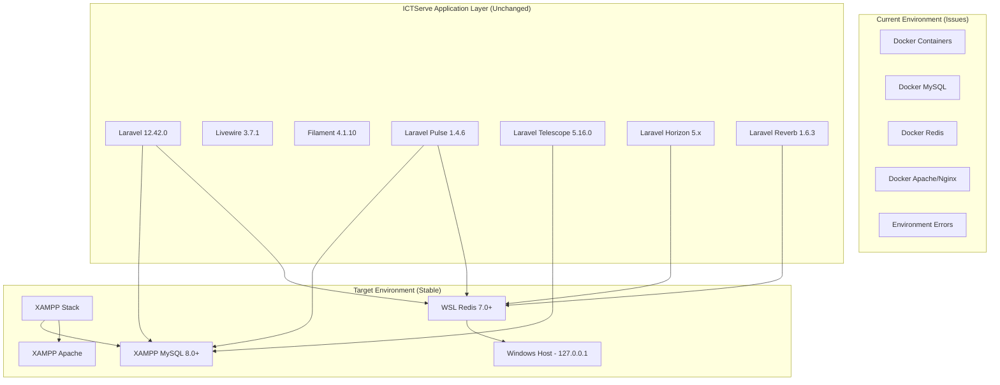

# Design Document - XAMPP Environment Revert

## Overview

This design document outlines the architecture and implementation approach for reverting the ICTServe v3.6.1 system to use XAMPP for MySQL and Apache services, with Redis running in WSL (Windows Subsystem for Linux). The goal is to eliminate current environment-related errors while maintaining all existing functionality and performance characteristics.

**Design Principle**: Simplify the development environment by using proven, stable local services (XAMPP) combined with WSL Redis for optimal Windows development experience, while preserving all ICTServe v3.6.1 features and capabilities.

## Architecture

### Current vs Target Architecture



### Service Configuration

| Service | Current | Target | Connection |
|---------|---------|--------|------------|
| **MySQL** | Docker Container | XAMPP MySQL 8.0+ | 127.0.0.1:3306 |
| **Apache** | Docker Container | XAMPP Apache | 127.0.0.1:80 |
| **Redis** | Docker Container | WSL Redis 7.0+ | 127.0.0.1:6379 |
| **Laravel App** | Docker Container | Native PHP | 127.0.0.1:8000 |
| **WebSocket** | Docker Network | Native Reverb | 127.0.0.1:8080 |

## Components and Interfaces

### 1. XAMPP MySQL Configuration

```ini
# XAMPP MySQL Configuration (my.ini)
[mysqld]
port = 3306
bind-address = 127.0.0.1
max_connections = 200
innodb_buffer_pool_size = 256M
innodb_log_file_size = 64M
sql_mode = STRICT_TRANS_TABLES,NO_ZERO_DATE,NO_ZERO_IN_DATE,ERROR_FOR_DIVISION_BY_ZERO

# ICTServe specific settings
character-set-server = utf8mb4
collation-server = utf8mb4_unicode_ci
default-time-zone = '+08:00'

# Performance optimization for development
query_cache_type = 1
query_cache_size = 32M
tmp_table_size = 64M
max_heap_table_size = 64M
```

### 2. WSL Redis Configuration

```bash
# WSL Redis Configuration (/etc/redis/redis.conf)
bind 0.0.0.0
port 6379
protected-mode no
tcp-backlog 511
timeout 0
tcp-keepalive 300

# Memory management
maxmemory 256mb
maxmemory-policy allkeys-lru

# Persistence (development settings)
save 900 1
save 300 10
save 60 10000

# Logging
loglevel notice
logfile /var/log/redis/redis-server.log

# ICTServe specific settings
databases 16
```

### 3. Laravel Environment Configuration

```env
# .env.xampp - XAMPP Environment Configuration
APP_NAME="ICTServe"
APP_ENV=local
APP_KEY=base64:generated-key-here
APP_DEBUG=true
APP_URL=http://127.0.0.1:8000
APP_TIMEZONE=Asia/Kuala_Lumpur

# XAMPP MySQL Configuration
DB_CONNECTION=mysql
DB_HOST=127.0.0.1
DB_PORT=3306
DB_DATABASE=ictserve
DB_USERNAME=root
DB_PASSWORD=

# WSL Redis Configuration
CACHE_STORE=redis
SESSION_DRIVER=redis
QUEUE_CONNECTION=redis

REDIS_CLIENT=phpredis
REDIS_HOST=127.0.0.1
REDIS_PASSWORD=null
REDIS_PORT=6379

# Laravel Services Configuration
BROADCAST_CONNECTION=reverb
REVERB_HOST=127.0.0.1
REVERB_PORT=8080
REVERB_SCHEME=http

# Performance Monitoring
PULSE_ENABLED=true
TELESCOPE_ENABLED=true
HORIZON_ENABLED=true
```

### 4. Service Management Scripts

#### XAMPP Service Manager

```powershell
# scripts/xampp/manage-xampp.ps1
function Start-XamppServices {
    Write-Info "Starting XAMPP services..."
    
    # Start MySQL
    Start-Process -FilePath "C:\xampp\mysql\bin\mysqld.exe" -WindowStyle Hidden
    
    # Start Apache
    Start-Process -FilePath "C:\xampp\apache\bin\httpd.exe" -WindowStyle Hidden
    
    # Validate services
    Test-ServiceConnectivity
}

function Stop-XamppServices {
    Write-Info "Stopping XAMPP services..."
    
    # Stop MySQL
    Get-Process -Name "mysqld" -ErrorAction SilentlyContinue | Stop-Process -Force
    
    # Stop Apache
    Get-Process -Name "httpd" -ErrorAction SilentlyContinue | Stop-Process -Force
}

function Test-ServiceConnectivity {
    # Test MySQL connection
    try {
        $connection = New-Object System.Data.SqlClient.SqlConnection
        $connection.ConnectionString = "Server=127.0.0.1;Port=3306;Database=ictserve;Uid=root;Pwd=;"
        $connection.Open()
        $connection.Close()
        Write-Success "MySQL connection successful"
    }
    catch {
        Write-Error "MySQL connection failed: $($_.Exception.Message)"
    }
    
    # Test Apache
    try {
        $response = Invoke-WebRequest -Uri "http://127.0.0.1" -TimeoutSec 5
        Write-Success "Apache is responding"
    }
    catch {
        Write-Error "Apache connection failed: $($_.Exception.Message)"
    }
}
```

#### WSL Redis Manager

```powershell
# scripts/wsl/manage-redis.ps1
function Start-WSLRedis {
    Write-Info "Starting Redis in WSL..."
    
    # Check if WSL is available
    if (-not (Get-Command wsl -ErrorAction SilentlyContinue)) {
        throw "WSL is not installed or not available"
    }
    
    # Start Redis in WSL
    wsl sudo service redis-server start
    
    # Validate Redis connection
    Test-RedisConnectivity
}

function Stop-WSLRedis {
    Write-Info "Stopping Redis in WSL..."
    wsl sudo service redis-server stop
}

function Test-RedisConnectivity {
    try {
        $tcpClient = New-Object System.Net.Sockets.TcpClient
        $tcpClient.Connect("127.0.0.1", 6379)
        $tcpClient.Close()
        Write-Success "Redis connection successful"
    }
    catch {
        Write-Error "Redis connection failed: $($_.Exception.Message)"
    }
}

function Install-WSLRedis {
    Write-Info "Installing Redis in WSL..."
    
    wsl sudo apt update
    wsl sudo apt install -y redis-server
    
    # Configure Redis for Windows host access
    wsl sudo sed -i 's/bind 127.0.0.1/bind 0.0.0.0/' /etc/redis/redis.conf
    wsl sudo sed -i 's/protected-mode yes/protected-mode no/' /etc/redis/redis.conf
    
    # Start Redis service
    wsl sudo service redis-server start
    
    Write-Success "Redis installed and configured in WSL"
}
```

### 5. Environment Migration Service

```php
<?php
declare(strict_types=1);

namespace App\Services;

use Illuminate\Support\Facades\DB;
use Illuminate\Support\Facades\Redis;
use Illuminate\Support\Facades\Artisan;

class EnvironmentMigrationService
{
    public function migrateToXampp(): array
    {
        $results = [
            'database_migration' => false,
            'redis_migration' => false,
            'configuration_update' => false,
            'service_validation' => false,
        ];
        
        try {
            // 1. Backup current database
            $this->backupCurrentDatabase();
            
            // 2. Test XAMPP MySQL connection
            $this->validateXamppConnection();
            $results['database_migration'] = true;
            
            // 3. Test WSL Redis connection
            $this->validateWSLRedisConnection();
            $results['redis_migration'] = true;
            
            // 4. Update Laravel configuration
            $this->updateLaravelConfiguration();
            $results['configuration_update'] = true;
            
            // 5. Run migrations and seeders
            $this->runMigrations();
            
            // 6. Validate all services
            $this->validateAllServices();
            $results['service_validation'] = true;
            
            return $results;
            
        } catch (\Exception $e) {
            throw new \Exception("Migration failed: " . $e->getMessage());
        }
    }
    
    private function validateXamppConnection(): void
    {
        $connection = DB::connection('mysql');
        $connection->getPdo();
        
        // Test basic operations
        $result = $connection->select('SELECT VERSION() as version');
        
        if (empty($result)) {
            throw new \Exception("XAMPP MySQL connection validation failed");
        }
    }
    
    private function validateWSLRedisConnection(): void
    {
        $redis = Redis::connection();
        $redis->ping();
        
        // Test basic operations
        $redis->set('test_key', 'test_value');
        $value = $redis->get('test_key');
        
        if ($value !== 'test_value') {
            throw new \Exception("WSL Redis connection validation failed");
        }
        
        $redis->del('test_key');
    }
    
    private function updateLaravelConfiguration(): void
    {
        // Clear all caches
        Artisan::call('config:clear');
        Artisan::call('cache:clear');
        Artisan::call('route:clear');
        Artisan::call('view:clear');
        
        // Update configuration cache
        Artisan::call('config:cache');
    }
    
    private function runMigrations(): void
    {
        // Run fresh migrations
        Artisan::call('migrate:fresh', ['--seed' => true]);
    }
    
    private function validateAllServices(): void
    {
        // Validate Laravel Pulse
        if (!$this->validatePulse()) {
            throw new \Exception("Laravel Pulse validation failed");
        }
        
        // Validate Laravel Horizon
        if (!$this->validateHorizon()) {
            throw new \Exception("Laravel Horizon validation failed");
        }
        
        // Validate Laravel Reverb
        if (!$this->validateReverb()) {
            throw new \Exception("Laravel Reverb validation failed");
        }
    }
    
    private function validatePulse(): bool
    {
        try {
            // Test Pulse database connection
            DB::table('pulse_entries')->count();
            return true;
        } catch (\Exception $e) {
            return false;
        }
    }
    
    private function validateHorizon(): bool
    {
        try {
            // Test Redis connection for Horizon
            Redis::connection()->ping();
            return true;
        } catch (\Exception $e) {
            return false;
        }
    }
    
    private function validateReverb(): bool
    {
        try {
            // Test WebSocket configuration
            $config = config('reverb');
            return !empty($config['apps']);
        } catch (\Exception $e) {
            return false;
        }
    }
    
    private function backupCurrentDatabase(): void
    {
        $timestamp = now()->format('Y_m_d_H_i_s');
        $backupPath = storage_path("backups/database_backup_{$timestamp}.sql");
        
        // Create backup directory if it doesn't exist
        if (!file_exists(dirname($backupPath))) {
            mkdir(dirname($backupPath), 0755, true);
        }
        
        // Export current database
        $command = sprintf(
            'mysqldump -h %s -P %s -u %s %s > %s',
            config('database.connections.mysql.host'),
            config('database.connections.mysql.port'),
            config('database.connections.mysql.username'),
            config('database.connections.mysql.database'),
            $backupPath
        );
        
        exec($command, $output, $returnCode);
        
        if ($returnCode !== 0) {
            throw new \Exception("Database backup failed");
        }
    }
}
```

## Error Handling

### Common Issues and Solutions

1. **XAMPP MySQL Connection Issues**
   - **Issue**: Connection refused or access denied
   - **Solution**: Verify XAMPP MySQL is running, check port 3306 availability
   - **Prevention**: Automated service health checks

2. **WSL Redis Connectivity Issues**
   - **Issue**: Cannot connect from Windows to WSL Redis
   - **Solution**: Configure Redis to bind to 0.0.0.0, disable protected mode
   - **Prevention**: Automated WSL Redis configuration script

3. **Laravel Service Integration Issues**
   - **Issue**: Horizon, Pulse, or Reverb not working with new environment
   - **Solution**: Update connection configurations, clear caches
   - **Prevention**: Comprehensive service validation after migration

4. **Performance Issues**
   - **Issue**: Slow database or Redis operations
   - **Solution**: Optimize XAMPP MySQL and WSL Redis configurations
   - **Prevention**: Performance monitoring and tuning scripts

## Testing Strategy

### Migration Testing Approach

1. **Pre-Migration Testing**
   - Backup current database and Redis data
   - Validate current system functionality
   - Document current performance baselines

2. **Migration Process Testing**
   - Test XAMPP MySQL installation and configuration
   - Test WSL Redis installation and configuration
   - Test Laravel service connectivity

3. **Post-Migration Testing**
   - Validate all ICTServe features work correctly
   - Performance testing with new environment
   - Integration testing for all Laravel services

### Automated Testing Suite

```php
<?php
declare(strict_types=1);

namespace Tests\Feature\Environment;

use Tests\TestCase;
use Illuminate\Support\Facades\DB;
use Illuminate\Support\Facades\Redis;

class XamppEnvironmentTest extends TestCase
{
    /** @test */
    public function it_can_connect_to_xampp_mysql(): void
    {
        $connection = DB::connection('mysql');
        $result = $connection->select('SELECT 1 as test');
        
        $this->assertEquals(1, $result[0]->test);
    }
    
    /** @test */
    public function it_can_connect_to_wsl_redis(): void
    {
        $redis = Redis::connection();
        $response = $redis->ping();
        
        $this->assertEquals('PONG', $response);
    }
    
    /** @test */
    public function it_can_run_migrations_successfully(): void
    {
        $this->artisan('migrate:fresh')
            ->assertExitCode(0);
            
        // Verify key tables exist
        $this->assertTrue(Schema::hasTable('users'));
        $this->assertTrue(Schema::hasTable('helpdesk_tickets'));
        $this->assertTrue(Schema::hasTable('loan_applications'));
    }
    
    /** @test */
    public function it_can_cache_data_in_wsl_redis(): void
    {
        $key = 'test_cache_key';
        $value = 'test_cache_value';
        
        Cache::put($key, $value, 60);
        $retrieved = Cache::get($key);
        
        $this->assertEquals($value, $retrieved);
    }
    
    /** @test */
    public function laravel_services_work_with_new_environment(): void
    {
        // Test Pulse
        $this->assertTrue(class_exists(\Laravel\Pulse\Pulse::class));
        
        // Test Horizon
        $this->assertTrue(class_exists(\Laravel\Horizon\Horizon::class));
        
        // Test Reverb
        $this->assertTrue(class_exists(\Laravel\Reverb\ReverbServiceProvider::class));
    }
}
```

## Performance Considerations

### XAMPP MySQL Optimization

- **Buffer Pool Size**: Set to 25% of available RAM
- **Query Cache**: Enable for development workload
- **Connection Limits**: Optimize for concurrent Laravel processes
- **Index Optimization**: Ensure proper indexing for ICTServe queries

### WSL Redis Optimization

- **Memory Policy**: Configure appropriate eviction policy
- **Persistence**: Balance between performance and data safety
- **Network Configuration**: Optimize for Windows-WSL communication
- **Connection Pooling**: Configure Laravel Redis connections

### Laravel Application Optimization

- **Configuration Caching**: Cache configuration for production-like performance
- **Route Caching**: Cache routes for faster request handling
- **View Caching**: Cache compiled Blade templates
- **Database Connection Pooling**: Optimize database connection management

## Deployment Strategy

### Migration Steps

1. **Preparation Phase**
   - Install XAMPP with MySQL 8.0+
   - Install and configure WSL with Redis 7.0+
   - Backup current database and configuration

2. **Migration Phase**
   - Update Laravel environment configuration
   - Migrate database schema and data
   - Test all service connections

3. **Validation Phase**
   - Run comprehensive test suite
   - Validate all ICTServe features
   - Performance testing and optimization

4. **Documentation Phase**
   - Update development setup documentation
   - Create troubleshooting guides
   - Document performance optimizations

## Correctness Properties

*A property is a characteristic or behavior that should hold true across all valid executions of a system—essentially, a formal statement about what the system should do. Properties serve as the bridge between human-readable specifications and machine-verifiable correctness guarantees.*

### Property 1: Database Schema Preservation
*For any* existing database table and its structure, migrating to XAMPP MySQL should preserve all columns, indexes, foreign keys, and constraints without data loss.
**Validates: Requirements 1.4, 8.2, 8.3**

### Property 2: Redis Functionality Consistency
*For any* Redis operation (caching, sessions, queues), the operation should work identically with WSL Redis as it did with the previous Redis setup.
**Validates: Requirements 2.2, 2.4**

### Property 3: Laravel Service Integration
*For any* Laravel service (Horizon, Pulse, Telescope, Reverb), the service should function correctly with XAMPP MySQL and WSL Redis without degraded functionality.
**Validates: Requirements 3.4, 6.1, 6.2, 6.3, 6.4, 6.5**

### Property 4: Environment Configuration Consistency
*For any* environment switch operation, all configuration values should be updated consistently and all services should connect using the correct settings.
**Validates: Requirements 3.3, 3.5**

### Property 5: Error Elimination Verification
*For any* operation that previously failed due to environment issues, the operation should now complete successfully without errors.
**Validates: Requirements 5.1, 5.3**

### Property 6: Performance Maintenance
*For any* database query or Redis operation, performance should be maintained or improved compared to the previous environment setup.
**Validates: Requirements 5.4, 9.3, 9.4**

### Property 7: Service Management Script Reliability
*For any* service management script (start, stop, status check), the script should accurately control and report the state of the target service.
**Validates: Requirements 4.1, 4.2, 4.3**

### Property 8: Data Integrity Preservation
*For any* data migration operation, all existing data should be preserved with identical values and relationships after migration to XAMPP MySQL.
**Validates: Requirements 8.2, 8.3, 8.4**

### Property 9: Development Workflow Compatibility
*For any* existing development command or process, it should continue to work without modification after the environment change.
**Validates: Requirements 7.1, 7.4**

### Property 10: Connection Stability
*For any* database or Redis connection, the connection should remain stable without timeouts or authentication failures during normal operations.
**Validates: Requirements 5.2**

This design ensures a smooth transition to the XAMPP environment while maintaining all ICTServe v3.6.1 functionality and eliminating current environment-related errors.
