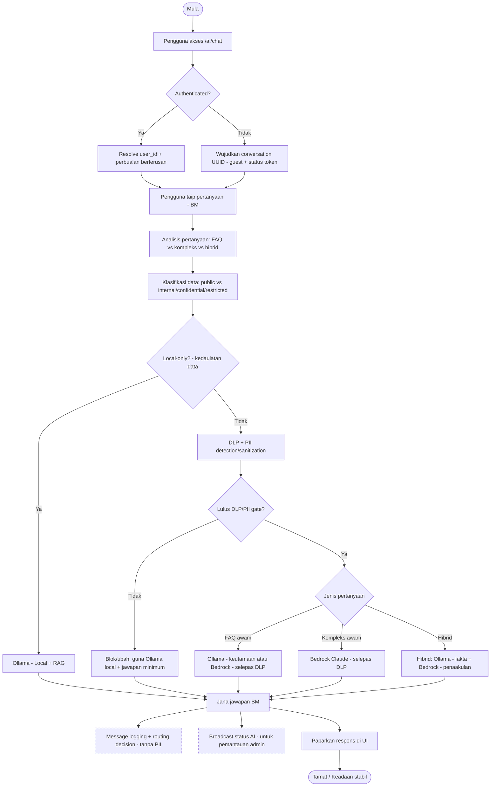
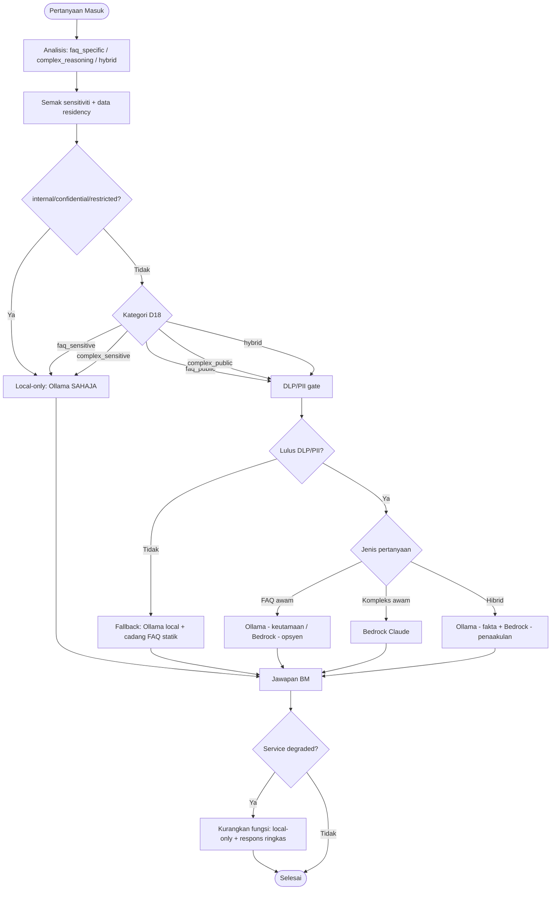
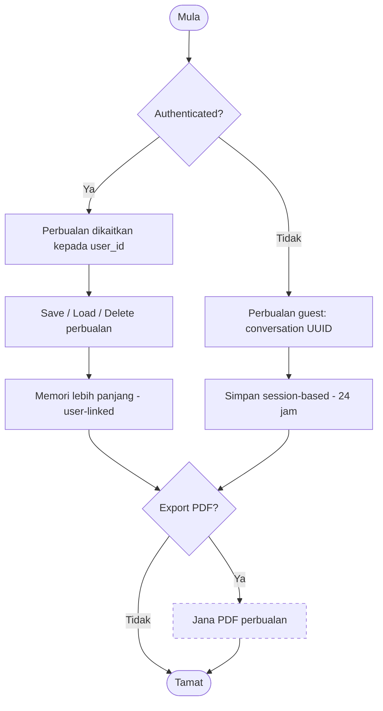
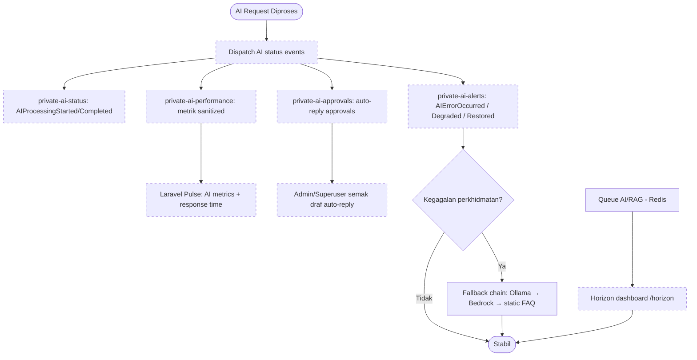
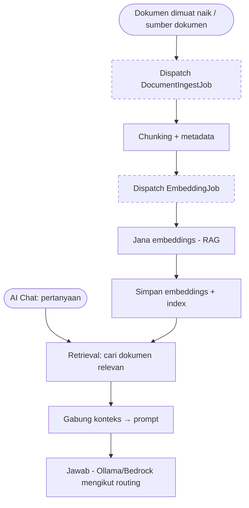
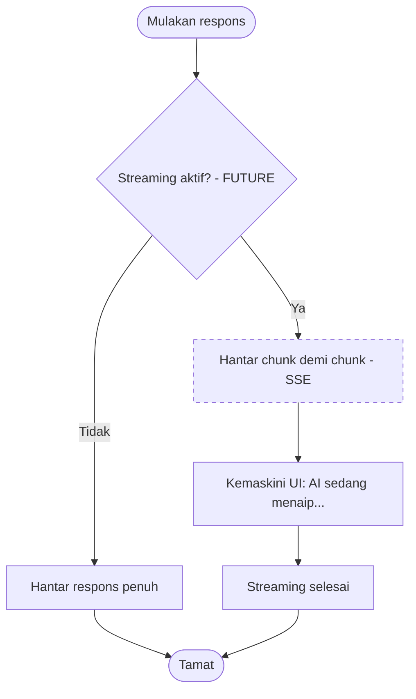

# Rajah Aliran AI Chatbot (AI Chatbot Flow Diagrams) — ICTServe v3.6.1

**Versi sistem:** 3.6.1
**Tarikh:** 2025-12-29
**Nota:** Dokumen ini mengandungi rajah aliran AI Chatbot menggunakan Mermaid.

---

## Notasi

- Nod keputusan menggunakan bentuk berlian (contoh: `X{Soalan?}`)
- Aktiviti asinkron (queue/broadcast) ditanda dengan gaya `async`

```mermaid
flowchart TD
  classDef async stroke-dasharray: 5 5;
```

---

## 1) AI Chatbot End-to-End (High-Level)

Berasaskan D03 §5.9 (SRS-AI-001..020), D18 §5 (routing), D16 (event real-time), D17 (jobs/queues), D15 (BM sahaja).



---

## 2) Decision Tree: Routing + Data Residency + DLP/PII Gate

Berasaskan D18 §5.1 (faq_sensitive, faq_public, complex_sensitive, complex_public) dan D03 SRS-AI-018 (data residency), SRS-AI-007 (PII), SRS-AI-009 (fallback).



---

## 3) Conversation Lifecycle: Guest vs Auth

Berasaskan D03 SRS-AI-005 (pengurusan perbualan) dan D16 (saluran subscription guest UUID).



---

## 4) Ops & Observability (Reverb + Pulse + Horizon)

Berasaskan D16 §3.4 (AI events + channels) dan D03 SRS-AI-019 (performance monitoring), D17 (Horizon).



---

## 5) RAG Ingestion Pipeline (Jobs/Queues)

Berasaskan D17 §4.2 (AI/RAG & Dokumen).



---

## 6) Streaming Responses (FUTURE)

**Nota:** SRS-AI-013 menyatakan streaming SSE sebagai FUTURE. D16 menunjukkan contoh event streaming pada saluran perbualan.


