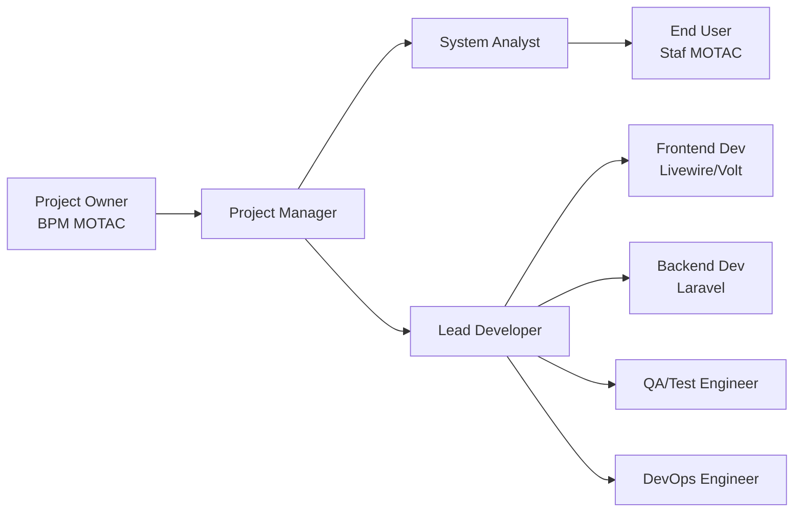
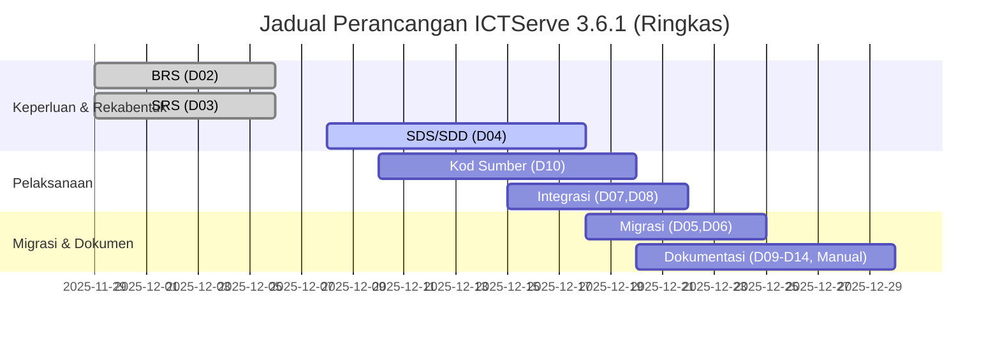

# D01 DOKUMEN PELAN PEMBANGUNAN SISTEM (PPS)

**ICTServe**  
*(Modul: Helpdesk Ticketing, Asset Loan, Inventory, Pentadbiran)*

| | |
| :--- | :--- |
| **NAMA AGENSI** | Kementerian Pelancongan, Seni dan Budaya Malaysia (MOTAC) |
| **NAMA AGENSI INDUK** | Bahagian Pengurusan Maklumat (BPM) MOTAC |
| **TARIKH DOKUMEN** | 17 Disember 2025 |
| **VERSI DOKUMEN** | 3.6.1 |

---

## i. Keterangan Dokumen

Dokumen ini menyatakan pelan bagi pengurusan dan pembangunan sistem **ICTServe v3.6.1** untuk kegunaan dalaman MOTAC (Klasifikasi: **Terhad**). Pelan ini merangkumi tujuan dan skop projek, struktur organisasi pasukan, proses pembangunan (mematuhi **ISO/IEC/IEEE 12207**), proses pengurusan (risiko, kawalan kualiti, pemantauan), proses teknikal (stack, alat bantu, pendekatan), serahan projek, serta jadual perancangan dan milestone.

Kandungan utama dokumen ini dipetakan daripada sumber rujukan versi 3.6.1:  

- [_reference/versions/v3.6.1_D01_SYSTEM_DEVELOPMENT_PLAN.md](_reference/versions/v3.6.1_D01_SYSTEM_DEVELOPMENT_PLAN.md)

## ii. Semakan dan Pengesahan Dokumen

### Semakan Dokumen

| Disemak Oleh | Jawatan | Tandatangan | Tarikh Semakan |
| :--- | :--- | :--- | :--- |
| | | | |
| | | | |

### Pengesahan Dokumen

| Disahkan Oleh | Jawatan | Tandatangan | Tarikh Semakan |
| :--- | :--- | :--- | :--- |
| | | | |
| | | | |

## iii. Kawalan Dokumen

| No. Versi | Tarikh | Ringkasan Pindaan | Penyedia |
| :--- | :--- | :--- | :--- |
| 3.6.1 | 17/12/2025 | **Kemaskini teknologi**: Laravel 12.43.1, Livewire 3.7.3, Laravel Pulse 1.4.7, Laravel Reverb 1.6.3, Laravel Sanctum 4.2.1, Laravel Socialite 5.24.0, PHPUnit 11.5.46, Tailwind CSS 4.1.18, Laravel MCP 0.3.4, Laravel Prompts 0.3.8, Larastan 3.8.1, Laravel Pint 1.26.0, Laravel Telescope 5.16.0, Laravel Horizon 5.41.0.  **Cloud Hybrid AI**: kemas kini pelan pembangunan dengan integrasi D18 (Ollama + AWS Bedrock), termasuk model routing pintar, streaming responses, web-augmented responses, dan conversation management; penyelarasan strategi ujian AI-enhanced workflows. | Pasukan Pembangunan BPM MOTAC |
| 3.6.0 | 08/12/2025 | Penyeragaman dokumentasi v3.6.0: Bahasa Melayu sahaja untuk antara muka pengguna; language switcher dilumpuhkan (kod dikekalkan sebagai komen); fail terjemahan EN dikekalkan untuk rujukan teknikal; penyelarasan dokumentasi lengkap D00–D18 termasuk integrasi Cloud Hybrid AI. | Pasukan BPM |
| 3.5.0 | 01/12/2025 | True Hybrid Architecture: self-registration (@motac.gov.my), flexible login (email/username), optional guest-to-account linking; dual audit system (owen-it + spatie); Laravel Telescope (superuser only). Tambah Laravel Pulse (monitoring), Sanctum (API auth), Socialite (Google Workspace SSO opsyen). 38 requirements, 100 correctness properties, 19 implementation phases. | Pasukan BPM |
| 3.4.0 | 29/11/2025 | Hybrid Architecture: staf boleh log masuk (Breeze) untuk Dashboard/Profile atau gunakan borang tetamu; nullable user_id FK dalam tickets/loans; penyelarasan D00/D02/D03/D04. | Pasukan BPM |
| 3.2.1 | 29/11/2025 | Penjajaran kepada seni bina “Guest-First”: staf guna borang tetamu (tanpa log masuk); authentication terhad kepada admin/superuser; penyelarasan dengan D00/D04. | Pasukan BPM |
| 3.2.0 | 29/11/2025 | Pengesahan versi teknologi semasa (Laravel 12.43.1, PHP 8.2.12, Livewire 3.7.3, Filament 4.3.1, PHPUnit 11.5.46, Larastan 3.8.1, Pint 1.26.0); penyelarasan dengan D00. | Pasukan BPM |
| 3.1.0 | 29/11/2025 | Kemas kini tarikh semasa; pembaikan isu markdownlint; tambah best practices Laravel 12 (struktur ringkas, attribute-based observers/scopes); kemas kini testing framework versions. | Pasukan BPM |
| 3.0.0 | 31/10/2025 | Kemas kini stack: Laravel 12.43.1, Livewire 3.7.3, Filament 4.3.1, Volt 1.10.1, Alpine.js 3, Tailwind CSS 4.1.18, Laravel Reverb 1.6.3. Tambah Docker dev environment, real-time communication, enhanced testing framework. | Pasukan BPM |
| 2.0.0 | 17/10/2024 | Penyeragaman mengikut D00–D14, SemVer, cross-reference, tambah rujukan dokumen. | Pasukan BPM |
| 1.0.0 | 09/2024 | Versi awal pelan pembangunan sistem. | Pasukan BPM |

## iv. Kandungan

1. Pengenalan
    - 1.1 Tujuan Projek
    - 1.2 Skop Projek
    - 1.3 Serahan Projek

1. Pengendalian Projek Pembangunan Aplikasi
    - 2.1 Model Proses
    - 2.2 Struktur Organisasi Pasukan
    - 2.3 Peranan dan Tanggungjawab

1. Proses Pengurusan
    - 3.1 Andaian, Kebergantungan dan Kekangan
    - 3.2 Risiko
    - 3.3 Tahap Kebarangkalian Risiko dan Tahap Impak
    - 3.4 Pemantauan dan Kawalan

1. Proses Teknikal
    - 4.1 Pendekatan, Teknik dan Alat Bantu
    - 4.2 Dokumen Aplikasi
    - 4.3 Dokumen Fungsi Sokongan

1. Pakej Kerja, Jadual dan Peruntukan
    - 5.1 Pakej Kerja
    - 5.2 Kebergantungan
    - 5.3 Sumber
    - 5.4 Peruntukan Kos
    - 5.5 Jadual Perancangan

1. Komponen Tambahan
1. Lampiran

## v. Senarai Gambarajah

- Gambarajah 1: Model Proses Pembangunan (ISO/IEC/IEEE 12207)
- Gambarajah 2: Struktur Organisasi Pasukan Projek
- Gambarajah 3: Jadual Perancangan (Gantt) Pelaksanaan & Dokumentasi

## vi. Senarai Jadual

- Jadual 1: Kawalan Dokumen (Sejarah Perubahan)
- Jadual 2: Organisasi Projek (Peranan & Tanggungjawab Utama)
- Jadual 3: Risiko & Mitigasi
- Jadual 4: Pengurusan Perubahan (Change Management Workflow)
- Jadual 5: Jadual & Milestone
- Jadual 6: Fasa Pembangunan AI (Ringkasan)

## vii. Definisi dan Akronim

### a. Akronim

| Akronim | Keterangan |
| :--- | :--- |
| AI | Artificial Intelligence |
| API | Application Programming Interface |
| BRS | Business Requirements Specification |
| CRUD | Create, Read, Update, Delete |
| ERD | Entity Relationship Diagram |
| ISO | International Organization for Standardization |
| MCP | Model Context Protocol |
| MVC | Model-View-Controller |
| RBAC | Role-Based Access Control |
| SDP | System Development Plan |
| SDS | Software Design Specification / Software Design Document |
| SRS | Software Requirements Specification |
| SSO | Single Sign-On |
| UAT | User Acceptance Testing |
| WCAG | Web Content Accessibility Guidelines |

### b. Definisi

| Terma/Istilah | Definisi |
| :--- | :--- |
| Cloud Hybrid AI | Seni bina AI hibrid menggunakan Ollama (lokal) dan AWS Bedrock (awan) dengan mekanisme routing dan fallback. |
| Inference Profile | Format/preskripsi panggilan model awan (contoh Bedrock) bagi memastikan akses model yang betul dan pematuhan konfigurasi. |
| Klasifikasi Terhad | Tahap klasifikasi maklumat untuk kegunaan dalaman MOTAC; tidak untuk edaran awam. |
| Guest-first | Pendekatan yang mengutamakan pengguna tetamu (tanpa akaun) untuk akses borang; akaun staf wujud sebagai opsyen untuk dashboard/profil. |

## viii. Sumber Rujukan

- Dokumen sumber utama: [_reference/versions/v3.6.1_D01_SYSTEM_DEVELOPMENT_PLAN.md](_reference/versions/v3.6.1_D01_SYSTEM_DEVELOPMENT_PLAN.md)
- Indeks dokumen: [_reference/versions/v3.6.1_INDEX.md](_reference/versions/v3.6.1_INDEX.md)
- Ringkasan sistem: [_reference/versions/v3.6.1_D00_SYSTEM_OVERVIEW.md](_reference/versions/v3.6.1_D00_SYSTEM_OVERVIEW.md)
- Senibina AI: [_reference/versions/v3.6.1_D18_AI_CHATBOT_OLLAMA_BEDROCK.md](_reference/versions/v3.6.1_D18_AI_CHATBOT_OLLAMA_BEDROCK.md)
- Glosari: [_reference/versions/v3.6.1_GLOSSARY.md](_reference/versions/v3.6.1_GLOSSARY.md)
- Template KRISA: [docs/KRISA/OFFICIAL-TEMPLATE-AND-SAMPLES/D01_TEMPLATE_PELAN_PEMBANGUNAN_SISTEM_PPS.md](docs/KRISA/OFFICIAL-TEMPLATE-AND-SAMPLES/D01_TEMPLATE_PELAN_PEMBANGUNAN_SISTEM_PPS.md)
- Piawaian rujukan: ISO/IEC/IEEE 12207, ISO/IEC/IEEE 15289:2019, ISO/IEC TS 24748-6, IEEE 1016:2009

---

## 1. PENGENALAN

### 1.1. Tujuan Projek

ICTServe ialah sistem **Helpdesk & ICT Asset Loan** berasaskan web untuk penggunaan dalaman MOTAC BPM. Tujuan projek pembangunan ini adalah untuk menyediakan platform pengurusan aduan ICT dan permohonan pinjaman aset yang:

- Selaras dengan proses operasi BPM;
- Mematuhi piawaian lifecycle pembangunan perisian **ISO/IEC/IEEE 12207**;
- Memastikan aksesibiliti **WCAG 2.2 AA**;
- Menyokong pemantauan prestasi, audit trail, dan notifikasi;
- Menyokong integrasi **Cloud Hybrid AI** (Ollama + AWS Bedrock) bagi fungsi FAQ Bot dan pemprosesan dokumen (rujuk D18).

### 1.2. Skop Projek

#### 1.2.1 Skop Sistem

- Sistem web berasaskan **Laravel 12.43.1** dengan **Livewire 3.7.3**, **Filament 4.3.1**, dan **Volt 1.10.1** untuk pengurusan tiket aduan ICT dan permohonan pinjaman aset ICT.
- Pengguna sasaran: Staf MOTAC, Pegawai ICT BPM, Ketua Bahagian, Admin BPM.
- Platform: Web-based intranet MOTAC (akses dalaman sahaja).

Stack teknologi utama:

- PHP 8.2.12
- MySQL 8.0
- Redis
- Alpine.js 3
- Tailwind CSS 4.1.18
- Laravel Reverb 1.6.3 (WebSocket)
- Laravel Pulse 1.4.7 (monitoring)
- Laravel Sanctum 4.2.1 (API authentication)
- Laravel Socialite 5.24.0 (Google Workspace SSO opsyen)
- Laravel Telescope 5.16.0 (debugging - superuser)
- Laravel Horizon 5.41.0 (queue monitoring)
- Laravel MCP 0.3.4, Laravel Prompts 0.3.8
- Larastan 3.8.1 (PHPStan untuk Laravel), Laravel Pint 1.26.0 (PSR-12)

#### 1.2.2 Modul Utama

1. Helpdesk Ticketing
2. Asset Loan
3. Inventory Management
4. Authentication & Authorization (Hybrid login + RBAC)
5. Reporting & Dashboard
6. Audit Trail
7. Real-time Communication
8. Performance Monitoring
9. API Authentication (Sanctum)
10. Cloud Hybrid AI (Ollama + AWS Bedrock)

### 1.3. Serahan Projek

Serahan projek meliputi:

1. Sistem ICTServe berfungsi (modul helpdesk, pinjaman aset, inventori, pentadbiran).
2. Dokumen sistem lengkap D00–D18 bagi versi 3.6.1 (rujuk indeks dokumen v3.6.1).
3. Konfigurasi dan komponen sokongan:
    - Setup real-time (Reverb/Echo)
    - Queue management (Horizon)
    - Monitoring (Pulse)
    - Audit logging
    - Integrasi Cloud Hybrid AI (D18)

## 2. PENGENDALIAN PROJEK PEMBANGUNAN APLIKASI

### 2.1. Model Proses

ICTServe mengikuti lifecycle pembangunan berasaskan **ISO/IEC/IEEE 12207** merangkumi inisiasi, keperluan, reka bentuk, pelaksanaan, ujian, deployment dan penyelenggaraan.

```mermaid
%% Portrait A4: gunakan graph LR untuk stacking menegak
graph LR
        subgraph "Inisiasi & Keperluan"
                A1["Kutipan<br/>Keperluan"]
                A2["Dokumentasi<br/>BRS (D02)"]
                A3["Dokumentasi<br/>SRS (D03)"]
        end
        subgraph "Rekabentuk"
                B1["SDS/SDD<br/>(D04)"]
                B2["Rekabentuk<br/>DB (D09)"]
        end
        subgraph "Pelaksanaan"
                C1["Pembangunan<br/>Kod (D10)"]
                C2["Integrasi<br/>(D07,D08)"]
                C3["Migrasi Data<br/>(D05,D06)"]
        end
        subgraph "Ujian & Terimaan"
                D1["Unit/Feature<br/>Tests"]
                D2["E2E/Accessibility<br/>Tests"]
                D3["UAT &<br/>Terimaan"]
        end
        subgraph "Deployment & Penyelenggaraan"
                E1["Deploy<br/>Intranet"]
                E2["Monitoring<br/>(Pulse/Horizon)"]
                E3["Maintenance<br/>& Patch"]
        end
        A1 --> A2 --> A3 --> B1 --> B2 --> C1 --> C2 --> C3 --> D1 --> D2 --> D3 --> E1 --> E2 --> E3
```

### 2.2. Struktur Organisasi Pasukan

Struktur organisasi pasukan projek bagi ICTServe v3.6.1 adalah seperti berikut.

### 2.3. Peranan dan Tanggungjawab

| Peranan | Tanggungjawab Utama |
| :--- | :--- |
| Project Owner | Pemilik sistem, kelulusan hala tuju projek |
| Project Manager | Menyelia jadual, milestone, komunikasi, penutupan CR |
| System Analyst | Analisis keperluan, penyediaan dokumen spesifikasi |
| Lead Developer | Reka bentuk teknikal, standard kod, semakan PR, deployment gate |
| Frontend Developer | UI/UX, Livewire/Volt, Tailwind CSS, Filament UI |
| Backend Developer | API, Eloquent, logik sistem, queue, Reverb/WebSocket |
| QA/Test Engineer | PHPUnit, Playwright E2E, accessibility testing (Axe-core) |
| DevOps Engineer | Docker, deployment, monitoring, runbook, backup/restore |
| End User | UAT, maklum balas operasi, pengesahan aliran kerja |

## 3. PROSES PENGURUSAN

### 3.1. Andaian, Kebergantungan dan Kekangan

Andaian/kebergantungan/kekangan utama:

- Sistem beroperasi dalam intranet MOTAC (akses dalaman sahaja).
- Klasifikasi maklumat: Terhad (penggunaan dalaman MOTAC).
- Kebergantungan infrastruktur: MySQL 8.0, Redis, WebSocket server (Reverb), queue worker (Horizon).
- Kebergantungan keselamatan dan pematuhan: audit trail, validation, role-based access, dan standard kualiti.
- Kekangan integrasi: integrasi sistem legacy memerlukan pengujian awal dan kontrak API yang jelas.
- Kekangan AI: kegagalan servis AI perlu ada fallback (Ollama → Bedrock → static FAQ) dan kawalan kos/akses.

### 3.2. Risiko

Risiko projek, produk, organisasi serta AI (jika berkenaan) dirumuskan seperti berikut.

| Risiko | Strategi Mitigasi |
| :--- | :--- |
| Kelewatan keperluan pengguna | Weekly review, early prototype dengan Livewire |
| Perubahan skop | Change request & impact analysis, SemVer |
| Isu integrasi sistem legacy | Early integration testing, API documentation |
| Kerosakan/kehilangan data | Automated backup, audit trail, soft deletes |
| Masalah keselamatan | Security audit, dependency updates, Larastan analysis |
| Kekurangan dokumentasi | Dedicated documentation phase (D00–D14) |
| Performance issues | Load testing, query optimization, caching |
| Accessibility non-compliance | Automated Axe-core testing, manual WCAG audit |
| Docker environment issues | Documented setup scripts, fallback to manual setup |
| Real-time connection failures | Graceful degradation, polling fallback |
| API token misuse | Rate limiting, token expiration, usage logging |
| Google SSO unavailability | Fallback to Laravel Breeze login |
| Performance monitoring gaps | Laravel Pulse (7-day retention), alerts |
| AI Service Failures | Multi-system fallback: Ollama → Bedrock → static FAQ |
| AWS Bedrock cost overrun | Cost monitoring, rate limiting, Ollama prioritization |
| Ollama server crashes | Health monitoring, auto-restart, graceful degradation |
| Model access denied | Inference profile format, model access verification |
| Data residency violations | Automatic data classification, local-first processing |
| AI response quality issues | Content filtering, confidence scoring, human review |
| Vector embedding failures | Fallback keyword search, embedding regeneration |
| MCP server integration | Standardized interface, error handling, monitoring |

### 3.3. Tahap Kebarangkalian Risiko dan Tahap Impak

| | Kemungkinan | Tinggi | Sederhana | Rendah |
| :--- | :--- | :--- | :--- | :--- |
| **Skala potensi impak** | **Besar** | Kelewatan UAT / scope major | | |
| | **Sederhana** | | Integrasi legacy / isu prestasi | |
| | **Kecil** | | | Pembetulan UI / dokumentasi minor |

### 3.4. Pemantauan dan Kawalan

Mekanisme pemantauan dan kawalan termasuk:

- **Code review** dan peer review untuk setiap pull request.
- **Testing** berlapis: unit test, feature test, E2E test (Playwright), accessibility test (Axe-core), serta UAT.
- **Monitoring prestasi** melalui Laravel Pulse dan pemerhatian queue/worker melalui Laravel Horizon.
- **Debugging terhad** menggunakan Laravel Telescope (superuser only) untuk penyiasatan isu.
- **Pengurusan Perubahan (Change Management)** secara formal seperti jadual berikut:

| Langkah | Aktiviti | Pihak Bertanggungjawab | Kriteria Kelulusan | Dokumentasi |
| :--- | :--- | :--- | :--- | :--- |
| 1. Permohonan Perubahan | Cipta Change Request (CR) dengan deskripsi, impak, risiko | Pembangun/PM | CR lengkap | CR ticket |
| 2. Penilaian Impak | Analisis dampak teknikal, jadual, sumber daya | Technical Lead | Impak didokumenkan | Impact report |
| 3. Kelulusan Teknikal | Semak CR dan kelulusan/penolakan teknikal | Lead Developer | Teknikal munasabah | Approval note |
| 4. Kelulusan Pengurusan | Kelulusan akhir | Project Manager | Jadual/bajet OK | PM sign-off |
| 5. Pelaksanaan | Laksana perubahan, ujian, dokumentasi | Developer | Code review lulus | Commit message |
| 6. Ujian & Validasi | Ujian regresi/UAT jika perlu | QA/Tester | Semua ujian lulus | Test report |
| 7. Deployment | Deploy dengan runbook | DevOps | Checklist lengkap | Deployment log |
| 8. Dokumentasi | Kemas kini D00–D14 & RTM jika perlu | Technical Writer | Selaras dengan kod | Updated doc |
| 9. Penutupan CR | Tutup CR & lessons learned | PM | Semua langkah selesai | CR closed |

## 4. PROSES TEKNIKAL

### 4.1. Pendekatan, Teknik dan Alat Bantu

Pendekatan teknikal dan alat bantu yang digunakan:

- **Seni bina aplikasi**: Laravel MVC + SDUI (Filament), komponen interaktif melalui Livewire/Volt.
- **Persekitaran pembangunan**: Docker Compose (multi-container) serta Vite untuk asset bundling/HMR.
- **Autentikasi & autorisasi**: Laravel Breeze (akaun pangkalan data) untuk admin/superuser; self-registration untuk staf domain `@motac.gov.my`; RBAC melalui Spatie Permission; Google Workspace SSO opsyen (Laravel Socialite); API token auth melalui Laravel Sanctum (abilities + rate limiting).
- **Data**: MySQL 8.0 (FK constraints), audit trail (owen-it/laravel-auditing + spatie activitylog).
- **Real-time**: Laravel Reverb + Laravel Echo.
- **Performance monitoring**: Laravel Pulse (retention 7 hari) dan optimisasi aplikasi (cache, query optimization).
- **Quality control**: PSR-12 melalui Laravel Pint; type safety melalui Larastan; unit/feature test melalui PHPUnit; E2E melalui Playwright; accessibility testing melalui Axe-core (WCAG 2.2 AA).

### 4.2. Dokumen Aplikasi

Dokumentasi wajib projek (ringkasan):

- D00: System Overview
- D01: System Development Plan (dokumen ini)
- D02: Business Requirements Specification
- D03: Software Requirements Specification
- D04: Software Design Document
- D05–D06: Data Migration Plan & Specification
- D07–D08: System Integration Plan & Specification
- D09: Database Documentation
- D10: Source Code Documentation
- D11: Technical Design Documentation
- D12–D14: UI/UX Documentation

### 4.3. Dokumen Fungsi Sokongan

Dokumen sokongan (contoh):

- Manual Pengguna / Administrator Guide
- API Documentation
- Deployment Guide
- Troubleshooting Guide

## 5. PAKEJ KERJA, JADUAL DAN PERUNTUKAN

### 5.1. Pakej Kerja

| Bil. | Nama Personel/Unit | Tempoh Pengalaman ICT (Tahun) | Pengalaman Projek Berkaitan | Bidang Kepakaran | Peranan & Tanggungjawab |
| :--- | :--- | :--- | :--- | :--- | :--- |
| 1 | BPM MOTAC (Project Owner) | N/A | Ya | Tadbir Urus | Kelulusan arah projek, pemilik sistem |
| 2 | Project Manager | N/A | Ya | Pengurusan Projek | Jadual, milestone, komunikasi |
| 3 | System Analyst | N/A | Ya | Analisis | Keperluan, dokumen spesifikasi |
| 4 | Lead Developer | N/A | Ya | Laravel/Architecture | Rekabentuk teknikal, code review |
| 5 | Frontend Developer | N/A | Ya | Livewire/Volt/Tailwind | UI/UX, aksesibiliti |
| 6 | Backend Developer | N/A | Ya | Laravel/MySQL/Redis | API, queue, Reverb |
| 7 | QA/Test Engineer | N/A | Ya | PHPUnit/Playwright | Test automation & UAT support |
| 8 | DevOps Engineer | N/A | Ya | Docker/Deployment | Deploy, monitoring, backup |

### 5.2. Kebergantungan

- Rekabentuk pangkalan data (D09) menjadi asas kepada pembangunan modul dan migrasi data (D05–D06).
- Integrasi sistem (D07–D08) bergantung kepada kontrak API dan ujian integrasi awal.
- Real-time features bergantung kepada penyediaan Reverb/Echo (D16).
- Queue jobs dan notifikasi bergantung kepada Horizon (D17) dan konfigurasi mail.
- Cloud Hybrid AI bergantung kepada D18 serta polisi keselamatan/privasi (data classification, fallback).

### 5.3. Sumber

- Infrastruktur: VM/server intranet, MySQL 8.0, Redis, storage (S3/MinIO jika digunakan), WebSocket server.
- Perisian: Laravel stack (seperti di 4.1), CI/CD (jika digunakan), tooling ujian.
- Akses: akaun persekitaran dalaman MOTAC, kawalan peranan (RBAC).

### 5.4. Peruntukan Kos

Peruntukan kos adalah tertakluk kepada peruntukan dalaman MOTAC (operasi/perkhidmatan), termasuk kos infrastruktur dan operasi (hosting intranet, storage, penyelenggaraan).

### 5.5. Jadual Perancangan

Jadual dan milestone utama (ringkasan):

| Fasa | Tempoh | Deliverable |
| :--- | :--- | :--- |
| Inisiasi & Keperluan | 2 minggu | D02, D03, ERD |
| Rekabentuk Sistem | 2 minggu | D04, wireframe, skema DB |
| Setup Development | 1 minggu | Docker environment, CI/CD |
| Pembangunan Core | 4 minggu | Auth, models, migrations |
| Pembangunan Modules | 6 minggu | Helpdesk, Asset Loan, Filament Admin |
| Real-time Features | 2 minggu | Reverb integration |
| Performance & API | 2 minggu | Pulse, Sanctum API, Google SSO (opsyen) |
| UI/UX Implementation | 3 minggu | Livewire components, Tailwind, accessibility |
| Ujian & UAT | 3 minggu | PHPUnit, Playwright, Axe-core, UAT |
| Documentation | 2 minggu | D09–D14, manual pengguna |
| Deployment | 1 minggu | Production deployment, monitoring |
| Maintenance | Berterusan | Patch, backup, support |

Ringkasan fasa pembangunan AI (rujuk D18):

| Fasa AI | Tempoh | Deliverable | Status |
| :--- | :--- | :--- | :--- |
| 1: Asas & Infrastruktur | 1 minggu | OllamaClient, config/ollama.php, health checks | Selesai |
| 2: Skema Pangkalan Data | 1 minggu | Faq/Document/MessageLog models, migrations | Selesai |
| 3: Core AI Services | 2 minggu | RagService, DocumentService, EmbeddingService | Selesai |
| 4: Background Jobs | 1 minggu | Ingest/Embedding jobs, queue setup | Selesai |
| 5: API Endpoints | 1 minggu | Controllers, routes | Selesai |
| 6: Filament Admin | 1 minggu | Resources, widgets | Selesai |
| 7: Security & Compliance | 1 minggu | PII detection, policies, audit | Selesai |
| 8: Livewire Components | 1 minggu | Chat interface | Selesai |
| 9: Email Notifications | 1 minggu | Signed URLs/token flows | Selesai |
| 10: Performance Optimization | 1 minggu | Redis caching, Pulse | Selesai |
| 11: Testing & Documentation | 1 minggu | PHPUnit tests, API docs | Selesai |
| 12: Deployment & Monitoring | 1 minggu | Health checks, alerts | Selesai |
| 13: Cloud Hybrid AI (Bedrock) | 2 minggu | BedrockService, ModelRouter, hybrid responses | Selesai |

## 6. KOMPONEN TAMBAHAN

Komponen tambahan yang berkaitan dengan pelaksanaan projek:

- Pelan keselamatan: pengesahan input (Form Request), CSRF, rate limiting, audit trail, dependency updates, dan kawalan akses (RBAC).
- Pelan latihan: latihan penggunaan modul (pengguna akhir) dan latihan pentadbiran (Filament/admin).
- Pelan pematuhan & kualiti: proses kawalan kualiti, audit keselamatan, dan pemantauan prestasi berterusan.
- Pelan rollback: untuk perubahan major/critical (mengikut proses change management).

## 7. LAMPIRAN

- Senarai dokumen berkaitan: D00–D18 (rujuk indeks v3.6.1).
- Glosari istilah teknikal: rujuk dokumen glosari v3.6.1.
- Notis penggunaan dalaman: sistem ini adalah untuk kegunaan dalaman MOTAC (bukan untuk edaran awam).

---

TAMAT DOKUMEN / END OF DOCUMENT
