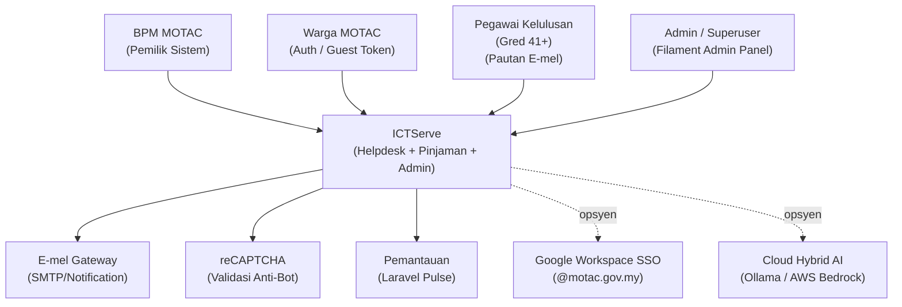
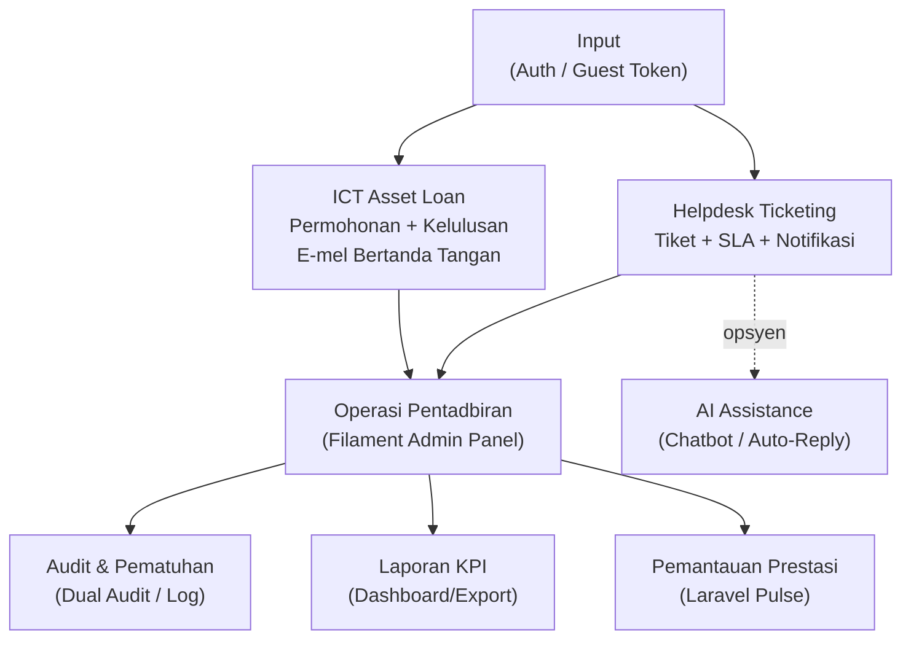
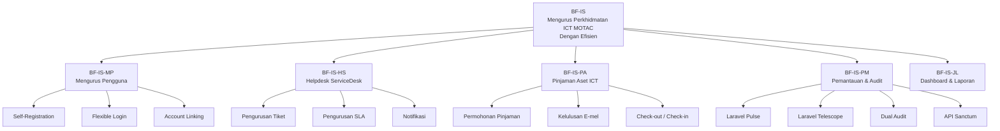
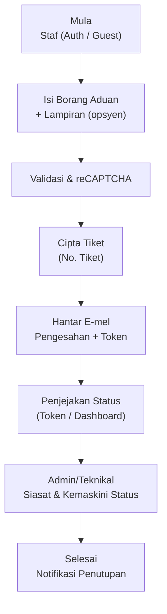
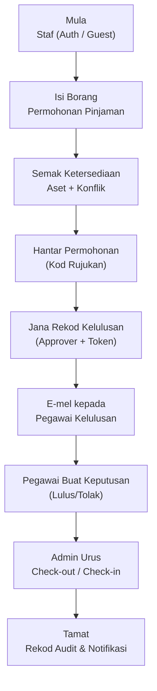

# D02 DOKUMEN SPESIFIKASI KEPERLUAN BISNES (BRS)

**ICTServe**
*(Modul: Helpdesk Ticketing, ICT Asset Loan, Pentadbiran, Pemantauan & Audit, Cloud Hybrid AI)*

| | |
| :--- | :--- |
| **NAMA AGENSI** | Kementerian Pelancongan, Seni dan Budaya Malaysia (MOTAC) |
| **NAMA AGENSI INDUK** | Bahagian Pengurusan Maklumat (BPM) MOTAC |
| **TARIKH DOKUMEN** | 29 Disember 2025 |
| **VERSI DOKUMEN** | 3.6.1 |

---

## i. Keterangan Dokumen

Dokumen ini menyatakan spesifikasi keperluan bisnes bagi sistem **ICTServe v3.6.1** untuk kegunaan dalaman MOTAC (Klasifikasi: **Terhad**). Dokumen ini menerangkan:

- tujuan dan skop bisnes bagi modul Helpdesk Ticketing dan ICT Asset Loan;
- gambaran keseluruhan struktur organisasi dan pemegang taruh;
- keperluan pengurusan bisnes (matlamat, objektif, arkitektur bisnes dan arkitektur maklumat);
- keperluan pengoperasian bisnes (fungsi bisnes, proses bisnes dan pengiraan saiz sistem aplikasi);
- lampiran dokumen sokongan dan rujukan.

Kandungan utama dokumen ini dipetakan daripada sumber rujukan versi 3.6.1:

- [_reference/versions/v3.6.1_D02_BUSINESS_REQUIREMENTS_SPECIFICATION.md](_reference/versions/v3.6.1_D02_BUSINESS_REQUIREMENTS_SPECIFICATION.md)

## ii. Semakan dan Pengesahan Dokumen

**SEMAKAN DOKUMEN**

| Disemak Oleh | Jawatan | Tandatangan | Tarikh Semakan |
| :--- | :--- | :--- | :--- |
| | | | |
| | | | |

**PENGESAHAN DOKUMEN**

| Disahkan Oleh | Jawatan | Tandatangan | Tarikh Semakan |
| :--- | :--- | :--- | :--- |
| | | | |
| | | | |

## iii. Kawalan Dokumen

**KAWALAN DOKUMEN**

| No. Versi | Tarikh | Ringkasan Pindaan | Penyedia |
| :--- | :--- | :--- | :--- |
| 3.6.1 | 29/12/2025 | Kemas kini BRS: **Hybrid Access Model** (auth + guest token), **Hybrid Data Association** (nullable `user_id`), penambahbaikan workflow kelulusan e-mel (signed token), keperluan **Cloud Hybrid AI** (D18), pematuhan WCAG 2.2 AA serta MyGOV Digital Service Standards v2.1.0; penambahan Function Point Analysis (FPA) dan RTM rujukan. | Pasukan Pembangunan BPM MOTAC |
| 3.6.0 | 08/12/2025 | Penyeragaman dokumen: Bahasa Melayu sebagai bahasa utama UI; penyelarasan rujukan D00–D18 dan standard kebolehcapaian. | Pasukan BPM |
| 3.5.0 | 01/12/2025 | Penambahan self-registration (@motac.gov.my), flexible login (email/username), guest-to-account linking, dual audit system, Laravel Pulse/Telescope (akses terhad). | Pasukan BPM |
| 3.4.0 | 29/11/2025 | Pengukuhan seni bina **Hybrid**: borang tetamu tanpa log masuk disokong untuk staf; `user_id` nullable pada tiket/pinjaman. | Pasukan BPM |

## iv. Kandungan

1. Pengenalan
    - 1.1. Tujuan Bisnes
    - 1.2. Skop Bisnes
    - 1.3. Gambaran Keseluruhan Projek
    - 1.4. Senarai Pemegang Taruh

2. Keperluan Pengurusan Bisnes
    - 2.1 Matlamat dan Objektif
    - 2.2 Arkitektur Bisnes
    - 2.3 Arkitektur Maklumat

3. Keperluan Pengoperasian Bisnes
    - 3.1 Keperluan Fungsi Bisnes
    - 3.2 Keperluan Proses Bisnes
    - 3.3 Pengiraan Saiz Sistem Aplikasi

4. Lampiran

## v. Senarai Gambarajah

- Gambarajah 1: Gambaran Struktur Organisasi & Entiti Berkaitan
- Gambarajah 2: Arkitektur Bisnes ICTServe (Ringkasan Modul)
- Gambarajah 3: Rajah Hirarki Fungsi Bisnes (BF-IS)
- Gambarajah 4: Model Proses Bisnes Helpdesk Ticketing (Ringkas)
- Gambarajah 5: Model Proses Bisnes ICT Asset Loan (Ringkas)

## vi. Senarai Jadual

- Jadual 1: Kawalan Dokumen (Sejarah Perubahan)
- Jadual 2: Senarai Pemegang Taruh
- Jadual 3: Objektif Bisnes & Kriteria Kejayaan (KPI)
- Jadual 4: Model Akses Pengguna (Hybrid)
- Jadual 5: Keterangan Fungsi Bisnes
- Jadual 6: Senarai Pengguna & Peranan
- Jadual 7: Definisi Fungsi Bisnes (Helpdesk)
- Jadual 8: Definisi Fungsi Bisnes (ICT Asset Loan)
- Jadual 9: Ringkasan Pengiraan Function Points

## vii. Definisi dan Akronim

### a. Akronim

| Akronim | Keterangan |
| :--- | :--- |
| AFP | Adjusted Function Points |
| AI | Artificial Intelligence |
| API | Application Programming Interface |
| BRS | Business Requirements Specification |
| BPM | Bahagian Pengurusan Maklumat |
| EI/EO/EQ | External Input / External Output / External Inquiry |
| EIF/ILF | External Interface File / Internal Logical File |
| FPA | Function Point Analysis |
| GSC | General System Characteristics |
| KPI | Key Performance Indicator |
| LCP | Largest Contentful Paint |
| MCP | Model Context Protocol |
| MOTAC | Kementerian Pelancongan, Seni dan Budaya Malaysia |
| NFR | Non-Functional Requirements |
| PDPA | Personal Data Protection Act 2010 |
| RAG | Retrieval-Augmented Generation |
| RBAC | Role-Based Access Control |
| RTM | Requirements Traceability Matrix |
| SLA | Service Level Agreement |
| SSO | Single Sign-On |
| TDI | Total Degree of Influence |
| UFP | Unadjusted Function Points |
| VAF | Value Adjustment Factor |
| WCAG | Web Content Accessibility Guidelines |

### b. Definisi

| Terma/Istilah | Definisi |
| :--- | :--- |
| Tetamu (Guest) | Pengguna yang mengemukakan borang tanpa akaun aplikasi; penjejakan dilakukan melalui token/pautan e-mel. |
| Authenticated Staff | Staf MOTAC yang log masuk (contoh: Laravel Breeze) untuk akses Dashboard/Profil serta auto-fill borang. |
| Pautan Kelulusan Bertanda Tangan | URL unik dengan token bertanda tangan (hashed/signed) dan tarikh luput untuk membuat keputusan kelulusan pinjaman. |
| Hybrid Access Model | Model akses yang menyokong mod log masuk (authenticated) dan mod tetamu (guest/token) untuk staf MOTAC. |
| Hybrid Data Association | Keperluan data yang menyokong penyimpanan rekod dengan `user_id` nullable (jika auth) dan medan `guest_*`/`applicant_*` (jika tetamu). |
| Cloud Hybrid AI | Integrasi AI yang menghala antara model tempatan (Ollama) dan cloud (AWS Bedrock) berdasarkan klasifikasi data, kos, dan kompleksiti prompt. |

## viii. Sumber Rujukan

- [docs/KRISA/OFFICIAL-TEMPLATE-AND-SAMPLES/D02_TEMPLATE_SPESIFIKASI_KEPERLUAN_BISNES_BRS.md](docs/KRISA/OFFICIAL-TEMPLATE-AND-SAMPLES/D02_TEMPLATE_SPESIFIKASI_KEPERLUAN_BISNES_BRS.md)
- [_reference/versions/v3.6.1_D02_BUSINESS_REQUIREMENTS_SPECIFICATION.md](_reference/versions/v3.6.1_D02_BUSINESS_REQUIREMENTS_SPECIFICATION.md)
- ISO/IEC/IEEE 29148 (Requirements Engineering)
- ISO/IEC/IEEE 15288 (System Life Cycle Processes)
- WCAG 2.2 AA (W3C)
- MyGOV Digital Service Standards v2.1.0
- PDPA 2010 (Malaysia)

---

## 1. PENGENALAN

### 1.1. Tujuan Bisnes

ICTServe dibangunkan untuk menyatukan proses **pengurusan aduan/perkhidmatan ICT (Helpdesk Ticketing)** dan **pengurusan pinjaman aset ICT (ICT Asset Loan)** untuk kegunaan dalaman MOTAC. Keperluan bisnes utama adalah memastikan:

- pengumpulan aduan dan permohonan tidak lagi bergantung kepada e-mel/manual;
- penjejakan status yang telus (melalui Dashboard untuk pengguna log masuk, atau token untuk tetamu);
- proses kelulusan pinjaman yang cepat dan boleh diaudit melalui pautan kelulusan e-mel bertanda tangan;
- pemantauan prestasi operasi (SLA/KPI) serta pematuhan audit/PDPA;
- pengalaman pengguna yang **boleh dicapai** (WCAG 2.2 AA), **berprestasi** (sasaran Core Web Vitals) dan **selamat**.

**Hybrid Access Model** adalah prinsip teras: staf MOTAC boleh memilih untuk log masuk (untuk kemudahan Dashboard & auto-fill) atau menggunakan borang tetamu tanpa log masuk (quick access) yang ditjejak melalui token e-mel.

### 1.2. Skop Bisnes

Skop bisnes ICTServe v3.6.1 merangkumi domain berikut:

1. **Helpdesk Ticketing**
   - penghantaran tiket (authenticated atau guest);
   - pengesahan e-mel dan penjejakan status (token link);
   - pengurusan kategori/SLA, eskalasi, notifikasi;
   - pengurusan tiket oleh pentadbir/teknikal melalui panel pentadbiran.

2. **ICT Asset Loan**
   - permohonan pinjaman (authenticated atau guest);
   - semakan ketersediaan aset dan konflik tempahan;
   - kelulusan melalui e-mel (Gred 41+) menggunakan pautan bertanda tangan;
   - proses pengeluaran/pemulangan aset (check-out/check-in) serta rekod kerosakan.

3. **Pentadbiran, Pemantauan & Audit**
   - laporan KPI dan pemantauan SLA;
   - audit trail (dual audit) untuk pematuhan dan penyiasatan;
   - pemantauan prestasi aplikasi (Laravel Pulse) dan debugging (Laravel Telescope — superuser).

4. **Cloud Hybrid AI Services (Integrasi D18)**
   - chatbot FAQ dan automasi draf jawapan untuk helpdesk;
   - analisis dokumen dengan pematuhan kedaulatan data;
   - routing model pintar (Ollama tempatan vs AWS Bedrock cloud) berdasarkan klasifikasi data/kos.

### 1.3. Gambaran Keseluruhan Projek

ICTServe dioperasikan oleh BPM MOTAC sebagai pemilik sistem. Interaksi utama adalah antara staf MOTAC (pengguna borang), pentadbir (pengurusan operasi), dan pegawai kelulusan (pautan e-mel). Sistem turut bergantung kepada integrasi perkhidmatan seperti e-mel, reCAPTCHA, dan AI (pilihan).

### 1.4. Senarai Pemegang Taruh

| Pemegang Taruh | Peranan | Keperluan / Kepentingan Utama |
| :--- | :--- | :--- |
| BPM MOTAC | Pemilik sistem dan tadbir urus | KPI operasi, pematuhan audit/PDPA, pelaporan, kecekapan proses. |
| Admin Sistem (BPM) | Operasi harian melalui panel pentadbiran | Urus tiket/pinjaman/aset, notifikasi, laporan, konfigurasi harian. |
| Superuser (BPM) | Kawalan pentadbiran penuh | Konfigurasi keselamatan, audit, integrasi, akses debugging (Telescope), pemantauan Pulse. |
| Kakitangan Teknikal | Pengendalian tiket helpdesk | Keutamaan/SLA, rekod tindakan, penyelesaian tiket, komunikasi dengan pengguna. |
| Pengurus/Pegawai Aset ICT | Pengurusan inventori dan pinjaman | Ketersediaan aset, kelulusan, check-out/check-in, rekod kerosakan, laporan penggunaan. |
| Pegawai Kelulusan (Gred 41+) | Kelulusan pinjaman melalui pautan e-mel | Akses mudah tanpa log masuk, keputusan dicap masa, rekod untuk audit. |
| Warga MOTAC (Staf) | Pengguna akhir sistem | Penghantaran aduan/pinjaman yang pantas, penjejakan status, auto-fill (jika log masuk), kebolehcapaian. |
| Unit Keselamatan / Audit | Semakan pematuhan | Jejak audit, kawalan akses, pematuhan PDPA, retensi data. |

## 2. KEPERLUAN PENGURUSAN BISNES

### 2.1 Matlamat dan Objektif

**Matlamat**: Mengurus perkhidmatan ICT MOTAC dengan lebih cekap, telus, dan boleh diaudit melalui satu platform bersepadu.

**Objektif** (diringkaskan daripada keperluan bisnes dan kriteria kejayaan v3.6.1):

- memusatkan proses aduan helpdesk dan permohonan pinjaman aset;
- mengurangkan beban proses manual/e-mel;
- mempercepat kelulusan pinjaman melalui workflow e-mel bertanda tangan;
- memastikan pematuhan kebolehcapaian (WCAG 2.2 AA) dan piawaian perkhidmatan digital kerajaan;
- memastikan keselamatan, audit trail, dan pematuhan PDPA;
- menyediakan pemantauan prestasi sistem dan kebolehcapaian operasi (Pulse/Telescope).

| ID | Kriteria Kejayaan (Success Criteria) | Sasaran |
| :--- | :--- | :--- |
| SC-01 | 100% permohonan & aduan dihantar melalui borang | Tiada lagi pengumpulan manual/e-mel untuk tiket & pinjaman |
| SC-02 | SLA tindak balas helpdesk | ≥ 90% dicapai setiap bulan |
| SC-03 | Kelulusan Gred 41 melalui pautan e-mel | ≥ 95% tanpa bantuan manual |
| SC-04 | Skor Lighthouse (Desktop/Mobile) | ≥ 90 untuk borang utama |
| SC-05 | Pematuhan audit PDPA & ICT MOTAC | Tiada ketakpatuhan kritikal semasa audit tahunan |
| SC-06 | Pemantauan prestasi Laravel Pulse | Admin/superuser mengesan isu secara proaktif |
| SC-07 | Infrastruktur API (Sanctum) | Token API berfungsi untuk integrasi masa depan |
| SC-08 | Google Workspace SSO (jika diaktifkan) | ≥ 80% staf menggunakan SSO untuk log masuk |

### 2.2 Arkitektur Bisnes

Arkitektur bisnes ICTServe dibentuk mengikut modul operasi teras (Helpdesk, Pinjaman Aset, Pentadbiran) dengan sokongan pemantauan, audit dan AI. Prinsip arkitektur utama:

- **Hybrid Access**: authenticated staff atau guest/token;
- **Workflow e-mel**: pengesahan/kelulusan melalui pautan bertanda tangan;
- **Real-time**: notifikasi masa nyata dan kemaskini status;
- **Governance**: audit trail, PDPA, pemantauan prestasi.

### 2.3 Arkitektur Maklumat

Arkitektur maklumat menerangkan kategori data, pemilik data, dan kegunaan data dalam operasi bisnes. ICTServe menyimpan data minimum yang diperlukan, menyokong penjejakan token untuk pengguna tetamu, serta audit trail untuk perubahan dan aktiviti.

**Kategori data utama**:

| Kategori Data | Contoh Data | Tujuan Bisnes |
| :--- | :--- | :--- |
| Data Tetamu (Guest) | nama, e-mel, telefon, bahagian, gred, butiran aduan/permohonan, lampiran | Membolehkan quick access tanpa log masuk dan penjejakan token. |
| Data Staff (Authenticated) | profil pengguna, `user_id` (nullable FK), sejarah submission | Dashboard “My Submissions”, auto-fill borang, penjejakan berpusat pengguna. |
| Data Tiket Helpdesk | kategori, SLA, status, komen/tindakan, notifikasi | Pengurusan aduan, pematuhan SLA, pelaporan trend. |
| Data Pinjaman Aset | permohonan, aset dipilih, tarikh, lokasi, status, transaksi | Pengurusan inventori dan proses pinjaman/return. |
| Data Kelulusan | e-mel approver, gred, token bertanda tangan, keputusan, catatan | Kelulusan cepat tanpa log masuk, rekod audit. |
| Data Audit & Prestasi | log audit, activity log, metrik Pulse | Pematuhan, forensik, pemantauan proaktif, pengoptimuman prestasi. |
| Data AI (jika diaktifkan) | sejarah perbualan, klasifikasi data, keputusan routing | Chatbot/auto-reply, pematuhan kedaulatan data, penjimatan kos. |

## 3. KEPERLUAN PENGOPERASIAN BISNES

### 3.1 Keperluan Fungsi Bisnes

#### 3.1.1 Penggunaan Notasi

Notasi berikut digunakan untuk Model Fungsi Bisnes (rujukan hierarki fungsi bisnes v3.6.1):

| Notasi | Keterangan |
| :--- | :--- |
| [ ] | Fungsi utama — menunjukkan modul atau domain perniagaan utama |
| [ ]-[ ] | Fungsi dan subfungsi — hubungan fungsi utama dengan subfungsi |
| [ ]-[ ]-[ ] | Fungsi, subfungsi dan aktiviti — langkah spesifik dalam subfungsi |
| BF-IS-* | Penamaan kod fungsi (contoh: BF-IS-HS untuk Helpdesk/ServiceDesk) |

#### 3.1.2 Model Fungsi Bisnes

Model fungsi bisnes dirumus sebagai hierarki fungsi yang menyokong pengurusan perkhidmatan ICT secara bersepadu.

**Keterangan fungsi**:

| Kod Fungsi | Nama Fungsi | Keterangan |
| :--- | :--- | :--- |
| BF-IS | Pengurusan Perkhidmatan ICT | Fungsi utama: pengurusan perkhidmatan ICT di MOTAC secara bersepadu. |
| BF-IS-MP | Mengurus Pengguna | Pengurusan profil pengguna: self-registration, login, account linking. |
| BF-IS-MP-SR | Self-Registration | Pendaftaran staf dengan @motac.gov.my, pengesahan e-mel, aktivasi akaun. |
| BF-IS-MP-FL | Flexible Login | Log masuk menggunakan e-mel penuh atau username pendek. |
| BF-IS-MP-AL | Account Linking | Menghubungkan submission tetamu terdahulu dengan akaun staf baharu. |
| BF-IS-HS | Helpdesk/ServiceDesk | Pengurusan helpdesk: hybrid submission, SLA, notifikasi, status tracking. |
| BF-IS-HS-TK | Pengurusan Tiket | Daftar, kemaskini, selesai tiket; mod hybrid (authenticated/guest). |
| BF-IS-HS-SLA | Pengurusan SLA | Pemantauan SLA, peringatan breach, eskalasi automatik. |
| BF-IS-HS-NT | Pengurusan Notifikasi | Notifikasi multi-saluran (e-mel, database, WebSocket) dengan keutamaan pengguna. |
| BF-IS-PA | Pinjaman Aset ICT | Pengurusan pinjaman: permohonan hybrid, kelulusan e-mel, transaksi aset. |
| BF-IS-PA-PP | Permohonan Pinjaman | Proses permohonan hybrid, conflict detection, semakan ketersediaan. |
| BF-IS-PA-KL | Kelulusan E-mel | Kelulusan melalui signed approval link untuk pegawai Gred 41+. |
| BF-IS-PA-CO | Check-out & Check-in | Pengeluaran/pemulangan aset, rekod transaksi, laporan kerosakan. |
| BF-IS-PM | Pemantauan & Audit | Pemantauan prestasi, audit, debugging, pengurusan API. |
| BF-IS-PM-PS | Laravel Pulse | Dashboard prestasi masa nyata: slow queries, queue jobs, server health. |
| BF-IS-PM-TS | Laravel Telescope | Debugging dan monitoring (superuser only, akses penuh). |
| BF-IS-PM-DA | Dual Audit System | Audit field-level + activity logging untuk compliance. |
| BF-IS-PM-API | API Authentication (Sanctum) | Token-based API auth untuk integrasi masa depan. |
| BF-IS-JL | Dashboard & Laporan | Paparan KPI, dashboard real-time, penjanaan laporan, eksport data. |

#### 3.1.3 Senarai Pengguna

**Model Akses Pengguna (Hybrid)**:

| Profil Pengguna | Medium Akses | Nota |
| :--- | :--- | :--- |
| Guest (Token) | Borang tetamu tanpa log masuk | Staf boleh gunakan borang tetamu; penjejakan melalui token e-mel. |
| Staff (Auth) | Portal (login pilihan) | Dashboard/Profil; auto-fill borang; submissions dipautkan ke `user_id` (nullable). |
| Pegawai Kelulusan | E-mel (pautan bertanda tangan) | Menilai permohonan pinjaman tanpa log masuk; token luput. |
| Admin | Panel pentadbiran | Mengurus operasi tiket/pinjaman/aset, notifikasi dan laporan. |
| Self-Registered Staff | Portal (login selepas pendaftaran) | Pendaftaran @motac.gov.my, pengesahan e-mel, akses Dashboard/Profil. |
| Superuser | Panel pentadbiran | Akses pentadbiran penuh termasuk konfigurasi, audit, Pulse dan Telescope. |

**Senarai pengguna dan peranan**:

| Pengguna | Peranan / Kebenaran Akses |
| :--- | :--- |
| Pentadbir Sistem (Superuser) | Akses penuh: konfigurasi, kawalan akses, audit, Pulse, backup, Telescope. |
| Pentadbir Sistem (Admin) | Operasi harian: tiket, aset, notifikasi, laporan, Pulse, konfigurasi harian. |
| Pengurus BPM | Akses laporan KPI, dashboard eksekutif, menjana & menjadual laporan. |
| Kakitangan Teknikal | Pengurusan kes: lihat/kemaskini/resolve tiket, catat tindakan, pemantauan SLA. |
| Pengurus Aset ICT | Akses inventori, semak/kelulusan pinjaman, sediakan aset, damage reporting. |
| Kakitangan Aset ICT | Pengeluaran/penerimaan aset, rekod check-out/check-in, accessory tracking. |
| Pegawai Kelulusan (Gred 41+) | Kelulusan pinjaman via e-mel: approve/reject melalui signed approval link. |
| Warga MOTAC (Staff, Auth) | Self-register, login, dashboard, submission history, profil, auto-fill. |
| Warga MOTAC (Guest) | Submit borang tanpa login, track status via token, quick access untuk kes segera. |

### 3.2 Keperluan Proses Bisnes

#### 3.2.1 Penggunaan Notasi

Notasi yang digunakan untuk Model Proses Bisnes:

| Notasi | Keterangan |
| :--- | :--- |
| BPMN 2.0 (konseptual) | Pemetaan proses bisnes (rujukan dalaman). |
| Flowchart / Mermaid Flowchart | Persembahan aliran proses ringkas (A4-friendly) dalam dokumen ini. |
| RACI (jika perlu) | Menjelaskan peranan Responsible/Accountable/Consulted/Informed. |

#### 3.2.2 Model Proses Bisnes

**A. Proses Helpdesk Ticketing (Hybrid)**

| Langkah | Fungsi Bisnes | Input | Output | Peranan Utama |
| :--- | :--- | :--- | :--- | :--- |
| 1 | BF-IS-HS-TK | Borang aduan | Draf tiket | Warga MOTAC |
| 2 | BF-IS-HS-TK | Data borang + reCAPTCHA | Tiket disimpan | Sistem |
| 3 | BF-IS-HS-NT | No. tiket + e-mel | E-mel pengesahan + token | Sistem |
| 4 | BF-IS-HS-TK | Status tiket | Paparan status | Warga MOTAC |
| 5 | BF-IS-HS-SLA | SLA rules | Indikator SLA/eskalasi | Admin/Teknikal |
| 6 | BF-IS-JL | Data tiket | Laporan KPI/trend | Pengurus BPM |

**B. Proses ICT Asset Loan (Hybrid + Kelulusan E-mel)**

| Langkah | Fungsi Bisnes | Input | Output | Peranan Utama |
| :--- | :--- | :--- | :--- | :--- |
| 1 | BF-IS-PA-PP | Borang permohonan | Draf permohonan | Warga MOTAC |
| 2 | BF-IS-PA-PP | Pilihan aset + tarikh | Semakan konflik | Sistem |
| 3 | BF-IS-PA-KL | Rekod permohonan | Token kelulusan + e-mel | Sistem |
| 4 | BF-IS-PA-KL | Pautan e-mel | Keputusan + cap masa | Pegawai Kelulusan |
| 5 | BF-IS-PA-CO | Keputusan lulus | Rekod transaksi aset | Admin/Aset ICT |
| 6 | BF-IS-PM-DA | Semua aktiviti | Audit trail | Sistem/Superuser |

### 3.3 Pengiraan Saiz Sistem Aplikasi

Pengiraan saiz sistem menggunakan kaedah **Function Point Analysis (FPA)** untuk anggaran awal perancangan projek.

| Komponen | Rendah (Bil×FP) | Sederhana (Bil×FP) | Tinggi (Bil×FP) | Jumlah FP |
| :--- | :--- | :--- | :--- | :--- |
| EI (External Input) | 8×3 = 24 | 15×4 = 60 | 3×6 = 18 | 102 |
| EO (External Output) | 5×4 = 20 | 10×5 = 50 | 3×7 = 21 | 91 |
| EQ (External Inquiry) | 6×3 = 18 | 12×4 = 48 | 4×6 = 24 | 90 |
| ILF (Internal Logical File) | 10×7 = 70 | 3×10 = 30 | 1×15 = 15 | 115 |
| EIF (External Interface File) | 2×5 = 10 | 2×7 = 14 | 0×10 = 0 | 24 |
| **Jumlah UFP** |  |  |  | **422** |

**General System Characteristics (GSC)** (ringkas):

- Total Degree of Influence (TDI): 57
- Value Adjustment Factor (VAF): 0.65 + (0.01 × 57) = 1.22
- Adjusted Function Points (AFP): 422 × 1.22 = 514.84 ≈ **515 FP**

**Anggaran usaha dan kos (indikatif)**:

- Anggaran usaha: 515 FP × 6 jam/FP = 3,090 jam (≈ 387 hari manusia)
- Anggaran tempoh: 387 hari ÷ 3 pembangun = 129 hari (≈ 6 bulan)
- Anggaran kos: 3,090 jam × RM 150/jam = RM 463,500

*Nota: Anggaran ini adalah untuk perancangan awal dan akan dimuktamadkan semasa fasa analisis/perancangan projek.*

## 4. LAMPIRAN

Lampiran dan dokumen sokongan (rujukan v3.6.1):

- Fail rujukan BRS: `_reference/versions/v3.6.1_D02_BUSINESS_REQUIREMENTS_SPECIFICATION.md`
- RTM (Requirements Traceability Matrix): `docs/reference/rtm/loan_requirements_rtm.csv` dan `docs/reference/rtm/helpdesk_requirements_rtm.csv`
- Rujukan implementasi borang (untuk pengesahan pemetaan proses):
  - `app/Livewire/Helpdesk/TicketForm.php`
  - `app/Livewire/Forms/LoanApplicationForm.php`
- Rujukan ujian kebolehcapaian/performance (bukti pematuhan NFR):
  - `tests/e2e/accessibility.comprehensive.spec.ts`
  - `tests/e2e/performance/core-web-vitals.spec.ts`
