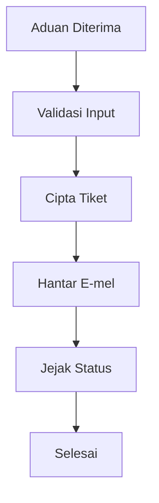
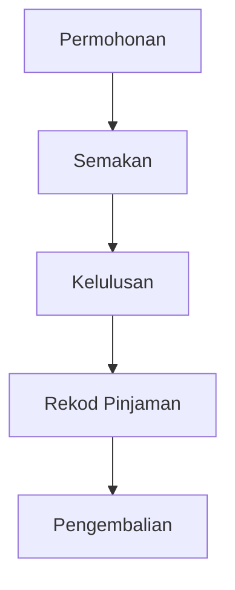

# D02 DOKUMEN SPESIFIKASI KEPERLUAN BISNES (BRS)

**ICTServe**  
*(Modul: Helpdesk, Pinjaman Aset)*

| | |
| :--- | :--- |
| **NAMA AGENSI** | MOTAC |
| **NAMA AGENSI INDUK** | BPM MOTAC |
| **TARIKH DOKUMEN** | 29 Disember 2025 |
| **VERSI DOKUMEN** | 3.6.1 |

---

## i. Keterangan Dokumen
Ringkasan keperluan bisnes ICTServe berdasarkan [_reference/versions/v3.6.1_D02_BUSINESS_REQUIREMENTS_SPECIFICATION.md](_reference/versions/v3.6.1_D02_BUSINESS_REQUIREMENTS_SPECIFICATION.md).

## ii. Semakan dan Pengesahan Dokumen

**SEMAKAN DOKUMEN**

| Disemak Oleh | Jawatan | Tandatangan | Tarikh Semakan |
| :--- | :--- | :--- | :--- |
| | | | |

**PENGESAHAN DOKUMEN**

| Disahkan Oleh | Jawatan | Tandatangan | Tarikh Semakan |
| :--- | :--- | :--- | :--- |
| | | | |

## iii. Kawalan Dokumen

| No. Versi | Tarikh | Ringkasan Pindaan | Penyedia |
| :--- | :--- | :--- | :--- |
| 3.6.1 | 29/12/2025 | Struktur KRISA BRS | Pasukan BPM |

## iv. Kandungan
Rujuk seksyen 1–4.

## v. Senarai Gambarajah
- Gambarajah 1: Proses Bisnes Helpdesk (TD)
- Gambarajah 2: Proses Bisnes Pinjaman Aset (TD)

## vi. Senarai Jadual
- Jadual 1: KPI & SLA

## vii. Definisi dan Akronim

| Akronim | Keterangan |
| :--- | :--- |
| SLA | Service Level Agreement |
| UAT | User Acceptance Testing |

## viii. Sumber Rujukan
- [docs/KRISA/OFFICIAL-TEMPLATE-AND-SAMPLES/D02_TEMPLATE_SPESIFIKASI_KEPERLUAN_BISNES_BRS.md](docs/KRISA/OFFICIAL-TEMPLATE-AND-SAMPLES/D02_TEMPLATE_SPESIFIKASI_KEPERLUAN_BISNES_BRS.md)

---

## 1. PENGENALAN
### 1.1. Objektif Bisnes
- Menyediakan saluran aduan ICT dalaman
- Mengurus pinjaman aset dengan kelulusan bertingkat

### 1.2. Skop Bisnes
- Helpdesk: Cipta, jejak status, lampiran, notifikasi
- Pinjaman Aset: Permohonan, kelulusan, pengembalian

## 2. PROSES BISNES

### 2.1. Helpdesk

### 2.2. Pinjaman Aset

## 3. KPI & SLA
- Tiket: Pendaftaran < 2 min, Respon awal < 24 jam
- Pinjaman: Kelulusan < 3 hari

## 4. LAMPIRAN
- Format borang, contoh laporan
