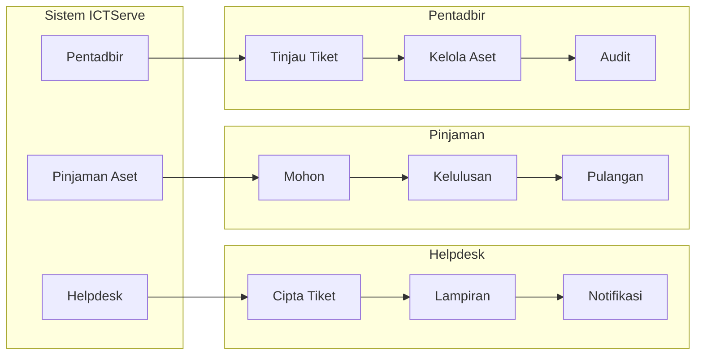
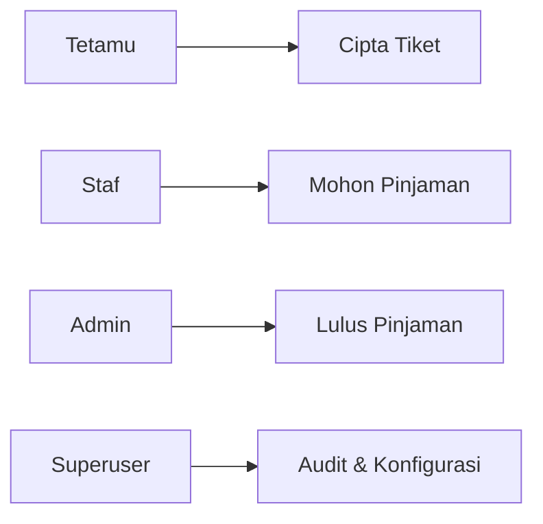
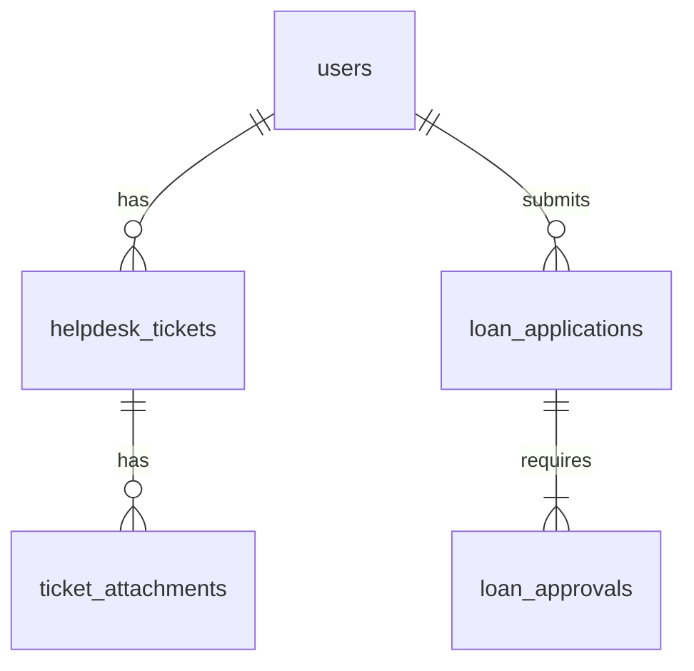
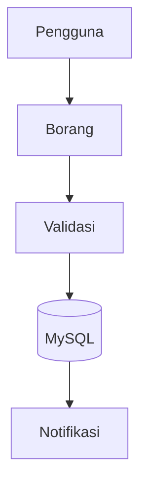

# D03 DOKUMEN SPESIFIKASI KEPERLUAN SISTEM (SRS)

**ICTServe**

| | |
| :--- | :--- |
| **NAMA AGENSI** | MOTAC |
| **NAMA AGENSI INDUK** | BPM MOTAC |
| **TARIKH DOKUMEN** | 29 Disember 2025 |
| **VERSI DOKUMEN** | 3.6.1 |

---

## i. Keterangan Dokumen
Ringkasan SRS ICTServe berdasarkan [_reference/versions/v3.6.1_D03_SOFTWARE_REQUIREMENTS_SPECIFICATION.md](_reference/versions/v3.6.1_D03_SOFTWARE_REQUIREMENTS_SPECIFICATION.md).

## ii. Semakan dan Pengesahan Dokumen

**SEMAKAN DOKUMEN**

| Disemak Oleh | Jawatan | Tandatangan | Tarikh Semakan |
| :--- | :--- | :--- | :--- |
| | | | |

**PENGESAHAN DOKUMEN**

| Disahkan Oleh | Jawatan | Tandatangan | Tarikh Semakan |
| :--- | :--- | :--- | :--- |
| | | | |

## iii. Kawalan Dokumen

| No. Versi | Tarikh | Ringkasan Pindaan | Penyedia |
| :--- | :--- | :--- | :--- |
| 3.6.1 | 29/12/2025 | Struktur KRISA SRS | Pasukan BPM |

## iv. Kandungan
Rujuk seksyen 1–8.

## v. Senarai Gambarajah

- Rajah Hierarki Fungsian (LR)
- Use Case (LR)
- ERD (Mermaid erDiagram)
- DFD (TD)

## vi. Senarai Jadual

- Jadual Pemadanan Aktor–Fungsi
- Kamus Data

## vii. Definisi dan Akronim

| Akronim | Keterangan |
| :--- | :--- |
| ERD | Entity-Relationship Diagram |
| DFD | Data Flow Diagram |

## viii. Sumber Rujukan

- [docs/KRISA/OFFICIAL-TEMPLATE-AND-SAMPLES/D03_TEMPLATE_SPESIFIKASI_KEPERLUAN_SISTEM_SRS.md](docs/KRISA/OFFICIAL-TEMPLATE-AND-SAMPLES/D03_TEMPLATE_SPESIFIKASI_KEPERLUAN_SISTEM_SRS.md)

---

## 1. PENGENALAN
### 1.1. Tujuan Sistem

- Menyokong helpdesk dalaman dan pinjaman aset (lihat D00/D02)

### 1.2. Skop Sistem

- Modul Helpdesk, Pinjaman, Pentadbir

### 1.3. Senarai Aktor Sistem

- Tetamu, Staf, Admin, Superuser

## 2. PEMODELAN FUNGSI SISTEM

### 2.1. Penggunaan Notasi

- Mermaid flowchart untuk hierarki fungsi (LR)

### 2.2. Rajah Hierarki Fungsian Sistem

### 2.3. Jadual Pemadanan Aktor Dengan Fungsi Sistem

| Aktor | Fungsi |
| :--- | :--- |
| Tetamu | Cipta tiket, semak status |
| Staf | Hantar tiket, mohon pinjaman |
| Admin | Tinjau, kelulusan, audit |

## 3. PEMODELAN USE CASE

### 3.1. Penggunaan Notasi

- Mermaid untuk Use Case map (LR)

### 3.2. Model Use Case

## 4. PEMODELAN MAKLUMAT

### 4.1. Penggunaan Notasi

- Mermaid erDiagram

### 4.2. Model Maklumat (ERD)

### 4.3. Definisi Kamus Data

- Lihat [_reference/versions/v3.6.1_D09_DATABASE_DOCUMENTATION.md](_reference/versions/v3.6.1_D09_DATABASE_DOCUMENTATION.md)

## 5. PEMODELAN PROSES SISTEM

### 5.1. Penggunaan Notasi

- Mermaid TD untuk DFD

### 5.2. Model Proses Sistem

### 5.3. Definisi Aliran Data

- Lihat D09 & D10

## 6. PENENTUAN KEPERLUAN BUKAN FUNGSIAN

- Prestasi, keselamatan, audit, kebolehcapaian (WCAG 2.2 AA)

## 7. PENENTUAN SAIZ SISTEM APLIKASI

- Ringkas: FP per modul (rujuk BRS)

## 8. LAMPIRAN

- Format borang & laporan
