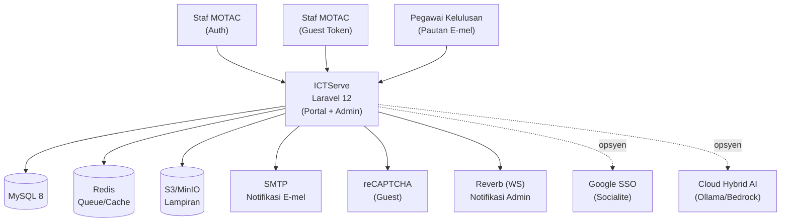
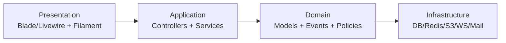
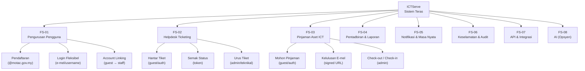
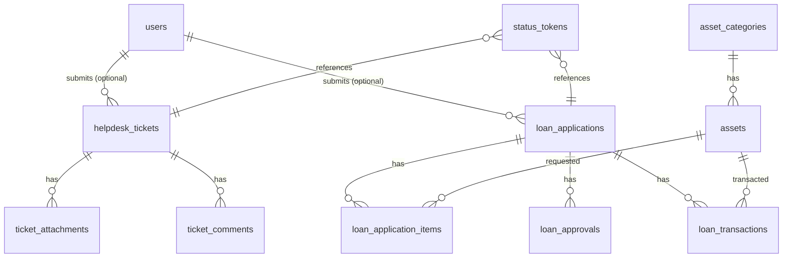
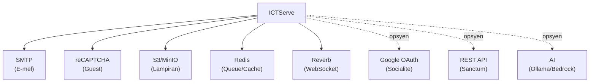

# D04 DOKUMEN SPESIFIKASI REKABENTUK SISTEM (SDS)

## ICTServe

| | |
| :--- | :--- |
| **NAMA AGENSI** | : MOTAC |
| **NAMA AGENSI INDUK** | : Bahagian Pengurusan Maklumat (BPM), MOTAC |
| **TARIKH DOKUMEN** | : 29 Disember 2025 |
| **VERSI DOKUMEN** | : 3.6.1 |

---

## i. Keterangan Dokumen

Dokumen ini menerangkan rekabentuk sistem aplikasi ICTServe (SDS) bagi versi 3.6.1 untuk kegunaan dalaman BPM MOTAC. SDS ini disediakan mengikut struktur templat KRISA D04 dan menghimpunkan rekabentuk seni bina, fungsi sistem, rekabentuk fungsian, rekabentuk pangkalan data, migrasi, serta integrasi.

Sumber reka bentuk utama adalah dokumen rujukan versi 3.6.1 di:

- `_reference/versions/v3.6.1_D04_SOFTWARE_DESIGN_DOCUMENT.md`

## ii. Semakan dan Pengesahan Dokumen

### SEMAKAN DOKUMEN

| Disemak Oleh | Jawatan | Tandatangan | Tarikh Semakan |
| :--- | :--- | :--- | :--- |
| | | | |
| | | | |

### PENGESAHAN DOKUMEN

| Disahkan Oleh | Jawatan | Tandatangan | Tarikh Semakan |
| :--- | :--- | :--- | :--- |
| | | | |
| | | | |

## iii. Kawalan Dokumen

### KAWALAN DOKUMEN

| No. Versi | Tarikh | Ringkasan Pindaan | Penyedia |
| :--- | :--- | :--- | :--- |
| 3.6.1 | 29/12/2025 | Penyelarasan SDS mengikut templat KRISA D04 dan rujukan v3.6.1 | Pasukan BPM MOTAC |

## iv. Kandungan

Senarai kandungan (nombor muka surat tidak dinyatakan dalam versi Markdown):

1. Pengenalan
2. Rekabentuk Arkitektur
3. Pemodelan Fungsi Sistem
4. Rekabentuk Fungsian
5. Rekabentuk Pangkalan Data
6. Rekabentuk Migrasi Data
7. Rekabentuk Integrasi Data
8. Lampiran

## v. Senarai Gambarajah

- Rajah 2.1: Arkitektur keseluruhan sistem aplikasi ICTServe
- Rajah 2.2: Arkitektur aplikasi (lapisan komponen)
- Rajah 3.1: Rajah hierarki fungsian sistem
- Rajah 5.1: ERD logikal (ringkas) ICTServe
- Rajah 7.1: Ringkasan integrasi data/perkhidmatan

## vi. Senarai Jadual

- Jadual 3.1: Penggunaan notasi pemodelan fungsi sistem
- Jadual 3.2: Pemadanan aktor dengan fungsi sistem
- Jadual 4.1: Pemetaan data UI → Model (Helpdesk)
- Jadual 4.2: Pemetaan data UI → Model (Pinjaman Aset)
- Jadual 4.3: Senarai transaksi utama sistem (ringkas)
- Jadual 5.1: Ringkasan jadual teras pangkalan data
- Jadual 7.1: Rekabentuk integrasi data/perkhidmatan

## vii. Definisi dan Akronim

### a. Akronim

| Akronim | Keterangan |
| :--- | :--- |
| AI | Artificial Intelligence |
| API | Application Programming Interface |
| BPM | Bahagian Pengurusan Maklumat |
| CSRF | Cross-Site Request Forgery |
| ERD | Entity Relationship Diagram |
| HMAC | Hash-based Message Authentication Code |
| MVC | Model-View-Controller |
| NFR | Non-Functional Requirement |
| OTP | One-Time Password |
| PDPA | Personal Data Protection Act 2010 |
| RBAC | Role-Based Access Control |
| SDS | System Design Specification |
| SDD | Software Design Document |
| SSO | Single Sign-On |
| TLS | Transport Layer Security |
| UI/UX | User Interface / User Experience |
| WCAG | Web Content Accessibility Guidelines |
| WS | WebSocket |

### b. Definisi

| Terma/Istilah | Definisi |
| :--- | :--- |
| Guest (Tetamu) | Pengguna yang menghantar borang tanpa akaun; penjejakan menggunakan token/pautan e-mel. |
| Authenticated Staff | Staf MOTAC yang log masuk menggunakan akaun dalaman untuk akses Dashboard/Profil dan auto-fill borang. |
| Hybrid Access | Model akses yang menyokong dua mod: log masuk (authenticated) dan tetamu (guest/token). |
| Signed URL | URL yang ditandatangani (HMAC) untuk memastikan pautan tidak diubah; biasanya turut mempunyai tarikh luput. |
| Status Token | Token unik untuk semakan status (tiket/pinjaman) tanpa log masuk; disimpan sebagai hash dalam pangkalan data. |
| Token-Based Approval | Kaedah kelulusan pinjaman melalui pautan e-mel bertanda tangan dengan token hash dan tarikh luput. |
| Dual Audit | Gabungan audit field-level dan audit aktiviti untuk pematuhan/forensik. |
| Cloud Hybrid AI | Integrasi AI yang menghala antara LLM tempatan (contoh: Ollama) dan cloud (contoh: AWS Bedrock) berdasarkan klasifikasi data, kos, dan polisi. |

## viii. Sumber Rujukan

- [docs/KRISA/OFFICIAL-TEMPLATE-AND-SAMPLES/D04_TEMPLATE_SPESIFIKASI_REKABENTUK_SISTEM_SDS.md](docs/KRISA/OFFICIAL-TEMPLATE-AND-SAMPLES/D04_TEMPLATE_SPESIFIKASI_REKABENTUK_SISTEM_SDS.md)
- [_reference/versions/v3.6.1_D04_SOFTWARE_DESIGN_DOCUMENT.md](_reference/versions/v3.6.1_D04_SOFTWARE_DESIGN_DOCUMENT.md)
- ISO/IEC/IEEE 42010 (Architecture Description)
- IEEE 1016:2009 (Software Design Description)
- ISO/IEC/IEEE 15288 (System Life Cycle Processes)
- WCAG 2.2 AA (W3C)
- OWASP ASVS L2 (Application Security Verification Standard)

---

## 1. PENGENALAN

### 1.1. Tujuan Rekabentuk

Tujuan rekabentuk ICTServe v3.6.1 adalah untuk membangunkan sistem dalaman (internal-only) yang menyatukan:

- modul Helpdesk Ticketing;
- modul Pinjaman Aset ICT (termasuk kelulusan e-mel);
- operasi pentadbiran (panel Filament untuk `admin` dan `superuser`);
- pemantauan prestasi dan log;
- dan integrasi opsyenal Cloud Hybrid AI.

Rekabentuk ini menyokong prinsip **hybrid access**:

- staf boleh memilih log masuk untuk kemudahan Dashboard/Profil serta auto-fill borang; atau
- menghantar borang sebagai tetamu tanpa log masuk dan menjejak status melalui token e-mel.

### 1.2. Skop Rekabentuk

Skop rekabentuk SDS ini merangkumi perkara berikut (selaras rujukan v3.6.1):

- Portal Hybrid (guest + authenticated): Blade/Livewire untuk borang Helpdesk dan Pinjaman.
- Portal Pentadbir: Filament untuk pengurusan tiket, pinjaman, aset, laporan, dan konfigurasi.
- Rekabentuk servis aplikasi: service layer untuk workflow, token, kelulusan, notifikasi.
- Rekabentuk komunikasi masa nyata: Laravel Reverb (WS) + Echo (client) untuk notifikasi pentadbir.
- Rekabentuk penyimpanan: MySQL (data), S3/MinIO (lampiran), Redis (cache/queue/broadcasting).
- Rekabentuk keselamatan: signed URL, token hashing, rate limiting, CSRF, reCAPTCHA (guest), audit.
- Rekabentuk integrasi: e-mel (SMTP), reCAPTCHA, SSO Google (opsyen), API (Sanctum), AI (opsyen).

Di luar skop:

- aplikasi mudah alih natif;
- integrasi LDAP/SSO penuh (sync automatik direktori) — hanya SSO Google (opsyen) melalui Socialite.

## 2. REKABENTUK ARKITEKTUR

### 2.1. Arkitektur Keseluruhan Sistem Aplikasi

Rajah berikut menggambarkan komponen utama antaramuka, aplikasi, dan pangkalan data serta integrasi perkhidmatan.

Komponen penting reka bentuk:

- **Hybrid portal**: borang boleh diakses sebagai tetamu atau selepas login.
- **Token-based operations**: semakan status dan kelulusan menggunakan token/hash dan signed URL.
- **Asynchronous jobs**: penghantaran e-mel, notifikasi, dan kerja latar (queue).
- **Real-time admin**: notifikasi peristiwa (tiket/pinjaman) ke panel pentadbir.

### 2.2. Arkitektur Aplikasi

ICTServe menggunakan corak **MVC + Service Layer + Guest-First**.

Ringkasan lapisan (selaras rujukan v3.6.1):

- **Presentation**: Portal Hybrid (Livewire/Volt) dan panel admin (Filament).
- **Application**: controller + Livewire actions + service classes (contoh: `HelpdeskService`, `LoanService`, `ApprovalService`, `TokenService`).
- **Domain**: model Eloquent (contoh: `HelpdeskTicket`, `LoanApplication`, `LoanApproval`, `Asset`, `StatusToken`) serta event/policy.
- **Infrastructure**: MySQL, Redis, S3/MinIO, SMTP, WebSocket server (Reverb), pemantauan (Pulse/Horizon).

## 3. PEMODELAN FUNGSI SISTEM

### 3.1. Penggunaan Notasi

| Notasi | Keterangan |
| :--- | :--- |
| Flowchart (Mermaid) | Rajah ringkas hierarki fungsi (A4-friendly). |
| Jadual pemadanan | Pemetaan aktor → fungsi utama sistem. |
| Kod Fungsi (FS-*) | Kod ringkas untuk fungsi sistem bagi tujuan pemadanan. |

### 3.2. Rajah Hierarki Fungsian Sistem

Rajah berikut merumuskan hierarki fungsi sistem ICTServe.

### 3.3. Jadual Pemadanan Aktor Dengan Fungsi Sistem

| Aktor | FS-01 | FS-02 | FS-03 | FS-04 | FS-05 | FS-06 | FS-07 | FS-08 |
| :--- | :---: | :---: | :---: | :---: | :---: | :---: | :---: | :---: |
| Staf (Auth) | ✔ | ✔ | ✔ |  | ✔ |  | ✔ | (opsyen) |
| Staf (Guest Token) |  | ✔ | ✔ |  |  |  |  |  |
| Pegawai Kelulusan (E-mel) |  |  | ✔ |  |  | ✔ |  |  |
| Admin | ✔ | ✔ | ✔ | ✔ | ✔ | ✔ | ✔ | (opsyen) |
| Superuser | ✔ | ✔ | ✔ | ✔ | ✔ | ✔ | ✔ | (opsyen) |
| Kakitangan Teknikal |  | ✔ |  |  | ✔ | ✔ |  |  |
| Pengurus Aset ICT |  |  | ✔ | ✔ | ✔ | ✔ |  |  |

## 4. REKABENTUK FUNGSIAN

### 4.1. Rekabentuk Antaramuka Pengguna dan Pemetaan Data

Rekabentuk UI mematuhi WCAG 2.2 AA. Portal Hybrid menyediakan borang untuk pengguna tetamu dan pengguna log masuk. Pemetaan data berikut mengekalkan prinsip **guest-first** (data pemohon disimpan sebagai medan) dengan sokongan **nullable `user_id`**.

#### Jadual 4.1: Pemetaan data UI → Model (Helpdesk Ticketing)

| Medan UI (Borang) | Model/Jadual | Medan DB | Nota Rekabentuk |
| :--- | :--- | :--- | :--- |
| `submitter_name` | `helpdesk_tickets` | `guest_name` | Untuk tetamu; untuk auth, dipra-isi tetapi kekal disimpan sebagai `guest_*` sebagai “snapshot”. |
| `submitter_email` | `helpdesk_tickets` | `guest_email` | Digunakan untuk e-mel pengesahan/token status. |
| `submitter_phone` | `helpdesk_tickets` | `guest_phone` | Data hubungan minimum. |
| (sistem) | `helpdesk_tickets` | `user_id` | Nullable; diisi jika Auth::check(). |
| (sistem) | `status_tokens` | `token_hash` | Token status disimpan sebagai hash; token asal hanya dihantar melalui e-mel. |

#### Jadual 4.2: Pemetaan data UI → Model (Pinjaman Aset ICT)

| Medan UI (Borang) | Model/Jadual | Medan DB | Nota Rekabentuk |
| :--- | :--- | :--- | :--- |
| `applicant_name` | `loan_applications` | `applicant_name` | Snapshot pemohon; sentiasa disimpan walaupun auth. |
| `applicant_email` | `loan_applications` | `applicant_email` | Digunakan untuk notifikasi dan account linking. |
| (sistem) | `loan_applications` | `user_id` | Nullable; diisi jika Auth::check(). |
| (sistem) | `loan_approvals` | `token_hash` | Hash token kelulusan; pautan e-mel signed URL. |
| (sistem) | `loan_approvals` | `expires_at` | Tempoh sah token (default 72 jam). |

### 4.2. Rekabentuk Transaksi Sistem

Jadual berikut merangkum transaksi utama sistem (ringkas). Senario terperinci dirujuk dalam dokumen rujukan v3.6.1.

#### Jadual 4.3: Transaksi utama sistem

| ID Transaksi | Nama Transaksi | Input Utama | Output Utama | Kawalan/Keselamatan |
| :--- | :--- | :--- | :--- | :--- |
| TRX-01 | Hantar tiket helpdesk (guest/auth) | borang + lampiran (opsyen) | nombor tiket + e-mel token status | CSRF, reCAPTCHA (guest), rate limit, audit |
| TRX-02 | Semak status tiket (token) | token | paparan status | token hash, rate limit |
| TRX-03 | Mohon pinjaman aset (guest/auth) | borang + pemilihan aset + tarikh | nombor rujukan + permohonan dicipta | conflict detection, audit |
| TRX-04 | Kelulusan pinjaman (e-mel) | signed URL + token | keputusan lulus/tolak + cap masa | signed URL, token hash, expiry |
| TRX-05 | Check-out/check-in aset (admin) | keputusan kelulusan + item aset | rekod transaksi & status aset | RBAC, audit |
| TRX-06 | Pendaftaran staf | borang pendaftaran | akaun + e-mel verifikasi | domain @motac.gov.my, signed URL, rate limit |
| TRX-07 | Login fleksibel | e-mel/username + kata laluan | sesi sah + akses dashboard | rate limit, session regen |
| TRX-08 | Account linking | e-mel pengguna | pautan tiket/pinjaman ke `user_id` | transaksi atomik, audit |

## 5. REKABENTUK PANGKALAN DATA

### 5.1. Rekabentuk Pangkalan Data

Rekabentuk pangkalan data menggunakan MySQL 8.0 dengan prinsip:

- **Guest-first schema**: data pemohon disimpan sebagai medan (snapshot), bukan semata-mata FK.
- **Nullable `user_id`**: membolehkan kedua-dua mod guest dan authenticated.
- **Token security**: token disimpan sebagai hash (contoh: SHA-512) untuk semakan status/kelulusan.
- **Audit & logging**: menyokong dual audit (field-level dan activity log).

#### Rajah 5.1: ERD logikal (ringkas)

### 5.2. Skema Logikal Pangkalan Data

#### Jadual 5.1: Ringkasan jadual teras

| Jadual | Tujuan | Medan Utama (ringkas) | Nota |
| :--- | :--- | :--- | :--- |
| `users` | Akaun staf | name, email, password, roles | Email verifikasi; login fleksibel. |
| `helpdesk_tickets` | Rekod tiket | ticket_no, status, priority, guest_*, user_id (NULL) | Menyokong guest/auth; SLA. |
| `ticket_attachments` | Lampiran tiket | helpdesk_ticket_id, path, mime, size | Disimpan di S3/MinIO. |
| `ticket_comments` | Komen/tindakan | helpdesk_ticket_id, body, is_internal | Komunikasi dan audit tindakan. |
| `loan_applications` | Permohonan pinjaman | ref_no, status, applicant_*, user_id (NULL) | Menyokong guest/auth; reservasi aset. |
| `loan_application_items` | Item pinjaman | loan_application_id, asset_id, qty | Konflik tarikh dikawal pada workflow. |
| `loan_approvals` | Rekod kelulusan | loan_application_id, token_hash, expires_at, decision | Token-based approval + metadata. |
| `loan_transactions` | Rekod keluar/masuk aset | loan_application_id, asset_id, action, performed_by | Jejak check-out/check-in. |
| `assets` | Inventori aset | asset_tag, status, category_id | Status: available/reserved/on_loan/maintenance/retired. |
| `asset_categories` | Kategori aset | name | Digunakan dalam pelaporan & pilihan aset. |
| `status_tokens` | Token semakan status | token_hash, reference_type, reference_id | Polymorphic (tiket/pinjaman). |
| `activity_log` | Audit aktiviti | log_name, description, subject_type/id | Aktiviti operasi (Spatie). |
| `audits` | Audit perubahan data | auditable_type/id, old_values, new_values | Audit field-level (OwenIt). |

Sumber kebenaran skema adalah fail migrasi Laravel di `database/migrations/`.

## 6. REKABENTUK MIGRASI DATA

ICTServe v3.6.1 direka sebagai sistem dalaman baharu dengan pangkalan data aplikasi sendiri. Oleh itu:

- tiada migrasi data legacy yang wajib dalam skop versi ini; dan
- perubahan skema diurus menggunakan **Laravel migrations** sebagai mekanisme migrasi berperingkat (up/down).

Jika migrasi data diperlukan pada masa hadapan (contoh: import data dari sistem/borang lama), perincian hendaklah dirujuk kepada dokumen:

- D05 (Pelan Migrasi Data)
- D06 (Spesifikasi Migrasi Data)

## 7. REKABENTUK INTEGRASI DATA

#### Rajah 7.1: Ringkasan integrasi data/perkhidmatan

#### Jadual 7.1: Rekabentuk integrasi data/perkhidmatan

| Integrasi | Tujuan | Protokol/Kaedah | Data Utama | Kawalan/Keselamatan |
| :--- | :--- | :--- | :--- | :--- |
| SMTP/E-mel | notifikasi tiket/pinjaman, verifikasi, kelulusan | SMTP / queued mail | token status, approval link | TLS, queued jobs, content sanitization |
| reCAPTCHA | cegah spam (guest) | HTTP API | skor/verification | hanya untuk guest; audit request |
| S3/MinIO | simpan lampiran | S3 API / presigned URL | fail lampiran | presigned URL (tempoh), AV scan (jika diaktifkan) |
| Redis Queue/Cache | kerja latar & cache | Redis | jobs, cache keys | isolation + retention; rate-limited |
| Reverb (WS) | notifikasi masa nyata admin | WebSocket | event notifications | auth/guards; environment hardening |
| Google SSO (opsyen) | login SSO staf | OAuth2 (Socialite) | profil asas | fallback login biasa; audit SSO |
| API (Sanctum) | integrasi masa depan | REST + token | tickets/loans/memory | token abilities, versioning, rate limit |
| Cloud Hybrid AI (opsyen) | chatbot/auto-reply/RAG | internal service calls | prompt, context, history | routing berdasar klasifikasi data/persetujuan |

## 8. LAMPIRAN

Lampiran rujukan (v3.6.1) dan artefak sokongan:

- Dokumen rekabentuk terperinci: `_reference/versions/v3.6.1_D04_SOFTWARE_DESIGN_DOCUMENT.md`
- Rujukan modul real-time: `_reference/versions/v3.6.1_D04_SOFTWARE_DESIGN_DOCUMENT.md` (seksyen Reverb/Echo, Pulse/Horizon)
- Rujukan AI (opsyen): rujuk dokumen D18 (disenaraikan dalam rujukan v3.6.1)
- Rujukan migrasi & integrasi: D05–D08 (jika diperlukan)
