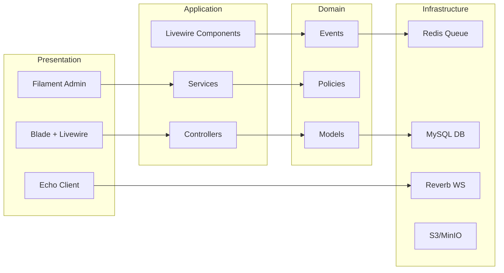
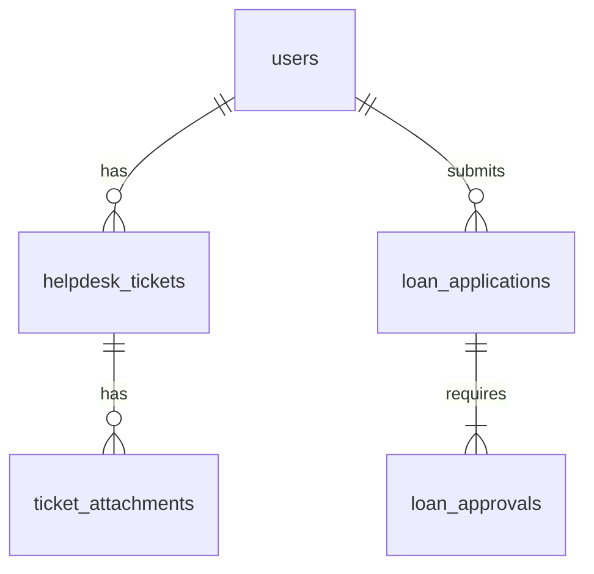

# D04 DOKUMEN SPESIFIKASI REKABENTUK SISTEM (SDS)

**ICTServe**

| | |
| :--- | :--- |
| **NAMA AGENSI** | MOTAC |
| **NAMA AGENSI INDUK** | BPM MOTAC |
| **TARIKH DOKUMEN** | 29 Disember 2025 |
| **VERSI DOKUMEN** | 3.6.1 |

---

## i. Keterangan Dokumen
Ringkasan SDS ICTServe berdasarkan [_reference/versions/v3.6.1_D04_SOFTWARE_DESIGN_DOCUMENT.md](_reference/versions/v3.6.1_D04_SOFTWARE_DESIGN_DOCUMENT.md).

## ii. Semakan dan Pengesahan Dokumen

**SEMAKAN DOKUMEN**

| Disemak Oleh | Jawatan | Tandatangan | Tarikh Semakan |
| :--- | :--- | :--- | :--- |
| | | | |

**PENGESAHAN DOKUMEN**

| Disahkan Oleh | Jawatan | Tandatangan | Tarikh Semakan |
| :--- | :--- | :--- | :--- |
| | | | |

## iii. Kawalan Dokumen

| No. Versi | Tarikh | Ringkasan Pindaan | Penyedia |
| :--- | :--- | :--- | :--- |
| 3.6.1 | 29/12/2025 | Struktur KRISA SDS | Pasukan BPM |

## iv. Kandungan
Rujuk seksyen 1–8.

## v. Senarai Gambarajah
- Arkitektur keseluruhan (LR)
- Lapisan komponen (LR)
- ERD logikal (erDiagram)

## vi. Senarai Jadual
- Jadual pemetaan UI → Data

## vii. Definisi dan Akronim

| Akronim | Keterangan |
| :--- | :--- |
| MVC | Model-View-Controller |
| S3 | Object storage |

## viii. Sumber Rujukan
- [docs/KRISA/OFFICIAL-TEMPLATE-AND-SAMPLES/D04_TEMPLATE_SPESIFIKASI_REKABENTUK_SISTEM_SDS.md](docs/KRISA/OFFICIAL-TEMPLATE-AND-SAMPLES/D04_TEMPLATE_SPESIFIKASI_REKABENTUK_SISTEM_SDS.md)

---

## 1. PENGENALAN
### 1.1. Tujuan Rekabentuk
- Menyusun seni bina MVC + Service Layer + Guest-first

### 1.2. Skop Rekabentuk
- Portal hibrid, panel pentadbir, servis backend, komunikasi masa nyata

## 2. REKABENTUK ARKITEKTUR

### 2.1. Arkitektur Keseluruhan Sistem Aplikasi

### 2.2. Arkitektur Aplikasi
- Lihat v3.6.1_D04 §§ 3.1–3.3

## 3. PEMODELAN FUNGSI SISTEM

### 3.1. Penggunaan Notasi
- Flowchart LR untuk hierarki fungsi

### 3.2. Rajah Hierarki Fungsian Sistem
- Rujuk D03 §2.2

### 3.3. Jadual Pemadanan Aktor Dengan Fungsi Sistem
- Rujuk D03 §2.3

## 4. REKABENTUK FUNGSIAN

### 4.1. Rekabentuk Antaramuka Pengguna dan Pemetaan Data

| UI Field | Model Attribute |
| :--- | :--- |
| `submitter_name` | `guest_name` |
| `submitter_email` | `guest_email` |

### 4.2. Rekabentuk Transaksi Sistem
- Jadual senario use case (lihat D03 §3.2)

## 5. REKABENTUK PANGKALAN DATA

### 5.1. Rekabentuk Pangkalan Data (ERD Logikal)

### 5.2. Skema Logikal Pangkalan Data
- Rujuk D09 skema & jenis data

## 6. REKABENTUK MIGRASI DATA
- Rujuk D05/D06

## 7. REKABENTUK INTEGRASI DATA
- Rujuk D07/D08

## 8. LAMPIRAN
- Imej UI, templat pemetaan
