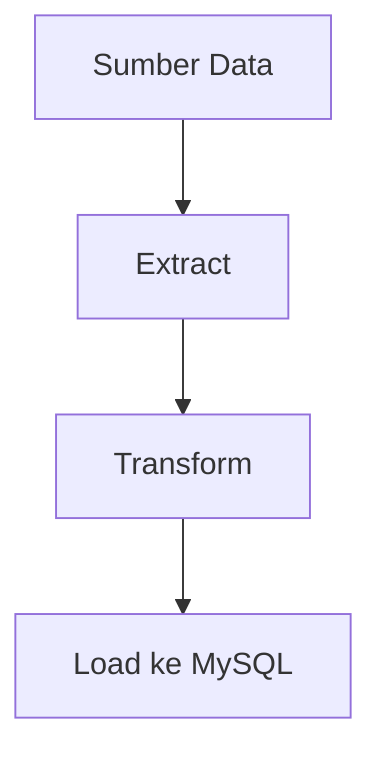
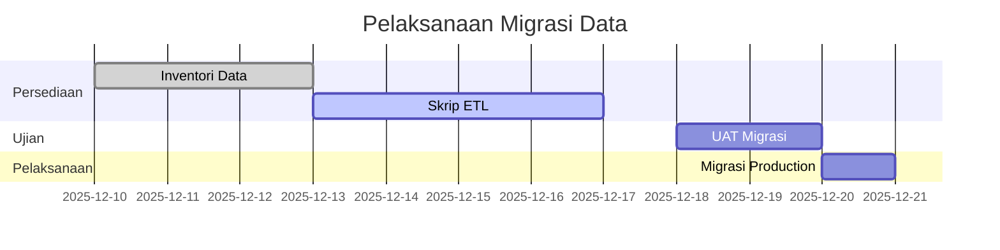

# D05 DOKUMEN PELAN MIGRASI DATA

**ICTServe**

| | |
| :--- | :--- |
| **NAMA AGENSI** | MOTAC |
| **NAMA AGENSI INDUK** | BPM MOTAC |
| **TARIKH DOKUMEN** | 29 Disember 2025 |
| **VERSI DOKUMEN** | 3.6.1 |

---

## i. Keterangan Dokumen
Pelan migrasi data ICTServe berdasarkan [_reference/versions/v3.6.1_D05_DATA_MIGRATION_PLAN.md](_reference/versions/v3.6.1_D05_DATA_MIGRATION_PLAN.md).

## ii. Semakan dan Pengesahan Dokumen

**SEMAKAN DOKUMEN**

| Disemak Oleh | Jawatan | Tandatangan | Tarikh Semakan |
| :--- | :--- | :--- | :--- |
| | | | |

**PENGESAHAN DOKUMEN**

| Disahkan Oleh | Jawatan | Tandatangan | Tarikh Semakan |
| :--- | :--- | :--- | :--- |
| | | | |

## iii. Kawalan Dokumen

| No. Versi | Tarikh | Ringkasan Pindaan | Penyedia |
| :--- | :--- | :--- | :--- |
| 3.6.1 | 29/12/2025 | Struktur KRISA Pelan Migrasi | Pasukan BPM |

## iv. Kandungan
Rujuk seksyen 1–7.

## v. Senarai Gambarajah
- Aliran ETL (TD)
- Jadual pelaksanaan (gantt)

## vi. Senarai Jadual
- Jadual pemetaan sumber → sasaran

## vii. Definisi dan Akronim
| Akronim | Keterangan |
| :--- | :--- |
| ETL | Extract, Transform, Load |

## viii. Sumber Rujukan
- [docs/KRISA/OFFICIAL-TEMPLATE-AND-SAMPLES/D05_TEMPLATE_PELAN_MIGRASI_DATA.md](docs/KRISA/OFFICIAL-TEMPLATE-AND-SAMPLES/D05_TEMPLATE_PELAN_MIGRASI_DATA.md)

---

## 1. PENGENALAN
- Tujuan, skop, objektif migrasi data

## 2. SUMBER DAN SASARAN DATA
- Sumber: fail CSV/DB lama (jika ada)
- Sasaran: MySQL 8.0 (lihat D09)

## 3. ALIRAN ETL

## 4. PELAN PELAKSANAAN

## 5. RISIKO & MITIGASI
- Pemetaan gagal → log audit + rollback

## 6. KEBERGANTUNGAN
- D09 skema, D06 spesifikasi

## 7. LAMPIRAN
- Contoh skrip ETL
