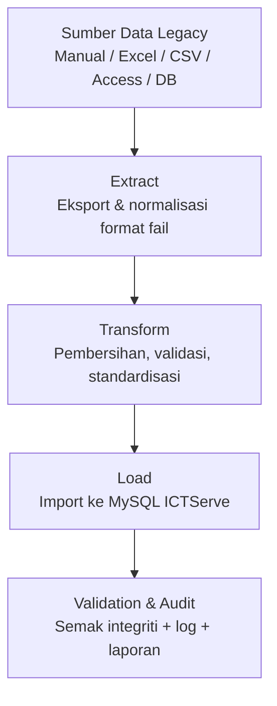

# D05 DOKUMEN PELAN MIGRASI DATA

**ICTServe**  
*(Modul: Helpdesk Ticketing, ICT Asset Loan, Inventori Aset, Pentadbiran)*

| | |
| :--- | :--- |
| **NAMA AGENSI** | : Kementerian Pelancongan, Seni dan Budaya Malaysia (MOTAC) |
| **NAMA AGENSI INDUK** | : Bahagian Pengurusan Maklumat (BPM), MOTAC |
| **TARIKH DOKUMEN** | : 29 Disember 2025 |
| **VERSI DOKUMEN** | : 3.6.1 |

---

## i. Keterangan Dokumen

Dokumen ini menerangkan perancangan menyeluruh migrasi data bagi sistem **ICTServe v3.6.1** (Helpdesk & ICT Asset Loan) untuk kegunaan dalaman **BPM MOTAC**. Pelan ini disediakan selaras dengan struktur templat KRISA D05 dan dirangka dengan penekanan kepada:

- kualiti data (rujukan **ISO 8000**);
- privasi dan perlindungan maklumat (rujukan **ISO/IEC 27701**);
- kebolehkesanan aktiviti migrasi melalui log dan audit trail;
- kebolehpulihan (rollback) jika migrasi gagal.

Sumber kandungan utama dokumen ini dipetakan daripada:

- [_reference/versions/v3.6.1_D05_DATA_MIGRATION_PLAN.md](_reference/versions/v3.6.1_D05_DATA_MIGRATION_PLAN.md)

## ii. Semakan dan Pengesahan Dokumen

**SEMAKAN DOKUMEN**

| Disemak Oleh | Jawatan | Tandatangan | Tarikh Semakan |
| :--- | :--- | :--- | :--- |
| | | | |
| | | | |

**PENGESAHAN DOKUMEN**

| Disahkan Oleh | Jawatan | Tandatangan | Tarikh Semakan |
| :--- | :--- | :--- | :--- |
| | | | |
| | | | |

## iii. Kawalan Dokumen

**KAWALAN DOKUMEN**

| No. Versi | Tarikh | Ringkasan Pindaan | Penyedia |
| :--- | :--- | :--- | :--- |
| 3.6.1 | 29/12/2025 | Pelan migrasi data ICTServe v3.6.1 (selaras rujukan v3.6.1 bertarikh 17/12/2025) | Pasukan Pembangunan BPM MOTAC |

## iv. Kandungan

Senarai kandungan (nombor muka surat tidak dinyatakan dalam versi Markdown):

1. Tujuan
2. Latar Belakang
3. Objektif Migrasi
4. Skop Migrasi
5. Pendekatan Migrasi
6. Pasukan Projek
7. Jadual Pelaksanaan
8. Penutup
9. Lampiran

## v. Senarai Gambarajah

- Rajah 5.1: Aliran kerja ETL migrasi data

## vi. Senarai Jadual

- Jadual 4.1: Skop data yang dimigrasi (domain → sasaran)
- Jadual 5.1: Pemetaan medan migrasi utama (ringkas)
- Jadual 7.1: Jadual pelaksanaan migrasi (fasa, tempoh, aktiviti, output)
- Jadual 7.2: Risiko dan mitigasi
- Jadual 8.1: Kawalan kualiti dan audit (metrik, sasaran, kaedah)

## vii. Definisi dan Akronim

### a. Akronim

| Akronim | Keterangan |
| :--- | :--- |
| AES | Advanced Encryption Standard |
| BPM | Bahagian Pengurusan Maklumat |
| DRP | Disaster Recovery Plan |
| ETL | Extract, Transform, Load |
| ISO | International Organization for Standardization |
| MOTAC | Kementerian Pelancongan, Seni dan Budaya Malaysia |
| PDPA | Personal Data Protection Act 2010 |
| RFC | Request for Comments |
| TLS | Transport Layer Security |
| UAT | User Acceptance Test |

### b. Definisi

| Terma/Istilah | Definisi |
| :--- | :--- |
| Data cleansing | Proses membersih data (deduplikasi, pembetulan format, pengesahan nilai) sebelum dimuat naik ke sistem sasaran. |
| Dry run | Larian ujian migrasi di persekitaran bukan produksi (staging/dev) untuk mengesahkan pemetaan, integriti dan prestasi sebelum migrasi sebenar. |
| Hybrid model (ICTServe) | Model penggunaan yang membenarkan staf log masuk (self-registration @motac.gov.my) dan pengguna tetamu menggunakan borang tanpa akaun; rekod sejarah dilink ke `user_id` jika sepadan. |
| Rollback | Proses pemulihan keadaan sebelum migrasi (contoh: restore backup) apabila migrasi gagal atau data tidak sah. |

## viii. Sumber Rujukan

- Templat KRISA: [docs/KRISA/OFFICIAL-TEMPLATE-AND-SAMPLES/D05_TEMPLATE_PELAN_MIGRASI_DATA.md](docs/KRISA/OFFICIAL-TEMPLATE-AND-SAMPLES/D05_TEMPLATE_PELAN_MIGRASI_DATA.md)
- Rujukan pelan migrasi v3.6.1: [_reference/versions/v3.6.1_D05_DATA_MIGRATION_PLAN.md](_reference/versions/v3.6.1_D05_DATA_MIGRATION_PLAN.md)
- Piawaian rujukan (seperti dinyatakan dalam rujukan v3.6.1): ISO 8000, ISO/IEC 27701, ISO 8601, RFC 5322, TLS 1.3, AES-256, ISO/IEC/IEEE 12207

---

## 1. TUJUAN

Dokumen ini menerangkan perancangan menyeluruh bagi migrasi data ke sistem **ICTServe** berasaskan **Laravel 12** untuk kegunaan dalaman BPM MOTAC. Pelan migrasi ini memastikan data daripada sumber legacy (manual/Excel/CSV/Access/DB terdahulu) dipindahkan ke pangkalan data sasaran secara terkawal, selamat, berkualiti, dan boleh diaudit.

Fokus migrasi adalah:

- migrasi profil staf (mengisi `users` untuk membolehkan log masuk/self-registration @motac.gov.my dan pemadanan rekod sejarah);
- migrasi rekod sejarah helpdesk (ditautkan ke `user_id` jika staf, atau kekal `NULL` untuk tetamu);
- migrasi rekod sejarah permohonan pinjaman aset (ditautkan ke `user_id` jika staf, atau kekal `NULL` untuk tetamu);
- migrasi inventori aset ICT dan data rujukan berkaitan;
- memastikan metadata dan audit trail wujud untuk kebolehkesanan.

## 2. LATAR BELAKANG

ICTServe ialah sistem dalaman BPM MOTAC bagi pengurusan aduan/permintaan ICT (helpdesk) dan pengurusan permohonan pinjaman aset ICT. Untuk memastikan kesinambungan operasi dan kebolehcarian rekod lama, migrasi diperlukan daripada pelbagai bentuk sumber data legacy seperti:

- rekod manual (borang kertas, fail PDF, dokumen cetak);
- fail digital (Excel/CSV);
- pangkalan data/sistem terdahulu (contoh Access/DB legacy).

ICTServe v3.6.1 mengguna pakai pendekatan **hybrid** (staf boleh log masuk dan tetamu boleh menggunakan borang tanpa akaun). Oleh itu, migrasi data perlu menyokong pemadanan rekod sejarah melalui e-mel staf (email matching) dan mengekalkan rekod tetamu tanpa identiti pengguna sistem.

## 3. OBJEKTIF MIGRASI

Objektif migrasi data adalah:

1. Memindahkan data legacy ke ICTServe v3.6.1 tanpa kehilangan data dan tanpa menjejaskan integriti.
2. Meningkatkan kualiti data melalui pembersihan, pengesahan format dan penyeragaman (rujukan ISO 8000).
3. Memastikan pematuhan privasi dan kawalan akses semasa migrasi (rujukan ISO/IEC 27701 dan PDPA).
4. Menyediakan kebolehkesanan penuh melalui log, audit trail, dan pelaporan migrasi.
5. Menyediakan pelan pemulihan (rollback) yang jelas sekiranya migrasi gagal.
6. Mengaktifkan capaian staf melalui migrasi profil pengguna ke `users` serta menetapkan status pengesahan e-mel yang sesuai bagi staf sedia ada.

## 4. SKOP MIGRASI

Skop migrasi merangkumi data berkaitan aduan ICT, inventori aset, dan sejarah pinjaman yang disimpan dalam sumber legacy.

Data yang dimigrasi termasuk:

- profil staf (untuk jadual `users` dan rujukan bahagian/unit);
- rekod tiket helpdesk (sejarah tiket dan status);
- rekod permohonan pinjaman aset (sejarah permohonan, status, dan pemadanan pemohon);
- inventori aset ICT (aset, kategori, status);
- data rujukan organisasi (bahagian/unit) yang diperlukan untuk validasi.

**Nota penting**:

- akaun pentadbir sistem adalah disediakan melalui proses seeding/pentadbiran dan bukan migrasi manual dari sumber legacy;
- rekod sejarah tetamu kekal sebagai rekod tanpa `user_id` (atau dipautkan hanya jika wujud padanan e-mel staf yang sah, mengikut peraturan migrasi).

### Jadual 4.1: Skop data yang dimigrasi (domain → sasaran)

| Domain Data | Contoh Kandungan | Sasaran (ringkas) | Kaedah Pemadanan |
| :--- | :--- | :--- | :--- |
| Profil staf | Nama, e-mel @motac.gov.my, no staf (jika ada), bahagian/unit | `users` + rujukan bahagian | E-mel staf sebagai kunci utama; bahagian melalui `division_code`/lookup |
| Tiket helpdesk | Nombor tiket, tajuk, penerangan, status, tarikh | Jadual tiket helpdesk | Link `user_id` melalui padanan e-mel; tetamu kekal `NULL` |
| Pinjaman aset | Nombor permohonan, pemohon, status, tarikh pinjam/pulang | Jadual permohonan pinjaman | Link `user_id` melalui padanan e-mel; tetamu kekal `NULL` |
| Inventori aset ICT | Tag aset, nama aset, kategori, status | Jadual aset | Pemetaan tag aset; deduplikasi berdasarkan tag |
| Data rujukan organisasi | Kod bahagian/unit | Jadual rujukan bahagian/unit | Lookup kod → ID |

## 5. PENDEKATAN MIGRASI

Pendekatan migrasi mengguna pakai kitaran **ETL (Extract, Transform, Load)** dengan kawalan kualiti dan audit sepanjang proses.

Prinsip utama migrasi:

- **Integrity**: memastikan data dipindahkan tanpa kerosakan atau perubahan yang tidak dibenarkan;
- **Quality**: pembersihan dan penyeragaman mengikut rujukan ISO 8000;
- **Privacy & Security**: pemindahan/penyimpanan data patuh kawalan privasi (ISO/IEC 27701);
- **Traceability**: semua aktiviti migrasi direkod (log) dan boleh diaudit;
- **Rollback capability**: backup dan prosedur pemulihan tersedia.

### Rajah 5.1: Aliran kerja ETL migrasi data

### 5.1 Analisis Data & Pemetaan (Assessment & Mapping)

Aktiviti utama:

- inventori semua sumber data dan pemilik data;
- pemetaan medan sumber kepada medan sasaran ICTServe;
- penyediaan kamus data (data dictionary) dan peraturan migrasi.

Contoh pemetaan (ringkas) ditunjukkan dalam Jadual 5.1.

### Jadual 5.1: Pemetaan medan migrasi utama (ringkas)

| Sumber (contoh) | Sasaran ICTServe | Peraturan/Nota |
| :--- | :--- | :--- |
| `staff_name` | `users.name` | Nama staf seperti sumber; trimming whitespace |
| `staff_email` | `users.email` | Mesti sah dan domain `@motac.gov.my` |
| `division_code` | `users.division_code` | Rujuk jadual rujukan bahagian/unit |
| `staff_id` | `users.staff_number` | Jika wujud dan sah |
| `email_verified` | `users.email_verified_at` | Staf sedia ada ditetapkan sebagai verified |
| `ticket_no` | `helpdesk_tickets.ticket_number` | Deduplikasi berdasarkan nombor tiket |
| `guest_email/applicant_email` | `helpdesk_tickets.user_id` / `loan_applications.user_id` | Padanan `users.email` → `user_id` (jika staf); selain itu kekal `NULL` |
| `asset_id_legacy` | `assets.asset_tag` | Pemetaan tag aset; unique |
| `asset_name` | `assets.name` | Penyeragaman ejaan/format jika perlu |

### 5.2 Pembersihan & Penyeragaman Data (Cleansing & Standardization)

Aktiviti utama:

- deduplikasi rekod berdasarkan nombor rujukan unik (tiket/permohonan/tag aset);
- pengesahan format tarikh (ISO 8601) dan e-mel (RFC 5322);
- penyeragaman nilai status/keutamaan/kategori kepada definisi sistem baharu;
- semakan nilai enumerasi (status, keutamaan, kategori) untuk mengelakkan import gagal.

### 5.3 Alat Migrasi, Skrip dan Log

Pelaksanaan migrasi menggunakan komponen Laravel dan skrip import tersuai (mengikut keperluan saiz data), termasuk:

- `php artisan migrate` untuk memastikan struktur jadual sasaran;
- `php artisan db:seed` untuk data rujukan (contoh bahagian/kategori) jika diperlukan;
- import data (CSV/Excel) menggunakan pakej `maatwebsite/excel` dengan validasi dan pelaporan ralat;
- pemprosesan batch dan/atau queue jobs untuk dataset besar;
- pelogsan aktiviti migrasi dalam `storage/logs/migration.log` untuk tujuan audit dan troubleshooting.

### 5.4 Pelaksanaan Migrasi (Dry Run → Go-Live)

Urutan pelaksanaan yang disyorkan:

1. **Dry run** di persekitaran staging/dev (termasuk validasi integriti dan foreign key).
2. Semakan jumlah rekod dan sampling rawak (contoh 5%) untuk semakan manual.
3. Migrasi sebenar semasa waktu off-peak:
   - backup penuh pangkalan data;
   - aktifkan mod penyelenggaraan jika perlu;
   - laksana import mengikut urutan (rujukan → users → aset → transaksi tiket/pinjaman);
   - pengesahan selepas migrasi; nyahaktif mod penyelenggaraan.
4. Audit pasca migrasi: semakan log, semakan integriti, dan ujian fungsi kritikal.

### 5.5 Perlindungan Data & Privasi

Kawalan yang digunakan:

- data in-transit menggunakan TLS;
- kawalan akses ketat: aktiviti migrasi hanya boleh dilakukan oleh peranan admin/superuser;
- audit trail bagi operasi kritikal;
- token/identiti sensitif tidak disimpan dalam bentuk plaintext (mengikut amalan keselamatan sistem).

## 6. PASUKAN PROJEK

Struktur pasukan projek migrasi data adalah seperti berikut:

- **Ketua Pasukan**: Wakil Pasukan Pembangunan BPM MOTAC
- **Pasukan Teknikal**: Pasukan Pembangunan BPM MOTAC (pemetaan data, skrip import, ETL, pemantauan, pelaporan)
- **Pasukan Perunding ICT**: Pasukan Infrastruktur/Operasi (sokongan persekitaran, backup/restore, keselamatan)
- **Subject Matter Expert (SME)**: Pemilik data (wakil BPM/Unit berkaitan) untuk pengesahan data dan peraturan migrasi

## 7. JADUAL PELAKSANAAN

Jadual pelaksanaan berikut adalah anggaran dan tertakluk kepada saiz serta kompleksiti data legacy.

### Jadual 7.1: Jadual pelaksanaan migrasi (fasa, tempoh, aktiviti, output)

| Fasa | Tempoh (anggaran) | Aktiviti | Output |
| :--- | :--- | :--- | :--- |
| Penilaian & Pemetaan | 1 minggu | Inventori data, pemetaan, kamus data | Dokumen pemetaan, data dictionary |
| Pembersihan & Standard | 1 minggu | Deduplikasi, validasi, standardisasi | Fail data bersih, laporan validasi |
| Skrip & Ujian | 2 minggu | Scripting, dry run, validasi, ujian | Skrip migrasi, laporan ujian |
| Migrasi Sebenar | 1–2 hari | Go-live migration, backup, pengesahan | DB dimigrasi, fail backup |
| Audit & Semakan | 3 hari | Semakan pasca migrasi, pelaporan | Laporan migrasi, audit log |

### Jadual 7.2: Risiko dan mitigasi

| Risiko | Kesan | Kebarangkalian | Langkah Mitigasi |
| :--- | :--- | :--- | :--- |
| Kehilangan/kerosakan data | Tinggi | Rendah | Backup penuh, dry run, pemulihan (restore) tersedia |
| Duplikasi/ketidakseragaman data | Sederhana | Sederhana | Cleansing, validasi ketat, deduplikasi berdasarkan kunci unik |
| Kebocoran data peribadi | Tinggi | Rendah | Kawalan akses, TLS, audit trail, pengendalian data mengikut polisi |
| Ralat foreign key / hubungan data | Sederhana | Sederhana | Import mengikut urutan, semak rujukan & integriti sebelum import |
| Downtime melebihi tetingkap | Sederhana | Rendah | Rehearsal/dry run, optimasi skrip, pemprosesan batch |

## 8. PENUTUP

Pelaksanaan migrasi data yang berjaya memerlukan faktor kritikal seperti berikut:

- pemetaan data yang tepat dan dipersetujui SME;
- proses pembersihan/validasi yang konsisten;
- pelaksanaan dry run dan semakan integriti sebelum go-live;
- backup/rollback yang boleh diuji;
- kawalan keselamatan dan audit trail sepanjang migrasi;
- pelaporan status dan pengurusan ralat yang jelas.

### Jadual 8.1: Kawalan kualiti dan audit (metrik, sasaran, kaedah)

| Kawalan | Sasaran | Kaedah |
| :--- | :--- | :--- |
| Kelengkapan data (field wajib) | >95% lengkap | Semakan automatik + laporan validasi |
| Kadar lulus validasi | >98% | Rule-based validation semasa transform/load |
| Integriti hubungan (FK) | 100% | Semak constraint + sampling |
| Kejayaan migrasi rekod | >99% | Banding jumlah rekod sumber vs sasaran + log ralat |

## 9. LAMPIRAN

Lampiran berikut disediakan sebagai maklumat sokongan ringkas:

- Lampiran A: Contoh pemetaan medan migrasi (Jadual 5.1)
- Lampiran B: Jadual pelaksanaan migrasi (Jadual 7.1)
- Lampiran C: Risiko dan mitigasi (Jadual 7.2)
