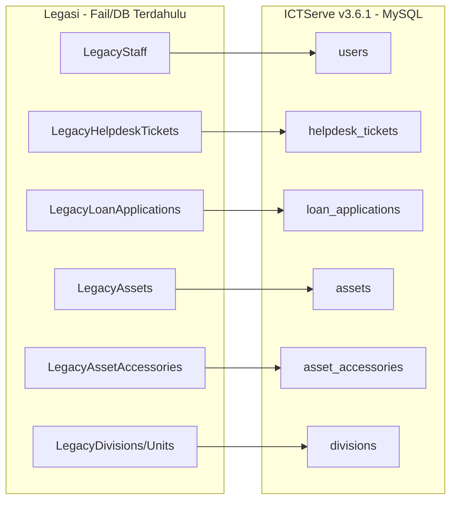

# D06 DOKUMEN SPESIFIKASI MIGRASI DATA

**ICTServe**  
*(Modul: Helpdesk Ticketing, ICT Asset Loan, Inventori Aset, Pentadbiran)*

| | |
| :--- | :--- |
| **NAMA AGENSI** | : Kementerian Pelancongan, Seni dan Budaya Malaysia (MOTAC) |
| **NAMA AGENSI INDUK** | : Bahagian Pengurusan Maklumat (BPM), MOTAC |
| **TARIKH DOKUMEN** | : 29 Disember 2025 |
| **VERSI DOKUMEN** | : 3.6.1 |

---

## i. Keterangan Dokumen

Dokumen ini menyatakan **Spesifikasi Migrasi Data** untuk **ICTServe v3.6.1** yang akan dirujuk semasa pelaksanaan migrasi. Ia bertujuan menerangkan secara terperinci tujuan, maklumat sistem yang terlibat, pemetaan jadual, peraturan bisnes, pemetaan data, pemetaan kod rujukan serta pemetaan rekod (data).

Kandungan spesifikasi ini dipetakan daripada rujukan utama berikut:

- [_reference/versions/v3.6.1_D06_DATA_MIGRATION_SPECIFICATION.md](_reference/versions/v3.6.1_D06_DATA_MIGRATION_SPECIFICATION.md)

## ii. Semakan dan Pengesahan Dokumen

**SEMAKAN DOKUMEN**

| Disemak Oleh | Jawatan | Tandatangan | Tarikh Semakan |
| :--- | :--- | :--- | :--- |
| | | | |
| | | | |

**PENGESAHAN DOKUMEN**

| Disahkan Oleh | Jawatan | Tandatangan | Tarikh Semakan |
| :--- | :--- | :--- | :--- |
| | | | |
| | | | |

## iii. Kawalan Dokumen

**KAWALAN DOKUMEN**

| No. Versi | Tarikh | Ringkasan Pindaan | Penyedia |
| :--- | :--- | :--- | :--- |
| 3.6.1 | 29/12/2025 | Spesifikasi migrasi data ICTServe v3.6.1 (selaras rujukan v3.6.1) | Pasukan Pembangunan BPM MOTAC |

## iv. Kandungan

Senarai kandungan (nombor muka surat tidak dinyatakan dalam versi Markdown):

1. Tujuan Dokumen
2. Maklumat Sistem Yang Terlibat
3. Pemetaan Jadual
4. Peraturan Bisnes
5. Pemetaan Data
6. Pemetaan Kod
7. Pemetaan Rekod (Data)
8. Lampiran

## v. Senarai Gambarajah

- Rajah 3.1: Pemetaan jadual (legasi → baharu) ICTServe

## vi. Senarai Jadual

- Jadual 2.1: Maklumat Sistem Legasi
- Jadual 2.2: Maklumat Pangkalan Data dan Rangkaian Sistem Legasi
- Jadual 2.3: Maklumat Sistem Baharu
- Jadual 2.4: Maklumat Pangkalan Data dan Rangkaian Sistem Baharu
- Jadual 3.1: Pemetaan jadual sistem legasi → sistem baharu
- Jadual 5.1: Pemetaan data (profil pengguna/staf → `users`)
- Jadual 5.2: Pemetaan data (tiket helpdesk → `helpdesk_tickets`)
- Jadual 5.3: Pemetaan data (permohonan pinjaman → `loan_applications`)
- Jadual 5.4: Pemetaan data (inventori aset → `assets`)
- Jadual 5.5: Pemetaan data (aksesori aset → `asset_accessories`)
- Jadual 6.1: Pemetaan kod (status tiket)
- Jadual 6.2: Pemetaan kod (keutamaan)
- Jadual 6.3: Pemetaan kod (role pengguna)
- Jadual 6.4: Pemetaan kod (jenis aksesori)
- Jadual 7.1: Pemetaan rekod (data) selepas pemetaan kod

## vii. Definisi dan Akronim

### a. Akronim

| Akronim | Keterangan |
| :--- | :--- |
| AES | Advanced Encryption Standard |
| BPM | Bahagian Pengurusan Maklumat |
| CSV | Comma-Separated Values |
| DBMS | Database Management System |
| DDSA | Data Dictionary Sektor Awam |
| ETL | Extract, Transform, Load |
| FK | Foreign Key |
| ISO | International Organization for Standardization |
| MOTAC | Kementerian Pelancongan, Seni dan Budaya Malaysia |
| PDPA | Personal Data Protection Act 2010 |
| PK | Primary Key |
| RFC | Request for Comments |
| SLA | Service Level Agreement |
| TLS | Transport Layer Security |
| UAT | User Acceptance Test |
| UUID | Universally Unique Identifier |

### b. Definisi

| Terma/Istilah | Definisi |
| :--- | :--- |
| Pemetaan jadual | Pemadanan jadual/entiti sumber (legasi) kepada jadual sasaran (ICTServe) sebagai asas pemindahan data. |
| Pemetaan data | Pemetaan atribut/medan sumber kepada medan sasaran termasuk transformasi, validasi dan aturan pengisian nilai default. |
| Pemetaan kod | Penyeragaman nilai kod (contoh: status/keutamaan/role) daripada sumber kepada enumerasi/rujukan sistem baharu. |
| Pemetaan rekod (data) | Penyesuaian rekod berdasarkan kod baharu (contoh: penukaran nilai status/keutamaan selepas pemetaan kod). |
| Hybrid model (ICTServe) | Model penggunaan yang menyokong rekod staf (berakaun) dan rekod tetamu (tanpa akaun). Rekod boleh dipautkan ke `user_id` jika e-mel staf sepadan. |

## viii. Sumber Rujukan

- Templat KRISA: [docs/KRISA/OFFICIAL-TEMPLATE-AND-SAMPLES/D06_TEMPLATE_SPESIFIKASI_MIGRASI_DATA.md](docs/KRISA/OFFICIAL-TEMPLATE-AND-SAMPLES/D06_TEMPLATE_SPESIFIKASI_MIGRASI_DATA.md)
- Pelan migrasi (D05): [D05_DOKUMEN_PELAN_MIGRASI_DATA_ictserve_3.6.1.md](D05_DOKUMEN_PELAN_MIGRASI_DATA_ictserve_3.6.1.md)
- Rujukan spesifikasi migrasi v3.6.1: [_reference/versions/v3.6.1_D06_DATA_MIGRATION_SPECIFICATION.md](_reference/versions/v3.6.1_D06_DATA_MIGRATION_SPECIFICATION.md)
- Dokumentasi pangkalan data (D09): [D09_DOKUMENTASI_PANGKALAN_DATA_ictserve_3.6.1.md](D09_DOKUMENTASI_PANGKALAN_DATA_ictserve_3.6.1.md)

---

## 1. TUJUAN DOKUMEN

Dokumen ini menerangkan spesifikasi migrasi data bagi ICTServe v3.6.1, meliputi pemetaan jadual, pemetaan data, pemetaan kod, pemetaan rekod serta peraturan bisnes yang perlu dipatuhi semasa proses ETL. Spesifikasi ini menjadi rujukan utama kepada pasukan pelaksana untuk membangunkan/menjalankan skrip migrasi dan melaksanakan validasi pasca-migrasi.

## 2. MAKLUMAT SISTEM YANG TERLIBAT

Seksyen ini menerangkan maklumat sistem dan pangkalan data yang terlibat bagi tujuan migrasi data.

### Nama Sistem Legasi: Sumber Data Legasi (Manual/Excel/CSV/Access/DB Legacy)

**a) Maklumat Sistem Legasi**

| Bil | Modul terlibat | Data yang terlibat | Fungsi Sistem | Pembangunan (Y) | Pembangunan (T) | Language | SA/CS/WB | Penyelenggaraan (Inhouse/Outsource) | Maklumat Server (Nama) | Maklumat Server (OS) | Maklumat Server (IP) | Maklumat Server (Zone) |
| :--- | :--- | :--- | :--- | :--- | :--- | :--- | :--- | :--- | :--- | :--- | :--- | :--- |
| 1 | Helpdesk (rekod sejarah) | Tiket, status, tarikh, e-mel pemohon/staf | Rekod aduan/permintaan ICT terdahulu | Y |  | Pelbagai (fail/DB) | SA | Inhouse | Tidak berkenaan (fail) | Tidak berkenaan | Tidak berkenaan | Tidak berkenaan |
| 2 | Pinjaman Aset ICT (rekod sejarah) | Permohonan, status, tarikh pinjam/pulang, e-mel pemohon/staf | Rekod permohonan pinjaman terdahulu | Y |  | Pelbagai (fail/DB) | SA | Inhouse | Tidak berkenaan (fail) | Tidak berkenaan | Tidak berkenaan | Tidak berkenaan |
| 3 | Inventori Aset (rekod sejarah) | Aset, tag aset, kategori, status, aksesori (jika ada) | Rekod inventori aset terdahulu | Y |  | Pelbagai (fail/DB) | SA | Inhouse | Tidak berkenaan (fail) | Tidak berkenaan | Tidak berkenaan | Tidak berkenaan |

*Nota:*

- *SA: Stand Alone*
- *CS: Client-Server*
- *WB: Web based*

**b) Maklumat Pangkalan Data dan Rangkaian Sistem Legasi**

| Nama | DBMS | Volume Data | Arkitektur (Hybrid/Central/Decentral) | Kepatuhan DDSA | Rangkaian (1GovNet) | Rangkaian (Lain-lain - Nyatakan) | Catatan |
| :--- | :--- | :--- | :--- | :--- | :--- | :--- | :--- |
| Sumber data legasi (fail/DB legacy) | N/A (fail) / MS Access (jika ada) | Bergantung kepada rekod sejarah | Decentral | Tidak dinyatakan | Tidak dinyatakan | Tidak dinyatakan | Sumber boleh terdiri daripada fail Excel/CSV/PDF atau DB legacy. |

*Nota:*

- *DBMS: Database Management System*
- *DDSA: Data Dictionary Sektor Awam*

### Nama Sistem Baharu: ICTServe v3.6.1

**a) Maklumat Sistem Baharu**

| Bil | Modul terlibat | Data yang terlibat | Fungsi Sistem | Pembangunan (Y) | Pembangunan (T) | Language | SA/CS/WB | Penyelenggaraan (Inhouse/Outsource) | Maklumat Server (Nama) | Maklumat Server (OS) | Maklumat Server (IP) | Maklumat Server (Zone) |
| :--- | :--- | :--- | :--- | :--- | :--- | :--- | :--- | :--- | :--- | :--- | :--- | :--- |
| 1 | Helpdesk Ticketing | Tiket, lampiran, status, keutamaan, audit trail | Pengurusan aduan/permintaan ICT | Y |  | PHP 8.4, JS | WB | Inhouse | Mengikut persekitaran | Mengikut persekitaran | Mengikut persekitaran | Mengikut persekitaran |
| 2 | ICT Asset Loan | Permohonan, kelulusan, aset, aksesori, audit trail | Pengurusan pinjaman aset ICT | Y |  | PHP 8.4, JS | WB | Inhouse | Mengikut persekitaran | Mengikut persekitaran | Mengikut persekitaran | Mengikut persekitaran |
| 3 | Inventori Aset | Aset, kategori, status, aksesori | Pengurusan inventori aset | Y |  | PHP 8.4, JS | WB | Inhouse | Mengikut persekitaran | Mengikut persekitaran | Mengikut persekitaran | Mengikut persekitaran |
| 4 | Pentadbiran | Pengguna/role, konfigurasi, laporan, pemantauan | Pentadbiran sistem | Y |  | PHP 8.4, JS | WB | Inhouse | Mengikut persekitaran | Mengikut persekitaran | Mengikut persekitaran | Mengikut persekitaran |

*Nota:*

- *SA: Stand Alone*
- *CS: Client-Server*
- *WB: Web based*

**b) Maklumat Pangkalan Data dan Rangkaian Sistem Baharu**

| Nama | DBMS | Volume Data | Arkitektur (Hybrid/Central/Decentral) | Kepatuhan DDSA | Rangkaian (1GovNet) | Rangkaian (Lain-lain - Nyatakan) | Catatan |
| :--- | :--- | :--- | :--- | :--- | :--- | :--- | :--- |
| ICTServe v3.6.1 (Aplikasi) | MySQL 8.0+ | Bergantung kepada rekod migrasi & operasi | Hybrid | Rujuk D09 (jika berkenaan) | Tidak dinyatakan | Tidak dinyatakan | Aplikasi Laravel 12, modul helpdesk + pinjaman aset + inventori. |

*Nota:*

- *DBMS: Database Management System*
- *DDSA: Data Dictionary Sektor Awam*

## 3. PEMETAAN JADUAL

Perenggan ini memaparkan rajah pemetaan jadual bagi sistem yang terlibat. Pendekatan pemetaan adalah merujuk kepada **Bab 4.10.2 Langkah 1**.

Rajah berikut memaparkan pemetaan jadual (aras tinggi) daripada sumber data legasi kepada jadual sasaran ICTServe v3.6.1.

### Rajah 3.1: Pemetaan jadual (legasi → baharu) ICTServe

### Jadual 3.1: Pemetaan jadual sistem legasi → sistem baharu

| Jadual/Entiti Sumber (legasi) | Jadual Destinasi (ICTServe) | Nota |
| :--- | :--- | :--- |
| Staff/Profil pengguna | `users` | Staf dipadankan melalui e-mel @motac.gov.my; e-mel ditetapkan verified untuk staf sedia ada. |
| Rekod tiket helpdesk | `helpdesk_tickets` | `user_id` dipautkan jika e-mel sepadan; selain itu rekod tetamu kekal tanpa `user_id`. |
| Rekod permohonan pinjaman | `loan_applications` | `user_id` dipautkan jika e-mel sepadan; selain itu rekod tetamu kekal tanpa `user_id`. |
| Inventori aset | `assets` | Deduplikasi berdasarkan `asset_tag`. |
| Aksesori aset | `asset_accessories` | `accessory_type` perlu dipetakan kepada enumerasi yang dibenarkan. |
| Bahagian/Unit | `divisions` | Digunakan untuk validasi/rujukan dan laporan. |

## 4. PERATURAN BISNES

Peraturan bisnes berikut perlu dipatuhi semasa migrasi:

1. **Pemadanan staf**: Rekod dianggap staf jika e-mel sah (RFC 5322) dan domain `@motac.gov.my`.
2. **Rekod tetamu**: Jika e-mel tidak sepadan staf, rekod tiket/permohonan disimpan sebagai tetamu (`user_id` kekal `NULL`) dan medan e-mel/nama tetamu dikekalkan.
3. **Pautan rekod sejarah**: Jika e-mel pada rekod sejarah sepadan `users.email`, `user_id` hendaklah dipautkan.
4. **Integriti rujukan**: Rekod yang merujuk kepada aset/bahagian perlu mempunyai rujukan sah; jika tiada, rekod perlu dikuarantin (tidak dimuat naik) dan direkodkan dalam log ralat.
5. **Keunikan**: `ticket_number`, `application_number` dan `asset_tag` hendaklah unik. Rekod duplikasi perlu dikesan dan disemak semasa proses transformasi.
6. **Tarikh & masa**: Semua tarikh perlu diseragamkan kepada format ISO 8601. Jika tarikh sumber tiada, gunakan tarikh migrasi dan tandakan dalam catatan/log.
7. **Status & keutamaan**: Nilai status/keutamaan mestilah mematuhi enumerasi yang dibenarkan oleh sistem baharu (rujuk Seksyen 6 dan 7).

## 5. PEMETAAN DATA

Perenggan ini memuatkan jadual yang mengandungi perincian data yang perlu dipindahkan. Pendekatan pemetaan adalah merujuk kepada **Bab 4.10.2 Langkah 2**.

Seksyen ini memuatkan jadual pemetaan data yang menerangkan medan sumber, medan sasaran, transformasi/validasi dan catatan.

### Jadual 5.1: Pemetaan data (profil pengguna/staf → `users`)

| Medan Sumber (contoh) | Medan Sasaran (ICTServe) | Transformasi/Validasi | Catatan |
| :--- | :--- | :--- | :--- |
| `staff_name` | `users.name` | Trim whitespace; kekalkan aksara | Nama staf |
| `staff_email` | `users.email` | Lowercase; valid RFC 5322; domain `@motac.gov.my` | Diguna untuk pemadanan `user_id` |
| `staff_number` | `users.staff_number` | Trim; kosongkan jika tidak sah | Jika wujud |
| `division_code` | `users.division_code` / `users.division_id` | Lookup ke `divisions` | Rujuk pemetaan bahagian |
| (tiada) | `users.email_verified_at` | Set tarikh migrasi (atau tarikh semakan) | Untuk staf sedia ada |
| (tiada) | `users.role` | Rujuk pemetaan kod role | Default: `staff` |
| `created_at` | `users.created_at` | ISO 8601 → datetime | Jika tiada, guna tarikh migrasi |

### Jadual 5.2: Pemetaan data (tiket helpdesk → `helpdesk_tickets`)

| Medan Sumber (contoh) | Medan Sasaran (ICTServe) | Transformasi/Validasi | Catatan |
| :--- | :--- | :--- | :--- |
| `ticket_no` | `helpdesk_tickets.ticket_number` | Unik; deduplikasi | Kunci rujukan tiket |
| `subject/title` | `helpdesk_tickets.subject` | Trim | |
| `description` | `helpdesk_tickets.description` | Kekalkan format; bersihkan aksara kawalan | |
| `requester_email` | `helpdesk_tickets.user_id` | Lookup `users.email` → `id` | Jika tiada padanan, kekal `NULL` |
| `requester_name` | `helpdesk_tickets.guest_name` | Isi jika `user_id` `NULL` | Rekod tetamu |
| `requester_email` | `helpdesk_tickets.guest_email` | Lowercase; valid e-mel | Rekod tetamu |
| `status` | `helpdesk_tickets.status` | Pemetaan kod status | Rujuk Jadual 6.1 |
| `priority` | `helpdesk_tickets.priority` | Pemetaan kod keutamaan | Rujuk Jadual 6.2 |
| `created_at` | `helpdesk_tickets.created_at` | ISO 8601 → datetime | |
| `updated_at` | `helpdesk_tickets.updated_at` | ISO 8601 → datetime | |

### Jadual 5.3: Pemetaan data (permohonan pinjaman → `loan_applications`)

| Medan Sumber (contoh) | Medan Sasaran (ICTServe) | Transformasi/Validasi | Catatan |
| :--- | :--- | :--- | :--- |
| `application_no` | `loan_applications.application_number` | Unik; deduplikasi | Kunci rujukan permohonan |
| `applicant_email` | `loan_applications.user_id` | Lookup `users.email` → `id` | Jika tiada padanan, kekal `NULL` |
| `applicant_name` | `loan_applications.applicant_name` | Isi jika `user_id` `NULL` | |
| `applicant_email` | `loan_applications.applicant_email` | Lowercase; valid e-mel | |
| `division_code` | `loan_applications.division_id` | Lookup ke `divisions` | |
| `status` | `loan_applications.status` | Pemetaan kod status | Rujuk Jadual 7.1 |
| `priority` | `loan_applications.priority` | Pemetaan kod keutamaan | Rujuk Jadual 6.2 |
| `loan_start_date` | `loan_applications.loan_start_date` | ISO 8601 → date | |
| `loan_end_date` | `loan_applications.loan_end_date` | ISO 8601 → date | |
| `created_at` | `loan_applications.created_at` | ISO 8601 → datetime | |

### Jadual 5.4: Pemetaan data (inventori aset → `assets`)

| Medan Sumber (contoh) | Medan Sasaran (ICTServe) | Transformasi/Validasi | Catatan |
| :--- | :--- | :--- | :--- |
| `asset_tag` | `assets.asset_tag` | Unik; deduplikasi | Kunci rujukan aset |
| `asset_name` | `assets.name` | Trim | |
| `category` | `assets.category` / `assets.category_id` | Lookup jika berjadual rujukan | Mengikut struktur sebenar DB |
| `status` | `assets.status` | Standardisasi (Available/Loaned/Returned, dsb.) | Rujuk rujukan v3.6.1 |
| `acquired_date` | `assets.acquired_date` | ISO 8601 → date | Jika tiada, kosongkan |

### Jadual 5.5: Pemetaan data (aksesori aset → `asset_accessories`)

| Medan Sumber (contoh) | Medan Sasaran (ICTServe) | Transformasi/Validasi | Catatan |
| :--- | :--- | :--- | :--- |
| `asset_tag` / `asset_id_legacy` | `asset_accessories.asset_id` | Lookup `assets` | Wajib rujuk aset sah |
| `accessory_type` | `asset_accessories.accessory_type` | Pemetaan kod enumerasi | Rujuk Jadual 6.4 |
| `quantity` | `asset_accessories.quantity` | Integer ≥ 0 | |

## 6. PEMETAAN KOD

Perenggan ini memuatkan jadual pemetaan kod yang disediakan untuk menyesuai dan menyelaraskan kod bagi atribut daripada sumber data dengan destinasi baharu data. Pendekatan pemetaan adalah merujuk kepada **Bab 4.10.2 Langkah 3**.

Seksyen ini memuatkan jadual pemetaan kod untuk menyesuai dan menyelaraskan kod atribut daripada sumber data kepada nilai yang dibenarkan oleh ICTServe.

### Jadual 6.1: Pemetaan kod (status tiket)

| Kod/Nilai Sumber (contoh) | Kod/Nilai ICTServe (`helpdesk_tickets.status`) |
| :--- | :--- |
| `Open` / `Baru` | `open` |
| `Assigned` / `Ditetapkan` | `assigned` |
| `In Progress` / `Dalam Proses` | `in_progress` |
| `Pending User` / `Menunggu Maklum Balas` | `pending_user` |
| `Resolved` / `Selesai` | `resolved` |
| `Closed` / `Ditutup` | `closed` |

### Jadual 6.2: Pemetaan kod (keutamaan)

| Kod/Nilai Sumber (contoh) | Kod/Nilai ICTServe (`priority`) |
| :--- | :--- |
| `Low` / `Rendah` | `low` |
| `Normal` / `Sederhana` | `normal` |
| `High` / `Tinggi` | `high` |
| `Urgent` / `Segera` | `urgent` |

### Jadual 6.3: Pemetaan kod (role pengguna)

| Kod/Nilai Sumber (contoh) | Kod/Nilai ICTServe (`users.role`) |
| :--- | :--- |
| `staff` | `staff` |
| `approver` | `approver` |
| `admin` | `admin` |
| `superuser` | `superuser` |

### Jadual 6.4: Pemetaan kod (jenis aksesori)

| Nilai Sumber (contoh) | Kod/Nilai ICTServe (`asset_accessories.accessory_type`) |
| :--- | :--- |
| Adapter / Power Adapter | `POWER_ADAPTER` |
| Beg / Bag | `BAG` |
| Tetikus / Mouse | `MOUSE` |
| Kabel USB | `USB_CABLE` |
| Kabel HDMI/VGA | `HDMI_VGA_CABLE` |
| Remote | `REMOTE` |
| Lain-lain | `OTHERS` |

## 7. PEMETAAN REKOD (DATA)

Perenggan ini memuatkan jadual pemetaan rekod (data) yang disediakan untuk menyesuai dan menyelaraskan rekod data berdasarkan kod data baharu. Pendekatan pemetaan adalah merujuk kepada **Bab 4.10.2 Langkah 4**.

Seksyen ini memuatkan jadual pemetaan rekod (data) untuk menyelaraskan rekod berdasarkan kod data baharu selepas transformasi.

### Jadual 7.1: Pemetaan rekod (data) selepas pemetaan kod

| Entiti Sasaran | Medan | Nilai Sumber (contoh) | Nilai Destinasi | Peraturan |
| :--- | :--- | :--- | :--- | :--- |
| `helpdesk_tickets` | `status` | `Dalam Proses` | `in_progress` | Rujuk Jadual 6.1; jika nilai tidak dikenali, kuarantin rekod. |
| `helpdesk_tickets` | `priority` | `Segera` | `urgent` | Rujuk Jadual 6.2 |
| `loan_applications` | `priority` | `Tinggi` | `high` | Rujuk Jadual 6.2 |
| `asset_accessories` | `accessory_type` | `Kabel USB` | `USB_CABLE` | Rujuk Jadual 6.4 |

## 8. LAMPIRAN

Dokumen sokongan dan contoh arahan migrasi (rujukan lanjut):

1. Dokumen rujukan spesifikasi migrasi v3.6.1 (mengandungi contoh SQL/DDL dan perincian struktur sasaran):
   - [_reference/versions/v3.6.1_D06_DATA_MIGRATION_SPECIFICATION.md](_reference/versions/v3.6.1_D06_DATA_MIGRATION_SPECIFICATION.md)
2. Pelan migrasi (D05) sebagai rujukan urutan pelaksanaan dan kawalan kualiti:
   - [D05_DOKUMEN_PELAN_MIGRASI_DATA_ictserve_3.6.1.md](D05_DOKUMEN_PELAN_MIGRASI_DATA_ictserve_3.6.1.md)
