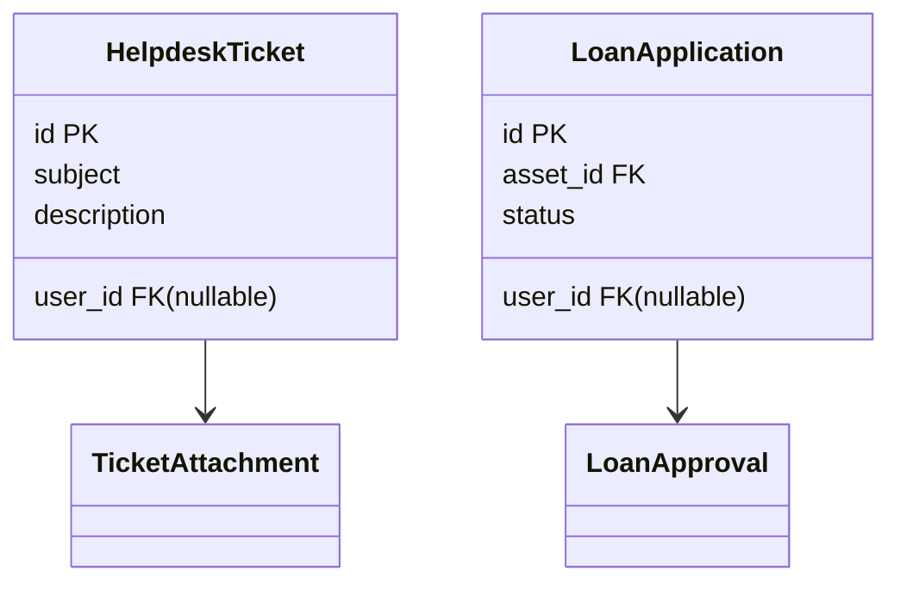

# D06 DOKUMEN SPESIFIKASI MIGRASI DATA

**ICTServe**

| | |
| :--- | :--- |
| **NAMA AGENSI** | MOTAC |
| **NAMA AGENSI INDUK** | BPM MOTAC |
| **TARIKH DOKUMEN** | 29 Disember 2025 |
| **VERSI DOKUMEN** | 3.6.1 |

---

## i. Keterangan Dokumen
Spesifikasi migrasi data ICTServe berdasarkan [_reference/versions/v3.6.1_D06_DATA_MIGRATION_SPECIFICATION.md](_reference/versions/v3.6.1_D06_DATA_MIGRATION_SPECIFICATION.md).

## ii. Semakan dan Pengesahan Dokumen

**SEMAKAN DOKUMEN**

| Disemak Oleh | Jawatan | Tandatangan | Tarikh Semakan |
| :--- | :--- | :--- | :--- |
| | | | |

**PENGESAHAN DOKUMEN**

| Disahkan Oleh | Jawatan | Tandatangan | Tarikh Semakan |
| :--- | :--- | :--- | :--- |
| | | | |

## iii. Kawalan Dokumen

| No. Versi | Tarikh | Ringkasan Pindaan | Penyedia |
| :--- | :--- | :--- | :--- |
| 3.6.1 | 29/12/2025 | Struktur KRISA Spesifikasi Migrasi | Pasukan BPM |

## iv. Kandungan
Rujuk seksyen 1–6.

## v. Senarai Gambarajah
- Pemetaan entiti (classDiagram)

## vi. Senarai Jadual
- Jadual pemetaan atribut

## vii. Definisi dan Akronim
| Akronim | Keterangan |
| :--- | :--- |
| PK | Primary Key |
| FK | Foreign Key |

## viii. Sumber Rujukan
- [docs/KRISA/OFFICIAL-TEMPLATE-AND-SAMPLES/D06_TEMPLATE_SPESIFIKASI_MIGRASI_DATA.md](docs/KRISA/OFFICIAL-TEMPLATE-AND-SAMPLES/D06_TEMPLATE_SPESIFIKASI_MIGRASI_DATA.md)

---

## 1. PENGENALAN
- Tujuan migrasi dan skop entiti

## 2. ENTITI SASARAN

## 3. PEMETAAN ATRIBUT

| Sumber | Sasaran | Transformasi |
| :--- | :--- | :--- |
| `name` | `guest_name` | Trim + Title Case |
| `email` | `guest_email` | Lowercase validate |

## 4. PERATURAN INTEGRITI
- FK nullable bagi tetamu

## 5. SKRIP & FORMAT
- CSV/JSON → SQL Insert

## 6. UJIAN & PENGESAHAN
- UAT Migrasi, semakan jumlah rekod
