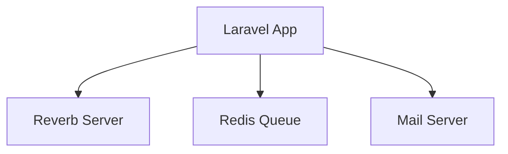
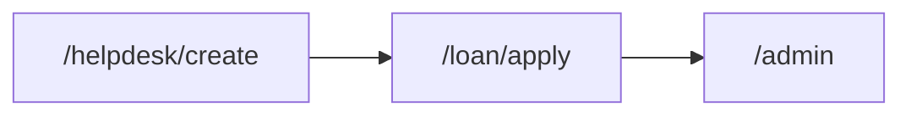

# D07 DOKUMEN PELAN INTEGRASI SISTEM

**ICTServe**

| | |
| :--- | :--- |
| **NAMA AGENSI** | MOTAC |
| **NAMA AGENSI INDUK** | BPM MOTAC |
| **TARIKH DOKUMEN** | 29 Disember 2025 |
| **VERSI DOKUMEN** | 3.6.1 |

---

## i. Keterangan Dokumen
Pelan integrasi sistem berdasarkan [_reference/versions/v3.6.1_D07_SYSTEM_INTEGRATION_PLAN.md](_reference/versions/v3.6.1_D07_SYSTEM_INTEGRATION_PLAN.md).

## ii. Semakan dan Pengesahan Dokumen

**SEMAKAN DOKUMEN**

| Disemak Oleh | Jawatan | Tandatangan | Tarikh Semakan |
| :--- | :--- | :--- | :--- |
| | | | |

**PENGESAHAN DOKUMEN**

| Disahkan Oleh | Jawatan | Tandatangan | Tarikh Semakan |
| :--- | :--- | :--- | :--- |
| | | | |

## iii. Kawalan Dokumen

| No. Versi | Tarikh | Ringkasan Pindaan | Penyedia |
| :--- | :--- | :--- | :--- |
| 3.6.1 | 29/12/2025 | Struktur KRISA Pelan Integrasi | Pasukan BPM |

## iv. Kandungan
Rujuk seksyen 1–6.

## v. Senarai Gambarajah
- Arkitektur integrasi (TD)
- Endpoints map (LR)

## vi. Senarai Jadual
- Jadual dependensi & urutan integrasi

## vii. Definisi dan Akronim
| Akronim | Keterangan |
| :--- | :--- |
| WS | WebSocket |
| SMTP | E-mel |

## viii. Sumber Rujukan
- [docs/KRISA/OFFICIAL-TEMPLATE-AND-SAMPLES/D07_TEMPLATE_PELAN_INTEGRASI_SISTEM.md](docs/KRISA/OFFICIAL-TEMPLATE-AND-SAMPLES/D07_TEMPLATE_PELAN_INTEGRASI_SISTEM.md)

---

## 1. PENGENALAN
- Skop integrasi: Reverb (WS), Redis (Queue), SMTP (Mail)

## 2. ARKITEKTUR INTEGRASI

## 3. ENDPOINTS

## 4. RANCANGAN UJIAN INTEGRASI
- Senario WS, Queue, Mail

## 5. RISIKO & MITIGASI
- Kegagalan WS → fallback notifikasi e-mel

## 6. LAMPIRAN
- Konfigurasi .env (tanpa rahsia)
