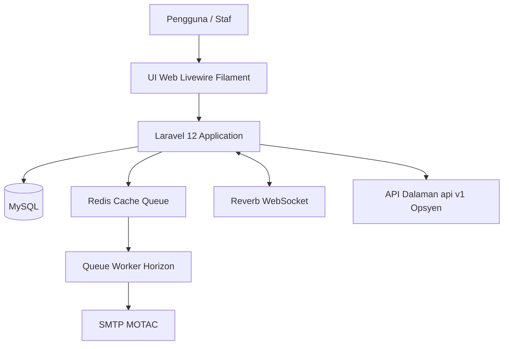

# D07 DOKUMEN PELAN INTEGRASI SISTEM

**ICTServe**

| | |
| :--- | :--- |
| **NAMA AGENSI** | : MOTAC |
| **NAMA AGENSI INDUK** | : BPM MOTAC |
| **TARIKH DOKUMEN** | : 29 Disember 2025 |
| **VERSI DOKUMEN** | : 3.6.1 |

---

## i. Keterangan Dokumen

Dokumen ini menerangkan strategi, skop, pendekatan, kaedah, jadual pelaksanaan, serta risiko bagi **integrasi sistem ICTServe** (Helpdesk & ICT Asset Loan) untuk persekitaran dalaman MOTAC. Penyediaan dokumen ini merujuk kepada piawaian dokumentasi dan kitar hayat sistem/perisian yang berkaitan, serta mematuhi struktur templat KRISA.

Kandungan teknikal utama dokumen ini dirumus dan diselaraskan berpandukan rujukan versi sistem ICTServe 3.6.1:

- [_reference/versions/v3.6.1_D07_SYSTEM_INTEGRATION_PLAN.md](_reference/versions/v3.6.1_D07_SYSTEM_INTEGRATION_PLAN.md)

## ii. Semakan dan Pengesahan Dokumen

**SEMAKAN DOKUMEN**

| Disemak Oleh | Jawatan | Tandatangan | Tarikh Semakan |
| :--- | :--- | :--- | :--- |
| | | | |
| | | | |

**PENGESAHAN DOKUMEN**

| Disahkan Oleh | Jawatan | Tandatangan | Tarikh Semakan |
| :--- | :--- | :--- | :--- |
| | | | |
| | | | |

## iii. Kawalan Dokumen

**KAWALAN DOKUMEN**

| No. Versi | Tarikh | Ringkasan Pindaan | Penyedia |
| :--- | :--- | :--- | :--- |
| 3.6.1 | 29/12/2025 | Penyelarasan kandungan Pelan Integrasi Sistem ICTServe v3.6.1 mengikut templat KRISA | Pasukan BPM |

## iv. Kandungan

- i. Keterangan Dokumen
- ii. Semakan dan Pengesahan Dokumen
- iii. Kawalan Dokumen
- iv. Kandungan
- v. Senarai Gambarajah
- vi. Senarai Jadual
- vii. Definisi dan Akronim
- viii. Sumber Rujukan
- 1. Tujuan Dokumen
- 1. Objektif
- 1. Skop Kerja Integrasi
- 1. Pendekatan dan Strategi
- 1. Kaedah Integrasi, Tools dan Persekitaran
- 1. Tugas dan Tanggungjawab
- 1. Jadual Pelaksanaan
- 1. Andaian dan Risiko
- 1. Penutup

## v. Senarai Gambarajah

- Rajah 1: Gambaran Keseluruhan Arkitektur Integrasi ICTServe

## vi. Senarai Jadual

- Jadual 1: Komponen untuk Integrasi (ringkas)
- Jadual 2: Kaedah Integrasi, Tools dan Persekitaran
- Jadual 3: Tugas dan Tanggungjawab
- Jadual 4: Jadual Pelaksanaan Integrasi
- Jadual 5: Andaian dan Risiko

## vii. Definisi dan Akronim

### a. Akronim

| Akronim | Keterangan |
| :--- | :--- |
| SIP | System Integration Plan (Pelan Integrasi Sistem) |
| API | Application Programming Interface |
| RBAC | Role-Based Access Control |
| MFA | Multi-Factor Authentication |
| UAT | User Acceptance Test |
| SMTP | Simple Mail Transfer Protocol |
| WS | WebSocket |

### b. Definisi

| Terma/Istilah | Definisi |
| :--- | :--- |
| Integrasi Sistem | Proses menggabungkan komponen, modul, dan perkhidmatan agar beroperasi sebagai satu sistem bersepadu dengan pertukaran data yang konsisten dan selamat. |
| Integrasi Dalaman | Integrasi di antara modul atau komponen dalam ekosistem ICTServe dan perkhidmatan dalaman MOTAC (contoh: SMTP, Redis, MySQL). |
| Integrasi Luaran (Opsyen) | Integrasi melalui API versi `/api/v1/` bagi keperluan masa hadapan (contoh: aplikasi pihak ketiga). |

## viii. Sumber Rujukan

- [docs/KRISA/OFFICIAL-TEMPLATE-AND-SAMPLES/D07_TEMPLATE_PELAN_INTEGRASI_SISTEM.md](docs/KRISA/OFFICIAL-TEMPLATE-AND-SAMPLES/D07_TEMPLATE_PELAN_INTEGRASI_SISTEM.md)
- [_reference/versions/v3.6.1_D07_SYSTEM_INTEGRATION_PLAN.md](_reference/versions/v3.6.1_D07_SYSTEM_INTEGRATION_PLAN.md)
- D08 (Spesifikasi Integrasi Sistem) - rujuk dokumen D08 ICTServe v3.6.1 untuk butiran teknikal integrasi

---

## 1. TUJUAN DOKUMEN

Dokumen ini menerangkan strategi dan proses integrasi untuk sistem **Helpdesk & ICT Asset Loan** BPM MOTAC bagi memastikan semua modul dan komponen dapat beroperasi secara bersepadu di persekitaran sebenar MOTAC. Pelan ini menyokong integrasi dalaman antara modul (Helpdesk, Asset Loan, Inventory, Reporting, Audit Trail) serta integrasi dengan perkhidmatan organisasi seperti e-mel notifikasi.

## 2. OBJEKTIF

Objektif pengintegrasian sistem ICTServe adalah seperti berikut:

- Memastikan semua modul berfungsi dengan lancar sebagai satu sistem bersepadu.
- Menjamin konsistensi data antara Helpdesk, Asset Loan, dan Inventory.
- Memudahkan pertukaran data (data exchange & interoperability) antara modul dan komponen.
- Mematuhi keperluan keselamatan, privasi, dan tadbir urus data MOTAC.

## 3. SKOP KERJA INTEGRASI

Skop kerja integrasi meliputi:

- **Integrasi dalaman** antara modul: Helpdesk, Asset Loan, Inventory, Reporting, dan Audit Trail.
- Integrasi dengan **perkhidmatan dalaman MOTAC** (contoh: SMTP untuk notifikasi).
- Sokongan ciri v3.6.1 seperti pemantauan prestasi (Pulse), pengurusan queue (Redis/Horizon), audit (owen-it + spatie), serta integrasi real-time (Reverb/WS).
- Integrasi melalui API versi `/api/v1/` bagi keperluan masa hadapan (jika diperlukan).

**Jadual 1: Komponen untuk Integrasi (ringkas)**

| Modul/Komponen | Integrasi Dengan | Tujuan |
| :--- | :--- | :--- |
| Helpdesk Ticketing | Asset Loan, Inventory | Mengaitkan aduan kerosakan dengan aset/pinjaman dan status aset |
| Asset Loan | Inventory, Helpdesk | Menyelaraskan status aset, sokong proses pinjaman/pemulangan |
| Inventory | Asset Loan, Helpdesk | Rekod aset, status penggunaan dan sejarah |
| Audit Trail | Semua modul | Merekod perubahan dan aktiviti untuk pematuhan/operasi |
| Email Notification | SMTP MOTAC | Notifikasi e-mel untuk aduan, pinjaman dan peringatan |
| Real-time (WS) | Reverb | Kemas kini masa nyata untuk paparan/papan pemuka (jika digunakan) |
| API (Opsyen) | Aplikasi luaran | Integrasi masa hadapan melalui endpoint versi `/api/v1/` |

## 4. PENDEKATAN DAN STRATEGI

Pendekatan dan strategi integrasi ICTServe adalah berpandukan pelaksanaan modular serta kawalan kualiti yang konsisten.

### 4.1 Pendekatan Modular

- Setiap modul dibangunkan sebagai komponen berasingan dengan lapisan servis aplikasi.
- Hubungan data dikekalkan menggunakan Eloquent ORM dan kekangan pangkalan data (foreign key) bagi mengurangkan risiko data tidak konsisten.

### 4.2 Strategi Konsistensi Data

- Penyeragaman pemetaan medan kritikal (contoh: `asset_id`, `user_id`, `status`, `created_at/updated_at`).
- Penggunaan transaksi serta validasi polisi/autoriti pada peringkat aplikasi.

### 4.3 Pengurusan Kegagalan & Fallback

- Logging dan audit digunakan untuk pengesanan isu integrasi.
- Mekanisme queue retry untuk integrasi notifikasi e-mel.

**Rajah 1: Gambaran Keseluruhan Arkitektur Integrasi ICTServe**

## 5. KAEDAH INTEGRASI, TOOLS DAN PERSEKITARAN

Kaedah integrasi ICTServe melibatkan integrasi dalaman (intra-system) serta perkhidmatan organisasi.

**Jadual 2: Kaedah Integrasi, Tools dan Persekitaran**

| Item | Kaedah / Tools | Persekitaran | Catatan |
| :--- | :--- | :--- | :--- |
| Aplikasi Utama | Laravel 12 | Dev / Staging / Produksi | Aplikasi web server-side |
| Pangkalan Data | MySQL | Dev / Staging / Produksi | Data utama modul |
| Queue & Cache | Redis + Horizon | Dev / Staging / Produksi | Job queue, retry, monitoring |
| E-mel Notifikasi | SMTP MOTAC | Staging / Produksi | Notifikasi aduan/pinjaman |
| Real-time | Reverb (WS) | Dev / Staging / Produksi | Kemas kini masa nyata (jika digunakan) |
| Pengujian | PHPUnit, Livewire testing, Playwright | Dev / CI | Ujian unit/feature/E2E |
| Pemantauan | Laravel Pulse (admin/superuser) | Staging / Produksi | Metrik prestasi dan kesihatan |

## 6. TUGAS DAN TANGGUNGJAWAB

Tugas dan tanggungjawab pihak terlibat dalam integrasi adalah seperti berikut:

**Jadual 3: Tugas dan Tanggungjawab**

| Peranan | Tanggungjawab |
| :--- | :--- |
| Pasukan Pembangunan BPM | Membangun modul, menyediakan integrasi dalaman, menyediakan spesifikasi teknikal, serta melaksanakan ujian unit/feature/integrasi |
| Pentadbir Sistem / Operasi ICT | Menyediakan infrastruktur (server, DB, Redis), mengurus deploy, pemantauan perkhidmatan, dan pengendalian insiden |
| Pemilik Sistem (BPM) | Menyemak keperluan operasi, mengesahkan jadual integrasi, dan meluluskan penerimaan sistem |
| SME / Pengguna UAT | Menyemak aliran proses, melaksanakan UAT, serta memberi maklum balas pembaikan |

## 7. JADUAL PELAKSANAAN

Jadual pelaksanaan integrasi dirancang mengikut fasa dan aktiviti utama berikut:

**Jadual 4: Jadual Pelaksanaan Integrasi**

| Fasa Integrasi | Aktiviti Utama | Deliverable | Tempoh |
| :--- | :--- | :--- | :--- |
| Reka bentuk integrasi | Data mapping, reka bentuk interface | Data map, API spec | 1 minggu |
| Pembangunan modul | Build dan unit test setiap modul | Modul siap (unit tested) | 4 minggu |
| Integrasi dalaman | Uji hubungan Helpdesk–Asset Loan–Inventory | Laporan integrasi dalaman | 1 minggu |
| Integrasi notifikasi | E-mel, queue, notifikasi | Notifikasi berfungsi | 3 hari |
| Integrasi sistem sedia ada | Import/migrasi data aset legacy | Data imported & validated | 1 minggu |
| Ujian integrasi penuh | End-to-end dan UAT | Laporan UAT & penambahbaikan | 1 minggu |

## 8. ANDAIAN DAN RISIKO

### 8.1 Andaian

- Persekitaran (DB/Redis/SMTP) tersedia dan stabil untuk ujian integrasi.
- Akses pentadbir sistem untuk konfigurasi infrastruktur disediakan mengikut jadual.
- Data legacy (jika diimport) mempunyai pemetaan yang dikenal pasti dan boleh disahkan.

### 8.2 Risiko dan Mitigasi

**Jadual 5: Andaian dan Risiko**

| Risiko Integrasi | Strategi Kawalan/Mitigasi |
| :--- | :--- |
| Data tidak konsisten | Foreign key, transaksi, polisi validasi |
| Gagal sambungan e-mel | Queue retry, pemantauan, notifikasi ralat |
| Duplikasi/kehilangan data | Audit log, backup, pelan rollback |
| Isu prestasi | Optimasi query, caching, queue |
| Isu keselamatan | RBAC, validasi input, polisi autorisasi |
| Data legacy tidak padan | Data mapping, cleansing, semakan manual |
| WebSocket terputus | Strategi reconnect, fallback polling/refresh |

## 9. PENUTUP

Pelan ini menjadi rujukan bagi memastikan integrasi ICTServe dilaksanakan secara teratur, selamat dan boleh diuji. Faktor kritikal kejayaan merangkumi: pematuhan jadual, kesediaan infrastruktur, ujian integrasi menyeluruh (termasuk UAT), dan pemantauan berterusan bagi memastikan sistem kekal stabil serta mudah dikembangkan.
