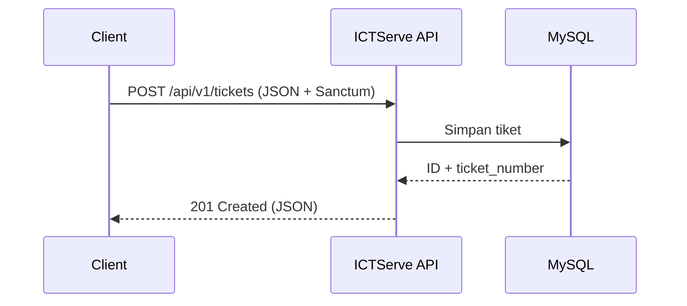
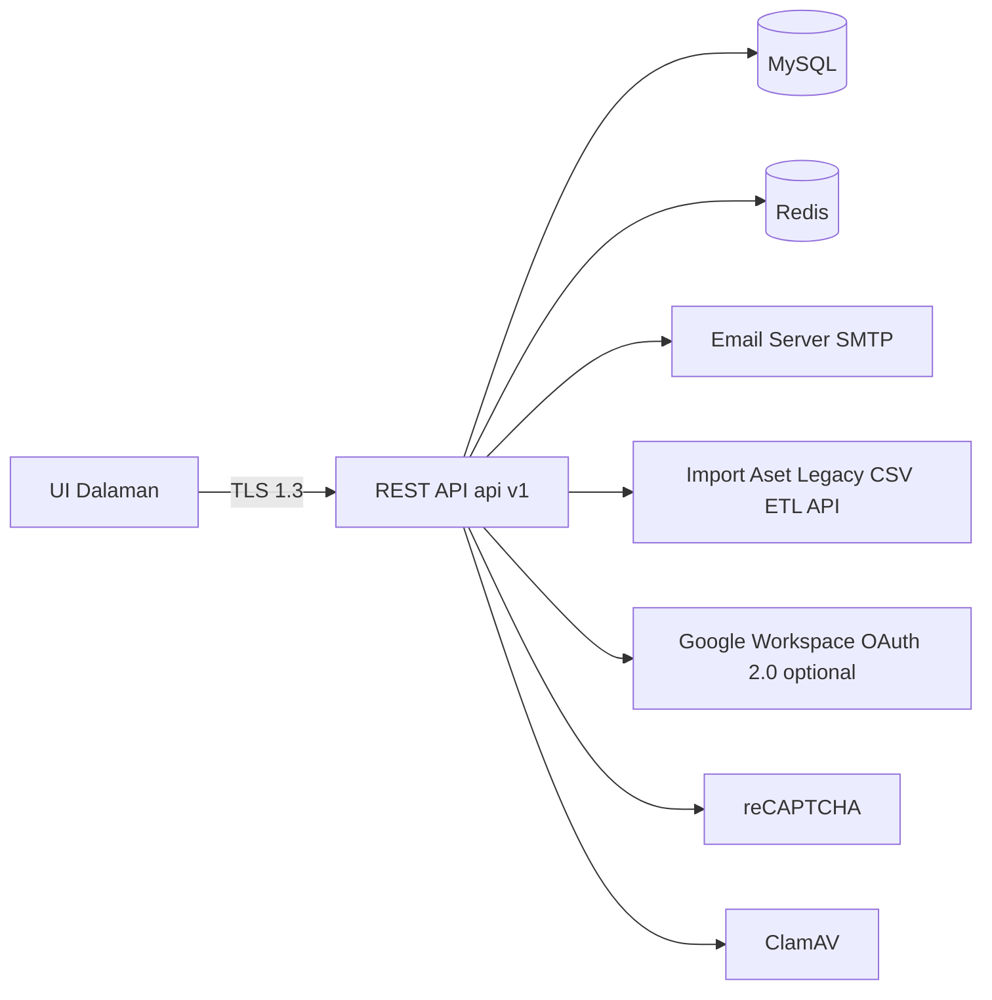

# D08 DOKUMEN SPESIFIKASI INTEGRASI SISTEM

**ICTServe**

| | |
| :--- | :--- |
| **NAMA AGENSI** | MOTAC |
| **NAMA AGENSI INDUK** | BPM MOTAC |
| **TARIKH DOKUMEN** | 17 Disember 2025 |
| **VERSI DOKUMEN** | 3.6.1 |

---

## i. Keterangan Dokumen

Dokumen ini menyatakan spesifikasi integrasi sistem ICTServe yang akan dirujuk semasa fasa pembangunan, pengujian, dan pengoperasian integrasi. Kandungan dokumen ini disusun mengikut templat rasmi KRISA (D08) dan diisi menggunakan fakta daripada rujukan v3.6.1.

Skop dokumen meliputi integrasi dalaman dan luaran yang dinyatakan dalam rujukan, termasuk mekanisme pertukaran data berasaskan RESTful API (JSON), pengesahan token (Laravel Sanctum), serta integrasi luaran seperti SMTP, import aset legacy, OAuth (optional), reCAPTCHA, dan ClamAV.

**Klasifikasi**: Terhad – Dalaman MOTAC (rujuk rujukan v3.6.1).

## ii. Semakan dan Pengesahan Dokumen

**SEMAKAN DOKUMEN**

| Disemak Oleh | Jawatan | Tandatangan | Tarikh Semakan |
| :--- | :--- | :--- | :--- |
| | | | |
| | | | |

**PENGESAHAN DOKUMEN**

| Disahkan Oleh | Jawatan | Tandatangan | Tarikh Semakan |
| :--- | :--- | :--- | :--- |
| | | | |
| | | | |

## iii. Kawalan Dokumen

**KAWALAN DOKUMEN**

| No. Versi | Tarikh | Ringkasan Pindaan | Penyedia |
| :--- | :--- | :--- | :--- |
| 3.6.1 | 17/12/2025 | Penyelarasan kandungan mengikut rujukan integrasi v3.6.1 dan struktur templat KRISA D08 | Pasukan Pembangunan BPM MOTAC |

## iv. Kandungan

Dokumen ini mengandungi seksyen 1 hingga 6 mengikut turutan templat.

## v. Senarai Gambarajah

- Gambarajah 6.1: Reka bentuk senibina integrasi
- Gambarajah 5.1: Proses pertukaran data (contoh: cipta tiket melalui API)

## vi. Senarai Jadual

- Jadual 2.1: Keperluan integrasi
- Jadual 3.x: Kaedah integrasi data (setiap servis)
- Jadual 4.1: Pemetaan data

## vii. Definisi dan Akronim

### a. Akronim

| Akronim | Keterangan |
| :--- | :--- |
| API | Application Programming Interface |
| JSON | JavaScript Object Notation |
| REST | Representational State Transfer |
| SMTP | Simple Mail Transfer Protocol |
| OAuth | Open Authorization 2.0 |
| TLS | Transport Layer Security |

### b. Definisi

| Terma/Istilah | Definisi |
| :--- | :--- |
| Laravel Sanctum | Mekanisme pengesahan token (Bearer token) untuk akses API ICTServe (rujuk rujukan v3.6.1) |
| API versioning `/api/v1/` | Prefix versi untuk keserasian ke belakang (backward compatibility) (rujuk rujukan v3.6.1) |
| Hybrid (guest + auth) | Kaedah akses yang menyokong permintaan guest dan pengguna authenticated, bergantung pada endpoint (rujuk rujukan v3.6.1) |

## viii. Sumber Rujukan

- Templat rasmi KRISA: [docs/KRISA/OFFICIAL-TEMPLATE-AND-SAMPLES/D08_TEMPLATE_SPESIFIKASI_INTEGRASI_DATA.md](docs/KRISA/OFFICIAL-TEMPLATE-AND-SAMPLES/D08_TEMPLATE_SPESIFIKASI_INTEGRASI_DATA.md)
- Rujukan fakta v3.6.1: [_reference/versions/v3.6.1_D08_SYSTEM_INTEGRATION_SPECIFICATION.md](_reference/versions/v3.6.1_D08_SYSTEM_INTEGRATION_SPECIFICATION.md)

---

## 1. TUJUAN DOKUMEN

Dokumen ini menerangkan spesifikasi integrasi sistem ICTServe bagi tujuan rujukan teknikal semasa pembangunan, pengujian integrasi, dan tadbir urus perubahan bagi versi **3.6.1**.

**Kumpulan sasar** (berdasarkan konteks rujukan):

- Pasukan Pembangunan BPM MOTAC
- Pentadbir sistem (operasi dalaman)
- Pihak audit/pematuhan (audit trail & keselamatan integrasi)

**Andaian, batasan dan kekangan** (berdasarkan rujukan v3.6.1):

- Spesifikasi ini untuk kegunaan **dalaman MOTAC** dan **tidak melibatkan API awam**.
- Pertukaran data (dalaman & luaran) menggunakan **RESTful API (JSON)**.
- Semua endpoint API utama menggunakan **Laravel Sanctum Bearer token** dan kemampuan (abilities) tertentu.
- API versioning menggunakan prefix **`/api/v1/`**; turut wujud laluan serasi-ke-belakang (non-versioned) untuk `/api/tickets` dan `/api/loans`.
- Kawalan keselamatan yang dinyatakan termasuk kadar permintaan (rate limit) **100 requests/minute per token**, timeout **30 seconds**, CORS **disabled** untuk domain luaran, dan tamat tempoh token **30 hari**.
- Operasi kelulusan/pengeluaran/pemulangan aset dilaksanakan melalui UI dalaman; endpoint REST seperti `/api/v1/loans/{id}/approve`, `/api/v1/loans/{id}/checkout`, `/api/v1/loans/{id}/checkin` **tidak wujud**.

## 2. KEPERLUAN INTEGRASI

Integrasi yang dinyatakan dalam rujukan v3.6.1 merangkumi komponen luaran (SMTP, import aset legacy, OAuth, reCAPTCHA, ClamAV) dan pertukaran data melalui RESTful API.

| Bil | Rujukan Fungsi | Rujukan Aktiviti | Nama Sistem Sumber | Pemilik Maklumat | Keterangan Maklumat yang dihantar | Tujuan Penggunaan Maklumat |
| :--- | :--- | :--- | :--- | :--- | :--- | :--- |
| 1 | Tidak dinyatakan dalam rujukan v3.6.1 | Tidak dinyatakan dalam rujukan v3.6.1 | Email Server | Tidak dinyatakan dalam rujukan v3.6.1 | Mesej notifikasi/alert melalui SMTP (Notification, Alert) | Notifikasi kepada pengguna/pegawai berkaitan (rujuk integrasi SMTP dalam rujukan v3.6.1) |
| 2 | Tidak dinyatakan dalam rujukan v3.6.1 | Tidak dinyatakan dalam rujukan v3.6.1 | Sistem Aset Legacy | Tidak dinyatakan dalam rujukan v3.6.1 | Data aset untuk modul Inventory & Loan (CSV import, ETL, atau API); contoh mapping `asset_no` → `tag_id` | Import/sinkronisasi rekod aset legacy untuk kegunaan inventori dan pinjaman |
| 3 | Tidak dinyatakan dalam rujukan v3.6.1 | Tidak dinyatakan dalam rujukan v3.6.1 | Google Workspace | Tidak dinyatakan dalam rujukan v3.6.1 | Maklumat pengesahan OAuth 2.0 melalui Laravel Socialite (optional) | SSO (optional) untuk domain @motac.gov.my |
| 4 | Tidak dinyatakan dalam rujukan v3.6.1 | Tidak dinyatakan dalam rujukan v3.6.1 | reCAPTCHA | Tidak dinyatakan dalam rujukan v3.6.1 | Mekanisme bot protection untuk guest forms | Mengurangkan spam/penyalahgunaan borang awam |
| 5 | Tidak dinyatakan dalam rujukan v3.6.1 | Tidak dinyatakan dalam rujukan v3.6.1 | ClamAV | Tidak dinyatakan dalam rujukan v3.6.1 | Virus scanning untuk fail lampiran (file upload) | Keselamatan fail lampiran sebelum diproses/disimpan |

## 3. KAEDAH INTEGRASI DATA

Penerangan setiap servis integrasi yang dinyatakan dalam rujukan v3.6.1 adalah seperti berikut.

### 3.1 Servis API: Tiket (Ticket Management)

| Perkara | Perincian |
| :--- | :--- |
| **Nama Servis** | API Tiket (`/api/v1/tickets`) |
| **Keterangan** | RESTful API untuk senarai dan cipta tiket (Cross-Module Integration API) |
| **Kaedah Integrasi** | RESTful API (JSON) |
| **URL Web Service** | `/api/v1/tickets` |
| **Request** | `GET` (senarai), `POST` (cipta) – autentikasi `auth:sanctum` + abilities (rujuk rujukan v3.6.1) |
| **Respond** | JSON response; contoh 201 Created/422 Unprocessable Entity (rujuk rujukan v3.6.1) |

**Data yang terlibat:**

| Nama | Jenis | Saiz | Nullable | Rules |
| :--- | :--- | :--- | :--- | :--- |
| subject | string | Tidak dinyatakan dalam rujukan v3.6.1 | Tidak dinyatakan dalam rujukan v3.6.1 | Validation error (422) jika tiada (rujuk contoh respons 422) |
| description | string | Tidak dinyatakan dalam rujukan v3.6.1 | Tidak dinyatakan dalam rujukan v3.6.1 | Validation error (422) jika tiada (rujuk contoh respons 422) |
| category_id | integer | Tidak dinyatakan dalam rujukan v3.6.1 | Tidak dinyatakan dalam rujukan v3.6.1 | Validation error (422) jika tidak sah/tiada (rujuk contoh respons 422) |
| priority | string | Tidak dinyatakan dalam rujukan v3.6.1 | Tidak dinyatakan dalam rujukan v3.6.1 | Tidak dinyatakan dalam rujukan v3.6.1 |
| asset_id | integer | Tidak dinyatakan dalam rujukan v3.6.1 | Tidak dinyatakan dalam rujukan v3.6.1 | Tidak dinyatakan dalam rujukan v3.6.1 |

**Contoh permintaan/respons (rujuk rujukan v3.6.1):**

**Request (POST /api/v1/tickets):**

```json
{
    "subject": "Laptop tidak menyala selepas kemas kini BIOS",
    "description": "Laptop tidak boleh dihidupkan selepas kemas kini BIOS. Tiada bunyi kipas dan tiada paparan.",
    "category_id": 1,
    "priority": "HIGH",
    "asset_id": 2001
}
```

**Response (Success - 201 Created):**

```json
{
    "success": true,
    "data": {
        "id": 1001,
        "ticket_number": "HD2025000001",
        "form_reference_code": "PK.(S).MOTAC.07.(L1)",
        "status": "OPEN",
        "created_at": "2025-12-01T10:30:00Z"
    }
}
```

**Response (Error - 422 Unprocessable Entity):**

```json
{
    "success": false,
    "errors": {
        "subject": ["The subject field is required."],
        "description": ["The description field is required."],
        "category_id": ["The selected category id is invalid."]
    }
}
```

### 3.2 Servis API: Pinjaman (Loan Applications)

| Perkara | Perincian |
| :--- | :--- |
| **Nama Servis** | API Pinjaman (`/api/v1/loans`) |
| **Keterangan** | RESTful API untuk senarai dan cipta permohonan pinjaman (Cross-Module Integration API) |
| **Kaedah Integrasi** | RESTful API (JSON) |
| **URL Web Service** | `/api/v1/loans` |
| **Request** | `GET` (senarai), `POST` (cipta) – autentikasi `auth:sanctum` + abilities (rujuk rujukan v3.6.1) |
| **Respond** | Tidak dinyatakan contoh payload dalam rujukan v3.6.1 |

**Data yang terlibat:**

| Nama | Jenis | Saiz | Nullable | Rules |
| :--- | :--- | :--- | :--- | :--- |
| Tidak dinyatakan dalam rujukan v3.6.1 | | | | |

> Nota: Operasi kelulusan/pengeluaran/pemulangan aset dilaksanakan melalui UI dalaman; endpoint REST untuk approve/checkout/checkin **tidak wujud** (rujuk rujukan v3.6.1).

### 3.3 Servis API: Memori Agen (Memory)

| Perkara | Perincian |
| :--- | :--- |
| **Nama Servis** | Memory API (`/api/v1/memory/import`, `/api/v1/memory/search`) |
| **Keterangan** | Endpoint untuk import dan carian memori agen; menggunakan token aplikasi (MEMORY_API_TOKEN) |
| **Kaedah Integrasi** | RESTful API (JSON) |
| **URL Web Service** | `/api/v1/memory/import`, `/api/v1/memory/search` |
| **Request** | `POST` (import), `GET` (search) – token aplikasi (bukan `auth:sanctum`) |
| **Respond** | Tidak dinyatakan contoh payload dalam rujukan v3.6.1 |

**Data yang terlibat:**

| Nama | Jenis | Saiz | Nullable | Rules |
| :--- | :--- | :--- | :--- | :--- |
| Tidak dinyatakan dalam rujukan v3.6.1 | | | | |

### 3.4 Servis API: AI (FAQ Bot)

| Perkara | Perincian |
| :--- | :--- |
| **Nama Servis** | Ollama FAQ API (`/api/v1/ollama/faq/*`) |
| **Keterangan** | Query FAQ bot, sejarah perbualan, dan claim perbualan guest kepada akaun |
| **Kaedah Integrasi** | RESTful API (JSON) |
| **URL Web Service** | `/api/v1/ollama/faq/query`, `/api/v1/ollama/faq/history`, `/api/v1/ollama/faq/claim` |
| **Request** | `POST`/`GET` – Hybrid (guest + auth) / `auth:sanctum` untuk tindakan tertentu (rujuk rujukan v3.6.1) |
| **Respond** | Tidak dinyatakan contoh payload dalam rujukan v3.6.1 |

**Data yang terlibat:**

| Nama | Jenis | Saiz | Nullable | Rules |
| :--- | :--- | :--- | :--- | :--- |
| Tidak dinyatakan dalam rujukan v3.6.1 | | | | |

## 4. PEMETAAN DATA

Pemetaan data di bawah memfokuskan contoh yang dinyatakan dalam rujukan v3.6.1 (contoh request/response API tiket dan contoh mapping aset legacy).

| Sistem yang memohon (request) | | | | Data yang diterima | | | |
| :--- | :--- | :--- | :--- | :--- | :--- | :--- | :--- |
| **Nama Medan** | **Jenis** | **Saiz** | **Keterangan** | **Nama Medan** | **Jenis** | **Saiz** | **Keterangan** |
| subject | string | Tidak dinyatakan | Subjek tiket | ticket_number | string | Tidak dinyatakan | Nombor rujukan tiket (dijana sistem) |
| description | string | Tidak dinyatakan | Keterangan tiket | status | string | Tidak dinyatakan | Status tiket (cth: OPEN) |
| category_id | integer | Tidak dinyatakan | Kategori tiket | form_reference_code | string | Tidak dinyatakan | Kod rujukan borang (cth: PK.(S).MOTAC.07.(L1)) |
| asset_no | Tidak dinyatakan | Tidak dinyatakan | Medan aset legacy (contoh mapping) | tag_id | Tidak dinyatakan | Tidak dinyatakan | Medan tag aset baharu dalam ICTServe (contoh mapping) |

> Nota: Rujukan v3.6.1 hanya menyatakan contoh mapping `asset_no` → `tag_id` tanpa spesifikasi jenis/saiz.

## 5. PROSES PERTUKARAN DATA

Proses pertukaran data dilaksanakan melalui RESTful API (JSON) untuk pertukaran data dalaman dan luaran yang dinyatakan. Selain itu, rujukan v3.6.1 turut menyatakan penggunaan jadual proses integrasi seperti cron/job queue untuk sync/import berkala.

**Peraturan/trigger pertukaran data** (berdasarkan rujukan v3.6.1):

- Panggilan API oleh aplikasi/komponen dalaman menggunakan token (Sanctum) dan abilities.
- Throttling/rate limiting bagi endpoint tertentu (contoh: >100 requests/minute per token).
- Sync/import berkala melalui cron/job queue.

**Contoh aliran (POST /api/v1/tickets):**



## 6. REKA BENTUK SENIBINA INTEGRASI

Reka bentuk senibina integrasi menggambarkan komponen utama pertukaran data yang dinyatakan dalam rujukan v3.6.1: penggunaan RESTful API (JSON), Sanctum token, Redis (rate limit tracking), MySQL (data), serta integrasi luaran seperti SMTP, import aset legacy, OAuth (optional), reCAPTCHA, dan ClamAV.

**Keperluan infrastruktur/keselamatan (berdasarkan rujukan v3.6.1):**

- Saluran komunikasi menggunakan TLS 1.3.
- Rate limit: 100 requests/minute per token (tracked via Redis).
- Timeout: 30 seconds per request.
- CORS: Disabled untuk domain luaran (internal API only).
- Token expiry: 30 hari (configurable).


