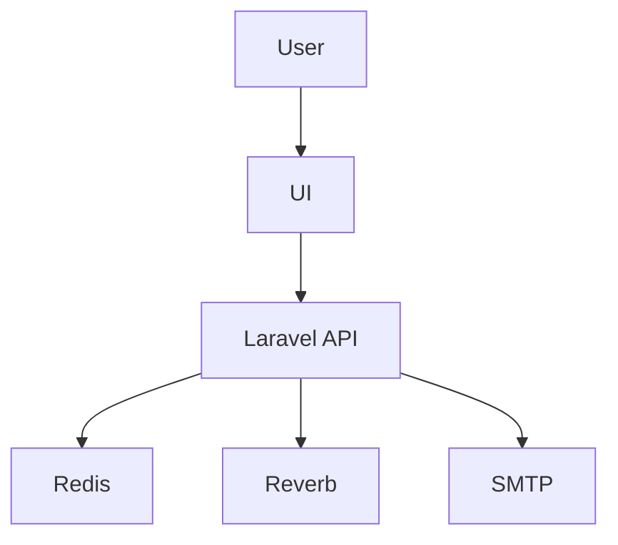

# D08 DOKUMEN SPESIFIKASI INTEGRASI SISTEM

**ICTServe**

| | |
| :--- | :--- |
| **NAMA AGENSI** | MOTAC |
| **NAMA AGENSI INDUK** | BPM MOTAC |
| **TARIKH DOKUMEN** | 29 Disember 2025 |
| **VERSI DOKUMEN** | 3.6.1 |

---

## i. Keterangan Dokumen
Spesifikasi integrasi sistem berdasarkan [_reference/versions/v3.6.1_D08_SYSTEM_INTEGRATION_SPECIFICATION.md](_reference/versions/v3.6.1_D08_SYSTEM_INTEGRATION_SPECIFICATION.md).

## ii. Semakan dan Pengesahan Dokumen

**SEMAKAN DOKUMEN**

| Disemak Oleh | Jawatan | Tandatangan | Tarikh Semakan |
| :--- | :--- | :--- | :--- |
| | | | |

**PENGESAHAN DOKUMEN**

| Disahkan Oleh | Jawatan | Tandatangan | Tarikh Semakan |
| :--- | :--- | :--- | :--- |
| | | | |

## iii. Kawalan Dokumen

| No. Versi | Tarikh | Ringkasan Pindaan | Penyedia |
| :--- | :--- | :--- | :--- |
| 3.6.1 | 29/12/2025 | Struktur KRISA Spesifikasi Integrasi | Pasukan BPM |

## iv. Kandungan
Rujuk seksyen 1–6.

## v. Senarai Gambarajah
- Diagram urutan (TD)

## vi. Senarai Jadual
- Jadual kontrak data

## vii. Definisi dan Akronim
| Akronim | Keterangan |
| :--- | :--- |
| JSON | Data payload |

## viii. Sumber Rujukan
- [docs/KRISA/OFFICIAL-TEMPLATE-AND-SAMPLES/D08_DOKUMEN_SPESIFIKASI_INTEGRASI_SISTEM_SAMPLE.md](docs/KRISA/OFFICIAL-TEMPLATE-AND-SAMPLES/D08_DOKUMEN_SPESIFIKASI_INTEGRASI_SISTEM_SAMPLE.md)

---

## 1. PENGENALAN
- Integrasi WS, Queue, Mail

## 2. DIAGRAM URUTAN

## 3. KONTRAK DATA

| Endpoint | Metod | Payload |
| :--- | :--- | :--- |
| `/helpdesk/create` | POST | `{subject, description, attachments}` |

## 4. UJIAN & VALIDASI
- Ujian muatan, ketahanan WS

## 5. RISIKO & MITIGASI
- Kegagalan queue → retry policy

## 6. LAMPIRAN
- Contoh payload
