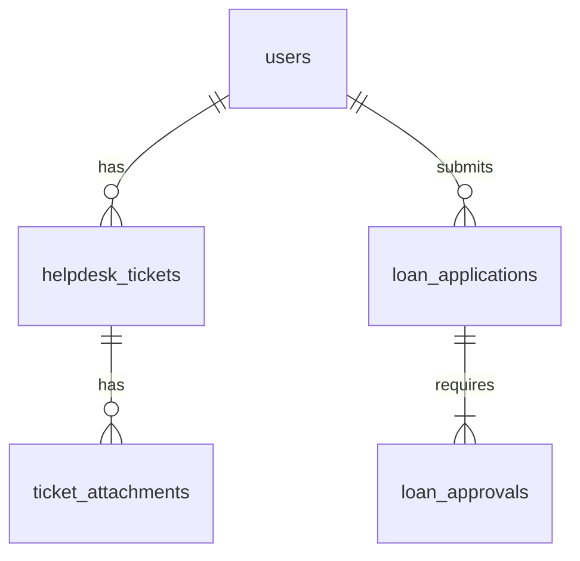

# D09 DOKUMENTASI PANGKALAN DATA

**ICTServe**

| | |
| :--- | :--- |
| **NAMA AGENSI** | MOTAC |
| **NAMA AGENSI INDUK** | BPM MOTAC |
| **TARIKH DOKUMEN** | 29 Disember 2025 |
| **VERSI DOKUMEN** | 3.6.1 |

---

## i. Keterangan Dokumen
Dokumentasi DB berdasarkan [_reference/versions/v3.6.1_D09_DATABASE_DOCUMENTATION.md](_reference/versions/v3.6.1_D09_DATABASE_DOCUMENTATION.md).

## ii. Semakan dan Pengesahan Dokumen

**SEMAKAN DOKUMEN**

| Disemak Oleh | Jawatan | Tandatangan | Tarikh Semakan |
| :--- | :--- | :--- | :--- |
| | | | |

**PENGESAHAN DOKUMEN**

| Disahkan Oleh | Jawatan | Tandatangan | Tarikh Semakan |
| :--- | :--- | :--- | :--- |
| | | | |

## iii. Kawalan Dokumen

| No. Versi | Tarikh | Ringkasan Pindaan | Penyedia |
| :--- | :--- | :--- | :--- |
| 3.6.1 | 29/12/2025 | Struktur KRISA DB | Pasukan BPM |

## iv. Kandungan
Rujuk seksyen 1–6.

## v. Senarai Gambarajah
- ERD (Mermaid erDiagram)

## vi. Senarai Jadual
- Skema jadual & indeks

## vii. Definisi dan Akronim
| Akronim | Keterangan |
| :--- | :--- |
| ERD | Entity-Relationship Diagram |

## viii. Sumber Rujukan
- [docs/KRISA/OFFICIAL-TEMPLATE-AND-SAMPLES/D09_TEMPLATE_DOKUMENTASI_PANGKALAN_DATA.md](docs/KRISA/OFFICIAL-TEMPLATE-AND-SAMPLES/D09_TEMPLATE_DOKUMENTASI_PANGKALAN_DATA.md)

---

## 1. PENGENALAN
- Klasifikasi data & akses

## 2. ERD

## 3. SKEMA LOGIKAL
- Jenis data, indeks, kekangan

## 4. PROSEDUR & VIEWS
- Ringkasan jika ada

## 5. KESELAMATAN DATA
- Audit trail, enkripsi TLS

## 6. LAMPIRAN
- Jadual lengkap skema
