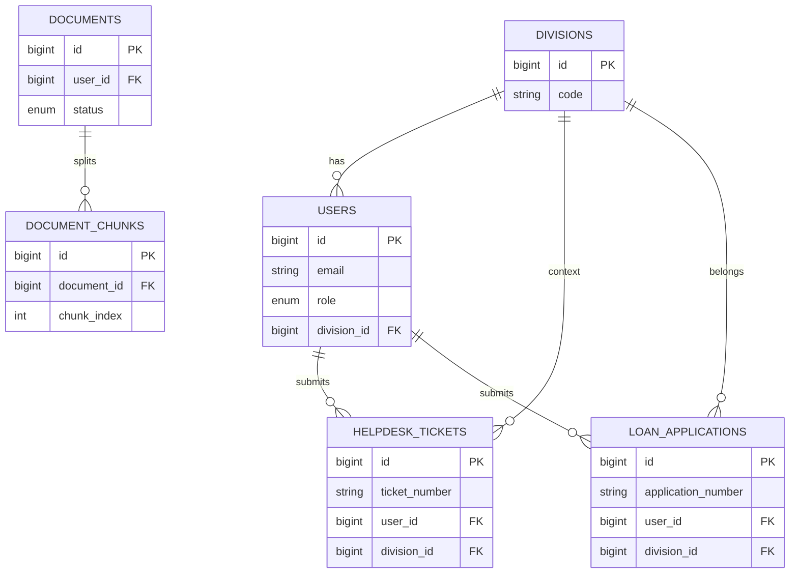

# D09 DOKUMENTASI PANGKALAN DATA

**ICTServe**

| | |
| :--- | :--- |
| **NAMA AGENSI** | MOTAC |
| **NAMA AGENSI INDUK** | BPM MOTAC |
| **TARIKH DOKUMEN** | 29 Disember 2025 |
| **VERSI DOKUMEN** | 3.6.1 |

---

## i. Keterangan Dokumen

Dokumen ini menerangkan ringkasan pangkalan data fizikal bagi sistem ICTServe, termasuk teknologi pangkalan data, jadual utama, indeks ringkas, dan sumber skrip pembangunan pangkalan data.

Kandungan dokumen ini disediakan berdasarkan rujukan v3.6.1 berikut:

- `_reference/versions/v3.6.1_D09_DATABASE_DOCUMENTATION.md`

## ii. Semakan dan Pengesahan Dokumen

**SEMAKAN DOKUMEN**

| Disemak Oleh | Jawatan | Tandatangan | Tarikh Semakan |
| :--- | :--- | :--- | :--- |
| | | | |
| | | | |

**PENGESAHAN DOKUMEN**

| Disahkan Oleh | Jawatan | Tandatangan | Tarikh Semakan |
| :--- | :--- | :--- | :--- |
| | | | |
| | | | |

## iii. Kawalan Dokumen

**KAWALAN DOKUMEN**

| No. Versi | Tarikh | Ringkasan Pindaan | Penyedia |
| :--- | :--- | :--- | :--- |
| 3.6.1 | 29/12/2025 | Penyusunan semula mengikut templat KRISA D09 menggunakan fakta rujukan v3.6.1 | Pasukan BPM |

## iv. Kandungan

| Bil. | Seksyen | Perihal | Muka Surat |
| :---: | :--- | :--- | :---: |
| 1 | 1 | Pengenalan | - |
| 2 | 2 | Ringkasan Maklumat Pangkalan Data Fizikal yang Dibangunkan | - |
| 3 | 3 | Skrip Pangkalan Data | - |
| 4 | 4 | Lampiran | - |

## v. Senarai Gambarajah

| No. | Tajuk Gambarajah | Muka Surat |
| :---: | :--- | :---: |
| Rajah 4.1 | ERD Ringkas ICTServe (lampiran) | - |

## vi. Senarai Jadual

| No. | Tajuk Jadual | Muka Surat |
| :---: | :--- | :---: |
| Jadual 2.1 | Teknologi Pangkalan Data | - |
| Jadual 2.2 | Senarai Jadual Utama | - |
| Jadual 2.3 | Ringkasan Indeks (Jadual Terpilih) | - |

## vii. Definisi dan Akronim

### a. Akronim

| Akronim | Keterangan |
| :--- | :--- |
| ERD | Entity-Relationship Diagram |
| RDBMS | Relational Database Management System |

### b. Definisi

| Terma/Istilah | Definisi |
| :--- | :--- |
| Indeks (Index) | Struktur data pangkalan data untuk mempercepat carian/penapisan berdasarkan medan tertentu. |
| Migrations | Mekanisme kawalan versi skema pangkalan data menggunakan fail migrasi aplikasi. |

## viii. Sumber Rujukan

- `docs/KRISA/OFFICIAL-TEMPLATE-AND-SAMPLES/D09_TEMPLATE_DOKUMENTASI_PANGKALAN_DATA.md`
- `_reference/versions/v3.6.1_D09_DATABASE_DOCUMENTATION.md`

---

## 1. PENGENALAN

ICTServe menggunakan pangkalan data relasional bagi menyimpan data operasi sistem seperti akaun pengguna, tiket helpdesk, permohonan pinjaman aset, audit, pemantauan prestasi, serta jadual berkaitan komponen AI.

Dokumen ini menyediakan ringkasan maklumat pangkalan data fizikal yang dibangunkan dan rujukan skrip pembinaan skema.

## 2. RINGKASAN MAKLUMAT PANGKALAN DATA FIZIKAL YANG DIBANGUNKAN

Seksyen ini menerangkan maklumat pangkalan data fizikal yang dibangunkan seperti berikut:

a) Pangkalan data yang digunakan.
b) Peruntukan ruang jadual (tablespace/filegroup).
c) Nama pangkalan data.
d) Bilangan table, view.
e) Stored procedure.
f) Maklumat jadual dan medan yang mengandungi INDEX.
g) Senarai pengguna yang mempunyai kawalan akses ke atas pangkalan data/jadual.

### a) Pangkalan data yang digunakan

- MySQL 8.x (produksi)
- SQLite 3.x (pembangunan/ujian)
- Redis 7.x (caching, dan digunakan bersama komponen queue)

### Jadual 2.1: Teknologi Pangkalan Data

Berdasarkan rujukan v3.6.1, teknologi pangkalan data ICTServe adalah seperti berikut:

| Komponen | Teknologi | Versi | Fungsi |
| :--- | :--- | :---: | :--- |
| RDBMS | MySQL | 8.x | Production database |
| Development DB | SQLite | 3.x | Development/testing database |
| ORM | Eloquent | 12.43.1 | Laravel ORM |
| Migrations | Laravel | 12.43.1 | Schema version control |
| Caching | Redis | 7.x | Query caching |
| Queue Management | Laravel Horizon | 5.41.0 | Redis queue monitoring & management |
| API Authentication | Laravel Sanctum | 4.2.1 | Token-based API authentication |

### b) Peruntukan ruang jadual (tablespace/filegroup)

Tidak dinyatakan dalam rujukan v3.6.1 dan tidak ditetapkan secara khusus dalam konfigurasi/migrasi aplikasi (tiada pernyataan tablespace/filegroup).

### c) Nama pangkalan data

Nama pangkalan data ditentukan melalui pembolehubah persekitaran `DB_DATABASE`.

Contoh nilai yang wujud dalam repositori:

- `ictserve` (contoh pembangunan dan docker-compose)
- `ictserve_production` (contoh konfigurasi produksi)

### d) Bilangan table, view

Berdasarkan analisis repositori:

- Fail migrasi di `database/migrations/` mengandungi **80** panggilan `Schema::create(...)`, dengan **73** nama jadual literal yang unik.
- Terdapat **5** jadual dinamik (Spatie Permission) yang dicipta menggunakan `Schema::create($tableNames['...'])`: `model_has_permissions`, `model_has_roles`, `permissions`, `role_has_permissions`, `roles`.
- Tiada bukti skrip `CREATE VIEW` dalam repositori.

Rujukan v3.6.1 menyenaraikan jadual utama seperti berikut.

### Jadual 2.2: Senarai Jadual Utama

| Jadual | Fungsi |
| :--- | :--- |
| users | Akaun pengguna staf & pentadbir (portal & panel Filament) |
| divisions | Rujukan bahagian/unit MOTAC |
| audits | Jejak audit field-level |
| activity_log | Log aktiviti sistem |
| helpdesk_tickets | Rekod tiket helpdesk |
| helpdesk_comments | Komen pentadbir terhadap tiket |
| helpdesk_attachments | Fail lampiran tiket |
| loan_applications | Permohonan pinjaman aset |
| loan_items | Item aset dalam permohonan |
| loan_transactions | Pengeluaran & pemulangan aset |
| loan_transaction_accessories | Aksesori check-out/check-in |
| loan_approvals | Rekod kelulusan |
| loan_audits | Jejak audit khusus modul pinjaman |
| status_tokens | Token semakan status tetamu (opsyen) |
| notifications | Notifikasi Laravel |
| personal_access_tokens | API tokens (Laravel Sanctum) |
| pulse_aggregates / pulse_entries / pulse_values | Jadual pemantauan prestasi (Laravel Pulse) |
| faqs | FAQ knowledge base untuk AI Bot |
| documents | Dokumen untuk analisis AI |
| document_chunks | Chunks dokumen untuk RAG |
| embeddings | Vector embeddings untuk semantic search |
| message_logs | Log interaksi AI |
| bedrock_conversations | Conversation management untuk AI |
| auto_reply_templates | Template auto-reply AI |
| auto_reply_drafts | Draf auto-reply yang dijana AI |

### e) Stored procedure

Tiada bukti skrip `CREATE PROCEDURE` atau `CREATE FUNCTION` dalam repositori skema/migrasi aplikasi. Padanan rentetan tersebut dalam repositori adalah pada dokumen contoh KRISA, bukan skrip pangkalan data ICTServe.

### f) Maklumat jadual dan medan yang mengandungi INDEX

Berikut ialah ringkasan indeks yang dinyatakan dalam rujukan v3.6.1 untuk jadual terpilih.

### Jadual 2.3: Ringkasan Indeks (Jadual Terpilih)

| Jadual | Ringkasan Indeks |
| :--- | :--- |
| users | `(email)`, `(role)`, `(division_id, grade_id)`, `(division_code)`, `(staff_number)`, `(google_id)` |
| helpdesk_tickets | `(ticket_number)`, `(user_id)`, `(guest_email)`, `(status)`, `(priority)`, `(category_id)`, `(assigned_to_division)`, `(asset_id)`, `(status_token_hash)` |
| loan_applications | `(application_number)`, `(user_id)`, `(applicant_email)`, `(division_id)`, `(status)`, `(status_token_hash)` |
| personal_access_tokens | `(tokenable_type, tokenable_id)`, `(token)` |
| faqs | `(category, is_active)`, `(user_id)`, `(priority DESC, created_at DESC)` |
| documents | `(user_id, status)`, `(status, created_at)`, `(checksum)` |
| document_chunks | `(document_id, chunk_index)`, `(document_id, page_number)` |

### g) Senarai pengguna yang mempunyai kawalan akses ke atas pangkalan data/jadual

Konfigurasi capaian DB ditentukan melalui pembolehubah persekitaran (contoh: `DB_USERNAME`, `DB_PASSWORD`). Contoh nilai yang wujud dalam repositori:

- Pembangunan setempat (contoh): `DB_USERNAME=root` (kata laluan melalui `DB_PASSWORD`)
- Docker compose (contoh): `DB_USERNAME=laravel` (kata laluan melalui `DB_PASSWORD`)
- Produksi (contoh): `DB_USERNAME=ictserve_user` (kata laluan melalui `DB_PASSWORD`)

Nilai sebenar bagi produksi tertakluk kepada persekitaran operasi dan tidak disimpan dalam repositori.

Sebagai maklumat peringkat aplikasi (rujukan v3.6.1), jadual `users` mempunyai medan `role` dengan nilai `staff`, `approver`, `admin`, `superuser` untuk tujuan kawalan akses aplikasi.

## 3. SKRIP PANGKALAN DATA

Skema pangkalan data ICTServe dibangunkan dan dikawal versi menggunakan mekanisme migrasi aplikasi.

- **Skrip/Fail Migrasi**: disimpan di laluan `database/migrations/`
- Contoh rujukan v3.6.1 menyatakan “source of truth” skema jadual `users` di fail migrasi `database/migrations/2025_11_03_043900_create_users_table.php`.

## 4. LAMPIRAN

### Rajah 4.1: ERD Ringkas ICTServe (Mermaid)

