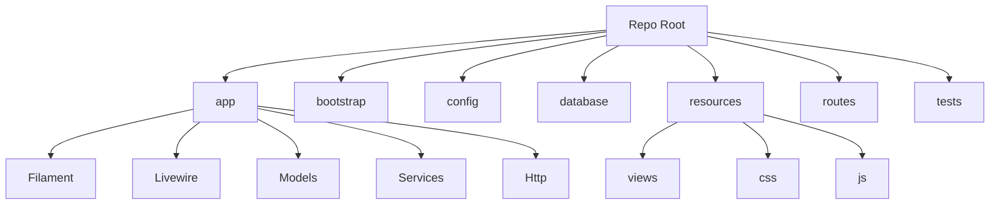
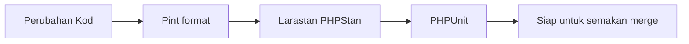

# D10 DOKUMENTASI KOD SUMBER

**SISTEM ICTSERVE**

*(Sistem Pengurusan Helpdesk dan Pinjaman Aset ICT)*

| | |
| :--- | :--- |
| **NAMA AGENSI** | : Bahagian Pengurusan Maklumat (BPM) |
| **NAMA AGENSI INDUK** | : Kementerian Pelancongan, Seni dan Budaya Malaysia (MOTAC) |
| **TARIKH DOKUMEN** | : 29 Disember 2025 |
| **VERSI DOKUMEN** | : 3.6.1 |

---

## i. Keterangan Dokumen

Dokumen ini menyatakan piawaian dan panduan kod pengaturcaraan yang digunakan bagi membangunkan **Sistem ICTServe**. Piawaian ini dirujuk semasa fasa pembangunan dan penyelenggaraan sebagai garis panduan penulisan kod yang konsisten, selamat, dan mudah disenggara.

Sumber fakta utama bagi kandungan teknikal adalah rujukan versi v3.6.1 dan struktur repo semasa.

## ii. Semakan dan Pengesahan Dokumen

**SEMAKAN DOKUMEN**

| Disemak Oleh | Jawatan | Tandatangan | Tarikh Semakan |
| :--- | :--- | :--- | :--- |
| | | | |
| | | | |

**PENGESAHAN DOKUMEN**

| Disahkan Oleh | Jawatan | Tandatangan | Tarikh Semakan |
| :--- | :--- | :--- | :--- |
| | | | |
| | | | |

## iii. Kawalan Dokumen

**KAWALAN DOKUMEN**

| No. Versi | Tarikh | Ringkasan Pindaan | Penyedia |
| :--- | :--- | :--- | :--- |
| 3.6.1 | 29 Disember 2025 | Penyelarasan dokumen mengikut templat rasmi KRISA dan sumber rujukan v3.6.1 | Pasukan Pembangunan BPM |

## iv. Kandungan

1. [TUJUAN DOKUMEN](#1-tujuan-dokumen)
2. [SKOP DOKUMEN](#2-skop-dokumen)
3. [PIAWAIAN KOD SUMBER](#3-piawaian-kod-sumber)
4. [LAMPIRAN](#4-lampiran)

## v. Senarai Gambarajah

- Gambarajah 1: Struktur Direktori Kod Sumber ICTServe
- Gambarajah 2: Aliran Jaminan Kualiti Kod (Format, Analisis Statik, Ujian)

## vi. Senarai Jadual

- Jadual 1: Ringkasan Teknologi Teras (v3.6.1)

## vii. Definisi dan Akronim

### a. Akronim

| Akronim | Keterangan |
| :--- | :--- |
| API | Application Programming Interface |
| BPM | Bahagian Pengurusan Maklumat |
| CI | Continuous Integration |
| CRUD | Create, Read, Update, Delete |
| MVC | Model-View-Controller |
| ORM | Object-Relational Mapping |
| PSR-12 | PHP Standards Recommendation - Extended Coding Style Guide |
| RBAC | Role-Based Access Control |
| SSO | Single Sign-On |

### b. Definisi

| Terma/Istilah | Definisi |
| :--- | :--- |
| Strict typing | Penggunaan `declare(strict_types=1);` bagi penguatkuasaan jenis data yang lebih ketat dalam PHP. |
| Form Request | Kelas validasi input pengguna di `app/Http/Requests/` untuk memastikan pemisahan tanggungjawab dan keselamatan input. |
| Service layer | Lapisan perniagaan di `app/Services/` yang menghimpunkan logik domain/urusan sistem. |
| Livewire component | Komponen UI server-driven yang membolehkan interaktiviti tanpa JS berat, disokong oleh Livewire v3. |
| Filament resource | Definisi SDUI (Server-Driven UI) untuk CRUD dan paparan data dalam panel pentadbir Filament v4. |

## viii. Sumber Rujukan

1. docs/KRISA/OFFICIAL-TEMPLATE-AND-SAMPLES/D10_TEMPLATE_DOKUMENTASI_KOD_SUMBER.md
2. _reference/versions/v3.6.1_D10_SOURCE_CODE_DOCUMENTATION.md
3. composer.json

---

## 1. TUJUAN DOKUMEN

Dokumen ini menerangkan piawaian penulisan kod sumber bagi pembangunan dan penyelenggaraan Sistem ICTServe v3.6.1 untuk memastikan:

- Kod yang konsisten dan mudah dibaca (readability)
- Kualiti dan kebolehselenggaraan (maintainability)
- Keselamatan (security) melalui amalan validasi input dan struktur kod yang tersusun
- Kebolehujian (testability) melalui amalan ujian automatik

**Kumpulan sasar dokumen ini**:

- Pembangun sistem (PHP/Laravel)
- Penganalisis sistem / penyelaras teknikal
- Pegawai jaminan kualiti (QA)

**Andaian, batasan dan kekangan**:

- Dokumen ini memberi fokus kepada piawaian penulisan kod (coding standard) dan contoh amalan; butiran reka bentuk modul, pangkalan data dan proses operasi dirujuk dalam dokumen lain.
- Dokumen ini tidak menetapkan kaedah pengesahan identiti sebagai “mandatori” untuk semua kaedah; penerangan autentikasi adalah mengikut konfigurasi sistem dan keperluan keselamatan yang berkuat kuasa.
- Piawaian dipatuhi melalui gabungan konvensyen pasukan, Laravel Pint (formatting), analisis statik (Larastan/PHPStan), dan ujian automatik.

## 2. SKOP DOKUMEN

Skop penyediaan kod sumber merangkumi:

i. Nama sistem yang terlibat  
Sistem ICTServe (Sistem Pengurusan Helpdesk dan Pinjaman Aset ICT).

ii. Nama modul yang terlibat  
- Modul Helpdesk (tiket aduan/permohonan)
- Modul Pinjaman Aset ICT (permohonan, kelulusan, pengurusan aset)
- Modul Pentadbiran (panel pentadbir berasaskan Filament)
- Komponen sokongan (notifikasi, audit trail, laporan, integrasi dan utiliti)

iii. Nama pasukan pembangunan sistem yang terlibat  
Pasukan Pembangunan Bahagian Pengurusan Maklumat (BPM), MOTAC.

## 3. PIAWAIAN KOD SUMBER

Piawaian kod sumber ini merujuk kepada amalan penulisan kod PHP moden dan konvensyen Laravel (PSR-12, strict types, pengasingan logik perniagaan dalam service layer, validasi menggunakan Form Request, dan penggunaan ujian automatik). Format kod dipiawaikan melalui Laravel Pint.

### i. File Name

Penamaan fail dan kelas menggunakan `PascalCase` untuk kelas PHP dan struktur folder mengikut konvensyen Laravel:

- Model: `app/Models/HelpdeskTicket.php`
- Service: `app/Services/EmailNotificationService.php`
- Livewire component: `app/Livewire/Helpdesk/CreateTicket.php`
- Filament resource: `app/Filament/Resources/TicketResource.php`
- Migration: `database/migrations/2025_11_03_043924_create_helpdesk_tickets_table.php`

### ii. Class Headers and Declaration

Semua fail PHP bermula dengan `declare(strict_types=1);` dan `namespace` yang tepat. Kelas menggunakan nama yang deskriptif dan mematuhi PSR-12.

Contoh:

```php
<?php

declare(strict_types=1);

namespace App\Services;

use Illuminate\Contracts\Log\Logger;

final class ExampleService
{
    public function __construct(
        private readonly Logger $logger,
    )
    {
    }
}
```

### iii. Method Headers and Declaration

Kaedah (method) perlu:

- Menggunakan nama yang jelas (kata kerja + objek)
- Menggunakan type-hint parameter dan return type
- Mengelakkan method terlalu panjang; pecahkan kepada method yang lebih kecil jika perlu

Contoh:

```php
public function createTicket(array $payload): int
{
    // Implementasi logik penciptaan tiket
    return 1;
}
```

### iv. Indentation

- Indentasi menggunakan **4 ruang**.
- Gunakan Laravel Pint untuk memastikan format konsisten.

### v. Inline Comments

- Keutamaan diberikan kepada **PHPDoc** yang bermakna untuk kelas/method yang memerlukan penerangan kontrak atau bentuk data.
- Inline comment digunakan secara minimum dan hanya apabila menerangkan logik yang kompleks atau keputusan teknikal yang sukar difahami.

### vi. Variable Names

- Nama pembolehubah menggunakan `camelCase` dan perlu bermakna.
- Elakkan singkatan tidak jelas.
- Inisialisasi pembolehubah sebelum digunakan.

Contoh:

```php
$ticketId = 123;
$isApproved = false;
```

### vii. Use of Braces

- Kurungan kurawal `{}` digunakan untuk semua struktur kawalan (walaupun satu baris).

Contoh:

```php
for ($i = 0; $i < 3; $i++) {
    // kerja dilakukan di sini
}

if ($isApproved) {
    // tindakan apabila diluluskan
}
```

### viii. Line Length

- Disarankan mengehadkan baris kod kepada sekitar **120 aksara** atau kurang.
- Pecahkan baris panjang (contoh array/chain) kepada beberapa baris untuk kebolehbacaan.

### ix. Spacing

- Gunakan satu ruang selepas koma dalam senarai argumen.
- Gunakan ruang di sekeliling operator.
- Elakkan trailing whitespace.

Contoh:

```php
$total = $price + ($price * $salesTax);
```

### x. Wrapping Lines

- Pecahkan baris selepas koma atau operator bila perlu.
- Untuk method chaining, pecahkan setiap panggilan pada baris baharu.

Contoh:

```php
$items = collect($payload)
    ->filter()
    ->values();
```

### xi. Program Statement

- Satu pernyataan utama bagi setiap baris.
- Elakkan nested control flow yang terlalu dalam; gunakan early return/guard clause.

Contoh:

```php
if (! $isApproved) {
    return 0;
}

return 1;
```

## 4. LAMPIRAN

### Jadual 1: Ringkasan Teknologi Teras (v3.6.1)

| Komponen | Versi (rujukan v3.6.1) | Fungsi |
| :--- | :--- | :--- |
| PHP | 8.2.12 | Bahasa pengaturcaraan utama |
| Laravel | 12.43.1 | Framework aplikasi web |
| Livewire | 3.7.3 | Server-driven UI |
| Filament | 4.3.1 | Panel pentadbir |
| Tailwind CSS | 4.1.18 | Rangka kerja CSS |
| PHPUnit | 11.5.46 | Ujian automatik |
| Laravel Pint | 1.26.0 | Format kod (PSR-12) |

### Gambarajah 1: Struktur Direktori Kod Sumber ICTServe



### Gambarajah 2: Aliran Jaminan Kualiti Kod (Format, Analisis Statik, Ujian)


