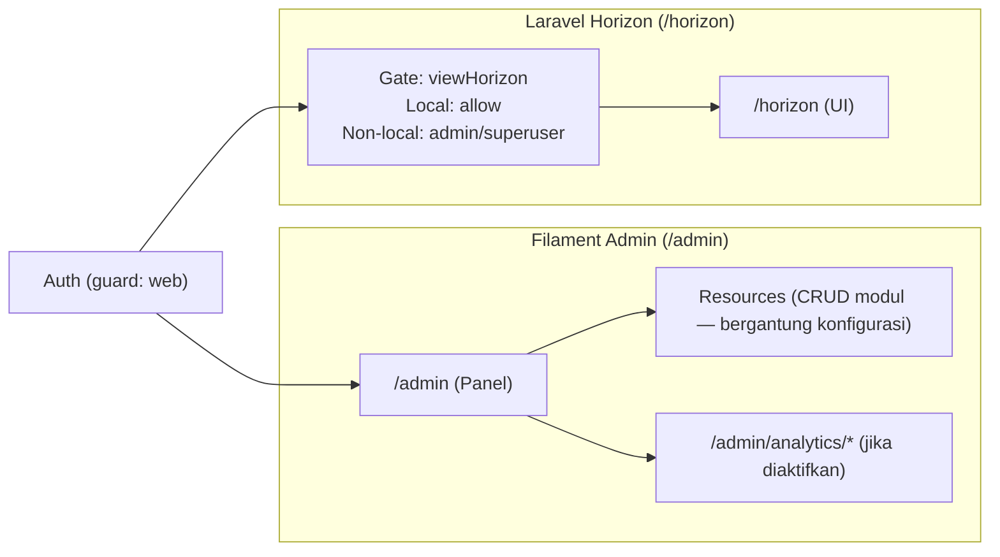
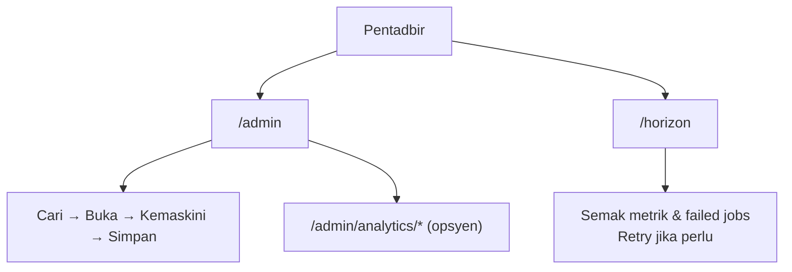

# D17 DOKUMEN MANUAL PENTADBIR SISTEM

**SISTEM ICTSERVE**

*Sistem Pengurusan Helpdesk dan Pinjaman Aset ICT*

| | |
| :--- | :--- |
| **NAMA AGENSI** | : Bahagian Pengurusan Maklumat (BPM) |
| **NAMA AGENSI INDUK** | : Kementerian Pelancongan, Seni dan Budaya Malaysia (MOTAC) |
| **TARIKH DOKUMEN** | : 29 Disember 2025 |
| **VERSI DOKUMEN** | : 3.6.1 |

---

## i. Keterangan Dokumen

Dokumen ini adalah **Manual Pentadbir Sistem ICTServe (v3.6.1)** yang menerangkan penggunaan modul pentadbiran dan pemantauan.

Dokumen ini disediakan berdasarkan bukti yang boleh disahkan daripada:

- Konfigurasi panel pentadbiran Filament: [app/Providers/Filament/AdminPanelProvider.php](app/Providers/Filament/AdminPanelProvider.php)
- Inventori modul pentadbiran (Resources): [app/Filament/Resources](app/Filament/Resources)
- Konfigurasi & kawalan akses Horizon: [config/horizon.php](config/horizon.php) dan [app/Providers/HorizonServiceProvider.php](app/Providers/HorizonServiceProvider.php)
- Rujukan versi berkaitan: [_reference/versions/v3.6.1_D17_QUEUE_MANAGEMENT_HORIZON.md](_reference/versions/v3.6.1_D17_QUEUE_MANAGEMENT_HORIZON.md)

Jika terdapat perkara yang tidak dapat disahkan melalui repositori (contohnya susun atur menu/paparan tepat dalam panel), ia ditandakan sebagai **TBD**.

## ii. Kawalan Dokumen

**KAWALAN DOKUMEN**

| No. Versi | Tarikh | Ringkasan Pindaan | Penyedia |
| :--- | :--- | :--- | :--- |
| 3.6.1 | 29 Disember 2025 | Penyelarasan manual pentadbir mengikut struktur D17 KRISA (i–v, Seksyen 1–5) dan bukti konfigurasi admin/monitoring | Pasukan Pembangunan BPM |

## iii. Kandungan

1. [PENGENALAN](#1-pengenalan)
2. [OVERVIEW SISTEM](#2-overview-sistem)
3. [KETERANGAN FUNGSI SISTEM](#3-keterangan-fungsi-sistem)
4. [ARAHAN PENGGUNAAN SISTEM](#4-arahan-penggunaan-sistem)
5. [PENGENDALIAN RALAT](#5-pengendalian-ralat)

## iv. Senarai Gambarajah

- Gambarajah 1: Peta Navigasi Pentadbir (Panel Admin & Monitoring)
- Gambarajah 2: Aliran Operasi Pentadbir (Ringkas)

## v. Senarai Jadual

- Jadual 1: Senarai Fungsi Sistem (Pentadbir)
- Jadual 2: Glosari (Terma & Akronim)

---

## 1. PENGENALAN

Manual Pentadbir menerangkan kaedah penggunaan modul pentadbiran ICTServe untuk tujuan kawalan operasi, pengurusan data, dan pemantauan sistem.

### 1.1. Tujuan dan Skop

Tujuan manual ini adalah untuk membantu pentadbir:

- Mengakses panel admin.
- Mengurus modul back-office (bergantung kepada menu/resources yang diaktifkan).
- Memantau queue jobs melalui Horizon.

Skop manual ini merangkumi:

- Akses panel admin Filament melalui `/admin`.
- Akses pemantauan queue melalui `/horizon`.

### 1.2. Organisasi Manual

- Seksyen 1: Pengenalan.
- Seksyen 2: Gambaran keseluruhan komponen pentadbiran.
- Seksyen 3: Senarai fungsi dan penerangan ringkas.
- Seksyen 4: Arahan langkah demi langkah.
- Seksyen 5: Pengendalian ralat.

### 1.3. Maklumat Untuk Dihubungi

Saluran hubungan yang tersedia dalam sistem:

- `/contact` (halaman hubungan)
- `/directory` (direktori kakitangan)

Rujuk: [routes/web.php](routes/web.php). Kandungan butiran (emel/telefon) adalah **TBD**.

### 1.4. Rujukan Projek

- [D04_DOKUMEN_SPESIFIKASI_REKABENTUK_SISTEM_SDS_ictserve_3.6.1.md](D04_DOKUMEN_SPESIFIKASI_REKABENTUK_SISTEM_SDS_ictserve_3.6.1.md)
- [D09_DOKUMENTASI_PANGKALAN_DATA_ictserve_3.6.1.md](D09_DOKUMENTASI_PANGKALAN_DATA_ictserve_3.6.1.md)
- [D10_DOKUMENTASI_KOD_SUMBER_ictserve_3.6.1.md](D10_DOKUMENTASI_KOD_SUMBER_ictserve_3.6.1.md)
- [_reference/versions/v3.6.1_D17_QUEUE_MANAGEMENT_HORIZON.md](_reference/versions/v3.6.1_D17_QUEUE_MANAGEMENT_HORIZON.md)

### 1.5. Fungsi Utama Sistem

- Panel Admin Filament: `/admin` (ditetapkan melalui `->path('admin')`).
- Laporan/eksport analitik (jika diaktifkan): `/admin/analytics/*`.
- Pemantauan queue Horizon: `/horizon` (default).

### 1.6. Glosari

#### Jadual 2: Glosari (Terma & Akronim)

| Terma/Akronim | Keterangan |
| :--- | :--- |
| Filament | Rangka kerja panel pentadbiran (admin panel) |
| Horizon | Antaramuka pemantauan queue Laravel |
| Gate | Kawalan akses berdasarkan peraturan authorization |
| RBAC | Role-Based Access Control |

## 2. OVERVIEW SISTEM

### 2.1. Tujuan

Komponen pentadbiran disediakan untuk:

- Pengurusan data dan operasi back-office.
- Pengurusan pengguna dan akses.
- Pemantauan proses latar (queue jobs) dan kegagalan.

### 2.2. Keterangan Sistem

Nota bukti:

- Panel admin: `->path('admin')` (rujuk: [app/Providers/Filament/AdminPanelProvider.php](app/Providers/Filament/AdminPanelProvider.php)).
- Horizon access: Gate `viewHorizon` (rujuk: [app/Providers/HorizonServiceProvider.php](app/Providers/HorizonServiceProvider.php)).

## 3. KETERANGAN FUNGSI SISTEM

### 3.1. Senarai Fungsi Sistem

#### Jadual 1: Senarai Fungsi Sistem (Pentadbir)

| Kod Fungsi | Nama Fungsi | Penerangan Ringkas | Laluan/URL Utama |
| :--- | :--- | :--- | :--- |
| A01 | Akses Panel Admin | Akses panel pentadbiran Filament | `/admin` |
| A02 | Urus Modul Admin | Pengurusan data melalui Resources (Helpdesk/Loan/Assets/Users/System/Reports, dsb.) | Dalam konteks `/admin` |
| A03 | Analitik/Eksport | Fungsi eksport analitik admin (jika digunakan) | `/admin/analytics/*` |
| A04 | Pemantauan Queue | Pantau dan urus queue jobs melalui Horizon | `/horizon` |

### 3.2. Perincian Keterangan bagi Fungsi Sistem

#### 3.2.1. A01 — Akses Panel Admin

a) Tujuan dan kegunaan fungsi: Membolehkan pentadbir mengurus sistem melalui panel admin.
b) Pengawalan fungsi: Memerlukan pengesahan (`auth`) menggunakan guard `web` (rujuk konfigurasi provider).
c) Pilihan pelaksanaan: Halaman login Filament digunakan (TBD: rupa skrin).
d) Input: Kredensial pengguna.
e) Output/hasil: Akses ke panel admin.
f) Hubungan: A02 dan A03.
g) Ringkasan operasi: Buka `/admin` → log masuk → pilih modul.

#### 3.2.2. A04 — Pemantauan Queue (Horizon)

a) Tujuan dan kegunaan fungsi: Memantau job queue, kegagalan dan prestasi pemprosesan.
b) Pengawalan fungsi: Gate `viewHorizon`:

- Local environment: dibenarkan.
- Bukan local: memerlukan pengguna log masuk dan peranan **admin atau superuser**.

(Rujuk: [app/Providers/HorizonServiceProvider.php](app/Providers/HorizonServiceProvider.php))

c) Pilihan pelaksanaan: Laluan Horizon adalah env-driven, default `horizon`.
d) Input: Tiada input khusus.
e) Output/hasil: Paparan metrik queue (TBD: paparan).
f) Hubungan: Berkait operasi queue.
g) Ringkasan operasi: Buka `/horizon` → semak dashboard/failed jobs.

## 4. ARAHAN PENGGUNAAN SISTEM

### 4.1. Log Masuk Sistem

#### A) Panel Admin

1. Buka `/admin`.
2. Jika belum log masuk, sistem memaparkan skrin log masuk (TBD: medan).
3. Masukkan kredensial dan sahkan.

#### B) Horizon

1. Buka `/horizon`.
2. Jika mendapat 403 (akses ditolak), pastikan role admin/superuser (untuk non-local) dan telah log masuk.

### 4.2. Proses Pengoperasian Sistem

Proses pentadbiran asas (umum):

- Pengurusan rekod melalui Resources: cari → buka rekod → kemas kini → simpan.
- Eksport/analitik (jika diaktifkan): akses URL `/admin/analytics/*`.
- Pemantauan queue: semak failed jobs, retry (TBD: prosedur tepat bergantung UI).

### 4.3. Penamatan dan Pengoperasi Semula Sistem

- Log keluar aplikasi menggunakan fungsi log keluar (laluan `POST /logout` tersedia - rujuk [routes/auth.php](routes/auth.php)).
- Jika sesi tamat (419), log masuk semula dan ulang operasi.

## 5. PENGENDALIAN RALAT

Ralat lazim:

- **403 Akses tidak dibenarkan**: Role tidak mencukupi (contoh: Horizon non-local).
- **404 Tidak dijumpai**: URL tidak tepat.
- **419 Sesi tamat/CSRF**: Log masuk semula.

Ralat validasi borang dalam panel admin adalah **TBD** kerana mesej UI terperinci tidak dapat disahkan hanya melalui konfigurasi.

### 5.1. Bantuan Helpdesk

- Rujuk `/contact` untuk bantuan.
- Gunakan `/helpdesk/create` untuk melapor isu melalui sistem (jika polisi organisasi membenarkan).
