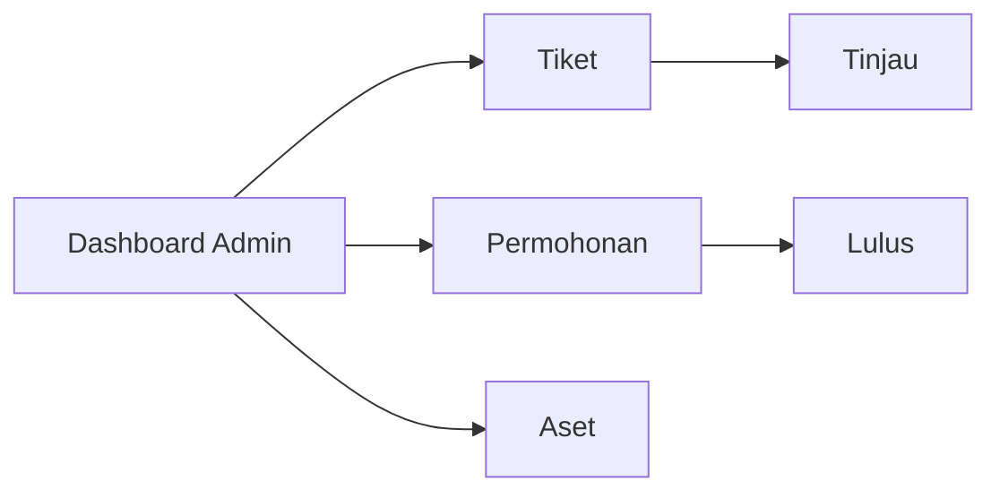
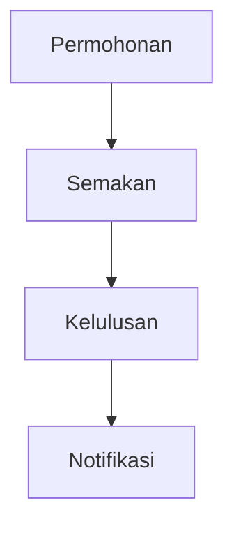

# D17 ADMIN MANUAL (PENTADBIR)

**ICTServe**

| | |
| :--- | :--- |
| **NAMA AGENSI** | MOTAC |
| **NAMA AGENSI INDUK** | BPM MOTAC |
| **TARIKH DOKUMEN** | 29 Disember 2025 |
| **VERSI DOKUMEN** | 3.6.1 |

---

## i. Keterangan Dokumen
Manual pentadbir berdasarkan panel Filament dan [_reference/versions/v3.6.1_D17_QUEUE_MANAGEMENT_HORIZON.md](_reference/versions/v3.6.1_D17_QUEUE_MANAGEMENT_HORIZON.md).

## ii. Semakan dan Pengesahan Dokumen

**SEMAKAN DOKUMEN**

| Disemak Oleh | Jawatan | Tandatangan | Tarikh Semakan |
| :--- | :--- | :--- | :--- |
| | | | |

**PENGESAHAN DOKUMEN**

| Disahkan Oleh | Jawatan | Tandatangan | Tarikh Semakan |
| :--- | :--- | :--- | :--- |
| | | | |

## iii. Kawalan Dokumen

| No. Versi | Tarikh | Ringkasan Pindaan | Penyedia |
| :--- | :--- | :--- | :--- |
| 3.6.1 | 29/12/2025 | Manual khusus pentadbir (Filament/Horizon) | Pasukan BPM |

## iv. Kandungan
Rujuk seksyen 1–7.

## v. Senarai Gambarajah
- Peta navigasi admin (LR)
- Aliran tugas kelulusan (TD)

## vi. Senarai Jadual
- Jadual peranan & keizinan

## vii. Definisi dan Akronim
| Akronim | Keterangan |
| :--- | :--- |
| RBAC | Role-Based Access Control |

---

## 1. PENDAHULUAN
- Peranan admin & superuser

## 2. AKSES PANEL FILAMENT

## 3. ALIRAN KELULUSAN

## 4. PENGURUSAN QUEUE (HORIZON)
- Memantau job, retry, gagal

## 5. LOG & AUDIT
- Activity Log & Auditing (dual system)

## 6. KEIZINAN

| Peranan | Keizinan |
| :--- | :--- |
| Admin | Tinjau, lulus |
| Superuser | Semua termasuk konfigurasi |

## 7. LAMPIRAN
- Tangkapan skrin panel
