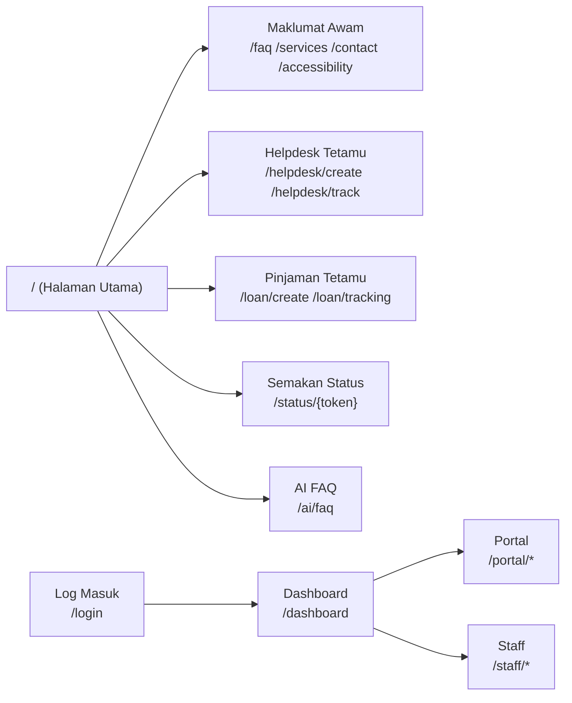
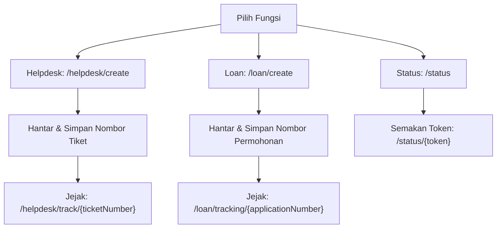

# D17 DOKUMEN MANUAL PENGGUNA SISTEM

**SISTEM ICTSERVE**

*Sistem Pengurusan Helpdesk dan Pinjaman Aset ICT*

| | |
| :--- | :--- |
| **NAMA AGENSI** | : Bahagian Pengurusan Maklumat (BPM) |
| **NAMA AGENSI INDUK** | : Kementerian Pelancongan, Seni dan Budaya Malaysia (MOTAC) |
| **TARIKH DOKUMEN** | : 29 Disember 2025 |
| **VERSI DOKUMEN** | : 3.6.1 |

---

## i. Keterangan Dokumen

Dokumen ini adalah **Manual Pengguna Sistem ICTServe (v3.6.1)** dan disediakan berpandukan struktur rasmi KRISA bagi **D17 Manual Pengguna Sistem**.

Kandungan manual ini dibina berdasarkan bukti yang boleh disahkan daripada:

- Fail rujukan versi: [_reference/versions/v3.6.1_ICTServe_System_Documentation.md](_reference/versions/v3.6.1_ICTServe_System_Documentation.md)
- Definisi laluan (routes) aplikasi web semasa: [routes/web.php](routes/web.php)
- Laluan autentikasi pengguna (log masuk / pendaftaran): [routes/auth.php](routes/auth.php)

Jika terdapat perkara yang tidak dapat disahkan melalui repositori (contohnya teks tepat pada skrin atau susun atur UI pada tarikh dokumen), ia ditandakan sebagai **TBD**.

## ii. Kawalan Dokumen

**KAWALAN DOKUMEN**

| No. Versi | Tarikh | Ringkasan Pindaan | Penyedia |
| :--- | :--- | :--- | :--- |
| 3.6.1 | 29 Disember 2025 | Penyelarasan manual mengikut templat rasmi KRISA dan bukti laluan (routes) ICTServe v3.6.1 | Pasukan Pembangunan BPM |

## iii. Kandungan

1. [PENGENALAN](#1-pengenalan)
2. [OVERVIEW SISTEM](#2-overview-sistem)
3. [KETERANGAN FUNGSI SISTEM](#3-keterangan-fungsi-sistem)
4. [ARAHAN PENGGUNAAN SISTEM](#4-arahan-penggunaan-sistem)
5. [PENGENDALIAN RALAT](#5-pengendalian-ralat)

## iv. Senarai Gambarajah

- Gambarajah 1: Peta Navigasi Pengguna (Capaian Utama)
- Gambarajah 2: Aliran Operasi (Tiket Helpdesk dan Pinjaman Aset)

## v. Senarai Jadual

- Jadual 1: Senarai Fungsi Sistem (Pengguna)
- Jadual 2: Glosari (Terma & Akronim)

---

## 1. PENGENALAN

Manual Pengguna mengandungi semua maklumat penting bagi pengguna untuk menggunakan sepenuhnya sistem maklumat. Manual ini termasuklah penerangan tentang fungsi sistem dan keupayaan, kontijensi dan mod alternatif operasi, dan prosedur langkah demi langkah untuk akses sistem dan kaedah penggunaannya.

### 1.1. Tujuan dan Skop

Tujuan dokumen ini adalah untuk menerangkan cara menggunakan ICTServe bagi kategori pengguna berikut:

- **Pengguna Awam / Tetamu (Guest)**: akses tanpa log masuk bagi fungsi tertentu.
- **Pengguna Berdaftar (Authenticated)**: akses selepas log masuk untuk fungsi portal/penjejakan yang memerlukan akaun.
- **Kakitangan (Staff)**: akses fungsi berkaitan tugas melalui modul staff/portal (memerlukan log masuk).

Skop manual ini meliputi penggunaan melalui pelayar web untuk laluan utama yang wujud dalam [routes/web.php](routes/web.php).

### 1.2. Organisasi Manual

Organisasi manual adalah seperti berikut:

- Seksyen 1: Pengenalan manual (tujuan, skop, rujukan).
- Seksyen 2: Gambaran keseluruhan sistem.
- Seksyen 3: Senarai fungsi dan perincian setiap fungsi.
- Seksyen 4: Arahan langkah demi langkah penggunaan.
- Seksyen 5: Pengendalian ralat dan bantuan helpdesk.

### 1.3. Maklumat Untuk Dihubungi

Saluran bantuan yang disediakan (berdasarkan laluan sistem):

- Halaman hubungan: `/contact` (rujuk: [routes/web.php](routes/web.php))
- Direktori kakitangan ICT (jika perlu hubungi BPM ICT): `/directory` (rujuk: [routes/web.php](routes/web.php))
- Saluran bantuan melalui sistem (buat tiket):
    - Borang tiket tetamu: `/helpdesk/create` atau `/helpdesk/submit`
    - Semakan tiket: `/helpdesk/track/{ticketNumber?}`

Maklumat nombor telefon/emel khusus hendaklah dirujuk pada halaman `/contact` (TBD: butiran kandungan halaman).

### 1.4. Rujukan Projek

Rujukan utama projek (dokumen serahan di peringkat sistem):

- [D01_DOKUMEN_PELAN_PEMBANGUNAN_SISTEM_PPS_ictserve_3.6.1.md](D01_DOKUMEN_PELAN_PEMBANGUNAN_SISTEM_PPS_ictserve_3.6.1.md)
- [D02_DOKUMEN_SPESIFIKASI_KEPERLUAN_BISNES_BRS_ictserve_3.6.1.md](D02_DOKUMEN_SPESIFIKASI_KEPERLUAN_BISNES_BRS_ictserve_3.6.1.md)
- [D04_DOKUMEN_SPESIFIKASI_REKABENTUK_SISTEM_SDS_ictserve_3.6.1.md](D04_DOKUMEN_SPESIFIKASI_REKABENTUK_SISTEM_SDS_ictserve_3.6.1.md)
- [D09_DOKUMENTASI_PANGKALAN_DATA_ictserve_3.6.1.md](D09_DOKUMENTASI_PANGKALAN_DATA_ictserve_3.6.1.md)
- [D10_DOKUMENTASI_KOD_SUMBER_ictserve_3.6.1.md](D10_DOKUMENTASI_KOD_SUMBER_ictserve_3.6.1.md)
- Rujukan versi: [_reference/versions/v3.6.1_ICTServe_System_Documentation.md](_reference/versions/v3.6.1_ICTServe_System_Documentation.md)

### 1.5. Fungsi Utama Sistem

Fungsi utama ICTServe (berdasarkan laluan aplikasi):

- **Helpdesk (Tiket Aduan/Permintaan)**
  - Hantar tiket (tetamu): `/helpdesk/create`, `/helpdesk/submit`
  - Jejak tiket: `/helpdesk/track/{ticketNumber?}`
- **Pinjaman Aset ICT (Tetamu & Berdaftar)**
  - Permohonan: `/loan/create` (wizard 3 langkah), `/loan/apply` (alias), `/loan/create-legacy` (legacy)
  - Penjejakan: `/loan/tracking/{applicationNumber?}`
- **Semakan Status Bersepadu (Token)**
  - Semakan status: `/status` atau `/status/{token}`
- **Portal Pengguna Berdaftar / Kakitangan**
  - Papan pemuka: `/dashboard` atau `/portal/dashboard`
  - Sejarah penghantaran: `/portal/submissions`
- **FAQ Bot (AI)**
  - Antaramuka FAQ: `/ai/faq`

### 1.6. Glosari

#### Jadual 2: Glosari (Terma & Akronim)

| Terma/Akronim | Keterangan |
| :--- | :--- |
| BPM | Bahagian Pengurusan Maklumat |
| MOTAC | Kementerian Pelancongan, Seni dan Budaya Malaysia |
| ICTServe | Sistem Pengurusan Helpdesk dan Pinjaman Aset ICT |
| Guest/Tetamu | Pengguna tanpa log masuk |
| Portal | Ruang modul yang memerlukan log masuk (contoh: `/portal/*`) |
| Staff | Pengguna dengan peranan kakitangan (middleware `staff`) |
| Token | Kod rujukan bagi semakan status (contoh laluan: `/status/{token}`) |

## 2. OVERVIEW SISTEM

Bahagian ini memberikan gambaran ringkas mengenai sistem dan keupayaannya.

### 2.1. Tujuan

ICTServe dibangunkan bagi menyediakan saluran digital untuk:

- Penghantaran dan penjejakan tiket helpdesk ICT.
- Permohonan dan penjejakan pinjaman aset ICT.
- Semakan status bersepadu menggunakan token.

### 2.2. Keterangan Sistem

Secara ringkas, ICTServe menyediakan capaian berdasarkan jenis pengguna dan mod akses seperti berikut.

Nota:

- Laluan log masuk pengguna berdaftar adalah `/login` dan pendaftaran `/register` (rujuk: [routes/auth.php](routes/auth.php)).
- Laluan staff memerlukan pengesahan akaun (`verified`) dan peranan staff (`staff`) (rujuk: [routes/web.php](routes/web.php)).

## 3. KETERANGAN FUNGSI SISTEM

Bahagian ini menerangkan tentang setiap fungsi yang ada di dalam sistem.

### 3.1. Senarai Fungsi Sistem

#### Jadual 1: Senarai Fungsi Sistem (Pengguna)

| Kod Fungsi | Nama Fungsi | Penerangan Ringkas | Laluan/URL Utama |
| :--- | :--- | :--- | :--- |
| F01 | Hantar Tiket Helpdesk (Tetamu) | Pengguna membuat aduan/perkhidmatan ICT tanpa log masuk | `/helpdesk/create`, `/helpdesk/submit` |
| F02 | Jejak Tiket Helpdesk | Pengguna menyemak status tiket berdasarkan nombor tiket | `/helpdesk/track/{ticketNumber?}` |
| F03 | Mohon Pinjaman Aset (Tetamu) | Permohonan pinjaman aset (wizard) | `/loan/create` |
| F04 | Jejak Permohonan Pinjaman | Semakan status permohonan berdasarkan nombor permohonan/token | `/loan/tracking/{applicationNumber?}` |
| F05 | Semakan Status Bersepadu | Semakan status tiket/loan melalui token | `/status`, `/status/{token}` |
| F06 | Portal Pengguna Berdaftar | Semakan sejarah penghantaran, profil, carian dan kelulusan (jika berkenaan) | `/portal/dashboard`, `/portal/submissions` |
| F07 | Staff - Pengurusan Tugasan | Modul staff (tiket, pinjaman, notifikasi) | `/staff/dashboard`, `/staff/tickets`, `/staff/loans` |
| F08 | AI FAQ Bot | Pertanyaan FAQ menggunakan antaramuka AI | `/ai/faq` |

### 3.2. Perincian Keterangan bagi Fungsi Sistem

#### 3.2.1. F01 — Hantar Tiket Helpdesk (Tetamu)

a) Tujuan dan kegunaan fungsi: Merekod aduan/permintaan ICT oleh pengguna.
b) Pengawalan fungsi: Terhad oleh kadar permintaan (middleware `guest.ratelimit`).
c) Pilihan pelaksanaan: Laluan alias disediakan (`/helpdesk/create`, `/helpdesk/submit`).
d) Input: Maklumat tiket (TBD: medan borang tepat).
e) Output/hasil: Nombor tiket dan paparan kejayaan `/helpdesk/success`.
f) Hubungan: Boleh dijejak melalui F02.
g) Ringkasan operasi: Buka borang → isi maklumat → hantar → simpan nombor tiket.

#### 3.2.2. F02 — Jejak Tiket Helpdesk

a) Tujuan dan kegunaan fungsi: Semak status tiket berdasarkan nombor tiket.
b) Pengawalan fungsi: Terhad oleh kadar permintaan (middleware `guest.ratelimit`).
c) Pilihan pelaksanaan: Nombor tiket boleh diberi dalam URL `/helpdesk/track/{ticketNumber?}`.
d) Input: Nombor tiket (parameter URL atau input pengguna).
e) Output/hasil: Paparan status tiket (TBD: status/medan tepat).
f) Hubungan: Berkait F01.
g) Ringkasan operasi: Masukkan nombor tiket → sistem papar keputusan.

#### 3.2.3. F03 — Mohon Pinjaman Aset (Tetamu)

a) Tujuan dan kegunaan fungsi: Membolehkan pengguna memohon pinjaman aset ICT.
b) Pengawalan fungsi: Terhad oleh kadar permintaan (middleware `guest.ratelimit`).
c) Pilihan pelaksanaan: Versi wizard baharu `/loan/create`; legacy `/loan/create-legacy`.
d) Input: Maklumat permohonan pinjaman (TBD: medan borang tepat).
e) Output/hasil: Paparan kejayaan (contoh: `/loan/success` untuk aliran tertentu).
f) Hubungan: Boleh dijejak melalui F04; semakan status bersepadu melalui F05.
g) Ringkasan operasi: Pilih aset/tujuan → isi maklumat → hantar permohonan.

#### 3.2.4. F04 — Jejak Permohonan Pinjaman

a) Tujuan dan kegunaan fungsi: Semak status permohonan pinjaman.
b) Pengawalan fungsi: Terhad oleh kadar permintaan (middleware `guest.ratelimit`).
c) Pilihan pelaksanaan: Nombor permohonan boleh diberi dalam URL `/loan/tracking/{applicationNumber?}`.
d) Input: Nombor permohonan/token (TBD: format).
e) Output/hasil: Paparan status permohonan (TBD: status/medan tepat).
f) Hubungan: Berkait F03.
g) Ringkasan operasi: Masukkan nombor permohonan → sistem papar keputusan.

#### 3.2.5. F05 — Semakan Status Bersepadu

a) Tujuan dan kegunaan fungsi: Semakan status tiket/loan menggunakan token.
b) Pengawalan fungsi: Terhad oleh kadar permintaan (middleware `guest.ratelimit`).
c) Pilihan pelaksanaan: Token pada URL `/status/{token}` atau input pada halaman `/status`.
d) Input: Token.
e) Output/hasil: Paparan status entiti berkaitan token (TBD).
f) Hubungan: Berkait F01–F04.
g) Ringkasan operasi: Masukkan token → sistem papar status.

## 4. ARAHAN PENGGUNAAN SISTEM

Bahagian ini menyediakan arahan terperinci langkah demi langkah bagi kaedah pengoperasian sistem.

### 4.1. Log Masuk Sistem

ICTServe mempunyai dua mod akses:

1) **Tanpa log masuk (Tetamu)**: Pengguna boleh terus menggunakan fungsi tertentu seperti penghantaran/penjejakan (contoh: `/helpdesk/*`, `/loan/*`, `/status/*`).
2) **Dengan log masuk (Pengguna berdaftar / Kakitangan)**:

- Log masuk: `/login`
- Pendaftaran (jika dibenarkan): `/register`
- Log masuk Google SSO (jika digunakan): `/auth/google`

Selepas log masuk, pengguna boleh mengakses laluan yang memerlukan `auth` seperti `/dashboard` dan `/portal/*`.

### 4.2. Proses Pengoperasian Sistem

#### A) Hantar tiket helpdesk (Tetamu)

1. Buka halaman `/helpdesk/create` atau `/helpdesk/submit`.
2. Isi maklumat yang diminta pada borang (TBD: senarai medan).
3. Hantar borang.
4. Simpan nombor tiket yang dipaparkan/diberikan untuk tujuan penjejakan.

#### B) Jejak tiket helpdesk

1. Buka halaman `/helpdesk/track`.
2. Masukkan nombor tiket, atau akses terus `/helpdesk/track/{ticketNumber}`.
3. Semak paparan status tiket.

#### C) Mohon pinjaman aset (Wizard)

1. Buka halaman `/loan/create`.
2. Lengkapkan langkah-langkah pada borang wizard (TBD: butiran langkah).
3. Hantar permohonan.
4. Simpan nombor permohonan/token untuk penjejakan.

#### D) Jejak permohonan pinjaman

1. Buka halaman `/loan/tracking`.
2. Masukkan nombor permohonan, atau akses terus `/loan/tracking/{applicationNumber}`.
3. Semak paparan status permohonan.

#### E) Semakan status bersepadu (Token)

1. Buka halaman `/status`.
2. Masukkan token, atau akses terus `/status/{token}`.
3. Sistem memaparkan status tiket/loan yang sepadan.

#### F) Rujukan FAQ (AI)

1. Buka halaman `/ai/faq`.
2. Taip pertanyaan berkaitan FAQ/perkhidmatan.
3. Semak jawapan yang dipaparkan.

### 4.3. Penamatan dan Pengoperasi Semula Sistem

Penamatan operasi pengguna adalah melalui tindakan biasa:

- **Log keluar**: gunakan fungsi log keluar pada antaramuka sistem (laluan log keluar adalah `POST /logout` - rujuk [routes/auth.php](routes/auth.php)).
- Jika sesi tamat (contoh: ralat 419), log masuk semula di `/login`.

## 5. PENGENDALIAN RALAT

Bahagian ini menyatakan mesej ralat dan kemudahan bantuan kepada pengguna sistem.

Senarai ralat lazim yang berkaitan dengan capaian web dan middleware semasa:

- **429 Terlalu banyak permintaan (Rate limit)**: Cuba semula selepas beberapa minit (berkait `guest.ratelimit`).
- **403 Akses tidak dibenarkan**: Akaun tiada peranan diperlukan (contoh: laluan staff memerlukan middleware `staff`).
- **404 Tidak dijumpai**: URL tidak tepat atau rekod tidak wujud.
- **419 Halaman tamat / CSRF**: Sesi tamat; segar semula halaman dan log masuk semula.

Untuk ralat yang bergantung pada logik borang/status (contoh: token tidak sah, nombor tiket tidak wujud), paparan mesej terperinci adalah **TBD** kerana teks UI tidak dinyatakan di laluan.

### 5.1. Bantuan Helpdesk

Jika pengguna tidak dapat menyelesaikan isu, gunakan saluran berikut:

- Hantar tiket helpdesk: `/helpdesk/create`
- Semak status tiket: `/helpdesk/track/{ticketNumber?}`
- Rujuk halaman hubungan: `/contact`
- Rujuk direktori kakitangan: `/directory`
