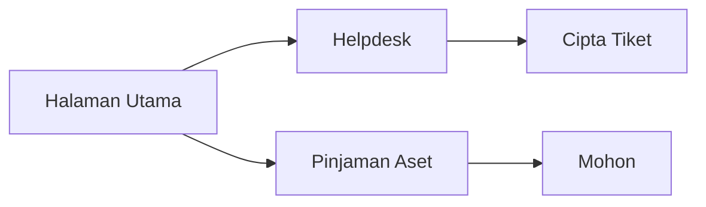
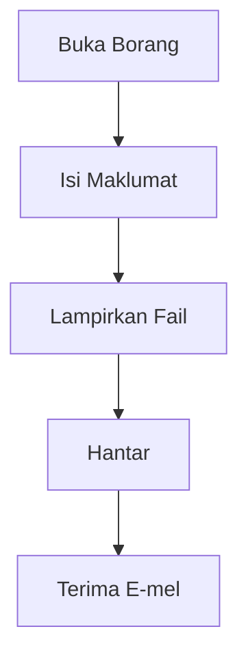

# D17 DOKUMEN MANUAL PENGGUNA SISTEM

**ICTServe**

| | |
| :--- | :--- |
| **NAMA AGENSI** | MOTAC |
| **NAMA AGENSI INDUK** | BPM MOTAC |
| **TARIKH DOKUMEN** | 29 Disember 2025 |
| **VERSI DOKUMEN** | 3.6.1 |

---

## i. Keterangan Dokumen
Manual pengguna berdasarkan [_reference/versions/v3.6.1_ICTServe_System_Documentation.md](_reference/versions/v3.6.1_ICTServe_System_Documentation.md) dan modul UI/UX (D12–D14).

## ii. Semakan dan Pengesahan Dokumen

**SEMAKAN DOKUMEN**

| Disemak Oleh | Jawatan | Tandatangan | Tarikh Semakan |
| :--- | :--- | :--- | :--- |
| | | | |

**PENGESAHAN DOKUMEN**

| Disahkan Oleh | Jawatan | Tandatangan | Tarikh Semakan |
| :--- | :--- | :--- | :--- |
| | | | |

## iii. Kawalan Dokumen

| No. Versi | Tarikh | Ringkasan Pindaan | Penyedia |
| :--- | :--- | :--- | :--- |
| 3.6.1 | 29/12/2025 | Struktur KRISA Manual Pengguna | Pasukan BPM |

## iv. Kandungan
Rujuk seksyen 1–7.

## v. Senarai Gambarajah
- Peta navigasi (LR)
- Aliran tugas (TD)

## vi. Senarai Jadual
- Jadual pintasan & tip aksesibiliti

## vii. Definisi dan Akronim
| Akronim | Keterangan |
| :--- | :--- |
| WCAG | Web Content Accessibility Guidelines |

## viii. Sumber Rujukan
- [docs/KRISA/OFFICIAL-TEMPLATE-AND-SAMPLES/D17_TEMPLATE_MANUAL_PENGGUNA_SISTEM.md](docs/KRISA/OFFICIAL-TEMPLATE-AND-SAMPLES/D17_TEMPLATE_MANUAL_PENGGUNA_SISTEM.md)

---

## 1. PENGENALAN
- Tujuan manual, sokongan Bahasa Melayu

## 2. AKSES SISTEM

## 3. PROSEDUR UTAMA

## 4. AKSESIBILITI
- Kontras tinggi, navigasi papan kekunci

## 5. SOALAN LAZIM (FAQ)
- Cara semak status tiket

## 6. SOKONGAN
- Hubungi pentadbir sistem

## 7. LAMPIRAN
- Tangkapan skrin
