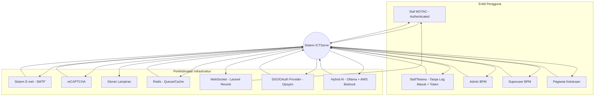
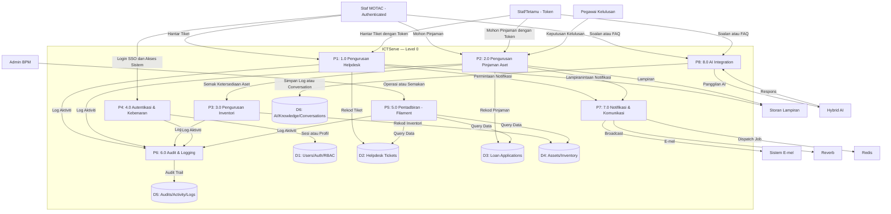
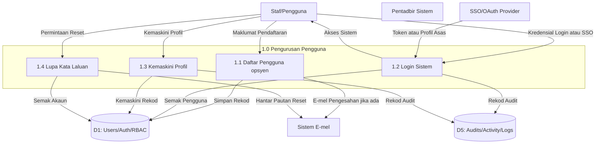
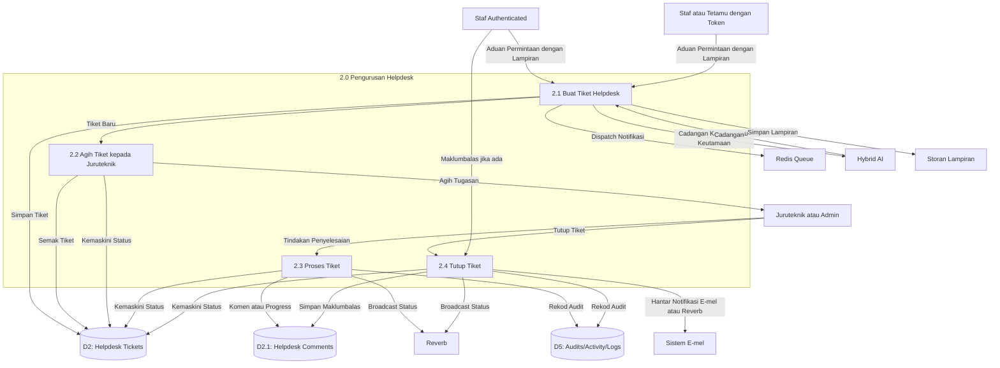
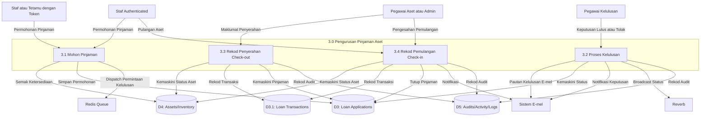
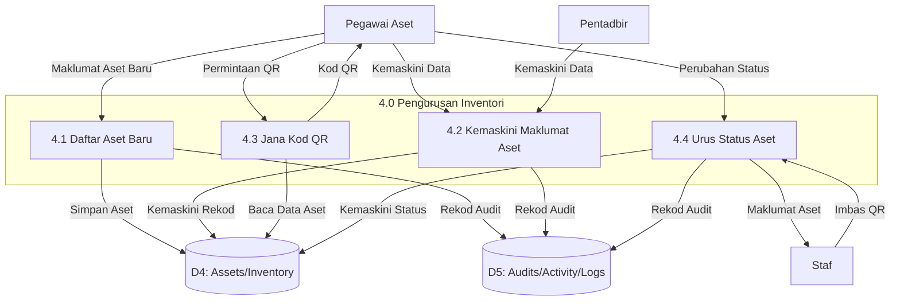
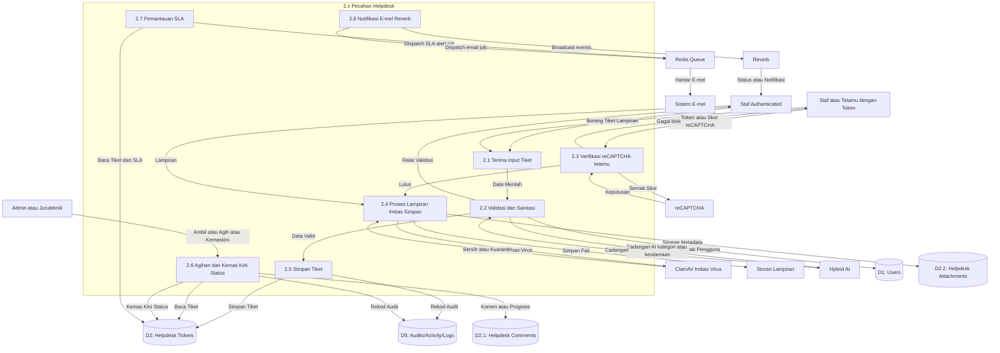
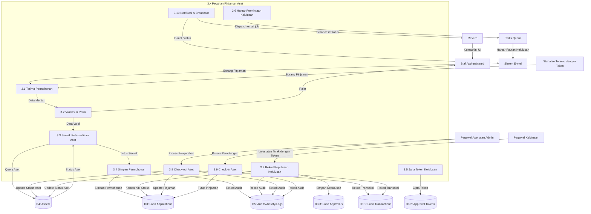
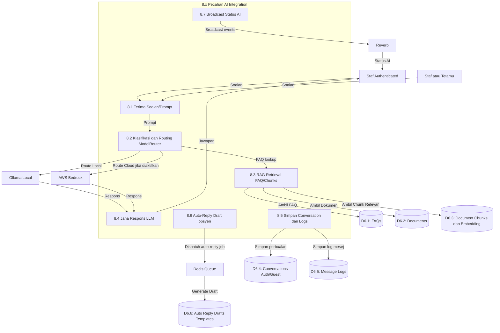

# Data Flow Diagram (DFD) ICTServe v3.6.1 (Bahasa Melayu)

Dokumen ini menghimpunkan rajah DFD berperingkat (Context → Level 0 → Level 1 → Level 2) bagi ICTServe v3.6.1.

## Nota Notasi (ringkas)
- **Entiti luaran**: kotak segi empat
- **Proses**: kotak berpenjuru bulat (diwakili sebagai node proses)
- **Data store**: `[(Dx: ...)]`
- **Aliran data**: anak panah berlabel

> Nota versi: Sesetengah dokumen ringkasan sistem mungkin menyebut pendekatan SSO-only untuk versi seterusnya. Rajah di bawah memodelkan **aliran v3.6.1** (termasuk saluran tetamu/token jika diaktifkan).

---

## DFD-ICT-0 — Rajah Konteks (Context Diagram)

---

## DFD-ICT-L0 — Level 0 (Decomposition)

---

## DFD-ICT-PP — Level 1: Pengurusan Pengguna

---

## DFD-ICT-HD — Level 1: Pengurusan Helpdesk

---

## DFD-ICT-AL — Level 1: Pengurusan Pinjaman Aset

---

## DFD-ICT-IM — Level 1: Pengurusan Inventori

---

## DFD-ICT-HD-2 — Level 2: Helpdesk (Tiket + Lampiran + SLA + Notifikasi)

---

## DFD-ICT-AL-2 — Level 2: Pinjaman Aset (Permohonan + Kelulusan + Check-out/in)

---

## DFD-ICT-AI-2 — Level 2: AI/RAG (Chat + Dokumen + Auto-reply)

