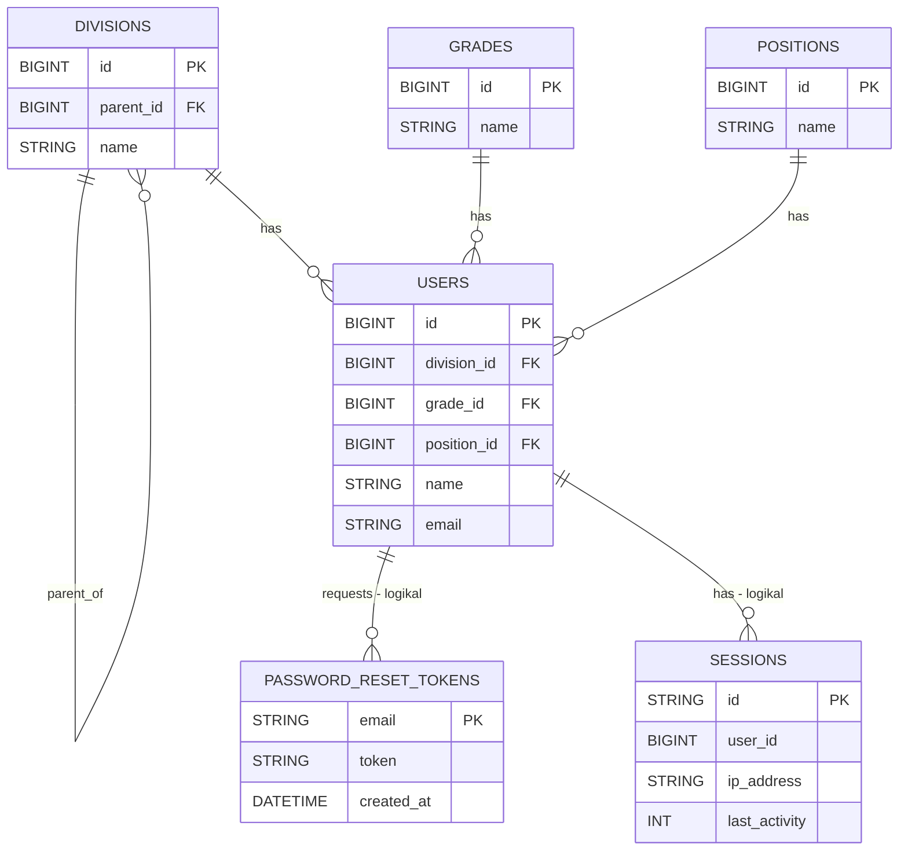
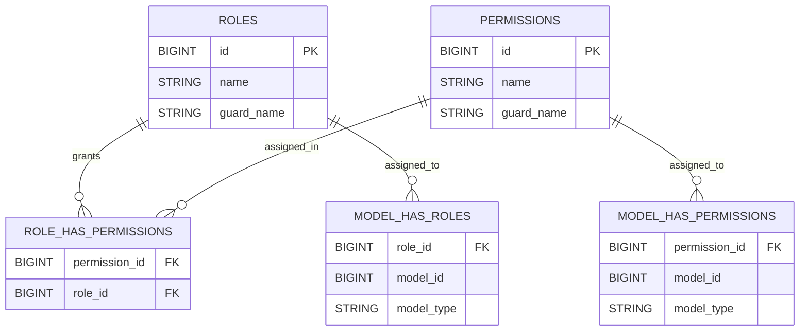
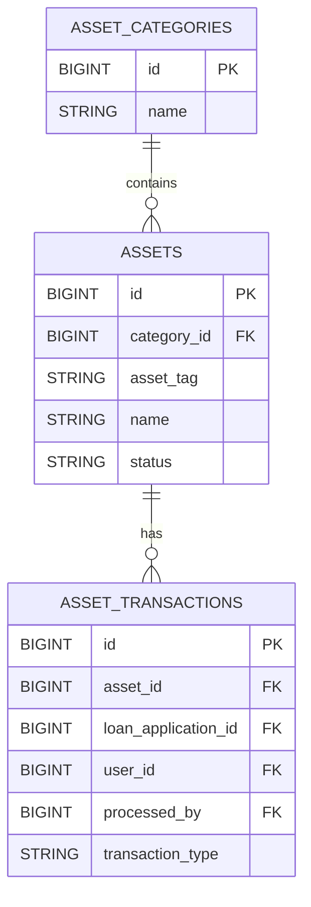
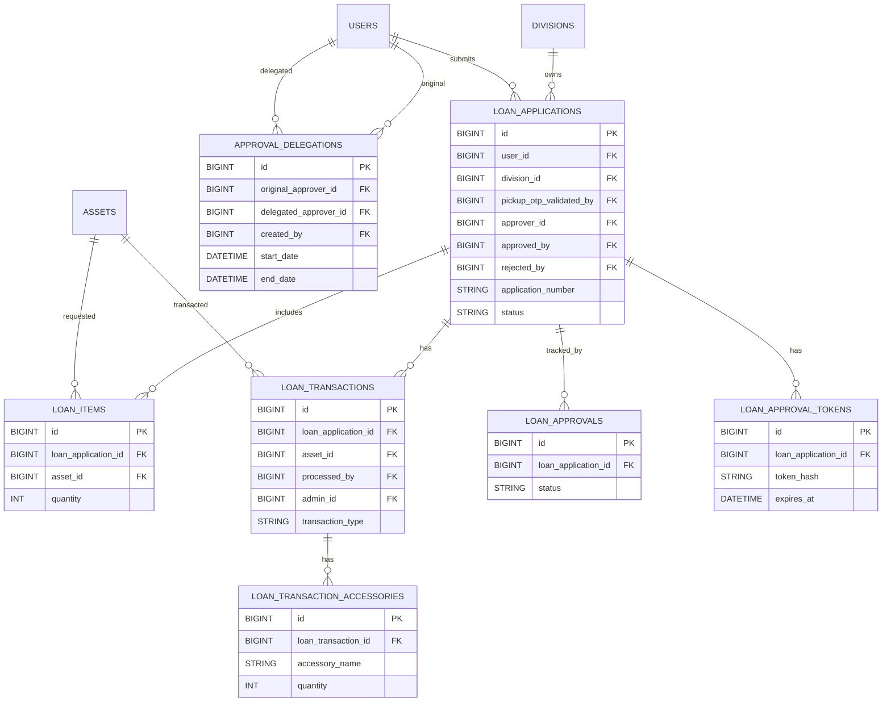
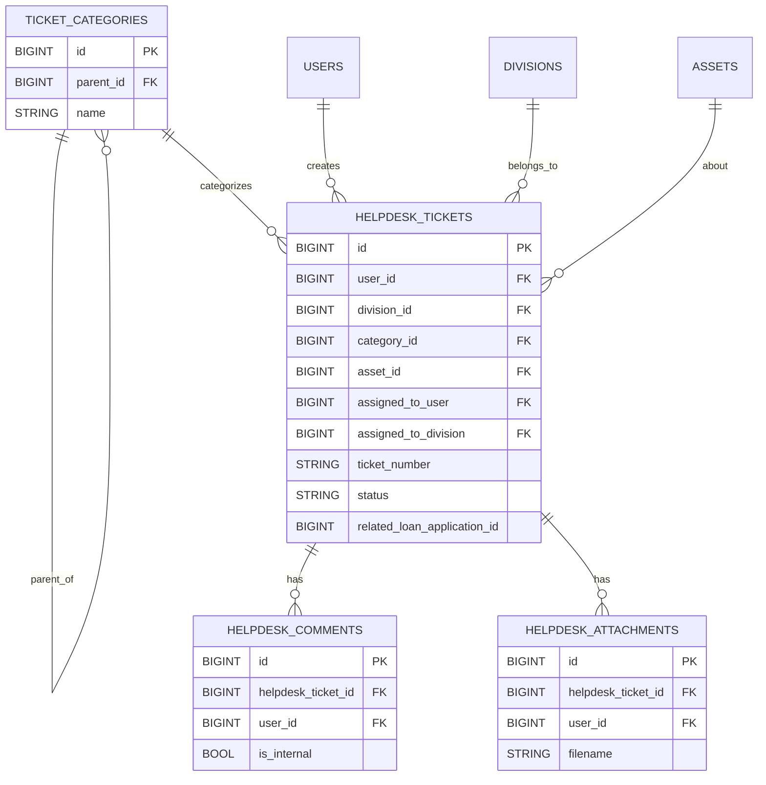
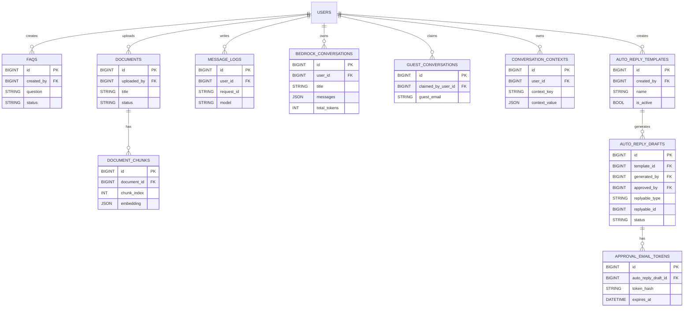

# ERD ICTServe v3.6.1 (Bahasa Melayu)

Dokumen ini mengandungi beberapa rajah ERD (Mermaid `erDiagram`) yang dipecahkan mengikut modul supaya mudah dibaca.

## Nota Penting (Konsistensi v3.6.1)

- **Migrations** ialah “source of truth” untuk nama jadual/kolum/FK.
- Beberapa hubungan adalah **polymorphic** (contoh `audits.auditable_*`, `activity_log.subject_*`, `notifications.notifiable_*`, `internal_comments.commentable_*`, `auto_reply_drafts.replyable_*`, `portal_activities.subject_*`). Ini biasanya **tiada FK DB**.
- D09 menyebut jadual `embeddings`, tetapi dalam skema sebenar embedding disimpan dalam `document_chunks.embedding` (JSON).
- `helpdesk_tickets.related_loan_application_id` wujud tetapi FK DB tidak ditemui; dianggap **relasi logikal**.

---

## 1) ERD Teras: Organisasi & Pengguna

---

## 2) ERD RBAC: Roles & Permissions (Spatie)

Nota: `MODEL_HAS_ROLES`/`MODEL_HAS_PERMISSIONS` adalah polymorphic - model_type, model_id. Lazimnya disasar kepada `USERS`, tetapi tidak terhad.

---

## 3) ERD Pengurusan Aset

---

## 4) ERD Pinjaman Aset

---

## 5) ERD Helpdesk

Nota: `HELPDESK_TICKETS.related_loan_application_id` ialah relasi logikal kepada `LOAN_APPLICATIONS.id` (FK tidak ditemui dalam migrations).

---

## 6) ERD AI / Pengetahuan / Auto-Reply

Nota: `DOCUMENT_CHUNKS.embedding` ialah kolum JSON; tiada jadual `embeddings` dalam migrations.

---

## 7) ERD Audit, Log, Portal & Sokongan

```mermaid
erDiagram
  AUDITS {
    BIGINT id PK
    BIGINT user_id
    STRING user_type
    STRING event
    STRING auditable_type
    BIGINT auditable_id
    DATETIME created_at
  }

  ACTIVITY_LOG {
    BIGINT id PK
    STRING log_name
    STRING description
    STRING subject_type
    BIGINT subject_id
    STRING causer_type
    BIGINT causer_id
    DATETIME created_at
  }

  NOTIFICATIONS {
    UUID id PK
    STRING type
    STRING notifiable_type
    BIGINT notifiable_id
    DATETIME created_at
  }

  EMAIL_LOGS {
    BIGINT id PK
    STRING recipient_email
    STRING status
    STRING notification_type
    STRING priority
    DATETIME queued_at
  }

  USER_CONSENTS {
    BIGINT id PK
    BIGINT user_id FK
    STRING consent_type
    BOOL granted
    DATETIME consented_at
  }

  USER_NOTIFICATION_PREFERENCES {
    BIGINT id PK
    BIGINT user_id FK
    STRING preference_key
    BOOL preference_value
  }

  BLOCKED_IPS {
    BIGINT id PK
    BIGINT blocked_by FK
    STRING ip_address
    STRING type
    DATETIME blocked_at
    DATETIME expires_at
  }

  EMAIL_TEMPLATES {
    BIGINT id PK
    STRING category
    STRING locale
    BOOL is_active
  }

  WORKFLOW_RULES {
    BIGINT id PK
    STRING module
    BOOL is_active
    INT priority
  }

  PORTAL_ACTIVITIES {
    BIGINT id PK
    BIGINT user_id FK
    STRING activity_type
    STRING subject_type
    BIGINT subject_id
    DATETIME created_at
  }

  SAVED_SEARCHES {
    BIGINT id PK
    BIGINT user_id FK
    STRING search_type
    JSON filters
  }

  INTERNAL_COMMENTS {
    BIGINT id PK
    BIGINT user_id FK
    BIGINT parent_id FK
    STRING commentable_type
    BIGINT commentable_id
    DATETIME created_at
  }

  SUPPORT_TICKETS {
    BIGINT id PK
    BIGINT user_id FK
    STRING status
    STRING priority
  }

  SUPPORT_TICKET_ATTACHMENTS {
    BIGINT id PK
    BIGINT support_ticket_id FK
    STRING filename
  }

  SUPPORT_TICKET_RESPONSES {
    BIGINT id PK
    BIGINT support_ticket_id FK
    BIGINT user_id FK
    BOOL is_staff_response
  }

  USERS ||--o{ AUDITS : "performs - polymorphic"
  USERS ||--o{ ACTIVITY_LOG : "causes - polymorphic"
  USERS ||--o{ NOTIFICATIONS : "receives - polymorphic"
  
  USERS ||--o{ USER_CONSENTS : "records"
  USERS ||--o{ USER_NOTIFICATION_PREFERENCES : "configures"
  USERS ||--o{ BLOCKED_IPS : "blocks"

  USERS ||--o{ PORTAL_ACTIVITIES : "creates"
  USERS ||--o{ SAVED_SEARCHES : "owns"

  USERS ||--o{ INTERNAL_COMMENTS : "writes"
  INTERNAL_COMMENTS ||--o{ INTERNAL_COMMENTS : "thread_parent"

  USERS ||--o{ SUPPORT_TICKETS : "submits"
  SUPPORT_TICKETS ||--o{ SUPPORT_TICKET_ATTACHMENTS : "has"
  SUPPORT_TICKETS ||--o{ SUPPORT_TICKET_RESPONSES : "has"
  USERS ||--o{ SUPPORT_TICKET_RESPONSES : "writes"
  
  EMAIL_TEMPLATES ||--o{ EMAIL_LOGS : "generates - logikal"
  WORKFLOW_RULES ||--o{ ACTIVITY_LOG : "triggers - logikal"
```

Nota polymorphic penting:

- `AUDITS.auditable_*` → Semua model (USERS, ASSETS, HELPDESK_TICKETS, LOAN_APPLICATIONS, dll)
- `ACTIVITY_LOG.subject_*`/`causer_*` → Semua model dengan aktiviti
- `NOTIFICATIONS.notifiable_*` → USERS (utama)
- `PORTAL_ACTIVITIES.subject_*` → HELPDESK_TICKETS, LOAN_APPLICATIONS, ASSETS
- `INTERNAL_COMMENTS.commentable_*` → HELPDESK_TICKETS, SUPPORT_TICKETS, LOAN_APPLICATIONS
