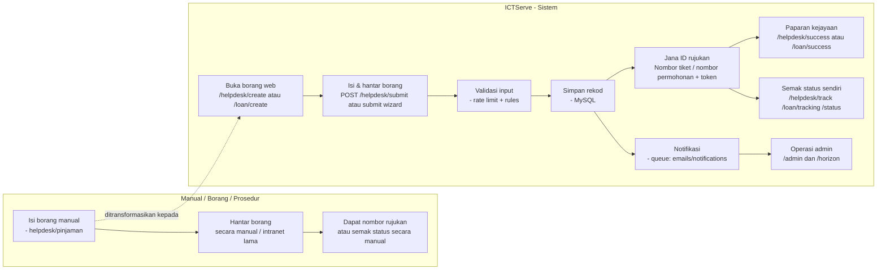
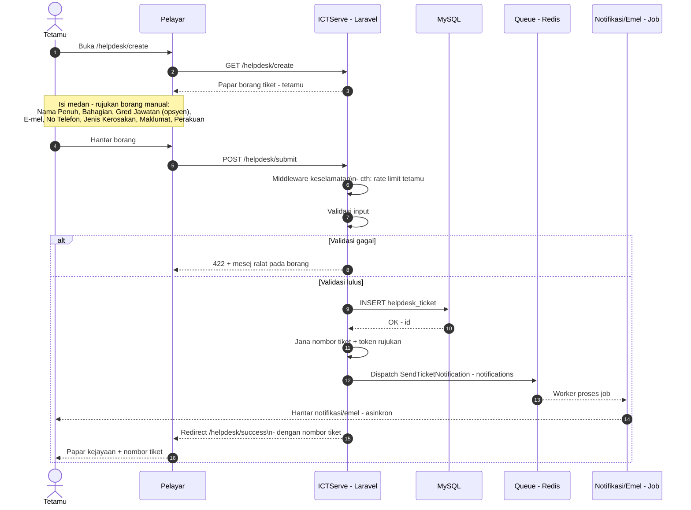
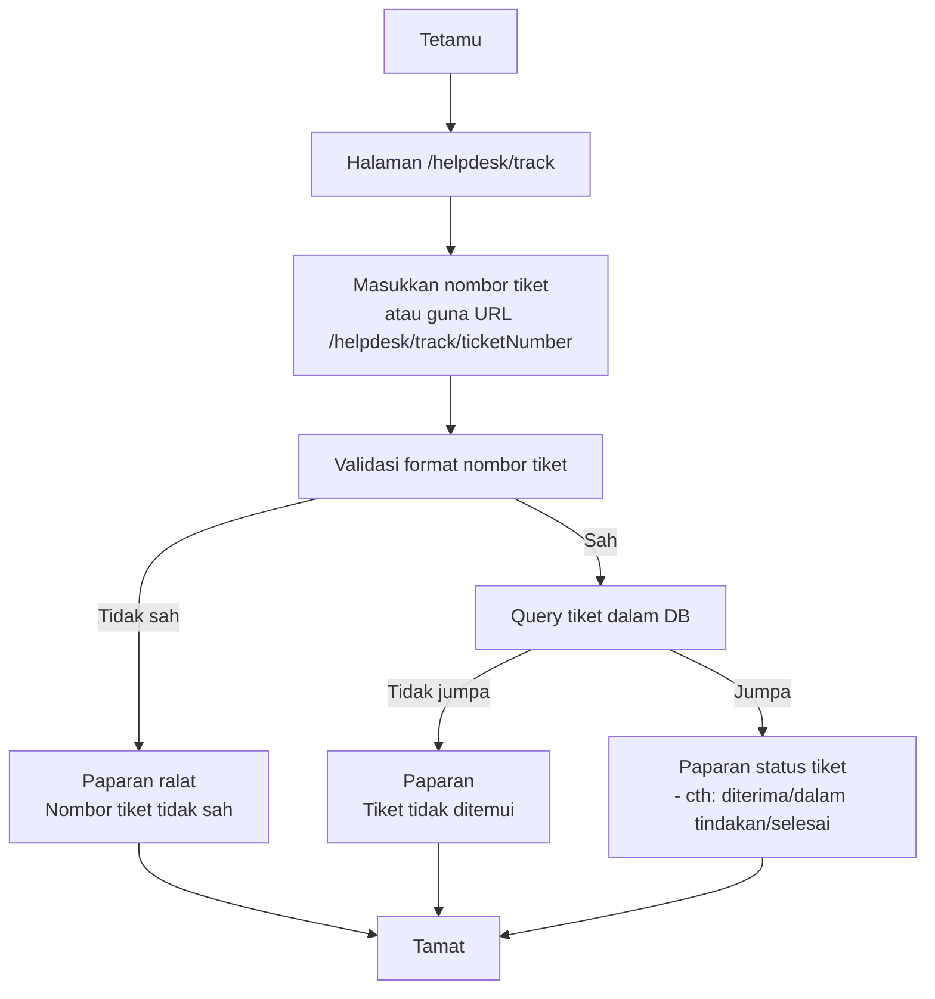
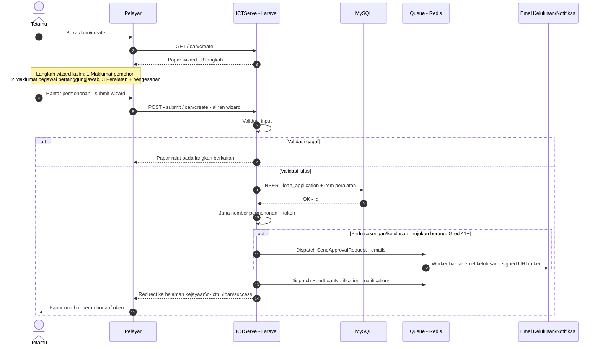
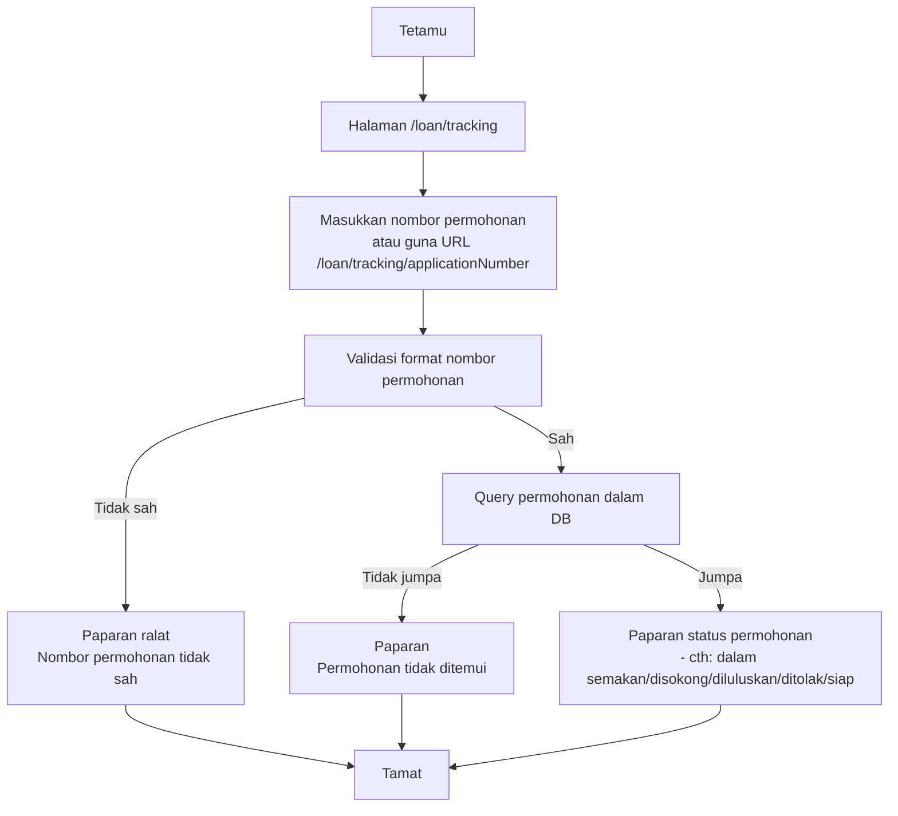
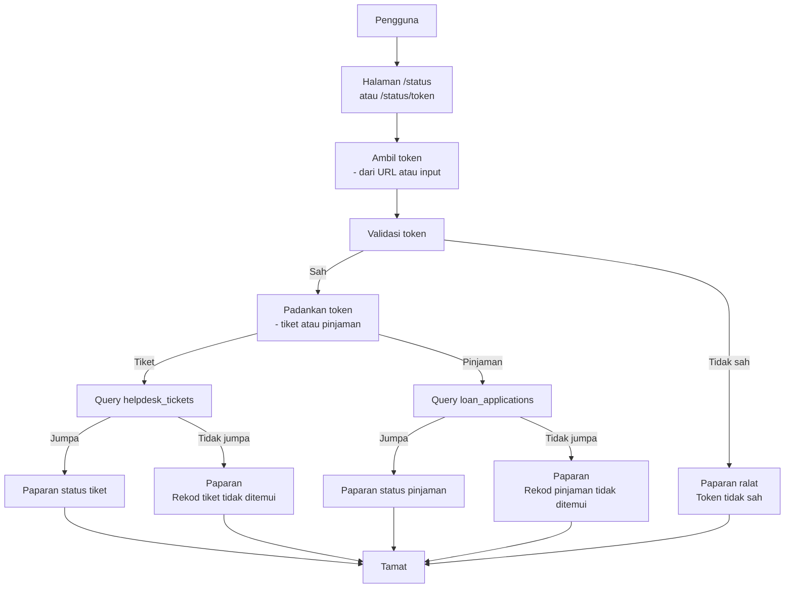
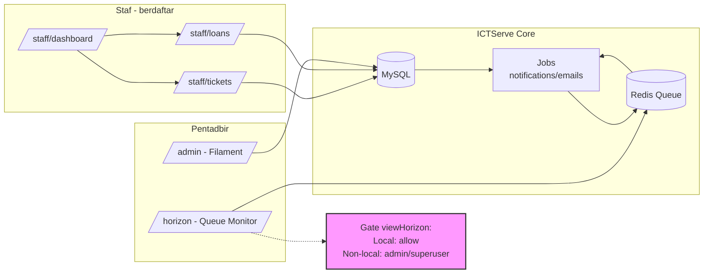

# Gambarajah Aliran “Manual → Sistem” (ICTServe v3.6.1)

Dokumen ini memaparkan set **Mermaid diagram** yang memetakan aliran **manual (borang/prosedur)** kepada **tindak balas sistem ICTServe**.

## Legend (Ringkas)

- **Tetamu**: pengguna tanpa log masuk (D17).
- **Staf/Pentadbir**: pengguna berdaftar / admin (D17).
- **Aplikasi ICTServe**: Laravel (UI + backend).
- **DB**: MySQL.
- **Queue**: Redis + Laravel Queue/Horizon (D17 queue doc).

---

## 1) Gambaran Keseluruhan: Manual → Sistem

---

## 2) Helpdesk (Tetamu): Cipta Tiket (Manual Borang → Sistem)
Rujukan laluan: D17 Manual Pengguna.
Rujukan medan borang manual: `_reference/ICT DAMAGE COMPLAINT FORM (ServiceDesk ICT) - DETAILED BREAKDOWN.txt`.

---

## 3) Helpdesk (Tetamu): Jejak Tiket
Rujukan laluan: D17 Manual Pengguna (`/helpdesk/track/{ticketNumber?}`).

---

## 4) Pinjaman Aset ICT (Tetamu): Permohonan Wizard (Manual Borang → Sistem)
Rujukan laluan: D17 Manual Pengguna (`/loan/create`, alias `/loan/apply`, legacy `/loan/create-legacy`).
Rujukan medan/peranan manual: `_reference/ICT EQUIPMENT LOAN APPLICATION FORM - DETAILED BREAKDOWN.txt`.

---

## 5) Pinjaman Aset ICT: Jejak Permohonan
Rujukan laluan: D17 Manual Pengguna (`/loan/tracking/{applicationNumber?}`).

---

## 6) Semakan Status Bersepadu (Token)
Rujukan laluan: D17 Manual Pengguna (`/status` atau `/status/{token}`).

---

## 7) Staf / Pentadbir / Operasi: Pengurusan & Pemantauan
Rujukan laluan:

- D17 Manual Pengguna (modul staf): `/staff/dashboard`, `/staff/tickets`, `/staff/loans`
- D17 Manual Pentadbir: `/admin` dan `/horizon` (gate `viewHorizon`)
- D17 Queue doc: job notifikasi & emel diproses melalui queue.

