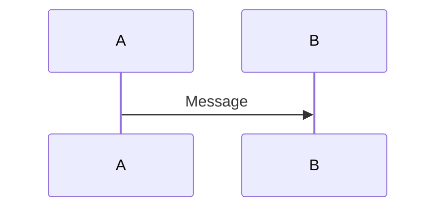

# Arahan Pembersihan Rajah Mermaid - ICTServe v3.6.1

**Tarikh**: 17 Disember 2025  
**Tujuan**: Panduan untuk membersihkan emoji dan ralat sintaks HTML dalam rajah Mermaid  
**Status**: ✅ SWIMLANE_DIAGRAMS.md telah selesai dibersihkan

---

## 📋 Ringkasan Status Fail

### ✅ Fail Telah Dibersihkan

| Fail | Status | Rajah Dibersihkan | Catatan |
|------|--------|-------------------|---------|
| `SWIMLANE_DIAGRAMS.md` | ✅ Selesai | Rajah 1, 2, 3 | Emoji dibuang, entiti HTML diperbaiki |

### 🔍 Fail Perlu Disemak

Fail-fail berikut mengandungi rajah Mermaid dan perlu disemak untuk emoji dan ralat sintaks:

#### Fail Utama (Root Directory)
1. `AI_CHATBOT_FLOW_DIAGRAMS.md` - Aliran chatbot AI
2. `DFD_DIAGRAMS.md` - Data Flow Diagrams
3. `ERD_DIAGRAMS.md` - Entity Relationship Diagrams
4. `MANUAL_TO_SYSTEM_FLOW_DIAGRAMS.md` - Aliran manual ke sistem
5. `SYSTEM_DEVELOPMENT_FLOW_DIAGRAMS.md` - Aliran pembangunan sistem
6. `WORKFLOW_DIAGRAMS.md` - Aliran kerja sistem

#### Fail Dokumentasi (docs/)
7. `docs/D18_AI_CHATBOT_OLLAMA_BEDROCK.md`
8. `docs/ICTServe_System_Documentation.md`

#### Fail KRISA (docs/KRISA/)
9. `docs/KRISA/D01_KRISA_ICTSERVE_PELAN_PEMBANGUNAN_SISTEM.md`
10. `docs/KRISA/D03_KRISA_ICTSERVE_SPESIFIKASI_KEPERLUAN_SISTEM.md`
11. `docs/KRISA/D04_KRISA_ICTSERVE_SPESIFIKASI_REKABENTUK_SISTEM.md`
12. `docs/KRISA/D05_KRISA_ICTSERVE_PELAN_MIGRASI_DATA.md`
13. `docs/KRISA/D06_KRISA_ICTSERVE_SPESIFIKASI_MIGRASI_DATA.md`
14. `docs/KRISA/D07_KRISA_ICTSERVE_PELAN_INTEGRASI_SISTEM.md`
15. `docs/KRISA/D08_KRISA_ICTSERVE_SPESIFIKASI_INTEGRASI_DATA.md`
16. `docs/KRISA/D09_KRISA_ICTSERVE_DOKUMENTASI_PANGKALAN_DATA.md`
17. `docs/KRISA/D10_KRISA_ICTSERVE_DOKUMENTASI_KOD_SUMBER.md`
18. `docs/KRISA/D15_KRISA_ICTSERVE_LAPORAN_MIGRASI_DATA.md`
19. `docs/KRISA/D17_KRISA_ICTSERVE_MANUAL_PENGGUNA_SISTEM.md`
20. `docs/KRISA/D17_KRISA_ICTSERVE_MANUAL_PENGGUNA_SISTEM_ADMIN.md`
21. `docs/KRISA/diagram/KRISA_MERMAID_DIAGRAM_INDEX.md`
22. `docs/KRISA/diagram/QUICK_SUITE_D03_MERMAID.md`

---

## 🎯 Isu Yang Perlu Diperbaiki

### 1. Emoji dalam Label Nod/Peserta

**Masalah**: Emoji menjadikan rajah tidak profesional untuk dokumentasi rasmi kerajaan.

**Emoji Lazim Yang Perlu Dibuang**:
- 🔓 (Tetamu/Awam)
- 📝 (Borang)
- 🔐 (Diautentikasi)
- 📊 (Papan Pemuka)
- ✅ (Pengesahan)
- 📧 (E-mel)
- ⚙️ (Perkhidmatan)
- 🎛️ (Panel)
- 🤖 (AI/Bot)
- 💬 (Mesej)
- 🔧 (Konfigurasi)
- 📦 (Pakej)
- ⚡ (Masa Nyata)
- 📋 (Log)
- 💾 (Pangkalan Data)
- ❌ (Ralat)
- ⟲ (Ulang)

**Contoh Sebelum**:
```mermaid
participant Guest as 🔓 Pengguna Tetamu
participant Form as 📝 Borang Livewire
```

**Contoh Selepas**:
```mermaid
participant Guest as Pengguna Tetamu
participant Form as Borang Livewire
```

### 2. Entiti HTML dalam Sintaks Mermaid

**Masalah**: Entiti HTML (`&quot;`, `&amp;`, `--&gt;`, `&lt;--&gt;`) menyebabkan ralat parse.

**Penggantian Diperlukan**:
- `&quot;` → `"`
- `&amp;` → `&`
- `--&gt;` → `-->`
- `&lt;--&gt;` → `<-->`

**Contoh Sebelum**:
```mermaid
A --&gt; B
C &lt;--&gt; D
label[&quot;Text&quot;]
```

**Contoh Selepas**:
```mermaid
A --> B
C <--> D
label["Text"]
```

### 3. Kurungan dalam Label

**Masalah**: Kurungan `()` dalam label menyebabkan ralat parse walaupun dalam petikan.

**Penyelesaian**: Buang atau ganti dengan tanda lain.

**Contoh Sebelum**:
```mermaid
AI["AI Service (Ollama/Bedrock)"]
```

**Contoh Selepas**:
```mermaid
AI["AI Service - Ollama/Bedrock"]
```

### 4. Arahan `style` dalam Rajah Sequence

**Masalah**: Kebanyakan renderer Mermaid tidak menyokong arahan `style` dalam rajah sequence.

**Penyelesaian**: Buang semua arahan `style`.

**Contoh Sebelum**:
```mermaid
sequenceDiagram
    participant A
    participant B
    A->>B: Message
    style A fill:#f9f,stroke:#333
```

**Contoh Selepas**:


---

## 🔧 Prosedur Pembersihan

### Langkah 1: Semak Fail

```bash
# Cari emoji dalam fail
findstr /N /C:"🔓" /C:"📝" /C:"🔐" /C:"📊" nama_fail.md

# Cari entiti HTML
findstr /N /C:"&quot;" /C:"&amp;" /C:"--&gt;" nama_fail.md
```

### Langkah 2: Buat Backup

```bash
copy nama_fail.md nama_fail.md.backup
```

### Langkah 3: Bersihkan Emoji

**Kaedah Manual**:
1. Buka fail dalam editor teks
2. Cari dan ganti setiap emoji dengan teks kosong atau teks deskriptif
3. Pastikan label masih bermakna selepas emoji dibuang

**Kaedah Automatik** (PowerShell):
```powershell
$content = Get-Content "nama_fail.md" -Raw
$content = $content -replace '🔓\s*', ''
$content = $content -replace '📝\s*', ''
$content = $content -replace '🔐\s*', ''
# ... tambah untuk emoji lain
Set-Content "nama_fail.md" -Value $content
```

### Langkah 4: Perbaiki Entiti HTML

```powershell
$content = Get-Content "nama_fail.md" -Raw
$content = $content -replace '&quot;', '"'
$content = $content -replace '&amp;', '&'
$content = $content -replace '--&gt;', '-->'
$content = $content -replace '&lt;--&gt;', '<-->'
Set-Content "nama_fail.md" -Value $content
```

### Langkah 5: Buang Kurungan Bermasalah

```powershell
# Cari label dengan kurungan
Select-String -Path "nama_fail.md" -Pattern '\[.*\(.*\).*\]'

# Ganti secara manual atau dengan regex
$content = $content -replace '\(([^)]+)\)', '- $1'
```

### Langkah 6: Buang Arahan Style

```powershell
$content = Get-Content "nama_fail.md" -Raw
$content = $content -replace '^\s*style\s+\w+\s+.*$', '' -split "`n" | Where-Object { $_ -ne '' } | Join-String -Separator "`n"
Set-Content "nama_fail.md" -Value $content
```

### Langkah 7: Sahkan Sintaks

1. Buka fail dalam editor yang menyokong Mermaid (VS Code + Mermaid extension)
2. Atau gunakan [Mermaid Live Editor](https://mermaid.live/)
3. Salin rajah dan pastikan tiada ralat parse

---

## 📝 Senarai Semak Pembersihan

Untuk setiap fail yang dibersihkan, tandakan:

- [ ] Backup fail asal dibuat
- [ ] Semua emoji dibuang dari label nod/peserta
- [ ] Semua entiti HTML diganti dengan aksara sebenar
- [ ] Kurungan dalam label dibuang/diganti
- [ ] Arahan `style` dibuang (jika rajah sequence)
- [ ] Sintaks Mermaid disahkan tanpa ralat
- [ ] Kandungan Bahasa Melayu kekal utuh
- [ ] Logik aliran teknikal tidak berubah
- [ ] Fail dikemaskini dalam Git

---

## 🎨 Garis Panduan Gaya Rajah Profesional

### Label Nod Yang Baik

**✅ Baik**:
```mermaid
participant Guest as Pengguna Tetamu
participant Form as Borang Livewire<br/>Pengesahan
participant API as API Backend<br/>Perkhidmatan Laravel
```

**❌ Elak**:
```mermaid
participant Guest as 🔓 Pengguna Tetamu
participant Form as 📝 Borang (Livewire)
participant API as ⚙️ API Backend
```

### Penggunaan Subgraph

**✅ Baik**:
```mermaid
subgraph Guest["Pengguna Tetamu Tanpa Log Masuk"]
    GuestForm["Akses Borang Awam"]
end
```

**❌ Elak**:
```mermaid
subgraph Guest["🔓 Pengguna Tetamu"]
    GuestForm["📝 Borang"]
end
```

### Label Baris Berbilang

Gunakan `<br/>` untuk label panjang:

```mermaid
participant API as API Backend<br/>Perkhidmatan Laravel<br/>Pengesahan & Sanitasi
```

---

## 🚀 Skrip Automatik Penuh

Simpan sebagai `clean-mermaid-diagrams.ps1`:

```powershell
param(
    [Parameter(Mandatory=$true)]
    [string]$FilePath
)

# Backup
$backupPath = "$FilePath.backup"
Copy-Item $FilePath $backupPath -Force
Write-Host "Backup dibuat: $backupPath" -ForegroundColor Green

# Baca kandungan
$content = Get-Content $FilePath -Raw -Encoding UTF8

# Buang emoji
$emojis = @('🔓', '📝', '🔐', '📊', '✅', '📧', '⚙️', '🎛️', '🤖', '💬', '🔧', '📦', '⚡', '📋', '💾', '❌', '⟲')
foreach ($emoji in $emojis) {
    $content = $content -replace [regex]::Escape($emoji) + '\s*', ''
}

# Perbaiki entiti HTML
$content = $content -replace '&quot;', '"'
$content = $content -replace '&amp;', '&'
$content = $content -replace '--&gt;', '-->'
$content = $content -replace '&lt;--&gt;', '<-->'

# Simpan
Set-Content $FilePath -Value $content -Encoding UTF8
Write-Host "Fail dibersihkan: $FilePath" -ForegroundColor Green
Write-Host "Sila sahkan sintaks Mermaid secara manual" -ForegroundColor Yellow
```

**Penggunaan**:
```powershell
.\clean-mermaid-diagrams.ps1 -FilePath "AI_CHATBOT_FLOW_DIAGRAMS.md"
```

---

## 📊 Keutamaan Pembersihan

### Keutamaan Tinggi (Dokumentasi Rasmi)
1. `SWIMLANE_DIAGRAMS.md` ✅ **SELESAI**
2. `WORKFLOW_DIAGRAMS.md`
3. `AI_CHATBOT_FLOW_DIAGRAMS.md`
4. `DFD_DIAGRAMS.md`
5. `ERD_DIAGRAMS.md`

### Keutamaan Sederhana (Dokumentasi KRISA)
6. `docs/KRISA/D03_KRISA_ICTSERVE_SPESIFIKASI_KEPERLUAN_SISTEM.md`
7. `docs/KRISA/D04_KRISA_ICTSERVE_SPESIFIKASI_REKABENTUK_SISTEM.md`
8. `docs/KRISA/diagram/KRISA_MERMAID_DIAGRAM_INDEX.md`

### Keutamaan Rendah (Rujukan & Arkib)
9. Fail dalam `_reference/versions/`
10. Fail dalam `.kiro/specs/`

---

## ✅ Pengesahan Akhir

Selepas pembersihan, pastikan:

1. **Sintaks Sah**: Tiada ralat parse dalam Mermaid Live Editor
2. **Kandungan Utuh**: Semua teks Bahasa Melayu dan logik aliran kekal
3. **Profesional**: Tiada emoji, label bersih dan jelas
4. **Konsisten**: Gaya label seragam merentasi semua rajah
5. **Dokumentasi**: Kemaskini fail ini dengan status terkini

---

## 📞 Sokongan

Jika menghadapi masalah:
1. Rujuk [Dokumentasi Mermaid](https://mermaid.js.org/)
2. Gunakan [Mermaid Live Editor](https://mermaid.live/) untuk debug
3. Semak backup fail sebelum membuat perubahan besar

---

**Tarikh Kemaskini Terakhir**: 17 Disember 2025  
**Versi Dokumen**: 1.0  
**Status**: Aktif
