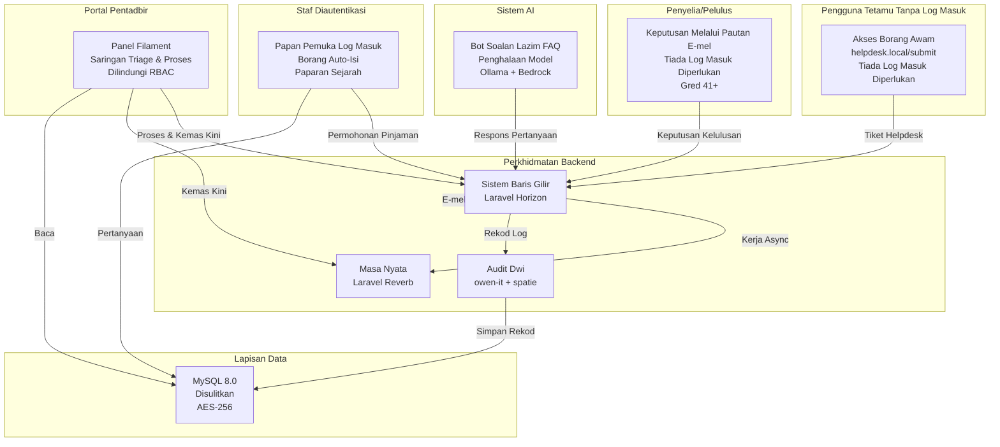
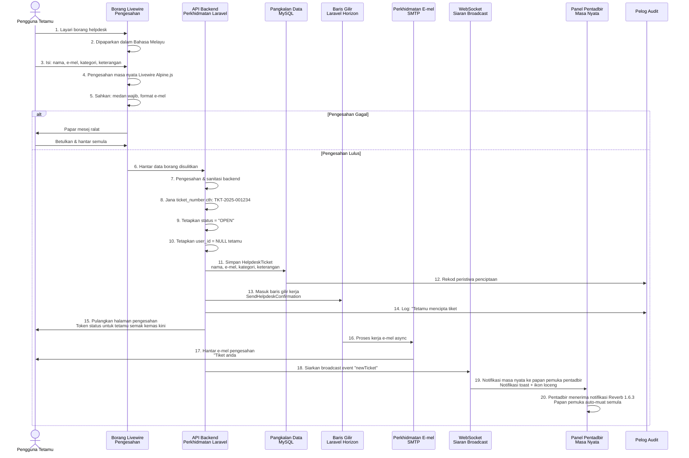
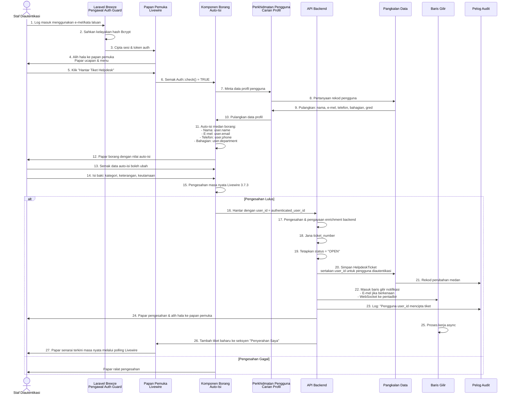
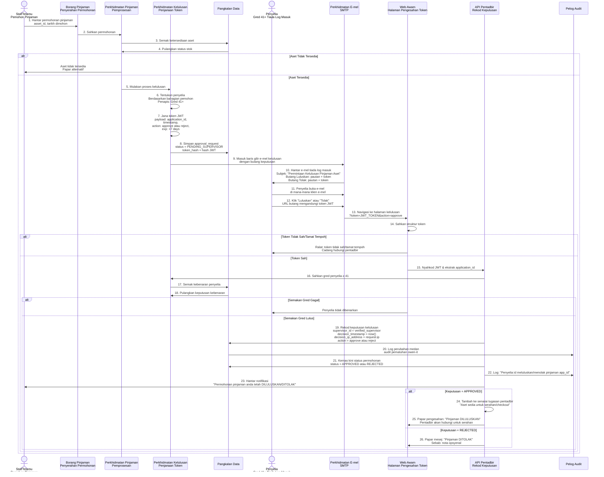
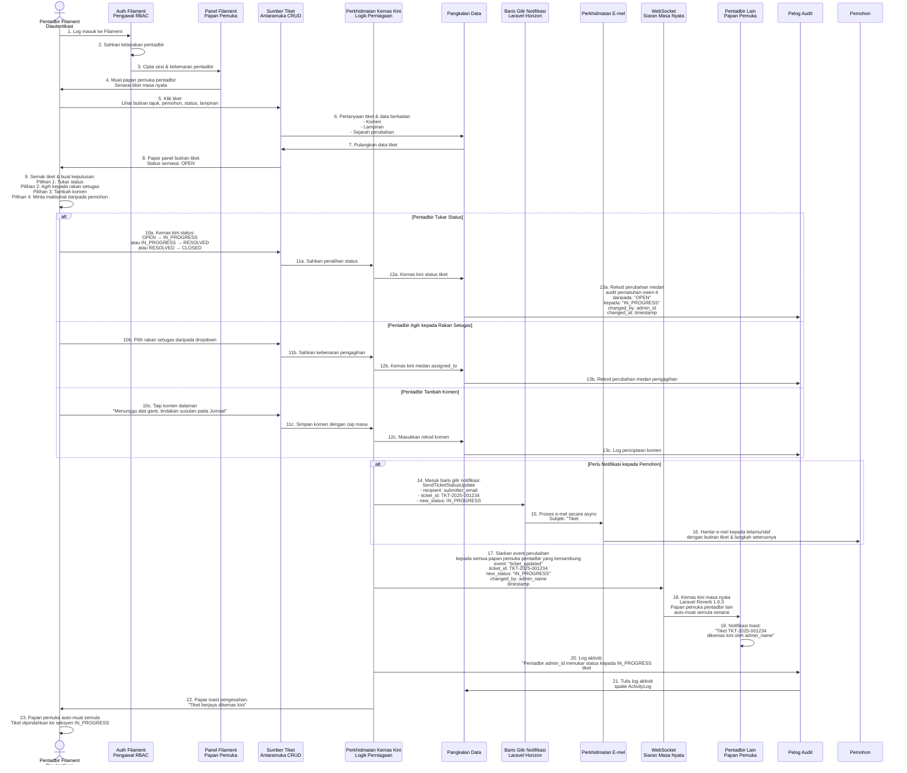
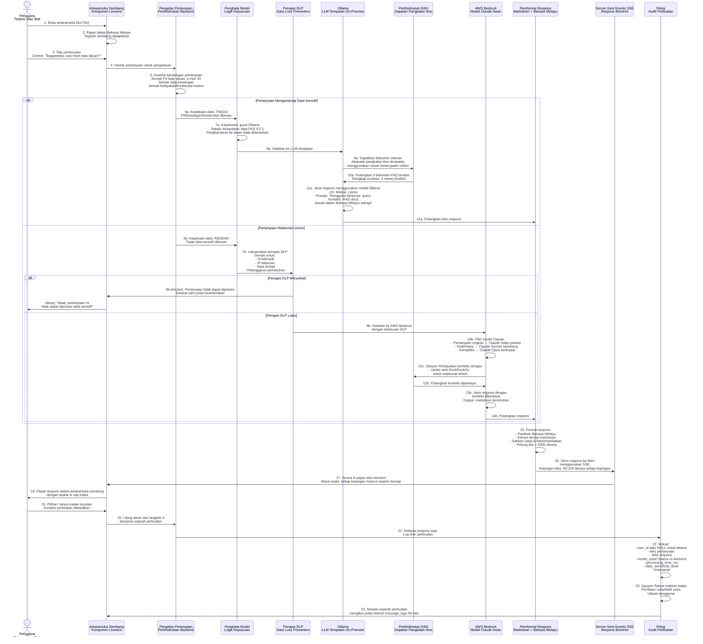
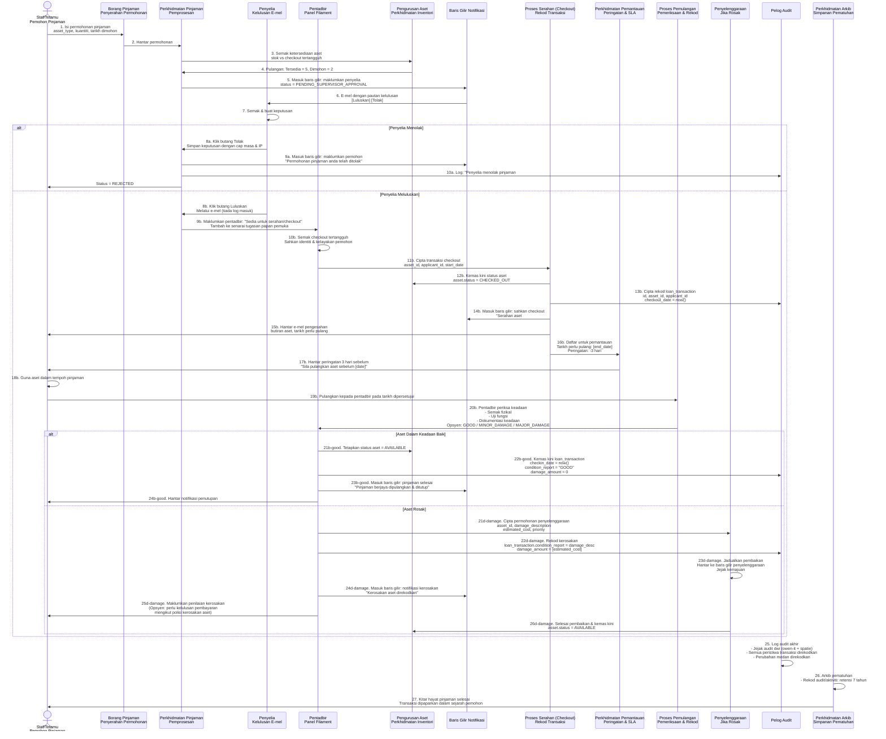
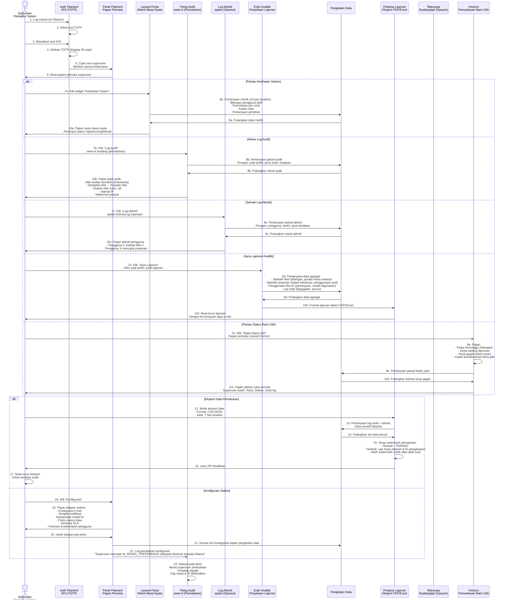

# ICTServe v3.6.1 - Rajah Swimlane

**Sistem**: ICTServe (Dalaman Sahaja) - Pengurusan Helpdesk & Pinjaman Aset  
**Versi**: 3.6.1 (Disember 2025)  
**Skop**: Aliran proses menyeluruh dari permohonan hingga penyelesaian/audit  
**Format**: Rajah Swimlane Mermaid

---

## Rajah 1: Gambaran Keseluruhan Sistem (Tahap Tinggi)

---

## Rajah 2: Penyerahan Tiket Helpdesk oleh Tetamu

---

## Rajah 3: Staf Diautentikasi dengan Borang Auto-Isi

---

## Rajah 4: Kelulusan Pinjaman melalui E-mel (Tiada Log Masuk Diperlukan)

---

## Rajah 5: Saringan (Triage) & Pemprosesan Tiket oleh Pentadbir

---

## Rajah 6: AI Hibrid Awan - Bot FAQ dengan Penghalaan Model

---

## Rajah 7: Kitar Hayat Lengkap Pinjaman Aset

---

## Rajah 8: Pemantauan & Akses Audit oleh Superuser

---

## Legenda & Panduan Notasi

### Pelaku/Swimlane

- 🔓 **Pengguna Tetamu**: Akses awam tanpa log masuk (rate-limited)
- 🔐 **Staf (Diautentikasi)**: Log masuk melalui Laravel Breeze (e-mel/nama pengguna + kata laluan)
- ✅ **Penyelia/Pelulus**: Gred 41+, keputusan melalui e-mel (tiada log masuk)
- ⚙️ **Pentadbir**: Akses panel Filament (dilindungi RBAC)
- 👨‍💼 **Superuser**: Akses penuh sistem dengan 2FA (TOTP)
- 🤖 **Sistem AI**: Penghalaan pintar & penjanaan respons
- 🔧 **Perkhidmatan Backend**: Baris gilir, WebSocket, notifikasi, audit

### Petunjuk Aliran Data

- **→** = Operasi segerak (jawapan segera)
- **⟹** = Operasi tak segerak (kerja baris gilir, webhook)
- **◉** = Siaran masa nyata (WebSocket, Laravel Reverb 1.6.3)
- **[database]** = Operasi baca/tulis pangkalan data

### Titik Keputusan

- **Berlian (◇)** = Titik keputusan/cabang
- **YA** = Aliran diteruskan (berjaya/diluluskan)
- **TIDAK** / **❌** = Aliran beralih ke ralat/alternatif

### Petunjuk Status

- ✓ / **✅** = Berjaya, operasi selesai
- ❌ / **✗** = Gagal, operasi ditolak
- ⏳ = Tertangguh, menunggu keputusan
- ⟲ = Mekanisme cuba semula

### Rujukan Teknologi

- **Laravel Breeze** = Rangka kerja autentikasi
- **Livewire 3.7.3** = Komponen reaktif & kemas kini masa nyata
- **Alpine.js 3** = Interaktiviti ringan
- **Filament 4.3.1** = Panel pentadbir (CRUD, RBAC, Server-Driven UI)
- **Laravel Reverb 1.6.3** = Pelayan WebSocket untuk komunikasi masa nyata
- **Laravel Horizon 5.41.0** = Papan pemuka pemantauan baris gilir
- **Laravel Pulse 1.4.7** = Metrik sistem masa nyata
- **Laravel Telescope 5.16.0** = Alat nyahpepijat (superuser sahaja)
- **Ollama** = LLM tempatan (on-premise, kedaulatan data)
- **AWS Bedrock** = Model AI awan (Claude Opus/Sonnet/Haiku)

### Keselamatan & Pematuhan

- **🔒** = Perlu autentikasi
- **🛡️** = Penapis keselamatan/DLP digunakan
- **📋** = Log audit (sistem dwi: owen-it + spatie)
- **TLS 1.3** = Penyulitan HTTPS dalam transit
- **AES-256** = Penyulitan pangkalan data semasa rehat
- **JWT** = Autentikasi berasaskan token
- **TOTP** = Kata laluan sekali guna berasaskan masa (2FA)

### Tahap Kepekaan Data

- **RENDAH** = Maklumat umum (boleh hala ke Bedrock)
- **SEDERHANA** = Data operasi dalaman (perlu semakan DLP)
- **TINGGI** = PII/kewangan/kredensial (mesti guna Ollama; tiada awan)

### Rujukan Masa

- **Segera** = Segerak, operasi menghalang (blocking)
- **Async** = Baris gilir, tidak menghalang (melalui Laravel Horizon)
- **Berjadual** = Cron job (pemantauan, peringatan, pengarkiban)
- **Berstrim** = SSE (pecahan respons masa nyata)

### Nota Bahasa

- **Bahasa Melayu** = Bahasa antaramuka utama (v3.6.0+), termasuk respons AI (v3.6.1)
- **Fail `lang/en/`** = Dikekalkan untuk rujukan teknikal; penukar bahasa dilumpuhkan

---

## Indeks Rujukan Silang

| Rajah | Dokumen v3.6.1 | Seksyen | Keperluan Utama |
|------|----------------|---------|----------------|
| Rajah 1 (Gambaran Keseluruhan) | D00, D03 | §1, §2 | Seni bina sistem, modul, peranan |
| Rajah 2 (Helpdesk Tetamu) | D03, D04, D09 | §5.1, §4.1 | Akses hibrid, borang Livewire, penciptaan tiket |
| Rajah 3 (Helpdesk Staf) | D03, D04, D12 | §5.1, §4.1, §3.1 | Auto-isi, autentikasi, papan pemuka |
| Rajah 4 (Kelulusan Pinjaman) | D03, D04, D09 | §5.2, §4.2, §4.3 | Kelulusan melalui e-mel, token JWT, pengesahan token |
| Rajah 5 (Triage Pentadbir) | D03, D04, D11 | §5.3, §5, §6 | RBAC, panel Filament, kemas kini masa nyata, log audit |
| Rajah 6 (Bot FAQ AI) | D03, D04, D18 | §5.9, §8, §5 | Penghalaan model, pengelasan data, Ollama vs Bedrock, RAG |
| Rajah 7 (Kitar Hayat Pinjaman) | D03, D04, D09 | §5.2, §4.2, §4.3 | Aliran penuh, kelulusan, checkout, pemulangan, penyelenggaraan |
| Rajah 8 (Superuser) | D03, D04, D11 | §5.3, §5, §6 | Pemantauan, akses audit, analitik, pematuhan |

---

## Maklumat Dokumen

**Sistem**: ICTServe v3.6.1 (Dalaman Sahaja) - Helpdesk & Pinjaman Aset  
**Tarikh**: 29 Disember 2025  
**Format**: Rajah Swimlane Mermaid (serasi dengan GitHub Markdown)  
**Bahasa**: Bahasa Melayu (v3.6.0+; termasuk AI Chatbot v3.6.1)  
**Aksesibiliti**: Patuh WCAG 2.2 Tahap AA  
**Skop**: Dokumentasi proses menyeluruh daripada permohonan hingga audit/arkib  
**Status**: ✅ Sedia Produksi

---

**Tamat Dokumen Rajah Swimlane**
