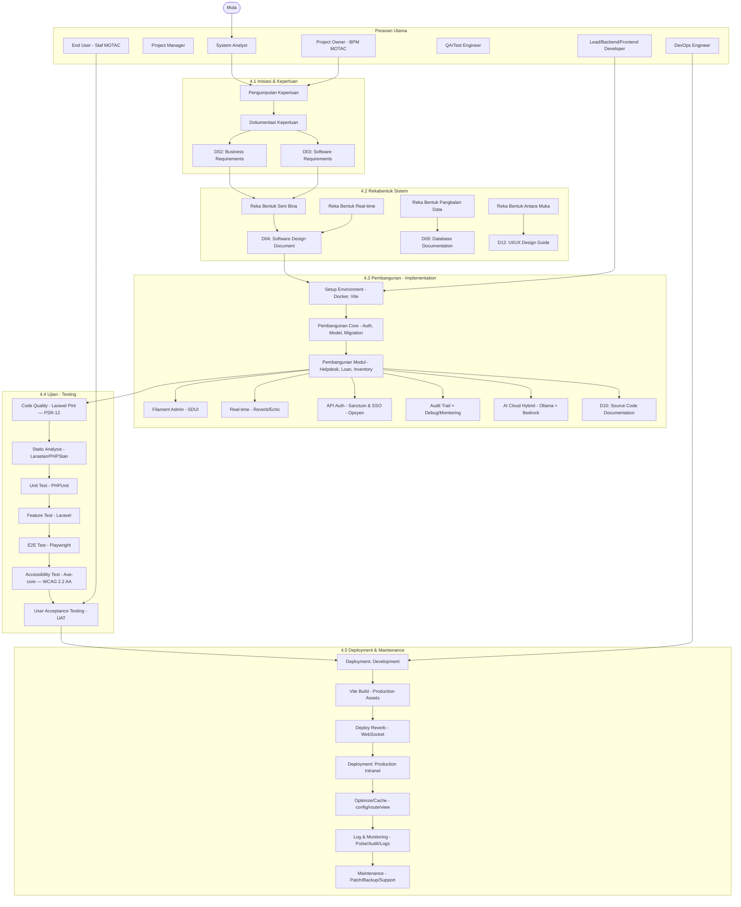
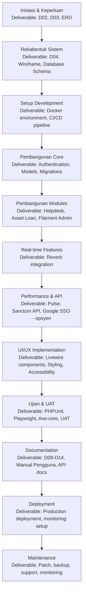
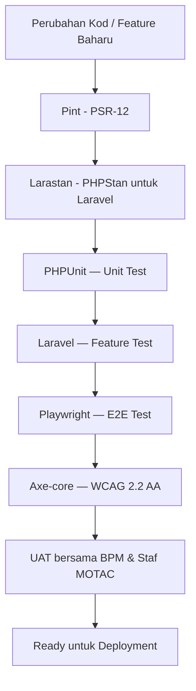

# Rajah Aliran Pembangunan Sistem (System Development Flow) ICTServe v3.6.1

Rajah di bawah memodelkan aliran pembangunan ICTServe berdasarkan Pelan Pembangunan Sistem v3.6.1.

Sumber utama: `_reference/versions/v3.6.1_D01_SYSTEM_DEVELOPMENT_PLAN.md`

---

## SDF-ICT-0 — Gambaran Keseluruhan SDLC (Fasa 4.1–4.5)

---

## SDF-ICT-1 — Aliran Milestone & Deliverable (Seksyen 6)

---

## SDF-ICT-QA — Quality Gates (Ujian, Analisis Statik, Aksesibiliti)

---

## SDF-ICT-AI — Aliran Pembangunan AI (Seksyen 6.1)

```mermaid
flowchart TD
    AI_START([Mula: Keperluan AI - D18])

    AI1[Fasa 1: Asas & Infrastruktur\nDeliverable: OllamaClient, config/ollama.php, health checks]
    AI2[Fasa 2: Skema Pangkalan Data\nDeliverable: Faq/Document/MessageLog models + migrations]
    AI3[Fasa 3: Core AI Services\nDeliverable: RagService, DocumentService, EmbeddingService]
    AI4[Fasa 4: Background Jobs\nDeliverable: DocumentIngestJob, EmbeddingJob, queue setup]
    AI5[Fasa 5: API Endpoints\nDeliverable: Controllers + routes]
    AI6[Fasa 6: Filament Admin\nDeliverable: Resources, widgets]
    AI7[Fasa 7: Security & Compliance\nDeliverable: PIIDetectionService, policies, audit]
    AI8[Fasa 8: Livewire Components\nDeliverable: FaqBot, widget, chat UI]
    AI9[Fasa 9: Email Notifications\nDeliverable: ApprovalEmailToken, signed URLs]
    AI10[Fasa 10: Performance Optimization\nDeliverable: Redis caching, Pulse integration]
    AI11[Fasa 11: Testing & Documentation\nDeliverable: Tests + API docs]
    AI12[Fasa 12: Deployment & Monitoring\nDeliverable: Health checks, alerting, production setup]
    AI13[Fasa 13: Cloud Hybrid AI - Bedrock\nDeliverable: BedrockService, ModelRouter, hybrid responses]

    AI_START --> AI1 --> AI2 --> AI3 --> AI4 --> AI5 --> AI6 --> AI7 --> AI8 --> AI9 --> AI10 --> AI11 --> AI12 --> AI13
```

